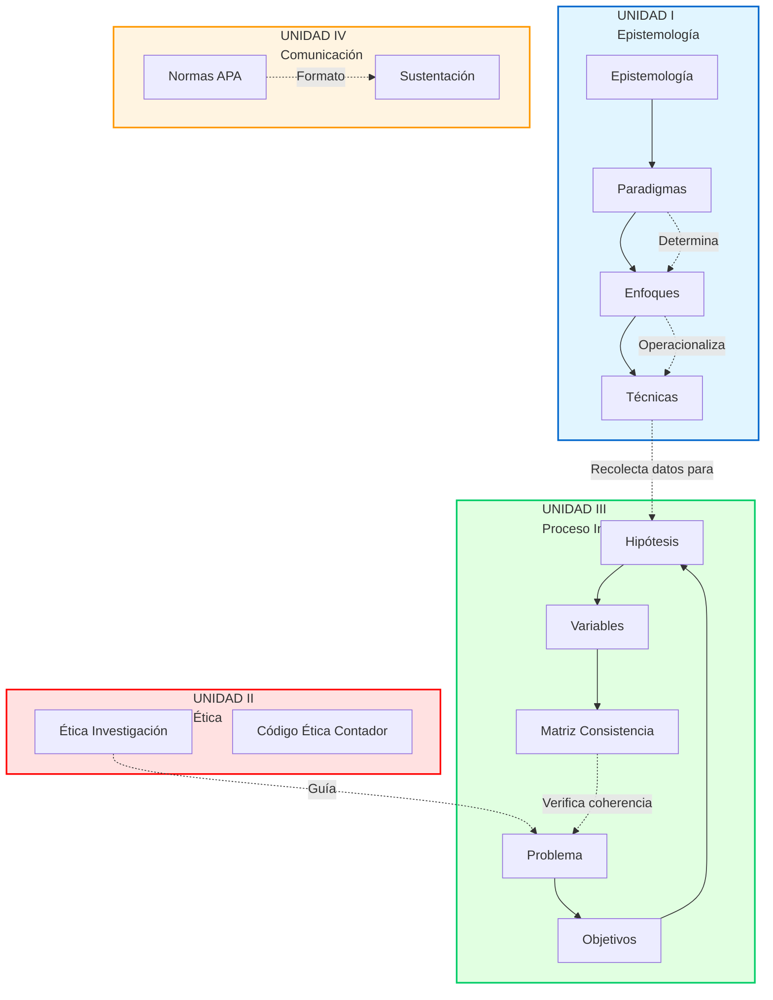

# Investigación Académica - Índice General

## Descripción del Curso

Curso que desarrolla competencias para **aplicar fundamentos de investigación científica**, elaborando proyectos de investigación con rigor metodológico mediante el método científico, para la formación profesional del contador público.

---

## Competencias Clave

1. Analizar el **rol de la universidad** en la sociedad del conocimiento
2. Aplicar **aspectos éticos** durante la investigación
3. Elaborar **proyectos de investigación** con método científico
4. **Sustentar investigaciones** con prestancia y rigor

---

## Cronograma (16 Semanas)

| Semana | Unidad | Tema | Evaluación |
|--------|--------|------|------------|
| 1 | I | Universidad como centro de conocimiento (MESM UNMSM) | - |
| 2 | I | Epistemología, ciencia, conocimiento científico | - |
| 3 | I | Paradigmas (positivista, naturalista), Enfoques (cuanti, cuali, mixto) | - |
| 4 | I | Técnicas e instrumentos de investigación | **PC1**: Mapa conceptual |
| 5 | II | Ética y moral en investigación | - |
| 6 | II | Programas y líneas de investigación contable | - |
| 7 | II | Código de ética del contador en investigación | - |
| 8 | II | **EXAMEN PARCIAL** | **Examen** |
| 9 | III | Protocolo, problema de investigación | - |
| 10 | III | Justificación, objetivos, hipótesis, variables | - |
| 11 | III | Marco teórico (antecedentes, bases teóricas) | - |
| 12 | III | Operacionalización de variables | **PC2**: Proyecto preliminar |
| 13 | IV | Cronograma, redacción, normas APA 7 | - |
| 14 | IV | Comunicación de la investigación | - |
| 15 | IV | Informe preliminar y final | - |
| 16 | IV | **EXAMEN FINAL** | **Sustentación** |

---

## Estructura del Curso

### [[01-indice-unidad-1-epistemologia|Unidad I: Sociedad, Universidad e Investigación]]

**Notas atómicas:**
1. [[universidad-investigacion]] - Universidad como centro de conocimiento, MESM
2. [[conocimiento-cientifico]] - Características del saber científico
3. [[epistemologia]] - Teoría del conocimiento científico
4. [[paradigmas-investigacion]] - Positivista vs Naturalista
5. [[enfoques-investigacion]] - Cuantitativo, cualitativo, mixto
6. [[tecnicas-instrumentos]] - Herramientas de recolección de datos

**Competencia:** Analizar rol de la universidad en sociedad del conocimiento, comprender fundamentos epistemológicos.

---

### [[02-indice-unidad-2-etica|Unidad II: Aspectos Éticos de la Investigación]]

**Notas atómicas:**
1. [[etica-investigacion]] - Principios de Belmont (autonomía, beneficencia, justicia)
2. [[lineas-investigacion-contable]] - 8 líneas prioritarias UNMSM
3. [[codigo-etica-contador]] - Código IESBA aplicado a investigación
4. [[consentimiento-informado]] - Protección de participantes

**Competencia:** Aplicar principios éticos durante proceso de investigación, respetar derechos de participantes.

---

### [[03-indice-unidad-3-proceso|Unidad III: El Proceso de Investigación]]

**Notas atómicas:**
1. [[tipos-niveles-investigacion]] - Básica vs aplicada, niveles de profundidad
2. [[problema-investigacion]] - Formulación del problema
3. [[objetivos-investigacion]] - Objetivos con verbos de Bloom
4. [[marco-teorico]] - Antecedentes, bases teóricas, marco conceptual
5. [[hipotesis]] - H₀, H₁, pruebas estadísticas
6. [[operacionalizacion-variables]] - Variable → Dimensión → Indicador
7. [[diseno-investigacion]] - Experimental vs no experimental
8. [[poblacion-muestra]] - Muestreo y cálculo muestral
9. [[matriz-consistencia]] - Coherencia metodológica

**Competencia:** Elaborar proyecto de investigación aplicando método científico.

---

### [[04-indice-unidad-4-redaccion|Unidad IV: Redacción y Sustentación]]

**Notas atómicas:**
1. [[normas-apa]] - APA 7ª edición (citas, referencias, formato)
2. [[sustentacion]] - Defensa oral de investigación

**Competencia:** Redactar informe según normas APA y sustentar con prestancia.

---

## Resumen de Contenido

| Unidad | Notas | Palabras aprox. | Enfoque |
|--------|-------|-----------------|---------|
| **I - Epistemología** | 6 | ~2,550 | Fundamentos filosóficos y metodológicos |
| **II - Ética** | 4 | ~2,120 | Principios éticos y responsabilidad profesional |
| **III - Proceso** | 9 | ~4,710 | Protocolo completo de investigación |
| **IV - Redacción** | 2 | ~1,050 | Comunicación científica |
| **TOTAL** | **21 notas** | **~10,430 palabras** | **Curso completo** |

---

### [[03-indice-unidad-3-proceso|Unidad III: Proceso de Investigación]]

**Notas atómicas:**
1. [[problema-investigacion]] - Planteamiento y formulación
2. [[objetivos-investigacion]] - General y específicos
3. [[hipotesis]] - Proposiciones contrastables
4. [[operacionalizacion-variables]] - Medición de variables
5. [[matriz-consistencia]] - Coherencia investigativa

**Total: 5 notas**

---

### [[04-indice-unidad-4-redaccion|Unidad IV: Redacción y Sustentación]]

**Notas atómicas:**
1. [[normas-apa]] - APA 7ma edición (citas, referencias)
2. [[sustentacion]] - Defensa oral del proyecto

**Total: 2 notas**

---

## Mapa Conceptual del Curso

---

## Resumen de Notas

| Unidad | Notas | Enfoque |
|--------|-------|---------|
| **I** | 4 | Fundamentos epistemológicos |
| **II** | 2 | Integridad científica |
| **III** | 5 | Diseño metodológico |
| **IV** | 2 | Comunicación científica |
| **TOTAL** | **13 notas** | Metodología integral |

---

## Conexión con Práctica Contable

**Ejemplos de Investigaciones Tipo (UNMSM):**

1. **Correlacional:**
   - "Auditoría interna y prevención de fraude en bancos, Lima, 2024"
   - Método: Encuesta, correlación Pearson

2. **Explicativa:**
   - "Efecto de NIIF 16 en ratios de endeudamiento, sector retail, 2023"
   - Método: Análisis documental, prueba t

3. **Cualitativa:**
   - "Percepciones de contadores sobre dilemas éticos, empresas familiares, Cusco"
   - Método: Entrevistas semiestructuradas, análisis categorial

---

## Productos del Curso

### PC1 (Semana 4)
**Mapa conceptual:** Sociedad, Universidad e Investigación

### PC2 (Semana 12)
**Proyecto preliminar:** Protocolo completo con:
- Problema, objetivos, hipótesis
- Matriz de consistencia
- Operacionalización de variables

### Examen Final (Semana 16)
**Sustentación:** Presentación oral 15-20 min + preguntas jurado

---

## Normativa UNMSM

- **Reglamento de Grados y Títulos** (2021)
- **Líneas de Investigación** Facultad Ciencias Contables:
  1. Contabilidad financiera y NIC/NIIF
  2. Auditoría y control
  3. Tributación
  4. Costos y gestión
  5. Finanzas corporativas

---

*Última actualización: Enero 2025*  
*Universidad: UNMSM - Ciencias Contables*  
*Ciclo: II*

[[INVESTIGACION_ACADEMICA|← Volver al Sílabo]]
