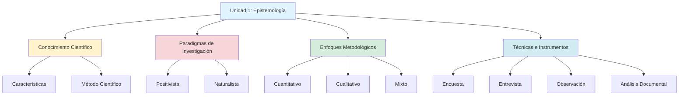

# Unidad 1: Sociedad, Universidad e Investigación Científica

**Semanas:** 1-4  
**Competencia:** Comprender los fundamentos epistemológicos y metodológicos de la investigación científica aplicada a las ciencias contables.

---

## Mapa Conceptual

---

## Notas Atómicas de la Unidad

| # | Nota | Palabras | Concepto Clave |
|---|------|----------|----------------|
| 1 | [[universidad-investigacion]] | ~650 | Universidad como centro de conocimiento, MESM |
| 2 | [[conocimiento-cientifico]] | ~400 | Naturaleza del saber científico vs empírico |
| 3 | [[epistemologia]] | ~350 | Filosofía de la ciencia, validez del conocimiento |
| 4 | [[paradigmas-investigacion]] | ~380 | Positivista vs Naturalista |
| 5 | [[enfoques-investigacion]] | ~450 | Cuantitativo, Cualitativo, Mixto |
| 6 | [[tecnicas-instrumentos]] | ~320 | Herramientas de recolección de datos |

**Total:** 6 notas | ~2,550 palabras

---

## Cronograma de Contenidos

| Semana | Tema | Actividad | Evaluación |
|--------|------|-----------|------------|
| **1** | Conocimiento científico y epistemología | Lectura: Bunge (1983) | Foro: Diferencias conocimiento empírico vs científico |
| **2** | Paradigmas de investigación | Comparar estudios positivistas y naturalistas en contabilidad | - |
| **3** | Enfoques metodológicos | Diseñar mini-investigación cuantitativa, cualitativa y mixta | - |
| **4** | Técnicas e instrumentos | Diseñar cuestionario piloto para tema de interés | **PC1** (30% de Parcial) |

---

## Competencias Específicas

Al finalizar la Unidad 1, el estudiante será capaz de:

✅ **Distinguir** conocimiento científico de otros tipos de conocimiento  
✅ **Identificar** el paradigma y enfoque de un estudio publicado  
✅ **Seleccionar** técnicas e instrumentos apropiados según problema de investigación  
✅ **Argumentar** la validez de un diseño metodológico en contexto contable  

---

## Lecturas Obligatorias

1. **Bunge, M.** (1983). *La investigación científica*. Ariel. [Capítulo 1]
2. **Hernández-Sampieri, R.** (2018). *Metodología de la investigación* (7ª ed.). McGraw-Hill. [Capítulos 1-3]
3. **Guba, E. & Lincoln, Y.** (1994). Competing paradigms in qualitative research. *Handbook of Qualitative Research*, 105-117.

---

## Ejemplo de Tesis UNMSM (Aplicación Unidad 1)

**Título:** "Auditoría interna y gestión de riesgos en el sector bancario peruano, 2020-2021"

- **Paradigma:** Positivista (busca relaciones causales)
- **Enfoque:** Cuantitativo (correlacional)
- **Técnica:** Encuesta (cuestionario escala Likert)
- **Instrumento:** Cuestionario de 40 ítems (20 auditoría interna, 20 gestión de riesgos)
- **Validación:** Juicio de 3 expertos + Alfa de Cronbach (α=0.89)

---

## Conexiones Interdisciplinarias

- [[Filosofía de la Ciencia]] - Origen epistemológico de paradigmas
- [[Estadística]] - Fundamento del enfoque cuantitativo
- [[Sociología]] - Base del enfoque cualitativo interpretativo
- [[Normas Internacionales de Contabilidad]] - Conocimiento científico aplicado (NIC/NIIF)

---

## Recursos Adicionales

📹 **Video recomendado:** "Paradigmas de investigación" (Dr. Ñaupas, UNMSM) - 15 min  
📊 **Plantilla:** Matriz de elección de enfoque metodológico (incluye árbol de decisión)  
📚 **Biblioteca virtual UNMSM:** Acceso a EBSCO, ProQuest para papers contables  

---

*Última actualización: Ciclo 2024-I*  
*Docente: Dr. [Nombre del docente de Investigación Académica]*
