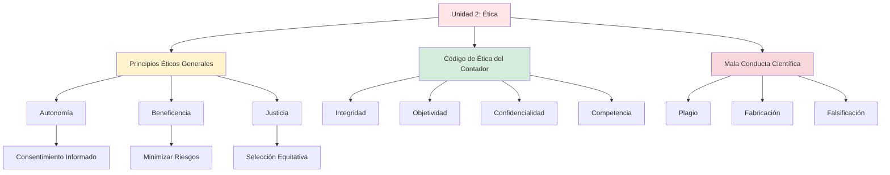

# Unidad 2: Aspectos Éticos de la Investigación

**Semanas:** 5-8  
**Competencia:** Aplicar principios éticos en todas las fases del proceso de investigación contable, respetando derechos de participantes y normativa profesional.

---

## Mapa Conceptual

---

## Notas Atómicas de la Unidad

| # | Nota | Palabras | Concepto Clave |
|---|------|----------|----------------|
| 1 | [[etica-investigacion]] | ~400 | Principios Belmont: autonomía, beneficencia, justicia |
| 2 | [[lineas-investigacion-contable]] | ~720 | 8 líneas de investigación UNMSM, prioridades nacionales |
| 3 | [[codigo-etica-contador]] | ~420 | IESBA, principios profesionales del contador |
| 4 | [[consentimiento-informado]] | ~580 | Documento para participación voluntaria, elementos clave |

**Total:** 4 notas | ~2,120 palabras

---

## Cronograma de Contenidos

| Semana | Tema | Actividad | Evaluación |
|--------|------|-----------|------------|
| **5** | Principios éticos generales (Belmont) | Casos de dilemas éticos en investigación | - |
| **6** | Código de ética del contador público | Análisis de casos de mala conducta científica | - |
| **7** | Comités de ética y consentimiento informado | Diseñar formato de consentimiento informado | - |
| **8** | Repaso y evaluación | Simulacro de examen parcial | **EXAMEN PARCIAL** |

---

## Principios Éticos Aplicados a Contabilidad

### Autonomía
**En investigación contable:**
- Participantes (contadores, gerentes) deciden libremente si participan
- Deben entender el propósito del estudio
- Pueden retirarse en cualquier momento sin consecuencias

**Ejemplo:**
> "Investigamos la relación entre control interno y fraude. Su participación es voluntaria. Puede negarse a responder preguntas específicas. Los datos se usarán solo para fines académicos."

---

### Beneficencia
**En investigación contable:**
- Minimizar riesgos para participantes (ej: no exponer prácticas ilegales que causen sanciones)
- Maximizar beneficios (ej: resultados que mejoren gestión tributaria de MYPE)

**Ejemplo:**
- ❌ **Antiético:** Publicar nombres de empresas que evaden impuestos (riesgo SUNAT)
- ✅ **Ético:** Reportar hallazgos agregados sin identificar empresas específicas

---

### Justicia
**En investigación contable:**
- No excluir grupos vulnerables sin justificación
- No sobrecargar a poblaciones fácilmente accesibles

**Ejemplo:**
- ❌ **Injusto:** Solo investigar grandes empresas (sesgo de selección)
- ✅ **Justo:** Incluir MYPE, medianas y grandes en proporción al sector

---

## Mala Conducta Científica en Tesis Contables

| Conducta | Descripción | Ejemplo Contable | Sanción UNMSM |
|----------|-------------|------------------|---------------|
| **Plagio** | Copiar sin citar | Copiar marco teórico de tesis anterior sin citar | Anulación de tesis + suspensión 12 meses |
| **Fabricación** | Inventar datos | Crear respuestas de cuestionario sin encuestar | Expulsión definitiva |
| **Falsificación** | Alterar resultados | Cambiar p-valor de 0.08 a 0.04 para "aceptar" hipótesis | Anulación de título |
| **Autoplagio** | Copiar tu trabajo previo sin citar | Usar tu monografía de Costos en tesis sin citar | Amonestación |

---

## Comité de Ética UNMSM

**Funciones:**
- Revisar protocolos de investigación antes de iniciar
- Verificar que haya consentimiento informado
- Proteger derechos de participantes
- Investigar denuncias de mala conducta

**¿Cuándo necesitas aprobación del comité?**
- ✅ Investigación con encuestas/entrevistas a personas
- ✅ Análisis de datos sensibles de empresas
- ❌ Análisis de datos públicos (SUNAT, SMV, MEF)

---

## Competencias Específicas

Al finalizar la Unidad 2, el estudiante será capaz de:

✅ **Identificar** dilemas éticos en investigación contable  
✅ **Aplicar** principios Belmont en diseño de estudio  
✅ **Redactar** consentimiento informado apropiado  
✅ **Evitar** plagio mediante citación correcta (APA 7)  
✅ **Declarar** conflictos de interés en investigación  

---

## Lecturas Obligatorias

1. **Belmont Report** (1979). *Principios éticos y directrices para la protección de sujetos humanos*. [Traducción oficial]
2. **Junta de Decanos de Colegios de Contadores Públicos del Perú** (2022). *Código de Ética del Contador Público Peruano*.
3. **UNMSM** (2020). *Reglamento del Comité de Ética en Investigación*.

---

## Ejemplo de Caso Ético

**Situación:**
Investigas "Evasión tributaria en comerciantes de Gamarra". Durante entrevistas, un comerciante admite que no emite comprobantes (evasión).

**Dilema:**
- ¿Reportas a SUNAT? (violarías confidencialidad)
- ¿Omites el dato? (sesgo de información)

**Solución ética:**
1. **Antes de la entrevista:** Consentimiento informado que aclara: "Información será confidencial y anónima. No se reportará a autoridades."
2. **En el análisis:** Reportar hallazgo agregado: "58% de entrevistados admitió no emitir comprobantes" (sin nombres).
3. **Recomendaciones:** Sugerir políticas públicas de formalización (beneficencia).

---

## Recursos Adicionales

📄 **Formato:** Consentimiento informado para investigación contable (plantilla UNMSM)  
📚 **Lectura complementaria:** Resnik, D. (2015). *What is ethics in research & why is it important?* (NIH)  
🌐 **Portal:** Comité de Ética UNMSM - Formularios de aprobación  

---

## Conexiones

- [[normas-apa]] - Citar correctamente es ética en redacción
- [[problema-investigacion]] - Identificar problema no debe vulnerar derechos
- [[sustentacion]] - Declarar limitaciones éticas en defensa

---

*Última actualización: Ciclo 2024-I*  
*Nota: Toda investigación UNMSM debe respetar Código de Ética de Investigación (R.R. 01281-R-20)*
