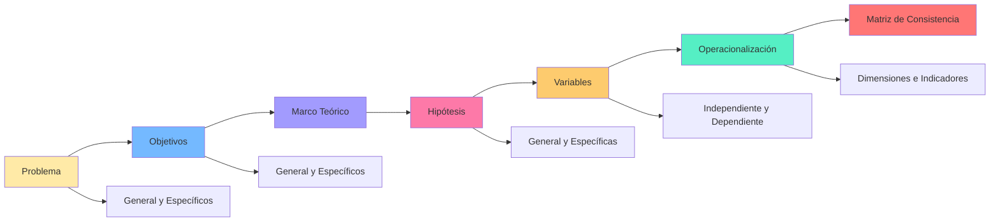

# Unidad 3: El Proceso de Investigación Científica

**Semanas:** 9-12  
**Competencia:** Diseñar un protocolo de investigación contable coherente, aplicando correctamente el método científico desde la formulación del problema hasta la operacionalización de variables.

---

## Mapa Conceptual



---

## Notas Atómicas de la Unidad

| # | Nota | Palabras | Concepto Clave |
|---|------|----------|----------------|
| 1 | [[tipos-niveles-investigacion]] | ~620 | Básica vs aplicada, exploratorio-descriptivo-correlacional-explicativo |
| 2 | [[problema-investigacion]] | ~380 | Formulación problema general y específicos |
| 3 | [[objetivos-investigacion]] | ~420 | Objetivos con verbos de Bloom |
| 4 | [[marco-teorico]] | ~580 | Antecedentes, bases teóricas, marco conceptual |
| 5 | [[hipotesis]] | ~450 | H₀, H₁, pruebas estadísticas |
| 6 | [[operacionalizacion-variables]] | ~480 | Variable → Dimensión → Indicador → Ítem |
| 7 | [[diseno-investigacion]] | ~680 | Experimental vs no experimental, transversal vs longitudinal |
| 8 | [[poblacion-muestra]] | ~750 | Muestreo probabilístico/no probabilístico, cálculo muestral |
| 9 | [[matriz-consistencia]] | ~350 | Coherencia entre problema-objetivo-hipótesis-variable |

**Total:** 9 notas | ~4,710 palabras

---

## Cronograma de Contenidos

| Semana | Tema | Actividad | Evaluación |
|--------|------|-----------|------------|
| **9** | Formulación del problema y objetivos | Redactar problema y objetivos de tema elegido | - |
| **10** | Marco teórico | Buscar 5 antecedentes (2 internacionales, 3 nacionales) | - |
| **11** | Hipótesis y variables | Plantear hipótesis y definir variables | - |
| **12** | Operacionalización y matriz de consistencia | Completar matriz de operacionalización | **PC2** (30% de Final) |

---

## Estructura del Capítulo I (Planteamiento del Problema)

```
CAPÍTULO I: PLANTEAMIENTO DEL PROBLEMA

1.1 Descripción de la Realidad Problemática
    - Contexto general (internacional, nacional, local)
    - Evidencia del problema (estadísticas, reportes)
    - Consecuencias del problema
    
1.2 Delimitación de la Investigación
    1.2.1 Delimitación Espacial: Lima Metropolitana, Gamarra
    1.2.2 Delimitación Temporal: 2020-2023
    1.2.3 Delimitación Social: MYPE textiles

1.3 Problemas de Investigación
    1.3.1 Problema General
    1.3.2 Problemas Específicos
    
1.4 Objetivos de la Investigación
    1.4.1 Objetivo General
    1.4.2 Objetivos Específicos
    
1.5 Justificación e Importancia
    1.5.1 Justificación Teórica
    1.5.2 Justificación Práctica
    1.5.3 Justificación Metodológica
    
1.6 Limitaciones del Estudio
    - Acceso a información (empresas recelosas)
    - Recursos económicos (para encuestadores)
    - Tiempo (un semestre académico)
```

---

## Ejemplo Completo de Problema → Matriz

**Tema:** Gestión tributaria y rentabilidad en MYPE textiles de Gamarra

### 1. Problema General
¿De qué manera la gestión tributaria se relaciona con la rentabilidad de las MYPE textiles del Emporio Comercial de Gamarra, periodo 2021-2023?

### 2. Objetivo General
Determinar la relación entre la gestión tributaria y la rentabilidad de las MYPE textiles del Emporio Comercial de Gamarra, periodo 2021-2023.

### 3. Hipótesis General
La gestión tributaria se relaciona significativamente con la rentabilidad de las MYPE textiles del Emporio Comercial de Gamarra, periodo 2021-2023.

### 4. Variables
- **V.I. (X):** Gestión Tributaria
  - **D1:** Planificación tributaria
  - **D2:** Cumplimiento tributario
  
- **V.D. (Y):** Rentabilidad
  - **D1:** Rentabilidad económica (ROA)
  - **D2:** Rentabilidad financiera (ROE)

### 5. Operacionalización

| Variable | Dimensión | Indicador | Ítem (Cuestionario) |
|----------|-----------|-----------|---------------------|
| Gestión Tributaria (X) | Planificación tributaria | % ahorro fiscal | ¿La empresa planifica sus pagos para aprovechar deducciones? |
| | | Días de anticipación | ¿Con cuántos días de anticipación prepara declaraciones? |
| | Cumplimiento tributario | % declaraciones a tiempo | ¿Declara IGV a tiempo? |
| | | N° infracciones SUNAT | ¿Cuántas multas recibió en 2023? |
| Rentabilidad (Y) | ROA | Utilidad neta / Activo total | ¿Cuál fue su utilidad neta 2023? ¿Activo total 2023? |
| | ROE | Utilidad neta / Patrimonio | ¿Cuál fue su patrimonio 2023? |

### 6. Matriz de Consistencia

| Problema | Objetivo | Hipótesis | Variables | Metodología |
|----------|----------|-----------|-----------|-------------|
| ¿Relación gestión tributaria-rentabilidad? | Determinar relación | Existe relación significativa | V.I.: Gestión tributaria<br>V.D.: Rentabilidad | Tipo: Aplicada<br>Nivel: Correlacional<br>Diseño: No experimental transversal<br>Población: 5,200 MYPE Gamarra<br>Muestra: 357 MYPE<br>Técnica: Encuesta<br>Instrumento: Cuestionario |

---

## Errores Comunes en el Proceso

| Fase | Error | Ejemplo | Corrección |
|------|-------|---------|------------|
| **Problema** | Muy amplio | "¿Cómo mejorar la economía?" | "¿Relación entre gestión tributaria y rentabilidad en MYPE textiles Gamarra 2021-2023?" |
| **Objetivo** | Verbo vago | "Conocer la gestión tributaria" | "Determinar la relación entre..." |
| **Hipótesis** | Sin variable dependiente | "La gestión tributaria es importante" | "Gestión tributaria se relaciona con rentabilidad" |
| **Variables** | Sin operacionalizar | "Variable: Gestión tributaria" (solo eso) | Dimensiones: Planificación, Cumplimiento → Indicadores |
| **Matriz** | Incoherencia | Problema habla de "influencia" pero objetivo dice "describir" | Alinear: si problema pregunta "relación", objetivo debe "determinar relación" |

---

## Competencias Específicas

Al finalizar la Unidad 3, el estudiante será capaz de:

✅ **Formular** problema de investigación contable delimitado (espacial, temporal, social)  
✅ **Redactar** objetivos alineados con verbos de Bloom apropiados  
✅ **Plantear** hipótesis contrastables estadísticamente  
✅ **Operacionalizar** variables en dimensiones, indicadores e ítems  
✅ **Verificar** coherencia interna mediante matriz de consistencia  

---

## Lecturas Obligatorias

1. **Hernández-Sampieri, R.** (2018). *Metodología de la investigación* (7ª ed.). McGraw-Hill. [Capítulos 4-7]
2. **Ñaupas, H., Mejía, E., Novoa, E. & Villagómez, A.** (2014). *Metodología de la investigación cuantitativa-cualitativa y redacción de la tesis* (4ª ed.). Ediciones de la U. [Capítulos 5-8]
3. **Valderrama, S.** (2013). *Pasos para elaborar proyectos de investigación científica*. San Marcos.

---

## Recursos Adicionales

📄 **Plantilla:** Matriz de operacionalización de variables (Excel)  
📄 **Plantilla:** Matriz de consistencia (Word)  
📊 **Calculadora:** Tamaño muestral para estudios correlacionales  
🔍 **Tutorial:** Búsqueda de antecedentes en EBSCO/ProQuest  

---

## Ejemplo de Tesis UNMSM Completa

**Título:** "Sistema de control interno y gestión de inventarios en empresas comerciales de Lima, 2022"

- **Problema:** ¿Cómo el sistema de control interno se relaciona con la gestión de inventarios?
- **Objetivo:** Determinar la relación entre sistema de control interno y gestión de inventarios
- **Hipótesis:** El sistema de control interno se relaciona significativamente con la gestión de inventarios (ρ de Spearman, p<0.05)
- **V.I.:** Sistema control interno (Dimensiones: Ambiente control, Evaluación riesgos, Actividades control)
- **V.D.:** Gestión inventarios (Dimensiones: Planificación, Almacenamiento, Rotación)
- **Resultado:** ρ=0.72, p=0.001 → Se acepta hipótesis

---

## Conexiones

- [[etica-investigacion]] - Problema no debe vulnerar derechos
- [[normas-apa]] - Marco teórico requiere citas APA
- [[sustentacion]] - Defensa evalúa coherencia metodológica

---

*Última actualización: Ciclo 2024-I*  
*Esta unidad es la columna vertebral de la tesis - domínala y tu investigación será sólida*
