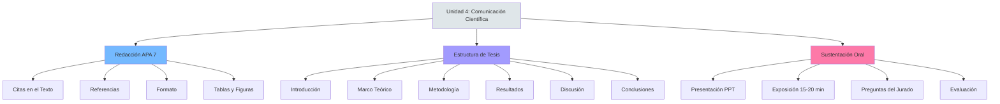

# Unidad 4: Redacción Científica y Sustentación

**Semanas:** 13-16  
**Competencia:** Redactar el informe final de investigación cumpliendo normas APA 7 y sustentar oralmente los hallazgos con argumentación sólida.

---

## Mapa Conceptual

---

## Notas Atómicas de la Unidad

| # | Nota | Palabras | Concepto Clave |
|---|------|----------|----------------|
| 1 | [[normas-apa]] | ~500 | Citas, referencias, formato APA 7ª edición |
| 2 | [[sustentacion]] | ~550 | Defensa oral de tesis, estructura, evaluación |

**Total:** 2 notas | ~1,050 palabras

---

## Cronograma de Contenidos

| Semana | Tema | Actividad | Evaluación |
|--------|------|-----------|------------|
| **13** | Normas APA 7: Citas y referencias | Práctica de citación (textual, paráfrasis) | - |
| **14** | Redacción científica: Estructura de tesis | Redactar Abstract en español e inglés | - |
| **15** | Sustentación: Técnicas de exposición | Simulacro de sustentación (10 min + preguntas) | - |
| **16** | Evaluación final | Sustentación de protocolo de investigación | **EXAMEN FINAL** (Sustentación) |

---

## Estructura de la Tesis (UNMSM - Ciencias Contables)

### Secciones Preliminares
- Carátula
- Dedicatoria (opcional)
- Agradecimientos (opcional)
- Índice general
- Índice de tablas
- Índice de figuras
- Resumen (español)
- Abstract (inglés)

### Capítulo I: Planteamiento del Problema
- Descripción de la realidad problemática
- Delimitación de la investigación
- Problemas de investigación
- Objetivos
- Justificación e importancia
- Limitaciones

### Capítulo II: Marco Teórico
- Antecedentes de la investigación
- Bases teóricas
- Marco conceptual

### Capítulo III: Metodología
- Tipo, nivel y diseño de investigación
- Población y muestra
- Técnicas e instrumentos de recolección
- Validez y confiabilidad
- Plan de análisis estadístico

### Capítulo IV: Resultados
- Análisis descriptivo (tablas, gráficos)
- Análisis inferencial (pruebas de hipótesis)
- Interpretación de resultados

### Capítulo V: Discusión
- Contrastación con antecedentes
- Limitaciones del estudio
- Implicaciones teóricas y prácticas

### Capítulo VI: Conclusiones y Recomendaciones
- Conclusiones (una por objetivo)
- Recomendaciones (sugerencias prácticas)

### Referencias
- Lista alfabética según APA 7

### Anexos
- Matriz de consistencia
- Instrumentos (cuestionario, guía entrevista)
- Validación de instrumentos
- Base de datos (opcional)
- Evidencias (fotos, documentos)

---

## Diferencias Clave APA 6 vs APA 7

| Elemento | APA 6ª | APA 7ª |
|----------|--------|--------|
| **Ubicación DOI** | doi:10.XXXX | https://doi.org/10.XXXX |
| **Autores** | Máximo 7, luego "et al." | Hasta 20 autores, luego "..." |
| **Fecha de consulta** | Recuperado el [fecha] de URL | No se usa (excepto si contenido cambia) |
| **Nivel de encabezado** | 5 niveles | 5 niveles (sin cambio), pero formato simplificado |
| **Tablas** | Título arriba, líneas horizontales | Título arriba, sin líneas verticales |

---

## Ejemplo de Citas APA 7 (Contabilidad)

### Cita Textual Corta (<40 palabras)
Según Horngren, Datar y Rajan (2015), "los costos fijos no cambian en total a pesar de cambios en el nivel de actividad" (p. 45).

### Cita Textual Larga (≥40 palabras)
> La NIC 36 establece el procedimiento para evaluar deterioro:
> 
> Un activo se encuentra deteriorado cuando su importe en libros excede su importe recuperable. El importe recuperable de un activo es el mayor entre su valor razonable menos los costos de disposición y su valor en uso. (IASB, 2020, párr. 6)

### Paráfrasis
La adopción de NIIF en Perú mejoró la transparencia financiera de empresas cotizadas en la BVL, permitiendo mayor comparabilidad internacional (Díaz & Torres, 2018).

---

## Ejemplo de Referencias APA 7

### Libro
Horngren, C. T., Datar, S. M., & Rajan, M. V. (2015). *Contabilidad de costos: Un enfoque gerencial* (15ª ed.). Pearson.

### Artículo de Revista
García, M., & López, R. (2022). Auditoría interna y detección de fraude corporativo. *Revista Española de Auditoría*, 28(3), 145-162. https://doi.org/10.1234/rea.2022.145

### Tesis
Ramírez, J. (2021). *Sistema de control interno y gestión financiera en MYPE de Lima Metropolitana* [Tesis de pregrado, Universidad Nacional Mayor de San Marcos]. Repositorio UNMSM. https://cybertesis.unmsm.edu.pe/handle/20.500.12672/16789

### Norma Internacional
International Accounting Standards Board. (2020). *NIC 36: Deterioro del valor de los activos*. IFRS Foundation.

### Página Web
Superintendencia Nacional de Aduanas y de Administración Tributaria. (2023, 15 de marzo). *Estadísticas de recaudación tributaria 2022*. https://www.sunat.gob.pe/estadisticas

---

## Sustentación: Estructura de Exposición (15-20 min)

### 1. Introducción (2 min)
- Saludo al jurado
- Título de la investigación
- Objetivo general
- Justificación breve (¿por qué es importante?)

### 2. Marco Teórico (3 min)
- 1-2 antecedentes clave
- Teoría principal que sustenta
- Definiciones operacionales

### 3. Metodología (4 min)
- Tipo, nivel, diseño
- Población y muestra (¿cómo se calculó?)
- Instrumento (mostrar extracto de cuestionario)
- Validación (Alfa de Cronbach, juicio de expertos)

### 4. Resultados (5 min)
- **Tabla/gráfico descriptivo:** "El 68% de MYPE no planifica tributariamente"
- **Prueba de hipótesis:** "ρ de Spearman = 0.72, p=0.001 < 0.05 → Se rechaza H₀"
- **Interpretación:** "Existe relación positiva significativa entre gestión tributaria y rentabilidad"

### 5. Conclusiones (3 min)
- Una conclusión por objetivo (máximo 3)
- Recomendaciones prácticas (1-2)

### 6. Cierre (1 min)
- Agradecimiento
- "Quedo a disposición para sus preguntas"

---

## Rúbrica de Evaluación de Sustentación

| Criterio | Excelente (18-20) | Bueno (14-17) | Regular (11-13) | Deficiente (0-10) |
|----------|-------------------|---------------|-----------------|-------------------|
| **Dominio del tema** | Responde todas las preguntas con fundamento | Responde mayoría, algunas dudas | Responde parcialmente | No sabe responder |
| **Claridad expositiva** | Exposición fluida, sin leer | Lee poco, explica bien | Lee constantemente | Ininteligible |
| **Manejo de tiempo** | 15-18 min exactos | 13-20 min | 10-13 o 20-25 min | <10 o >25 min |
| **Calidad de PPT** | Diagramas, tablas, mínimo texto | Tablas claras, algo de texto | Mucho texto | Solo texto |
| **Coherencia metodológica** | Matriz de consistencia perfecta | Pequeñas inconsistencias | Problema-objetivo desalineados | Incoherente |

---

## Preguntas Frecuentes del Jurado

### Sobre el Problema
❓ ¿Por qué este problema es relevante?  
✅ **Respuesta tipo:** "Según SUNAT, 70% de MYPE en Gamarra tiene contingencias tributarias. Investigar la relación con rentabilidad permite diseñar estrategias de formalización."

### Sobre la Metodología
❓ ¿Por qué eligió diseño no experimental?  
✅ **Respuesta tipo:** "No manipulé variables, solo observé correlación natural. No era ético ni factible asignar aleatoriamente gestión tributaria."

### Sobre los Resultados
❓ ¿Qué explica el 28% de varianza no explicada por su modelo?  
✅ **Respuesta tipo:** "Factores como ubicación del local, antigüedad del negocio, que no fueron considerados como variables. Es una limitación del estudio."

### Trampa Común
❓ ¿Cuál es el marco muestral que usó?  
❌ **Error:** "No sé"  
✅ **Correcto:** "Lista de MYPE registradas en la Municipalidad de La Victoria, base de 5,200 empresas, de donde saqué muestra probabilística de 357."

---

## Competencias Específicas

Al finalizar la Unidad 4, el estudiante será capaz de:

✅ **Citar** fuentes correctamente según APA 7 (textual, paráfrasis)  
✅ **Redactar** referencias bibliográficas completas (libro, artículo, tesis, web)  
✅ **Estructurar** informe final según formato UNMSM  
✅ **Exponer** investigación en 15-20 min con claridad  
✅ **Defender** metodología y resultados ante cuestionamientos del jurado  

---

## Lecturas Obligatorias

1. **American Psychological Association** (2020). *Publication Manual of the American Psychological Association* (7ª ed.). APA.
2. **UNMSM** (2021). *Guía para la elaboración de tesis de pregrado en Ciencias Contables*. Facultad de Ciencias Contables.
3. **Normas APA UNMSM** (2022). *Manual de citación y referencias bibliográficas* (actualizado a 7ª ed.).

---

## Recursos Adicionales

📄 **Plantilla:** Formato de tesis UNMSM (Word con estilos predefinidos)  
🎥 **Video tutorial:** Cómo hacer referencias APA 7 en Word automático  
🌐 **Generador APA:** https://www.scribbr.es/detector-de-plagio/generador-apa/ (verificar siempre)  
📊 **Plantilla PPT:** Diseño minimalista para sustentación (sin fondos recargados)  

---

## Ejemplo de Diapositivas (Estructura)

**Diapositiva 1:** Título, autor, asesor, fecha  
**Diapositiva 2:** Problema general (formulación en pregunta)  
**Diapositiva 3:** Objetivo general + justificación  
**Diapositiva 4:** Antecedentes (tabla: Autor, Año, Conclusión)  
**Diapositiva 5:** Teoría principal (diagrama conceptual)  
**Diapositiva 6:** Metodología (tabla resumen: tipo, diseño, muestra)  
**Diapositiva 7:** Instrumento (extracto de cuestionario, ítems clave)  
**Diapositiva 8:** Validación (tabla Alfa de Cronbach por variable)  
**Diapositiva 9:** Resultados descriptivos (gráfico de barras)  
**Diapositiva 10:** Prueba de hipótesis (tabla con ρ, p-valor, decisión)  
**Diapositiva 11:** Conclusiones (máximo 3, numeradas)  
**Diapositiva 12:** Recomendaciones (2-3)  
**Diapositiva 13:** "Gracias por su atención" + logo UNMSM  

---

## Errores Fatales en Sustentación

❌ **Leer las diapositivas palabra por palabra**  
✅ Diapositivas = apoyo visual (bullets, gráficos), tú explicas

❌ **No conocer tus propios datos**  
✅ Memoriza: n=357, ρ=0.72, p=0.001, α=0.89

❌ **Exceder 25 minutos**  
✅ Jurado puede cortarte y bajar nota

❌ **"No sé" como respuesta**  
✅ "Interesante pregunta, en mi estudio no abordé ese aspecto, pero sería recomendable para futuras investigaciones"

❌ **Pelear con el jurado**  
✅ "Tiene razón, lo tendré en cuenta en la versión final"

---

## Conexiones

- [[etica-investigacion]] - Declarar limitaciones en sustentación es ético
- [[matriz-consistencia]] - Jurado revisa coherencia problema-objetivo-hipótesis
- [[operacionalizacion-variables]] - Debes explicar cómo mediste cada variable

---

*Última actualización: Ciclo 2024-I*  
*La sustentación es tu momento de brillar - prepárate con anticipación*
