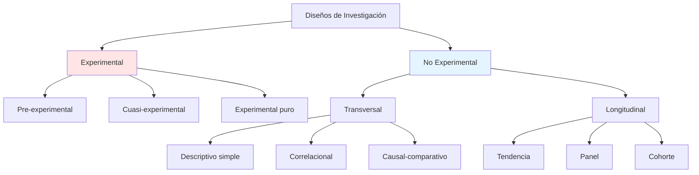

# Diseño de Investigación

## Definición

El **diseño de investigación** es el **plan o estrategia** que guía la recolección y análisis de datos para responder al problema de investigación. Define **cómo** se obtendrá la evidencia empírica.

---

## Clasificación de Diseños



---

## 1. Diseño Experimental

### Características

✅ **Manipulación:** Investigador modifica la variable independiente (tratamiento)  
✅ **Control:** Grupo experimental vs grupo control  
✅ **Aleatorización:** Asignación aleatoria a grupos  

### Ejemplo Contable (Raro en contabilidad)

**Pregunta:** ¿La capacitación en NIIF mejora la calidad de estados financieros?

**Diseño experimental puro:**
1. **Muestra:** 60 contadores de MYPE
2. **Aleatorización:** 30 al grupo experimental, 30 al grupo control
3. **Tratamiento:** Grupo experimental recibe curso NIIF (20 horas)
4. **Medición:** Ambos grupos preparan EEFF de caso ficticio
5. **Comparación:** Calidad de EEFF (errores, cumplimiento NIC)

**Notación:**
```
GE: R  O₁  X  O₂
GC: R  O₃  -  O₄

GE = Grupo experimental
GC = Grupo control
R = Aleatorización
O = Observación/medición
X = Tratamiento (capacitación)
- = Sin tratamiento
```

**Limitaciones en contabilidad:**
- ❌ No ético manipular decisiones financieras reales
- ❌ Difícil asignar aleatoriamente empresas a "tratamientos"
- ✅ Útil en estudios educativos (métodos de enseñanza)

---

## 2. Diseño No Experimental

### Características

❌ **Sin manipulación:** Observas fenómenos tal como ocurren naturalmente  
❌ **Sin control:** No hay grupo control  
✅ **Observación:** Analizas relaciones existentes  

**La mayoría de tesis contables son NO EXPERIMENTALES.**

---

### 2.1 Diseño Transversal (Transeccional)

**Definición:** Recolecta datos en **un solo momento** (fotografía).

#### 2.1.1 Transversal Descriptivo Simple

**Objetivo:** Describir características de una variable.

**Ejemplo:**
> "Nivel de conocimiento de NIIF en contadores de MYPE de Gamarra, 2023"

**Diagrama:**
```
M → O

M = Muestra (150 contadores)
O = Observación (cuestionario de conocimiento NIIF)
```

**Resultados típicos:**
- "68% tiene conocimiento bajo de NIIF"
- "25% medio, 7% alto"

---

#### 2.1.2 Transversal Correlacional

**Objetivo:** Determinar relación entre dos o más variables.

**Ejemplo:**
> "Gestión tributaria y rentabilidad en MYPE textiles de Gamarra, 2023"

**Diagrama:**
```
M → O₁, O₂

M = Muestra (357 MYPE)
O₁ = Gestión tributaria (cuestionario)
O₂ = Rentabilidad (ROA, ROE)
```

**Análisis:** Correlación de Spearman (ρ)

**Resultados típicos:**
- "ρ = 0.72, p < 0.01 → Correlación positiva significativa"

---

#### 2.1.3 Transversal Causal-Comparativo

**Objetivo:** Comparar grupos que difieren en una característica preexistente.

**Ejemplo:**
> "Calidad de EEFF en empresas que usan ERP vs empresas que usan Excel, 2023"

**Diagrama:**
```
G₁ → O₁
G₂ → O₂

G₁ = Empresas con ERP (n=50)
G₂ = Empresas con Excel (n=50)
O₁, O₂ = Calidad de EEFF (errores contables)
```

**Análisis:** Prueba U de Mann-Whitney

**Resultados típicos:**
- "Empresas con ERP tienen significativamente menos errores (p=0.003)"

---

### 2.2 Diseño Longitudinal

**Definición:** Recolecta datos en **varios momentos** (película).

**Ventaja:** Analiza cambios y evolución en el tiempo.

---

#### 2.2.1 Diseño de Tendencia

**Objetivo:** Estudiar cambios en una población general a lo largo del tiempo.

**Ejemplo:**
> "Evolución de la adopción de facturación electrónica en MYPE peruanas, 2018-2023"

**Procedimiento:**
- Cada año, encuestar muestra diferente de MYPE
- Analizar tendencia: % que usa facturación electrónica

**Resultados típicos:**
- 2018: 12% → 2023: 78% (tendencia creciente)

---

#### 2.2.2 Diseño de Panel

**Objetivo:** Estudiar **los mismos participantes** en diferentes momentos.

**Ejemplo:**
> "Impacto de pandemia COVID-19 en rentabilidad de restaurantes de Lima, 2019-2022"

**Procedimiento:**
- Seleccionar 100 restaurantes en 2019
- Medir ROE en: 2019, 2020, 2021, 2022
- Analizar: ¿Cómo cambió la rentabilidad de LOS MISMOS restaurantes?

**Diagrama:**
```
M → O₁ (2019) → O₂ (2020) → O₃ (2021) → O₄ (2022)
```

**Resultados típicos:**
- ROE promedio: 2019 (18%) → 2020 (-12%) → 2021 (5%) → 2022 (14%)

**Desafío:** Mortalidad (empresas que cierran, abandonan estudio)

---

#### 2.2.3 Diseño de Cohorte

**Objetivo:** Seguir a un grupo específico (cohorte) a lo largo del tiempo.

**Ejemplo:**
> "Trayectoria laboral de egresados UNMSM Contabilidad, promoción 2018"

**Procedimiento:**
- Cohorte: Egresados 2018 (n=200)
- Medir en 2019, 2021, 2023: Empleo, salario, cargo
- Analizar: ¿Cómo evoluciona su carrera profesional?

---

## Comparación: Transversal vs Longitudinal

| Característica | Transversal | Longitudinal |
|----------------|-------------|--------------|
| **Tiempo de recolección** | Un solo momento | Varios momentos |
| **Costo** | Bajo | Alto (seguimiento prolongado) |
| **Duración** | Semanas/meses | Años |
| **Mortalidad** | No aplica | Riesgo alto (participantes abandonan) |
| **Análisis causal** | Limitado (correlación) | Mejor (cambios en el tiempo) |
| **Ejemplo** | Gestión tributaria y rentabilidad 2023 | Impacto NIIF 16 en ratios 2019-2023 |

**En tesis de pregrado UNMSM:** 95% son transversales (tiempo limitado: 1 semestre).

---

## Diseño según Nivel de Investigación

| Nivel | Diseño Recomendado | Ejemplo |
|-------|---------------------|---------|
| **Exploratorio** | Transversal descriptivo | "Prácticas de contabilidad ambiental en mineras peruanas" (tema nuevo) |
| **Descriptivo** | Transversal descriptivo simple | "Nivel de cumplimiento tributario en Gamarra" |
| **Correlacional** | Transversal correlacional | "Control interno y calidad de EEFF" |
| **Explicativo** | Longitudinal o experimental | "Impacto de NIIF 15 en ingresos" (cambio normativo = cuasi-experimento natural) |

---

## Notación de Diseños (Hernández-Sampieri)

### Símbolos Estándar

- **M:** Muestra
- **O:** Observación/medición
- **X:** Tratamiento/intervención
- **R:** Aleatorización
- **G:** Grupo
- **→:** Secuencia temporal

### Ejemplos

**Transversal correlacional:**
```
M → O₁, O₂, O₃

Variable 1: Gestión tributaria (O₁)
Variable 2: Rentabilidad (O₂)
Análisis: Correlación
```

**Longitudinal panel:**
```
M → O₁ → O₂ → O₃

t₁: 2021
t₂: 2022
t₃: 2023
```

---

## Validez Interna vs Externa

### Validez Interna
**Pregunta:** ¿Los resultados son correctos para esta muestra?

**Amenazas:**
- Instrumentos no confiables (α < 0.70)
- Sesgo del investigador
- Mortalidad experimental (en longitudinales)

**Solución:**
- Validar instrumentos (juicio de expertos, Cronbach)
- Triangulación de fuentes

---

### Validez Externa
**Pregunta:** ¿Los resultados se pueden generalizar?

**Amenazas:**
- Muestra no representativa
- Contexto muy específico (solo Gamarra, no aplicable a otros mercados)

**Solución:**
- Muestreo probabilístico
- Replicar estudio en otras zonas

---

## Ejemplos de Tesis UNMSM por Diseño

| Título (Resumido) | Diseño | Justificación |
|-------------------|--------|---------------|
| "Control interno y gestión de inventarios, 2022" | No experimental, transversal correlacional | Mide dos variables en un momento, analiza correlación |
| "Evolución de ratios financieros en empresas BVL, 2018-2022" | No experimental, longitudinal tendencia | Analiza cambios en 5 años |
| "Impacto de capacitación NIIF en calidad de EEFF" | Cuasi-experimental | Compara grupo capacitado vs no capacitado (sin aleatorización) |
| "Nivel de cultura tributaria en Gamarra, 2023" | No experimental, transversal descriptivo | Solo describe una variable |

---

## Conexiones

- [[enfoques-investigacion]] - Enfoque cuantitativo usa diseños estructurados
- [[hipotesis]] - Diseño correlacional requiere hipótesis de relación
- [[problema-investigacion]] - Tipo de pregunta determina diseño apropiado

---

## Referencias

- Hernández-Sampieri, R. (2018). *Metodología de la investigación* (7ª ed.). McGraw-Hill. [Capítulo 7]
- Campbell, D. & Stanley, J. (1963). *Experimental and quasi-experimental designs for research*. Houghton Mifflin.
- Ñaupas, H. et al. (2014). *Metodología de la investigación*. Ediciones de la U. [Capítulo 6]

---

*Contexto: UNMSM - Decisión Metodológica Clave*  
*"El diseño es el 'blueprint' de tu investigación - elegir mal compromete todo el estudio"*
