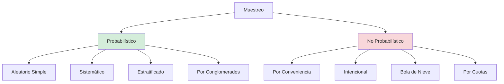

# Población, Muestra y Muestreo

## Definiciones

### Población (Universo)
**Conjunto total** de elementos que comparten características comunes y son objeto de estudio.

**Ejemplo contable:**
> "Todas las MYPE textiles registradas en el Emporio Comercial de Gamarra (N = 5,200 empresas)"

### Muestra
**Subconjunto representativo** de la población, seleccionado para realizar el estudio.

**Ejemplo contable:**
> "357 MYPE textiles de Gamarra seleccionadas probabilísticamente"

### ¿Por qué usar muestra?

✅ **Ahorro de tiempo:** Encuestar 5,200 empresas tomaría 1+ año  
✅ **Ahorro de costos:** Menor gasto en encuestadores, movilidad  
✅ **Mayor profundidad:** Mejor calidad de datos con grupo manejable  
✅ **Factibilidad:** Imposible acceder a toda la población  

---

## Tipos de Población

### 1. Población Finita
**Elementos contables y conocidos.**

**Ejemplos:**
- 271 empresas que cotizan en BVL (2023)
- 1,874 municipalidades del Perú
- 180 estudiantes de Contabilidad Ciclo II-UNMSM

**Fórmula de muestra:** Ajustada por tamaño poblacional

---

### 2. Población Infinita
**Elementos incontables o desconocidos.**

**Ejemplos:**
- Transacciones bancarias diarias en Perú (millones)
- Facturas emitidas en Lima (número indeterminado)

**Fórmula de muestra:** Sin ajuste poblacional

---

## Criterios de Inclusión y Exclusión

### Criterios de Inclusión (¿Quién SÍ entra?)

**Ejemplo: "Gestión tributaria en MYPE textiles de Gamarra"**

✅ Empresas del rubro textil (confección, venta de telas)  
✅ Ubicadas en Gamarra (zona delimitada: Av. Aviación - Jr. Puno)  
✅ Registradas como MYPE (hasta 100 trabajadores, ventas <1,700 UIT)  
✅ Con al menos 2 años de operación (establecidas)  
✅ Que acepten participar (consentimiento informado)  

### Criterios de Exclusión (¿Quién NO entra?)

❌ Grandes empresas textiles (más de 100 trabajadores)  
❌ Empresas de calzado, joyería (no son textiles)  
❌ MYPE fuera de Gamarra (La Victoria, Ate)  
❌ Informales sin RUC  
❌ Empresas con menos de 2 años (alto riesgo de cierre)  

---

## Marco Muestral

**Definición:** Lista completa de todos los elementos de la población.

**Ejemplos en contabilidad:**

| Población | Marco Muestral | Fuente |
|-----------|----------------|--------|
| MYPE de Gamarra | Padrón de licencias municipales | Municipalidad de La Victoria |
| Empresas BVL | Lista de emisores | www.bvl.com.pe |
| Contadores colegiados Lima | Registro de miembros | Colegio de Contadores Públicos de Lima |
| Gobiernos locales | Directorio de municipalidades | INEI |

**Sin marco muestral → Imposible hacer muestreo probabilístico.**

---

## Tipos de Muestreo

---

## 1. Muestreo Probabilístico

**Característica:** Todos los elementos tienen probabilidad **conocida y no nula** de ser seleccionados.

**Ventaja:** Resultados **generalizables** a la población.

---

### 1.1 Aleatorio Simple (MAS)

**Procedimiento:** Cada elemento tiene igual probabilidad de selección (sorteo puro).

**Ejemplo:**
- Población: 5,200 MYPE de Gamarra
- Muestra: 357
- Método: Numerar 1-5200, generar 357 números aleatorios (Excel: `=ALEATORIO.ENTRE(1,5200)`)

**Fórmula (población finita):**

$$
n = \frac{Z^2 \cdot p \cdot q \cdot N}{e^2(N-1) + Z^2 \cdot p \cdot q}
$$

Donde:
- **n** = tamaño de muestra
- **N** = tamaño de población (5,200)
- **Z** = nivel de confianza (1.96 para 95%)
- **p** = proporción esperada (0.5 si no hay dato previo)
- **q** = 1 - p (0.5)
- **e** = margen de error (0.05 = 5%)

**Cálculo:**
$$
n = \frac{(1.96)^2 \cdot 0.5 \cdot 0.5 \cdot 5200}{(0.05)^2(5200-1) + (1.96)^2 \cdot 0.5 \cdot 0.5} = 357
$$

---

### 1.2 Muestreo Sistemático

**Procedimiento:** Seleccionar cada **k-ésimo** elemento.

**Ejemplo:**
- Población: 5,200 MYPE
- Muestra: 357
- **k = N/n = 5,200/357 ≈ 14.6 → 15**
- Método: Empezar aleatoriamente (ej: empresa #7), luego seleccionar cada 15 (7, 22, 37, 52...)

**Ventaja:** Más fácil que aleatorio simple.  
**Riesgo:** Si hay periodicidad en la lista (ej: cada 15 empresas son de mismo rubro) → sesgo.

---

### 1.3 Muestreo Estratificado

**Procedimiento:** Dividir población en **estratos homogéneos**, luego muestrear de cada estrato.

**Ejemplo: MYPE de Gamarra por tamaño**

| Estrato | N (población) | % | n (muestra) |
|---------|---------------|---|-------------|
| Microempresa (1-10 trab.) | 4,160 | 80% | 286 |
| Pequeña empresa (11-100 trab.) | 1,040 | 20% | 71 |
| **Total** | **5,200** | **100%** | **357** |

**Afijación proporcional:** Muestra de cada estrato proporcional a su tamaño.

**Ventaja:** Asegura representación de subgrupos (micro y pequeña empresa).

---

### 1.4 Muestreo por Conglomerados

**Procedimiento:** Dividir población en **grupos naturales** (conglomerados), seleccionar aleatoriamente conglomerados, estudiar TODOS los elementos de conglomerados elegidos.

**Ejemplo: MYPE de Gamarra por manzana (bloque)**

1. Gamarra tiene 80 manzanas
2. Seleccionar aleatoriamente 10 manzanas
3. Encuestar TODAS las MYPE de esas 10 manzanas

**Ventaja:** Menor costo (concentración geográfica).  
**Desventaja:** Mayor error muestral (conglomerados pueden ser heterogéneos).

---

## 2. Muestreo No Probabilístico

**Característica:** Selección **subjetiva**, sin probabilidad conocida.

**Desventaja:** Resultados **NO generalizables** (no puedes decir "esto aplica a todas las MYPE").

**Uso:** Estudios exploratorios, cualitativos, acceso limitado.

---

### 2.1 Por Conveniencia

**Criterio:** Elementos fácilmente accesibles.

**Ejemplo:**
> "Encuestar a MYPE de Gamarra que estén en Jr. Gamarra (calle principal), ignorando calles internas"

**Riesgo:** MYPE de calle principal son más formales/grandes → sesgo.

---

### 2.2 Intencional (Juicio del Experto)

**Criterio:** Investigador elige elementos que considera representativos.

**Ejemplo:**
> "Entrevistar a 5 gerentes de MYPE textiles reconocidas por su buena gestión tributaria"

**Uso:** Estudios de caso, investigación cualitativa.

---

### 2.3 Bola de Nieve

**Criterio:** Participantes refieren a otros participantes.

**Ejemplo:**
> "Entrevistar a 1 contador de Gamarra, pedirle que refiera a 2 colegas, y así sucesivamente"

**Uso:** Poblaciones ocultas (ej: evasores tributarios que no responderían encuesta directa).

---

### 2.4 Por Cuotas

**Criterio:** Establecer cuotas por características, llenarlas sin aleatorización.

**Ejemplo:**
> "Necesito 200 micro y 100 pequeñas empresas. Encuesto hasta completar cuotas (sin sorteo)"

**Diferencia con estratificado:** No hay aleatorización dentro de cuotas.

---

## Cálculo de Tamaño Muestral

### Fórmula Población Finita (< 100,000)

$$
n = \frac{Z^2 \cdot p \cdot q \cdot N}{e^2(N-1) + Z^2 \cdot p \cdot q}
$$

### Fórmula Población Infinita (> 100,000)

$$
n = \frac{Z^2 \cdot p \cdot q}{e^2}
$$

### Parámetros Estándar

| Parámetro | Valor | Justificación |
|-----------|-------|---------------|
| **Nivel de confianza** | 95% (Z=1.96) | Estándar en ciencias sociales |
| **Margen de error** | 5% (e=0.05) | Aceptable para pregrado |
| **Proporción** | p=0.5, q=0.5 | Si no hay estudios previos (máxima varianza) |

### Tabla de Referencia (p=0.5, e=0.05, 95% confianza)

| Población (N) | Muestra (n) |
|---------------|-------------|
| 100 | 80 |
| 500 | 217 |
| 1,000 | 278 |
| 5,000 | 357 |
| 10,000 | 370 |
| 50,000 | 381 |
| 100,000+ | 384 |

**Observación:** A partir de N=50,000, la muestra casi no cambia (máximo 384).

---

## Ajuste por Mortalidad (No Respuesta)

**Problema:** No todos responderán (empresas cerradas, rechazan participar).

**Fórmula ajustada:**

$$
n_{ajustado} = \frac{n}{1 - \% mortalidad}
$$

**Ejemplo:**
- n calculado = 357
- Mortalidad esperada = 20% (0.20)
- $n_{ajustado} = \frac{357}{1-0.20} = \frac{357}{0.80} = 446$

**Estrategia:** Encuestar 446 para asegurar al menos 357 respuestas válidas.

---

## Ejemplo Completo: Tesis UNMSM

**Título:** "Gestión tributaria y rentabilidad en MYPE textiles de Gamarra, 2021-2023"

### Paso 1: Definir Población
- **N = 5,200 MYPE textiles registradas en Municipalidad de La Victoria**
- Criterios inclusión: RUC activo, ubicación Gamarra, 2+ años operando

### Paso 2: Determinar Marco Muestral
- Fuente: Padrón de licencias municipales (lista de 5,200 empresas con dirección, RUC)

### Paso 3: Calcular Muestra
- Parámetros: N=5,200, Z=1.96, p=0.5, e=0.05
- **n = 357**

### Paso 4: Seleccionar Tipo de Muestreo
- **Estratificado proporcional** (por tamaño: micro/pequeña)
- Asegura representación de ambos estratos

### Paso 5: Ajustar por No Respuesta
- Mortalidad estimada: 20%
- $n_{ajustado} = 446$

### Paso 6: Aplicar Instrumento
- Encuestar 446 MYPE
- Obtener 357 respuestas válidas (tasa de respuesta 80%)

---

## Errores Comunes

| Error | Ejemplo | Corrección |
|-------|---------|------------|
| Muestra muy pequeña | n=30 para N=5,200 | Usar fórmula: n=357 mínimo |
| No justificar tamaño | "Encuestamos 100 empresas" (¿por qué 100?) | Mostrar cálculo con fórmula |
| Confundir población con muestra | "Población: 357 MYPE" | Población=5,200, Muestra=357 |
| Muestreo no probabilístico sin justificar | Solo encuestar amigos | Si no es aleatorio, explicar por qué (acceso limitado) |
| No tener marco muestral | "MYPE informales" (no hay lista) | Cambiar a MYPE registradas en SUNAT |

---

## Conexiones

- [[diseno-investigacion]] - Diseño define si necesitas muestra probabilística
- [[tecnicas-instrumentos]] - Tamaño de muestra afecta logística de encuesta
- [[hipotesis]] - Muestra pequeña reduce poder estadístico (riesgo de no detectar relación)

---

## Referencias

- Hernández-Sampieri, R. (2018). *Metodología de la investigación* (7ª ed.). McGraw-Hill. [Capítulo 8]
- Cochran, W. G. (1977). *Sampling Techniques* (3rd ed.). John Wiley & Sons.
- Ñaupas, H. et al. (2014). *Metodología de la investigación*. Ediciones de la U. [Capítulo 7]

---

## Calculadoras Online Recomendadas

🌐 **Survey Monkey:** https://es.surveymonkey.com/mp/sample-size-calculator/  
🌐 **Raosoft:** http://www.raosoft.com/samplesize.html  
🌐 **QuestionPro:** https://www.questionpro.com/es/calculadora-de-muestra.html  

**Importante:** Siempre verifica resultados manualmente con fórmula.

---

*Contexto: UNMSM - Decisión Metodológica Crítica*  
*"Una muestra mal calculada invalida toda la investigación"*
