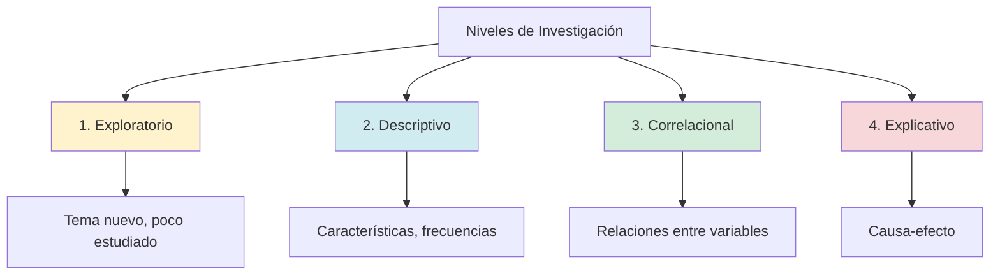
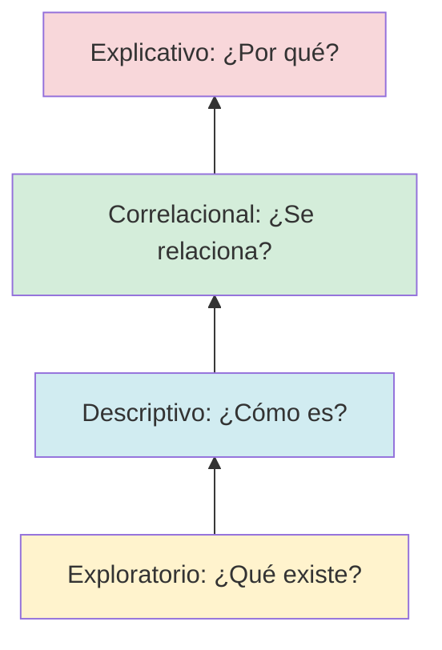

# Tipos y Niveles de Investigación

## Tipos de Investigación (Según Propósito)

### 1. Investigación Básica (Pura, Fundamental)

**Objetivo:** Generar **conocimiento teórico** sin aplicación inmediata.

**Características:**
- Amplía teorías existentes
- No busca resolver problemas prácticos
- Resultados a largo plazo

**Ejemplo contable:**
> "Análisis epistemológico del concepto de 'valor razonable' en las NIIF"

**Contribución:**
- Comprender fundamentos filosóficos de medición contable
- No propone cambios prácticos inmediatos
- Útil para académicos, teóricos

---

### 2. Investigación Aplicada

**Objetivo:** Resolver **problemas prácticos** usando conocimiento existente.

**Características:**
- Aplica teorías a contextos reales
- Resultados inmediatos y útiles
- Orienta toma de decisiones

**Ejemplo contable:**
> "Impacto de sistema de costos ABC en rentabilidad de MYPE textiles de Gamarra, 2023"

**Contribución:**
- Demuestra si ABC funciona en MYPE peruanas
- Gerentes pueden decidir si implementan ABC
- **95% de tesis UNMSM son aplicadas**

---

### Comparación: Básica vs Aplicada

| Criterio | Básica | Aplicada |
|----------|--------|----------|
| **Objetivo** | Generar teoría | Resolver problema |
| **Contexto** | Laboratorio, simulación | Empresas reales, campo |
| **Tiempo** | Largo plazo | Corto-mediano plazo |
| **Ejemplo contable** | "Teoría de la agencia en auditoría" | "Auditoría forense y detección de fraude en bancos" |
| **Usuario** | Académicos | Profesionales, gerentes |

**En contabilidad:** Mayoría es aplicada (profesión práctica).

---

## Niveles de Investigación (Según Profundidad)

---

### 1. Nivel Exploratorio

**Objetivo:** **Familiarizarse** con un tema poco estudiado.

**Características:**
- No hay antecedentes suficientes
- Preguntas generales ("¿qué?", "¿cómo es?")
- No prueba hipótesis (aún no hay teoría)
- Base para investigaciones futuras

**Metodología típica:**
- Revisión de literatura
- Entrevistas a expertos
- Estudios de caso

**Ejemplo contable:**
> **Título:** "Prácticas de contabilidad blockchain en startups fintech peruanas, 2023"

**Justificación exploratorio:**
- Blockchain en contabilidad es reciente (2015+)
- No hay estudios en Perú sobre el tema
- Objetivo: Identificar qué prácticas existen (no explicar por qué funcionan)

**Pregunta de investigación:**
- ¿Qué prácticas de contabilidad blockchain usan las fintech peruanas?

---

### 2. Nivel Descriptivo

**Objetivo:** **Detallar características** de un fenómeno.

**Características:**
- Mide variables independientemente (sin relacionarlas)
- Usa frecuencias, porcentajes, promedios
- Responde "¿qué?", "¿cuánto?", "¿dónde?", "¿cuándo?"
- No explica causas

**Metodología típica:**
- Encuestas descriptivas
- Análisis documental
- Observación sistemática

**Ejemplo contable:**
> **Título:** "Nivel de cumplimiento tributario en comerciantes de mercados de Lima Metropolitana, 2023"

**Variables medidas:**
- % que emite comprobantes
- % que declara a tiempo
- % que conoce obligaciones tributarias
- Tipos de infracciones más frecuentes

**Resultados típicos:**
- "68% no emite comprobantes de pago"
- "Solo 22% declara IGV a tiempo"
- "Infracción más común: No llevar libros contables (45%)"

**No responde:** ¿POR QUÉ no cumplen? (eso sería explicativo)

---

### 3. Nivel Correlacional

**Objetivo:** Determinar **relación** entre dos o más variables.

**Características:**
- Analiza si variables covarían (cuando X cambia, ¿Y cambia?)
- Usa coeficientes de correlación (Pearson, Spearman)
- **Correlación ≠ causalidad** (X relacionado con Y, pero no sabemos si X causa Y)
- Predice comportamiento de una variable conociendo otra

**Metodología típica:**
- Diseño transversal correlacional
- Análisis de regresión
- Coeficientes de correlación

**Ejemplo contable:**
> **Título:** "Gestión tributaria y rentabilidad en MYPE textiles de Gamarra, 2023"

**Variables:**
- V.I.: Gestión tributaria (planificación, cumplimiento)
- V.D.: Rentabilidad (ROA, ROE)

**Hipótesis:**
- H₁: Existe relación positiva significativa entre gestión tributaria y rentabilidad

**Análisis:**
- Correlación de Spearman: ρ = 0.72, p < 0.01
- **Interpretación:** A mayor gestión tributaria, mayor rentabilidad (relación fuerte)

**Limitación:** No sabemos si gestión tributaria **causa** rentabilidad (podría ser al revés: empresas rentables invierten más en gestión tributaria).

---

### 4. Nivel Explicativo (Causal)

**Objetivo:** Establecer **relaciones causa-efecto**.

**Características:**
- Explica POR QUÉ ocurre un fenómeno
- Responde "¿por qué?"
- Requiere diseño experimental o cuasi-experimental
- Controla variables extrañas
- **Nivel más complejo**

**Metodología típica:**
- Experimentos (grupo control vs experimental)
- Análisis longitudinal (antes-después)
- Modelos de ecuaciones estructurales (SEM)

**Ejemplo contable:**
> **Título:** "Impacto de la adopción de NIIF 16 en ratios de endeudamiento de empresas de transporte aéreo peruanas, 2018-2020"

**Diseño cuasi-experimental natural:**
- **Antes (2018):** Sin NIIF 16 (arrendamientos fuera de balance)
- **Tratamiento (2019):** Adopción obligatoria de NIIF 16
- **Después (2020):** Con NIIF 16 (arrendamientos en balance)

**Variable independiente:** Adopción NIIF 16 (causa)  
**Variable dependiente:** Ratio de endeudamiento (efecto)

**Hipótesis causal:**
- La adopción de NIIF 16 **aumenta** el ratio de endeudamiento (porque activos y pasivos por arrendamiento entran al balance)

**Resultados:**
- Ratio deuda/activo pre-NIIF 16: 48% → post-NIIF 16: 63% (+15 puntos porcentuales)
- **Conclusión:** NIIF 16 **causó** aumento de endeudamiento contable (no real, solo reconocimiento)

---

## Comparación entre Niveles

| Nivel | Pregunta | Ejemplo | Hipótesis | Estadística |
|-------|----------|---------|-----------|-------------|
| **Exploratorio** | ¿Qué es? ¿Cómo es? | Prácticas blockchain en fintech | No hay | Análisis cualitativo |
| **Descriptivo** | ¿Cuánto? ¿Dónde? | Nivel de cumplimiento tributario | No (solo describe) | Frecuencias, porcentajes |
| **Correlacional** | ¿Se relacionan? | Gestión tributaria y rentabilidad | Sí (relación) | Correlación (ρ, r) |
| **Explicativo** | ¿Por qué? ¿Causa? | Impacto NIIF 16 en ratios | Sí (causal) | Regresión, t-test, ANOVA |

---

## Progresión de Niveles (Pirámide del Conocimiento)

**Lógica:**
1. **Explorar** tema nuevo (blockchain)
2. **Describir** sus características (qué empresas usan, cómo)
3. **Correlacionar** con resultados (¿empresas con blockchain son más eficientes?)
4. **Explicar** causalmente (¿blockchain **causa** mayor eficiencia?)

**Nota:** No todas las investigaciones deben llegar a nivel explicativo (depende del estado del arte).

---

## Distribución en Tesis UNMSM (2018-2023)

| Nivel | % de Tesis | Observación |
|-------|------------|-------------|
| Exploratorio | 5% | Temas muy nuevos (fintech, IA en auditoría) |
| Descriptivo | 25% | Diagnósticos, caracterizaciones |
| **Correlacional** | **65%** | **Más común** (gestión X y resultado Y) |
| Explicativo | 5% | Requiere experimentos, poco factible en pregrado |

**Tendencia:** Pregrado favorece correlacional (factible en 1 semestre, no requiere experimento).

---

## Ejemplos por Nivel y Línea de Investigación

### Auditoría

| Nivel | Título |
|-------|--------|
| **Exploratorio** | "Prácticas emergentes de auditoría continua en el sector bancario peruano" |
| **Descriptivo** | "Nivel de aplicación de NIA 240 (fraude) en firmas de auditoría de Lima, 2023" |
| **Correlacional** | "Control interno y calidad de auditoría en empresas manufactureras, 2022" |
| **Explicativo** | "Efecto de rotación de auditores en independencia: Experimento con auditores peruanos" |

### Tributación

| Nivel | Título |
|-------|--------|
| **Exploratorio** | "Estrategias de planeamiento fiscal en empresas familiares peruanas" |
| **Descriptivo** | "Características del cumplimiento tributario en MYPE de Gamarra, 2023" |
| **Correlacional** | "Cultura tributaria y evasión fiscal en comerciantes de mercados, Lima 2022" |
| **Explicativo** | "Impacto de programa de capacitación SUNAT en recaudación tributaria: Estudio cuasi-experimental" |

---

## Cómo Elegir el Nivel de tu Investigación

### Criterios de Decisión

| Pregunta | Respuesta | Nivel Recomendado |
|----------|-----------|-------------------|
| ¿Hay estudios previos sobre el tema? | No/Muy pocos | Exploratorio |
| ¿Quieres caracterizar un fenómeno? | Sí | Descriptivo |
| ¿Buscas relación entre variables? | Sí | Correlacional |
| ¿Quieres probar causa-efecto? | Sí | Explicativo |
| ¿Tienes acceso a datos longitudinales? | No | Correlacional (transversal) |
| ¿Puedes manipular variables? | No (ética/factibilidad) | Correlacional (no explicativo) |

**Recomendación UNMSM pregrado:** Correlacional (balance entre complejidad y factibilidad).

---

## Errores Comunes

| Error | Ejemplo | Corrección |
|-------|---------|------------|
| Título descriptivo con hipótesis | "Nivel de control interno" + hipótesis de relación | Si hay hipótesis → es correlacional, no descriptivo |
| Inferir causalidad de correlación | "Gestión tributaria causa rentabilidad" (correlación ≠ causa) | "Se relaciona con" (correlacional) o diseño longitudinal (explicativo) |
| Nivel muy ambicioso | Explicativo en 1 semestre (requiere años) | Ser realista: correlacional es suficiente |
| No justificar nivel | Solo dice "correlacional" sin explicar por qué | Argumentar: "Correlacional porque busco relación, no tengo grupo control" |

---

## Conexiones

- [[diseno-investigacion]] - Nivel correlacional → diseño transversal correlacional
- [[hipotesis]] - Solo niveles correlacional y explicativo tienen hipótesis
- [[problema-investigacion]] - Tipo de pregunta determina nivel

---

## Referencias

- Hernández-Sampieri, R. (2018). *Metodología de la investigación* (7ª ed.). McGraw-Hill. [Capítulo 5]
- Ñaupas, H. et al. (2014). *Metodología de la investigación*. Ediciones de la U. [Capítulo 4]
- Dankhe, G. L. (1986). Investigación y comunicación. En C. Fernández-Collado & G. L. Dankhe (Eds.), *La comunicación humana: Ciencia social* (pp. 385-454). McGraw-Hill.

---

*Contexto: UNMSM - Clasificación Metodológica Fundamental*  
*"El nivel de investigación define qué tan profundo llegarás - elige según tus recursos y tiempo disponible"*
