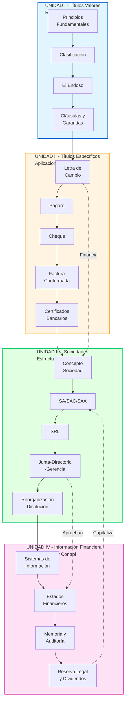
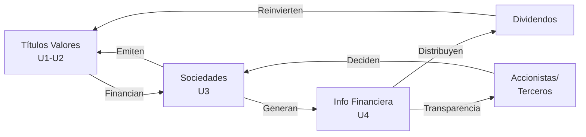

# Derecho Empresarial - Índice General

## Descripción del Curso

Curso que desarrolla competencias para resolver problemas relacionados con el **derecho cambiario** y **societario**, utilizando la normatividad empresarial vigente para la toma de decisiones, especialmente en el contexto de títulos valores y constitución de sociedades.

## Competencias Clave

1. Aplicación de la [[Ley de Títulos Valores]] como documentos privados con derechos patrimoniales
2. Evaluación de reglas de [[circulación de títulos valores]], cláusulas especiales y garantías
3. Identificación y aplicación de formas societarias según la [[Ley General de Sociedades]]
4. Comprensión de la [[información financiera empresarial]] como instrumento de decisión

---

## Mapa Conceptual del Curso (16 Semanas)

```mermaid
graph TB
    subgraph UNIDAD_I["🔷 UNIDAD I: Semanas 1-4<br/>TÍTULOS VALORES - REGLAS GENERALES"]
        S1["Semana 1<br/>Principios y Clasificación"]
        S2["Semana 2<br/>El Endoso"]
        S3["Semana 3<br/>Cláusulas y Garantías"]
        S4["Semana 4<br/>Letra de Cambio"]
        S1 --> S2 --> S3 --> S4
    end
    
    subgraph UNIDAD_II["🔶 UNIDAD II: Semanas 5-8<br/>TÍTULOS VALORES ESPECÍFICOS"]
        S5["Semana 5<br/>Pagaré, Factura, Cheque"]
        S6["Semana 6<br/>Cheques Especiales"]
        S7["Semana 7<br/>Otros Títulos Valores"]
        S8["Semana 8<br/>⭐ EXAMEN PARCIAL"]
        S5 --> S6 --> S7 --> S8
    end
    
    subgraph UNIDAD_III["🔷 UNIDAD III: Semanas 9-14<br/>LEY GENERAL DE SOCIEDADES"]
        S9["Semana 9<br/>Reglas Generales LGS"]
        S10["Semana 10<br/>Aportes y Patrimonio"]
        S11["Semana 11<br/>Sociedades Anónimas"]
        S12["Semana 12<br/>Órganos Societarios"]
        S13["Semana 13<br/>Modificaciones de Capital"]
        S14["Semana 14<br/>Otras Formas Societarias"]
        S9 --> S10 --> S11 --> S12 --> S13 --> S14
    end
    
    subgraph UNIDAD_IV["🔶 UNIDAD IV: Semanas 15-16<br/>INFORMACIÓN FINANCIERA"]
        S15["Semana 15<br/>Sistemas de Información<br/>Estados Financieros"]
        S16["Semana 16<br/>⭐ EXAMEN FINAL"]
        S15 --> S16
    end
    
    S4 --> S5
    S8 --> S9
    S14 --> S15
    
    style S8 fill:#ffe1e1,stroke:#ff0000,stroke-width:3px
    style S16 fill:#ffe1e1,stroke:#ff0000,stroke-width:3px
    style UNIDAD_I fill:#e1f5ff,stroke:#0066cc,stroke-width:2px
    style UNIDAD_II fill:#fff4e1,stroke:#ff9900,stroke-width:2px
    style UNIDAD_III fill:#e1ffe1,stroke:#00cc66,stroke-width:2px
    style UNIDAD_IV fill:#ffe1f5,stroke:#cc0099,stroke-width:2px
```



## Cronograma Detallado por Semana

| Semana | Unidad | Tema | Evaluación | Notas Atómicas Clave |
|--------|--------|------|------------|----------------------|
| **1** | I | Principios y Clasificación de TV | - | [[principios-titulos-valores]], [[clasificacion-titulos-valores]] |
| **2** | I | El Endoso | - | [[endoso-titulos-valores]], [[endoso-propiedad]], [[endoso-procuracion]], [[endoso-garantia]] |
| **3** | I | Cláusulas Especiales y Garantías | - | [[clausulas-especiales-garantias]] |
| **4** | I | Letra de Cambio | **Práctica Calificada 1** | [[letra-cambio-concepto]] |
| **5** | II | Pagaré, Factura Conformada, Cheque | - | [[pagare]], [[cheque-concepto]] |
| **6** | II | Cheques Especiales | - | Integrado en [[02-indice-unidad-2-titulos-especificos]] |
| **7** | II | Otros Títulos Valores | - | [[certificado-deposito-warrant]], Valores Mobiliarios, TCHEN |
| **8** | II | **EXAMEN PARCIAL** | **⭐ Examen Parcial** | Aplicación práctica TV en empresas |
| **9** | III | Reglas Generales LGS | - | [[concepto-sociedad]] |
| **10** | III | Aportes y Patrimonio | - | Integrado en [[sociedad-anonima-concepto]] |
| **11** | III | Sociedades Anónimas | - | [[sociedad-anonima-concepto]] |
| **12** | III | Órganos Societarios | **Práctica Calificada 2** | [[junta-general-accionistas]], [[directorio]], [[gerencia]] |
| **13** | III | Modificación Capital, EE.FF., SACS | - | [[sociedad-anonima-cerrada-simplificada]], [[estados-financieros-lgs]] |
| **14** | III | Otras Formas Societarias, Contratos Asociativos | - | [[sociedad-responsabilidad-limitada]], [[otras-formas-societarias]], Colectiva, Comandita |
| **15** | IV | Información Financiera | - | [[sistemas-informacion-empresarial]], [[estados-financieros-lgs]], [[memoria-anual]], [[auditoria-externa]], [[reserva-legal]], [[dividendos]] |
| **16** | IV | **EXAMEN FINAL** | **⭐ Examen Final** | Características EE.FF. en LGS |

---

## Estructura del Curso

### [[01-indice-unidad-1-titulos-valores|Unidad I: Títulos Valores - Reglas Generales]]

**Objetivo:** Comprender la naturaleza jurídica y principios fundamentales de los títulos valores

**Notas Atómicas:**
1. [[unidad-1/principios-titulos-valores|Principios Fundamentales de Títulos Valores]] - 5 principios (Ley 27287 Arts. 1-10)
2. [[unidad-1/clasificacion-titulos-valores|Clasificación de Títulos Valores]] - Por representación, circulación y derecho
3. [[unidad-1/endoso-titulos-valores|El Endoso - Concepto General]] - Mecanismo de transmisión
4. [[unidad-1/endoso-propiedad|Endoso en Propiedad]] - Transmisión plena de derechos
5. [[unidad-1/endoso-procuracion|Endoso en Procuración]] - Mandato cambiario
6. [[unidad-1/endoso-garantia|Endoso en Garantía]] - Garantía mobiliaria
7. [[unidad-1/clausulas-especiales-garantias|Cláusulas Especiales y Garantías]] - No a la orden, intransferible, aval

---

### [[02-indice-unidad-2-titulos-especificos|Unidad II: Títulos Valores Específicos]]

**Objetivo:** Dominar las características técnicas y operativas de cada tipo de título valor

**Notas Atómicas:**
1. [[unidad-2/letra-cambio-concepto|Letra de Cambio]] - Orden de pago, 3 sujetos, aceptación (Arts. 119-173 LTV)
2. [[unidad-2/pagare|Pagaré]] - Promesa de pago, 2 sujetos (Arts. 154-162 LTV)
3. [[unidad-2/cheque-concepto|Cheque - Concepto]] - Pago a la vista, banco como girado (Arts. 174-217 LTV)
4. [[unidad-2/cheques-especiales|Cheques Especiales]] - 8 tipos (cruzado, certificado, gerencia, viajero, etc.)
5. [[unidad-2/factura-conformada|Factura Conformada]] - Crédito comercial, descuento bancario
6. [[unidad-2/certificado-bancario-moneda-extranjera|Certificado Bancario Moneda Extranjera]] - Arts. 218-224 LTV
7. [[unidad-2/certificado-deposito-warrant|Certificado de Depósito y Warrant]] - Almacenes generales, garantía prendaria (Arts. 239-252 LTV)

---

### [[03-indice-unidad-3-sociedades|Unidad III: Ley General de Sociedades]]

**Objetivo:** Comprender la estructura legal y operativa de las formas societarias en el Perú

**Notas Atómicas:**
1. [[unidad-3/concepto-sociedad|Concepto de Sociedad]] - Elementos esenciales (Art. 1 LGS)
2. [[unidad-3/sociedad-anonima-concepto|Sociedad Anónima]] - SA vs SAC vs SAA (Arts. 50-264 LGS)
3. [[unidad-3/sociedad-anonima-cerrada-simplificada|Sociedad Anónima Cerrada Simplificada (SACS)]] - Constitución digital, sin directorio, sin reserva legal (D.Leg 1409/2018)
4. [[unidad-3/sociedad-responsabilidad-limitada|SRL]] - Máx 20 socios, participaciones (Arts. 283-294 LGS)
5. [[unidad-3/junta-general-accionistas|Junta General de Accionistas]] - Competencias, quórum, mayorías (Arts. 111-149 LGS)
6. [[unidad-3/directorio|Directorio]] - Órgano colegiado, funciones, responsabilidad (Arts. 153-184 LGS)
7. [[unidad-3/gerencia|Gerencia]] - Representación legal, gestión operativa (Arts. 185-197 LGS)
8. [[unidad-3/disolucion-liquidacion|Disolución y Liquidación]] - Causales, proceso, extinción (Arts. 407-422 LGS)
9. [[unidad-3/transformacion-fusion-escision|Transformación, Fusión y Escisión]] - Reorganización societaria (Arts. 333-390 LGS)
10. [[unidad-3/otras-formas-societarias|Otras Formas Societarias]] - Colectiva, Comandita, Civil, Contratos Asociativos (Arts. 265-309, 438-448 LGS)
8. [[unidad-3/transformacion-fusion-escision|Transformación, Fusión y Escisión]] - Reorganización societaria (Arts. 333-390 LGS)
9. [[unidad-3/otras-formas-societarias|Otras Formas Societarias]] - Colectiva, Comandita, Civil (Arts. 265-309 LGS)

---

### [[04-indice-unidad-4-informacion-financiera|Unidad IV: Información Financiera y Derecho Empresarial]]

**Objetivo:** Comprender la importancia de la información financiera como instrumento legal y gerencial

**Notas Atómicas:**
1. [[unidad-4/sistemas-informacion-empresarial|Sistemas de Información Empresarial]] - Integración contable-financiera-tributaria
2. [[unidad-4/estados-financieros-lgs|Estados Financieros LGS]] - 5 EE.FF. obligatorios NIC/NIIF (Arts. 221-224 LGS)
3. [[unidad-4/memoria-anual|Memoria Anual]] - Informe de gestión (Art. 221-222 LGS)
4. [[unidad-4/auditoria-externa|Auditoría Externa]] - Obligatoriedad SAA (Art. 226 LGS)
5. [[unidad-4/reserva-legal|Reserva Legal]] - 10% hasta 20% capital (Art. 229 LGS)
6. [[unidad-4/dividendos|Dividendos]] - Distribución utilidades (Arts. 230-231 LGS)

---

## 🗺️ Mapa de Conocimiento: Arquitectura del Curso



## 📚 Resumen de Notas por Unidad

| Unidad | Notas Atómicas | Legislación Clave | Estado |
|--------|----------------|-------------------|--------|
| **I** | 7 notas | Ley 27287 Arts. 1-90 | ✅ Completa |
| **II** | 7 notas (+1 Warrant) | Ley 27287 Arts. 119-252 | ✅ Completa |
| **III** | 10 notas (+1 SACS) | Ley 26887 (LGS) + D.Leg 1409 | ✅ Completa |
| **IV** | 6 notas | Ley 26887 Arts. 221-231, NIC/NIIF | ✅ Completa |
| **TOTAL** | **30 notas** | 3 leyes principales | ✅ 100% |

---

## Conexiones Clave Entre Unidades



### Flujos de Integración

**1. Financiamiento Empresarial:**
- [[unidad-2/letra-cambio-concepto|Letra de Cambio]] → Crédito comercial entre empresas
- [[unidad-2/factura-conformada|Factura Conformada]] → Descuento bancario para capital de trabajo
- [[unidad-3/sociedad-anonima-concepto|Sociedad Anónima]] → Emisión de acciones y bonos

**2. Gobernanza Corporativa:**
- [[unidad-3/junta-general-accionistas|Junta General]] → Aprueba [[unidad-4/estados-financieros-lgs|Estados Financieros]]
- [[unidad-3/directorio|Directorio]] → Prepara [[unidad-4/memoria-anual|Memoria Anual]]
- [[unidad-3/gerencia|Gerencia]] → Ejecuta y reporta información

**3. Transparencia y Protección:**
- [[unidad-4/auditoria-externa|Auditoría Externa]] → Valida [[unidad-4/estados-financieros-lgs|EE.FF.]]
- [[unidad-4/reserva-legal|Reserva Legal]] → Protege capital social
- [[unidad-4/dividendos|Dividendos]] → Retribuyen a accionistas

---

## Normativa Fundamental

### Leyes Principales

| Ley | Nombre | Unidades | Artículos Clave |
|-----|--------|----------|----------------|
| **Ley 27287** | Ley de Títulos Valores | I, II | Arts. 1-10 (Principios), 119-224 (Títulos específicos) |
| **Ley 26887** | Ley General de Sociedades (LGS) | III, IV | Arts. 1-422 (Estructura completa) |

### Normas Técnicas

- **NIC/NIIF** (Normas Internacionales de Contabilidad/Información Financiera) - Oficializadas por CNC en Perú
- **PCGE** (Plan Contable General Empresarial) - Resolución CNC N° 043-2010-EF/94
- **NIA** (Normas Internacionales de Auditoría) - Aplicables en auditoría externa

### Instituciones Reguladoras Perú

- **SUNARP** (Superintendencia Nacional de Registros Públicos) - Inscripción sociedades y títulos valores
- **SUNAT** (Superintendencia Nacional de Aduanas y Administración Tributaria) - Información tributaria
- **SMV** (Superintendencia del Mercado de Valores) - Supervisión SAA que cotizan en bolsa
- **SBS** (Superintendencia de Banca, Seguros y AFP) - Regulación sector financiero
- **CNC** (Consejo Normativo de Contabilidad) - Oficialización NIC/NIIF en Perú

---

## 🎯 Tags Principales del Curso

```
#derecho-empresarial  #Ley-27287  #Ley-26887  #titulos-valores  
#sociedades  #LGS  #NIC-NIIF  #PCGE  #información-financiera  
#SA  #SRL  #junta-general  #directorio  #gerencia  
#letra-cambio  #pagare  #cheque  #endoso  
#estados-financieros  #auditoria  #reserva-legal  #dividendos
```

---

## Metodología de Estudio Recomendada (KDD)

### Fase 1: Exploración (El Explorador)
1. Revisar el **índice de cada unidad** para mapear el terreno
2. Crear **mapa mental personal** de conexiones
3. Identificar **conceptos desconocidos** → Lista de preguntas

### Fase 2: Profundización (El Especialista)
1. Estudiar **notas atómicas** en orden lógico (seguir numeración)
2. Verificar **artículos legales citados** en Ley 27287 y LGS
3. Resolver **casos prácticos** aplicando normativa peruana
4. Crear **tarjetas de estudio** con ejemplos locales

### Fase 3: Síntesis (El Maestro)
1. **Conectar conceptos** entre unidades (usar backlinks [[nota]])
2. Reflexionar: "¿Cómo se aplica esto en empresa peruana real?"
3. Crear **resumen ejecutivo personal** por unidad
4. Preparar **casos integrados** (ej: constitución SA + emisión letra + reparto dividendos)

---

## 📖 Lecturas Complementarias Recomendadas

### Libros Especializados Perú
- Beaumont Callirgos, Ricardo. *"Comentarios a la Ley General de Sociedades"*
- Hundskopf Exebio, Oswaldo. *"Manual de Derecho Societario"*
- Montoya Manfredi, Ulises. *"Derecho Comercial"* (Tomos sobre títulos valores)

### Recursos Online
- [Plataforma SUNARP](https://www.sunarp.gob.pe) - Consulta de sociedades inscritas
- [Portal SUNAT](https://www.sunat.gob.pe) - Normas tributarias
- [SMV](https://www.smv.gob.pe) - Información sobre SAA y mercado de valores

---

*Última actualización: 22 de octubre de 2025*  
*Curso: Derecho Empresarial - Ciclo IV*  
*Metodología: KDD (Knowledge-Driven Discovery)*

[[DERECHO-EMPRESARIAL|← Volver al Syllabus]]
