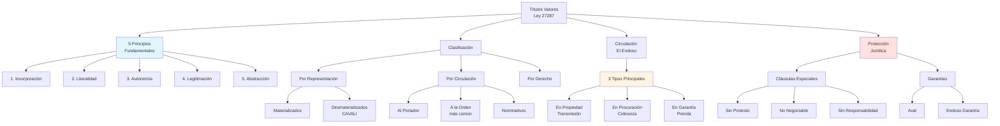
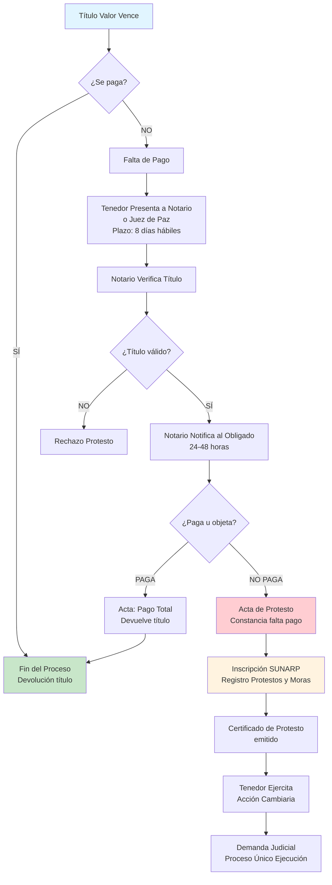
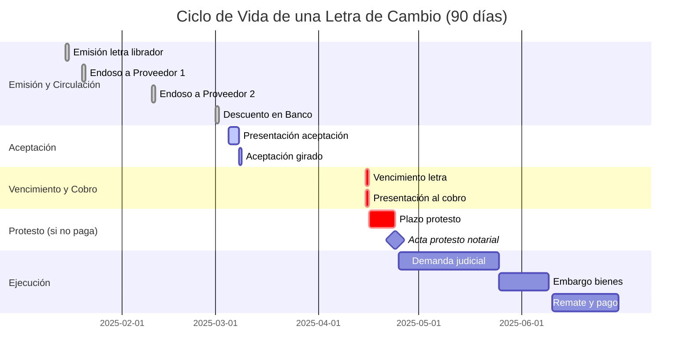
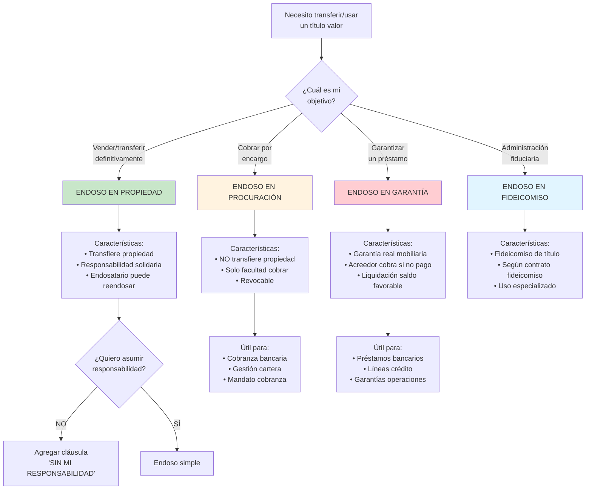
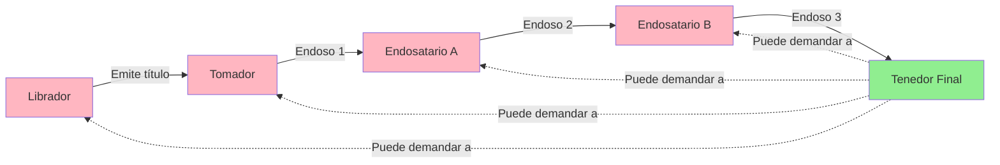
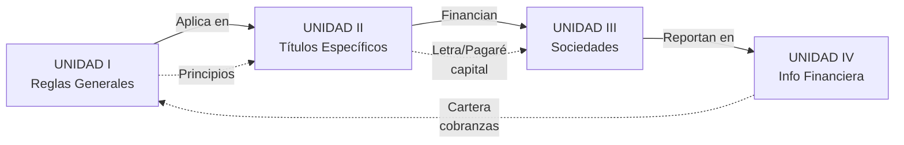

# Unidad I: Títulos Valores - Reglas Generales

## Objetivo de Aprendizaje

> Explicar y comprender la **Ley de Títulos Valores** y su importancia como documentos privados que incorporan derechos patrimoniales, destinados a la circulación y cumpliendo los requisitos formales esenciales establecidos en la Ley.

---

## 📋 Notas Atómicas de la Unidad

| # | Nota | Tema | Artículos LTV |
|---|------|------|---------------|
| 1 | [[unidad-1/principios-titulos-valores\|Principios Fundamentales]] | 5 principios rectores | Arts. 1-10 |
| 2 | [[unidad-1/clasificacion-titulos-valores\|Clasificación]] | Por representación, circulación, derecho | Arts. 3-26 |
| 3 | [[unidad-1/endoso-titulos-valores\|El Endoso]] | Concepto general y requisitos | Arts. 31-36 |
| 4 | [[unidad-1/endoso-propiedad\|Endoso en Propiedad]] | Transmisión plena de derechos | Arts. 31-36 |
| 5 | [[unidad-1/endoso-procuracion\|Endoso en Procuración]] | Mandato cambiario (cobranza) | Arts. 31-36 |
| 6 | [[unidad-1/endoso-garantia\|Endoso en Garantía]] | Garantía mobiliaria | Arts. 31-36, Ley 28677 |
| 7 | [[unidad-1/clausulas-especiales-garantias\|Cláusulas y Garantías]] | Sin protesto, no negociable, aval | Arts. 44-61 |

---

## Mapa Conceptual de la Unidad

---

## 📊 Proceso de Protesto de Título Valor en Perú

**Costos aproximados protesto notarial (2025):**
- Protesto notarial: S/ 100 - S/ 250 (según monto título)
- Inscripción SUNARP: S/ 35 - S/ 50
- Certificado de protesto: S/ 25

---

## ⏱️ Línea de Tiempo: Circulación y Cobro de Título Valor

**Plazos críticos en Perú:**
- **Presentación aceptación:** Dentro de plazo letra o antes del vencimiento
- **Plazo protesto:** **8 días hábiles** desde vencimiento (Art. 84 Ley 27287)
- **Prescripción acción directa:** **3 años** desde vencimiento
- **Prescripción acción regreso:** **1 año** desde protesto

---

## 🔄 Diagrama de Decisión: ¿Qué Tipo de Endoso Usar?

---

## Contenido de la Unidad

### Semana 1: Parte General y Clasificación

#### 📚 Conceptos Fundamentales

**1. [[unidad-1/principios-titulos-valores|Principios que Rigen los Títulos Valores]]**

**Los 5 Principios Fundamentales (Ley 27287 Arts. 1-10):**
1. **Incorporación** (Art. 1.1): El derecho está incorporado en el documento
2. **Literalidad** (Art. 1.2): Vale exactamente lo escrito en el título
3. **Autonomía** (Art. 1.3): Cada obligación es independiente
4. **Legitimación** (Art. 1.4): El poseedor legítimo se presume titular
5. **Abstracción** (Art. 1.5): Independencia de la relación causal subyacente

**Nota importante:** La solidaridad (Art. 11 LTV) es una **consecuencia** del sistema cambiario, NO un sexto principio fundamental.

**2. [[unidad-1/clasificacion-titulos-valores|Clasificación de Títulos Valores]]**

**Por su forma de representación:**
- **Materializados:** Físicos en papel (tradicionales)
- **Desmaterializados:** Anotaciones electrónicas en cuenta (CAVALI en Perú)

**Por su forma de circulación:**
- **Al Portador:** Circula por simple entrega física
- **A la Orden:** Circula por endoso + entrega (los más comunes)
- **Nominativo:** Endoso + entrega + inscripción en registro

**Por el derecho incorporado:**
- **Crediticios:** Letra de cambio, pagaré (derecho de pago dinero)
- **Corporativos:** Acciones (derechos de socio)
- **De participación:** Certificado de depósito (derechos sobre mercaderías)
- **De tradición:** Warrant, conocimiento de embarque

**3. [[unidad-1/endoso-titulos-valores|El Endoso - Concepto General]]**

**Definición:** Acto cambiario de transmisión de título valor a la orden mediante declaración escrita en el reverso.

**Requisitos formales:**
- Firma del endosante
- Colocación en reverso (o anverso si no hay espacio)
- Nombre del endosatario (endoso completo) o en blanco (solo firma)

**Efectos jurídicos del endoso:**
1. **Transferencia:** De los derechos incorporados
2. **Garantía:** Responsabilidad solidaria del endosante (salvo cláusula "sin mi responsabilidad")
3. **Legitimación:** El endosatario se convierte en titular legitimado

**Los 3 tipos principales de endoso (Ley 27287):**
- [[unidad-1/endoso-propiedad|Endoso en Propiedad]] - Transmisión plena
- [[unidad-1/endoso-procuracion|Endoso en Procuración]] - Mandato de cobranza
- [[unidad-1/endoso-garantia|Endoso en Garantía]] - Garantía mobiliaria

#### 🎯 Competencias a Desarrollar

- Identificar los principios cambiarios en casos prácticos
- Clasificar correctamente un título valor según su naturaleza
- Determinar requisitos de transferencia según el tipo de título
- Analizar la responsabilidad de los firmantes

---

### Semana 2: El Endoso en los Títulos Valores

#### 📚 Concepto General

**[[endoso-titulos-valores|El Endoso]]**
- Definición: Acto de transmisión de derechos
- Requisitos formales (firma, colocación)
- Efectos jurídicos:
  - Transferencia de derechos
  - Garantía (responsabilidad solidaria)
  - Legitimación

**Endoso en blanco vs. Endoso completo**
- En blanco: Solo firma → título al portador
- Completo: Firma + nombre endosatario → control de circulación

#### 📚 Clases de Endoso

**1. [[endoso-propiedad|Endoso en Propiedad]]**
- **Finalidad:** Transmitir la propiedad plena del título
- **Efectos:**
  - El endosatario adquiere todos los derechos
  - El endosante responde solidariamente
  - Puede seguir circulando libremente
- **Cláusula:** "Páguese a la orden de..." o presunto si no se especifica

**2. [[unidad-1/endoso-procuracion|Endoso en Procuración]]**
- **Finalidad:** Cobranza o gestión (mandato cambiario)
- **Efectos:**
  - NO transfiere propiedad
  - El endosatario cobra en nombre del endosante
  - NO hay responsabilidad solidaria del endosante
- **Cláusula:** "Valor al cobro", "En procuración", "En cobranza"

**3. [[unidad-1/endoso-garantia|Endoso en Garantía]]**
- **Finalidad:** Garantizar una obligación principal (préstamo)
- **Efectos:**
  - NO transfiere propiedad plena (garantía mobiliaria)
  - El endosatario puede cobrar el título
  - Debe aplicar el cobro a la deuda garantizada
  - Si sobra dinero, lo devuelve al endosante
  - NO hay responsabilidad solidaria del endosante
- **Cláusula:** "Valor en garantía", "En prenda"

#### 🎯 Competencias a Desarrollar

- Distinguir entre los tipos de endoso según su finalidad
- Redactar correctamente un endoso según el objetivo
- Identificar los efectos jurídicos de cada tipo de endoso
- Resolver casos sobre cadenas de endosos y responsabilidad

---

### Semana 3: Cláusulas Especiales y Garantías

#### 📚 Cláusulas Especiales

**[[clausulas-especiales-garantias|Principales Cláusulas]]**

1. **"Sin Protesto" / "Sin Gastos"**
   - Exime de la obligación de protestar
   - Agiliza acciones cambiarias
   - Reduce costos

2. **"No Negociable" / "Intransferible"**
   - Impide el endoso
   - Solo transmisión por cesión ordinaria
   - Mayor seguridad (típico en cheques)

3. **"Sin Mi Responsabilidad"**
   - El endosante no responde solidariamente
   - Solo transmite, no garantiza
   - Reduce confianza en el título

4. **Cláusula de Intereses**
   - Compensatorios: Por uso del dinero
   - Moratorios: Por retraso en pago
   - Se incorporan al título

5. **Domicilio Especial para el Pago**
   - Lugar específico de pago
   - Relevante para competencia judicial

#### 📚 Garantías Cambiarias

**1. El Aval**
- **Naturaleza:** Garantía personal **autónoma**
- **Forma:** "Por aval" + firma en el anverso
- **Efectos:**
  - El avalista responde solidariamente como el avalado
  - Obligación autónoma (subsiste aunque obligación avalada sea nula)
  - Acción de regreso si paga
- **Clases:**
  - Total o parcial
  - Limitado o general

**2. [[endoso-garantia|Garantía Mobiliaria (Endoso en Garantía)]]**
- El título mismo como garantía
- Naturaleza accesoria (sigue la obligación principal)
- Aplicación preferente del cobro

**3. Otras Garantías**
- Fianza cambiaria (accesoria)
- Garantías reales externas (hipoteca, prenda)

#### 🎯 Competencias a Desarrollar

- Redactar cláusulas especiales según necesidades comerciales
- Distinguir entre aval y fianza
- Evaluar la conveniencia de cada cláusula y garantía
- Resolver casos de ejecución de garantías

---

### Semana 4: Títulos Valores Específicos - Introducción

#### 📚 La Letra de Cambio (Parte I)

**[[letra-cambio-concepto|Concepto y Naturaleza]]**
- Definición: Orden de pago diferido
- Sujetos: Librador, girado, tomador
- Requisitos formales esenciales

**Formas de Vencimiento:**
1. **A fecha fija:** Día calendario específico
2. **A la vista:** Al presentarse para pago
3. **A cierto plazo de la aceptación:** X días desde que el girado acepta
4. **A cierto plazo de su giro:** X días desde la emisión

**El Endoso en la Letra**
- Aplicación de todos los tipos de endoso vistos

**La Aceptación de la Letra**
- Acto por el cual el girado se obliga a pagar
- Formalidades y efectos

**El Pago**
- Presentación oportuna
- Lugar y forma de pago
- Efectos liberatorios

**El Protesto**
- Acto notarial de constancia de falta de aceptación o pago
- Requisitos y plazos
- Efectos: Conserva acciones de regreso

#### 🎯 Evaluación: Práctica Calificada N°1

**Objetivo:** Realizar la interpretación de principios cambiarios a través de la entrega de un ensayo

**Competencias evaluadas:**
- Comprensión de principios fundamentales
- Aplicación de reglas de circulación
- Identificación de tipos de endoso
- Análisis de cláusulas y garantías

---

## Esquema de Responsabilidad Solidaria

**Cadena de Responsabilidad:**
- Todos los firmantes responden solidariamente
- El tenedor puede demandar a cualquiera (no hay orden de prelación)
- Quien paga puede ejercer acción de regreso contra obligados anteriores

---

## Tabla Resumen: Los 3 Tipos de Endoso (Ley 27287)

| Aspecto | [[unidad-1/endoso-propiedad\|En Propiedad]] | [[unidad-1/endoso-procuracion\|En Procuración]] | [[unidad-1/endoso-garantia\|En Garantía]] |
|---------|-------------|-----------------|-------------|
| **Cláusula típica** | "Páguese a..." (presunto si no especifica) | "Valor al cobro" / "En procuración" | "Valor en garantía" / "En prenda" |
| **Transmite propiedad** | ✅ Plena y definitiva | ❌ NO (solo mandato) | ⚠️ Limitada (garantía) |
| **Responsabilidad solidaria** | ✅ Sí (salvo cláusula "sin responsabilidad") | ❌ NO | ❌ NO |
| **Finalidad principal** | Negociación comercial, venta | Cobranza delegada | Garantía de crédito/préstamo |
| **Puede endosar nuevamente** | ✅ Sí (en cualquier forma) | ⚠️ Solo en procuración | ❌ NO (hasta extinguir deuda) |
| **Revocable por endosante** | ❌ NO | ✅ Sí | ❌ NO (salvo pago deuda) |
| **Obligación sobre cobro** | Libre disposición | Rendir cuentas al endosante | Aplicar a deuda garantizada |
| **Uso común Perú** | ✅✅✅ Muy frecuente | ✅✅ Frecuente (bancos) | ✅ Menos frecuente |

**Nota:** La Ley 27287 NO reconoce el "endoso en fideicomiso" como categoría separada en Perú (a diferencia de otras legislaciones).

---

## Casos Prácticos para Reflexión

### Caso 1: Cadena de Endosos en Propiedad

**Situación:**
- Empresa A (librador) emite letra de cambio de S/ 100,000 a favor de B (tomador)
- B endosa en propiedad a C
- C endosa en propiedad a D
- D endosa en propiedad a E (tenedor actual)
- Al vencimiento, el girado no paga

**Preguntas:**
1. ¿A quiénes puede demandar E?
2. Si C paga, ¿contra quiénes puede repetir?
3. ¿Qué sucede si el endoso de B a C fue falsificado?

### Caso 2: Endoso en Procuración vs. En Propiedad

**Situación:**
- Juan tiene una letra a su favor de S/ 50,000
- Endosa "valor al cobro" al Banco X
- Banco X endosa en propiedad a la Empresa Y
- Y presenta la letra al cobro

**Preguntas:**
1. ¿Es válido el endoso del Banco X a la Empresa Y?
2. ¿Quién es el propietario del crédito?
3. ¿Qué responsabilidades asumió el Banco X?

### Caso 3: Endoso en Garantía

**Situación:**
- María solicita préstamo de S/ 80,000 al Banco Z
- Endosa en garantía un pagaré de S/ 100,000 que vence en 60 días
- Al vencer el pagaré, el banco lo cobra (S/ 100,000)
- María aún debe S/ 75,000 del préstamo

**Preguntas:**
1. ¿Qué debe hacer el banco con los S/ 100,000 cobrados?
2. ¿Puede el banco quedarse con todo el dinero?
3. ¿Qué derechos tiene María?

---

## Conexiones con Otras Unidades

**Vínculos específicos:**
- → **Unidad II:** Los principios y endosos se aplican en [[unidad-2/letra-cambio-concepto|letra de cambio]], [[unidad-2/cheque-concepto|cheque]], [[unidad-2/pagare|pagaré]]
- → **Unidad III:** Títulos valores financian [[unidad-3/sociedad-anonima-concepto|constitución de sociedades]], capital de trabajo
- → **Unidad IV:** Cartera de títulos valores se reporta en [[unidad-4/estados-financieros-lgs|estados financieros]]

---

## Marco Normativo de la Unidad

### Ley Principal
**Ley N° 27287** - Ley de Títulos Valores (2000)

### Artículos Clave de esta Unidad
- **Arts. 1-4:** Definición y requisitos formales esenciales
- **Arts. 5-10:** Los 5 principios fundamentales
- **Arts. 11-26:** Reglas generales aplicables a todos los TV
- **Arts. 27-30:** Clasificación por forma de circulación
- **Arts. 31-36:** El endoso y sus tipos
- **Arts. 37-43:** Cláusulas especiales
- **Arts. 44-61:** Garantías (aval, endoso en garantía)

### Normas Complementarias
- **Ley N° 28677** - Ley de la Garantía Mobiliaria (endoso en garantía)
- **Código Civil Arts. 140-232:** Acto jurídico, capacidad
- **Código Civil Arts. 1790-1807:** Mandato (endoso en procuración)

---

## Recursos de Estudio

### Textos Legales Obligatorios
1. **Ley 27287** - Título Preliminar y Libro Primero (Arts. 1-90)

### Doctrina Recomendada
2. Beaumont Callirgos, Ricardo - *"Comentarios a la Ley de Títulos Valores"*
3. Montoya Manfredi, Ulises - *"Derecho Comercial"* (Tomo sobre títulos valores)
4. Hundskopf Exebio, Oswaldo - *"Los Títulos Valores en el Derecho Peruano"*

### Recursos Online Perú
- [SUNARP](https://www.sunarp.gob.pe) - Inscripción y consulta de protestos
- [Poder Judicial](https://www.pj.gob.pe) - Jurisprudencia sobre títulos valores
- Portal de transparencia bancaria - Tasas descuento letras/pagarés

---

## Preguntas de Autoevaluación

1. **¿Cuáles son los 5 principios fundamentales de los títulos valores según la Ley 27287?**
2. **¿Por qué la solidaridad (Art. 11) NO es un principio fundamental sino una consecuencia?**
3. **¿Cuál es la diferencia entre el principio de autonomía y el de abstracción?**
4. **¿Qué pasa si endoso un título "en procuración" a un banco y este lo endosa "en propiedad" a un tercero?**
5. **¿Por qué un título desmaterializado (CAVALI) tiene las mismas garantías que uno en papel?**
6. **¿En qué casos es más conveniente un endoso en procuración que uno en propiedad?**
7. **¿Cuál es la ventaja del aval sobre la fianza común en títulos valores?**
8. **¿Por qué la cláusula "sin protesto" agiliza la cobranza y reduce costos?**

---

## Navegación

← [[00-indice-derecho-empresarial|Índice General del Curso]]  
→ [[02-indice-unidad-2-titulos-especificos|Unidad II: Títulos Valores Específicos]]

---

*Última actualización: 22 de octubre de 2025*  
*Metodología: KDD (Knowledge-Driven Discovery)*  
*Verificado contra: Ley 27287 - Contexto Perú*
