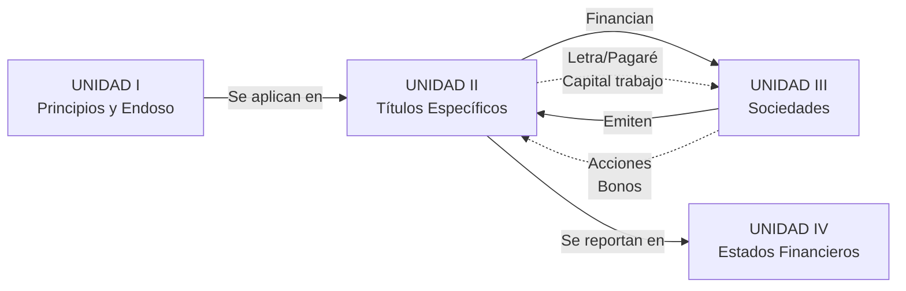

# Unidad II: Títulos Valores Específicos

## Objetivo de Aprendizaje

> Comprender y evaluar la aplicación correcta de los títulos valores específicos, tales como la **letra de cambio**, **cheques** (incluidos especiales), **pagarés**, **factura conformada**, **certificados bancarios** y otros, dominando sus características técnicas y operativas.

---

## 📋 Notas Atómicas de la Unidad

| # | Nota | Tema | Artículos LTV |
|---|------|------|---------------|
| 1 | [[unidad-2/letra-cambio-concepto\|Letra de Cambio]] | Orden de pago, 3 sujetos, aceptación | Arts. 119-153 |
| 2 | [[unidad-2/pagare\|Pagaré]] | Promesa de pago, 2 sujetos | Arts. 154-162 |
| 3 | [[unidad-2/cheque-concepto\|Cheque - Concepto]] | Pago a la vista, banco como girado | Arts. 174-217 |
| 4 | [[unidad-2/cheques-especiales\|Cheques Especiales]] | 8 tipos (cruzado, certificado, gerencia, etc.) | Arts. 190-217 |
| 5 | [[unidad-2/factura-conformada\|Factura Conformada]] | Crédito comercial, título causal | Arts. 163-175 |
| 6 | [[unidad-2/certificado-bancario-moneda-extranjera\|Certificado Bancario]] | Depósito a plazo, inversión | Arts. 218-224 |
| 7 | [[unidad-2/certificado-deposito-warrant\|Certificado de Depósito y Warrant]] | Almacenes generales, garantía prendaria mercancías | Arts. 239-252 |

**Total: 7 notas condensadas** (verificadas según Ley 27287 contexto Perú)

---

## Mapa Conceptual de la Unidad

```mermaid
graph TD
    A[Títulos Valores Específicos<br/>Ley 27287 Arts. 119-257] --> B[Letra de Cambio<br/>Arts. 119-153]
    A --> C[Pagaré<br/>Arts. 154-162]
    A --> D[Cheque<br/>Arts. 174-217]
    A --> E[Factura Conformada<br/>Arts. 163-175]
    A --> F[Certificado Bancario<br/>Arts. 218-224]
    
    B --> B1[Orden de Pago<br/>3 Sujetos]
    B --> B2[Requiere Aceptación]
    B --> B3[Vencimiento:<br/>4 formas]
    B --> B4[Protesto:<br/>8 días hábiles]
    
    C --> C1[Promesa de Pago<br/>2 Sujetos]
    C --> C2[NO Requiere Aceptación]
    C --> C3[Obligado desde<br/>emisión]
    
    D --> D1[A la Vista<br/>Inmediato]
    D --> D2[Solo Banco<br/>como girado]
    D --> D3[Cheques Especiales:<br/>8 tipos]
    
    D3 --> D3A[1. Cruzado]
    D3 --> D3B[2. Certificado]
    D3 --> D3C[3. Gerencia]
    D3 --> D3D[4. Viajero]
    D3 --> D3E[5. Pago Diferido]
    D3 --> D3F[6. Intransferible]
    D3 --> D3G[7. Abono Cuenta]
    D3 --> D3H[8. Garantizado]
    
    E --> E1[Título Causal]
    E --> E2[Compraventa<br/>comercial]
    E --> E3[Conformidad<br/>8 días]
    
    F --> F1[Solo Bancos<br/>SBS]
    F --> F2[Depósito<br/>Plazo Fijo]
    F --> F3[Inversión<br/>+ Intereses]
    
    style B fill:#e1f5ff
    style C fill:#fff4e1
    style D fill:#ffe1e1
    style E fill:#e1ffe1
    style F fill:#ffe1f5
```



---

## Contenido de la Unidad

### Semanas 5-6: La Letra de Cambio, Pagaré y Cheque

#### 📚 [[unidad-2/letra-cambio-concepto|Letra de Cambio]]

**Naturaleza:** Orden de pago diferido (Arts. 119-153 LTV)

**Sujetos:**
- **Librador:** Quien emite y ordena el pago
- **Girado:** Quien debe pagar (tras aceptar se convierte en aceptante)
- **Tomador/Beneficiario:** A quien se debe pagar

**Formas de Vencimiento (Art. 142 LTV):**
1. **A fecha fija:** "30 de junio de 2025" (día calendario específico)
2. **A la vista:** Al presentarse (pago inmediato)
3. **A cierto plazo de la aceptación:** "90 días desde aceptación"
4. **A cierto plazo de su giro:** "60 días desde emisión"

**Aceptación (Arts. 128-133):**
- Acto por el cual el girado se obliga a pagar
- Debe ser pura y simple (no condicionada)
- Puede ser parcial
- Si girado no acepta → protesto por falta de aceptación

**Actos Cambiarios Clave:**
- **Emisión:** Librador crea la letra
- **Aceptación:** Girado se compromete a pagar
- **Endoso:** Transmisión mediante [[unidad-1/endoso-titulos-valores|endoso]]
- **Pago:** Extinción de la obligación
- **Protesto:** Constancia notarial de rechazo (8 días hábiles)

**Función Principal:** Instrumento de **crédito comercial** entre empresas

---

#### 📚 [[unidad-2/pagare|El Pagaré]]

**Naturaleza:** Promesa de pago (Arts. 154-162 LTV)

**Diferencia clave con letra:**
- **Letra:** "Tú (girado) pagarás" → Orden de pago
- **Pagaré:** "Yo (emitente) pagaré" → Promesa de pago

**Sujetos:**
- **Emitente:** Obligado principal desde la emisión (NO requiere aceptación)
- **Beneficiario:** Acreedor, quien recibirá el pago

**Ventajas:**
- ✅ Más simple que letra (2 sujetos vs 3)
- ✅ NO requiere aceptación
- ✅ Obligado principal claro desde emisión
- ✅ Menos formalidades

**Formas de Vencimiento:**
- A fecha fija (más común en Perú)
- A la vista
- A cierto plazo de su emisión

**Aplicación de Normas:**
El pagaré se rige por normas de la letra de cambio en lo que corresponda (Art. 162 LTV)

**Función Principal:** Documentar **préstamos directos** y créditos personales

---

#### 📚 [[unidad-2/cheque-concepto|El Cheque]]

**Naturaleza:** Orden de pago **a la vista** contra un **banco** (Arts. 174-217 LTV)

**Características Esenciales:**
- ✅ **Girado:** Solo instituciones bancarias (Art. 174)
- ✅ **Vencimiento:** Siempre a la vista (pago inmediato)
- ✅ **Presupone:** Provisión de fondos en cuenta corriente
- ❌ **NO requiere:** Aceptación (prohibida en cheques)

**Plazos de Presentación (Art. 187):**
- Mismo lugar de emisión: **30 días**
- Distinto lugar (dentro Perú): **45 días**
- Emitido en el extranjero: **90 días**

**Sanción Penal y Administrativa por Giro sin Fondos:**
- **2 o más cheques** rechazados en 6 meses
- Consecuencia: **Cierre de cuenta** + inhabilitación temporal (1 año)
- Reporte a Central de Riesgos (SBS)

**Causales de Rechazo Legítimas:**
| Causal | Efecto |
|--------|--------|
| Falta de fondos | Reporte Central de Riesgos + protesto |
| Firma no coincidente | Protección contra fraude |
| Cuenta cerrada | Posible infracción penal |
| Orden de revocación | Solo válida tras vencer plazo presentación |
| Defecto de forma | Rechazo justificado |

**Función Principal:** **Medio de pago inmediato** (sustituto dinero en efectivo)

---

### Semana 6: Cheques Especiales

> **💡 Para un análisis detallado de los 8 tipos de cheques especiales reconocidos en la Ley 27287, consulte:**
> 
> [[unidad-2/cheques-especiales|Cheques Especiales - Guía Completa]]

#### 📚 Los 8 Tipos de Cheques Especiales (Ley 27287)

**1. Cheque Cruzado (Arts. 190-191)**
```
   ════════
   ║      ║
   ════════
```
- Dos líneas paralelas en el anverso
- **Efecto:** Solo puede cobrarse mediante abono en cuenta bancaria
- **Tipos:**
  - **General:** Sin nombre de banco entre líneas → cualquier banco
  - **Especial:** Nombre de banco específico → solo ese banco
- **Finalidad:** Mayor seguridad, impide cobro en efectivo por ladrones

**2. Cheque para Abono en Cuenta (Art. 192)**
- Cláusula: "Para abono en cuenta" o "Para acreditar en cuenta"
- **Efecto:** Obligatoriamente se abona en cuenta del beneficiario
- NO puede cobrarse en efectivo bajo ninguna circunstancia
- **Uso:** Operaciones donde se requiere trazabilidad total

**3. Cheque Intransferible (Art. 193)**
- Cláusula: "No negociable" o "Intransferible" o "No a la orden"
- **Efecto:** Solo puede cobrarlo el beneficiario original nombrado
- NO admite endoso
- **Uso típico:** 
  - Pago planillas (seguridad trabajadores)
  - Protección contra robo/extravío
  - Cumplimiento normas anti-lavado

**4. Cheque Certificado (Art. 194)**
- El **banco certifica** que existen fondos al momento de certificación
- Efectos:
  - Banco **retiene/bloquea los fondos** por plazo determinado (típico 30 días)
  - Librador NO puede girar contra esos fondos
  - Mayor seguridad para beneficiario
  - Banco cobra comisión al librador
- **Validez:** Solo durante plazo certificación (luego vuelve a cheque común)

**5. Cheque de Gerencia (Art. 195)**
- Emitido por el **propio banco**
- Girado contra sí mismo (banco librador = banco girado)
- **Solvencia:** Respaldado por patrimonio del banco emisor
- **Proceso de emisión:**
  1. Cliente solicita al banco
  2. Cliente paga monto + comisión
  3. Banco emite cheque a nombre del beneficiario
- **Uso típico:** 
  - Transacciones inmobiliarias alto monto
  - Operaciones internacionales
  - Máxima garantía de pago

**6. Cheque Garantizado (Art. 196)**
- Banco garantiza pago hasta cierto monto límite
- Tarjeta de garantía especial acompaña al cheque
- Similar a certificado pero con tarjeta de respaldo
- **Uso:** Menos común en Perú actual (reemplazado por tarjetas débito/crédito)

**7. Cheque de Viajero / Traveler's Check (Art. 197)**
- Emitido por bancos internacionales grandes
- **Doble firma:** 
  - Primera al adquirir (en presencia cajero)
  - Segunda al cobrar (verificación identidad)
- Reembolsable si se pierde o roba
- **Uso:** Viajes internacionales (hoy reemplazado por tarjetas)

**8. Cheque de Pago Diferido (Art. 198-217)**
- **Excepción** a la regla "a la vista"
- Indica **fecha futura** de pago (máx 30 días desde emisión típico)
- **Presentación:** NO puede presentarse antes de fecha indicada
- Banco verifica fondos en la fecha señalada
- **Uso:** 
  - Financiamiento comercial corto plazo
  - Post-fechado (común en Perú)
  - Garantía de operaciones a futuro inmediato

**Nota:** El cheque post-fechado (común en comercio peruano) NO tiene respaldo legal específico, pero se acepta como práctica comercial.

---

### Semana 7: Factura Conformada y Certificado Bancario

#### 📚 [[unidad-2/factura-conformada|Factura Conformada]]

**Definición:** Título valor **causal** que documenta compraventa de bienes o prestación de servicios, con conformidad del comprador (Arts. 163-175 LTV).

**Naturaleza:**
- Título **causal** (ligado directamente a la compraventa)
- NO es totalmente abstracto (conexión con relación subyacente)
- Combina factura comercial + título valor

**Requisitos Esenciales (Art. 163):**
1. Denominación "Factura Conformada"
2. Datos completos vendedor (RUC, dirección)
3. Datos completos comprador
4. Descripción detallada bienes/servicios
5. Precio total y condiciones de pago
6. **Conformidad del comprador** (firma + sello)
7. Fecha de emisión y vencimiento
8. Firma del vendedor (emitente)

**Conformidad del Comprador (Art. 165):**
- Comprador debe manifestar conformidad o rechazo fundado en **8 días hábiles**
- Si NO se pronuncia en 8 días: **se entiende conformada automáticamente**
- Rechazo debe ser motivado y comunicado al vendedor

**Plazo Máximo de Vencimiento:** 
- **360 días** (un año) desde emisión (Art. 167)

**Intereses (Art. 166):**
- Puede pactarse tasa de interés compensatorio
- Si NO se indica tasa: NO genera intereses
- Intereses moratorios por retraso según pacto

**Transmisibilidad:**
- Se transmite mediante [[unidad-1/endoso-titulos-valores|endoso]] (si es a la orden)
- Aplicación de reglas generales de endoso

**Función Principal:** 
- Formalizar **créditos comerciales** derivados de compraventa
- Permite **descuento bancario** (factoring)
- Facilita financiamiento capital de trabajo

---

#### 📚 [[unidad-2/certificado-bancario-moneda-extranjera|Certificado Bancario]]

**Definición:** Título valor emitido por bancos que acredita **depósito de dinero** a plazo fijo, generando intereses (Arts. 218-224 LTV).

**Características Esenciales:**
- **Emitente:** Solo bancos autorizados por SBS (Superintendencia Banca y Seguros)
- **Plazo:** Determinado y fijo (plazos típicos: 30, 60, 90, 180, 360 días)
- **Interés:** Genera intereses según tasa pactada (TEA)
- **Renovable:** Puede renovarse automáticamente al vencimiento
- **Intransmisible** por defecto (salvo pacto contrario)

**Tipos según Moneda:**
- **Moneda nacional:** Soles peruanos (PEN)
- **Moneda extranjera:** Dólares estadounidenses (USD), euros (EUR), etc.

**Requisitos Formales (Art. 218):**
1. Denominación "Certificado Bancario"
2. Nombre y RUC del banco emisor
3. Nombre del depositante/beneficiario
4. Monto del depósito
5. Moneda (soles o extranjera)
6. Plazo y fecha de vencimiento
7. Tasa de interés (TEA)
8. Lugar y fecha de emisión
9. Firma autorizada del banco

**Transmisibilidad (Art. 219):**
- Puede ser **nominativo** o **a la orden**
- Si es a la orden: se transmite por [[unidad-1/endoso-titulos-valores|endoso]]
- Típicamente son nominativos (intransferibles)

**Vencimiento Anticipado:**
- Depositante puede solicitar retiro antes de vencimiento
- Banco puede aplicar **penalidad** (pérdida intereses total/parcial)
- Según reglamento y contrato

**Función Principal:** 
- Instrumento de **ahorro e inversión** de corto/mediano plazo
- Ofrece mayor tasa que cuenta de ahorros
- Respaldado por FSD (Fondo de Seguro de Depósitos) hasta UIT 110,860 soles en Perú

---

## Otros Títulos Valores (Referencia Informativa)

**Nota:** Los siguientes títulos NO tienen notas atómicas dedicadas en este curso, pero se mencionan para completitud:

### Certificado de Depósito y Warrant
- Sistema dual de títulos sobre mercancías en almacenes generales
- **Certificado:** Acredita propiedad
- **Warrant:** Acredita prenda (garantía)
- Permite financiar inventarios sin vender

### Factura Negociable (Ley N° 29623)
- Título valor electrónico
- Representa crédito de factura comercial electrónica
- Facilita financiamiento MYPES
- Plataforma digital SUNAT

### Valores Mobiliarios
- Acciones, bonos, obligaciones
- Regulados por Ley del Mercado de Valores
- Supervisados por SMV
- Desmaterializados en CAVALI

---

### Semana 8: Examen Parcial

**Objetivo:** Aplicación práctica sobre la utilización de Títulos Valores en las empresas

**Competencias evaluadas:**
- Distinguir entre letra, pagaré y cheque
- Identificar el título valor adecuado según situación comercial
- Aplicar correctamente formas de vencimiento
- Redactar cláusulas especiales
- Resolver casos de circulación y protesto

---

## Tabla Comparativa: Los 4 Títulos Valores Principales

| Aspecto | [[unidad-2/letra-cambio-concepto\|Letra de Cambio]] | [[unidad-2/pagare\|Pagaré]] | [[unidad-2/cheque-concepto\|Cheque]] | [[unidad-2/factura-conformada\|Factura Conformada]] |
|---------|---------|---------|---------|-------------------|
| **Artículos LTV** | 119-153 | 154-162 | 174-217 | 163-175 |
| **Naturaleza** | Orden de pago | Promesa de pago | Orden de pago | Título causal |
| **N° Sujetos** | 3 (librador-girado-tomador) | 2 (emitente-beneficiario) | 3 (librador-banco-beneficiario) | 2 (vendedor-comprador) |
| **Girado/Obligado** | Cualquier persona/empresa | Emitente (desde inicio) | Solo banco | Comprador conformante |
| **Vencimiento** | Diferido (4 formas) | Diferido | **A la vista** (inmediato) | Diferido (máx 360 días) |
| **Aceptación** | **SÍ** requiere | **NO** requiere | **NO** requiere (prohibida) | **NO** (conformidad ≠ aceptación) |
| **Fondos previos** | NO requerido | NO requerido | **SÍ requerido** (cuenta corriente) | NO aplica |
| **Función principal** | Crédito comercial entre empresas | Préstamo directo, crédito personal | Medio de pago inmediato | Crédito por compraventa |
| **Abstracto/Causal** | Abstracto | Abstracto | Abstracto | **Causal** (ligado a venta) |
| **Protesto** | Falta aceptación o pago | Falta de pago | Falta de pago | Falta de pago |
| **Plazo protesto** | 8 días hábiles | 8 días hábiles | 8 días hábiles | 8 días hábiles |
| **Endosable** | ✅ Sí (múltiples endosos) | ✅ Sí | ✅ Sí (pero típico nominativo) | ✅ Sí (si es "a la orden") |
| **Uso común Perú** | ✅✅ Muy frecuente | ✅✅✅ Muy frecuente | ✅✅✅ Muy frecuente | ✅ Medianamente frecuente |

### Cuándo usar cada título:

**Letra de Cambio:** Ventas a crédito donde se quiere involucrar un tercero obligado (ej: matriz garantiza filial)

**Pagaré:** Préstamos directos, créditos simples, obligación clara de UN deudor

**Cheque:** Pagos inmediatos en transacciones comerciales (sustituye efectivo)

**Factura Conformada:** Formalizar ventas a crédito cuando hay entrega de bienes/servicios documentada

---

## Casos Prácticos Integradores

### Caso 1: Elección del Título Valor

**Situación:**
- Empresa A vende mercadería a B por S/ 200,000
- B no tiene liquidez inmediata
- A necesita garantía de pago

**Opciones:**
1. **Letra de cambio:** 
   - Pro: B puede conseguir aceptante (banco, matriz)
   - Contra: Más complejo
2. **Pagaré:**
   - Pro: Más simple, B es obligado directo
   - Contra: Solo responsabilidad de B
3. **Factura conformada:**
   - Pro: Ligada directamente a la venta
   - Contra: Menos abstracta

**Recomendación:** Pagaré (simplicidad) + Aval de tercero (seguridad)

### Caso 2: Seguridad en Pago

**Situación:**
- Venta de inmueble por S/ 500,000
- Comprador desconocido
- Vendedor quiere seguridad máxima

**Opciones de pago:**
1. **Cheque personal:** ❌ Riesgo de rechazo
2. **Cheque certificado:** ✅ Banco garantiza fondos
3. **Cheque de gerencia:** ✅✅ Banco es el obligado (máxima seguridad)
4. **Transferencia bancaria:** ✅✅ Pago inmediato

**Recomendación:** Cheque de gerencia o transferencia bancaria

### Caso 3: Financiamiento de Inventarios

**Situación:**
- Empresa X tiene mercancías en almacén por S/ 1'000,000
- Necesita S/ 600,000 de liquidez urgente
- No quiere vender las mercancías

**Solución:**
- Depositar mercancías en **almacén general de depósito**
- Obtener Certificado de Depósito + Warrant
- Endosar **Warrant en garantía** a banco por préstamo de S/ 600,000
- Mantener propiedad (Certificado de Depósito)
- Cuando pague: recupera el Warrant y retira mercancías

---

## Conexiones con Otras Unidades



**Vínculos específicos:**
- ← **Unidad I:** Los [[unidad-1/principios-titulos-valores|5 principios]] y [[unidad-1/endoso-titulos-valores|mecanismos de endoso]] se aplican a TODOS los títulos específicos
- → **Unidad III:** Títulos valores (letra, pagaré) financian [[unidad-3/sociedad-anonima-concepto|constitución de sociedades]]; sociedades emiten acciones y bonos
- → **Unidad IV:** Cartera de títulos valores se valúa y reporta en [[unidad-4/estados-financieros-lgs|estados financieros]]

---

## Marco Normativo de la Unidad

### Ley Principal
**Ley N° 27287** - Ley de Títulos Valores (2000)

### Artículos Clave por Título Valor
- **Letra de Cambio:** Arts. 119-153 (35 artículos)
- **Pagaré:** Arts. 154-162 (9 artículos - aplica normas de letra supletoriamente)
- **Cheque:** Arts. 174-217 (44 artículos)
  - **Cheques especiales:** Arts. 190-217
- **Factura Conformada:** Arts. 163-175 (13 artículos)
- **Certificado Bancario:** Arts. 218-224 (7 artículos)

### Normas Complementarias Perú
- **Ley N° 29623** - Ley de Factura Negociable (2011)
- **Ley del Mercado de Valores** - Decreto Legislativo N° 861 (valores mobiliarios)
- **Ley General del Sistema Financiero** - Ley N° 26702 (certificados bancarios, cheques)
- **Código Civil Arts. 1529-1601** - Compraventa (factura conformada)
- **Circular SBS** - Regulación operativa de cheques

### Instituciones Reguladoras
- **SBS** (Superintendencia de Banca, Seguros y AFP) - Supervisa bancos emisores de cheques/certificados
- **SMV** (Superintendencia del Mercado de Valores) - Supervisa valores mobiliarios
- **SUNARP** - Registro de protestos
- **CAVALI** - Institución de compensación y liquidación de valores

---

## Preguntas de Autoevaluación

1. **¿En qué casos es más conveniente usar un pagaré que una letra de cambio?**
2. **¿Por qué un cheque de gerencia es más seguro que un cheque certificado?**
3. **¿Cuáles son las 4 formas de vencimiento de una letra de cambio según el Art. 142 LTV?**
4. **¿Qué diferencia hay entre "conformidad" (factura) y "aceptación" (letra)?**
5. **¿Por qué un cheque NO puede ser aceptado por el banco girado?**
6. **¿Cuál es la ventaja principal de la factura negociable para las MYPES?**
7. **¿Qué cheque especial recomendarías para pago de planillas y por qué?**
8. **¿Cuál es el plazo máximo de vencimiento de una factura conformada?**

---

## Objetivos de Aprendizaje Logrados

Al finalizar esta unidad, el estudiante será capaz de:

✅ **Distinguir** entre letra, pagaré, cheque según naturaleza jurídica (Arts. 119-217 LTV)
✅ **Identificar** el título valor apropiado según situación comercial específica
✅ **Redactar** correctamente cada tipo de título con requisitos formales esenciales
✅ **Reconocer** los 8 cheques especiales y determinar uso adecuado
✅ **Aplicar** las 4 formas de vencimiento de letra de cambio
✅ **Evaluar** riesgos y ventajas de cada título en operaciones empresariales
✅ **Resolver** casos prácticos de circulación, protesto y ejecución según Ley 27287

---

## Navegación

← [[01-indice-unidad-1-titulos-valores|Unidad I: Títulos Valores - Reglas Generales]]  
↑ [[00-indice-derecho-empresarial|Índice General del Curso]]  
→ [[03-indice-unidad-3-sociedades|Unidad III: Ley General de Sociedades]]

---

*Última actualización: 22 de octubre de 2025*  
*Metodología: KDD (Knowledge-Driven Discovery)*  
*Verificado contra: Ley 27287 - Contexto Perú*
