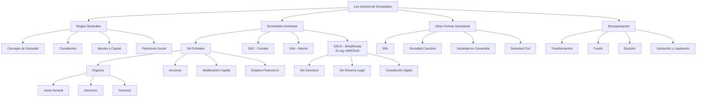
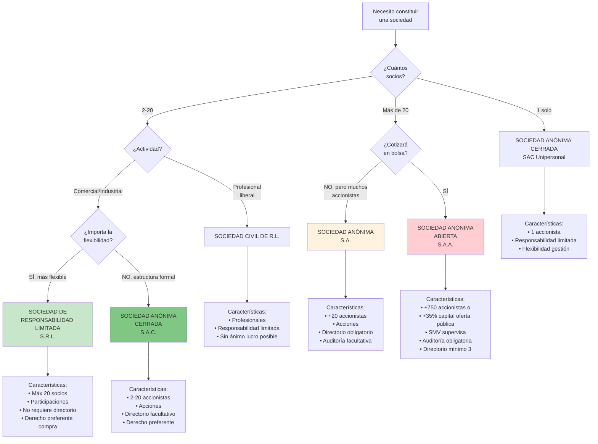
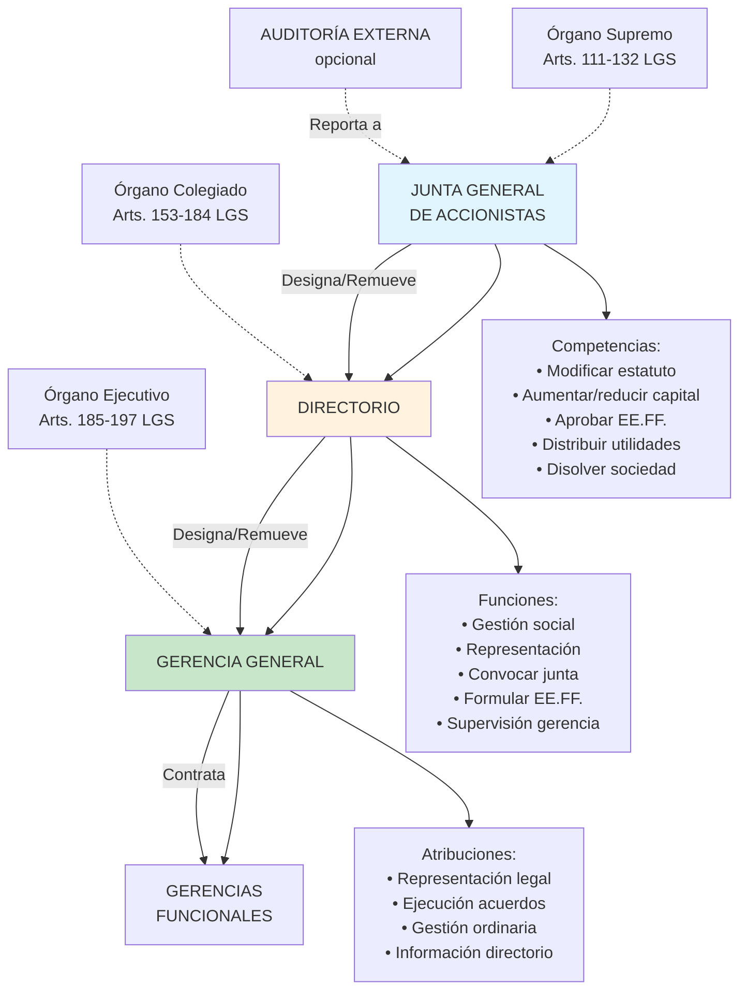

# Unidad III: Ley General de Sociedades

## Objetivo de Aprendizaje

> Comprender e identificar la aplicación correcta de las **formas societarias** como personas jurídicas establecidas en la Ley General de Sociedades (Ley N° 26887), incluyendo reglas generales y específicas de constitución, organización, modificación y extinción.

---

## 📋 Notas Atómicas de la Unidad

| # | Nota | Tema | Artículos LGS |
|---|------|------|---------------|
| 1 | [[unidad-3/concepto-sociedad\|Concepto de Sociedad]] | Elementos esenciales, personalidad jurídica | Arts. 1-49 |
| 2 | [[unidad-3/sociedad-anonima-concepto\|Sociedad Anónima (SA/SAC/SAA)]] | Denominación, capital, constitución, acciones | Arts. 50-264 |
| 3 | [[unidad-3/sociedad-anonima-cerrada-simplificada\|SACS]] | Constitución digital, sin directorio, sin reserva legal | D.Leg 1409/2018 |
| 4 | [[unidad-3/sociedad-responsabilidad-limitada\|SRL]] | Máx 20 socios, participaciones, régimen simplificado | Arts. 283-294 |
| 5 | [[unidad-3/junta-general-accionistas\|Junta General de Accionistas]] | Órgano supremo, competencias, quórum, mayorías | Arts. 111-149 |
| 6 | [[unidad-3/directorio\|Directorio]] | Órgano colegiado, funciones, responsabilidad | Arts. 153-184 |
| 7 | [[unidad-3/gerencia\|Gerencia]] | Representación legal, gestión diaria, atribuciones | Arts. 185-197 |
| 8 | [[unidad-3/disolucion-liquidacion\|Disolución y Liquidación]] | Causales, proceso, extinción, responsabilidades | Arts. 407-422 |
| 9 | [[unidad-3/transformacion-fusion-escision\|Transformación, Fusión y Escisión]] | Reorganización societaria, requisitos, efectos | Arts. 333-390 |
| 10 | [[unidad-3/otras-formas-societarias\|Otras Formas Societarias]] | Colectiva, Comandita, Civil, Contratos Asociativos | Arts. 265-309, 438-448 |

**Total: 10 notas condensadas** (verificadas según Ley 26887 y D.Leg 1409/2018 - Perú)

---

## Mapa Conceptual de la Unidad



---

## Contenido de la Unidad

### Semana 9: Reglas Generales de la LGS

#### 📚 [[concepto-sociedad|Concepto de Sociedad]]

**Definición (Art. 1 LGS):**
Quienes aportan bienes/servicios para ejercer en común actividades económicas, constituyendo **persona jurídica** distinta.

**Elementos esenciales:**
1. **Pluralidad de socios** (mínimo 2, salvo excepciones)
2. **Affectio societatis** (voluntad de asociarse)
3. **Aportes** (dinerarios o no dinerarios)
4. **Ejercicio en común** de actividades económicas
5. **Participación en resultados** (beneficios y pérdidas)
6. **Persona jurídica** independiente

**Responsabilidad:**
- **Limitada:** Solo hasta aportes (SA, SAC, SAA, SRL)
- **Ilimitada:** Con patrimonio personal (Colectiva, Comandita-socios colectivos)

**Personalidad jurídica:** Se adquiere con **inscripción en SUNARP**

---

#### 📚 Constitución de Sociedades

**Modalidades (Arts. 4-5 LGS):**

1. **Simultánea (En un solo acto):**
   - Fundadores aprueban pacto social y estatuto juntos
   - Escritura pública inmediata
   - Típico para sociedades cerradas

2. **Sucesiva (Por oferta a terceros):**
   - Oferta pública de suscripción
   - Invitación a terceros
   - Proceso más largo
   - Típico para SAA que van a bolsa

**Formalidades:**

```
Pacto Social + Estatuto
   ↓
Escritura Pública (Notario)
   ↓
Inscripción SUNARP
   ↓
Personalidad Jurídica
   ↓
RUC (SUNAT)
```

---

## 🏢 Proceso Completo de Constitución de Sociedad en Perú

```mermaid
flowchart TD
    A[Inicio: Decisión de<br/>Constituir Sociedad] --> B[Paso 1: Búsqueda y Reserva<br/>de Nombre en SUNARP]
    
    B --> B1[Costo: S/ 20.00<br/>Vigencia: 30 días]
    B1 --> C[Paso 2: Elaboración<br/>Minuta]
    
    C --> C1[Abogado redacta:<br/>• Pacto Social<br/>• Estatuto<br/>• Designación órganos]
    C1 --> D{¿Aportes no<br/>dinerarios?}
    
    D -->|SÍ| E[Valorización por<br/>Perito/Tasador]
    D -->|NO| F[Paso 3: Depósito<br/>Capital en Banco]
    E --> F
    
    F --> F1[Abrir cuenta temporal<br/>a nombre de sociedad<br/>en formación]
    F1 --> G[Paso 4: Escritura<br/>Pública ante Notario]
    
    G --> G1[Costo notarial:<br/>S/ 150-500<br/>según capital]
    G1 --> H[Paso 5: Inscripción<br/>en SUNARP]
    
    H --> H1[Presentación título:<br/>• Formulario SID-SUNARP<br/>• Escritura pública<br/>• Comprobante pago]
    
    H1 --> I[Calificación Registral<br/>Plazo: 7 días hábiles]
    
    I --> J{¿Observaciones?}
    J -->|SÍ| K[Subsanar en<br/>35 días hábiles]
    K --> I
    J -->|NO| L[Inscripción Aprobada<br/>Partida Registral Generada]
    
    L --> M[PERSONALIDAD JURÍDICA<br/>ADQUIRIDA]
    
    M --> N[Paso 6: RUC en SUNAT]
    N --> N1[Sistema SOL<br/>• Partida electrónica<br/>• DNI representante<br/>• Recibo servicios]
    
    N1 --> O[Paso 7: Legalización<br/>Libros Contables]
    O --> O1[Notario legaliza:<br/>• Inventarios y Balances<br/>• Diario<br/>• Mayor<br/>• Actas]
    
    O1 --> P[Paso 8: Licencia<br/>Funcionamiento Municipal]
    P --> P1[Municipalidad distrital<br/>Inspección técnica<br/>Defensa Civil]
    
    P1 --> Q[Paso 9: Autorizaciones<br/>Sectoriales]
    Q --> Q1[Si aplica:<br/>• DIGESA salud<br/>• PRODUCE industria<br/>• Ministerios específicos]
    
    Q1 --> R[SOCIEDAD OPERATIVA]
    
    style A fill:#e1f5ff
    style M fill:#c8e6c9
    style R fill:#81c784
    style J fill:#fff3e0
```



**Costos Totales Aproximados (2025):**

| Concepto | Monto (S/) |
|----------|-----------|
| Reserva nombre SUNARP | 20 |
| Minuta (abogado) | 300-800 |
| Escritura pública | 150-500 |
| Derechos registrales SUNARP | 0.96% UIT × (capital/10,000) |
| RUC (gratuito) | 0 |
| Legalización libros | 150-300 |
| Licencia municipal | 200-1,500 |
| **TOTAL APROXIMADO S.A./S.R.L.** | **1,000-3,500** |

**Tiempo Total:** 15-30 días hábiles (sin observaciones)

---

## 🔄 Diagrama de Decisión: ¿Qué Tipo de Sociedad Elegir?



---

## 🏛️ Estructura de Órganos en Sociedad Anónima



**Relaciones jerárquicas:**
- Junta General → Poder soberano
- Directorio → Administración estratégica
- Gerencia → Ejecución operativa

**Flujo de información:**
- Gerencia → Directorio: Mensual/trimestral
- Directorio → Junta: Anual (memoria + EE.FF.)
- Auditoría → Junta: Dictamen anual

**El Pacto Social (Art. 54):**
- Datos de fundadores
- Manifestación de voluntad
- Capital y aportes
- Nombramiento de administradores
- Estatuto anexo

**El Estatuto (Art. 55):**
- Denominación/razón social
- Objeto social
- Domicilio
- Plazo de duración
- Capital social
- Órganos societarios
- Distribución de utilidades
- Disolución y liquidación

---

### Semana 10: Aportes y Patrimonio Social

#### 📚 Los Aportes

**Tipos de Aportes:**

**1. Aportes Dinerarios (Art. 22 LGS):**
- Dinero en efectivo
- **Considerado pagado:** Con depósito bancario a nombre de la sociedad

**2. Aportes No Dinerarios (Arts. 23-26 LGS):**

a) **Bienes muebles:**
   - Vehículos, maquinaria, equipos
   - Considerado pagado: Con entrega física

b) **Bienes inmuebles:**
   - Terrenos, edificios
   - Considerado pagado: Con inscripción de transferencia en Registros Públicos

c) **Derechos de crédito:**
   - Cuentas por cobrar
   - Considerado pagado: Con cesión del derecho

d) **Valores mobiliarios:**
   - Acciones, bonos
   - Considerado pagado: Con transferencia registral

**Informe de Valuación (Art. 27 LGS):**
- Obligatorio para aportes no dinerarios
- Realizado por perito o empresa especializada
- Responsabilidad del aportante si sobrevaluación

**Prohibiciones:**
- ❌ Aportar servicios personales (solo en S.Civil)
- ❌ Aportar bienes futuros (salvo frutos)
- ❌ Aportar trabajo (salvo S.Civil)

---

#### 📚 Patrimonio Social

**Concepto:** Conjunto de bienes, derechos y obligaciones de la sociedad

**Componentes:**
```
ACTIVOS
- Bienes aportados
- Bienes adquiridos
- Derechos y créditos

(-) PASIVOS
- Deudas y obligaciones

(=) PATRIMONIO NETO
```

**Relación con el Plan Contable:**
- Activo = Pasivo + Patrimonio
- Patrimonio = Capital + Reservas + Resultados acumulados

**Responsabilidad:**
- **Limitada:** Sociedad responde con su patrimonio
- **Ilimitada:** + Patrimonio personal de socios (según tipo)

---

### Semanas 11-12: Sociedades Anónimas

#### 📚 [[sociedad-anonima-concepto|Naturaleza de la Sociedad Anónima]]

**Definición (Art. 50 LGS):**
Capital representado por **acciones nominativas**, socios no responden personalmente por deudas sociales.

**Características:**
- ✅ Responsabilidad limitada
- ✅ Capital en acciones
- ✅ Denominación + "S.A."
- ✅ Órganos: Junta, Directorio, Gerencia

**Tipos:**
- **SA:** Ordinaria (sin restricciones específicas)
- **SAC:** Cerrada (máx. 20 accionistas, no bolsa)
- **SAA:** Abierta (más de 750 accionistas o en bolsa)

---

#### 📚 Acciones

**Definición:** Unidad mínima de participación en el capital social

**Características:**
- **Nominativas:** Identifican titular
- **Indivisibles:** No se fraccionan
- **Acumulables:** Un accionista puede tener múltiples
- **Transmisibles:** Por venta, herencia, donación

**Tipos de Acciones:**

| Tipo | Derecho a Voto | Derecho a Dividendo | Características |
|------|----------------|---------------------|-----------------|
| **Comunes/Ordinarias** | ✅ Sí | ✅ Sí | Estándar |
| **Preferentes** | ⚠️ Limitado | ✅✅ Preferente | Dividendo antes que comunes |
| **Sin derecho a voto** | ❌ No | ✅ Sí | Máx. 50% del capital |

**Creación y Emisión:**
- Acuerdo de Junta General
- Estatuto establece clases de acciones
- Certificados de acciones o anotaciones en cuenta

**Registro de Matrícula de Acciones:**
- Libro obligatorio
- Identifica accionistas y acciones
- Transferencias se anotan aquí
- Genera presunción de propiedad

---

#### 📚 Órganos de la Sociedad Anónima

**Estructura de Gobierno Corporativo:**

```
Junta General de Accionistas (SUPREMO)
        ↓ elige/remueve
    Directorio (ADMINISTRACIÓN)
        ↓ designa/remueve
    Gerencia (GESTIÓN EJECUTIVA)
```

**1. Junta General de Accionistas:**

**Naturaleza:** Órgano **supremo**

**Competencias:**
- Modificar estatuto
- Aumentar/reducir capital
- Elegir/remover directores
- Aprobar estados financieros
- Distribuir utilidades
- Disolver, transformar, fusionar

**Tipos de Junta:**
- **Obligatoria Anual:** Dentro de 3 meses post-cierre ejercicio
  - Aprueba estados financieros
  - Distribuye utilidades
  - Elige directorio
- **Junta General:** Para asuntos específicos
- **Junta Universal:** 100% capital presente (sin convocatoria)

**Quórum y Acuerdos:**

| Tipo | Quórum | Acuerdo |
|------|--------|---------|
| **Simple** | 50% + 1 acciones | Mayoría simple de presentes |
| **Calificado** | 2/3 capital | 2/3 o más de presentes |

**Libro de Actas:** Obligatorio, registra acuerdos

---

**2. El Directorio:**

**Naturaleza:** Órgano **colegiado** de administración

**Composición:**
- Mínimo **3 directores** (SA, SAA)
- Facultativo en SAC
- Periodo: Máximo 3 años (reelegibles)

**Elección:** Por Junta General

**Funciones:**
- Representar a la sociedad
- Establecer políticas estratégicas
- Designar y remover gerentes
- Supervisar gestión
- Convocar Junta General
- Aprobar presupuestos

**Responsabilidad:**
- **Solidaria** frente a la sociedad y terceros
- Por daños por dolo o culpa
- **Caducidad:** 2 años desde acto lesivo o cese

**Impedimentos:** (No pueden ser directores)
- Incapaces, fallidos no rehabilitados
- Funcionarios públicos (salvo representantes del Estado)
- Personas con condenas por delitos específicos

---

**3. La Gerencia:**

**Naturaleza:** Órgano de **gestión ejecutiva**

**Designación:**
- Por Directorio (si existe)
- Por Junta General (si no hay Directorio - SAC)

**Duración:** Indeterminada (salvo pacto)

**Atribuciones:**
- Administración diaria
- Ejecución de acuerdos del Directorio
- Representación procesal
- Llevar libros societarios
- Preparar estados financieros
- Contratar y despedir personal

**Responsabilidad:**
- Igual que directores (solidaria, por dolo/culpa)
- **Caducidad:** 2 años

---

### Semana 13: Modificación del Capital y Estados Financieros

#### 📚 Modificación del Estatuto

**Órgano competente:** Junta General (acuerdo calificado típicamente)

**Aspectos modificables:**
- Denominación, objeto social, domicilio
- Plazo de duración
- Capital social
- Régimen de órganos
- Distribución de utilidades

**Formalidades:**
1. Acuerdo de Junta (quórum y mayoría calificada)
2. Escritura pública
3. Inscripción en SUNARP

---

#### 📚 Aumento de Capital

**Requisito previo:** Capital anterior **totalmente pagado** (Art. 204 LGS)

**Modalidades (Art. 201 LGS):**

1. **Nuevos aportes:**
   - De accionistas o terceros
   - Derecho de suscripción preferente de accionistas

2. **Capitalización de créditos:**
   - Deudas → Capital
   - Acreedores se convierten en accionistas

3. **Capitalización de reservas/utilidades:**
   - Reservas libres o utilidades → Capital
   - No implica nuevos aportes

4. **Revaluación de activos:**
   - Ajuste por inflación o valor real
   - Mayor patrimonial → Capital

**Derecho de Suscripción Preferente:**
- Accionistas tienen prioridad para suscribir nuevas acciones
- Mantienen su participación proporcional
- Plazo mínimo: 10 días

---

#### 📚 Reducción de Capital

**Modalidades (Art. 215 LGS):**

1. **Devolución de aportes:**
   - Entrega activos a accionistas
   - Proporcional a participación

2. **Condonación de dividendos pasivos:**
   - Libera a accionistas de aportes comprometidos no pagados

3. **Compra de acciones para amortización:**
   - Sociedad compra propias acciones y las cancela

4. **Absorción de pérdidas:**
   - Ajuste contable por pérdidas acumuladas

**Protección de Acreedores (Art. 219 LGS):**
- Derecho de **oposición** (30 días desde publicación)
- Si se oponen: Pago de deuda o garantía suficiente
- Oposición fundada **suspende** la reducción

---

#### 📚 Estados Financieros y Memoria

**Contenido de la Memoria (Art. 221 LGS):**
1. Situación económica y financiera
2. Evolución de negocios y resultados
3. Acontecimientos posteriores al cierre
4. Situación de subsidiarias
5. Proyectos y perspectivas
6. Propuesta de aplicación de utilidades

**Estados Financieros (Art. 223 LGS):**
1. Estado de Situación Financiera (Balance General)
2. Estado de Resultados
3. Estado de Cambios en el Patrimonio
4. Estado de Flujos de Efectivo
5. Notas explicativas

**Preparación:** Conforme a **NIC/NIIF**

**Aprobación:** Junta Obligatoria Anual

---

#### 📚 Reserva Legal y Dividendos

**Reserva Legal (Art. 229 LGS):**
- Detraer mínimo **10% utilidad neta** anual
- Hasta alcanzar **20% capital pagado**
- Finalidad: Protección patrimonial
- Uso: Solo compensar pérdidas

**Dividendos (Arts. 230-233 LGS):**

**Requisitos para distribuir:**
1. Utilidad neta del ejercicio (o acumuladas)
2. Reserva legal cubierta
3. Acuerdo de Junta General

**Dividendos obligatorios:**
- Si hay utilidades y no hay pérdidas acumuladas
- Accionistas con derecho a mínimo **30% utilidad distribuible**

**Caducidad:** 3 años desde exigibilidad

**Auditoría Externa:**
- **Obligatoria:** SAA anualmente
- **Facultativa:** SA y SAC (salvo estatuto)

---

### Semana 13-14: Formas Especiales de SA y Otras Sociedades

#### 📚 Sociedad Anónima Cerrada (SAC)

**Requisitos (Art. 234 LGS):**
- Máximo **20 accionistas**
- **No tiene** acciones inscritas en Bolsa

**Denominación:** "S.A.C." o "Sociedad Anónima Cerrada"

**Características especiales:**
- **Directorio facultativo** (no obligatorio)
- **Derecho de adquisición preferente:** Accionistas tienen preferencia para comprar acciones de otros socios
- **Exclusión de accionistas:** Por causas estatutarias graves
- Pensada para sociedades **familiares o cerradas**

---

#### 📚 Sociedad Anónima Abierta (SAA)

**Supuestos de SAA (Art. 249 LGS):**
- Hizo oferta pública primaria de acciones
- Tiene más de **750 accionistas**
- Más del 35% del capital pertenece a 175+ accionistas
- Se constituye como tal voluntariamente

**Denominación:** "S.A.A." o "Sociedad Anónima Abierta"

**Obligaciones especiales:**
- **Directorio obligatorio** (mín. 3)
- **Auditoría externa obligatoria**
- **Supervisión por SMV** (Superintendencia del Mercado de Valores)
- Mayor **transparencia informativa** (hechos de importancia)

---

#### 📚 Otras Formas Societarias

**1. Sociedad Colectiva (Arts. 265-279 LGS):**
- Responsabilidad **ilimitada y solidaria** de socios
- **Razón social:** Incluye nombre de socios + "Sociedad Colectiva"
- Administración: Todos los socios (salvo pacto)
- Poco usada (por responsabilidad ilimitada)

**2. Sociedad en Comandita (Arts. 280-290 LGS):**

**Tipos de socios:**
- **Socios colectivos:** Responsabilidad ilimitada, administran
- **Socios comanditarios:** Responsabilidad limitada, no administran

**Variantes:**
- **Simple:** Participaciones no representadas en acciones
- **Por acciones:** Comanditarios tienen acciones

**3. Sociedad de Responsabilidad Limitada (SRL) (Arts. 283-294 LGS):**
- Capital dividido en **participaciones** (no acciones)
- Mínimo 2, máximo **20 socios**
- Responsabilidad **limitada** a aportes
- **No tiene directorio** (gestión directa de socios o gerentes)
- Denominación + "S.R.L." o "Sociedad de Responsabilidad Limitada"
- Transmisión de participaciones: Requiere consentimiento de socios (salvo pacto)

**4. Sociedad Civil (Arts. 295-304 LGS):**

**Tipos:**
- **Sociedad Civil Ordinaria:** Responsabilidad ilimitada
- **Sociedad Civil de Responsabilidad Limitada:** Limitada a aportes

**Objeto:** Ejercicio de profesiones, artes, oficios
**Razón social:** Nombre de socios + "Sociedad Civil" / "S.Civil de R.L."

---

### Semana 14: Reorganización Societaria

#### 📚 [[transformacion-fusion-escision|Transformación, Fusión y Escisión de Sociedades]]

---

## 🔄 Procesos de Reorganización Societaria

```mermaid
graph TB
    subgraph TRANSFORMACIÓN
        T1[Sociedad Tipo A] -->|Cambia forma| T2[Sociedad Tipo B]
        T2 -.->|Mantiene| T3[Misma personalidad<br/>jurídica]
        T2 -.->|Mantiene| T4[Mismo RUC]
        T2 -.->|Mantiene| T5[Mismos contratos]
    end
    
    subgraph FUSIÓN POR ABSORCIÓN
        F1[Sociedad A<br/>Absorbente] --> F3[Sociedad A<br/>Ampliada]
        F2[Sociedad B<br/>Absorbida] -->|Se extingue| F3
        F3 -.->|Asume| F4[Todo patrimonio<br/>de A y B]
    end
    
    subgraph FUSIÓN POR INCORPORACIÓN
        FI1[Sociedad A] -->|Se extinguen| FI3[Nueva Sociedad C]
        FI2[Sociedad B] -->|Se extinguen| FI3
        FI3 -.->|Asume| FI4[Patrimonios<br/>de A y B]
    end
    
    subgraph ESCISIÓN TOTAL
        E1[Sociedad A] -->|Se divide| E2[Sociedad B]
        E1 -->|Se divide| E3[Sociedad C]
        E1 -.->|Se extingue| E4[Sin liquidación]
    end
    
    subgraph ESCISIÓN PARCIAL
        EP1[Sociedad A] -->|Segrega| EP2[Sociedad B<br/>nueva]
        EP1 -.->|Subsiste| EP3[Con patrimonio<br/>reducido]
    end
    
    style T2 fill:#c8e6c9
    style F3 fill:#81c784
    style FI3 fill:#66bb6a
    style E2 fill:#fff3e0
    style E3 fill:#fff3e0
    style EP2 fill:#ffe082
```



---

## ⏱️ Línea de Tiempo: Proceso de Fusión por Absorción

```mermaid
gantt
    title Fusión de Comercial Lima SA (absorbente) + Distribuidora Norte SA (absorbida)
    dateFormat YYYY-MM-DD
    
    section Preparación
    Negociación términos fusión :done, neg, 2025-01-15, 15d
    Due diligence empresas :done, due, 2025-01-20, 20d
    Valorización empresas :done, val, 2025-02-01, 10d
    
    section Documentación
    Elaboración proyecto fusión :done, proy, 2025-02-10, 10d
    Balances auditados :done, bal, 2025-02-15, 15d
    Relación de canje :done, canje, 2025-02-20, 5d
    
    section Aprobación
    Junta Comercial Lima :crit, j1, 2025-03-01, 1d
    Junta Distribuidora Norte :crit, j2, 2025-03-01, 1d
    
    section Publicidad
    Publicación 1 El Peruano :pub1, 2025-03-05, 1d
    Publicación 2 (5 días) :pub2, 2025-03-10, 1d
    Publicación 3 (5 días) :pub3, 2025-03-15, 1d
    
    section Oposición Acreedores
    Plazo oposición 30 días :crit, opos, 2025-03-15, 30d
    
    section Formalización
    Escritura pública fusión :milestone, escr, 2025-04-20
    Inscripción SUNARP :active, sunarp, 2025-04-21, 10d
    Fusión efectiva :milestone, efect, 2025-05-01
    
    section Post-Fusión
    Integración operativa :integ, 2025-05-01, 60d
    Migración sistemas :sist, 2025-05-15, 45d
    Unificación personal :pers, 2025-06-01, 30d
```

**Duración total típica:** 3-4 meses (sin oposiciones)

---

## 📊 Comparación: Transformación vs. Fusión vs. Escisión

| Aspecto | Transformación | Fusión | Escisión |
|---------|----------------|--------|----------|
| **Personalidad jurídica** | Se mantiene | Una subsiste o nace nueva | Una o más nacen |
| **Sociedades involucradas** | 1 | 2 o más | 1 |
| **Patrimonio** | Mismo | Se suma | Se divide |
| **RUC** | Mismo | Absorbente mantiene o nuevo | Nuevos RUC |
| **Socios** | Mismos | Se integran | Se dividen o duplican |
| **Plazo mínimo** | 75 días | 90-120 días | 90-120 días |
| **Costo aproximado** | S/ 5,000-10,000 | S/ 15,000-40,000 | S/ 20,000-50,000 |

---

#### 📚 Transformación de Sociedades (Arts. 333-344 LGS)

**Definición:** Cambio de un tipo societario a otro

**Ejemplos:**
```
SRL → SA
SA → SAC
Sociedad Colectiva → SA
```

**Características:**
- **No se disuelve** la sociedad
- **Mantiene personalidad jurídica**
- **Continuidad** de derechos y obligaciones

**Requisitos:**
1. Acuerdo de Junta/socios (mayoría calificada)
2. Balance de transformación
3. Escritura pública
4. Inscripción en SUNARP

**Derecho de separación:** Socios disconformes pueden retirarse

---

#### 📚 Fusión de Sociedades (Arts. 344-357 LGS)

**Definición:** Unión de dos o más sociedades en una sola

**Modalidades:**

**1. Fusión por Incorporación:**
```
Sociedad A + Sociedad B → Nueva Sociedad C
(A y B se disuelven, nace C)
```

**2. Fusión por Absorción:**
```
Sociedad A (absorbente) + Sociedad B (absorbida) → Sociedad A
(B se disuelve, A permanece)
```

**Requisitos:**
1. Aprobación por Junta de cada sociedad
2. Proyecto de fusión
3. Balances de fusión
4. Protección de acreedores (oposición - 30 días)
5. Escritura pública
6. Inscripción en SUNARP

---

#### 📚 Escisión de Sociedades (Arts. 367-390 LGS)

**Definición:** División del patrimonio de una sociedad

**Modalidades:**

**1. Escisión por División Total:**
```
Sociedad A → Sociedad B + Sociedad C + Sociedad D
(A se disuelve sin liquidarse, nacen B, C, D)
```

**2. Escisión por Segregación:**
```
Sociedad A → Sociedad A (permanece) + Sociedad B (nueva)
(A permanece, se crea B con parte del patrimonio)
```

**Requisitos:**
1. Aprobación por Junta
2. Proyecto de escisión
3. Balances
4. Protección acreedores
5. Escritura pública e inscripción

---

#### 📚 Disolución, Liquidación y Extinción (Arts. 407-422 LGS)

**1. Disolución:**

**Causales (Art. 407 LGS):**
- Vencimiento del plazo de duración
- Acuerdo de Junta General
- Pérdidas reducen patrimonio neto a menos de 1/3 del capital
- Continuada inactividad (Junta no funciona)
- Fusión, escisión total
- Otras causales estatutarias o legales

**Efectos:**
- Cesa representación de administradores
- Se inicia liquidación
- Denominación + "en liquidación"

**2. Liquidación:**

**Proceso:**
1. Nombramiento de **liquidadores** (Junta o estatuto)
2. Inventario y balance inicial
3. Pago de pasivos (orden de prelación)
4. Distribución del remanente entre socios
5. Balance final de liquidación
6. Extinción

**Funciones de liquidadores:**
- Concluir operaciones pendientes
- Cobrar créditos
- Pagar deudas
- Vender activos
- Distribuir remanente

**3. Extinción:**
- Inscripción del balance final en SUNARP
- Desaparición de la personalidad jurídica

---

### Contratos Asociativos (Arts. 438-448 LGS)

**Naturaleza:** **NO crean persona jurídica**

**Tipos:**

**1. Asociación en Participación:**
- Un asociado (gestor) actúa en nombre propio
- Otros participan en resultados
- Sin personería jurídica visible

**2. Consorcio:**
- Colaboración entre empresas para un proyecto específico
- Cada empresa mantiene autonomía
- Típico en construcción, minería

**3. Joint Venture:**
- Empresa conjunta para proyectos específicos
- Compartir riesgos y beneficios
- Sin crear sociedad nueva

---

## Tabla Comparativa: Tipos de Sociedades

| Aspecto | [[sociedad-anonima-concepto\|SA]] | SAC | SAA | SRL | Colectiva |
|---------|----|----|-----|-----|-----------|
| **Responsabilidad** | Limitada | Limitada | Limitada | Limitada | Ilimitada |
| **N° socios** | Min 2 | Max 20 | Min 750 | 2-20 | Min 2 |
| **Capital en** | Acciones | Acciones | Acciones | Participaciones | No aplica |
| **Directorio** | Obligatorio | Facultativo | Obligatorio | ❌ No | ❌ No |
| **Transmisibilidad** | Libre | Restringida | Libre | Muy restringida | Difícil |
| **Auditoría** | Facultativa | Facultativa | Obligatoria | Facultativa | Facultativa |
| **Bolsa** | Puede | ❌ No | ✅ Sí | ❌ No | ❌ No |
| **Uso típico** | Empresas grandes | Familiares | Públicas | PYMEs | Raro |

---

## Casos Prácticos Integradores

### Caso 1: Elección de Forma Societaria

**Situación:**
- 3 hermanos quieren constituir negocio familiar
- Capital: S/ 100,000
- No planean abrir a terceros
- Quieren administrar directamente

**Opciones:**
- **SAC:** Máx. 20 socios, sin directorio obligatorio, restringida transferencia ✅
- **SRL:** 2-20 socios, sin directorio, muy restringida transferencia ✅✅
- **SA:** Directorio obligatorio, más compleja ❌

**Recomendación:** **SRL** (más simple, control familiar, sin directorio)

### Caso 2: Aumento de Capital

**Situación:**
- SA con capital S/ 500,000 (totalmente pagado)
- Necesita S/ 300,000 para expansión
- Tiene utilidades acumuladas de S/ 200,000

**Opciones:**
1. **Capitalizar utilidades:** S/ 200,000 (sin nuevos aportes)
2. **Nuevos aportes:** S/ 100,000 (accionistas o terceros con preferencia)

**Total:** S/ 800,000 de capital social

### Caso 3: Fusión de Empresas

**Situación:**
- Empresa A (producción) y Empresa B (distribución) quieren integrarse

**Opciones:**
- **Fusión por absorción:** A absorbe a B (A permanece, B desaparece)
- **Fusión por incorporación:** Crear Empresa C (A y B desaparecen)

**Factores de decisión:**
- Tamaño relativo de empresas
- Marca/posicionamiento de cada una
- Costos tributarios y administrativos

---

## Conexiones con Otras Unidades

- ← **Unidad II:** [[acciones|Acciones]] como [[valores-mobiliarios|valores mobiliarios]]
- → **Unidad IV:** [[estados-financieros-derecho|Estados financieros]] como requisito legal

---

## Marco Normativo de la Unidad

### Ley Principal
- **Ley N° 26887** - Ley General de Sociedades

### Libros de la LGS
- **Libro I:** Reglas aplicables a todas las sociedades
- **Libro II:** Sociedad Anónima (Arts. 50-264)
- **Libro III:** Otras formas societarias
- **Libro IV:** Normas complementarias (transformación, fusión, escisión)
- **Libro V:** Contratos asociativos

### Normas Complementarias
- **Código Civil:** Aplicación supletoria
- **Ley del Mercado de Valores:** Para SAA
- **NIC/NIIF:** Estados financieros

---

## Preguntas de Autoevaluación

1. ¿Cuál es la principal diferencia entre SA, SAC y SAA?
2. ¿Por qué la Reserva Legal es obligatoria y cuál es su límite?
3. ¿En qué casos es conveniente constituir una SRL en lugar de una SA?
4. ¿Cuál es la diferencia entre fusión por absorción y por incorporación?
5. ¿Qué protección tienen los acreedores en una reducción de capital?

---

## Objetivos de Aprendizaje Logrados

Al finalizar esta unidad, el estudiante será capaz de:

✅ **Explicar** el concepto y elementos de la sociedad
✅ **Distinguir** entre los tipos de sociedades y sus características
✅ **Identificar** la forma societaria adecuada según necesidades
✅ **Comprender** la estructura de órganos de la SA
✅ **Aplicar** reglas de constitución y modificación de sociedades
✅ **Analizar** procesos de reorganización societaria
✅ **Evaluar** derechos y obligaciones de socios/accionistas
✅ **Relacionar** normativa societaria con estados financieros

---

## Navegación

- [[02-indice-unidad-2-titulos-especificos|← Unidad II: Títulos Valores Específicos]]
- [[00-indice-derecho-empresarial|↑ Índice General del Curso]]
- [[04-indice-unidad-4-informacion-financiera|Unidad IV: Información Financiera →]]

---

*Última actualización: 22 de octubre de 2025*
