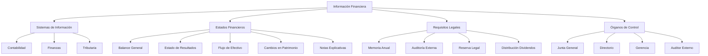
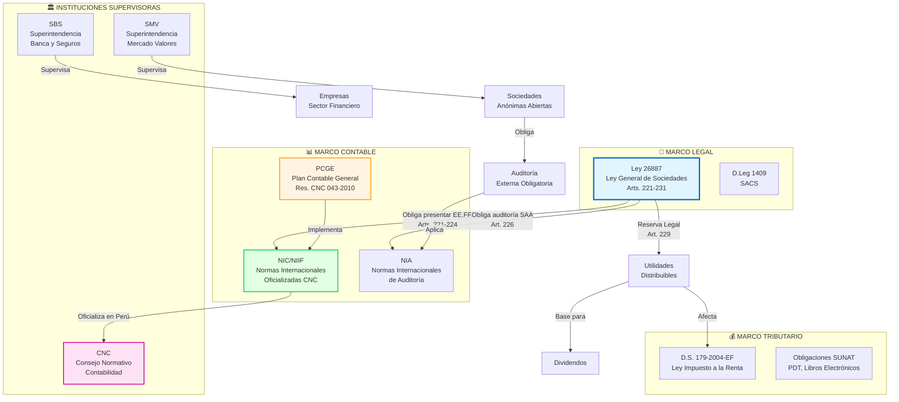
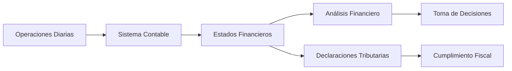

# Unidad IV: Información Financiera en el Derecho Empresarial

## Objetivo de Aprendizaje

> Comprender la importancia de la **información financiera** como instrumento necesario para conocer el estado económico de las empresas, entendiendo las características, requisitos y condiciones de presentación de los Estados Financieros establecidos en la Ley General de Sociedades.

---

## 📋 Notas Atómicas de la Unidad

| # | Nota | Tema | Artículos LGS |
|---|------|------|---------------|
| 1 | [[unidad-4/sistemas-informacion-empresarial\|Sistemas de Información Empresarial]] | Integración contable-financiera-tributaria | Art. 221 |
| 2 | [[unidad-4/estados-financieros-lgs\|Estados Financieros según LGS]] | 5 EE.FF. obligatorios, NIC/NIIF, PCGE | Arts. 221-224 |
| 3 | [[unidad-4/memoria-anual\|Memoria Anual]] | Informe de gestión, situación económica | Arts. 221-222 |
| 4 | [[unidad-4/auditoria-externa\|Auditoría Externa]] | Obligatoriedad SAA, NIA, responsabilidad | Art. 226 |
| 5 | [[unidad-4/reserva-legal\|Reserva Legal]] | 10% utilidades hasta 20% capital, intangibilidad | Art. 229 |
| 6 | [[unidad-4/dividendos\|Dividendos]] | Distribución utilidades, requisitos, caducidad | Arts. 230-231 |

**Total: 6 notas condensadas** (verificadas según Ley 26887, NIC/NIIF, PCGE - Perú)

---

## Mapa Conceptual de la Unidad



---

## 🔗 Integración Marco Legal-Contable-Tributario (Perú)



---

## Semana 15: Información Financiera y Sistemas de Información

### 📚 Introducción a la Información Financiera

#### Definición

> Conjunto de datos estructurados que reflejan la **situación económica, financiera y patrimonial** de una empresa en un periodo determinado, preparados conforme a principios contables generalmente aceptados.

---

#### Importancia en el Derecho Empresarial

**1. Obligación Legal (LGS):**
- Art. 221-224 LGS: Preparación y presentación obligatoria
- Art. 114-115 LGS: Junta Obligatoria Anual debe aprobarlos
- Art. 223 LGS: Conforme a NIC/NIIF

**2. Toma de Decisiones:**
- **Accionistas:** Decidir inversión, permanencia, venta
- **Directorio:** Políticas estratégicas, financiamiento
- **Gerencia:** Gestión operativa, eficiencia
- **Acreedores:** Evaluar solvencia para créditos
- **Estado:** Determinación de impuestos

**3. Protección de Terceros:**
- Transparencia informativa
- Acceso a información para stakeholders
- Base para acciones legales

---

### 📚 Características de los Sistemas de Información

> **💡 Para un análisis detallado de los sistemas de información empresarial y su integración contable, financiera y tributaria, consulte:**
> 
> [[sistemas-informacion-empresarial]]

#### Sistemas de Información en la Empresa

**1. Sistema Contable:**

**Función:** Registrar, clasificar y resumir transacciones económicas

**Componentes:**
- **Libros contables obligatorios:**
  - Libro Diario
  - Libro Mayor
  - Libro de Inventarios y Balances
  - Registro de Compras
  - Registro de Ventas

**Base legal:**
- Código de Comercio
- Ley del Impuesto a la Renta
- Resoluciones SUNAT

**2. Sistema Financiero:**

**Función:** Gestión de recursos financieros, análisis de inversiones, financiamiento

**Herramientas:**
- Presupuestos
- Proyecciones financieras
- Análisis de ratios
- Flujo de caja proyectado

**3. Sistema Tributario:**

**Función:** Cumplimiento de obligaciones fiscales

**Componentes:**
- Registro de operaciones para efectos tributarios
- Cálculo de impuestos (IGV, Renta)
- Declaraciones mensuales y anuales
- Libros electrónicos (PLE)

---

### 📚 Organización de los Sistemas de Información en la Empresa

#### Estructura Jerárquica

```
Junta General
    ↓
Directorio
    ↓
Gerencia General
    ↓
Gerencia de Finanzas / Administración
    ↓
Departamento de Contabilidad
    ├─ Contabilidad Financiera
    ├─ Contabilidad de Costos
    ├─ Contabilidad Tributaria
    └─ Tesorería
```

#### Interrelación de Sistemas



---

### 📚 Los Estados Financieros y su Relación con el Derecho Empresarial

#### Estados Financieros Obligatorios (Art. 223 LGS)

**1. Estado de Situación Financiera (Balance General):**

**Definición:** Fotografía del **patrimonio** de la empresa en una fecha específica

**Estructura:**
```
ACTIVO = PASIVO + PATRIMONIO

ACTIVO
  Activo Corriente
  Activo No Corriente

PASIVO
  Pasivo Corriente
  Pasivo No Corriente

PATRIMONIO NETO
  Capital Social
  Reservas
  Resultados Acumulados
```

**Relación con LGS:**
- Verifica cumplimiento de capital mínimo pagado
- Base para determinar [[reserva-legal|reserva legal]]
- Identifica situaciones de pérdida patrimonial (Art. 407 - causal de disolución)

---

**2. Estado de Resultados (Estado de Ganancias y Pérdidas):**

**Definición:** Muestra el desempeño económico en un **periodo**

**Estructura:**
```
Ingresos
(-) Costo de Ventas
(=) Utilidad Bruta

(-) Gastos Operativos
(=) Utilidad Operativa

(+/-) Ingresos/Gastos Financieros
(=) Utilidad antes de Impuestos

(-) Impuesto a la Renta
(=) UTILIDAD NETA
```

**Relación con LGS:**
- Base para calcular [[reserva-legal|reserva legal]] (10% utilidad neta)
- Determina [[dividendos|dividendos distribuibles]]
- Evalúa gestión de administradores (responsabilidad)

---

**3. Estado de Cambios en el Patrimonio Neto:**

**Definición:** Explica las variaciones del **patrimonio** durante el periodo

**Componentes:**
- Saldos iniciales de capital, reservas, resultados
- Aumentos/reducciones de capital
- Aplicación de utilidades (reservas, dividendos)
- Saldos finales

**Relación con LGS:**
- Evidencia aumentos/reducciones de capital (Arts. 201-219)
- Muestra aplicación de acuerdos de Junta General
- Transparencia en cambios patrimoniales

---

**4. Estado de Flujos de Efectivo:**

**Definición:** Movimientos de **efectivo y equivalentes** en el periodo

**Clasificación:**
- **Actividades de operación:** Cobros/pagos por giro del negocio
- **Actividades de inversión:** Compra/venta de activos fijos
- **Actividades de financiamiento:** Aportes de capital, préstamos, dividendos

**Relación con LGS:**
- Evidencia capacidad de pago de dividendos
- Evalúa liquidez para operaciones
- Identifica necesidades de financiamiento

---

**5. Notas a los Estados Financieros:**

**Definición:** Información adicional que **explica y detalla** partidas de los estados financieros

**Contenido típico:**
- Políticas contables aplicadas
- Detalle de cuentas significativas
- Contingencias y compromisos
- Hechos posteriores al cierre
- Partes relacionadas

**Relación con LGS:**
- Transparencia informativa obligatoria
- Base para que accionistas tomen decisiones informadas
- Revelación de riesgos y compromisos

---

#### Principios Contables (NIC/NIIF)

**Base normativa:** Art. 223 LGS establece que los estados financieros deben prepararse **conforme a disposiciones legales sobre la materia y con principios de contabilidad generalmente aceptados**.

**En Perú:** Se adoptan las **NIC/NIIF** (Normas Internacionales de Contabilidad / Normas Internacionales de Información Financiera)

**Principios fundamentales:**
1. **Devengado:** Registrar ingresos y gastos cuando se generan (no cuando se cobran/pagan)
2. **Empresa en marcha:** Presunción de continuidad
3. **Materialidad:** Revelar información significativa
4. **Prudencia:** No sobrevalorar activos ni subestimar pasivos
5. **Consistencia:** Aplicar políticas uniformes

---

### 📚 La Memoria Anual

#### Contenido Obligatorio (Art. 221 LGS)

**La memoria debe contener cuando menos:**

1. **Situación Económica y Financiera:**
   - Análisis de resultados
   - Indicadores financieros clave
   - Comparación con años anteriores

2. **Evolución de los Negocios:**
   - Principales operaciones
   - Nuevos productos/servicios
   - Cambios en el mercado

3. **Hechos Posteriores al Cierre:**
   - Acontecimientos importantes entre cierre de ejercicio y fecha de memoria
   - Que puedan afectar la situación de la sociedad

4. **Situación de las Subsidiarias (si las hay):**
   - Resultados de empresas controladas
   - Estados financieros consolidados

5. **Proyectos y Perspectivas:**
   - Planes de inversión
   - Expectativas del mercado
   - Riesgos identificados

6. **Propuesta de Aplicación de Utilidades:**
   - Distribución de dividendos
   - Creación/incremento de reservas
   - Capitalización de utilidades

---

### 📚 La Auditoría Externa

#### Naturaleza de la Auditoría

**Definición:** Examen independiente de los estados financieros por un profesional calificado (Contador Público Colegiado), para expresar una **opinión** sobre su razonabilidad.

**Objetivo:** Aumentar la confianza de usuarios en la información financiera

---

#### Obligatoriedad según Tipo de Sociedad

| Tipo de Sociedad | Auditoría Externa |
|------------------|-------------------|
| **[[sociedad-anonima-abierta\|SAA]]** | **OBLIGATORIA** (Art. 249 LGS) |
| **[[sociedad-anonima-concepto\|SA]]** | Facultativa (salvo estatuto) |
| **[[sociedad-anonima-cerrada\|SAC]]** | Facultativa (salvo estatuto) |
| **SRL** | Facultativa (salvo estatuto) |

---

#### El Informe de Auditoría

**Tipos de opinión:**

1. **Opinión limpia (sin salvedades):**
   - Estados financieros presentan razonablemente la situación
   - Se aplicaron NIC/NIIF correctamente

2. **Opinión con salvedades:**
   - En general son razonables, EXCEPTO por aspectos específicos
   - Se describen las salvedades

3. **Opinión adversa:**
   - Estados financieros NO presentan razonablemente la situación
   - Errores materiales significativos

4. **Abstención de opinión:**
   - Auditor no pudo obtener evidencia suficiente
   - No puede emitir opinión

---

### 📚 La Reserva Legal

#### Concepto (Art. 229 LGS)

> Fondo patrimonial que se constituye obligatoriamente mediante la **detracción anual de utilidades**, hasta alcanzar un monto equivalente al **20% del capital social pagado**.

---

#### Características

**Monto a detraer:**
- Mínimo **10% de la utilidad neta** del ejercicio
- Cada año hasta completar 20% del capital

**Ejemplo:**
```
Capital pagado: S/ 100,000
Reserva legal meta: S/ 20,000 (20%)

Año 1: Utilidad neta S/ 50,000 → Reserva S/ 5,000 (10%)
Año 2: Utilidad neta S/ 40,000 → Reserva S/ 4,000
Año 3: Utilidad neta S/ 60,000 → Reserva S/ 6,000
Año 4: Utilidad neta S/ 80,000 → Reserva S/ 5,000 (completa los S/ 20,000)
```

**Uso:**
- **SOLO** para **compensar pérdidas** cuando no hay otras reservas o utilidades acumuladas
- **NO** se distribuye como dividendos

**Si se reduce por pérdidas:**
- Debe reconstituirse aplicando las mismas reglas (10% anual)

---

### 📚 Reparto de Dividendos

#### Requisitos para Distribuir (Arts. 230-231 LGS)

**1. Existencia de utilidades:**
- Utilidad neta del ejercicio, O
- Utilidades acumuladas de ejercicios anteriores

**2. Reserva legal cubierta:**
- Debe haberse detraído el 10% para reserva legal

**3. Acuerdo de Junta General:**
- Órgano competente para decidir distribución
- Puede decidir NO distribuir (capitalizar o mantener como utilidades acumuladas)

**4. Estados financieros auditados (SAA):**
- Si es Sociedad Anónima Abierta

---

#### Dividendos Obligatorios (Art. 231 LGS)

**Regla especial:**
Si hay utilidades distribuibles y no hay pérdidas acumuladas:
- Los accionistas tienen derecho a exigir **mínimo 30%** de la utilidad distribuible

**Utilidad distribuible:**
```
Utilidad Neta
(-) Reserva Legal (10%)
(-) Otras reservas obligatorias
(=) UTILIDAD DISTRIBUIBLE
```

**Ejemplo:**
```
Utilidad neta: S/ 100,000
Reserva legal (10%): S/ 10,000
Utilidad distribuible: S/ 90,000

Dividendo mínimo exigible: S/ 27,000 (30% de S/ 90,000)
```

**Excepción:**
- Junta puede acordar NO distribuir si:
  - Hay necesidad de reinversión urgente
  - Situación financiera no lo permite
  - Mayoría calificada lo aprueba

---

#### Caducidad para Cobro de Dividendos (Art. 232 LGS)

**Plazo:** **3 años** desde que son exigibles

**Efecto de la caducidad:**
- Dividendos no cobrados en 3 años revierten a la sociedad
- Se incorporan a utilidades acumuladas

**Protección:** Evita dividendos pendientes indefinidamente

---

## Semana 16: Examen Final

### Objetivo de la Evaluación

> Determinar las características, requisitos y condiciones de la presentación de los Estados Financieros establecidos en la Ley General de Sociedades, integrando conocimientos de las cuatro unidades del curso.

---

### Competencias Evaluadas

**1. Comprensión de información financiera:**
- Interpretar estados financieros básicos
- Identificar componentes y su significado

**2. Aplicación de normativa societaria:**
- Relacionar LGS con información financiera
- Identificar obligaciones legales de preparación y presentación

**3. Análisis de situaciones empresariales:**
- Evaluar situación financiera para toma de decisiones
- Identificar causal de disolución por pérdidas

**4. Integración con títulos valores:**
- Valuación de cartera de títulos valores en balance
- Efecto de emisión de bonos en patrimonio

---

## Casos Prácticos Integradores

### Caso 1: Aplicación de Utilidades

**Situación:**
- SA con capital pagado: S/ 500,000
- Utilidad neta del ejercicio: S/ 200,000
- Reserva legal acumulada: S/ 80,000 (16% del capital)

**Preguntas:**
1. ¿Cuánto debe detraerse para reserva legal?
2. ¿Cuál es la utilidad distribuible?
3. ¿Cuál es el dividendo mínimo exigible por accionistas?

**Solución:**
```
1. Reserva legal pendiente: S/ 100,000 - S/ 80,000 = S/ 20,000
   Detracción del ejercicio: Mín(10% x S/ 200,000, S/ 20,000) = S/ 20,000

2. Utilidad distribuible: S/ 200,000 - S/ 20,000 = S/ 180,000

3. Dividendo mínimo exigible: 30% x S/ 180,000 = S/ 54,000
```

---

### Caso 2: Causal de Disolución por Pérdidas

**Situación:**
- SAC con capital: S/ 300,000
- Pérdidas acumuladas: S/ 220,000
- Patrimonio neto: S/ 80,000

**Pregunta:** ¿Existe causal de disolución?

**Análisis:**
```
Capital: S/ 300,000
1/3 del capital: S/ 100,000

Patrimonio neto: S/ 80,000 < S/ 100,000

✅ SÍ existe causal de disolución (Art. 407 LGS)
```

**Consecuencia:**
- La Junta debe acordar:
  - Reintegro del capital, O
  - Reducción del capital al patrimonio neto, O
  - Disolución de la sociedad

---

### Caso 3: Auditoría y Responsabilidad

**Situación:**
- SAA presenta estados financieros con opinión adversa del auditor
- Directorio propone distribución de dividendos igual mente

**Preguntas:**
1. ¿Es válido distribuir dividendos?
2. ¿Qué responsabilidad asumen directores?

**Análisis:**
- Opinión adversa = Estados financieros NO razonables
- Distribución de dividendos ficticios: **PROHIBIDO** (Art. 230 LGS)
- Directores responden **solidariamente** por daños si distribuyen dividendos sin utilidades reales
- Accionistas pueden demandar restitución

---

## Relación Estados Financieros - LGS

### Tabla de Conexiones

| Estado Financiero | Artículo LGS | Aplicación |
|-------------------|-------------|------------|
| **Balance General** | Art. 407 | Causal disolución (patrimonio < 1/3 capital) |
| **Estado Resultados** | Art. 229 | Cálculo reserva legal (10% utilidad neta) |
| **Estado Resultados** | Art. 230-231 | Determinación dividendos distribuibles |
| **Estado Cambios Patrimonio** | Art. 201-219 | Aumentos/reducciones de capital |
| **Flujos de Efectivo** | Art. 232 | Capacidad de pago dividendos |
| **Todos los EE.FF.** | Art. 223 | Preparación conforme NIC/NIIF |
| **Memoria + EE.FF.** | Art. 221-222 | Presentación a Junta Obligatoria Anual |

---

## Importancia de la Información Financiera para el Derecho Empresarial

### Para Accionistas

✅ **Ejercicio de derechos:** Decidir sobre aprobación de estados financieros
✅ **Control de gestión:** Evaluar desempeño de administradores
✅ **Decisiones de inversión:** Mantener, aumentar o vender participación
✅ **Exigencia de dividendos:** Base para cálculo de dividendos mínimos

### Para Administradores (Directorio/Gerencia)

✅ **Obligación legal:** Preparar y presentar estados financieros
✅ **Responsabilidad:** Responden por información falsa o incompleta
✅ **Toma de decisiones:** Políticas, inversiones, financiamiento
✅ **Rendición de cuentas:** Transparencia ante accionistas

### Para Terceros (Acreedores, Proveedores)

✅ **Evaluación de solvencia:** Decidir otorgar crédito
✅ **Negociación de términos:** Plazos, garantías según situación financiera
✅ **Protección:** Oposición en reducciones de capital

### Para el Estado

✅ **Supervisión:** SMV supervisa SAA
✅ **Tributación:** Base para cálculo de impuestos
✅ **Estadísticas:** Información económica agregada

---

## Síntesis de la Unidad

La **información financiera** es el puente entre:
1. La **realidad económica** de la empresa
2. Las **obligaciones legales** de la LGS
3. La **toma de decisiones** de stakeholders

**Ecuación fundamental:**
```
Operaciones Reales 
    ↓
Sistema Contable (NIC/NIIF)
    ↓
Estados Financieros + Memoria
    ↓
Junta General (Aprobación)
    ↓
Decisiones (Dividendos, Capital, Estrategia)
```

---

## Conexiones con Unidades Anteriores

- ← **Unidad I-II:** Valuación de [[letra-cambio-concepto|títulos valores]] en activos
- ← **Unidad III:** Estados financieros como obligación legal de [[concepto-sociedad|sociedades]]
- ↔ **Unidad III:** [[sociedad-anonima-concepto|Órganos]] aprueban y supervisan información financiera
- ↔ **Unidad III:** [[reserva-legal|Reserva legal]], [[dividendos|dividendos]], [[modificacion-capital-social|modificación de capital]]

---

## Preguntas de Autoevaluación

1. ¿Por qué la LGS exige que los estados financieros se preparen conforme a NIC/NIIF?
2. ¿Cuál es la diferencia entre reserva legal y utilidades retenidas?
3. ¿En qué situación un accionista puede exigir auditoría externa si la sociedad es SA ordinaria?
4. ¿Puede una sociedad con pérdidas acumuladas distribuir dividendos? ¿Por qué?
5. ¿Qué información debe revelar obligatoriamente la Memoria Anual?

---

## Objetivos de Aprendizaje Logrados

Al finalizar esta unidad, el estudiante será capaz de:

✅ **Explicar** la importancia de la información financiera en contexto legal
✅ **Identificar** los estados financieros obligatorios y su contenido
✅ **Relacionar** estados financieros con artículos de la LGS
✅ **Calcular** reserva legal y dividendos distribuibles
✅ **Evaluar** situaciones de causal de disolución por análisis financiero
✅ **Comprender** el rol de auditoría externa según tipo de sociedad
✅ **Integrar** conocimientos de las cuatro unidades del curso

---

## Navegación

- [[03-indice-unidad-3-sociedades|← Unidad III: Ley General de Sociedades]]
- [[00-indice-derecho-empresarial|↑ Índice General del Curso]]

---

*Última actualización: 22 de octubre de 2025*
