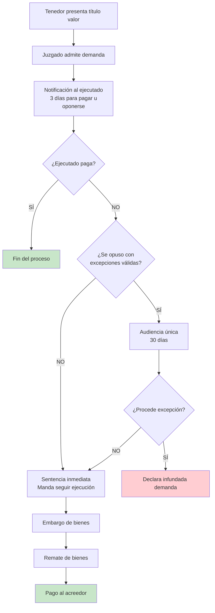

# Principios de los Títulos Valores

## Definición

Fundamentos jurídicos esenciales que regulan la naturaleza, circulación y ejecución de los [[clasificacion-titulos-valores|títulos valores]] según Ley 27287 (Arts. 1-10).

---

## Los 5 Principios Fundamentales (Ley 27287)

### 1. Incorporación (Art. 1.1 LTV)

**El derecho está incorporado al documento**

- Derecho patrimonial + documento = unidad inseparable
- Sin título (físico o registro) → No hay derecho exigible
- Posesión legítima = titularidad del derecho

**Ejemplo:** Letra S/ 10,000 → Necesita presentar documento para cobrar.

### 2. Literalidad (Art. 1.2 LTV)

**Solo vale lo escrito en el título**

- Contenido y alcance determinado por texto del documento
- No se admiten pruebas externas que contradigan lo escrito
- Discrepancia números/letras → **Prevalece cantidad en letras** (Art. 51 LTV)

**Ejemplo:** Dice "S/ 10,000" → Obligado paga exactamente eso, sin importar acuerdos verbales.

### 3. Autonomía (Art. 1.3 LTV)

**Cada obligación es independiente**

- Invalidez de una firma NO afecta las demás
- Cada obligado responde independientemente
- Protege adquirente de buena fe

**Ejemplo:** Endosante A firmó con coacción (inválido) → NO afecta obligación de endosante B ni aceptante C.

### 4. Legitimación (Art. 1.4 LTV)

**Poseedor regular se presume titular**

- Activa: Derecho a cobrar
- Pasiva: Obligación de pagar al poseedor legítimo
- Presunción sin prueba adicional

### 5. Abstracción (Art. 1.5 LTV)

**Título independiente de relación causal**

- Obligación cambiaria autónoma del negocio origen (compraventa, préstamo)
- Deudor NO puede oponer a tercero excepciones del negocio subyacente
- Excepciones personales solo contra quien participó en relación causal

**Ejemplo:** Juan compra mercadería defectuosa a María, paga con letra. María endosa a Carlos. Juan NO puede alegar defecto a Carlos (tercero), SÍ a María (parte del negocio).

---

## Consecuencias del Sistema Cambiario

### Responsabilidad Solidaria (Art. 11 LTV)

**NO es un principio fundamental, sino efecto del sistema:**

- Librador, endosantes y avalistas responden **solidariamente**
- Tenedor puede exigir pago a cualquier obligado (sin orden)
- Quien paga tiene acción de regreso contra anteriores

---

## Jurisprudencia Perú

**Cas. 3641-2014 Lima:** Literalidad → Discrepancia cifras: prevalece cantidad en letras.

**Cas. 2158-2013 Lima:** Autonomía → Falsificación firma no afecta otras obligaciones válidas.

**Cas. 1806-2012 Arequipa:** Abstracción → Aceptante NO opone a tercero excepciones causales.

---

## Conexiones

[[clasificacion-titulos-valores|Clasificación]] • [[endoso-titulos-valores|Endoso]] • [[letra-cambio-concepto|Letra]] • [[pagare|Pagaré]] • [[cheque-concepto|Cheque]]

## Referencias

**Ley 27287** Arts. 1-10 (Principios) • Art. 11 (Solidaridad) • Art. 51 (Literalidad discrepancias)

---

*Corregido: 5 principios según Ley 27287 Perú*

[[01-indice-unidad-1-titulos-valores|← Volver a Unidad I]]

## 🏛️ Instituciones Peruanas Relacionadas

### SUNARP (Superintendencia Nacional de Registros Públicos)

**Rol en títulos valores:**
- Registro de **garantías mobiliarias** (prendas sobre facturas, warrants)
- Registro de **títulos valores con garantía real**
- Inscripción de **protestos** (Registro de Protestos y Moras)

### Cámara de Comercio de Lima

**Servicios:**
- **Protesto de títulos valores** (notarios adscritos)
- **Arbitraje comercial** en conflictos cambiarios
- **Certificación de firmas** en títulos

### Banco Central de Reserva del Perú (BCRP)

**Funciones:**
- Fija la **tasa de interés legal** aplicable a títulos valores sin pacto expreso
- **Tasa de interés legal efectiva (2025):** Aproximadamente 8% anual
- **Tasa de interés moratorio (2025):** Aproximadamente 3% mensual

### Poder Judicial - Juzgados Comerciales

**Competencia:**
- **Proceso Único de Ejecución** para cobro de títulos valores (Art. 688 CPC)
- Trámite rápido: 30-90 días aproximadamente hasta ejecución
- **Competencia territorial:** Domicilio del deudor o lugar de pago

---

## ⚖️ Proceso de Ejecución de Títulos Valores en Perú

### Características del Proceso Único de Ejecución

**Plazos aproximados:**
- **Sin oposición:** 30-60 días hasta embargo
- **Con oposición:** 90-180 días hasta sentencia definitiva

**Excepciones permitidas (Art. 690 CPC):**
1. **Inexigibilidad de la obligación:** Plazo no vencido
2. **Nulidad formal del título:** Falta requisitos esenciales
3. **Extinción de la obligación:** Ya se pagó (con constancia)

---

## 💼 Casos Prácticos Peruanos

### Caso Práctico 1: Solidaridad Cambiaria

**Contexto:**
- "Inversiones Lima SAC" (librador) gira letra por S/ 80,000
- Aceptada por "Distribuidora Norte EIRL" (girado)
- Endosada a "Comercial Sur SAC" (endosante 1)
- Endosada a "Banco de Crédito del Perú" (endosatario final)

**Situación:** Al vencimiento, Distribuidora Norte no paga.

**Acción del BCP:**
Puede accionar contra **cualquiera** de los obligados:

| Obligado | Responsabilidad | Fundamento |
|----------|-----------------|------------|
| Distribuidora Norte | Principal (aceptante) | Art. 108 Ley 27287 |
| Inversiones Lima | Solidaria (librador) | Art. 11 Ley 27287 |
| Comercial Sur | Solidaria (endosante) | Art. 11 Ley 27287 |

**Decisión del BCP:** Demanda primero a Distribuidora Norte (obligado principal). Si no tiene bienes, demanda a Inversiones Lima o Comercial Sur.

**Resultado:** Comercial Sur paga la deuda. Luego, Comercial Sur ejerce **acción de regreso** contra Distribuidora Norte e Inversiones Lima.

### Caso Práctico 2: Literalidad y Buena Fe

**Contexto:**
- Pagaré por S/ 25,000.00
- El girador alteró posteriormente el monto a S/ 250,000.00
- Lo endosó a un tercero de buena fe

**Problema:** ¿Cuánto debe pagar el girador al tenedor de buena fe?

**Solución según Art. 8 Ley 27287:**
- La **alteración** del texto no invalida el título para quienes firmaron después
- Firmantes **anteriores** responden por el texto **original** (S/ 25,000)
- Firmantes **posteriores** responden por el texto **alterado** (S/ 250,000)
- **Tenedor de buena fe** puede exigir S/ 250,000 a quien firmó después de la alteración

**Aplicación del principio:** La literalidad protege al tenedor de buena fe que recibe el título con el texto alterado.

---

## 📚 Conexiones con Otros Conceptos

- [[clasificacion-titulos-valores]] - Tipos de títulos que aplican estos principios
- [[endoso-titulos-valores]] - Mecanismo de circulación basado en legitimación
- [[clausulas-especiales-garantias]] - Garantías que operan por solidaridad
- [[letra-cambio-concepto]] - Título valor que ejemplifica todos los principios

---

## 🔑 Referencias Normativas Clave

- **Art. 1° Ley 27287:** Requisitos formales esenciales
- **Art. 2° Ley 27287:** Principio de incorporación
- **Art. 4° Ley 27287:** Principio de literalidad
- **Art. 5° Ley 27287:** Principio de autonomía
- **Art. 6° Ley 27287:** Principio de legitimación
- **Art. 11° Ley 27287:** Principio de solidaridad
- **Art. 8° Ley 27287:** Alteraciones del texto

---

## ❓ Preguntas de Autoevaluación

1. ¿Qué significa el principio de incorporación y qué consecuencia práctica tiene?
2. Explique con un ejemplo la diferencia entre el principio de autonomía y el principio de abstracción.
3. Si en una letra de cambio el endosante B firmó bajo coacción, ¿puede el tenedor cobrar al aceptante C? ¿Por qué?
4. ¿Puede el aceptante de una letra negarse a pagar al tercer tenedor alegando que la mercadería comprada al librador era defectuosa?
5. ¿Qué ocurre si en un pagaré hay discrepancia entre la cantidad en números y en letras?
6. ¿Contra quiénes puede accionar el tenedor de una letra que no fue pagada al vencimiento?
7. ¿Qué es la tasa de interés legal aplicable en Perú para títulos valores sin pacto expreso de intereses?
8. ¿Cuáles son las excepciones que puede oponer el ejecutado en un Proceso Único de Ejecución?
9. Si un título valor fue alterado en su monto, ¿por cuánto responden los firmantes anteriores y posteriores a la alteración?
10. ¿Qué institución peruana lleva el Registro de Protestos y Moras?

---

## Responsabilidad en Títulos Valores

### Personas Capaces

✅ Solo las personas con **capacidad de ejercicio** pueden obligarse mediante títulos valores

- Incapaces: Sus firmas no generan obligación cambiaria
- Representantes: Deben acreditar facultades suficientes

### Legitimidad de Firmas

- Solo responden quienes firmaron de manera **legítima y libre**
- Firmas falsas o por coacción: **no generan obligación**
- Cada firmante responde en los términos expresados en el título

### Solidaridad Legal

- Todos los firmantes son **solidariamente responsables**
- El tenedor elige a quién demandar (facilita el cobro)
- Quien paga subroga derechos contra obligados anteriores

---

## Importancia de los Principios

| Principio | Beneficio Práctico |
|-----------|-------------------|
| Incorporación | Certeza sobre la titularidad del derecho |
| Literalidad | Seguridad sobre el contenido de la obligación |
| Autonomía | Protección al tercer adquirente de buena fe |
| Legitimación | Facilita la circulación y negociación |
| Abstracción | Agiliza el comercio al separar título de relación causal |
| Solidaridad | Mayor garantía de cobro para el acreedor |

---

## Conexiones

- ← Fundamento de [[clasificacion-titulos-valores|clasificación de títulos valores]]
- → Base para entender [[endoso-titulos-valores|mecanismos de circulación]]
- → Sustenta las [[garantias-titulos-valores|garantías cambiarias]]
- ↔ Aplicación práctica en [[letra-cambio-concepto|letra de cambio]] y [[cheque-concepto|cheque]]

---

## Referencias Normativas

- **Ley N° 27287** - Ley de Títulos Valores (Arts. 1-4)
- Código Civil - Arts. sobre capacidad de ejercicio

---

*Última actualización: 22 de octubre de 2025*

[[01-indice-unidad-1-titulos-valores|← Volver a Unidad I]]
