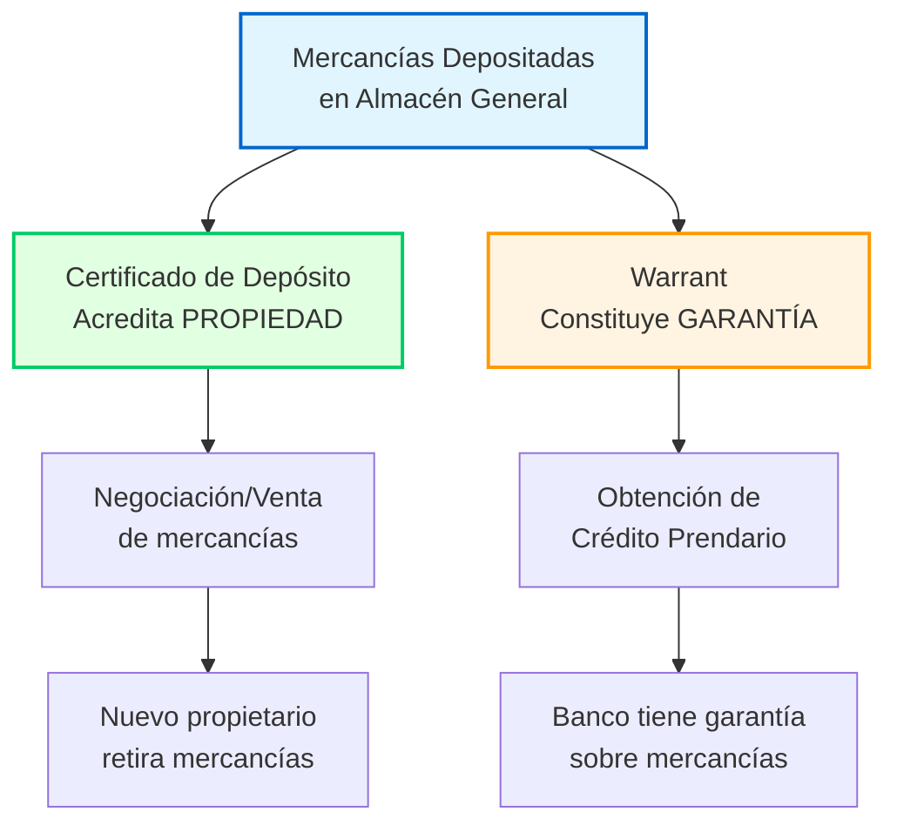
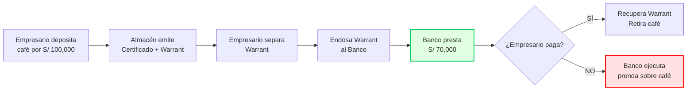
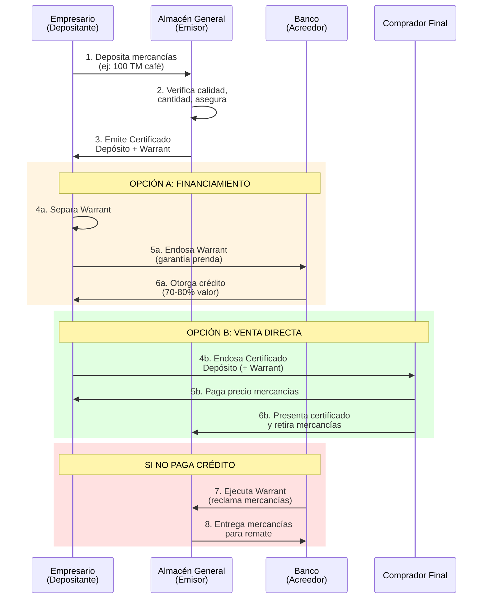

# Certificado de Depósito y Warrant

**Títulos valores emitidos por almacenes generales** que representan mercancías depositadas, permitiendo su **negociación sin desplazamiento físico** y constitución de **garantías reales** sobre bienes almacenados.

**Legislación:** Arts. 239-252 Ley 27287 (Ley de Títulos Valores)

---

## I. Concepto y Naturaleza Jurídica

### Definición

**Certificado de Depósito:**
- Título valor que **acredita propiedad** de mercancías depositadas en almacén general
- Representa derechos del depositante sobre los bienes
- Permite **transferir propiedad** sin mover físicamente la mercancía

**Warrant:**
- Título valor que acompaña al Certificado de Depósito
- Permite **constituir garantía prendaria** sobre mercancías depositadas
- Se desprende del Certificado para crear gravamen

### Doble Función (Art. 239 LTV)

---

## II. Almacenes Generales de Depósito

### A. Emisores Autorizados

**Solo pueden emitir Certificado de Depósito y Warrant:**
- 🏢 **Almacenes Generales de Depósito** autorizados por SBS
- Empresas especializadas reguladas (Ley 26702 - Ley General del Sistema Financiero)

**Requisitos emisor:**
- Autorización SBS para operar
- Infraestructura adecuada (almacenes, seguridad, seguros)
- Capital mínimo regulatorio
- Personal calificado

### B. Funciones de Almacenes Generales

1. **Recepción y custodia** de mercancías
2. **Emisión** de Certificado de Depósito y Warrant
3. **Control de calidad** y conservación
4. **Seguro** de mercancías depositadas
5. **Entrega** a titular legítimo del certificado

### C. Principales Almacenes Generales en Perú

| Empresa | Especialización |
|---------|----------------|
| **Almacenes Generales San Miguel** | Commodities agrícolas, productos terminados |
| **Depositos S.A.** | Minería, productos industriales |
| **Almacem S.A.** | Mercancías en general |

---

## III. Certificado de Depósito (Arts. 239-245)

### A. Requisitos Formales (Art. 240 LTV)

**Contenido obligatorio:**
1. **Denominación:** "Certificado de Depósito"
2. **Nombre del almacén** emisor (RUC, domicilio)
3. **Número de orden** del certificado
4. **Fecha de emisión**
5. **Datos del depositante** (nombre/razón social, RUC, domicilio)
6. **Descripción detallada de mercancías:**
   - Naturaleza/clase de bienes
   - Cantidad, calidad, peso/medida
   - Marcas, números, envases
   - Estado de conservación
7. **Valor declarado** de mercancías
8. **Monto de almacenaje** y otros gastos
9. **Prima de seguro** (si aplica)
10. **Plazo de depósito**
11. **Firma autorizada** del almacén

### B. Funciones y Derechos del Titular

**El tenedor legítimo del Certificado:**
- ✅ Es **propietario** de las mercancías depositadas
- ✅ Puede **vender/transferir** las mercancías (endosando certificado)
- ✅ Puede **retirar mercancías** presentando certificado + warrant
- ✅ Recibe **indemnización** si mercancías se pierden/dañan

### C. Transferencia (Art. 244 LTV)

**Forma de transmisión:**
- Por **endoso** (es título valor a la orden)
- Endoso traslada propiedad de mercancías
- **Debe acompañarse del warrant** si este no fue separado

**Efectos del endoso:**
- Comprador adquiere propiedad de bienes
- **Sin necesidad** de mover físicamente mercancías
- Registro en almacén general actualiza titular

---

## IV. Warrant (Arts. 246-252)

### A. Concepto y Función

**Warrant = Título de Garantía Prendaria**

Permite al propietario de mercancías:
1. **Separar el warrant** del Certificado de Depósito
2. **Endosar solo el warrant** a favor de acreedor (banco)
3. **Obtener crédito** con garantía real sobre mercancías
4. **Mantener propiedad** (conserva Certificado de Depósito)

### B. Requisitos Formales (Art. 246 LTV)

**Contenido obligatorio (además del Certificado):**
1. Denominación: **"Warrant"**
2. Datos del **acreedor prendario** (beneficiario)
3. **Monto del crédito** garantizado
4. **Tasa de interés** (si aplica)
5. **Plazo del crédito**
6. **Firma del endosante** (depositante)

### C. Separación del Certificado de Depósito

**Proceso:**
1. Propietario solicita separación física del warrant
2. Almacén **perfora/corta** el warrant del certificado
3. Propietario endosa warrant a favor de acreedor
4. **Anotación en el certificado** de la separación

**Efectos:**
- Mercancías quedan **gravadas con prenda**
- **No se pueden retirar** mercancías sin cancelar warrant
- Certificado circula pero con gravamen registrado

### D. Derechos del Acreedor Prendario (Tenedor Warrant)

**Si deudor NO paga a vencimiento:**
1. **Acreedor puede ejecutar prenda** (vender mercancías)
2. Procedimiento simplificado (sin juicio largo)
3. Almacén entrega mercancías a acreedor o rematador
4. **Acreedor cobra de producto de venta**
5. Excedente se devuelve a depositante

**Prioridad:**
- Warrant tiene **preferencia** sobre otros acreedores
- Garantía real registrada

---

## V. Ventajas y Aplicaciones

### ✅ Ventajas del Sistema

**Para el Depositante (Propietario):**
1. **Obtiene crédito** sin vender mercancías
2. **Mantiene propiedad** (solo grava con warrant)
3. **Evita almacenamiento propio** (costos, riesgos)
4. **Puede vender mercancías** sin moverlas físicamente (vende certificado)

**Para el Acreedor (Banco/Financiera):**
1. **Garantía real sólida** (mercancías físicas)
2. **Ejecución rápida** si impago
3. **Control del almacén** (emisor regulado SBS)
4. Mercancías **aseguradas** contra pérdida/daño

**Para Compradores:**
1. **Compran mercancías** sin recibirlas (endoso certificado)
2. **Verifican calidad** antes (almacén certifica)
3. **Seguridad jurídica** (almacén regulado)

### 📊 Aplicaciones Prácticas Perú

#### Caso 1: Financiamiento Agrícola
**Situación:**
- Empresa "AgroSur SAC" cosecha **500 TM de café** (valor S/ 3 millones)
- Necesita capital de trabajo para siguiente campaña
- NO quiere vender café aún (espera mejor precio en 3 meses)

**Solución con Warrant:**
1. Deposita café en **Almacenes San Miguel**
2. Recibe Certificado de Depósito + Warrant
3. Separa warrant y lo endosa a **Banco de Crédito**
4. Banco presta **S/ 2 millones** (70% valor café)
5. En 3 meses: vende café a mejor precio, paga banco, recupera warrant

**Resultado:**
- ✅ Obtuvo liquidez sin vender café
- ✅ Esperó mejor precio de mercado
- ✅ Café seguro en almacén profesional

#### Caso 2: Comercio Internacional
**Situación:**
- Importador "Global Trade EIRL" trae **contenedor de electrodomésticos** (valor $100,000)
- Cliente final pagará en 60 días
- Necesita almacenar en zona fiscalizada

**Solución:**
1. Deposita contenedor en almacén general con zona aduanera
2. Obtiene Certificado de Depósito
3. **Vende certificado** a cliente final (sin mover mercancía)
4. Cliente paga y retira con certificado

**Ventaja:**
- Evita doble manipuleo de mercancía
- Cliente verifica estado antes de pagar
- Almacén certifica cantidad/calidad

#### Caso 3: Minería - Concentrados
**Situación:**
- Empresa minera produce **100 TM concentrado de cobre**
- Espera mejores cotizaciones internacionales
- Necesita crédito para operaciones

**Solución:**
1. Deposita concentrado en almacén especializado
2. Separa warrant y lo endosa a banco
3. Obtiene crédito hasta 80% valor mercancía
4. Cuando precio sube: vende concentrado, paga crédito

---

## VI. Diferencias con Otros Títulos Valores

| Característica | Certificado Depósito + Warrant | [[pagare\|Pagaré]] | [[letra-cambio-concepto\|Letra de Cambio]] |
|----------------|-------------------------------|---------|----------------|
| **Representa** | Mercancías físicas | Deuda pura | Orden de pago |
| **Garantía** | Real (mercancías) | Personal | Personal (puede tener aval) |
| **Emisor** | Almacén general SBS | Deudor | Girador |
| **Ejecutabilidad** | Rápida (venta directa) | Vía ejecutiva | Vía ejecutiva |
| **Circulación** | Por endoso | Por endoso | Por endoso |
| **Uso típico** | Financiamiento inventarios | Préstamos simples | Crédito comercial |

---

## VII. Régimen Legal y Supervisión

### A. Marco Normativo

| Norma | Contenido |
|-------|-----------|
| **Ley 27287** (Arts. 239-252) | Requisitos Certificado y Warrant |
| **Ley 26702** (Arts. 288-296) | Almacenes Generales como empresas del sistema financiero |
| **Resoluciones SBS** | Reglamentos operativos, capital mínimo |

### B. Supervisión SBS

**Superintendencia de Banca, Seguros y AFP (SBS):**
- Autoriza funcionamiento almacenes generales
- Supervisa operaciones (auditorías)
- Sanciona incumplimientos
- Verifica capitalización adecuada

**Obligaciones del Almacén:**
- Reportes periódicos a SBS
- Estados financieros auditados
- Seguro contra siniestros
- Personal calificado

---

## VIII. Proceso Completo - Diagrama

---

## IX. Preguntas Frecuentes

**1. ¿Puedo retirar mercancías teniendo solo Certificado de Depósito?**
⚠️ **Depende:**
- Si warrant NO fue separado: SÍ (presentas certificado completo)
- Si warrant FUE separado: ❌ NO (debes cancelar warrant primero)

**2. ¿Qué pasa si el almacén quiebra?**
✅ **Protección:**
- Mercancías NO forman parte activos del almacén (son de depositante)
- Seguro obligatorio cubre pérdidas
- SBS supervisa para minimizar riesgo

**3. ¿Warrant es igual a prenda?**
✅ **Similar pero diferente:**
- Warrant = Título valor que **representa** garantía prendaria
- Prenda = Garantía real en sí misma
- Warrant facilita **circulación** de la garantía (por endoso)

**4. ¿Puedo emitir warrant sobre mis propias mercancías?**
❌ NO. Solo **almacenes generales autorizados SBS** pueden emitir.

**5. ¿Qué mercancías se pueden depositar?**
✅ **Amplio:** Commodities agrícolas, minerales, productos manufacturados, mercancías importadas
❌ **Excepciones:** Bienes perecederos sin refrigeración adecuada, productos ilícitos

**6. ¿Cuánto cobra el almacén?**
📊 **Tarifas típicas en Perú:**
- Derecho de emisión: 0.1-0.3% valor mercancía
- Almacenaje: S/ 0.50-2.00 por TM/día (según producto)
- Seguro: 0.05-0.15% valor anual

---

## X. Ventajas Competitivas vs Otras Garantías

### Comparación: Warrant vs Otras Garantías

| Garantía | Constitución | Ejecución | Costo | Liquidez |
|----------|-------------|-----------|-------|----------|
| **Warrant** | 🟢 Rápida (endoso) | 🟢 Directa (venta mercancía) | 🟡 Media (almacenaje) | 🟢 Alta (circula) |
| Hipoteca | 🔴 Lenta (notaría, SUNARP) | 🔴 Lenta (remate judicial) | 🔴 Alta (notarial) | 🔴 Baja |
| Prenda común | 🟡 Media (contrato) | 🟡 Media | 🟢 Baja | 🔴 Baja |
| Garantía mobiliaria | 🟡 Media (MUEBLES SUNARP) | 🟡 Media | 🟡 Media | 🟡 Media |

**Conclusión:** Warrant es **óptimo para financiamiento de inventarios** de corto plazo.

---

## XI. Conexiones con Otros Conceptos

### Títulos Valores Relacionados
- [[pagare|Pagaré]] - Puede acompañar crédito garantizado con warrant
- [[letra-cambio-concepto|Letra de Cambio]] - Puede usarse para pago de mercancías junto a certificado
- [[factura-conformada|Factura Conformada]] - Documento previo a depósito en almacén

### Garantías
- [[endoso-garantia|Endoso en Garantía]] - Mecanismo de transmisión del warrant
- Prenda común - Warrant es forma especial de prenda sobre bienes depositados

### Instituciones
- **SBS** - Supervisa almacenes generales emisores
- **SUNARP** - Puede registrarse gravamen para mayor publicidad
- **CAVALI** - Desmaterialización de certificados (proyecto piloto)

---

## XII. Tendencias y Modernización

### A. Desmaterialización (Proyecto Piloto)

**Situación actual:**
- Mayoría de certificados/warrants son **físicos** (papel)
- Riesgo de pérdida, falsificación

**Proyecto SBS-CAVALI:**
- Desmaterialización de certificados y warrants
- Registro electrónico en CAVALI
- Transferencias digitales (sin papel)
- **Estado:** En fase piloto (2024-2025)

### B. Blockchain para Trazabilidad

Algunos almacenes implementan:
- Registro blockchain de mercancías
- Certificados tokenizados (NFTs)
- Mayor transparencia cadena custodia

---

## XIII. Resumen Ejecutivo

**Certificado de Depósito + Warrant son títulos valores gemelos** que revolucionan el financiamiento de inventarios:

**Certificado de Depósito:**
- 📦 **Representa propiedad** de mercancías depositadas
- 💰 **Permite venta** sin mover físicamente bienes
- 🔄 **Circula por endoso**

**Warrant:**
- 🔒 **Constituye garantía prendaria** sobre mercancías
- 💵 **Obtiene crédito** manteniendo propiedad
- ⚡ **Ejecución rápida** si impago

**Ideal para:**
- ✅ Financiamiento capital de trabajo (agronegocios, minería)
- ✅ Esperar mejores precios de mercado sin vender
- ✅ Comercio internacional (almacenaje temporal)

**Emisores:**
- 🏢 Solo almacenes generales autorizados SBS
- Principales: San Miguel, Depositos S.A., Almacem

**Ventaja clave:**
- 🎯 **Garantía real + liquidez** (mejor que prenda común o hipoteca)

---

**Última actualización:** Enero 2025  
**Legislación:** Ley 27287 Arts. 239-252, Ley 26702 Arts. 288-296  
**Supervisión:** SBS (Superintendencia de Banca, Seguros y AFP)  
**Contexto:** Perú

[[02-indice-unidad-2-titulos-especificos|← Volver a Índice Unidad II]]
