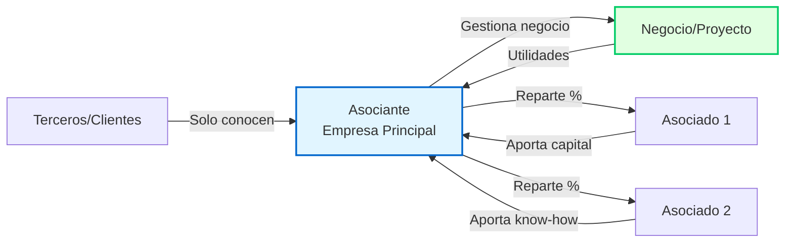

# Otras Formas Societarias

Además de [[sociedad-anonima-concepto|SA]] y [[sociedad-responsabilidad-limitada|SRL]], la LGS regula otras formas menos comunes en Perú.

---

## I. Sociedad Colectiva (Arts. 265-277)

**Concepto:** Sociedad de personas con **responsabilidad ilimitada y solidaria** de todos los socios.

### Características

**Responsabilidad:**
- Socios responden **personal, ilimitada y solidariamente** por deudas sociales
- Acreedor puede ejecutar patrimonio personal de cualquier socio

**Administración:**
- Todos los socios administran (salvo pacto)
- Representación conjunta o separada según estatuto

**Capital:**
- Aportes de socios
- NO representado por acciones ni títulos valores

**Denominación:**
- Nombre de uno o más socios + "Sociedad Colectiva" o "S.C."

### Ventajas
- Simplicidad en gestión
- Confianza entre socios

### Desventajas
- ❌ Responsabilidad ilimitada (alto riesgo personal)
- ❌ Poca atractiva para inversionistas
- ❌ Poco usada en Perú (< 1% de sociedades)

---

## II. Sociedad en Comandita (Arts. 278-282)

**Concepto:** Sociedad **mixta** con dos tipos de socios: colectivos y comanditarios.

### Tipos de Socios

#### Socios Colectivos
- Responden **ilimitada y solidariamente**
- Administran la sociedad
- Pueden ser personas naturales o jurídicas

#### Socios Comanditarios
- Responden **solo hasta monto aportado** (limitada)
- **NO administran** (pasivos)
- Si administran → pierden beneficio de responsabilidad limitada

### Modalidades

#### Sociedad en Comandita Simple (SCS)
- Capital NO representado por acciones
- Similar a colectiva pero con socios comanditarios

#### Sociedad en Comandita por Acciones (SCA)
- Capital representado por **acciones** suscritas por comanditarios
- Socios colectivos NO tienen acciones
- Aplican normas de SA (supletoriamente)

### Denominación
- "Sociedad en Comandita" o "S. en C."
- "Sociedad en Comandita por Acciones" o "S. en C. por A."

### Uso
- Poco común en Perú
- Útil cuando se quiere combinar socios activos (gestores) con socios pasivos (inversionistas)

---

## III. Sociedad Civil (Arts. 295-309)

**Concepto:** Sociedad de **profesionales** para ejercicio común de actividad profesional, técnica o artística.

### Características

**Objeto:**
- **NO comercial**
- Ejercicio de profesión, ciencia, arte
- Ejemplos: Estudio de abogados, consultora de ingenieros, clínica médica

**Responsabilidad:**
- **Ordinaria:** Responsabilidad ilimitada de socios
- **De responsabilidad limitada:** Socios responden solo hasta aportes

**Administración:**
- Por socios o terceros designados
- Normas más flexibles que SA

**Capital:**
- Aportes de socios
- Pueden ser servicios (a diferencia de sociedades comerciales donde servicios NO cuentan para capital)

**Denominación:**
- Nombre de uno o más socios + "Sociedad Civil" o "S.Civil"
- O "Sociedad Civil de Responsabilidad Limitada" / "S.Civil de R.L."

### Ventajas
- Adecuada para profesionales
- Permite aportes de servicios

### Desventajas
- Responsabilidad ilimitada (en ordinaria)
- Menor protección patrimonial

### Uso en Perú
- Estudios jurídicos
- Consultoras profesionales
- Clínicas/centros médicos pequeños

---

## Tabla Comparativa: Todas las Formas Societarias

| Tipo | Responsabilidad | Capital | Administración | Uso Común |
|------|----------------|---------|----------------|-----------|
| **[[sociedad-anonima-concepto\|SA]]** | Limitada | Acciones | Junta-Directorio-Gerencia | Empresas medianas/grandes |
| **[[sociedad-responsabilidad-limitada\|SRL]]** | Limitada | Participaciones | Junta-Gerencia | PYMEs, familiares |
| **Colectiva** | Ilimitada | Aportes | Todos socios | Muy rara |
| **Comandita Simple** | Mixta | Aportes | Socios colectivos | Muy rara |
| **Comandita x Acciones** | Mixta | Acciones | Socios colectivos | Muy rara |
| **Civil Ordinaria** | Ilimitada | Aportes + servicios | Socios | Profesionales |
| **Civil R.L.** | Limitada | Aportes + servicios | Socios | Profesionales |

---

## Estadísticas Perú 2025 (SUNARP)

**Distribución de sociedades:**
- SA/SAC: ~85%
- SRL: ~13%
- Sociedades Civiles: ~1.5%
- Colectivas/Comanditas: ~0.5%

**Tendencia:** Predominio absoluto de SA y SRL por beneficio de responsabilidad limitada

---

## Elección de Forma Societaria

### Factores a Considerar

1. **Responsabilidad:**
   - ¿Quiero proteger patrimonio personal? → SA o SRL
   - ¿Acepto responsabilidad ilimitada? → Colectiva o Civil

2. **Número de socios:**
   - ≤ 20 socios → SRL o SAC
   - > 20 socios → SA

3. **Tipo de actividad:**
   - Comercial → SA o SRL
   - Profesional → Sociedad Civil
   - Mixta → Comandita (rara)

4. **Necesidad de financiamiento:**
   - Captar inversión pública → SA/SAA
   - Cerrada/familiar → SRL o SAC

5. **Complejidad administrativa:**
   - Menor → SRL, Civil
   - Mayor → SA (con directorio)

---

## Sociedades Especiales (Legislación Sectorial)

### Empresas del Sistema Financiero
- Bancos, financieras, cajas
- Regulación especial: Ley General del Sistema Financiero
- Siempre SA o SAA

### Empresas de Seguros
- Regulación: Ley General de Seguros
- Solo SA

### Sociedades Mineras
- Pueden adoptar cualquier forma
- Régimen tributario especial

### Sociedades Agrarias
- Beneficios tributarios (Ley de Promoción Agraria)
- Cualquier forma societaria

---

## VI. Contratos Asociativos (Arts. 438-448 LGS)

**NO son sociedades** pero permiten **colaboración empresarial** sin crear nueva persona jurídica.

### Características Generales

**Diferencias con Sociedades:**
- ❌ NO generan persona jurídica nueva
- ❌ NO tienen patrimonio autónomo
- ❌ NO requieren inscripción en SUNARP (salvo publicidad)
- ✅ **Flexibilidad contractual** (menos formalidades)
- ✅ Cada parte mantiene autonomía jurídica

**Ventajas:**
- Colaboración temporal sin fusión
- Menores costos constitución/disolución
- Régimen tributario más flexible

---

### A. Asociación en Participación (Art. 440)

**Concepto:**
- Un **asociante** (empresa principal) asocia a uno o más **asociados** en su negocio
- Asociados **aportan bienes/servicios** a cambio de **participación en utilidades**
- **NO visible externamente** (asociados no aparecen ante terceros)

**Estructura:**

**Características clave:**
- **Asociante:** Actúa en nombre propio ante terceros, gestiona negocio
- **Asociados:** Ocultos, solo relación interna con asociante
- **Responsabilidad:** Solo asociante responde ante terceros
- **Utilidades:** Se reparten según pacto (asociados NO responden por pérdidas salvo pacto)

**Ejemplo Perú:**
- Empresa constructora "BuildPeru SAC" (asociante) se asocia con inversionista privado (asociado)
- Inversionista aporta S/ 500,000 para proyecto inmobiliario
- BuildPeru ejecuta obra en su nombre
- Al vender, reparte 40% utilidad al inversionista
- Clientes solo conocen a BuildPeru

**Ventaja:** Inversionista NO asume riesgo público, solo participa en ganancias

---

### B. Consorcio (Arts. 445-448)

**Concepto:**
- Dos o más empresas **independientes** se unen para ejecutar **proyecto específico**
- Cada parte mantiene autonomía y responde **individualmente**
- **Visible externamente** (se presenta como "Consorcio X")

**Características:**
- **Sin personería jurídica** (cada miembro actúa en nombre propio o del consorcio)
- **Responsabilidad solidaria o mancomunada** según pacto
- **Duración determinada** (hasta fin del proyecto)
- **Gerencia común** o representante designado

**Tipos de Consorcio:**

| Tipo | Responsabilidad | Facturación | Uso Típico |
|------|----------------|-------------|------------|
| **Consorcio con contabilidad independiente** | Mancomunada (cada uno su parte) | Cada parte factura por separado | Proyectos con tareas divisibles |
| **Consorcio sin contabilidad independiente** | Solidaria (todos responden por todo) | Operador factura en nombre consorcio | Proyectos integrados |

**Ejemplo Perú - Consorcio Obras Públicas:**
- "Constructora Lima SA" + "Ingenieros Asociados SAC" + "Vial Sur EIRL"
- Forman **"Consorcio Autopista Norte"**
- Licitación estatal para construir carretera (S/ 50 millones)
- Pacto: Responsabilidad solidaria, 40%-35%-25%
- Emiten **carta fianza conjunta** como consorcio
- Cada uno ejecuta tramo asignado pero responden solidariamente

**Ventaja:** Sumar capacidades técnicas/financieras sin fusionarse

---

### C. Joint Venture (Aplicación Práctica)

**Concepto:**
- Similar a consorcio pero **más integrado**
- Empresas aportan **recursos, tecnología, know-how** para **negocio común**
- Puede ser **contractual** (sin sociedad) o **corporativo** (crean nueva sociedad)

**Joint Venture Contractual (Contrato Asociativo):**
- NO crea sociedad nueva
- Regulado por contrato privado
- Gestión conjunta del proyecto

**Joint Venture Corporativo (NO es contrato asociativo):**
- SÍ crea nueva sociedad (SA o SRL)
- Cada parte es accionista/socio
- Ya NO es contrato asociativo (es sociedad formal)

**Ejemplo Perú - Minería:**
- Empresa peruana "MineraPeru SAC" + empresa canadiense "GoldCorp Inc."
- Joint Venture para explotar yacimiento aurífero
- MineraPeru aporta: Concesión minera, personal local
- GoldCorp aporta: Tecnología, financiamiento (USD 20 millones)
- Pacto: Utilidades 50%-50%
- Duración: 15 años (vida útil mina)
- **NO crean nueva sociedad** (contrato asociativo)

**Ventaja:** Acceso a tecnología/capital extranjero sin vender empresa

---

### Comparativa Contratos Asociativos

| Criterio | Asociación en Participación | Consorcio | Joint Venture |
|----------|----------------------------|-----------|---------------|
| **Visibilidad** | 🔒 Oculta (solo asociante) | 🔓 Pública | 🔓 Pública |
| **Responsabilidad** | Solo asociante | Solidaria o mancomunada | Según pacto |
| **Gestión** | Solo asociante | Conjunta o delegada | Conjunta |
| **Patrimonio** | Del asociante | Sin patrimonio común | Puede haber fondo común |
| **Duración** | Indeterminada | Determinada (proyecto) | Determinada/indeterminada |
| **Uso típico** | Inversión pasiva | Obras públicas, grandes proyectos | Exploración, tecnología |

---

### Aspectos Tributarios (SUNAT)

**Asociación en Participación:**
- Asociante declara ingresos totales
- Reparte utilidades a asociados (retención 5% si persona natural)

**Consorcio:**
- Opción 1: Cada parte declara su porcentaje
- Opción 2: Operador declara total y distribuye

**Inscripción:**
- Consorcios deben **inscribirse en SUNAT** (RUC consorcio)
- Asociaciones en participación: NO requieren RUC propio

---

## Conexiones

[[concepto-sociedad|Concepto]] • [[sociedad-anonima-concepto|SA]] • [[sociedad-responsabilidad-limitada|SRL]] • [[disolucion-liquidacion|Disolución]] • [[transformacion-fusion-escision|Reorganización]]

## Referencias

**Ley 26887 (LGS):**
- Arts. 265-277 (Sociedad Colectiva)
- Arts. 278-289 (Sociedad en Comandita)
- Arts. 295-303 (Sociedad Civil)
- **Arts. 438-448 (Contratos Asociativos)**

---

*Condensado según LGS Perú - Actualizado con Contratos Asociativos*

[[03-indice-unidad-3-sociedades|← Volver a Índice Unidad III]]
