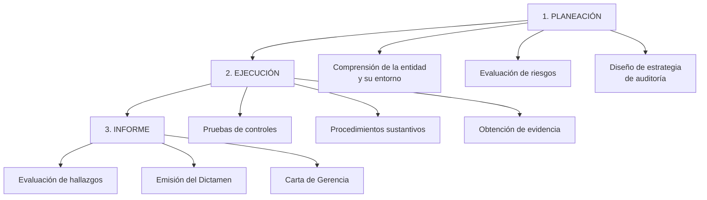

# Auditoría Externa - Regulación y Obligatoriedad según LGS

## 🎯 Concepto

La **Auditoría Externa** (también llamada "Auditoría Financiera") es el examen independiente y profesional de los estados financieros de una sociedad, realizado por un **Contador Público Colegiado independiente** (o sociedad de auditoría), con el objetivo de emitir una opinión sobre si dichos estados financieros presentan razonablemente, en todos sus aspectos significativos, la situación financiera y los resultados de operaciones de conformidad con las Normas Internacionales de Información Financiera (NIIF).

**Características:**
- **Independencia:** El auditor NO debe tener interés en la sociedad auditada
- **Profesionalidad:** Debe ser Contador Público Colegiado (CPC) habilitado
- **Normatividad:** Aplica Normas Internacionales de Auditoría (NIA)
- **Producto final:** **Dictamen de Auditoría** u **Opinión de Auditoría**

## 📋 Marco Regulatorio en la LGS

### Art. 226 LGS - Auditoría Externa

> **Artículo 226.- Auditoría externa**
> "**Las sociedades anónimas abiertas y las demás que la ley determine están obligadas a someter sus estados financieros anuales a la auditoría de sociedades de auditoría o de contadores públicos independientes.**
> 
> Para las sociedades no obligadas, las sociedades de auditoría o los contadores públicos colegiados que las auditan, **pueden ser designados por el directorio, salvo disposición contraria del estatuto.**"

**Análisis del artículo:**

| Elemento | Explicación |
|----------|-------------|
| **Obligatoriedad para SAA** | Las **Sociedades Anónimas Abiertas** (SAA) SIEMPRE deben auditar sus EE.FF. |
| **"Demás que la ley determine"** | Otras leyes especiales pueden establecer obligatoriedad (ej: Ley de Bancos, Ley de Seguros, Ley del Mercado de Valores) |
| **Para sociedades no obligadas** | SA y SAC **pueden** auditar voluntariamente |
| **Designación** | En SAA: lo designa la Junta General. En SA/SAC (voluntaria): lo designa el Directorio salvo que estatuto diga otra cosa |

### ¿Qué es una Sociedad Anónima Abierta (SAA)?

**Definición según Art. 249 LGS:**

Una sociedad es **anónima abierta** cuando cumple UNO o más de los siguientes requisitos:

1. **Ha hecho oferta pública primaria de acciones** u obligaciones convertibles en acciones
2. **Tiene más de 750 accionistas**
3. **Más del 35% de su capital** pertenece a 175 o más accionistas (sin considerar accionistas con participaciones < 2% individualmente)
4. **Se constituye como tal** por voluntad en el pacto social o estatuto
5. **Todos los accionistas con derecho a voto** aprueban por unanimidad adaptarse a este régimen

**Implicación:** Si una sociedad es SAA → **OBLIGATORIA** la auditoría externa.

### Otras Sociedades con Auditoría Obligatoria

| Tipo de Sociedad | Base Legal | Observación |
|------------------|------------|-------------|
| **SAA** | Art. 226 LGS | SIEMPRE obligatoria |
| **Empresas del Sistema Financiero** | Ley N° 26702 (Ley de Bancos) | Bancos, financieras, cajas municipales, etc. |
| **Compañías de Seguros** | Ley N° 26702 | Todas las aseguradoras |
| **AFP** | Ley del Sistema Privado de Pensiones | Administradoras de fondos de pensiones |
| **Empresas que cotizan en Bolsa** | Ley del Mercado de Valores | Emisores inscritos en el Registro Público del Mercado de Valores |
| **Sociedades con ingresos > 3,000 UIT** | Res. CONASEV (ahora SMV) | Aproximadamente S/ 15 millones de ingresos anuales |
| **Cooperativas grandes** | Ley de Cooperativas | Según activos y número de socios |

## 🔍 El Proceso de Auditoría Externa

### Etapas de la Auditoría



### 1. Planeación de la Auditoría

**Actividades:**
- Comprensión del negocio, industria, marco legal
- Evaluación del sistema de control interno
- Identificación de riesgos de error material
- Determinación de materialidad
- Diseño de programas de auditoría

**Documentos clave:**
- Carta compromiso de auditoría
- Estrategia global de auditoría
- Plan de auditoría detallado

### 2. Ejecución de la Auditoría

**Procedimientos de auditoría:**

| Procedimiento | Descripción | Ejemplo |
|---------------|-------------|---------|
| **Inspección** | Examinar documentos y registros | Revisar facturas de ventas, contratos |
| **Observación** | Ver un proceso o procedimiento ejecutado | Observar toma física de inventarios |
| **Confirmación** | Obtener respuesta de terceros | Confirmación de saldos bancarios, cuentas por cobrar |
| **Recálculo** | Verificar exactitud aritmética | Recalcular depreciación, provisiones |
| **Re-ejecución** | Ejecutar nuevamente controles | Re-ejecutar conciliación bancaria |
| **Procedimientos analíticos** | Analizar relaciones y tendencias | Análisis de ratios financieros |
| **Indagación** | Obtener información de personas conocedoras | Entrevistas con gerencia, personal contable |

### 3. Emisión del Dictamen

**Elementos del dictamen según NIA 700:**
1. Título ("Dictamen del Auditor Independiente")
2. Destinatario (accionistas de la sociedad)
3. Opinión
4. Base de la opinión
5. Responsabilidad de la gerencia por los EE.FF.
6. Responsabilidad del auditor
7. Firma del auditor
8. Fecha del dictamen
9. Dirección del auditor

## 📄 Tipos de Opinión de Auditoría

### 1. Opinión Sin Salvedades (Limpia)

**Concepto:** Los estados financieros presentan razonablemente, en todos sus aspectos materiales, la situación financiera de conformidad con NIIF.

**Redacción típica:**

> **OPINIÓN**
> "En nuestra opinión, los estados financieros adjuntos presentan razonablemente, en todos sus aspectos materiales, la situación financiera de ABC S.A. al 31 de diciembre de 2023, así como sus resultados de operaciones y sus flujos de efectivo por el año terminado en esa fecha, de conformidad con Normas Internacionales de Información Financiera."

**Significado:** Es la mejor opinión. Los EE.FF. son confiables.

### 2. Opinión con Salvedades (Calificada)

**Concepto:** Los estados financieros presentan razonablemente la situación financiera **EXCEPTO** por ciertos aspectos específicos.

**Causas:**
- Limitación en el alcance de la auditoría
- Desacuerdo con la gerencia sobre tratamiento contable (pero no es generalizado)

**Redacción típica:**

> **OPINIÓN CALIFICADA**
> "En nuestra opinión, **excepto por** los efectos del asunto descrito en el párrafo de Base para la Opinión Calificada, los estados financieros adjuntos presentan razonablemente, en todos sus aspectos materiales, la situación financiera de ABC S.A. al 31 de diciembre de 2023..."

**Ejemplo:**
> "La sociedad no pudo proporcionarnos evidencia de las confirmaciones de cuentas por cobrar a clientes del exterior por un monto de S/ 2,500,000 (10% del total de activos). No pudimos aplicar procedimientos alternativos satisfactorios para verificar la existencia de estos saldos."

### 3. Opinión Adversa (Negativa)

**Concepto:** Los estados financieros **NO** presentan razonablemente la situación financiera debido a incorrecciones materiales y generalizadas.

**Causa:** Desacuerdo serio y generalizado con la gerencia sobre tratamiento contable.

**Redacción típica:**

> **OPINIÓN ADVERSA**
> "En nuestra opinión, debido a la significatividad de los asuntos descritos en el párrafo de Base para la Opinión Adversa, los estados financieros adjuntos **NO** presentan razonablemente la situación financiera de ABC S.A. al 31 de diciembre de 2023..."

**Ejemplo:**
> "La sociedad no ha registrado provisión por deterioro de inventarios obsoletos por S/ 15,000,000 (representando el 60% del total de inventarios y 30% del total de activos), lo cual es requerido por la NIC 2. Los activos y el patrimonio están significativamente sobrevaluados."

### 4. Abstención de Opinión (Disclaimer)

**Concepto:** El auditor **NO emite opinión** porque no pudo obtener evidencia suficiente y apropiada.

**Causa:** Limitación severa en el alcance de la auditoría.

**Redacción típica:**

> **ABSTENCIÓN DE OPINIÓN**
> "Debido a la significatividad de los asuntos descritos en el párrafo de Base para la Abstención de Opinión, no hemos podido obtener evidencia de auditoría suficiente y apropiada que proporcione una base para una opinión de auditoría. En consecuencia, **no expresamos una opinión** sobre los estados financieros adjuntos."

**Ejemplo:**
> "Fuimos contratados como auditores después del cierre del ejercicio y no pudimos observar el conteo físico de inventarios al 31 de diciembre de 2023 (que representa el 45% del total de activos). Tampoco pudimos verificar mediante procedimientos alternativos la existencia y valuación de estos inventarios."

### Resumen Comparativo

| Tipo de Opinión | Situación | Impacto en Confiabilidad |
|-----------------|-----------|--------------------------|
| **Sin Salvedades** | Todo correcto | ✅ Alta confiabilidad |
| **Con Salvedades** | Problema específico | ⚠️ Confiabilidad con reservas |
| **Adversa** | Problemas generalizados | ❌ No confiable |
| **Abstención** | No se pudo auditar | ❓ Sin opinión |

## 🎯 Caso Práctico Completo

### Caso: "Comercial Peruana S.A.A." - Auditoría 2023

**Contexto:**
- Sociedad Anónima Abierta (SAA) → Auditoría OBLIGATORIA
- Cotiza en la Bolsa de Valores de Lima
- Cierre del ejercicio: 31/12/2023
- Total activos: S/ 50,000,000
- Utilidad neta: S/ 3,500,000

**Proceso de Auditoría:**

**1. Designación del Auditor (Junta General - marzo 2024)**

La Junta General Ordinaria de Accionistas del 25 de marzo de 2024 acordó:

> "TERCERO: Designar como auditores externos de la sociedad para el ejercicio 2024 a la sociedad de auditoría **Ernst & Young Perú S.R.L.**, inscrita en el Registro de Sociedades de Auditoría de la Superintendencia del Mercado de Valores con Matrícula N° XXX. Los honorarios profesionales ascenderán a S/ 120,000 más IGV."

**2. Carta Compromiso (abril 2024)**

El auditor emite una carta compromiso que incluye:
- Alcance de la auditoría (EE.FF. al 31/12/2023)
- Normas aplicables (NIA)
- Responsabilidad de la gerencia y del auditor
- Honorarios y forma de pago

**3. Planeación (abril - mayo 2024)**

- Comprensión del negocio (comercio al por mayor de productos de consumo masivo)
- Evaluación de control interno → Se identifican debilidades en el área de inventarios
- Determinación de materialidad: S/ 500,000 (1% de activos)
- Identificación de áreas de riesgo:
  - **Riesgo Alto:** Valuación de inventarios (rotación lenta)
  - **Riesgo Medio:** Recuperabilidad de cuentas por cobrar
  - **Riesgo Bajo:** Activos fijos (bien documentados)

**4. Ejecución (mayo - junio 2024)**

**Procedimientos principales:**

| Cuenta | Saldo | Procedimientos de Auditoría |
|--------|-------|------------------------------|
| **Efectivo** | S/ 2,000,000 | - Confirmación bancaria directa<br/>- Arqueo de caja chica<br/>- Conciliaciones bancarias |
| **Cuentas por Cobrar** | S/ 8,500,000 | - Confirmación de saldos con clientes (muestra 70%)<br/>- Análisis de antigüedad<br/>- Prueba de cobranza posterior |
| **Inventarios** | S/ 15,000,000 | - **Observación de inventario físico al 31/12/2023**<br/>- Pruebas de costeo<br/>- Análisis de obsolescencia |
| **Activos Fijos** | S/ 18,000,000 | - Inspección física (muestra)<br/>- Recálculo de depreciación<br/>- Revisión de títulos de propiedad |
| **Cuentas por Pagar** | S/ 12,000,000 | - Confirmación con proveedores<br/>- Búsqueda de pasivos no registrados<br/>- Corte documentario |

**5. Hallazgos de Auditoría**

Durante la ejecución, el auditor identifica:

**Hallazgo 1: Inventarios Obsoletos No Provisionados**
- Se identificaron productos con más de 2 años de antigüedad por S/ 1,200,000
- La gerencia NO ha registrado provisión por obsolescencia
- Según NIC 2, se requiere provisión
- **Impacto:** Sobrevaloración de inventarios y utilidad

**Hallazgo 2: Cuentas por Cobrar Incobrables**
- Cliente "XYZ S.A." tiene saldo de S/ 800,000 con antigüedad > 180 días
- Cliente en proceso concursal
- Provisión registrada: S/ 200,000
- Provisión requerida: S/ 600,000
- **Impacto:** Sobrevaloración de cuentas por cobrar

**Hallazgo 3: Contingencia Tributaria No Revelada**
- Fiscalización de SUNAT pendiente por S/ 450,000
- NO se ha revelado en Notas a los EE.FF.
- **Impacto:** Falta de revelación de contingencia

**6. Discusión con la Gerencia**

El auditor presenta los hallazgos a la gerencia:

- **Hallazgo 1:** La gerencia **ACEPTA** y registra provisión por S/ 1,200,000
- **Hallazgo 2:** La gerencia **ACEPTA PARCIALMENTE** y registra provisión adicional por S/ 300,000 (total S/ 500,000)
- **Hallazgo 3:** La gerencia **ACEPTA** y agrega Nota 18 revelando la contingencia

**Ajustes de Auditoría:**

```
Asiento de Ajuste 1 - Provisión de Inventarios:
68 VALUACIÓN Y DETERIORO DE ACTIVOS           1,200,000
   685 Deterioro del valor de los activos
      29 DESVALORIZACIÓN DE EXISTENCIAS              1,200,000
         291 Mercaderías

Asiento de Ajuste 2 - Provisión Cuentas por Cobrar:
68 VALUACIÓN Y DETERIORO DE ACTIVOS             300,000
   684 Valuación de activos
      19 ESTIMACIÓN DE CUENTAS DE COBRANZA DUDOSA    300,000
         191 Cuentas por cobrar comerciales - Terceros

Impacto Total en Utilidad Neta:
(1,200,000 + 300,000) = -S/ 1,500,000
```

**Estados Financieros Ajustados:**
```
Utilidad Neta Original:          S/ 3,500,000
(-) Ajustes de auditoría:        S/ (1,500,000)
Utilidad Neta Ajustada:          S/ 2,000,000
```

**7. Emisión del Dictamen (julio 2024)**

**Tipo de opinión emitida: OPINIÓN CON SALVEDADES**

**Razón:** El auditor no está de acuerdo con la provisión de cuentas por cobrar (la gerencia solo provisionó S/ 500,000 cuando según el auditor debería ser S/ 600,000).

**Extracto del Dictamen:**

---

### DICTAMEN DE LOS AUDITORES INDEPENDIENTES

**A los señores Accionistas de Comercial Peruana S.A.A.:**

**OPINIÓN CALIFICADA**

Hemos auditado los estados financieros adjuntos de Comercial Peruana S.A.A. (en adelante, "la Compañía"), que comprenden el estado de situación financiera al 31 de diciembre de 2023, el estado de resultados, el estado de cambios en el patrimonio neto y el estado de flujos de efectivo por el año terminado en esa fecha, así como las notas explicativas de los estados financieros que incluyen políticas contables significativas.

En nuestra opinión, **excepto por** los efectos del asunto descrito en el párrafo de Base para la Opinión Calificada, los estados financieros adjuntos presentan razonablemente, en todos sus aspectos materiales, la situación financiera de Comercial Peruana S.A.A. al 31 de diciembre de 2023, así como su desempeño financiero y sus flujos de efectivo por el año terminado en esa fecha, de conformidad con Normas Internacionales de Información Financiera.

**BASE PARA LA OPINIÓN CALIFICADA**

Como se menciona en la Nota 7 a los estados financieros, la Compañía mantiene una cuenta por cobrar al cliente XYZ S.A. por S/ 800,000, sobre la cual ha registrado una provisión de S/ 500,000. Este cliente se encuentra en proceso concursal y, en nuestra opinión profesional, la provisión debería ser de al menos S/ 600,000. Si la Compañía hubiera registrado la provisión que consideramos adecuada, la utilidad neta del ejercicio se habría reducido en S/ 100,000 adicionales.

Hemos llevado a cabo nuestra auditoría de conformidad con las Normas Internacionales de Auditoría aprobadas para su aplicación en el Perú. Nuestra responsabilidad bajo dichas normas se describe más adelante en la sección "Responsabilidad del Auditor" de nuestro informe. Somos independientes de la Compañía de conformidad con el Código de Ética para Profesionales de la Contabilidad del Consejo de Normas Internacionales de Ética para Contadores (Código de Ética del IESBA) y hemos cumplido con las demás responsabilidades éticas conforme a dicho código.

[... continúa el dictamen con las secciones de Responsabilidad de la Gerencia, Responsabilidad del Auditor, etc.]

**Ernst & Young Perú S.R.L.**

[Firma del Socio]
C.P.C. Juan Carlos Martínez
Matrícula N° 12345

Lima, Perú
15 de julio de 2024

---

**8. Otros Informes del Auditor**

Además del dictamen, el auditor emite:

**a) Carta de Control Interno (Management Letter):**
- Debilidades de control interno identificadas
- Recomendaciones de mejora
- **NO es pública**, es para uso de la gerencia y Directorio

**b) Informe sobre Cumplimiento Tributario (si se solicita):**
- Revisión de declaraciones juradas de impuestos
- Libro electrónico PLE
- Registro de operaciones

## 💼 Responsabilidades y Limitaciones

### Responsabilidad de la Gerencia

**Según NIA 200 y Art. 222 LGS:**
- Preparar los EE.FF. de conformidad con NIIF
- Diseñar, implementar y mantener control interno adecuado
- Proporcionar al auditor toda la información necesaria

### Responsabilidad del Auditor

- Obtener seguridad razonable (NO absoluta) de que los EE.FF. están libres de error material
- Emitir un dictamen con opinión
- Informar sobre hallazgos significativos

**IMPORTANTE:** El auditor **NO**:
- Prepara los estados financieros (eso es de la gerencia)
- Garantiza que NO hay fraude
- Revisa el 100% de las operaciones (trabaja con muestras)

## 📚 Conexiones

### Dentro del Curso
- [[estados-financieros-lgs]] - El auditor examina los EE.FF.
- [[memoria-anual]] - El auditor lee la Memoria y verifica consistencia
- [[sociedad-anonima-concepto]] - Auditoría obligatoria para SAA
- [[04-indice-unidad-4-informacion-financiera]] - Índice de esta unidad

### Con Otras Materias
- **Auditoría (curso específico):** Técnicas y procedimientos de auditoría
- **Contabilidad:** Preparación de EE.FF. según NIIF
- **Ética Profesional:** Independencia del auditor

## 🔑 Referencias Normativas

- **Ley N° 26887 - LGS:**
  - **Art. 226:** Auditoría externa
  - Art. 249: Definición de SAA

- **Normas Internacionales de Auditoría (NIA):**
  - **NIA 200:** Objetivos Globales del Auditor Independiente
  - **NIA 700:** Formación de la Opinión y Emisión del Informe de Auditoría
  - **NIA 705:** Opinión Modificada en el Informe del Auditor Independiente

- **Ley del Contador Público - Decreto Ley 13253**

- **Regulación SMV:**
  - Reglamento de Sociedades de Auditoría

## ❓ Preguntas de Autoevaluación

1. ¿Qué tipos de sociedades están obligadas a auditar sus estados financieros?
2. ¿Cuáles son los 4 tipos de opinión que puede emitir un auditor?
3. ¿Cuál es la diferencia entre una opinión con salvedades y una opinión adversa?
4. ¿Quién designa al auditor en una SAA?
5. ¿El auditor garantiza que NO hay fraude en los estados financieros?
6. ¿Qué es una "Carta de Control Interno" o "Management Letter"?
7. ¿En qué plazo debe emitirse el dictamen de auditoría en relación con la Junta Anual?

---

**Elaborado por el Comité de Expertos:** Pedagogos, Documentadores, Psicólogos del Conocimiento, Expertos en Obsidian, Abogados y Contadores especializados en marco normativo peruano.
