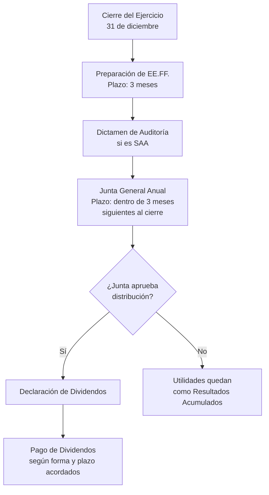
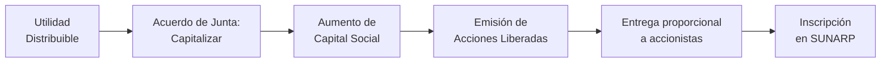

# Dividendos

## 🎯 Concepto

Parte de utilidades netas que la sociedad distribuye a accionistas como retribución por su inversión (Arts. 39-40, 230-231 LGS).

**Base:** Utilidad neta - Reserva legal (10%) - Otras reservas = **Utilidad distribuible**

**PCGE:** 59 Resultados acumulados → 591 Utilidades no distribuidas

**IR Perú:** 5% retención sobre dividendos pagados a personas naturales. 0% a personas jurídicas domiciliadas (ya tributaron 29.5%).

**Conexiones:** [[reserva-legal|Detracción 10%]] • [[estados-financieros-lgs|Base EE.FF.]] • [[junta-general-accionistas|Aprobación]] • [[sociedad-anonima-concepto|Derecho accionista]]

## 📋 Marco Regulatorio en la LGS

### Art. 39 LGS - Derecho a Participar en las Utilidades

> **Artículo 39.- Derecho a participar en las utilidades**
> "Todos los accionistas de la sociedad, incluso los que no tienen derecho a voto, tienen derecho a participar en la distribución de utilidades y en el patrimonio neto resultante de la liquidación."

**Interpretación:**
- Es un derecho **esencial** e **irrenunciable**
- No puede eliminarse ni restringirse en el estatuto
- Incluye a accionistas sin derecho a voto (acciones sin voto, de inversión)

### Art. 40 LGS - Distribución de Dividendos

> **Artículo 40.- Distribución de dividendos**
> "La distribución de dividendos a los accionistas se realiza en proporción a su participación en el capital social, salvo disposición contraria del estatuto o acuerdo de la junta general."

**Elementos clave:**
- **Regla general:** Proporcional al % de participación
- **Excepción:** El estatuto puede establecer otra proporción
- **Acuerdo de Junta:** Puede modificarse caso por caso

### Art. 230 LGS - Distribución de Utilidades

> **Artículo 230.- Distribución de utilidades**
> "La distribución de utilidades sólo puede hacerse en mérito de los estados financieros preparados al cierre de un período determinado o la fecha de corte en circunstancias especiales que acuerde el directorio. Las sumas que se repartan no pueden exceder del monto de las utilidades que se obtengan.
> 
> Si se ha perdido una parte del capital no se distribuye utilidades hasta que el capital sea reintegrado o sea reducido en la cantidad correspondiente.
> 
> Tanto la sociedad como sus acreedores pueden repetir por cualquier distribución de utilidades hecha en contravención con este artículo, contra los accionistas que las hayan recibido, o exigir su reembolso a los administradores que las hubiesen pagado. Estos últimos son solidariamente responsables."

### Art. 231 LGS - Dividendos a Cuenta y Dividendo Mínimo

> **Artículo 231.- Dividendos a cuenta**
> "Salvo disposición contraria del estatuto, es válida la distribución de dividendos a cuenta, si se efectúa con cargo a utilidades obtenidas el año comercial en curso.
> 
> **La distribución de dividendos a cuenta se acuerda por el directorio y se ejecuta al día siguiente de haberse publicado el aviso de distribución en el diario encargado de los avisos judiciales del domicilio de la sociedad.**
> 
> **Cuando los dividendos provisionales excedan de las utilidades realmente obtenidas al cierre del ejercicio, el exceso será devuelto por los accionistas con el interés legal, sin perjuicio de la responsabilidad solidaria que corresponde a los directores y gerentes.**
> 
> **Si las utilidades no son destinadas a un fin específico, se declaran obligatoriamente como dividendos en dinero hasta por un monto equivalente a la mitad de la utilidad distribuible de cada ejercicio, luego de detraída la reserva legal, si así lo solicitan accionistas que representen cuando menos el veinte por ciento del total de las acciones suscritas con derecho a voto.**"

## 📊 Tipos de Dividendos

### 1. Dividendos Definitivos (Ordinarios)

**Características:**
- Se distribuyen **después del cierre del ejercicio**
- Se basan en utilidades **confirmadas** en EE.FF. auditados
- Requieren **acuerdo de Junta General** (Art. 114 LGS)
- Son los dividendos "clásicos"

**Proceso:**



### 2. Dividendos a Cuenta (Provisionales o Intermedios)

**Características:**
- Se distribuyen **durante el ejercicio**, antes del cierre
- Se basan en utilidades **proyectadas** o estados intermedios
- Los acuerda el **Directorio** (NO la Junta)
- Mayor riesgo: pueden exceder las utilidades reales

**Requisitos según Art. 231:**

| Requisito | Detalle |
|-----------|---------|
| **Base** | Utilidades obtenidas en el año comercial **en curso** |
| **Órgano competente** | **Directorio** (no requiere Junta) |
| **Publicación** | Aviso en el diario de avisos judiciales del domicilio social |
| **Momento de pago** | Al día siguiente de la publicación |
| **Responsabilidad** | Directores y Gerentes **solidariamente responsables** si exceden |

**Ejemplo de Dividendos a Cuenta:**

**Situación:**
- "Minera del Centro S.A." cierra el primer semestre (30/06/2023) con utilidad de S/ 500,000
- El Directorio acuerda distribuir S/ 200,000 como dividendos a cuenta
- Al cierre del ejercicio (31/12/2023), la utilidad total es solo S/ 400,000

**Problema:**
```
Dividendos pagados a cuenta:      S/ 200,000
Utilidad real del ejercicio:      S/ 400,000
Reserva legal (10%):              S/  40,000
Utilidad distribuible:            S/ 360,000

Dividendos a cuenta pagados:      S/ 200,000 ✓ (no exceden)
```

**Si la utilidad final hubiera sido S/ 150,000:**
```
Dividendos pagados a cuenta:      S/ 200,000
Utilidad real del ejercicio:      S/ 150,000
Reserva legal (10%):              S/  15,000
Utilidad distribuible:            S/ 135,000

EXCESO PAGADO: 200,000 - 135,000 = S/ 65,000
(Los accionistas deben DEVOLVER con interés legal)
```

### 3. Dividendos Mínimos Obligatorios

**Base Legal:** Último párrafo del Art. 231 LGS

**Requisitos para exigir dividendos mínimos:**

| Elemento | Condición |
|----------|-----------|
| **Solicitantes** | Accionistas que representen **≥ 20%** de acciones con derecho a voto |
| **Monto mínimo** | **50%** de la utilidad distribuible (después de reserva legal) |
| **Condición** | Solo si las utilidades **NO están destinadas** a un fin específico |
| **Forma** | **En dinero** (no en acciones liberadas) |

**Ejemplo:**

**Situación:**
- "Transportes Unidos S.A."
- Total acciones: 100,000 acciones
- Accionista minoritario: 25,000 acciones (25% > 20% ✓)
- Utilidad Neta 2023: S/ 600,000
- Reserva Legal: S/ 60,000 (10%)
- Utilidad Distribuible: S/ 540,000

**La Junta propone:**
- Reserva facultativa: S/ 400,000
- Dividendos: S/ 140,000

**El accionista minoritario solicita dividendo mínimo:**
```
Dividendo mínimo obligatorio:
50% × 540,000 = S/ 270,000 (en dinero)

Como el accionista tiene 25% de acciones (≥ 20%),
puede EXIGIR que se distribuyan S/ 270,000 en efectivo.

La Junta debe modificar su acuerdo:
- Dividendos en efectivo: S/ 270,000 (obligatorio)
- Reserva facultativa: S/ 270,000 (máximo posible)
```

**IMPORTANTE:** Este derecho solo aplica si las utilidades no están "destinadas a un fin específico" (ejemplo: compra de activos, cancelación de deudas, etc.).

## 📈 Proceso de Cálculo de Dividendos

### Secuencia de Cálculo

```
1. UTILIDAD ANTES DE IMPUESTOS
   (-) Impuesto a la Renta (29.5% en Perú)
   = UTILIDAD NETA

2. UTILIDAD NETA
   (-) Reserva Legal (10% hasta 20% del capital)
   = UTILIDAD DISTRIBUIBLE

3. UTILIDAD DISTRIBUIBLE
   (-) Otras reservas (facultativas, estatutarias)
   = UTILIDAD A DISPOSICIÓN DE LA JUNTA

4. UTILIDAD A DISPOSICIÓN DE LA JUNTA
   → La Junta decide:
      a) Dividendos en efectivo
      b) Dividendos en acciones (capitalización)
      c) Retener como utilidades no distribuidas
```

### Caso Práctico Completo

**"Comercial Andes S.A." - Ejercicio 2023:**

**Datos:**
- Capital Social: S/ 1,000,000 (100,000 acciones de S/ 10 c/u)
- Reserva Legal acumulada: S/ 180,000
- Utilidad antes de impuestos: S/ 1,000,000

**Cálculo paso a paso:**

```
1. Utilidad antes de impuestos:              S/ 1,000,000
   (-) Impuesto a la Renta (29.5%):          S/  (295,000)
   = UTILIDAD NETA:                          S/    705,000

2. (-) Reserva Legal (10%):                  S/   (70,500)
   Nota: 180,000 + 70,500 = 250,500 > 200,000 (20% capital)
   Solo se detrae: 200,000 - 180,000 = S/ 20,000
   
   CORRECCIÓN:
   (-) Reserva Legal (solo hasta 20%):       S/   (20,000)
   = UTILIDAD DISTRIBUIBLE:                  S/    685,000

3. La Junta acuerda:
   - Reserva facultativa:                    S/    200,000
   - Dividendos en efectivo:                 S/    400,000
   - Utilidades retenidas:                   S/     85,000
   Total:                                    S/    685,000 ✓
```

**Dividendo por acción:**
```
Dividendo total: S/ 400,000
Total acciones: 100,000
Dividendo por acción: 400,000 ÷ 100,000 = S/ 4.00 por acción
```

**Rentabilidad para accionistas:**
```
Dividendo por acción: S/ 4.00
Valor nominal: S/ 10.00
Rentabilidad: (4.00 ÷ 10.00) × 100 = 40% anual
```

## 💰 Forma de Pago de Dividendos

### 1. Dividendos en Efectivo

**Características:**
- Forma más común
- Pago en soles o dólares
- Genera obligación inmediata de pago

**Modalidades de pago:**
- Transferencia bancaria
- Cheque
- Depósito en cuenta

**Retención de Impuestos:**

| Beneficiario | Tasa de Retención | Base Legal |
|--------------|-------------------|------------|
| **Personas Naturales domiciliadas** | 5% del dividendo | Art. 73-A LIR |
| **Personas Jurídicas domiciliadas** | No hay retención | No constituye renta gravable |
| **No domiciliados** | 5% del dividendo | Art. 56 LIR |

**Ejemplo de retención:**
```
Dividendo bruto declarado: S/ 10,000
(-) Retención 5%:          S/    500
= Dividendo neto pagado:   S/  9,500

La empresa debe declarar y pagar la retención a SUNAT
en el PDT 617 (otras retenciones).
```

### 2. Dividendos en Acciones (Acciones Liberadas)

**Características:**
- También llamado "capitalización de utilidades"
- No hay salida de efectivo
- Aumenta el número de acciones pero no el patrimonio total

**Proceso:**


**Ejemplo:**
```
Antes de capitalizar:
- Capital Social: S/ 500,000 (50,000 acciones de S/ 10)
- Utilidad a capitalizar: S/ 100,000

Después de capitalizar:
- Capital Social: S/ 600,000 (60,000 acciones de S/ 10)
- Se emiten 10,000 acciones liberadas nuevas
- Cada accionista recibe: 10,000 ÷ 50,000 = 0.2 acciones por cada acción que tenía
  (20% de acciones nuevas)

Accionista con 5,000 acciones recibe:
5,000 × 0.2 = 1,000 acciones liberadas
```

**Ventaja fiscal:**
- No hay retención del 5% en el momento de capitalización
- El impuesto se paga cuando se vendan las acciones (ganancia de capital)

## ⏰ Plazo de Pago y Caducidad

### Plazo de Pago

**Art. 231 LGS (dividendos a cuenta):**
- Pago al día siguiente de la publicación del aviso

**Art. 40 LGS (dividendos ordinarios):**
- La Junta acuerda el plazo de pago
- Si no se acuerda plazo: **dentro de los 30 días** siguientes al acuerdo (práctica común)

### Caducidad del Derecho - 3 AÑOS

**Importante:** El Art. 232 LGS establece:

> "Los dividendos cuya cobranza **no ha sido solicitada por el accionista en un plazo de tres años** desde que fueron puestos a su disposición **caducan** a favor de la sociedad."

**Consecuencias:**
- El dividendo vuelve al patrimonio de la sociedad
- El accionista **pierde el derecho** definitivamente
- Se registra como "Otras Ganancias" en el Estado de Resultados

**Ejemplo:**
```
Dividendos declarados:      01/04/2020
Puestos a disposición:      15/04/2020
Plazo de 3 años vence:      15/04/2023

Si el accionista no cobró al 16/04/2023:
→ El dividendo CADUCA y vuelve a la empresa
```

**Asiento Contable de la Caducidad:**
```
------- Por caducidad de dividendos no cobrados -------
44 CUENTAS POR PAGAR DIVERSAS              5,000
   441 Dividendos por pagar
      75 OTROS INGRESOS DE GESTIÓN                5,000
         759 Otros ingresos de gestión
```

## 🚫 Prohibiciones y Limitaciones

### 1. Prohibición de Distribuir si Hay Pérdidas de Capital (Art. 230)

> "Si se ha perdido una parte del capital no se distribuye utilidades hasta que el capital sea reintegrado o sea reducido en la cantidad correspondiente."

**Ejemplo:**
```
Capital Social:                S/ 500,000
Pérdidas acumuladas:          S/ (150,000)
Patrimonio neto:              S/ 350,000

Estado: Capital "perdido" en S/ 150,000

Utilidad del ejercicio 2023:  S/ 80,000

DECISIÓN:
No se puede distribuir dividendos.
Opciones:
a) Compensar pérdidas con utilidad (aplicar 80,000 a pérdidas)
b) Reducir capital a 350,000 (reducción obligatoria Art. 216)
```

### 2. Prohibición de Distribución Ficticia

**Art. 230 - Responsabilidad:**
- Accionistas que recibieron: deben **devolver**
- Administradores que pagaron: **solidariamente responsables**
- Acreedores pueden **repetir** contra ambos

### 3. Limitaciones Estatutarias

El estatuto puede establecer:
- Porcentaje mínimo de utilidades a distribuir
- Reservas estatutarias obligatorias
- Acciones preferenciales con dividendo privilegiado

## 🔍 Casos Especiales

### Caso 1: Acciones Preferenciales con Dividendo Preferente

**Situación:**
- "Industrias del Norte S.A." tiene:
  - 80,000 acciones comunes
  - 20,000 acciones preferentes (con dividendo preferente del 8% anual sobre valor nominal de S/ 10)

- Utilidad distribuible 2023: S/ 200,000

**Distribución:**
```
1. Dividendo preferente:
   20,000 acciones × S/ 10 × 8% = S/ 16,000

2. Dividendo para acciones comunes:
   200,000 - 16,000 = S/ 184,000

Dividendo por acción común:
184,000 ÷ 80,000 = S/ 2.30 por acción

Dividendo por acción preferente:
16,000 ÷ 20,000 = S/ 0.80 por acción
(Pero reciben primero su 8%)
```

### Caso 2: Dividendo en Especie

**Situación:**
- "Agroindustrial del Sur S.A." produce azúcar
- La Junta acuerda distribuir dividendos en **productos** (100 toneladas de azúcar)

**¿Es válido?**

**Opinión del Comité de Expertos:**
- La LGS no lo prohíbe expresamente
- Pero debe acordarse en Junta con **mayoría calificada** (Art. 126)
- Problemas prácticos: valorización, entrega física, tributación

**Mejor práctica:** Distribuir en efectivo salvo casos excepcionales.

## 📚 Conexiones

### Dentro del Curso
- [[reserva-legal]] - Se detrae antes de calcular dividendos
- [[estados-financieros-lgs]] - La utilidad neta base para dividendos está en el Estado de Resultados
- [[sociedad-anonima-concepto]] - Art. 40: derecho fundamental del accionista
- [[04-indice-unidad-4-informacion-financiera]] - Índice de esta unidad

### Con Otras Materias
- **Tributación:** Retención del 5% sobre dividendos
- **Finanzas:** Política de dividendos, dividend yield
- **Contabilidad:** Registro de dividendos (Cuenta 44 PCGE)

## 🔑 Referencias Normativas

### Ley General de Sociedades N° 26887
- **Art. 39:** Derecho a participar en las utilidades
- **Art. 40:** Distribución de dividendos
- **Art. 230:** Distribución de utilidades (requisitos)
- **Art. 231:** Dividendos a cuenta y dividendo mínimo obligatorio
- **Art. 232:** Caducidad (3 años)

### Ley del Impuesto a la Renta
- **Art. 73-A:** Retención 5% sobre dividendos a personas naturales
- **Art. 24-B:** Dividendos no son gasto deducible para la empresa

## ❓ Preguntas de Autoevaluación

1. ¿Cuál es la diferencia entre dividendos definitivos y dividendos a cuenta?
2. ¿Qué porcentaje mínimo de utilidades se puede exigir como dividendo obligatorio y bajo qué condiciones?
3. ¿En qué plazo caducan los dividendos no cobrados?
4. ¿Se pueden distribuir dividendos si hay pérdidas acumuladas que afectan al capital?
5. ¿Quién acuerda los dividendos a cuenta: la Junta o el Directorio?
6. ¿Qué pasa si los dividendos a cuenta exceden las utilidades reales al cierre del ejercicio?
7. ¿Cuál es la tasa de retención del impuesto a la renta sobre dividendos pagados a personas naturales?

---

**Elaborado por el Comité de Expertos:** Pedagogos, Documentadores, Psicólogos del Conocimiento, Expertos en Obsidian, Abogados y Contadores especializados en marco normativo peruano.
