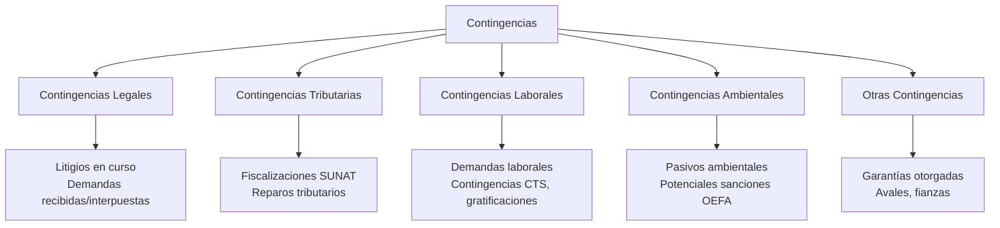

# Memoria Anual - Regulación y Contenido según LGS

## 🎯 Concepto

La **Memoria Anual** (también llamada "Informe de Gestión" o "Memoria de los Directores") es un documento **complementario a los estados financieros** que contiene información cualitativa y cuantitativa sobre la gestión, situación económica-financiera, riesgos y perspectivas de la sociedad durante el ejercicio cerrado.

**Naturaleza jurídica:**
- Documento de **obligatoria preparación** (Art. 221 LGS)
- De carácter **informativo y explicativo**
- Dirigido a los accionistas y terceros interesados
- Debe presentarse junto con los estados financieros a la Junta General

## 📋 Marco Regulatorio

### Art. 221 LGS - Obligación de Preparar Memoria

> **Artículo 221.- Estados financieros y memoria**
> "El directorio debe formular la memoria, los proyectos de distribución de utilidades y los estados financieros correspondientes al final del ejercicio social, sometidos a consideración del auditor externo, dentro de los tres meses siguientes a esa fecha."

### Art. 222 LGS - Contenido de la Memoria

> **Artículo 222.- Contenido de la memoria**
> "**La memoria debe contener cuando menos:**
> 
> **1. La indicación de las inversiones de importancia realizadas durante el ejercicio;**
> 
> **2. La existencia de contingencias significativas;**
> 
> **3. Los hechos de importancia ocurridos con posterioridad al cierre del ejercicio;**
> 
> **4. Cualquier otra información relevante que la junta general o el estatuto de la sociedad determine; y,**
> 
> **5. Los demás informes y requisitos que señale la ley.**
> 
> **El directorio responde solidariamente frente a la sociedad, los accionistas y terceros por los perjuicios que se deriven de la falsedad o incorreción de las informaciones que contenga la memoria que elabore.**"

## 📊 Contenido Obligatorio de la Memoria (Art. 222 LGS)

### 1. Inversiones de Importancia Realizadas

**¿Qué incluir?**

| Tipo de Inversión | Información a Reportar | Ejemplo |
|-------------------|----------------------|---------|
| **Activos fijos** | Descripción, monto, finalidad, financiamiento | "Adquisición de maquinaria industrial por S/ 2,500,000 financiada con crédito bancario a 5 años para incrementar capacidad productiva en 30%." |
| **Inversiones financieras** | Tipo de instrumento, monto, plazo, rentabilidad esperada | "Compra de bonos corporativos AAA por S/ 500,000 con vencimiento en 3 años y tasa 6% anual." |
| **Adquisiciones empresariales** | Empresa adquirida, % participación, precio, justificación estratégica | "Adquisición del 60% de las acciones de Distribuidora Regional SAC por S/ 1,800,000 para expandir red de distribución al norte del país." |
| **Inversiones en I+D** | Proyectos, presupuesto, objetivos | "Inversión de S/ 300,000 en desarrollo de nueva línea de productos ecológicos." |

**Criterio de "importancia":**
- No hay un monto fijo en la LGS
- Práctica recomendada: inversiones > 5% del total de activos o > 10% del patrimonio
- Considerar la **materialidad** desde perspectiva del accionista

### 2. Contingencias Significativas

**Definición:** Situaciones existentes al cierre del ejercicio cuyo resultado final (ganancia o pérdida) depende de eventos futuros inciertos.

**Tipos de contingencias a reportar:**



**Ejemplo de redacción:**

> **Contingencias Legales:**
> "Al 31 de diciembre de 2023, la sociedad enfrenta una demanda por daños y perjuicios interpuesta por XYZ S.A. por un monto de S/ 800,000. Los asesores legales de la compañía estiman que la probabilidad de una sentencia desfavorable es **remota**, por lo que no se ha registrado provisión alguna en los estados financieros. El proceso se encuentra en etapa de instrucción en el Juzgado Comercial de Lima."
> 
> **Contingencias Tributarias:**
> "SUNAT ha iniciado un procedimiento de fiscalización respecto del Impuesto a la Renta del ejercicio 2021. A la fecha de elaboración de esta memoria, la fiscalización no ha concluido. La gerencia, en consulta con sus asesores tributarios, estima que la probabilidad de un reparo significativo es **posible** pero no probable, estimándose un monto máximo de S/ 250,000."

### 3. Hechos Posteriores al Cierre (Events After the Reporting Period)

**Base contable:** NIC 10 - Hechos Ocurridos Después del Periodo sobre el que se Informa

**Definición:** Eventos favorables o desfavorables ocurridos entre el 31/12 (fecha de cierre) y la fecha de autorización de los EE.FF. para su emisión.

**Clasificación:**

| Tipo | Descripción | Tratamiento en EE.FF. | Tratamiento en Memoria |
|------|-------------|-----------------------|----------------------|
| **Hechos que requieren ajuste** | Proporcionan evidencia de condiciones existentes al cierre | **Ajustar** los EE.FF. | Explicar el ajuste realizado |
| **Hechos que NO requieren ajuste** | Indican condiciones surgidas DESPUÉS del cierre | **NO ajustar** los EE.FF. | **Revelar** en Memoria si son materiales |

**Ejemplos de hechos posteriores a reportar:**

**Hechos que requieren ajuste:**
- Sentencia judicial después del cierre que confirma obligación existente al 31/12
- Quiebra de un cliente que confirma incobrabilidad de cuenta por cobrar al 31/12
- Venta de activo después del cierre que revela deterioro al 31/12

**Hechos que NO requieren ajuste pero SÍ deben revelarse en Memoria:**
- Incendio en planta principal ocurrido en enero (después del cierre)
- Cambio en la legislación tributaria aprobado en febrero
- Fusión o adquisición acordada después del cierre
- Emisión de nueva deuda o capital después del cierre
- Pérdida de cliente importante en enero

**Ejemplo de redacción:**

> **Hechos Posteriores al Cierre:**
> "Con fecha 15 de febrero de 2024, la sociedad suscribió un contrato de fusión por absorción con Transportes del Sur S.A.C., por el cual absorberá a esta última. La operación está sujeta a la aprobación de las Juntas Generales de ambas sociedades y a la inscripción en Registros Públicos. Se estima que la fusión se completará durante el segundo trimestre de 2024. Este hecho no afecta los estados financieros al 31 de diciembre de 2023."

### 4. Información Adicional según Junta o Estatuto

El estatuto de la sociedad o los accionistas en Junta pueden requerir información adicional, como:

- **Gobierno corporativo:** Composición del Directorio, comités, políticas
- **Sostenibilidad:** Impacto ambiental, social, programas de RSE
- **Innovación:** Proyectos de I+D, patentes, nuevos productos
- **Expansión:** Nuevos mercados, sucursales, alianzas estratégicas
- **Recursos humanos:** Número de empleados, capacitación, clima laboral

### 5. Otros Informes y Requisitos que Señale la Ley

**Para SAA (Sociedades Anónimas Abiertas) - SMV:**
- Reglamento de Información Financiera (Resolución SMV)
- Reportes de Buen Gobierno Corporativo
- Información sobre operaciones con partes relacionadas (Art. 176 LGS)

**Para empresas reguladas por SBS:**
- Informes específicos según normas prudenciales
- Información sobre gestión de riesgos

## 📝 Estructura Recomendada de la Memoria Anual

### Modelo Completo de Memoria

```
MEMORIA ANUAL 2023
[NOMBRE DE LA SOCIEDAD]

==================================================

I. CARTA DEL DIRECTORIO
   - Mensaje del Presidente del Directorio
   - Resumen ejecutivo del año

II. INFORMACIÓN GENERAL DE LA SOCIEDAD
   - Denominación social, RUC, domicilio
   - Fecha de constitución e inscripción en RRPP
   - Plazo de duración
   - Capital social y acciones
   - Objeto social
   - Composición del Directorio y Gerencia

III. ANÁLISIS Y DISCUSIÓN DE LA GESTIÓN (MD&A)
   A. Entorno Económico
      - Contexto macroeconómico nacional/internacional
      - Sector industrial/comercial
      
   B. Situación Financiera y Resultados de Operación
      - Análisis de ingresos, costos y gastos
      - Análisis de rentabilidad (márgenes, ROE, ROA)
      - Análisis de liquidez y solvencia
      - Análisis de endeudamiento
      
   C. Análisis de Flujos de Efectivo
      - Flujos de operación, inversión, financiamiento
      - Inversiones de capital realizadas

IV. INVERSIONES DE IMPORTANCIA (Art. 222.1 LGS)
   - Descripción de inversiones > X% del patrimonio
   - Justificación estratégica
   - Fuentes de financiamiento

V. CONTINGENCIAS SIGNIFICATIVAS (Art. 222.2 LGS)
   - Contingencias legales
   - Contingencias tributarias
   - Contingencias laborales
   - Otras contingencias

VI. HECHOS POSTERIORES AL CIERRE (Art. 222.3 LGS)
   - Eventos materiales ocurridos entre 31/12 y fecha de emisión
   - Impacto estimado

VII. GESTIÓN DE RIESGOS
   - Riesgos financieros (crédito, liquidez, mercado)
   - Riesgos operacionales
   - Riesgos estratégicos
   - Medidas de mitigación

VIII. GOBIERNO CORPORATIVO (para SAA)
   - Estructura del Directorio
   - Comités (Auditoría, Riesgos, etc.)
   - Código de Buen Gobierno Corporativo
   - Operaciones con partes relacionadas

IX. RESPONSABILIDAD SOCIAL Y AMBIENTAL
   - Políticas ambientales
   - Programas sociales
   - Certificaciones (ISO, etc.)

X. RECURSOS HUMANOS
   - Número de colaboradores
   - Capacitación y desarrollo
   - Seguridad y salud ocupacional

XI. PERSPECTIVAS PARA EL EJERCICIO 2024
   - Proyecciones económicas
   - Planes de inversión
   - Estrategias de crecimiento

XII. PROPUESTA DE APLICACIÓN DE UTILIDADES
   - Reserva legal
   - Dividendos propuestos
   - Otras reservas

XIII. AGRADECIMIENTOS
   - A los accionistas, clientes, colaboradores

XIV. ANEXOS
   - Estados financieros auditados
   - Dictamen de auditoría
   - Otros

==================================================

[Firma del Directorio]
[Fecha]
```

## 🎯 Caso Práctico Completo

### Empresa: "Industrias Químicas del Perú S.A."

**Contexto:**
- SAA (Sociedad Anónima Abierta) supervisada por SMV
- Cierre de ejercicio: 31/12/2023
- Directorio: 5 miembros
- Gerente General: Juan Pérez López

**Extracto de la Memoria Anual 2023:**

---

### **I. CARTA DEL PRESIDENTE DEL DIRECTORIO**

> "Estimados Accionistas:
> 
> En nombre del Directorio, tengo el agrado de presentar la Memoria Anual correspondiente al ejercicio económico 2023, junto con los estados financieros auditados por Ernst & Young Perú.
> 
> Durante el ejercicio 2023, nuestra compañía enfrentó un entorno macroeconómico desafiante, marcado por la desaceleración económica nacional (crecimiento del PBI de -0.5%) y la volatilidad del tipo de cambio. No obstante, logramos incrementar nuestros ingresos en 12% respecto al ejercicio anterior, alcanzando S/ 85 millones, y mantuvimos un margen operativo del 18%.
> 
> [...]
> 
> Atentamente,
> 
> Carlos Mendoza García
> Presidente del Directorio"

---

### **IV. INVERSIONES DE IMPORTANCIA (Art. 222.1 LGS)**

> **1. Ampliación de Planta Industrial - Huachipa**
> - **Monto invertido:** S/ 8,500,000
> - **Descripción:** Construcción de nueva línea de producción para productos de especialidad química
> - **Financiamiento:** 40% recursos propios, 60% crédito bancario (BBVA Continental, 5 años, tasa 7.5% anual)
> - **Justificación estratégica:** Incrementar capacidad productiva en 35% para atender creciente demanda de sector agroindustrial
> - **Estado al 31/12/2023:** Obra física completada al 85%, puesta en marcha programada para marzo 2024
> 
> **2. Adquisición de Participación en Distribuidora Andina S.A.C.**
> - **Monto invertido:** S/ 3,200,000
> - **Descripción:** Adquisición del 51% de las acciones de Distribuidora Andina S.A.C.
> - **Financiamiento:** Recursos propios
> - **Justificación estratégica:** Integración vertical para asegurar canal de distribución en región sur del país
> - **Impacto:** Consolidación en estados financieros a partir de julio 2023
> 
> **3. Inversión en Tecnología - Sistema ERP**
> - **Monto invertido:** S/ 1,800,000
> - **Descripción:** Implementación de sistema ERP SAP S/4HANA
> - **Financiamiento:** Recursos propios
> - **Justificación estratégica:** Modernización de procesos administrativos y mejora en gestión de inventarios
> - **Estado al 31/12/2023:** Implementación al 60%, go-live programado para junio 2024

---

### **V. CONTINGENCIAS SIGNIFICATIVAS (Art. 222.2 LGS)**

> **A. Contingencias Legales**
> 
> **1. Demanda de Indemnización por Daños - ABC Transportes S.A.C.**
> - **Materia:** Demanda por incumplimiento contractual
> - **Monto demandado:** S/ 1,200,000
> - **Estado procesal:** Primera instancia, audiencia de pruebas programada para abril 2024
> - **Evaluación legal:** Los asesores legales externos (Estudio Muñiz) estiman que la probabilidad de sentencia desfavorable es **remota** (< 10%)
> - **Provisión contable:** No se ha registrado provisión por considerarse probabilidad remota
> 
> **B. Contingencias Tributarias**
> 
> **1. Fiscalización SUNAT - Impuesto a la Renta 2021**
> - **Materia:** Deducibilidad de gastos de publicidad
> - **Monto observado:** S/ 450,000 (reparos preliminares)
> - **Estado:** Fiscalización concluida, pendiente emisión de resolución de determinación
> - **Evaluación tributaria:** Los asesores tributarios (PwC) estiman probabilidad de confirmación del reparo del 40%, monto estimado S/ 180,000 (40% de 450,000)
> - **Provisión contable:** Se ha registrado provisión de S/ 180,000 en los estados financieros (Nota 15)
> 
> **C. Contingencias Ambientales**
> 
> **1. Procedimiento Administrativo Sancionador - OEFA**
> - **Materia:** Presunto exceso en límites máximos permisibles de efluentes industriales
> - **Multa potencial:** Entre S/ 80,000 y S/ 500,000 según escala de sanciones
> - **Estado:** Etapa de descargos, audiencia programada para marzo 2024
> - **Evaluación:** La gerencia estima probabilidad del 60% de imposición de multa por monto estimado de S/ 150,000
> - **Provisión contable:** Se ha registrado provisión de S/ 150,000 (Nota 15)
> - **Medidas correctivas:** Implementación de nueva planta de tratamiento de efluentes (S/ 600,000) en ejecución

---

### **VI. HECHOS POSTERIORES AL CIERRE (Art. 222.3 LGS)**

> **1. Siniestro en Almacén de Productos Terminados - 18 de enero de 2024**
> - **Descripción:** Incendio en almacén de productos terminados en planta de Villa El Salvador
> - **Daños estimados:** S/ 2,500,000 (inventarios), S/ 800,000 (infraestructura)
> - **Cobertura de seguros:** La compañía cuenta con póliza Todo Riesgo Empresarial con Rímac Seguros. Se estima recuperación del 90% de las pérdidas (S/ 2,970,000)
> - **Impacto operacional:** Suspensión temporal de operaciones en esa planta (estimado 2 meses). Producción redirigida a planta de Huachipa
> - **Impacto financiero:** Se estima impacto en ventas del Q1 2024 de aproximadamente S/ 1,200,000. El resultado neto del siniestro (pérdida no cubierta) se estima en S/ 330,000
> - **Tratamiento contable:** Este evento **NO** afecta los estados financieros al 31/12/2023 por tratarse de un hecho posterior que no requiere ajuste (NIC 10)
> 
> **2. Emisión de Bonos Corporativos - 5 de febrero de 2024**
> - **Descripción:** Emisión de bonos corporativos en el mercado de valores peruano
> - **Monto:** S/ 15,000,000
> - **Plazo:** 7 años
> - **Tasa:** 7.25% anual
> - **Clasificación de riesgo:** AA- (Apoyo & Asociados)
> - **Destino de fondos:** Refinanciamiento de deuda bancaria de corto plazo y capital de trabajo
> - **Tratamiento contable:** Este evento **NO** afecta los estados financieros al 31/12/2023
> 
> **3. Acuerdo de Joint Venture con ChemCorp USA Inc. - 28 de febrero de 2024**
> - **Descripción:** Suscripción de memorándum de entendimiento para constituir joint venture 50%-50%
> - **Objeto:** Desarrollo y comercialización de productos químicos especializados para industria minera
> - **Inversión estimada:** USD 5,000,000 (cada parte)
> - **Estado:** Memorándum firmado, negociación de términos definitivos en curso
> - **Tratamiento contable:** Este evento **NO** afecta los estados financieros al 31/12/2023

---

### **XII. PROPUESTA DE APLICACIÓN DE UTILIDADES**

> El Directorio propone a la Junta General Ordinaria de Accionistas la siguiente aplicación de la utilidad neta del ejercicio 2023:
> 
> | Concepto | Monto (S/) |
> |----------|------------|
> | Utilidad neta del ejercicio 2023 | 8,500,000 |
> | (-) Reserva legal (10%, hasta alcanzar 20% del capital) | (850,000) |
> | **Utilidad distribuible** | **7,650,000** |
> | | |
> | **Propuesta de aplicación:** | |
> | Dividendos en efectivo | 5,000,000 |
> | Reserva facultativa | 2,000,000 |
> | Utilidades retenidas | 650,000 |
> | **Total** | **7,650,000** |
> 
> **Dividendo por acción:** S/ 5,000,000 ÷ 10,000,000 acciones = **S/ 0.50 por acción**
> 
> **Forma y plazo de pago:** El pago de dividendos se efectuará en efectivo, en dos cuotas:
> - Primera cuota (50%): 30 días después de aprobación de Junta
> - Segunda cuota (50%): 90 días después de aprobación de Junta

---

**[Firmas del Directorio]**

Carlos Mendoza García - Presidente
María Rodríguez Soto - Directora
Luis Fernández Castro - Director
Ana Gutiérrez Pérez - Directora
Jorge Silva Mora - Director

Lima, 15 de marzo de 2024

---

## 💼 Responsabilidad del Directorio (Art. 222 LGS)

### Responsabilidad Solidaria

> "El directorio responde solidariamente frente a la sociedad, los accionistas y terceros por los perjuicios que se deriven de la **falsedad o incorreción** de las informaciones que contenga la memoria que elabore."

**Implicaciones:**
- **Responsabilidad solidaria:** Todos los directores responden conjuntamente
- **Alcance:** Frente a sociedad, accionistas Y terceros
- **Causa:** Información falsa o incorrecta
- **Consecuencia:** Indemnización por daños y perjuicios

**Exención de responsabilidad:**
- Director que salvó su voto en acta (Art. 177 LGS)
- Director que renunció antes de aprobarse la memoria

**Plazo de prescripción:**
- 2 años desde fecha de adopción del acuerdo (Art. 181 LGS)

## 📚 Conexiones

### Dentro del Curso
- [[estados-financieros-lgs]] - La Memoria complementa los EE.FF.
- [[auditoria-externa]] - El auditor revisa consistencia entre Memoria y EE.FF.
- [[dividendos]] - La Memoria incluye propuesta de distribución
- [[sociedad-anonima-concepto]] - Obligación del Directorio
- [[04-indice-unidad-4-informacion-financiera]] - Índice de esta unidad

### Con Otras Materias
- **Auditoría:** El auditor debe leer la Memoria y verificar consistencia con EE.FF. auditados
- **Finanzas:** Análisis financiero y proyecciones
- **Contabilidad:** NIC 10 (Hechos posteriores), NIC 37 (Contingencias)

## 🔑 Referencias Normativas

- **Ley N° 26887 - LGS:**
  - **Art. 221:** Obligación de formular Memoria
  - **Art. 222:** Contenido de la Memoria y responsabilidad del Directorio
  - Art. 114: Junta anual obligatoria (para aprobar Memoria)
  - Art. 177-181: Responsabilidad de administradores

- **Normas Contables:**
  - **NIC 10:** Hechos Ocurridos Después del Periodo sobre el que se Informa
  - **NIC 37:** Provisiones, Pasivos Contingentes y Activos Contingentes

- **Regulación SMV (para SAA):**
  - Reglamento de Información Financiera
  - Normas de Buen Gobierno Corporativo

## ❓ Preguntas de Autoevaluación

1. ¿Cuáles son los 5 elementos mínimos que debe contener la Memoria según Art. 222 LGS?
2. ¿Qué tipo de responsabilidad tienen los directores por la información falsa en la Memoria?
3. ¿Qué son los "hechos posteriores al cierre" y cómo se reportan en la Memoria?
4. ¿Cuál es el criterio para determinar si una inversión es "de importancia"?
5. ¿En qué plazo debe prepararse la Memoria después del cierre del ejercicio?
6. ¿Puede un director exonerarse de responsabilidad por la Memoria?
7. ¿Qué diferencia hay entre contingencias "remotas", "posibles" y "probables"?

---

**Elaborado por el Comité de Expertos:** Pedagogos, Documentadores, Psicólogos del Conocimiento, Expertos en Obsidian, Abogados y Contadores especializados en marco normativo peruano.
