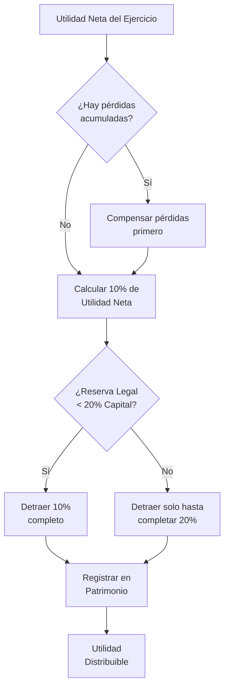
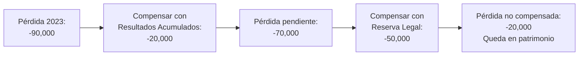

# Reserva Legal

## 🎯 Concepto

**Cuenta patrimonial obligatoria:** Detracción del 10% de utilidades netas anuales hasta alcanzar el 20% del capital social (Art. 229 LGS).

**Finalidad:** Proteger capital social y garantizar solvencia societaria.

**PCGE:** Cuenta 58 Reservas → 582 Legal

**Conexiones:** [[dividendos|Utilidades distribuibles]] • [[estados-financieros-lgs|EE.FF.]] • [[junta-general-accionistas|Aprobación Junta]]

## 📋 Regulación en la LGS

### Art. 229 LGS - Texto Completo

> **Artículo 229.- Reserva legal**
> "Un mínimo del diez por ciento de la utilidad distribuible de cada ejercicio, deducido el impuesto a la renta, debe ser destinado a una reserva legal, hasta que ella alcance un monto igual a la quinta parte del capital. El exceso sobre este límite no tiene la condición de reserva legal.
> 
> Las pérdidas correspondientes a un ejercicio se compensan con las utilidades o reservas de libre disposición. En ausencia de éstas se compensan con la reserva legal.
> 
> En este último caso, la reserva legal debe ser repuesta.
> 
> La sociedad puede capitalizar la reserva legal, quedando obligada a reponerla.
> 
> La reposición de la reserva legal se hace destinando utilidades de ejercicios posteriores en la forma establecida en este artículo."

## 🧮 Cálculo de la Reserva Legal

### Fórmula

```
Reserva Legal Anual = Utilidad Neta × 10%

Límite Máximo = Capital Social × 20%
```

### Proceso de Cálculo (Diagrama)



## 📊 Ejemplos Prácticos Detallados

### Caso 1: Constitución Inicial de Reserva Legal

**Datos:**
- Empresa: "Industrias del Norte SAC"
- Capital Social: S/ 500,000
- Utilidad Neta 2023: S/ 120,000
- Reserva Legal acumulada: S/ 0 (empresa nueva)

**Cálculo:**
```
1. Límite máximo de reserva legal:
   20% × 500,000 = S/ 100,000

2. Detracción del ejercicio 2023:
   10% × 120,000 = S/ 12,000

3. Reserva legal acumulada después:
   0 + 12,000 = S/ 12,000

4. ¿Alcanzó el límite? NO
   12,000 < 100,000

5. Utilidad distribuible:
   120,000 - 12,000 = S/ 108,000
```

**Asiento Contable (PCGE Perú):**
```
------- Por la aplicación de utilidades -------
59 RESULTADOS ACUMULADOS                      12,000
   591 Utilidades no distribuidas
      58 RESERVAS                                     12,000
         582 Legal

------- Por el cierre del Estado de Resultados -------
89 DETERMINACIÓN DEL RESULTADO DEL EJERCICIO  120,000
   891 Utilidad
      59 RESULTADOS ACUMULADOS                        120,000
         591 Utilidades no distribuidas
```

**Estado de Cambios en el Patrimonio Neto:**

| Concepto | Capital Social | Reserva Legal | Resultados Acumulados | Total Patrimonio |
|----------|----------------|---------------|----------------------|------------------|
| Saldo Inicial 01/01/2023 | 500,000 | 0 | 0 | 500,000 |
| Utilidad Neta 2023 | - | - | 120,000 | 120,000 |
| Detracción reserva legal | - | 12,000 | (12,000) | 0 |
| **Saldo Final 31/12/2023** | **500,000** | **12,000** | **108,000** | **620,000** |

### Caso 2: Alcanzando el Límite de 20%

**Datos:**
- Empresa: "Servicios Corporativos S.A."
- Capital Social: S/ 200,000
- Reserva Legal acumulada: S/ 35,000
- Utilidad Neta 2023: S/ 80,000

**Cálculo:**
```
1. Límite máximo:
   20% × 200,000 = S/ 40,000

2. Detracción normal sería:
   10% × 80,000 = S/ 8,000

3. Reserva legal si se detrajera completo:
   35,000 + 8,000 = 43,000 > 40,000 (EXCEDE)

4. Solo se detrae hasta el límite:
   40,000 - 35,000 = S/ 5,000 ✓

5. El exceso no tiene condición de reserva legal:
   8,000 - 5,000 = S/ 3,000 (queda como utilidad distribuible)

6. Utilidad distribuible:
   80,000 - 5,000 = S/ 75,000
```

**Conclusión:** A partir de este ejercicio, la empresa **YA NO DETRAE** reserva legal porque alcanzó el 20% del capital.

### Caso 3: Compensación de Pérdidas con Reserva Legal

**Datos:**
- Empresa: "Comercial del Sur S.A.C."
- Capital Social: S/ 300,000
- Reserva Legal: S/ 50,000
- Resultados Acumulados: S/ 20,000
- Pérdida del Ejercicio 2023: (S/ 90,000)

**Aplicación según Art. 229 LGS:**



**Desarrollo:**
```
1. Pérdida del ejercicio:                          (90,000)
2. Compensación con resultados acumulados:          20,000
   Pérdida pendiente:                              (70,000)

3. Compensación con reserva legal:                  50,000
   Pérdida pendiente:                              (20,000)

4. La reserva legal queda en CERO
5. La pérdida no compensada (20,000) queda como 
   "Resultados Acumulados negativos"
```

**Asiento Contable:**
```
------- Por la compensación con resultados acumulados -------
59 RESULTADOS ACUMULADOS                           20,000
   591 Utilidades no distribuidas
      59 RESULTADOS ACUMULADOS                             20,000
         592 Pérdidas acumuladas

------- Por la compensación con reserva legal -------
58 RESERVAS                                        50,000
   582 Legal
      59 RESULTADOS ACUMULADOS                             50,000
         592 Pérdidas acumuladas

------- Pérdida no compensada queda en el patrimonio -------
(Ya está reflejada en la cuenta 592 con saldo deudor de 20,000)
```

**Estado de Cambios en el Patrimonio:**

| Concepto | Capital | Reserva Legal | Resultados Acum. | Total |
|----------|---------|---------------|------------------|-------|
| Saldo Inicial | 300,000 | 50,000 | 20,000 | 370,000 |
| Pérdida 2023 | - | - | (90,000) | (90,000) |
| Compensación con reserva | - | (50,000) | 50,000 | 0 |
| **Saldo Final** | **300,000** | **0** | **(20,000)** | **280,000** |

**Obligación de Reposición:**
Según el Art. 229, la empresa está **OBLIGADA** a reponer la reserva legal en ejercicios futuros cuando obtenga utilidades.

### Caso 4: Reposición de Reserva Legal

**Datos:**
- Continuación del Caso 3
- En 2024, la empresa obtiene utilidad neta de S/ 100,000

**Cálculo de Reposición:**
```
1. Reserva legal que debe tener (límite):
   20% × 300,000 = S/ 60,000

2. Reserva legal actual: S/ 0

3. Detracción en 2024:
   10% × 100,000 = S/ 10,000
   (Se aplica el 10% normal hasta reponer el 20%)

4. Reserva legal después de 2024:
   0 + 10,000 = S/ 10,000

5. Utilidad distribuible en 2024:
   100,000 - 10,000 = S/ 90,000

6. ¿Completó la reposición? NO
   Falta: 60,000 - 10,000 = S/ 50,000
   (Continuará reponiendo en ejercicios siguientes)
```

### Caso 5: Capitalización de Reserva Legal

**Datos:**
- Empresa: "Tecnología Andina S.A."
- Capital Social: S/ 400,000
- Reserva Legal: S/ 80,000 (ya alcanzó el 20%)
- La Junta decide aumentar capital capitalizando S/ 60,000 de reserva legal

**Procedimiento según Art. 229:**

**Paso 1: Acuerdo de Junta General**
- Mayoría requerida: Art. 126 LGS (mayoría absoluta)
- Acta debe especificar monto a capitalizar

**Paso 2: Asiento Contable**
```
------- Por la capitalización de reserva legal -------
58 RESERVAS                                        60,000
   582 Legal
      50 CAPITAL                                           60,000
         501 Capital social
```

**Paso 3: Estado Patrimonial DESPUÉS**

| Concepto | Antes | Después | Variación |
|----------|-------|---------|-----------|
| Capital Social | 400,000 | 460,000 | +60,000 |
| Reserva Legal | 80,000 | 20,000 | -60,000 |
| **Total Patrimonio** | 480,000 | 480,000 | 0 |

**Paso 4: Obligación de Reposición**
```
Nuevo límite de reserva legal:
20% × 460,000 = S/ 92,000

Reserva legal actual: S/ 20,000

Monto a reponer: 92,000 - 20,000 = S/ 72,000
(Se repondrá con el 10% de utilidades de ejercicios futuros)
```

**Paso 5: Modificación de Estatuto e Inscripción**
- Modificar Art. del Estatuto sobre capital social
- Inscribir en SUNARP (Art. 199 LGS)

## 🚫 Prohibiciones y Restricciones

### 1. No se Puede Distribuir como Dividendos

La reserva legal **NO ES DISTRIBUIBLE** mientras mantenga esa naturaleza. Solo puede:
- Compensar pérdidas (obligatorio si no hay otras reservas)
- Capitalizarse (con obligación de reposición)

### 2. Límite Máximo del 20%

El **exceso sobre el 20%** del capital pierde la condición de reserva legal y pasa a ser "Reserva de Libre Disposición".

**Ejemplo:**
- Capital: S/ 100,000 → Límite reserva legal: S/ 20,000
- Si acumulan S/ 25,000, el exceso de S/ 5,000 es de libre disposición

### 3. Prioridad en Compensación de Pérdidas

**Orden de compensación (Art. 229):**
1. Utilidades del ejercicio
2. Reservas de libre disposición
3. Reserva legal (última opción)

## 📈 Casos Especiales

### Caso Especial 1: Empresa con Múltiples Ejercicios

**"Grupo Empresarial Pacifico S.A." - Evolución 5 años:**

| Año | Capital | Utilidad Neta | Detracción 10% | Reserva Legal Acum. | ¿Alcanzó 20%? |
|-----|---------|---------------|----------------|---------------------|---------------|
| 2019 | 1,000,000 | 150,000 | 15,000 | 15,000 | No (7.5%) |
| 2020 | 1,000,000 | 200,000 | 20,000 | 35,000 | No (17.5%) |
| 2021 | 1,000,000 | 180,000 | 18,000 | 53,000 | No (26.5% → detrae solo 15,000) |
| 2022 | 1,000,000 | 250,000 | 0 | 200,000 | **SÍ (20%)** |
| 2023 | 1,000,000 | 300,000 | 0 | 200,000 | Sí (ya no detrae) |

**Observación año 2021:**
- Detracción normal: 10% × 180,000 = 18,000
- Pero: 53,000 - 18,000 = 35,000 (excedería)
- Límite: 20% × 1,000,000 = 200,000
- Solo detrae: 200,000 - 35,000 = **15,000** (solo lo necesario para llegar a 20%)

### Caso Especial 2: Aumento de Capital Durante el Ejercicio

**Situación:**
- Capital Social al 01/01/2023: S/ 500,000
- Reserva Legal: S/ 80,000
- El 01/07/2023 aumentan capital a S/ 800,000
- Utilidad Neta 2023: S/ 200,000

**¿Sobre qué capital se calcula el 20%?**

**Interpretación del Comité de Expertos:**
El límite del 20% se calcula sobre el **capital vigente al cierre del ejercicio** (31/12/2023).

```
Límite al 31/12/2023:
20% × 800,000 = S/ 160,000

Reserva legal actual: S/ 80,000

Detracción 2023:
10% × 200,000 = S/ 20,000

Reserva legal después:
80,000 + 20,000 = S/ 100,000

¿Alcanzó el límite? NO
Debe seguir detreyendo hasta llegar a 160,000
```

## 💼 Consecuencias del Incumplimiento

### Responsabilidad de los Administradores

**Si no se detrae la reserva legal:**

1. **Responsabilidad Civil (Art. 177-184 LGS):**
   - Gerente y Directorio responden solidariamente
   - Daños y perjuicios a la sociedad
   - Acción social de responsabilidad

2. **Nulidad del Acuerdo (Art. 150 LGS):**
   - El acuerdo de distribución de utilidades que no respete la reserva legal puede ser impugnado
   - Cualquier accionista puede demandar nulidad

3. **Implicaciones Tributarias:**
   - SUNAT puede observar si no se refleja correctamente en el Libro de Inventarios y Balances

## 🔗 Conexiones

### Dentro del Curso
- [[estados-financieros-lgs]] - La reserva legal se registra en el Balance
- [[dividendos]] - Se calcula después de detraer la reserva legal
- [[sociedad-anonima-concepto]] - Aplicable a SA, SAC, SAA
- [[concepto-sociedad]] - Protección del capital social
- [[04-indice-unidad-4-informacion-financiera]] - Índice de esta unidad

### Con Otras Materias
- **Contabilidad Financiera:** Cuenta 58 Reservas del PCGE
- **Finanzas:** Autofinanciamiento y retención de utilidades
- **Auditoría:** Verificación del cálculo correcto de la reserva legal

## 🔑 Referencias Normativas

- **Ley N° 26887 - LGS:**
  - **Art. 229:** Reserva legal (texto completo explicado)
  - Art. 40: Derechos del accionista a participar en utilidades
  - Art. 114: Junta anual obligatoria (aprueba aplicación de utilidades)
  - Art. 177-184: Responsabilidad de administradores

- **Plan Contable General Empresarial (PCGE):**
  - **Cuenta 58:** Reservas
  - **Subcuenta 582:** Legal
  - **Cuenta 59:** Resultados acumulados

## ❓ Preguntas de Autoevaluación

1. ¿Qué porcentaje de la utilidad neta se destina a reserva legal y cuál es el límite máximo?
2. ¿Qué sucede si la reserva legal acumulada excede el 20% del capital?
3. ¿En qué orden se compensan las pérdidas según el Art. 229?
4. Si se capitaliza la reserva legal, ¿debe reponerse?
5. ¿Sobre qué monto se calcula la detracción del 10%: utilidad antes o después de impuestos?
6. ¿Puede una empresa distribuir dividendos sin haber constituido la reserva legal del ejercicio?
7. ¿Qué debe hacer una empresa si su capital aumenta y la reserva legal era del 20% del capital anterior?

---

**Elaborado por el Comité de Expertos:** Pedagogos, Documentadores, Psicólogos del Conocimiento, Expertos en Obsidian, Abogados y Contadores especializados en marco normativo peruano.
