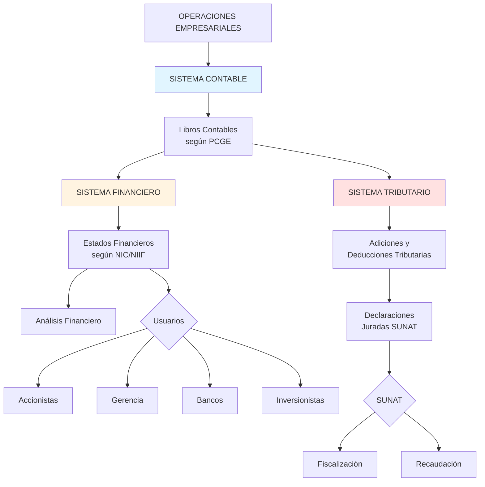
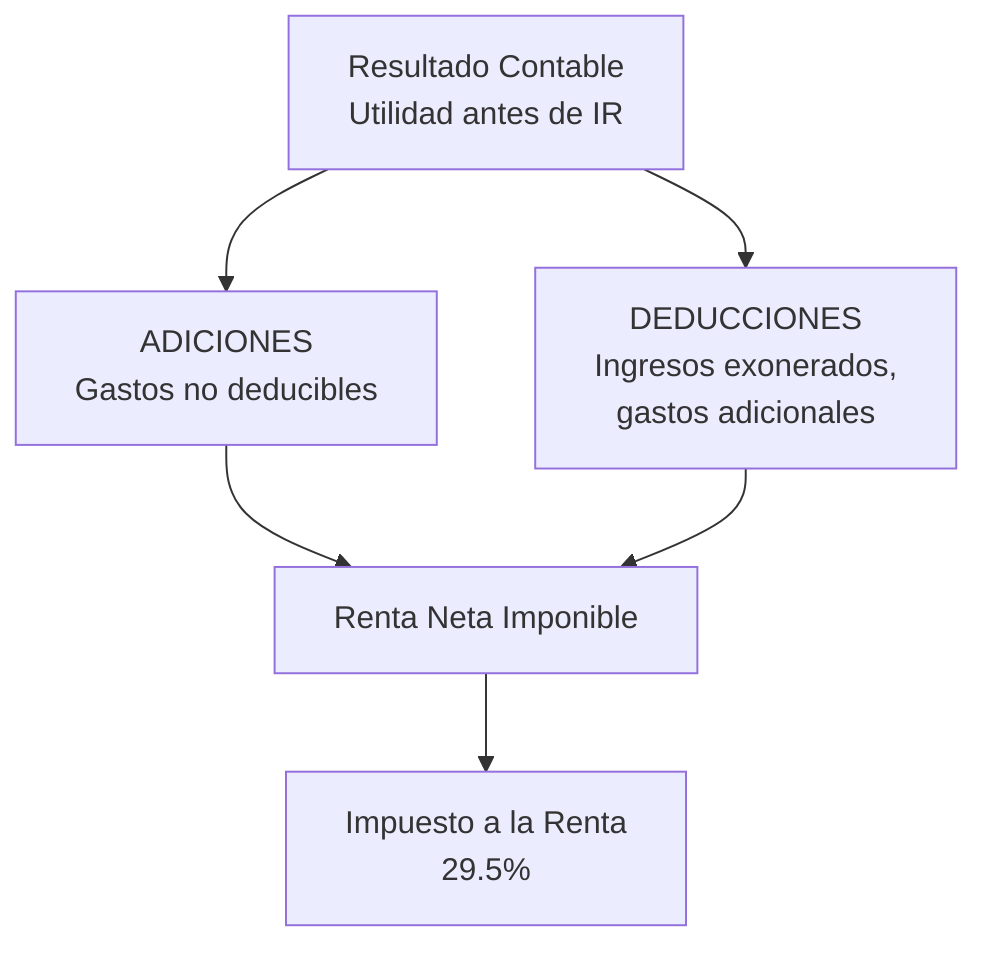

# Sistemas de Información Empresarial - Integración Contable, Financiera y Tributaria

## 🎯 Concepto

Los **Sistemas de Información Empresarial** son conjuntos integrados de procedimientos, registros, informes y tecnología que capturan, procesan, almacenan y distribuyen información relevante para la toma de decisiones empresariales y el cumplimiento de obligaciones legales.

En el contexto del Derecho Empresarial peruano, distinguimos **tres sistemas de información fundamentales:**

1. **Sistema de Información Contable**
2. **Sistema de Información Financiera**
3. **Sistema de Información Tributaria**

Estos tres sistemas están **interrelacionados** pero tienen **objetivos y usuarios diferentes**.

## 📊 Los Tres Sistemas de Información

### Comparación de los Tres Sistemas

| Aspecto | Sistema Contable | Sistema Financiero | Sistema Tributario |
|---------|-----------------|-------------------|-------------------|
| **Objetivo** | Registrar todas las operaciones según PCGE y NIIF | Proporcionar información para toma de decisiones | Determinar obligaciones tributarias |
| **Marco Normativo** | NIC/NIIF, PCGE | NIC/NIIF, análisis financiero | Ley del Impuesto a la Renta, IGV, otros |
| **Usuarios Principales** | Gerencia, accionistas, auditores | Gerencia, inversionistas, analistas | SUNAT, administración tributaria |
| **Periodicidad** | Continua (diaria) | Mensual, trimestral, anual | Mensual (declaraciones), anual (IR) |
| **Productos** | Libros contables, EE.FF. | Estados financieros, ratios, presupuestos | Declaraciones juradas, PDT |
| **Base** | Devengado | Devengado | Mixta (devengado + modificaciones tributarias) |
| **Regulador** | CNC (Consejo Normativo de Contabilidad) | SMV, SBS (según tipo de empresa) | SUNAT |

### Diagrama de Integración



## 📖 1. Sistema de Información Contable

### 1.1 Concepto

El **Sistema de Información Contable** es el conjunto de procedimientos, registros y libros que capturan y procesan todas las transacciones económicas de la empresa de acuerdo con el **Plan Contable General Empresarial (PCGE)** y las **NIC/NIIF**.

### 1.2 Componentes

#### A. Libros Contables Obligatorios

**Según Art. 65 del Código de Comercio y Resolución de Superintendencia N° 234-2006/SUNAT:**

| Libro/Registro | Obligatoriedad | Observación |
|----------------|---------------|-------------|
| **Libro Caja y Bancos** | Ingresos > 100 UIT | Registro de ingresos y salidas de efectivo |
| **Libro de Inventarios y Balances** | TODAS las empresas | Incluye Balance General y Estado de Resultados |
| **Libro Diario** | Ingresos > 100 UIT | Registro cronológico de asientos contables |
| **Libro Mayor** | Ingresos > 150 UIT | Saldos y movimientos por cuenta contable |
| **Registro de Compras** | Contribuyentes del IGV | Para crédito fiscal del IGV |
| **Registro de Ventas** | Contribuyentes del IGV | Para débito fiscal del IGV |
| **Libro de Retenciones (Renta)** | Agentes de retención | Retenciones del IR de cuarta y quinta categoría |
| **Libro de Planillas** | Empleadores | Registro de trabajadores y remuneraciones (T-REGISTRO) |
| **Libro de Actas** | Sociedades | Acuerdos de Junta y Directorio (Art. 135 LGS) |

**IMPORTANTE:** Desde 2010, la mayoría de libros contables se llevan en formato **electrónico** a través del Sistema de Libros Electrónicos (PLE-SUNAT).

#### B. Plan Contable General Empresarial (PCGE)

**Aprobado por:** Resolución CNC N° 043-2010-EF/94

**Estructura:**

```
PCGE - Estructura de Cuentas

ELEMENTO 1: ACTIVO DISPONIBLE Y EXIGIBLE
├─ 10 Efectivo y equivalentes de efectivo
├─ 11 Inversiones financieras
├─ 12 Cuentas por cobrar comerciales - Terceros
├─ 13 Cuentas por cobrar comerciales - Relacionadas
...

ELEMENTO 2: ACTIVO REALIZABLE
├─ 20 Mercaderías
├─ 21 Productos terminados
├─ 22 Subproductos, desechos y desperdicios
...

ELEMENTO 3: ACTIVO INMOVILIZADO
├─ 30 Inversiones mobiliarias
├─ 31 Inversiones inmobiliarias
├─ 33 Inmuebles, maquinaria y equipo
├─ 34 Intangibles
...

ELEMENTO 4: PASIVO
├─ 40 Tributos, contraprestaciones y aportes por pagar
├─ 41 Remuneraciones y participaciones por pagar
├─ 42 Cuentas por pagar comerciales - Terceros
├─ 44 Cuentas por pagar diversas - Relacionadas
├─ 45 Obligaciones financieras
├─ 46 Cuentas por pagar diversas - Terceros
...

ELEMENTO 5: PATRIMONIO
├─ 50 Capital
├─ 52 Capital adicional
├─ 56 Resultados no realizados
├─ 57 Excedente de revaluación
├─ 58 Reservas
├─ 59 Resultados acumulados

ELEMENTO 6: GASTOS POR NATURALEZA
├─ 60 Compras
├─ 61 Variación de existencias
├─ 62 Gastos de personal
├─ 63 Gastos de servicios prestados por terceros
├─ 64 Gastos por tributos
├─ 65 Otros gastos de gestión
├─ 66 Pérdida por medición de activos no financieros
├─ 67 Gastos financieros
├─ 68 Valuación y deterioro de activos
├─ 69 Costo de ventas

ELEMENTO 7: INGRESOS
├─ 70 Ventas
├─ 71 Variación de la producción almacenada
├─ 73 Descuentos, rebajas y bonificaciones obtenidos
├─ 74 Descuentos, rebajas y bonificaciones concedidos
├─ 75 Otros ingresos de gestión
├─ 76 Ganancia por medición de activos no financieros
├─ 77 Ingresos financieros

ELEMENTO 8: SALDOS INTERMEDIARIOS DE GESTIÓN
├─ 80 Margen comercial
├─ 81 Producción del ejercicio
├─ 82 Valor agregado
├─ 83 Excedente bruto de explotación
├─ 84 Resultado de explotación
├─ 85 Resultado antes de participaciones e impuestos
├─ 87 Participaciones de los trabajadores
├─ 88 Impuesto a la renta
├─ 89 Determinación del resultado del ejercicio

ELEMENTO 9: CONTABILIDAD ANALÍTICA DE EXPLOTACIÓN
(Cuentas para contabilidad de costos, uso opcional)

ELEMENTO 0: CUENTAS DE ORDEN
(Cuentas para control de bienes en custodia, garantías, etc.)
```

#### C. Ciclo Contable


### 1.3 Ejemplo Práctico - Ciclo Contable Completo

**Empresa: "Comercial Lima S.A.C."**
**Transacción:** Venta de mercadería por S/ 11,800 (incluye IGV 18%)

**Paso 1: Documento Fuente**
- Factura N° 001-00015
- Valor de venta: S/ 10,000
- IGV (18%): S/ 1,800
- Precio total: S/ 11,800
- Cliente: Distribuidora Norte S.A. (pago a crédito 30 días)
- Costo de la mercadería vendida: S/ 6,000

**Paso 2: Registro en Libro Diario**

```
ASIENTO DE DIARIO N° 125
Fecha: 15/09/2023

------- Por la venta a crédito -------
12 CUENTAS POR COBRAR COMERCIALES - TERCEROS    11,800
   121 Facturas por cobrar
   1211 Clientes
      40 TRIBUTOS POR PAGAR                             1,800
         401 Gobierno central
         4011 IGV
         40111 IGV - Cuenta propia
      70 VENTAS                                         10,000
         701 Mercaderías
         7011 Mercaderías manufacturadas

------- Por el costo de ventas -------
69 COSTO DE VENTAS                                6,000
   691 Mercaderías
   6911 Mercaderías manufacturadas
      20 MERCADERÍAS                                     6,000
         201 Mercaderías manufacturadas
         2011 Mercaderías en almacén
```

**Paso 3: Mayor de la Cuenta 12 - Cuentas por Cobrar**

| Fecha | Detalle | Debe | Haber | Saldo |
|-------|---------|------|-------|-------|
| 01/09 | Saldo inicial | - | - | 50,000 |
| 15/09 | Venta según Fact. 001-00015 | 11,800 | - | 61,800 |

**Paso 4: Registro en Libro de Ventas (PLE-SUNAT)**

| Fecha | Serie | Número | Cliente | RUC | Base Imponible | IGV | Total |
|-------|-------|--------|---------|-----|----------------|-----|-------|
| 15/09/2023 | 001 | 00015 | Distribuidora Norte S.A. | 20123456789 | 10,000 | 1,800 | 11,800 |

## 💰 2. Sistema de Información Financiera

### 2.1 Concepto

El **Sistema de Información Financiera** es el subsistema que, a partir de los registros contables, genera **estados financieros** y **reportes analíticos** para la toma de decisiones gerenciales, de inversión y financiamiento.

### 2.2 Productos del Sistema Financiero

#### A. Estados Financieros (ya explicados en [[estados-financieros-lgs]])

1. Estado de Situación Financiera
2. Estado de Resultados
3. Estado de Cambios en el Patrimonio
4. Estado de Flujos de Efectivo
5. Notas a los Estados Financieros

#### B. Reportes de Análisis Financiero

**Ratios Financieros:**

```
RATIOS DE LIQUIDEZ
├─ Liquidez Corriente = Activo Corriente / Pasivo Corriente
├─ Prueba Ácida = (Activo Corriente - Inventarios) / Pasivo Corriente
└─ Capital de Trabajo = Activo Corriente - Pasivo Corriente

RATIOS DE SOLVENCIA
├─ Endeudamiento Total = Pasivo Total / Activo Total
├─ Endeudamiento Patrimonial = Pasivo Total / Patrimonio
└─ Cobertura de Intereses = Utilidad Operativa / Gastos Financieros

RATIOS DE RENTABILIDAD
├─ Margen Bruto = Utilidad Bruta / Ventas
├─ Margen Operativo = Utilidad Operativa / Ventas
├─ Margen Neto = Utilidad Neta / Ventas
├─ ROE (Return on Equity) = Utilidad Neta / Patrimonio
└─ ROA (Return on Assets) = Utilidad Neta / Activo Total

RATIOS DE GESTIÓN
├─ Rotación de Inventarios = Costo de Ventas / Inventario Promedio
├─ Período Promedio de Cobro = (Cuentas por Cobrar / Ventas) × 365
└─ Rotación de Activos = Ventas / Activo Total
```

#### C. Presupuestos

- Presupuesto de Ventas
- Presupuesto de Producción
- Presupuesto de Compras
- Presupuesto de Gastos Operativos
- Presupuesto de Inversiones de Capital (CAPEX)
- Presupuesto de Flujo de Caja
- Presupuesto Maestro

#### D. Reportes Gerenciales

- Dashboard de Indicadores Clave (KPIs)
- Análisis de Variaciones (Real vs. Presupuesto)
- Proyecciones Financieras
- Análisis de Escenarios

### 2.3 Diferencia entre Contabilidad y Finanzas

| Aspecto | Contabilidad | Finanzas |
|---------|--------------|----------|
| **Enfoque** | Pasado (histórico) | Futuro (proyecciones) |
| **Objetivo** | Registrar y reportar | Planificar y decidir |
| **Base** | Devengado | Flujo de caja |
| **Producto típico** | Estado de Resultados | Flujo de Caja Proyectado |
| **Pregunta clave** | ¿Cuánto ganamos? | ¿Tendremos liquidez? |

## 🏛️ 3. Sistema de Información Tributaria

### 3.1 Concepto

El **Sistema de Información Tributaria** es el subsistema que, partiendo de la información contable, realiza **ajustes y adiciones** según las normas tributarias para determinar la **base imponible** de los impuestos y cumplir con las **obligaciones formales** ante SUNAT.

### 3.2 Principales Diferencias: Resultado Contable vs. Resultado Tributario

**Concepto clave:** El resultado contable (utilidad según Estados Financieros) **NO es igual** a la base imponible del Impuesto a la Renta.



#### Ejemplo de Adiciones y Deducciones Tributarias

**Empresa: "Servicios del Sur S.A."**

```
DETERMINACIÓN DEL IMPUESTO A LA RENTA 2023

1. RESULTADO CONTABLE (según EE.FF.):
   Utilidad antes de Impuestos                S/ 1,000,000

2. ADICIONES TRIBUTARIAS:
   (+) Multas e infracciones (Art. 44 LIR)          50,000
   (+) Gastos sin comprobantes de pago              30,000
   (+) Exceso de gastos de representación           20,000
   (+) Depreciación contable > tributaria           15,000
   (+) Donaciones no admitidas                      10,000
   Total Adiciones                                 125,000

3. DEDUCCIONES TRIBUTARIAS:
   (-) Ingresos por dividendos (exonerados)        (80,000)
   (-) Depreciación tributaria > contable          (25,000)
   Total Deducciones                              (105,000)

4. RENTA NETA IMPONIBLE:
   1,000,000 + 125,000 - 105,000 = S/ 1,020,000

5. IMPUESTO A LA RENTA (29.5%):
   1,020,000 × 29.5% = S/ 300,900

6. CRÉDITOS TRIBUTARIOS:
   (-) Pagos a cuenta mensuales                   (250,000)
   (-) Retenciones de terceros                     (10,000)
   Total Créditos                                 (260,000)

7. IMPUESTO POR REGULARIZAR:
   300,900 - 260,000 = S/ 40,900
   (A pagar en marzo-abril 2024)
```

### 3.3 Principales Tributos en Perú

#### A. Impuesto a la Renta (IR)

**Base Legal:** TUO de la Ley del Impuesto a la Renta (D.S. N° 179-2004-EF)

**Tipos:**

| Categoría | Tipo de Renta | Tasa | Contribuyentes |
|-----------|---------------|------|----------------|
| **Primera** | Arrendamiento de predios | 5% (directo) o 6.25% (sumando) | Personas naturales |
| **Segunda** | Rentas de capital (intereses, dividendos, regalías) | 5% (dividendos), 6.25% (otros) | Personas naturales |
| **Tercera** | **Rentas empresariales** | **29.5%** | Empresas (SA, SAC, etc.) |
| **Cuarta** | Trabajo independiente | 8% (retención), escala progresiva | Profesionales independientes |
| **Quinta** | Trabajo dependiente | Escala progresiva (hasta 30%) | Trabajadores en planilla |

**Para empresas (Tercera Categoría):**
- **Pagos a cuenta mensuales:** 1.5% de ingresos netos o coeficiente
- **Declaración anual:** Marzo-abril del año siguiente
- **Tasa:** 29.5% sobre renta neta imponible

#### B. Impuesto General a las Ventas (IGV)

**Base Legal:** TUO de la Ley del IGV (D.S. N° 055-99-EF)

**Características:**
- **Tasa:** 18% (16% IGV + 2% IPM - Impuesto de Promoción Municipal)
- **Naturaleza:** Impuesto al valor agregado
- **Base de cálculo:** Valor de venta de bienes y servicios
- **Periodicidad:** Mensual
- **Declaración:** PDT 621 (a más tardar el día de vencimiento según último dígito del RUC)

**Mecánica del IGV:**

```
IGV POR PAGAR = DÉBITO FISCAL - CRÉDITO FISCAL

Débito Fiscal = IGV de las ventas del mes
Crédito Fiscal = IGV de las compras del mes (que cumplan requisitos)
```

**Ejemplo:**
```
Ventas del mes:                     S/ 100,000
IGV Débito (18%):                   S/  18,000

Compras del mes:                    S/  60,000
IGV Crédito (18%):                  S/  10,800

IGV A PAGAR:
18,000 - 10,800 = S/ 7,200
```

### 3.4 Obligaciones Formales ante SUNAT

#### A. Declaraciones Juradas

| Declaración | Periodicidad | PDT | Contenido |
|-------------|-------------|-----|-----------|
| **Renta Mensual** | Mensual | PDT 621 | IGV + Renta (pagos a cuenta) |
| **PLAME** | Mensual | PDT PLAME | Planilla electrónica (remuneraciones) |
| **Renta Anual** | Anual (marzo-abril) | PDT 702 Virtual | Determinación del IR anual |
| **Operaciones con Terceros** | Anual (febrero) | - | Información detallada de compras y ventas del año (si supera umbral) |

#### B. Libros Electrónicos (PLE-SUNAT)

**Resolución de Superintendencia N° 286-2009/SUNAT y modificatorias**

**Principales libros electrónicos:**
- Registro de Compras
- Registro de Ventas
- Libro Diario
- Libro Mayor
- Libro de Inventarios y Balances
- Libro Caja y Bancos

**Plazos de presentación:**
- Máximo 3 meses después del cierre del mes

## 🔗 Integración de los Tres Sistemas

### Caso Práctico Integrador

**Empresa: "Industrias Peruanas S.A."**
**Operación:** Venta de productos industriales

#### Fase 1: Registro Contable

```
------- Venta de mercadería -------
12 CUENTAS POR COBRAR               118,000
      70 VENTAS                            100,000
      40 IGV POR PAGAR                      18,000

------- Costo de ventas -------
69 COSTO DE VENTAS                   65,000
      20 MERCADERÍAS                        65,000
```

#### Fase 2: Impacto en Estados Financieros (Sistema Financiero)

**Estado de Resultados (extracto):**
```
Ventas:                             S/ 100,000
(-) Costo de Ventas:                S/  65,000
= Utilidad Bruta:                   S/  35,000
Margen Bruto: 35%
```

**Estado de Situación Financiera (extracto):**
```
ACTIVO:
Cuentas por Cobrar Comerciales      S/ 118,000

PASIVO:
IGV por Pagar                       S/  18,000
```

#### Fase 3: Tratamiento Tributario (Sistema Tributario)

**A. Para el IGV:**
- Débito Fiscal del mes aumenta en S/ 18,000
- Se declara en PDT 621 del mes correspondiente

**B. Para el Impuesto a la Renta:**
- La venta incrementa los ingresos gravados: S/ 100,000
- El costo de ventas es deducible: S/ 65,000
- Renta neta de esta operación: S/ 35,000
- Se incluye en la declaración anual (PDT 702)

## 📚 Conexiones

### Dentro del Curso
- [[estados-financieros-lgs]] - Producto principal del sistema financiero
- [[reserva-legal]] - Calculada desde el sistema contable-financiero
- [[dividendos]] - Determinados desde la utilidad contable
- [[auditoria-externa]] - Examina el sistema contable y financiero
- [[04-indice-unidad-4-informacion-financiera]] - Índice de esta unidad

### Con Otras Materias
- **Contabilidad Financiera:** Aplicación práctica del sistema contable
- **Finanzas:** Uso del sistema financiero para decisiones
- **Tributación:** Aplicación del sistema tributario
- **Auditoría:** Evaluación de los tres sistemas

## 🔑 Referencias Normativas

### Sistema Contable
- **Resolución CNC N° 043-2010-EF/94:** Plan Contable General Empresarial
- **NIC/NIIF:** Normas contables internacionales
- **Resolución SUNAT N° 234-2006:** Libros y registros vinculados a asuntos tributarios

### Sistema Financiero
- **Ley N° 26887 (LGS):** Art. 221-224 (Estados Financieros)
- **NIC 1:** Presentación de Estados Financieros

### Sistema Tributario
- **D.S. N° 179-2004-EF:** TUO de la Ley del Impuesto a la Renta
- **D.S. N° 055-99-EF:** TUO de la Ley del IGV
- **Resolución SUNAT N° 286-2009:** Sistema de Libros Electrónicos (PLE)

## ❓ Preguntas de Autoevaluación

1. ¿Cuáles son los tres sistemas de información empresarial y cuáles son sus objetivos?
2. ¿Por qué el resultado contable NO es igual a la base imponible del Impuesto a la Renta?
3. ¿Qué es el Plan Contable General Empresarial (PCGE)?
4. ¿Cuál es la diferencia entre el sistema contable y el sistema financiero?
5. ¿Qué son las "adiciones" y "deducciones" tributarias?
6. ¿Cuáles son los principales libros electrónicos (PLE) que deben llevar las empresas?
7. ¿Cómo se calcula el IGV por pagar mensualmente?

---

**Elaborado por el Comité de Expertos:** Pedagogos, Documentadores, Psicólogos del Conocimiento, Expertos en Obsidian, Abogados y Contadores especializados en marco normativo peruano.
