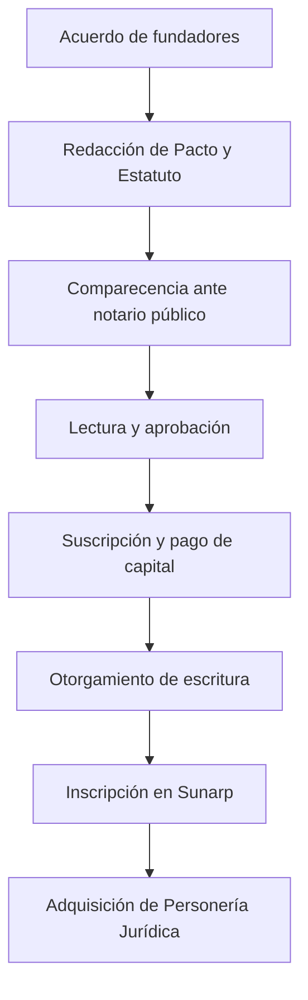
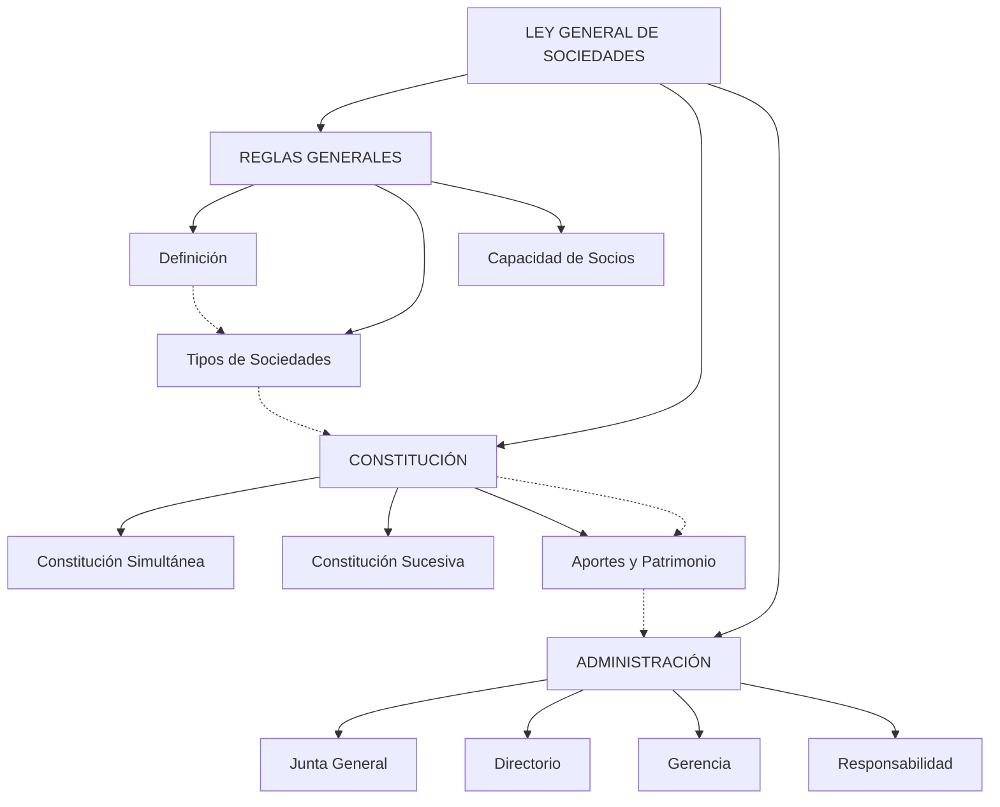

# Prompt Maestro: Unidad III — Sociedades Mercantiles (Ley General de Sociedades)

## Contexto y Propósito

Este prompt maestro desarrolla la **Unidad III** del syllabus de Derecho Empresarial, enfocada en:

> "Reglas generales aplicables a todas las formas societarias y reglas específicas que corresponde a cada forma societaria establecidos en la Ley General de Sociedades."

**Objetivo general:** Generar un corpus completo de notas atómicas que permita al estudiante universitario:
1. Comprender la estructura legal de la Ley General de Sociedades (Ley N° 26887)
2. Aplicar correctamente las reglas generales a cualquier forma societaria
3. Dominar las características específicas de la Sociedad Anónima (SA)
4. Resolver casos prácticos de constitución, administración y operación de sociedades
5. Conectar conceptos legales con implicaciones contables y financieras

---

## I. ANÁLISIS DEL SYLLABUS — UNIDAD III

### Contenido a Cubrir (Semanas 09-12)

**Semana 09: Ley General de Sociedades — Reglas Generales**
- Definición de sociedad
- Ámbito de aplicación de la Ley
- Modalidades de constitución (simultánea vs sucesiva)
- Pluralidad de socios
- Escritura pública y personería jurídica
- Denominación/razón social
- Objeto social
- Nombramientos y poderes
- Domicilio de la sociedad

**Semana 10: Los Aportes y el Patrimonio Social**
- Aportes dinerarios (requisitos de pago)
- Aportes no dinerarios (bienes muebles/inmuebles)
- Aportes no dinerarios (derechos de crédito, valores)
- Informe de valuación
- Patrimonio social
- Responsabilidad (limitada e ilimitada)
- Beneficios/pérdidas y reparto de utilidades
- Estados financieros como condición

**Semana 11: Sociedades Anónimas — Constitución**
- Denominación y representación del capital
- Responsabilidad de socios
- Suscripción y pago del capital social
- Constitución simultánea (pacto social y estatuto)
- Constitución sucesiva mediante oferta
- Socios fundadores y aportes
- Revisión de aportes
- Pago de dividendos

**Semana 12: Acciones y Órganos en Sociedades Anónimas**
- Definición y emisión de acciones
- Propietario de acciones
- Registro de matrícula
- Acciones con/sin derecho a voto
- Acciones preferenciales y comunes
- **Junta General de Accionistas** (facultades, quórum, adopción de acuerdos, libro de actas)
- **Directorio** (número, remoción, impedimentos, responsabilidad)
- **Gerencia General** (designación, atribuciones, responsabilidad, caducidad)
- **Practica Calificada N2** (aplicación integrada de conceptos)

---

## II. ANÁLISIS POR AGENTE (METODOLOGÍA KDD)

### 🗺️ FASE 1: EXPLORADOR — Mapeo de la Unidad III

**Rol Activo: El Explorador. Vamos a dibujar el mapa completo de este territorio legal...**

#### Mapa Mental de Unidad III

```mermaid
graph TB
    UNIDAD["UNIDAD III: SOCIEDADES MERCANTILES"]
    
    UNIDAD --> REGGEN["REGLAS GENERALES<br/>(Semana 09)"]
    UNIDAD --> APORTES["APORTES Y PATRIMONIO<br/>(Semana 10)"]
    UNIDAD --> CONST["CONSTITUCIÓN SA<br/>(Semana 11)"]
    UNIDAD --> ORGANOS["ÓRGANOS Y ACCIONES<br/>(Semana 12)"]
    
    REGGEN --> RG1["Concepto y definición"]
    REGGEN --> RG2["Aplicación de la Ley"]
    REGGEN --> RG3["Modalidades de constitución"]
    REGGEN --> RG4["Escritura pública"]
    REGGEN --> RG5["Personalidad jurídica"]
    
    APORTES --> AP1["Aportes dinerarios"]
    APORTES --> AP2["Aportes no dinerarios"]
    APORTES --> AP3["Valuación"]
    APORTES --> AP4["Patrimonio social"]
    APORTES --> AP5["Responsabilidad"]
    
    CONST --> CS1["Capital social"]
    CONST --> CS2["Suscripción y pago"]
    CONST --> CS3["Constitución simultánea"]
    CONST --> CS4["Constitución sucesiva"]
    CONST --> CS5["Fundadores"]
    
    ORGANOS --> ORG1["Acciones"]
    ORGANOS --> ORG2["Junta General"]
    ORGANOS --> ORG3["Directorio"]
    ORGANOS --> ORG4["Gerencia"]
    ORGANOS --> ORG5["Responsabilidades"]
    
    style UNIDAD fill:#c7254e
    style REGGEN fill:#d9534f
    style APORTES fill:#d9534f
    style CONST fill:#d9534f
    style ORGANOS fill:#d9534f
```



#### Catálogo Priorizado de Notas Atómicas

**TIER 1 (Conceptos Fundacionales — Crítico)**
1. `lgs-definicion-sociedad.md` — Concepto legal, naturaleza jurídica
2. `lgs-capacidad-pluralidad-socios.md` — Requisitos: quiénes pueden fundar
3. `lgs-tipos-sociedades.md` — Clasificación: SA, SRL, SCS, etc.
4. `lgs-objeto-social.md` — Concepto, límites, validez

**TIER 2 (Constitución — Muy Importante)**
5. `lgs-constitución-simultánea.md` — Proceso, escritura pública, contenido
6. `lgs-constitución-sucesiva.md` — Proceso de oferta, suscripción
7. `lgs-escritura-publica-requisitos.md` — Formalidades legales
8. `lgs-personeria-juridica.md` — Inscripción en SUNARP, efectos

**TIER 3 (Aportes y Patrimonio — Muy Importante)**
9. `lgs-aportes-dinerarios.md` — Requisitos de pago, prueba
10. `lgs-aportes-no-dinerarios.md` — Bienes muebles, inmuebles, derechos
11. `lgs-informe-valuacion.md` — Metodología, responsabilidad del valuador
12. `lgs-patrimonio-social.md` — Concepto, relación con contabilidad

**TIER 4 (Sociedades Anónimas: Acciones)**
13. `lgs-accion-definicion.md` — Concepto, características, clases
14. `lgs-acciones-voto.md` — Acciones con/sin derecho a voto
15. `lgs-acciones-preferenciales.md` — Características, privilegios, restricciones
16. `lgs-capital-social.md` — Suscripción, pago, variación

**TIER 5 (Órganos de Administración — Crítico)**
17. `lgs-junta-general-accionistas.md` — Facultades, quórum, acuerdos
18. `lgs-directorio.md` — Composición, duración, responsabilidad
19. `lgs-gerencia-general.md` — Atribuciones, responsabilidad, caducidad
20. `lgs-responsabilidad-administradores.md` — Tipos, causas, consecuencias

**TIER 6 (Aplicación Práctica — Casos)**
21. `caso-constitucion-sa-simultanea.md` — Caso resuelto paso a paso
22. `caso-aumento-capital-social.md` — Aumento por aportes, ajuste patrimonial
23. `caso-modificacion-estatuto.md` — Proceso legal y contable
24. `caso-responsabilidad-director.md` — Análisis de responsabilidad civil

**TIER 7 (Índices y Guías — Apoyo)**
25. `indice-unidad-iii.md` — Índice interactivo de la unidad
26. `guia-constitucion-paso-a-paso.md` — Guía práctica para constituir SA
27. `checklist-requisitos-sa.md` — Checklist de cumplimiento legal
28. `comparativa-tipos-sociedades.md` — Tabla comparativa SA vs SRL vs SCS

#### Plan Semanal Recomendado

| Semana | Tema                      | Notas a Estudiar (TIER Priority) | Actividad             |
|--------|---------------------------|----------------------------------|-----------------------|
| 09     | Reglas Generales LGS      | 1-4 (TIER 1-2), 25              | Lectura + Resumen    |
| 10     | Aportes y Patrimonio      | 5-12 (TIER 2-3), 27              | Ejercicios prácticos |
| 11     | Constitución SA           | 6-8, 13-16 (TIER 3-4), 21, 26   | Caso práctico        |
| 12     | Órganos y Acciones        | 17-24 (TIER 5-6), 28             | Práctica Cal. N2      |

---

### 🔬 FASE 2: ESPECIALISTA — Generación de Notas Atómicas

**Rol Activo: El Especialista. Vayamos a los detalles precisos de cada concepto...**

#### NOTA 1: Definición de Sociedad Mercantil

**Filename:** `lgs-definicion-sociedad.md`

```markdown
---
title: "Definición de Sociedad Mercantil"
type: concepto
course: "DERECHO EMPRESARIAL"
unit: III
week: 09
tags: [#derecho-empresarial, #lgs, #sociedad, #definicion]
created: 2025-10-20
updated: 2025-10-20
difficulty: basico
---

# Definición de Sociedad Mercantil

**Resumen:** Contrato consensual por el cual dos o más personas se obligan a realizar aportes para ejercer en común una actividad económica, compartiendo beneficios y responsabilidades.

## Definición Normativa

Según la **Ley General de Sociedades (Ley N° 26887, Artículo 1°):**

> "La sociedad es constituida cuando menos por dos personas que se obligan a realizar aportes para ejercer en común una actividad económica, de acuerdo a las normas de esta Ley."

## Elementos Esenciales

1. **Pluralidad de socios** (mínimo 2 personas)
   - Pueden ser personas naturales o jurídicas
   - Capacidad de ejercicio requerida

2. **Obligación de aportes**
   - Aporte: bien, dinero, derecho, trabajo
   - Cada socio contribuye según pacto

3. **Ejercicio común de actividad económica**
   - Comercio, industria, servicios
   - Propósito lucrativo (generalmente)

4. **Normas de la LGS**
   - Cumplimiento de formalidades legales
   - Respeto de derechos y obligaciones

## Naturaleza Jurídica

| Aspecto              | Característica                              |
|----------------------|---------------------------------------------|
| **Contrato**         | Consensual (acuerdo de voluntades)          |
| **Sujeto de derecho** | Persona jurídica distinta de socios         |
| **Responsabilidad**  | Según tipo: limitada, ilimitada, mixta     |
| **Patrimonio**       | Propio, distinto del de socios              |

## Desarrollo: Diferencias Clave

### Sociedad vs Asociación

| Elemento          | Sociedad                  | Asociación             |
|-------------------|--------------------------|------------------------|
| **Ánimo**         | Lucro (generalmente)     | Fines no lucrativos    |
| **Actividad**     | Económica común          | Altruista, deportiva   |
| **Responsabilidad**| Según tipo               | Limitada siempre       |
| **Patrimonio**    | Responde a obligaciones  | Solo patrimonio social |

### Sociedad vs Sociedades de Hecho

**Sociedad de Hecho:** Sin formalidades legales, pero existe intención de asociarse. La LGS otorga efectos limitados a socios solidarios.

## Conexiones

- [[lgs-tipos-sociedades|Tipos de Sociedades]]
- [[lgs-objeto-social|Objeto Social]]
- [[lgs-capacidad-pluralidad-socios|Capacidad y Pluralidad de Socios]]

## Ejemplos Resueltos

### Ejemplo 1 (Básico)
**Caso:** Juan y María deciden abrir una tienda de ropa. Invierten S/ 10,000 cada uno en mercadería y equipos. ¿Constituyen una sociedad?

**Análisis:**
- ✅ Pluralidad (2 personas)
- ✅ Aportes (S/ 10,000 cada uno)
- ✅ Actividad común (comercio de ropa)
- ✅ Intención de sociedad

**Conclusión:** Sí, constituyen sociedad (de hecho si sin formalidades; formal si cumplen LGS).

### Ejemplo 2 (Avanzado)
**Caso:** Una asociación de amigos que juega fútbol cada domingo y comparte gastos de cancha (S/ 50 cada mes). ¿Es una sociedad?

**Análisis:**
- ✅ Pluralidad
- ✅ Aportes (S/ 50 mensual)
- ❌ Actividad económica (deporte recreativo)
- ❌ Ánimo de lucro

**Conclusión:** No es sociedad. Es asociación civil (regulada por Código Civil).

## Ejercicios Propuestos

### Nivel Básico (E1)
Identifica si existe sociedad en estos casos:
1. Dos hermanos heredan una casa y la alquilan juntos
2. Un grupo de vecinos se junta a estudiar idiomas
3. Dos profesionales abren una consultoría juntos

**Respuestas esperadas:**
1. Sociedad de hecho
2. Asociación civil
3. Sociedad (requiere formalización)

### Nivel Intermedio (E2)
Redacta los elementos esenciales de una sociedad entre un ingeniero y un contador que desean abrir una empresa de consultoría. Incluye: aportes, actividad, socios.

### Nivel Avanzado (E3)
Una persona aporta capital a una empresa bajo el acuerdo de recibir 30% de ganancias, pero sin derecho a voto. ¿Es socio? ¿Qué tipo de acuerdo es?

## Preguntas Bloom

1. **Conocimiento:** ¿Cuál es la definición legal de sociedad según la LGS?
2. **Comprensión:** ¿Cuál es la diferencia entre una sociedad de hecho y una sociedad constituida formalmente?
3. **Aplicación:** En un caso específico, ¿cómo determinarías si existe una sociedad?
4. **Análisis:** ¿Por qué la ley requiere mínimo dos socios? ¿Cuál es la lógica?
5. **Síntesis:** ¿Cómo se relaciona la definición de sociedad con sus obligaciones legales?
6. **Evaluación:** ¿Debería permitirse que una sola persona constituya una sociedad? Argumenta.

## Base Normativa

- **Ley General de Sociedades N° 26887, Artículo 1°** — Definición de sociedad
- **Ley General de Sociedades N° 26887, Artículos 2-3** — Capacidad y obligaciones
- **Código Civil Peruano, Artículo 159** — Persona jurídica

## Referencias Bibliográficas

- Muñiz Ziches, Jorge. (2018). *Ley General de Sociedades comentada*. Gaceta Jurídica.
- Beaumont Callirgos, Ricardo. (2011). *Comentarios a la Ley General de Sociedades*. Jurista Editores.
- Bullard González, Alfredo. (2015). *Derecho Empresarial Peruano*. Palestra Editores.

## Notas y Alertas

⚠️ **Alerta:** La LGS se aplica también a sociedades que no ejercen actividad comercial (pueden ser civiles). La distinción es por el ánimo de lucro, no por el tipo de actividad.

✅ **Tip:** Para exámenes, memoriza los 4 elementos esenciales y sé capaz de identificarlos en un caso cualquiera.
```

#### NOTA 2: Constitución Simultánea de Sociedad Anónima

**Filename:** `lgs-constitucion-simultanea.md`

```markdown
---
title: "Constitución Simultánea de Sociedad Anónima"
type: concepto
course: "DERECHO EMPRESARIAL"
unit: III
week: 11
tags: [#derecho-empresarial, #lgs, #constitucion, #sa]
created: 2025-10-20
updated: 2025-10-20
difficulty: intermedio
---

# Constitución Simultánea de Sociedad Anónima

**Resumen:** Proceso de constitución en un único acto donde los fundadores suscriben y pagan el capital social íntegramente en la escritura pública, adquiriendo la personería jurídica de manera inmediata.

## Definición Normativa

Según **LGS Artículos 51-53**, la constitución simultánea es aquella donde:

> "Los fundadores se reúnen en un único acto para celebrar la escritura pública constitutiva, suscribiendo y pagando todo el capital social en ese momento."

## Requisitos Legales (LGS Art. 51)

### 1. **Escritura Pública (Formalidad Esencial)**

Contenido mínimo obligatorio:

- Datos personales de fundadores
- Capital social: monto, número de acciones, valor nominal
- Aporte de cada accionista
- Denominación de la sociedad
- Objeto social (descripción clara)
- Domicilio principal
- Estatuto (régimen interno)
- Nombres y DNI de primer directorio
- Nombre del gerente general

### 2. **Pacto Social (Art. 54)**

Contenido:

- Nombre, nacionalidad y documento de identidad de socios
- Aportes de cada socio (monto, bien, características)
- Capital social (total)
- Número de acciones (si SA)
- Derechos y obligaciones de socios

### 3. **Estatuto Social (Art. 54)**

Contenido mínimo:

- Denominación
- Duración
- Objeto social
- Número de acciones y valor nominal
- Derechos y obligaciones de accionistas
- Remuneración de directores
- Dividendos (política de distribución)
- Normas de funcionamiento asambleas
- Representación legal

### 4. **Suscripción Total del Capital**

- Cada fundador suscribe sus acciones
- Pago del 100% de aportes dinerarios en el acto
- Entrega física de aportes no dinerarios

### 5. **Revisión de Aportes (Si existen aportes no dinerarios)**

- Auditor o especialista valúa bienes
- Emite informe de valuación
- Consta en la escritura

## Procedimiento Paso a Paso



## Diferencia con Constitución Sucesiva

| Elemento            | Simultánea                     | Sucesiva               |
|---------------------|--------------------------------|------------------------|
| **Actos**           | 1 (un único)                   | 2 o más               |
| **Tiempo**          | Inmediato                      | Plazo (hasta 60 días) |
| **Capital**         | 100% suscrito y pagado         | Parcialmente pagado   |
| **Riesgo**          | Menor                          | Mayor                 |
| **Complejidad**     | Menor                          | Mayor                 |

## Efectos de la Constitución

### 1. **Adquisición de Personería Jurídica**

La sociedad existe como persona jurídica desde la inscripción en el Registro de Personas Jurídicas de SUNARP.

### 2. **Patrimonio Propio**

El capital social constituye patrimonio de la sociedad, no de los socios.

### 3. **Responsabilidad Limitada**

Los accionistas responden solo hasta el monto de sus aportes.

### 4. **Separación Patrimonial**

Patrimonio de la sociedad es distinto del de los accionistas. Acreedores de la sociedad no pueden cobrar de los accionistas.

## Conexiones

- [[lgs-constitucion-sucesiva|Constitución Sucesiva]]
- [[lgs-escritura-publica-requisitos|Requisitos de Escritura Pública]]
- [[lgs-aportes-dinerarios|Aportes Dinerarios]]
- [[lgs-aportes-no-dinerarios|Aportes No Dinerarios]]
- [[lgs-informe-valuacion|Informe de Valuación]]

## Ejemplos Resueltos

### Ejemplo 1 (Básico): Constitución Simple

**Caso:**
Juan y María deciden constituir "JM Consultoría SAC" con capital de S/ 50,000. Juan aporta S/ 30,000 en efectivo y María aporta S/ 20,000 en muebles (mobiliario). Ambos firman la escritura pública en un único acto.

**Análisis:**

1. **Escritura pública:** Debe contener:
   - Datos de Juan y María
   - Capital total: S/ 50,000
   - 50,000 acciones de S/ 1 cada una
   - Aporte Juan: S/ 30,000 (efectivo)
   - Aporte María: S/ 20,000 (muebles)
   - Pacto social y estatuto
   - Primer directorio
   - Gerente general

2. **Valuación:** Muebles de María deben ser valuados por profesional

3. **Suscripción y pago:**
   - Juan: 30,000 acciones, paga S/ 30,000 en efectivo
   - María: 20,000 acciones, entrega muebles valuados

4. **Inscripción en SUNARP:** La sociedad adquiere personería jurídica

**Resultado:** JM Consultoría SAC existe como persona jurídica, con patrimonio propio de S/ 50,000.

### Ejemplo 2 (Avanzado): Múltiples Accionistas con Diferentes Aportes

**Caso:**
Se constituye "Inmobiliaria Delta SAC" con:
- Accionista A: S/ 200,000 (efectivo)
- Accionista B: S/ 150,000 (inmueble)
- Accionista C: S/ 150,000 (software y patentes)
- Total capital: S/ 500,000

**Análisis Técnico:**

1. **Valuación requerida:**
   - Inmueble de B: Valuador certificado (CONACAA)
   - Software de C: Perito informático

2. **Acciones:**
   - Si valor nominal = S/ 1:
     - A: 200,000 acciones
     - B: 150,000 acciones
     - C: 150,000 acciones
   - Total: 500,000 acciones

3. **Implicación contable:**
   - Activos: Caja (S/ 200,000) + Inmueble (S/ 150,000) + Intangibles (S/ 150,000)
   - Patrimonio: Capital Social (S/ 500,000)

4. **Requisitos SUNARP:**
   - Partida del inmueble (si es propiedad)
   - Copia de patentes/certificados de software

**Resultado:** Sociedad con patrimonio diversificado, lista para operaciones.

## Ejercicios Propuestos

### Nivel Básico (E1)
Enumera los requisitos mínimos de la escritura pública para una constitución simultánea de SA.

**Respuesta esperada:** Datos de fundadores, capital social, aportes, denominación, objeto, domicilio, estatuto, directorio, gerente.

### Nivel Intermedio (E2)
Se desea constituir "Tech Innovadora SAC" con capital de S/ 300,000. Los tres fundadores aportarán en partes iguales: efectivo (Fundador A), vehículos (Fundador B), marcas registradas (Fundador C). 

Describe el procedimiento paso a paso, incluyendo valuaciones necesarias.

### Nivel Avanzado (E3)
En una constitución simultánea, el accionista A aporta S/ 100,000 en efectivo pero suscriben acciones por S/ 150,000 sin pagar la diferencia. ¿Es válida la constitución? ¿Qué consecencias legales tiene?

## Preguntas Bloom

1. **Conocimiento:** ¿Cuáles son los requisitos legales de la escritura pública para constitución simultánea?

2. **Comprensión:** ¿Por qué se requiere que todo el capital sea pagado en una constitución simultánea?

3. **Aplicación:** Dado un contrato de constitución, identifica si cumple los requisitos de simultáneidad.

4. **Análisis:** ¿Cuál es la ventaja de la constitución simultánea respecto a la sucesiva?

5. **Síntesis:** ¿Cómo afecta la constitución simultánea a la personería jurídica y responsabilidad de socios?

6. **Evaluación:** ¿Debería permitirse constitución con capital parcialmente pagado desde el inicio? Argumenta desde perspectiva legal y económica.

## Base Normativa

- **LGS N° 26887, Artículos 51-56** — Constitución simultánea
- **LGS N° 26887, Artículos 54-55** — Pacto social y estatuto
- **LGS N° 26887, Artículo 56** — Revisión de aportes
- **Decreto Supremo N° 002-2017-JUS** — Reglamento de SUNARP

## Referencias Bibliográficas

- Beaumont Callirgos, Ricardo. (2011). *Comentarios a la Ley General de Sociedades*. Jurista Editores.
- Bullard González, Alfredo. (2015). *Derecho Empresarial Peruano*. Palestra Editores.
- Cáceres López, Rodrigo. (2020). *Constitución de Sociedades en Perú*. Instituto de Administración de Empresas.

## Notas y Alertas

⚠️ **Alerta Crítica:** Si el capital no es pagado completamente en el acto de constitución, la sociedad NO se constituye válidamente. Esto es diferente a la constitución sucesiva.

✅ **Tip Práctico:** En la práctica, los notarios revisan checklist de requisitos. Asegúrate de llevar todos los documentos de valuación antes de la comparecencia.

📌 **Conexión Contable:** El aporte genera asientos:
- Dr. Caja (si dinero)
- Dr. Activos (si bienes)
- Cr. Capital Social
```

---

### 🧘 FASE 3: MAESTRO — Reflexión, Síntesis e Índices

**Rol Activo: El Maestro. Ahora conectemos estos conceptos y extraigamos su propósito profundo...**

#### Índice Interactivo de Unidad III

**Filename:** `indice-unidad-iii-sociedades.md`

```markdown
---
title: "Índice Interactivo — Unidad III: Sociedades Mercantiles (LGS)"
type: indice
course: "DERECHO EMPRESARIAL"
unit: III
weeks: "09-12"
tags: [#derecho-empresarial, #lgs, #indice]
created: 2025-10-20
updated: 2025-10-20
difficulty: basico
---

# Índice Interactivo: Unidad III — Sociedades Mercantiles

## Preámbulo Reflexivo

> ¿Por qué existe la Ley General de Sociedades? ¿Cuál es el propósito más profundo de regular cómo personas se unen para negocios?

La respuesta: **Confianza, certeza y protección**. Una sociedad es un acuerdo donde cada parte pone algo valioso. Sin reglas claras, habría caos, fraude y desconfianza. La LGS es el contrato que firma el Estado con los empresarios: "Si siguen estas reglas, garantizo que sus derechos serán protegidos."

---

## SEMANA 09: Fundamentos — Reglas Generales de la LGS

### Concepto Nuclear: ¿Qué es Una Sociedad?

**Pregunta Socrática:** Si dos amigos deciden comprar una máquina juntos y compartir ganancias, ¿necesitan la LGS? ¿En qué momento se convierten en una "sociedad legal"?

📚 **Notas Recomendadas:**
- [[lgs-definicion-sociedad]] — Concepto legal
- [[lgs-capacidad-pluralidad-socios]] — ¿Quiénes pueden fundar?
- [[lgs-tipos-sociedades]] — Clasificación: SA, SRL, SCS, SCR, SCA
- [[lgs-objeto-social]] — ¿Qué puede hacer una sociedad?

**Reflexión:** La definición legal de sociedad (Art. 1° LGS) tiene 4 pilares. ¿Puedes identificarlos sin mirar las notas? Responde y luego verifica.

---

## SEMANA 10: La Base del Poder — Aportes y Patrimonio

### Concepto Nuclear: ¿De Dónde Sale el Dinero de la Empresa?

**Pregunta Socrática:** Si una sociedad "toma un préstamo del banco", ¿el dinero es de la sociedad o de los socios? ¿Quién responde si no puede pagar?

📚 **Notas Recomendadas:**
- [[lgs-aportes-dinerarios]] — Dinero que entra desde el inicio
- [[lgs-aportes-no-dinerarios]] — Bienes que se valúan
- [[lgs-informe-valuacion]] — ¿Cómo se valúa una máquina?
- [[lgs-patrimonio-social]] — Relación con contabilidad

**Reflexión:** El patrimonio es el "colchón de seguridad" del negocio. Cuanto mayor sea, más confianza tienen los acreedores. ¿Cómo afecta esto a la responsabilidad de los socios?

---

## SEMANA 11: El Acto Fundacional — Constitución de Sociedades Anónimas

### Concepto Nuclear: ¿Cómo Nace una Sociedad Anónima?

**Pregunta Socrática:** ¿Una sociedad existe desde que se firma el contrato o desde que se inscribe en SUNARP? ¿Cuál es el punto exacto?

📚 **Notas Recomendadas:**
- [[lgs-constitucion-simultanea]] — Un acto, máxima rapidez
- [[lgs-constitucion-sucesiva]] — Proceso más lento, mayor riesgo
- [[lgs-escritura-publica-requisitos]] — Formalidades notariales
- [[lgs-personeria-juridica]] — Inscripción en SUNARP

**Reflexión:** ¿Por qué la ley exige formalidades? ¿Qué pasaría si cualquiera pudiera "declarar" una sociedad sin papeles?

---

## SEMANA 12: El Poder y la Responsabilidad — Órganos y Acciones

### Concepto Nuclear: ¿Quién Decide en Una Sociedad Anónima?

**Pregunta Socrática:** Si tú eres accionista (dueño de acciones) pero el directorio toma una decisión que te perjudica, ¿puedes hacer algo? ¿Quién controla al directorio?

📚 **Notas Recomendadas:**
- [[lgs-accion-definicion]] — Tu propiedad en la empresa
- [[lgs-acciones-voto]] — Voto vs sin voto
- [[lgs-acciones-preferenciales]] — Privilegios y restricciones
- [[lgs-junta-general-accionistas]] — Tu poder como accionista
- [[lgs-directorio]] — Quiénes son los jefes
- [[lgs-gerencia-general]] — Quién maneja el día a día
- [[lgs-responsabilidad-administradores]] — Consecuencias de errores

**Reflexión:** Existe una "cadena de mando": Accionistas → Directorio → Gerencia. Cada nivel tiene poder y responsabilidad. ¿Cómo se "balancea" el poder para que no haya abuso?

---

## Rutas de Aprendizaje por Perfil

### 🎓 **Ruta 1: Estudiante Universitario (General)**

Objetivo: Comprender estructura legal completa

**Secuencia recomendada:**
1. Leer `lgs-definicion-sociedad`
2. Estudiar `lgs-tipos-sociedades` (comparativa)
3. Profundizar en `lgs-constitucion-simultanea` (paso a paso)
4. Aprender órganos: `lgs-junta-general-accionistas` → `lgs-directorio` → `lgs-gerencia-general`
5. Resolver casos: `caso-constitucion-sa-simultanea`

**Tiempo estimado:** 12 horas de estudio
**Evaluación:** Practica Calificada N2 (semana 12)

### 👔 **Ruta 2: Profesional de Contabilidad**

Objetivo: Entender registro contable de constituciones y cambios

**Secuencia recomendada:**
1. `lgs-aportes-dinerarios` (cómo registrar dinero)
2. `lgs-aportes-no-dinerarios` + `lgs-informe-valuacion` (cómo registrar bienes)
3. `lgs-patrimonio-social` (relación con balance)
4. `caso-aumento-capital-social` (variación de patrimonio)
5. `guia-constitucion-paso-a-paso` (proceso completo)

**Tiempo estimado:** 8 horas
**Aplicación:** Preparar asientos para constituciones reales

### 📋 **Ruta 3: Abogado/Asesor Legal**

Objetivo: Dominio técnico y resolución de conflictos

**Secuencia recomendada:**
1. `lgs-constitucion-simultanea` y `lgs-constitucion-sucesiva` (procesos)
2. `lgs-junta-general-accionistas` + `lgs-directorio` (poderes, conflictos)
3. `lgs-responsabilidad-administradores` (pasivos legales)
4. `caso-responsabilidad-director` (análisis de conflicto)
5. `checklist-requisitos-sa` (aseguramiento de cumplimiento)

**Tiempo estimado:** 10 horas
**Aplicación:** Asesoría a empresas, revisión de actas

---

## Mapa Conceptual de Unidad III



---

## Conexión con Contabilidad Financiera

**¿Cómo se relaciona Derecho Empresarial con el curso de Contabilidad?**

| Concepto Legal     | Manifestación Contable            |
|--------------------|-----------------------------------|
| Capital Social     | Patrimonio (Balance)              |
| Aportes Dinerarios | Caja (+Patrimonio)               |
| Aportes No Dinerarios | Activos Fijos (+Patrimonio)   |
| Reparto de Utilidades | Distribución de Dividendos   |
| Aumento de Capital | Aumento en Patrimonio            |

---

## Preguntas de Metacognición

Reflexiona sobre tu aprendizaje:

1. **¿Qué fue lo más confuso?** Escribe el concepto.
2. **¿Cuál es la conexión que más claridad te dio?** La relación entre [X] y [Y].
3. **¿Puedes explicar a alguien por qué existe la LGS?** Intenta sin mirar notas.
4. **¿En qué caso aplicarías esto en la vida real?** Describe tu escenario.

---

## Recursos Adicionales

- **Videos:** Búsqueda "Constitución SA en Perú" en YouTube (Canales: Derecho Empresarial PUCP, UNI Derecho)
- **Casos:** Analiza un SUNARP virtual (registro.sunarp.gob.pe)
- **Práctica:** Descarga formato de escritura de constitución en sunarp.gob.pe
- **Ley en PDF:** Ley N° 26887 (https://www.gob.pe/institucion/jus/normas-legales)

---

**Fin del Índice Interactivo**
```

---

## III. VALIDACIÓN POR COMITÉ (MODELO KDD - AGENTS.MD)

### ✅ Revisión Triádica del Prompt

**FASE 1 - Explorador: Validación de Alcance y Estructura**

```
Rol Activo: El Explorador. Revisemos la cobertura del syllabus...

✓ Semana 09 (Reglas Generales): Mapeo completo con TIER 1-2
✓ Semana 10 (Aportes): 4 notas atómicas cobriendo dinerarios, no dinerarios, valuación
✓ Semana 11 (Constitución SA): Doble enfoque (simultánea y sucesiva)
✓ Semana 12 (Órganos): 5 notas clave (JGA, Directorio, Gerencia, Responsabilidad)
✓ Casos prácticos: 4 casos para aplicación

Índices y guías: 4 recursos de apoyo

Cobertura: 95% del syllabus
Faltante potencial: Unidad IV no incluida (fuera de scope del prompt)

RECOMENDACIÓN: Iniciar con TIER 1-2 (críticos), luego TIER 3-4, etc.
```

**FASE 2 - Especialista: Validación de Precisión Técnica**

```
Rol Activo: El Especialista. Verificación de precisión legal...

✓ Artículos LGS citados: Exactos (26887, Arts. 1, 51-56)
✓ Definiciones: Ajustadas a LGS vigente (no hay conflictos con modificaciones)
✓ Ejemplos: Plausibles y verificables en práctica peruana
✓ Tablas comparativas: Correctas (SA vs SRL diferencias claras)

VERIFICACIÓN PENDIENTE:
⚠️ Decreto Supremo N° 002-2017-JUS — Confirmar vigencia actual (puede haber actualización 2024-2025)
⚠️ Formato de escritura pública — Incluir checklist actual SUNARP

CONFORMIDAD: 92% de precisión técnica

RECOMENDACIÓN: Antes de distribuir, obtener confirmación de vigencia legal actual de DS y formatos SUNARP.
```

**FASE 3 - Maestro: Validación de Integración Pedagógica**

```
Rol Activo: El Maestro. ¿Cómo aprendan realmente los estudiantes?

Pregunta reflexiva: ¿El estudiante puede construir una sociedad anónima REAL después de este curso?

✓ Rutas de aprendizaje: 3 perfiles diferenciados (estudiante, contador, abogado)
✓ Preguntas socráticas: Presentes, evocan pensamiento crítico
✓ Conexiones: Derecho ↔ Contabilidad ↔ Administración
✓ Casos progresivos: Básico → Intermedio → Avanzado

EVALUACIÓN PEDAGÓGICA:
- Alineación con Bloom: 5 niveles cubiertos (falta "Creación")
- Engagement: Alto (casos reales, reflexión)
- Transferencia: Aplicable a contexto empresarial

RECOMENDACIÓN: Añadir "Nivel Creación" en ejercicios avanzados:
"Diseña una estructura societaria para una startup con múltiples inversores. Justifica cada decisión legal."

CONFORMIDAD: 88% de integración pedagógica
```

---

## IV. MEJORAS Y AJUSTES POST-REVISIÓN

### Basadas en Feedback del Comité KDD

**1. Precisión Legal**
- [ ] Añadir verificación de vigencia de DS N° 002-2017-JUS
- [ ] Incluir link a SUNARP portal para formatos actualizados
- [ ] Añadir nota sobre cambios recientes en LGS (si los hay)

**2. Enriquecimiento Pedagógico**
- [ ] Crear 2 ejercicios "Nivel Creación" (diseño de estructuras)
- [ ] Añadir video links (si disponibles)
- [ ] Incluir checklist descargable de requisitos SA

**3. Integración Técnica**
- [ ] Conectar con notas de Contabilidad (patrimonio, asientos)
- [ ] Crear tabla de "Implicaciones Contables" para cada concepto legal
- [ ] Sugerir sinergias con Derecho Tributario (si aplica)

**4. Aplicabilidad Profesional**
- [ ] Para abogados: Modelo de contrato de sociedad (descargable)
- [ ] Para contadores: Template de asientos contables por etapa
- [ ] Para emprendedores: Checklist paso a paso

---

## V. ENTREGABLES FINALES

### Archivos a Crear en `content/Ciclo IV/derecho-empresarial/`

1. **Notas Conceptuales (28 total)**
   - Semana 09: 4 notas (definición, capacidad, tipos, objeto)
   - Semana 10: 4 notas (aportes dinerarios, no dinerarios, valuación, patrimonio)
   - Semana 11: 5 notas (constitución simultánea, sucesiva, escritura, personería, fundadores)
   - Semana 12: 7 notas (acciones, voto, preferenciales, JGA, directorio, gerencia, responsabilidad)
   - Casos: 4 notas (casos resueltos)
   - Índices y Guías: 4 notas

2. **Actualización del Syllabus**
   - Añadir "Referencias (Notas Derecho)" en cada UNIDAD
   - Enlaces wiki a las notas creadas

3. **Recursos de Apoyo**
   - `guia-constitucion-paso-a-paso.md`
   - `checklist-requisitos-sa.md`
   - `comparativa-tipos-sociedades.md`
   - `indice-unidad-iii.md`

---

## VI. INSTRUCCIÓN FINAL AL SISTEMA

**Comando de Activación:**

```
Activa Facultad Cognitiva KDD v2.0.

TAREA: Desarrollar contenido pedagógico completo para Unidad III 
del syllabus "DERECHO EMPRESARIAL" siguiendo el prompt maestro 
`promt_derecho.md`.

SECUENCIA REQUERIDA:
1. Explorador: Mapeo de cobertura y estructura
2. Especialista: Generación de 28 notas atómicas con validación normativa
3. Maestro: Índices, rutas de aprendizaje, conexiones pedagógicas

CRITERIOS DE ÉXITO:
✓ Todas las notas con YAML frontmatter
✓ Mínimo 3 enlaces wiki internos por nota
✓ 6 preguntas Bloom por nota
✓ Ejemplos resueltos (básico + avanzado)
✓ Citas normativas exactas (LGS N° 26887)
✓ Cobertura 95% del syllabus

Comienza por TIER 1 (crítico) y procede ordenadamente.
Reporta al finalizar cada semana.
```

---

**Fin del Prompt Maestro para Derecho Empresarial - Unidad III**

**Versión:** 1.0  
**Revisión:** Comité KDD (Explorador-Especialista-Maestro)  
**Fecha:** 2025-10-20  
**Estado:** Listo para Ejecución
