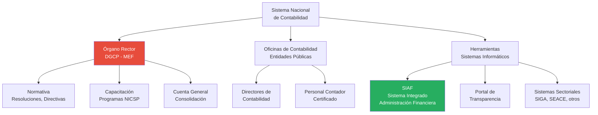
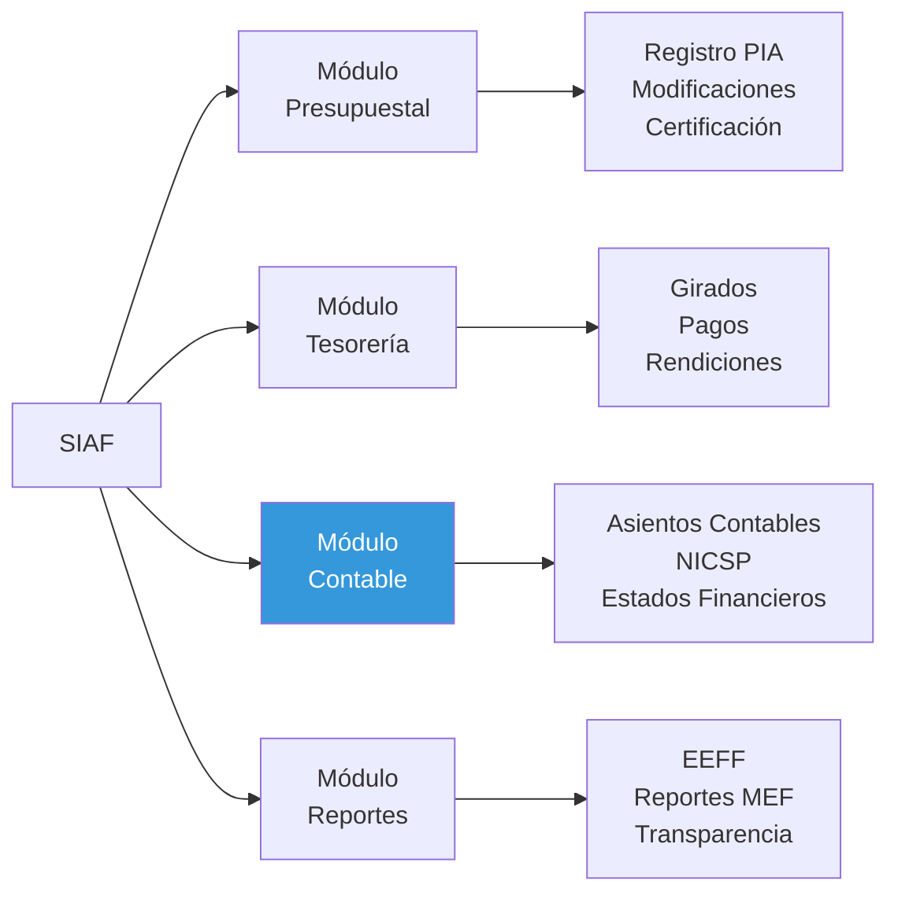
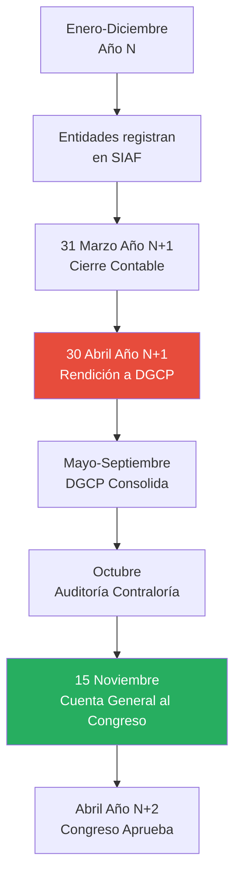

# Sistema de Contabilidad Gubernamental en Perú

## Resumen

El Sistema Nacional de Contabilidad en Perú es el conjunto de órganos, normas, procedimientos y sistemas informáticos que regulan el registro, procesamiento y presentación de la información financiera del sector público, liderado por la Dirección General de Contabilidad Pública (DGCP) e implementado principalmente a través del Sistema Integrado de Administración Financiera (SIAF).

## Definición / Texto Normativo

**Ley N° 28708 - Ley General del Sistema Nacional de Contabilidad (Art. 3°):**

> "El Sistema Nacional de Contabilidad es el conjunto de órganos, políticas, principios, normas y procedimientos de contabilidad de los sectores público y privado, de aceptación general y aplicados a las entidades y órganos que lo conforman y que contribuyen al cumplimiento de sus fines y objetivos."

**Objetivos del Sistema (Art. 4°):**

> "a) Armonizar y homogeneizar la contabilidad en los sectores público y privado mediante la aprobación de la normatividad contable;
>
> b) Elaborar la Cuenta General de la República a partir de las rendiciones de cuentas de las entidades del sector público;
>
> c) Elaborar y proporcionar información contable oportuna para la toma de decisiones en las entidades del sector público y del sector privado;
>
> d) Promover la eficacia y eficiencia en la utilización de los recursos públicos."

**Definición de Contabilidad Gubernamental (Art. 6°):**

> "La Contabilidad Gubernamental es el conjunto de principios, normas, procedimientos técnicos que permiten recopilar, valuar, procesar y exponer los hechos económicos y financieros que afectan o puedan llegar a afectar el patrimonio de las entidades del sector público."

## Desarrollo / Interpretación

### Estructura del Sistema Nacional de Contabilidad



### Órganos del Sistema Nacional de Contabilidad

**1. Órgano Rector: Dirección General de Contabilidad Pública (DGCP)**

Ubicación: Ministerio de Economía y Finanzas (MEF)

**Funciones principales (Ley 28708, Art. 11):**

a) **Regulación normativa:**

- Dictar normas de contabilidad (Resoluciones de Contaduría)
- Aprobar el Plan Contable Gubernamental
- Interpretar normativa contable nacional e internacional

b) **Consolidación financiera:**

- Elaborar la Cuenta General de la República
- Consolidar información de 2,267 entidades públicas
- Presentar al Congreso (antes del 15 de noviembre de cada año)

c) **Capacitación y asesoría:**

- Programa permanente de capacitación en NICSP
- Emitir consultas técnicas vinculantes
- Guías y manuales de implementación

d) **Supervisión:**

- Verificar cumplimiento de normativa contable
- Emitir alertas tempranas a entidades incumplidas
- Coordinación con Contraloría General

**Organización interna DGCP:**

- Dirección de Normatividad
- Dirección de Consolidación
- Dirección de Capacitación e Investigación
- Dirección del SIAF

**2. Órganos Descentralizados: Oficinas de Contabilidad**

Cada entidad pública debe contar con:

- **Oficina (o Dirección) de Contabilidad:** Unidad orgánica responsable del registro contable
- **Director de Contabilidad:** Profesional contador colegiado, con certificación NICSP
- **Personal contable:** Mínimo según tamaño de entidad

**Responsabilidades (Art. 16):**

- Registro oportuno de operaciones
- Preparación de estados financieros
- Rendición de cuentas a DGCP
- Coordinación con auditoría interna y externa

### Sistema Integrado de Administración Financiera (SIAF)

**Definición oficial (Manual SIAF):**

> "El SIAF es el sistema informático oficial para el registro, procesamiento y generación de la información financiera del Estado, que integra los procesos presupuestarios, de tesorería y contabilidad en las entidades del sector público."

**Historia del SIAF:**

| Año      | Versión                | Características                                        |
| -------- | ---------------------- | ------------------------------------------------------ |
| **1998** | SIAF 1.0               | Lanzamiento inicial, solo presupuesto                  |
| **2004** | SIAF-SP (Gastos)       | Módulo contable básico (efectivo)                      |
| **2012** | SIAF-GL (Ingresos)     | Módulo para gobiernos locales                          |
| **2019** | SIAF-RP NICSP          | Rediseño completo para contabilidad devengo bajo NICSP |
| **2024** | SIAF Cloud (en piloto) | Migración a plataforma web moderna                     |

**Módulos del SIAF (versión actual):**



**Flujo operativo integrado:**

1. **Presupuesto:** Se registra la asignación presupuestal (PIA: Presupuesto Institucional de Apertura)
2. **Compromiso:** Se compromete el gasto (ej. orden de compra)
3. **Devengado:** Se reconoce la obligación (ej. recepción de bien/servicio) → **Registro contable automático**
4. **Girado:** Se emite el pago (cheque, CCI)
5. **Pagado:** El banco confirma la transacción

**Automatización contable:**
El SIAF genera asientos contables bajo NICSP de manera **automática** a partir de transacciones presupuestales. Ejemplos:

**Caso:** Compra de computadoras por S/. 100,000

```
Fase Presupuestal          Asiento Contable Generado (NICSP)
-------------------        ------------------------------------
Compromiso:                (No genera asiento)
  Certificación S/. 100K

Devengado:                 Debe    Haber
  Recepción de bienes      Activo-Computadoras    100,000
                           Cuentas por Pagar              100,000

Girado:                    Cuentas por Pagar      100,000
  Emisión de cheque        Banco                          100,000
```

**Ventaja:** Contadores no necesitan generar manualmente asientos complejos; el sistema los crea siguiendo reglas de la DGCP.

### Plan Contable Gubernamental (PCG)

**Versión vigente:** Plan Contable Gubernamental 2019 (actualizado 2024)

**Estructura:**

El PCG peruano tiene **9 clases de cuentas:**

| Clase | Descripción                                    | Ejemplo                                                |
| ----- | ---------------------------------------------- | ------------------------------------------------------ |
| **1** | Activo Disponible y Exigible                   | 1101 Caja, 1201 Cuentas por Cobrar                     |
| **2** | Activo Realizable, Inmovilizado, Otros Activos | 1501 Propiedad Planta Equipo, 1601 Activos Intangibles |
| **3** | Pasivo Corriente                               | 2101 Cuentas por Pagar, 2301 Provisiones               |
| **4** | Pasivo No Corriente y Patrimonio               | 2401 Deuda Pública LP, 5000 Patrimonio                 |
| **5** | Ingresos Presupuestarios                       | 5101 Ingresos Tributarios, 5201 Donaciones             |
| **6** | Gastos Presupuestarios                         | 6101 Personal y Obligaciones Sociales                  |
| **7** | Ingresos de Gestión (Devengo)                  | 7101 Impuestos Devengados                              |
| **8** | Gastos de Gestión (Devengo)                    | 8101 Gasto Personal Devengado, 8201 Depreciación       |
| **9** | Cuentas de Orden                               | 9101 Bienes en custodia                                |

**Innovación post-NICSP:**

- Clases 1-4: Patrimoniales (Estado de Situación Financiera)
- Clases 5-6: Presupuestales (Comparación Presupuestal)
- Clases 7-8: De Gestión (Estado de Resultados/Gestión)
- Clase 9: Memorándum

Esta estructura permite **doble registro**: presupuestal + contable.

**Ejemplo integrado:**

Cuando se devenga un impuesto predial de S/. 10,000:

```
Registro Presupuestal (Clase 5):
5101 Ingresos Tributarios           10,000

Registro Contable de Gestión (Clase 7):
7101 Impuestos Devengados           10,000

Registro Patrimonial (Clase 1):
1201 Cuentas por Cobrar Tributos    10,000
```

El SIAF vincula automáticamente los tres registros.

### Cuenta General de la República

**Documento maestro del Sistema de Contabilidad Gubernamental:**

**Definición (Ley 28708, Art. 42):**

> "La Cuenta General de la República es el instrumento de gestión que contiene información y análisis de los resultados presupuestarios, financieros, económicos, patrimoniales y de cumplimiento de metas de las entidades del sector público durante un ejercicio fiscal."

**Contenido (bajo NICSP desde 2019):**

**I. Estados Financieros Consolidados:**

1. Estado de Situación Financiera
2. Estado de Gestión (Ingresos y Gastos devengados)
3. Estado de Cambios en el Patrimonio Neto
4. Estado de Flujos de Efectivo
5. Estado de Comparación de Presupuesto y Ejecución
6. Notas a los Estados Financieros (más de 100 páginas)

**II. Análisis de Resultados:**

- Análisis presupuestario (ingresos/gastos por función)
- Análisis financiero (ratios de liquidez, endeudamiento)
- Análisis de sostenibilidad fiscal
- Evolución de activos por tipo (infraestructura, equipos, intangibles)
- Pasivos contingentes y riesgos fiscales

**III. Información por Entidad:**

- Estados financieros individuales de 2,267 entidades
- Ranking de ejecución presupuestal por sector

**Plazo constitucional:**

- Presidente de la República debe remitir al Congreso antes del **15 de noviembre** del año siguiente
- Congreso tiene hasta abril del año subsiguiente para aprobar

**Acceso público:**
https://www.mef.gob.pe/es/cuenta-general-de-la-republica

### Proceso de Rendición de Cuentas

**Flujo anual:**



**Sanciones por incumplimiento:**

Si una entidad no rinde cuentas a tiempo:

- **Alerta DGCP:** Notificación de incumplimiento
- **Suspensión SIAF:** Bloqueo temporal del sistema
- **Responsabilidad administrativa:** Del Director de Contabilidad
- **Informe a Contraloría:** Para investigación

### Coordinación con Otros Sistemas Administrativos

El Sistema de Contabilidad se interrelaciona con:

1. **Sistema Nacional de Presupuesto Público:**
   - Órgano rector: Dirección General de Presupuesto Público (DGPP-MEF)
   - Integración: PIA, modificaciones presupuestales → SIAF → Contabilidad

2. **Sistema Nacional de Tesorería:**
   - Órgano rector: Dirección General del Tesoro Público (DGTP-MEF)
   - Integración: Operaciones bancarias → SIAF → Registro contable de efectivo

3. **Sistema Nacional de Control:**
   - Órgano rector: Contraloría General de la República
   - Integración: Auditoría de estados financieros producidos por Contabilidad

4. **Sistema Nacional de Abastecimiento:**
   - Órgano rector: Dirección General de Abastecimiento (MEF)
   - Integración: Compras públicas (SEACE) → Devengado → Contabilidad

**Principio de integración:** Los sistemas no deben duplicar información; comparten datos vía integraciones informáticas.

## Conexiones

- [[marco-legal-nacional-nicsp-peru]] - Base normativa del sistema contable
- [[modernizacion-marco-normativo-nicsp]] - Proceso de actualización del sistema
- [[base-devengado-sector-publico]] - Base contable implementada por el sistema desde 2019
- [[transparencia-rendicion-cuentas]] - Objetivo del sistema de contabilidad
- [[ipsasb-junta-normas]] - Normas internacionales adoptadas por el sistema peruano

## Ejemplos Resueltos

### Ejemplo 1: Flujo Integrado Presupuesto-Tesorería-Contabilidad (Básico)

**Situación:**
Un hospital público adquiere medicamentos por S/. 50,000. Traza el flujo completo desde el presupuesto hasta el registro contable.

**Solución paso a paso:**

**1. Fase Presupuestal (Compromiso):**

```
SIAF - Módulo Presupuestal:
  Asignación: 5.3.11.30 Medicamentos
  Monto comprometido: S/. 50,000
  Documento: Orden de Compra N° 001-2024
```

**2. Fase Contable (Devengado):**

```
Fecha: Recepción de medicamentos (verificado por almacén)

SIAF - Módulo Contable (generación automática):

  Debe                              Haber
  1401 Inventarios - Medicamentos  50,000
      2101 Cuentas por Pagar               50,000

  [Registro patrimonial]

  6301 Gasto Presupuestal Bienes    50,000
      5301 Ingreso por Bienes              50,000

  [Registro presupuestal]
```

**3. Fase Tesorería (Girado/Pagado):**

```
SIAF - Módulo Tesorería:
  Cheque N° 1234 emitido: S/. 50,000

  Asiento automático:

  Debe                        Haber
  2101 Cuentas por Pagar      50,000
      1101 Banco                    50,000
```

**4. Consumo de Medicamentos (mes siguiente):**

```
Cuando se entregan a pacientes:

  Debe                              Haber
  8301 Gasto de Gestión - Medicamentos  50,000
      1401 Inventarios - Medicamentos          50,000
```

**Resultado final en estados financieros:**

- **Estado de Situación Financiera:** Inventario S/. 0 (consumido), Banco disminuyó S/. 50,000
- **Estado de Gestión:** Gasto de Medicamentos S/. 50,000
- **Estado de Comparación Presupuestal:** Ejecución S/. 50,000 en partida 5.3.11.30

### Ejemplo 2: Consolidación en Cuenta General (Avanzado)

**Caso:**
La DGCP debe consolidar estados financieros de 3 entidades del sector salud para la Cuenta General de la República 2023.

**Datos individuales:**

| Entidad                     | Activos | Pasivos | Cuentas por Cobrar Inter-gubernamentales | Cuentas por Pagar Inter-gubernamentales |
| --------------------------- | ------- | ------- | ---------------------------------------- | --------------------------------------- |
| Ministerio de Salud (MINSA) | 80,000  | 30,000  | 5,000 (de ESSALUD)                       | 0                                       |
| ESSALUD                     | 120,000 | 60,000  | 0                                        | 5,000 (a MINSA)                         |
| Instituto Nacional de Salud | 20,000  | 8,000   | 2,000 (de MINSA)                         | 0                                       |

**Proceso de consolidación:**

**Paso 1:** Sumar estados individuales

```
Activos totales: 80,000 + 120,000 + 20,000 = 220,000
Pasivos totales: 30,000 + 60,000 + 8,000 = 98,000
```

**Paso 2:** Eliminar transacciones inter-gubernamentales (evitar doble conteo)

```
Cuentas por cobrar inter-gubern.: 5,000 + 2,000 = 7,000
Cuentas por pagar inter-gubern.: 5,000

Ajuste de consolidación:
  Eliminar: 5,000 (se cancelan mutuamente)
  Diferencia: 2,000 (del INS a MINSA) - se mantiene si no se confirmó

Ajuste neto: -5,000 activos, -5,000 pasivos
```

**Paso 3:** Estado Consolidado del Sector Salud

```
Activos Consolidados: 220,000 - 5,000 = 215,000
Pasivos Consolidados: 98,000 - 5,000 = 93,000
Patrimonio Neto Consolidado: 215,000 - 93,000 = 122,000
```

**Lección:** La consolidación elimina transacciones entre entidades del mismo sector para evitar inflar cifras del Estado.

## Ejercicios Propuestos

### Ejercicio 1: Identificación de Órganos (Básico)

Completa la tabla identificando el órgano responsable:

| Función                                            | Órgano del Sistema |
| -------------------------------------------------- | ------------------ |
| Emitir Resoluciones de Contaduría                  |                    |
| Aprobar el Plan Contable Gubernamental             |                    |
| Registrar transacciones contables de un ministerio |                    |
| Elaborar la Cuenta General de la República         |                    |
| Auditar estados financieros del sector público     |                    |
| Operar el Sistema SIAF                             |                    |

### Ejercicio 2: Análisis del SIAF (Intermedio)

Accede al Portal de Transparencia Económica del MEF (https://apps5.mineco.gob.pe/transparencia/) y:

1. Selecciona una entidad del gobierno nacional (ej. Ministerio de Educación)
2. Descarga el reporte de "Ejecución Presupuestal" y "Estados Financieros" del último año disponible
3. Compara:
   - Presupuesto Asignado vs Ejecutado (%)
   - Activos totales vs Pasivos totales
   - Principales cuentas de gasto

4. Elabora un informe de 300 palabras respondiendo:
   - ¿La entidad ejecutó eficientemente su presupuesto?
   - ¿Su posición financiera es sólida (activos > pasivos)?
   - ¿Qué información del SIAF permitió este análisis?

### Ejercicio 3: Diseño de Mejora del Sistema (Avanzado)

**Escenario:**
Eres consultor contratado por la DGCP para mejorar la "transparencia activa" del sistema de contabilidad gubernamental.

**Problema identificado:**
Aunque la Cuenta General de la República está disponible en línea, tiene más de 800 páginas en PDF, lo que dificulta el acceso ciudadano a información específica.

**Tarea:**
Diseña una propuesta de "Portal Ciudadano de Contabilidad Pública" (1,000 palabras) que incluya:

1. **Objetivo y usuarios:** ¿A quiénes debe dirigirse? (ciudadanos, periodistas, investigadores, legisladores)

2. **Funcionalidades clave:** Mínimo 5 funcionalidades interactivas (ej. visualizaciones, comparadores, búsqueda por entidad, descarga de datos abiertos)

3. **Información a presentar:** Selecciona 10 indicadores clave que deberían ser visibles en el dashboard principal (ej. Deuda/PBI, Activos por habitante, Ejecución presupuestal por sector)

4. **Arquitectura técnica:** ¿Cómo se integra con el SIAF existente? ¿Actualización en tiempo real o periódica?

5. **Casos de uso:** Describe 3 escenarios de uso concretos (ej. "Ciudadano quiere saber cuánto gastó su municipalidad en educación", "Periodista investiga crecimiento de deuda pública")

6. **Costos y riesgos:** Estimación cualitativa de inversión y principales riesgos de implementación

## Preguntas Bloom

**Nivel 1 - Recordar:** ¿Cuál es el órgano rector del Sistema Nacional de Contabilidad en Perú y qué ministerio lo alberga?

**Nivel 2 - Comprender:** Explica con tus propias palabras cómo el SIAF integra los procesos de presupuesto, tesorería y contabilidad en un solo sistema.

**Nivel 3 - Aplicar:** Una municipalidad distrital debe registrar la compra de una motoniveladora por S/. 500,000. Aplica el flujo del SIAF para generar los asientos contables desde el compromiso hasta el pago.

**Nivel 4 - Analizar:** Compara el sistema de contabilidad gubernamental de Perú (centralizado en SIAF) versus un sistema descentralizado donde cada entidad usa software independiente. Analiza ventajas y desventajas en términos de: (1) consolidación, (2) control, (3) flexibilidad, (4) costos.

**Nivel 5 - Evaluar:** La Cuenta General de la República 2023 muestra que los Activos del Estado peruano son S/. 800,000 millones, pero los Pasivos son S/. 600,000 millones (Patrimonio Neto: S/. 200,000 millones positivo). Algunos economistas argumentan que estas cifras son "artificiales" porque incluyen activos sin mercado (ej. carreteras, escuelas). Evalúa: ¿Es relevante conocer el patrimonio neto del Estado? ¿Para qué decisiones sirve esta información?

**Nivel 6 - Crear:** Diseña un "módulo de Contabilidad Ambiental" para el SIAF que permita registrar: (1) activos ambientales (bosques, reservas de agua), (2) pasivos ambientales (sitios contaminados, compromisos de remediación), (3) gastos de protección ambiental. Incluye: (a) cuentas contables propuestas (extensión del PCG), (b) fuente de información (¿quién mide los activos/pasivos?), (c) conexión con NICSP existentes, (d) utilidad para decisiones públicas. Extensión: 800 palabras.

## Base Normativa

**Normas Primarias:**

1. **Ley N° 28708 - Ley General del Sistema Nacional de Contabilidad (2006).** Título II (Arts. 8-20): Sistema Nacional de Contabilidad. Título IV (Arts. 41-44): Cuenta General de la República.

2. **Decreto Supremo N° 304-2012-EF (21 de diciembre de 2012).** Reglamento de la Ley N° 28708.

3. **Resolución de Contaduría N° 011-2018-EF/30 (20 de diciembre de 2018).** Oficialización del Plan Contable Gubernamental 2019 y adopción de NICSP.

4. **Directiva N° 001-2019-EF/51.01 (aprobada por R.D. N° 003-2019-EF/51.01).** "Preparación y Presentación de Información Financiera y Presupuestaria del Sector Público".

**Normas sobre SIAF:**

5. **Resolución Directoral N° 026-2018-EF/50.01 (30 de noviembre de 2018).** "Aprobación de la Directiva del SIAF-SP Versión NICSP".

6. **Manual de Usuario SIAF-RP (Registro y Procesamiento) - Versión 2019.** Ministerio de Economía y Finanzas - DGCP.

**Documentos Técnicos:**

7. **Plan Contable Gubernamental 2019 (actualizado 2024).** Disponible en: https://www.mef.gob.pe/es/plan-contable-gubernamental

8. **Manual de Contabilidad Gubernamental (2020).** DGCP-MEF. Guías de aplicación por tipo de transacción.

## Referencias Bibliográficas y Recursos en Línea

**Sitios Oficiales:**

- **Dirección General de Contabilidad Pública:** https://www.mef.gob.pe/es/contabilidad-publica
  - Normativa completa
  - Plan Contable Gubernamental
  - Manuales del SIAF

- **Cuenta General de la República:** https://www.mef.gob.pe/es/cuenta-general-de-la-republica
  - Estados financieros consolidados del sector público (2019-2023)

- **Portal de Transparencia Económica:** https://apps5.mineco.gob.pe/transparencia/
  - Consulta de ejecución presupuestal y estados financieros por entidad
  - Datos abiertos en Excel

- **SIAF - Sistema de Capacitación:** https://apps2.mef.gob.pe/capacitaciones/
  - Tutoriales de uso del SIAF
  - Cursos sobre PCG y NICSP

**Literatura Técnica Nacional:**

- Ministerio de Economía y Finanzas (2019). "Sistema Integrado de Administración Financiera: Manual de Usuario SIAF-RP Versión NICSP". Lima: MEF-DGCP.

- Alvarado, J., & Tupia, N. (2020). "El SIAF como Herramienta de Implementación de NICSP en Perú". _Contabilidad y Negocios_, 15(29), 23-45.

- Quispe, R., & Mamani, L. (2021). "Evaluación del Sistema Nacional de Contabilidad post-NICSP: El Caso Peruano". _Quipukamayoc_, 29(59), 45-62.

**Estudios de Organismos Internacionales:**

- Banco Mundial (2018). "Peru: Public Financial Management Performance Report". Washington: World Bank. [Incluye evaluación del sistema SIAF]

- BID (2020). "Sistemas de Administración Financiera en América Latina: El Caso del SIAF Peruano". Washington: Banco Interamericano de Desarrollo.

**Recursos Multimedia:**

- MEF - Canal YouTube: Serie "Aprende SIAF" (24 videos tutoriales). Disponible en: https://www.youtube.com/@MinisterioEconomiaFinanzasPeru

- Contraloría General de la República (2021). Webinar: "Auditoría de Estados Financieros bajo SIAF-NICSP". [Video de 90 minutos con casos prácticos]

## Notas y Alertas

> **⚠️ SIAF es Obligatorio:** Todas las entidades del sector público en Perú (salvo empresas públicas con sistemas privados autorizados) **deben** usar el SIAF para registro presupuestal, tesorería y contabilidad. No pueden usar sistemas alternativos sin autorización expresa de la DGCP.

> **📌 Doble Registro:** El sistema peruano mantiene registro **presupuestal** (base efectivo modificado) y registro **contable** (base devengo NICSP) simultáneamente. El SIAF vincula automáticamente ambos, pero son conceptualmente distintos. Presupuesto ≠ Contabilidad.

> **💡 Transparencia en Tiempo Real:** Aunque la Cuenta General se publica una vez al año, el Portal de Transparencia Económica actualiza información presupuestal y financiera **semanalmente** (con desfase de 3-5 días), permitiendo seguimiento casi en tiempo real del gasto público.

> **🌍 Reconocimiento Internacional:** El SIAF peruano es considerado uno de los más avanzados de América Latina. Ha sido replicado (con adaptaciones) en Paraguay, El Salvador y República Dominicana. El Banco Mundial lo cita como "buena práctica" en gestión financiera pública.

> **🔍 Para Profundizar:** Si te interesa el impacto del SIAF en la reducción de corrupción, consulta: Cueva, J., & Vásquez, A. (2019). "Sistemas Integrados de Administración Financiera y Control de la Corrupción: Evidencia del Caso Peruano". _Economía y Sociedad_, 24(56), 78-102. [Demuestra que el SIAF redujo irregularidades en pagos y contrataciones]

> **⚙️ Limitación Técnica Actual:** El SIAF fue diseñado en tecnología legacy (cliente-servidor). Aunque funciona eficientemente, su interfaz no es intuitiva y requiere capacitación extensa. La DGCP está desarrollando "SIAF Cloud" (2024-2026) con interfaz web moderna y mayor usabilidad.

---

<div style="text-align: center;">
<a href="https://notbyai.fyi">

</a>
</div>
