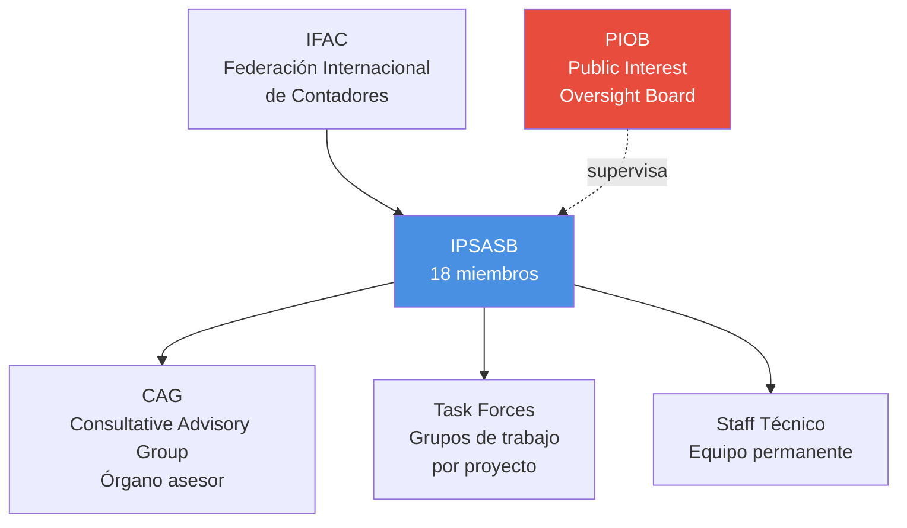

# IPSASB - Consejo de Normas Internacionales de Contabilidad del Sector Público

## Resumen

El IPSASB (International Public Sector Accounting Standards Board) es el organismo independiente emisor de las Normas Internacionales de Contabilidad del Sector Público (NICSP/IPSAS), operando bajo el marco de la Federación Internacional de Contadores (IFAC) desde 2004.

## Definición / Texto Normativo

**Definición oficial (IFAC):** El IPSASB es un organismo normalizador independiente que desarrolla normas de contabilidad de alta calidad para uso de entidades del sector público en todo el mundo en la preparación de estados financieros con propósito general.

**Marco legal:** Según los Términos de Referencia del IPSASB (última actualización 2022):

> "El IPSASB tiene como misión servir al interés público desarrollando estándares de información financiera de alta calidad y otra orientación para uso de las entidades del sector público en todo el mundo, mejorando así la calidad y transparencia de las finanzas públicas y la rendición de cuentas." (IPSASB Terms of Reference, sección 1.1)

## Desarrollo / Interpretación

### Estructura Organizacional

### Composición del IPSASB

**Miembros (2024):**

- **18 miembros** designados por 3 años (renovables)
- Representación geográfica equilibrada:
  - 4-5 miembros: Américas
  - 4-5 miembros: Europa
  - 4-5 miembros: Asia-Pacífico
  - 2-3 miembros: África
  - 1-2 miembros: Medio Oriente
- Requisitos: Experiencia en contabilidad sector público, auditoría gubernamental, o académicos especializados
- **Presidente (Chair):** Rol rotativo, lidera reuniones y representa al IPSASB

**Consultative Advisory Group (CAG):**

- ~40 organizaciones observadoras
- Incluye: FMI, Banco Mundial, OCDE, Naciones Unidas, Tribunal de Cuentas Europeo
- Función: Retroalimentación sobre proyectos en desarrollo

### Proceso de Emisión de Nicsp

**Fases del debido proceso (Due Process):**

1. **Identificación del tema** (3-6 meses)
   - Análisis de necesidades
   - Consulta al CAG
   - Aprobación de inclusión en agenda

2. **Desarrollo conceptual** (6-12 meses)
   - Investigación técnica
   - Análisis comparativo con NIIF
   - Consideración de particularidades sector público

3. **Borrador de consulta (Exposure Draft)** (6-9 meses)
   - Publicación para comentario público
   - Periodo de consulta: mínimo 120 días
   - Audiencias públicas (roundtables)

4. **Análisis de comentarios** (3-6 meses)
   - Revisión de respuestas
   - Re-deliberaciones del IPSASB
   - Modificaciones al borrador

5. **Emisión de la norma final** (1-3 meses)
   - Aprobación por 2/3 de miembros (12 de 18)
   - Publicación oficial
   - Materiales de implementación

**Tiempo total promedio:** 18-36 meses por norma

### Criterios de Elaboración de Normas

El IPSASB sigue tres enfoques para desarrollar NICSP:

**A. Convergencia con NIIF**

- Base: Norma NIIF existente
- Adaptaciones: Características específicas sector público
- Ejemplo: IPSAS 16 (Propiedades de Inversión) basada en NIC 40
- Ventaja: Aprovechar consenso técnico previo

**B. Desarrollo independiente**

- Temas sin equivalente en sector privado
- Ejemplo: IPSAS 23 (Ingresos de transacciones sin contraprestación - impuestos)
- IPSAS 42 (Beneficios sociales)
- Requiere: Investigación original extensiva

**C. Mejoras periódicas**

- Revisión de NICSP existentes
- Corrección de inconsistencias
- Ejemplo: Proyecto "Improvements to IPSAS" (ciclos 2019, 2021, 2023)

### Gobernanza y Supervisión

**Independencia operativa:**

- El IPSASB toma decisiones técnicas de manera independiente
- IFAC proporciona soporte administrativo y financiero
- No recibe instrucciones de gobiernos o entidades particulares

**Supervisión pública:**

- PIOB (Public Interest Oversight Board) supervisa el debido proceso
- Verifica transparencia y equilibrio de intereses
- No interviene en decisiones técnicas específicas

### Financiamiento

**Fuentes (2024):**

- Contribuciones voluntarias de organizaciones internacionales (FMI, Banco Mundial, OCDE)
- Aportes de firmas de auditoría (Big 4 y otras)
- Donaciones de gobiernos (Australia, Nueva Zelanda, Suiza, etc.)
- Presupuesto anual: ~USD 3-4 millones

**Transparencia:** Todos los ingresos y gastos se publican en el Annual Report del IFAC.

## Conexiones

- [[antecedentes-historicos-nicsp]] - Evolución desde PSC (1986) hasta IPSASB (2004)
- [[marco-conceptual-nicsp]] - El IPSASB desarrolló el Marco Conceptual (2014)
- [[modernizacion-marco-normativo-nicsp]] - Agenda de proyectos actuales
- [[diferencias-nicsp-niif]] - Criterios de divergencia aplicados por el IPSASB
- [[objetivos-estados-financieros-sector-publico]] - Establecidos por el IPSASB en el Marco Conceptual

## Ejemplos Resueltos

### Ejemplo 1: Proceso de Consulta (Básico)

**Situación:** En 2021, el IPSASB publicó el borrador de consulta de IPSAS 44 "Transferencias No Contractuales". ¿Quiénes pudieron enviar comentarios?

**Respuesta:**
Cualquier persona u organización interesada puede enviar comentarios durante el periodo de consulta pública. En el caso de IPSAS 44:

- Periodo de consulta: 120 días (4 meses)
- Respondientes típicos:
  - Contadurías generales de gobiernos nacionales
  - Firmas de auditoría
  - Académicos especializados
  - ONGs fiscalizadoras (ej. International Budget Partnership)
  - Organismos internacionales (FMI, OCDE)

**Datos reales:** El borrador de IPSAS 44 recibió 68 cartas de comentarios de 38 países diferentes. El IPSASB publicó un documento "Basis for Conclusions" explicando cómo consideró cada comentario significativo.

### Ejemplo 2: Votación para Aprobar Norma (Avanzado)

**Caso:** En la reunión de septiembre 2023, el IPSASB votó sobre la versión final de una mejora a IPSAS 17 (Propiedad, Planta y Equipo). De los 18 miembros:

- 14 votaron a favor
- 3 votaron en contra
- 1 se abstuvo por conflicto de interés

**Pregunta:** ¿La norma fue aprobada?

**Análisis:**

- Requisito: 2/3 de los miembros = 12 votos (2/3 de 18)
- Votos a favor: 14
- 14 > 12 → ✅ **APROBADA**

**Consecuencias:**

1. La norma se publica en el IPSAS Handbook
2. Los 3 miembros disidentes pueden publicar "dissenting opinions" (opiniones en contra) explicando su postura
3. Estas opiniones se incluyen como apéndice en la norma final
4. La norma entra en vigor en la fecha establecida (típicamente 1-2 años después)

**Transparencia:** Todas las actas de votación son públicas en el sitio del IPSASB.

## Ejercicios Propuestos

### Ejercicio 1: Estructura Organizacional (Básico)

Completa el siguiente crucigrama organizacional:

1. Siglas del organismo que supervisa al IPSASB en interés público: \_\_ \_\_ \_\_ \_\_
2. Cantidad de miembros del IPSASB: \_\_ \_\_
3. Federación que alberga administrativamente al IPSASB: \_\_ \_\_ \_\_ \_\_
4. Grupo asesor que incluye organismos internacionales: \_\_ \_\_ \_\_
5. Mínimo de días para consulta pública de un borrador: \_\_ \_\_ \_\_

### Ejercicio 2: Análisis de Caso Real (Intermedio)

Visita el sitio oficial del IPSASB (www.ipsasb.org) y:

1. Identifica un proyecto actualmente en fase de "Exposure Draft"
2. Descarga el documento y revisa el "Basis for Conclusions"
3. Elabora un resumen de 200 palabras sobre:
   - ¿Qué problema busca resolver la norma propuesta?
   - ¿Existen divergencias significativas con NIIF? ¿Cuáles?
   - Fecha límite para enviar comentarios

### Ejercicio 3: Simulación de Decisión (Avanzado)

Eres miembro del IPSASB y debes decidir sobre un dilema:

**Escenario:**
Un gobierno de un país grande propone que el IPSASB permita una exención especial para no reconocer pasivos por pensiones de militares en entidades de defensa, argumentando "seguridad nacional". Esta posición contradice IPSAS 39 (Beneficios a Empleados).

El CAG está dividido: el FMI se opone a la exención, pero 5 gobiernos la apoyan.

**Tarea:**
Escribe un voto fundamentado de 400 palabras donde:

1. Declares tu posición (a favor o en contra de la exención)
2. Justifiques tu voto con al menos 3 argumentos técnicos
3. Consideres las implicaciones para la comparabilidad internacional
4. Abordes el equilibrio entre flexibilidad nacional vs estandarización global

## Preguntas Bloom

**Nivel 1 - Recordar:** ¿En qué año el PSC se transformó en IPSASB y cuántos miembros tiene actualmente?

**Nivel 2 - Comprender:** Explica la diferencia entre el rol del IPSASB y el rol del PIOB en el ecosistema de las NICSP.

**Nivel 3 - Aplicar:** Si fueras el Contador General de la Nación de Perú y el IPSASB publicara un borrador de consulta sobre reconocimiento de recursos naturales, ¿qué pasos seguirías para enviar comentarios oficiales?

**Nivel 4 - Analizar:** Compara el proceso de emisión de normas del IPSASB (18-36 meses, consulta pública obligatoria) versus una ley tributaria nacional (aprobación legislativa rápida sin consulta técnica). ¿Qué ventajas y desventajas tiene cada enfoque?

**Nivel 5 - Evaluar:** Algunos críticos argumentan que el IPSASB tiene "sesgo occidental" porque la mayoría de miembros provienen de países desarrollados. Evalúa esta crítica considerando: (1) composición geográfica actual, (2) mecanismo de consulta pública, (3) participación del CAG.

**Nivel 6 - Crear:** Diseña una propuesta para crear un "IPSASB Regional para América Latina" que adapte NICSP al contexto regional. Incluye: (1) composición, (2) fuentes de financiamiento, (3) relación con el IPSASB global, (4) ventajas vs riesgos de fragmentación normativa.

## Base Normativa

**Documentos Constitutivos:**

- IFAC (2022). "IPSASB Terms of Reference". Nueva York: IFAC. [Versión oficial que establece mandato y procedimientos]
- IPSASB (2023). "Due Process and Working Procedures". [Guía operativa del proceso normativo]

**Normas Relevantes:**

- Preface to International Public Sector Accounting Standards (actualizado 2023)
- IPSASB Strategy and Work Plan 2024-2028

**Supervisión:**

- PIOB (2024). "Activity Report 2023". [Evaluación de supervisión del IPSASB]
- IFAC (2024). "Transparency and Accountability Report". [Incluye información del IPSASB]

**Literatura de Análisis:**

- Benito, B., et al. (2007). "The Role of IPSASB in Harmonizing Government Accounting". _International Review of Administrative Sciences_, 73(2), 293-317.
- Caperchione, E., & Mussari, R. (2014). "Governance and Integration in Public Financial Management Reform". _Public Finance and Management_, 14(4), 386-419.

## Referencias Bibliográficas y Recursos en Línea

**Sitio Oficial y Documentos:**

- IPSASB: https://www.ipsasb.org/
- IPSASB Handbook (descarga gratuita): https://www.ipsasb.org/publications-resources
- Exposure Drafts activos: https://www.ipsasb.org/current-projects
- Actas de reuniones (Meeting Summaries): https://www.ipsasb.org/meetings

**Supervisión y Gobernanza:**

- PIOB: https://www.piob.org/
- IFAC Governance: https://www.ifac.org/who-we-are/governance

**Comentarios y Consultas:**

- IPSASB Comment Letters Database: https://www.ipsasb.org/consultations-past
- CAG Member List: https://www.ipsasb.org/who-we-are/consultative-advisory-group

**Recursos Educativos:**

- IPSASB Webinar Series (gratuito, en inglés)
- IPSAS Implementation Guide (por norma)
- Staff Q&A (respuestas a consultas técnicas frecuentes)

**Literatura Secundaria:**

- PwC: "Public Sector Accounting under IPSAS" (guía técnica actualizada anualmente)
- Deloitte: "IPSAS in Your Pocket" (resumen ejecutivo de todas las normas)

## Notas y Alertas

> **⚠️ Aclaración Importante:** El IPSASB **emite normas**, pero **NO obliga a adoptarlas**. Cada país decide soberanamente si adopta NICSP, cuándo y en qué alcance. El IPSASB no tiene poder sancionador.

> **📌 Diferencia Clave:** IPSASB ≠ IASB (International Accounting Standards Board). El IASB emite NIIF para el sector privado; el IPSASB emite NICSP para el sector público. Ambos son organismos independientes, aunque coordinan cuando hay temas comunes.

> **💡 Transparencia Radical:** Todas las reuniones del IPSASB son públicas y transmitidas en vivo. Cualquier persona puede asistir virtualmente. Las grabaciones y materiales de reunión se publican en el sitio oficial en un plazo de 2 semanas.

> **🌍 Diversidad Geográfica:** Aunque el IPSASB tiene su secretaría en Nueva York (EE.UU.), deliberadamente realiza 1-2 reuniones anuales fuera de América del Norte (ej. reuniones en Asia, Europa, África) para facilitar participación regional.

> **🔍 Para Profundizar:** Si te interesa la crítica académica sobre la legitimidad del IPSASB como emisor de normas "globales", consulta: Caperchione, E. (2015). "Standard Setting in the Public Sector: State of the Art". En "The Routledge Companion to Accounting in Emerging Economies", pp. 421-438.

---

