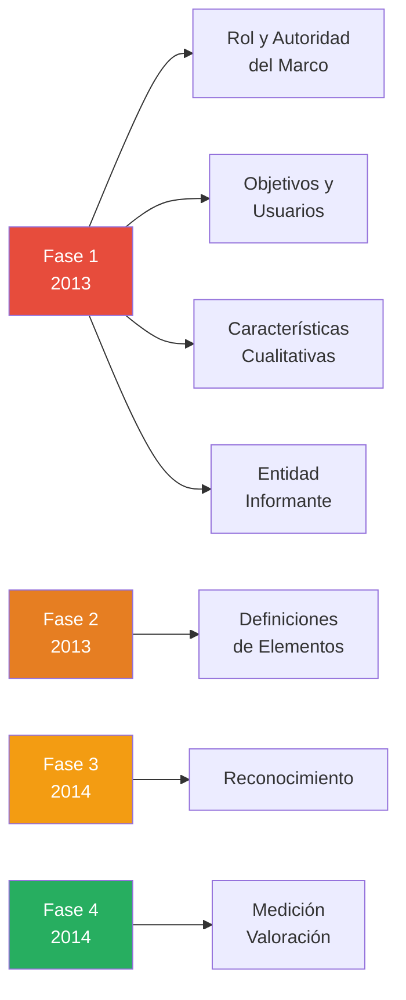
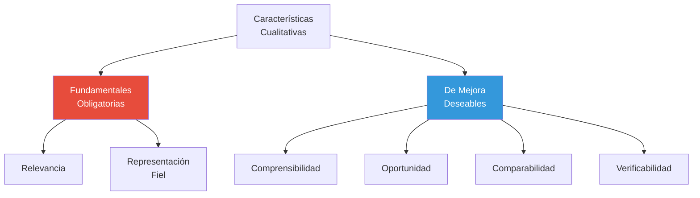

# Marco Conceptual de las NICSP

## Resumen

El Marco Conceptual para la Información Financiera con Propósito General de las Entidades del Sector Público es el fundamento teórico que establece los conceptos subyacentes a las NICSP, publicado por el IPSASB en fases entre 2013-2014, proporcionando la base para el desarrollo coherente de normas contables gubernamentales.

## Definición / Texto Normativo

**Definición oficial (IPSASB, 2014):**

> "El Marco Conceptual establece los conceptos que el IPSASB aplicará al desarrollar las NICSP y las Guías de Práctica Recomendada (RPG). Proporciona una base para que el IPSASB desarrolle normas que presenten información útil para los usuarios y apoye a los preparadores, auditores y usuarios de los estados financieros con propósito general en la interpretación de esas normas." (Marco Conceptual, Capítulo 1, párrafo 1.1)

**Alcance legal:**
El Marco Conceptual **NO es una norma** en sí misma. Su función es:

1. Guiar al IPSASB en el desarrollo de nuevas NICSP
2. Ayudar a preparadores en casos no cubiertos explícitamente por normas específicas
3. Asistir a auditores en evaluar conformidad con NICSP
4. Apoyar a usuarios en interpretar información financiera del sector público

**Jerarquía normativa:** Si hay conflicto entre el Marco Conceptual y una NICSP específica, **prevalece la NICSP**.

## Desarrollo / Interpretación

### Estructura del Marco Conceptual

El Marco Conceptual se organizó en 4 fases de desarrollo (2013-2014):

### Capítulo 1: Rol y Autoridad del Marco Conceptual

**Propósito principal:**
Proporcionar un sistema coherente de conceptos interrelacionados que:

- Aseguren consistencia entre NICSP
- Reduzcan interpretaciones alternativas
- Aumenten comparabilidad internacional

**Limitaciones explícitas:**

- No anula ninguna NICSP específica
- No es una guía de implementación práctica
- No aborda presentación de estados financieros (tema de IPSAS individuales)

### Capítulo 2: Objetivos y Usuarios de la Información Financiera

**Objetivo primario (párrafo 2.1):**

> "Proporcionar información financiera sobre la entidad informante que sea útil a los usuarios de los informes financieros con propósito general (IFPG) para rendición de cuentas y toma de decisiones."

**Usuarios principales identificados:**

| Usuario                         | Necesidad de información                            |
| ------------------------------- | --------------------------------------------------- |
| Legisladores (Congreso)         | Aprobación y fiscalización del presupuesto          |
| Ciudadanos y contribuyentes     | Rendición de cuentas sobre uso de recursos públicos |
| Organismos de crédito (FMI, BM) | Evaluación de sostenibilidad fiscal                 |
| Analistas y medios              | Transparencia y análisis de gestión pública         |
| Proveedores y acreedores        | Capacidad de pago del gobierno                      |
| Organizaciones sociales         | Fiscalización ciudadana                             |

**Diferencia clave con sector privado:**

- Sector privado: Objetivo primario es información para **inversores y acreedores** (decisión de inversión)
- Sector público: Objetivo primario es **rendición de cuentas democrática** (accountability)

### Capítulo 3: Características Cualitativas de la Información

**Clasificación:**

**Características fundamentales:**

1. **Relevancia** (párrafo 3.8-3.15)
   - Información es relevante si influye en las decisiones de los usuarios
   - Incluye: valor predictivo + valor confirmatorio
   - Umbral de materialidad: información es material si su omisión o error puede influir en decisiones

2. **Representación fiel** (párrafo 3.16-3.22)
   - Completitud: incluye toda información necesaria para comprensión
   - Neutralidad: sin sesgos para lograr resultado predeterminado
   - Libre de error: no significa exactitud perfecta, sino proceso riguroso sin errores en descripción

**Características de mejora:**

- **Comprensibilidad:** Usuarios con conocimiento razonable deben entender la información
- **Oportunidad:** Información disponible a tiempo para influir en decisiones
- **Comparabilidad:** Permite identificar similitudes y diferencias entre entidades o periodos
- **Verificabilidad:** Observadores independientes pueden llegar a consenso sobre representación fiel

**Restricción dominante:** **Costo-Beneficio**

- Los beneficios de la información deben justificar los costos de producirla
- Evaluación cualitativa, no cuantitativa estricta

### Capítulo 4: Entidad Informante

**Definición (párrafo 4.2):**

> "Una entidad informante es una entidad del sector público para la cual existen usuarios que dependen de los informes financieros con propósito general (IFPG) de la entidad para obtener información que les será útil para rendición de cuentas y toma de decisiones."

**Tipos de entidades identificadas:**

1. **Gobierno como un todo** (whole of government)
   - Incluye: poderes ejecutivo, legislativo, judicial
   - Ejemplo: Estados Financieros de la República del Perú

2. **Entidades económicas** (economic entity)
   - Entidad controladora + entidades controladas
   - Requiere consolidación
   - Ejemplo: Ministerio de Salud + hospitales + institutos dependientes

3. **Entidades individuales**
   - Opera independientemente
   - Ejemplo: Universidad Nacional Mayor de San Marcos

**Criterio de consolidación:** **Control**

- Poder sobre la entidad
- Exposición a beneficios variables
- Capacidad de usar poder para afectar beneficios

### Capítulo 5: Elementos de los Estados Financieros

**Definiciones fundamentales:**

| Elemento                               | Definición (Marco Conceptual)                                                                                                                            |
| -------------------------------------- | -------------------------------------------------------------------------------------------------------------------------------------------------------- |
| **Activo**                             | Recurso controlado presentemente por la entidad como resultado de un evento pasado (párrafo 5.6)                                                         |
| **Pasivo**                             | Obligación presente derivada de eventos pasados, cuya liquidación se espera resulte en salida de recursos (párrafo 5.14)                                 |
| **Ingreso**                            | Incremento en activos netos durante el periodo contable (párrafo 5.24)                                                                                   |
| **Gasto**                              | Disminución en activos netos durante el periodo contable (párrafo 5.30)                                                                                  |
| **Contribuciones de los propietarios** | Flujos de entrada de recursos a la entidad, aportados por partes externas que establecen o incrementan un derecho sobre los activos netos (párrafo 5.34) |
| **Distribuciones a los propietarios**  | Flujos de salida de recursos de la entidad, distribuidos a partes externas que devuelven o reducen un derecho sobre los activos netos (párrafo 5.37)     |

**Nota crítica para sector público:**
Los últimos dos elementos (contribuciones/distribuciones a propietarios) tienen aplicación **limitada** en gobierno, excepto en:

- Empresas públicas (ej. Petroperú)
- Entidades con estructura de capital definida

### Capítulo 6: Reconocimiento en Estados Financieros

**Criterios de reconocimiento (párrafo 6.5):**

Un elemento se reconoce en estados financieros si:

1. **Cumple la definición** de un elemento (Capítulo 5)
2. **Genera información relevante** sobre el elemento
3. **La medición es suficientemente fiel** y el costo no excede los beneficios

**Aplicación a ingresos sin contraprestación (caso típico sector público):**

Impuestos se reconocen cuando:

- El evento imponible ha ocurrido (ej. generación de renta gravable)
- La entidad tiene derecho exigible al recurso
- Es probable la entrada de recursos
- La cantidad puede medirse de manera confiable

**Diferencia con sector privado:** El sector público reconoce muchos ingresos **antes** de recibirlos en efectivo (base devengo), pero **no** al momento de aprobación presupuestal.

### Capítulo 7: Medición de Activos y Pasivos

**Bases de medición disponibles:**

| Base                      | Descripción                                                   | Aplicación típica en sector público      |
| ------------------------- | ------------------------------------------------------------- | ---------------------------------------- |
| **Costo histórico**       | Costo de adquisición/construcción                             | Propiedad, planta y equipo general       |
| **Valor razonable**       | Precio en transacción ordenada entre participantes de mercado | Inversiones financieras, ciertos activos |
| **Costo de cumplimiento** | Costo de cumplir una obligación                               | Pasivos por provisiones ambientales      |
| **Costo de liberación**   | Cantidad que se requiere para liberarse de un pasivo          | Pasivos por garantías                    |
| **Valor en uso**          | Valor presente del servicio potencial o capacidad operativa   | Activos específicos del sector público   |

**Valor en uso: Concepto clave para activos del sector público**

El valor en uso refleja que muchos activos gubernamentales **no generan flujos de efectivo**, pero sí **proveen servicios públicos**. Se mide por:

- **Costo de reposición depreciado:** ¿Cuánto costaría reemplazar el servicio que da el activo?
- **Costo de restauración:** ¿Cuánto costaría restaurar el potencial de servicio?
- **Unidades de servicio:** ¿Cuánto servicio puede proveer el activo restante?

**Ejemplo:** Un puente público no genera ingresos directos, pero su valor en uso refleja el costo de reemplazar la capacidad de transporte que proporciona.

### Innovaciones del Marco Conceptual NICSP vs Marco NIIF

| Aspecto             | NIIF (Sector Privado)                       | NICSP (Sector Público)                                        |
| ------------------- | ------------------------------------------- | ------------------------------------------------------------- |
| Objetivo primario   | Información para inversores                 | Rendición de cuentas democrática                              |
| Activos             | Énfasis en beneficios económicos            | Incluye "potencial de servicio"                               |
| Ingresos            | Principalmente transacciones de intercambio | Incluye ingresos sin contraprestación (impuestos, donaciones) |
| Patrimonio cultural | No abordado                                 | Capítulo específico en desarrollo                             |
| Infraestructura     | Tratamiento genérico                        | Consideraciones especiales para activos de servicio público   |

## Conexiones

- [[ipsasb-junta-normas]] - El IPSASB desarrolló el Marco Conceptual (2013-2014)
- [[objetivos-estados-financieros-sector-publico]] - Objetivo de rendición de cuentas y toma de decisiones
- [[base-devengado-sector-publico]] - El Marco Conceptual asume contabilidad en base devengo
- [[diferencias-nicsp-niif]] - Adaptaciones conceptuales para el sector público
- [[transparencia-rendicion-cuentas]] - Objetivo primario del Marco Conceptual

## Ejemplos Resueltos

### Ejemplo 1: Aplicación de Características Cualitativas (Básico)

**Situación:** Un municipio debe decidir si reconocer un pasivo por limpieza de un vertedero contaminado. Estiman el costo entre S/. 5 millones y S/. 8 millones, pero no tienen certeza técnica precisa.

**Análisis según Marco Conceptual:**

**Relevancia:** ✅ Alta

- La información es material (monto significativo)
- Influye en decisiones sobre capacidad fiscal del municipio

**Representación fiel:** ⚠️ Parcial

- Completitud: Se conoce la obligación, pero rango amplio
- Neutralidad: ✅ (no hay sesgo)
- Libre de error: ⚠️ Incertidumbre significativa

**Decisión:** Reconocer el pasivo usando el mejor estimado dentro del rango (ej. S/. 6.5 millones como punto medio), revelando en notas la incertidumbre.

**Fundamento:** Relevancia supera la limitación en precisión; no reconocer sería menos representativo que reconocer con incertidumbre divulgada.

### Ejemplo 2: Definición de Activo en Sector Público (Avanzado)

**Caso:** El Ministerio de Cultura custodia la ciudadela de Machu Picchu. ¿Es un activo según el Marco Conceptual?

**Aplicación de criterios (Capítulo 5, párrafo 5.6):**

1. **¿Es un recurso?** ✅ Sí, proporciona servicios culturales/turísticos
2. **¿Controlado presentemente?** ✅ Sí, el Estado peruano tiene control legal y gestión
3. **¿Resultado de evento pasado?** ✅ Sí, construcción histórica + asignación legal al Estado

**Conclusión inicial:** Cumple definición de **activo**.

**Complicación de reconocimiento (Capítulo 6):**

- ¿Se puede medir de manera confiable?
  - Valor histórico: No hay registro del costo original (siglo XV)
  - Valor razonable: No existe mercado para patrimonio cultural
  - Costo de reposición: Imposible reproducir

**Solución según Marco Conceptual:**

- **Opción A:** Reconocer al costo de gestión/restauración acumulado (conservador)
- **Opción B:** Revelar en notas sin reconocimiento contable (práctica común pre-NICSP)
- **Tratamiento actual:** IPSAS 17 permite ambas opciones; muchos gobiernos eligen revelación narrativa para patrimonio histórico irremplazable

**Debate en desarrollo:** El IPSASB tiene un proyecto activo (2024-2026) para mejorar guía sobre patrimonio cultural.

## Ejercicios Propuestos

### Ejercicio 1: Jerarquía Conceptual (Básico)

Ordena de mayor a menor autoridad normativa:

1. Marco Conceptual
2. IPSAS 17 (Propiedad, Planta y Equipo)
3. Guía de Práctica Recomendada (RPG 1 - Información Financiera en Hiperinflación)
4. Interpretación del IPSASB
5. Opinión de firma auditora

### Ejercicio 2: Aplicación de Definiciones (Intermedio)

Analiza cada caso e identifica si es Activo, Pasivo, Ingreso, Gasto, o No califica:

a) **Carretera construida en 2022 por S/. 50 millones**

- Definición aplicable: **\_\_\_\_**
- Justificación: **\_\_\_\_**

b) **Promesa de donación de S/. 10 millones de ONG internacional (aún no firmada)**

- Definición aplicable: **\_\_\_\_**
- Justificación: **\_\_\_\_**

c) **Obligación por pensiones futuras de trabajadores públicos activos**

- Definición aplicable: **\_\_\_\_**
- Justificación: **\_\_\_\_**

d) **Impuesto a la renta del año 2024 recaudado en enero 2025**

- ¿Cuándo se reconoce el ingreso según Marco Conceptual?
- Justificación: **\_\_\_\_**

### Ejercicio 3: Caso Integral (Avanzado)

**Situación:** El Gobierno Regional de Cusco debe preparar estados financieros al 31/12/2024 siguiendo NICSP. Enfrenta estos dilemas:

1. **Terreno donado por particular en 2024:** ¿A qué valor reconocerlo si no tiene valor catastral definido?

2. **Demanda judicial por S/. 30 millones:** Abogados estiman 60% probabilidad de perder el caso. ¿Reconocer pasivo?

3. **Carretera con vida útil de 20 años, construida en 2020:** ¿Usar costo histórico o costo de reposición depreciado para medición posterior?

**Tarea:** Para cada dilema:

- Identifica el capítulo relevante del Marco Conceptual
- Cita el párrafo específico que guía la solución
- Propón el tratamiento contable justificado
- Identifica qué característica cualitativa es prioritaria en cada caso

## Preguntas Bloom

**Nivel 1 - Recordar:** Enumera las dos características cualitativas **fundamentales** de la información financiera según el Marco Conceptual.

**Nivel 2 - Comprender:** Explica con tus propias palabras por qué el objetivo primario del Marco Conceptual NICSP (rendición de cuentas) difiere del Marco Conceptual NIIF (información para inversores).

**Nivel 3 - Aplicar:** Un hospital público adquirió un equipo de resonancia magnética por S/. 2 millones en 2023. En 2024, un incendio lo daña parcialmente; puede repararse por S/. 400,000 o reemplazarse por S/. 2.5 millones (nuevo precio). Aplica el concepto de "valor en uso" del Capítulo 7 para determinar el valor en libros post-siniestro si el hospital continúa operando.

**Nivel 4 - Analizar:** Compara las definiciones de "activo" en el Marco Conceptual NICSP (párrafo 5.6) versus la definición de "recurso presupuestal" en la Ley de Presupuesto Público peruano. ¿Qué diferencias conceptuales clave identificas?

**Nivel 5 - Evaluar:** El IPSASB decidió adoptar la mayoría de conceptos del Marco Conceptual NIIF, adaptándolos al sector público. Evalúa esta estrategia de "convergencia adaptada": ¿Favorece la comparabilidad o sacrifica especificidad? Argumenta con ejemplos de los Capítulos 5 y 7.

**Nivel 6 - Crear:** Diseña un capítulo adicional al Marco Conceptual NICSP titulado "Capítulo 8: Gestión de Riesgos Fiscales". Incluye: (1) definición de riesgo fiscal, (2) tipos de riesgos (contingentes, demográficos, macroeconómicos), (3) requisitos de revelación, (4) conexión con elementos del Capítulo 5. Extensión: 600 palabras.

## Base Normativa

**Documentos Oficiales IPSASB:**

- **Documento principal:** Conceptual Framework for General Purpose Financial Reporting by Public Sector Entities (2014). IPSASB: New York.
  - Capítulo 1: The Role and Authority of the Conceptual Framework (2014)
  - Capítulo 2: Objectives and Users of General Purpose Financial Reporting (2013)
  - Capítulo 3: Qualitative Characteristics (2013)
  - Capítulo 4: Reporting Entity (2013)
  - Capítulo 5: Elements in Financial Statements (2013)
  - Capítulo 6: Recognition in Financial Statements (2014)
  - Capítulo 7: Measurement of Assets and Liabilities in Financial Statements (2014)

**Documentos de Soporte:**

- IPSASB (2013-2014). "Basis for Conclusions: Conceptual Framework" (acompaña cada capítulo)
- IPSASB (2015). "At a Glance: The Conceptual Framework for General Purpose Financial Reporting by Public Sector Entities" [Resumen ejecutivo de 6 páginas]

**Proyectos Relacionados:**

- IPSASB (2024). "Project Brief: Measurement" [Refinamiento del Capítulo 7, en desarrollo]
- IPSASB (2023). "Consultation Paper: Heritage Assets" [Aplicación del Marco Conceptual a patrimonio cultural]

## Referencias Bibliográficas y Recursos en Línea

**Sitio Oficial:**

- Marco Conceptual completo: https://www.ipsasb.org/publications/conceptual-framework-general-purpose-financial-reporting-public-sector-entities
- At a Glance (resumen visual): https://www.ipsasb.org/conceptual-framework-glance

**Análisis Académico:**

- Brusca, I., & Martínez, J.C. (2016). "Adopting International Public Sector Accounting Standards: A Challenge for Modernizing and Harmonizing Public Sector Accounting". _International Review of Administrative Sciences_, 82(4), 724-744.
- Christiaens, J., et al. (2015). "The Effect of IPSAS on Reforming Governmental Financial Reporting: An International Comparison". _International Review of Administrative Sciences_, 81(1), 158-177.
- Van der Hoek, M.P. (2005). "From Cash to Accrual Budgeting and Accounting in the Public Sector: The Dutch Experience". _Public Budgeting & Finance_, 25(1), 32-45.

**Guías de Implementación:**

- PwC (2023). "Understanding the IPSASB's Conceptual Framework". [Guía técnica de 45 páginas]
- Deloitte (2022). "IPSAS Conceptual Framework: Practical Guide". [Casos aplicados por capítulo]

**Recursos en Español:**

- AECA (Asociación Española de Contabilidad y Administración de Empresas). "Documentos AECA Serie Sector Público N° 4: El Marco Conceptual de las NICSP" (2016).
- Contaduría General de la Nación de Colombia: "Guía de Aplicación del Marco Conceptual NICSP" (2019). Disponible en: www.contaduria.gov.co

**Comparación con Marco NIIF:**

- IFRS Foundation & IPSASB (2020). "Comparison of IPSASB's and IASB's Conceptual Frameworks" [Tabla comparativa oficial]

## Notas y Alertas

> **⚠️ Precedencia Normativa:** Si una NICSP específica contradice el Marco Conceptual, **la NICSP prevalece**. El Marco Conceptual solo se usa cuando no existe norma específica sobre un tema o hay ambigüedad en su aplicación.

> **📌 Estado del Arte:** El Marco Conceptual de 2014 está en revisión continua. El IPSASB tiene proyectos activos (2024-2026) para refinar los capítulos sobre medición (Capítulo 7) y agregar conceptos sobre patrimonio cultural y sostenibilidad.

> **💡 Diferencia Fundamental:** El concepto de "potencial de servicio" (service potential) es la innovación más importante del Marco Conceptual NICSP. Reconoce que activos gubernamentales (escuelas, puentes, parques) tienen valor **no por generar efectivo futuro**, sino por su capacidad de proveer servicios públicos.

> **🌍 Convergencia Global:** Aunque el Marco Conceptual se basa en el Marco Conceptual NIIF (2010, revisado 2018), las adaptaciones para el sector público son sustanciales. Aproximadamente 40% del contenido es específico para gobierno.

> **🔍 Para Profundizar:** Si te interesa el debate filosófico sobre si los conceptos contables son "descubiertos" (realismo) o "construidos" (constructivismo social), consulta: Carnegie, G.D., & West, B.P. (2005). "Making accounting accountable in the public sector". _Critical Perspectives on Accounting_, 16(7), 905-928.

---

