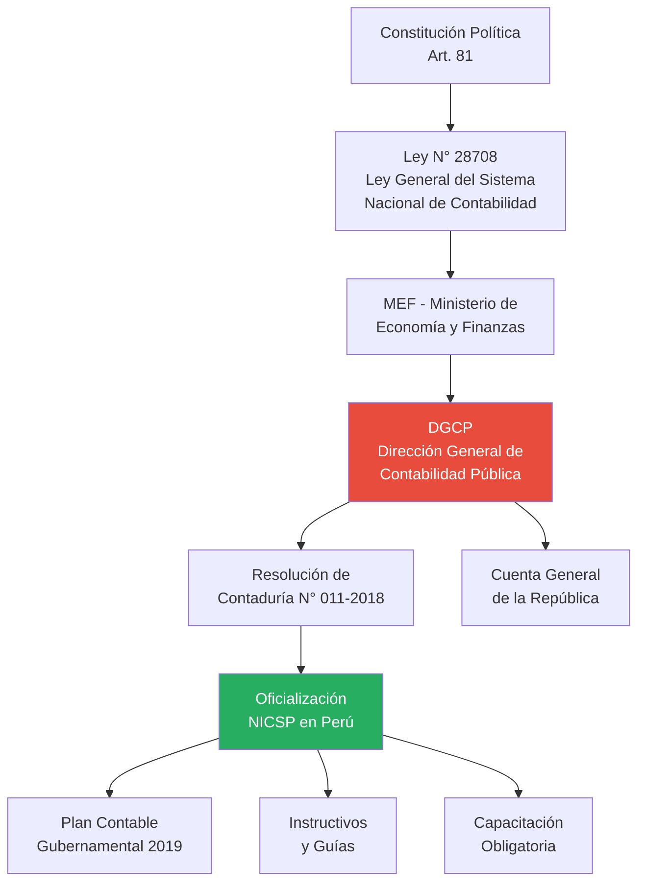
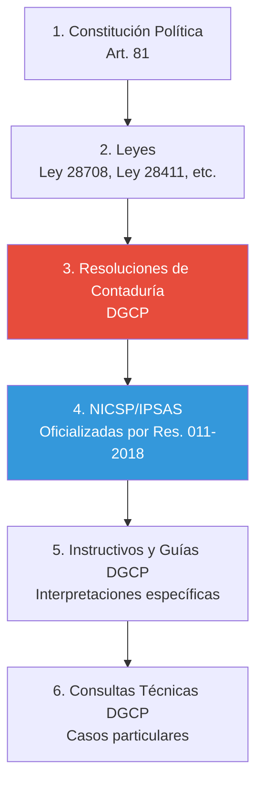

# Marco Legal Nacional de las NICSP en Perú

## Resumen

El marco legal peruano para la adopción e implementación de las Normas Internacionales de Contabilidad del Sector Público (NICSP/IPSAS) se establece mediante la Resolución de Contaduría N° 011-2018-EF/30 y normativa complementaria emitida por la Dirección General de Contabilidad Pública del Ministerio de Economía y Finanzas, configurando un sistema de adopción gradual para entidades gubernamentales.

## Definición / Texto Normativo

**Base Constitucional y Legal:**

1. **Constitución Política del Perú (Art. 81):**

   > "La Cuenta General de la República, acompañada del informe de auditoría de la Contraloría General, es remitida por el Presidente de la República al Congreso de la República en un plazo que vence el quince de noviembre del año siguiente al de ejecución del presupuesto."

2. **Ley N° 28708 - Ley General del Sistema Nacional de Contabilidad (Art. 8):**
   > "La Dirección General de Contabilidad Pública es el órgano rector del Sistema Nacional de Contabilidad. Tiene a su cargo la elaboración de normas de contabilidad, su interpretación, las vinculadas con la Cuenta General de la República y la elaboración de la información financiera del Sector Público."

**Norma de Adopción Principal:**

**Resolución de Contaduría N° 011-2018-EF/30 (20 de diciembre de 2018):**

> "Artículo 1°.- OFICIALIZAR la Actualización del Plan Contable Gubernamental (PCG) 2019, para el registro de los hechos económicos y financieros en las entidades del sector público."

> "Artículo 2°.- DISPONER que las entidades del Sector Público, a partir del 1 de enero del año 2019, apliquen de manera **obligatoria** las Normas Internacionales de Contabilidad del Sector Público (NICSP), emitidas y autorizadas oficialmente por la International Public Sector Accounting Standards Board (IPSASB) del International Federation of Accountants (IFAC)."

**Alcance de la adopción:**

> "Segunda Disposición Complementaria Transitoria.- La aplicación de las NICSP será **gradual**, considerando los siguientes plazos:
>
> a) **Fase 1 (2019-2020):** Aplicación por el Gobierno Nacional (Ministerios, organismos públicos y entidades del Poder Legislativo, Poder Judicial y organismos constitucionales autónomos).
>
> b) **Fase 2 (2021-2023):** Aplicación por Gobiernos Regionales y sus entidades dependientes.
>
> c) **Fase 3 (2023-2024):** Aplicación por Gobiernos Locales (municipalidades provinciales y distritales)."

## Desarrollo / Interpretación

### Arquitectura del Sistema Nacional de Contabilidad en Perú



### Cronología de Adopción en Perú

| Año           | Hito Normativo                                                   | Impacto                                                                      |
| ------------- | ---------------------------------------------------------------- | ---------------------------------------------------------------------------- |
| **2008-2015** | Uso del Plan Contable Gubernamental (PCG) 1 basado en efectivo   | Sistema contable tradicional, sin reconocimiento integral de activos/pasivos |
| **2016**      | Iniciativas exploratorias de la DGCP para convergencia con NICSP | Estudios de brechas (gap analysis)                                           |
| **2018**      | **Resolución de Contaduría N° 011-2018-EF/30** (20 dic)          | **Oficialización** de NICSP obligatorias a partir de 2019                    |
| **2019**      | **Fase 1:** Gobierno Nacional inicia aplicación (218 entidades)  | Primera Cuenta General bajo NICSP                                            |
| **2021**      | **Fase 2:** Gobiernos Regionales (26 regiones + entidades)       | Ampliación a segundo nivel de gobierno                                       |
| **2023**      | **Fase 3:** Gobiernos Locales (1,873 municipalidades)            | Universalización del sistema                                                 |
| **2024**      | Consolidación y auditoría bajo NICSP                             | Primera Cuenta General de la República completa en NICSP                     |

### Rol de la Dirección General de Contabilidad Pública (DGCP)

**Funciones según Ley N° 28708, Art. 11:**

1. **Regulación:**
   - Emitir normativa contable para entidades públicas
   - Aprobar el Plan Contable Gubernamental (PCG)
   - Interpretar normas contables nacionales e internacionales

2. **Capacitación:**
   - Programa permanente de capacitación en NICSP (plataforma virtual)
   - Certificación de contadores públicos del sector gubernamental

3. **Consolidación:**
   - Elaborar la Cuenta General de la República (información consolidada del Estado)
   - Preparar estados financieros del Gobierno General según Manual de Estadísticas Financieras Gubernamentales (FMI)

4. **Supervisión:**
   - Verificar cumplimiento de normativa contable
   - Emitir alertas ante inconsistencias en reportes de entidades

**Sitio oficial:** https://www.mef.gob.pe/es/contabilidad-publica

### Plan Contable Gubernamental (PCG) y NICSP

El **Plan Contable Gubernamental 2019** fue rediseñado para permitir el registro contable según NICSP:

**Cambios estructurales principales:**

| Aspecto                              | PCG Anterior (Base Efectivo) | PCG 2019 (Base Devengo/NICSP)                 |
| ------------------------------------ | ---------------------------- | --------------------------------------------- |
| **Reconocimiento de ingresos**       | Al recibir efectivo          | Cuando se devengan (evento imponible)         |
| **Activos de larga duración**        | Gasto al adquirir            | Activo + Depreciación anual                   |
| **Pasivos por beneficios empleados** | No reconocidos hasta pagar   | Provisión por obligación futura (NICSP 39)    |
| **Arrendamientos**                   | Gastos operativos            | Activo por derecho de uso + Pasivo (NICSP 43) |
| **Inventarios**                      | Control extra-contable       | Reconocimiento y valoración (NICSP 12)        |

**Ejemplo de cuenta del PCG 2019:**

- **Código 1501:** Inversiones en Propiedad, Planta y Equipo
  - Subcuenta 15011: Edificios
  - Subcuenta 15012: Vehículos
  - Subcuenta 15019: Depreciación Acumulada

Esta estructura permite cumplir con NICSP 17 (Propiedad, Planta y Equipo).

### NICSP Oficialmente Adoptadas en Perú

**Según Resolución 011-2018-EF/30 y actualizaciones posteriores, las entidades públicas peruanas deben aplicar:**

**A. NICSP Completas (Full IPSAS):**

- Todas las IPSAS vigentes emitidas por el IPSASB hasta diciembre de cada año
- Traducción oficial al español disponible en el Handbook IPSASB

**B. Adaptaciones Nacionales:**
La DGCP puede emitir **guías de aplicación nacional** cuando:

- Una NICSP requiere adaptación al contexto legal peruano
- Existen normas nacionales específicas que complementan NICSP

**Ejemplo de adaptación:**

- NICSP 24 (Presentación de Información del Presupuesto en los Estados Financieros)
  - En Perú, se complementa con requisitos de la Ley N° 28411 (Ley General del Sistema Nacional de Presupuesto)
  - La comparación presupuestal debe seguir clasificadores presupuestales peruanos

### Jerarquía Normativa Contable en Perú



**Regla de resolución de conflictos:**
Si existe contradicción entre una norma nacional (ej. ley peruana) y una NICSP:

1. Prevalece la **norma nacional** (principio de soberanía normativa)
2. La entidad debe revelar el tratamiento alternativo en **notas a los estados financieros**

### Implementación por Niveles de Gobierno

**Fase 1: Gobierno Nacional (2019-2020)**

Entidades incluidas (218 entidades):

- 19 Ministerios
- Poder Judicial
- Poder Legislativo
- Organismos constitucionales autónomos (Contraloría, JNE, ONPE, Defensoría, BCR, SBS, MP)
- Organismos públicos especializados (SUNAT, RENIEC, OSINERGMIN, INDECOPI, etc.)

**Resultados 2019:**

- Primera Cuenta General de la República bajo NICSP presentada en noviembre 2020
- Identificación de activos no registrados: S/. 380,000 millones (principalmente infraestructura)
- Reconocimiento de pasivos por pensiones: S/. 245,000 millones

**Fase 2: Gobiernos Regionales (2021-2023)**

Entidades incluidas (26 gobiernos regionales + 150 entidades descentralizadas):

- Gobiernos Regionales
- Direcciones Regionales de Salud (DIRESAS)
- Direcciones Regionales de Educación (DRE)
- Universidades Nacionales

**Desafíos específicos:**

- Capacitación de personal contable regional
- Inventario físico de activos (escuelas, postas médicas, carreteras regionales)
- Coordinación con gobierno nacional para consolidación

**Fase 3: Gobiernos Locales (2023-2024)**

Entidades incluidas (1,873 municipalidades):

- 196 Municipalidades Provinciales
- 1,677 Municipalidades Distritales

**Retos particulares:**

- Municipalidades pequeñas con capacidad técnica limitada
- Falta de sistemas informáticos adecuados
- Necesidad de simplificación práctica (la DGCP emitió "Guía Simplificada para Municipalidades Distritales")

### Cuenta General de la República bajo NICSP

**Estructura según Directiva N° 001-2019-EF/51.01:**

La Cuenta General consolida información de:

1. Gobierno General (Nacional + Regional + Local)
2. Empresas Públicas No Financieras
3. Empresas Públicas Financieras

**Estados financieros consolidados incluyen:**

- Estado de Situación Financiera (activos, pasivos, patrimonio neto)
- Estado de Gestión (ingresos y gastos devengados)
- Estado de Cambios en el Patrimonio Neto
- Estado de Flujos de Efectivo
- Estado de Comparación de Presupuesto y Ejecución
- Notas a los Estados Financieros

**Acceso público:**
Cuenta General disponible en: https://www.mef.gob.pe/es/cuenta-general-de-la-republica

### Capacitación y Certificación

**Programa Nacional de Capacitación en NICSP:**

La DGCP implementó (2018-2024):

- **Cursos virtuales obligatorios** para contadores públicos de entidades gubernamentales
- 18 módulos temáticos (uno por cada NICSP relevante)
- Certificación para ejercer función contable en sector público

**Plataforma:** https://apps2.mef.gob.pe/capacitaciones/

**Requisito legal:**
Según Resolución de Contaduría N° 005-2019-EF/30, los Directores de Contabilidad de entidades públicas deben acreditar capacitación en NICSP.

## Conexiones

- [[antecedentes-historicos-nicsp]] - Contexto internacional de las NICSP adoptadas en Perú
- [[ipsasb-junta-normas]] - Organismo emisor de las NICSP oficializadas en Perú
- [[contabilidad-gubernamental-peru]] - Sistema de contabilidad pública peruano
- [[modernizacion-marco-normativo-nicsp]] - Proceso de adopción e implementación
- [[base-devengado-sector-publico]] - Principio contable obligatorio desde 2019

## Ejemplos Resueltos

### Ejemplo 1: Aplicación Gradual de NICSP (Básico)

**Situación:**
Una municipalidad distrital de Huancavelica no aplicó NICSP en 2020, argumentando "falta de capacidad técnica".

**Pregunta:** ¿Incumplió la normativa?

**Análisis:**

Según Resolución 011-2018-EF/30, Fase 3 (Gobiernos Locales):

- Plazo de aplicación obligatoria: **2023-2024**
- En 2020, la municipalidad aún estaba en periodo preparatorio

**Conclusión:**
✅ **NO incumplió** en 2020. Sin embargo, a partir del **1 de enero de 2023**, la aplicación de NICSP es **obligatoria** para esa municipalidad.

**Consecuencias de incumplimiento post-2023:**

- Observaciones de la Contraloría General de la República
- Estados financieros no conformes (no pueden consolidarse en Cuenta General)
- Responsabilidad administrativa del Director de Contabilidad

### Ejemplo 2: Jerarquía Normativa en Conflicto (Avanzado)

**Caso:**
El Ministerio de Defensa posee un buque de guerra construido en 1985 por USD 50 millones. Según NICSP 17, debe depreciarse en vida útil (ej. 30 años), pero la **Ley N° 29151 (Ley de Bienes del Estado)** clasifica naves militares como **"bienes de dominio público inalienables"** y una directiva interna del sector defensa prohíbe depreciar activos militares estratégicos por razones de "seguridad nacional".

**Conflicto:**

- NICSP 17 (párrafo 55): "Cada parte de propiedad, planta y equipo con costo significativo debe depreciarse por separado."
- Directiva del sector: "No depreciar naves militares estratégicas."

**Solución según jerarquía normativa peruana:**

1. **Análisis de jerarquía:**
   - Ley Nacional (Ley 29151) > NICSP oficializada (Resolución 011-2018)
   - Pero: Ley 29151 no prohíbe **contablemente** depreciar, solo prohíbe **vender** bienes de dominio público

2. **Interpretación correcta:**
   - **Contabilidad ≠ Enajenación**
   - Depreciar contablemente NO implica que el buque pueda venderse
   - La inalienabilidad es jurídica, no contable

3. **Tratamiento contable obligatorio:**
   - Aplicar NICSP 17: **Depreciar** el buque en 30 años
   - En notas a estados financieros, revelar:
     > "Nota X: El buque de guerra XX es un bien de dominio público inalienable según Ley 29151, por lo que no puede ser enajenado. No obstante, se deprecia contablemente para reflejar el consumo económico del activo durante su vida útil, conforme a NICSP 17."

**Lección:** La inalienabilidad legal **NO exime** de depreciación contable. Muchas entidades confundieron ambos conceptos en los primeros años de implementación.

## Ejercicios Propuestos

### Ejercicio 1: Cronología de Adopción (Básico)

Completa la línea de tiempo con los años correctos:

```
[____] → Publicación Ley 28708 (Ley General Sistema Nacional Contabilidad)
[____] → Estudios de brechas (gap analysis) por DGCP
[2018] → Resolución 011-2018-EF/30 (Oficialización NICSP)
[____] → Fase 1: Gobierno Nacional aplica NICSP
[____] → Fase 2: Gobiernos Regionales aplican NICSP
[____] → Fase 3: Gobiernos Locales aplican NICSP
```

### Ejercicio 2: Investigación Documental (Intermedio)

Accede al sitio de la DGCP (www.mef.gob.pe/contabilidad-publica) y:

1. Descarga la **Cuenta General de la República 2023**
2. Ubica el "Estado de Situación Financiera Consolidado del Sector Público"
3. Responde:
   - ¿Cuál es el monto total de Activos del Sector Público peruano al 31/12/2023?
   - ¿Cuál es el monto de Pasivos (especialmente Pasivos por Beneficios a Empleados)?
   - ¿El Estado peruano tiene Activos Netos positivos o negativos?
4. Elabora un resumen de 200 palabras sobre qué NICSP permitieron revelar estos montos (que no aparecían en contabilidad de efectivo).

### Ejercicio 3: Caso de Implementación Municipal (Avanzado)

**Escenario:**
Eres el Director de Contabilidad de una municipalidad provincial de Junín que debe implementar NICSP en 2023. Al realizar el inventario inicial descubres:

- **28 vehículos** (adquiridos entre 2010-2022) nunca registrados como activos
- **35 locales municipales** registrados al costo histórico de 1998, sin depreciar
- **Pasivos por juicios laborales** de S/. 8 millones no reconocidos (solo revelados en notas presupuestales)
- **Deuda a proveedores** de 2022 no registrada: S/. 2.5 millones

**Tarea:**
Elabora un "Plan de Implementación NICSP" (800 palabras) que incluya:

1. **Diagnóstico de brechas:** Identifica qué NICSP específicas aplican a cada problema detectado
2. **Ajustes contables iniciales:** Describe los asientos de apertura necesarios (no cuantificados, solo concepto)
3. **Cronograma:** Fases de implementación en 12 meses
4. **Riesgos y mitigaciones:** Mínimo 3 riesgos identificados con soluciones
5. **Capacitación requerida:** Temas clave para el equipo contable
6. **Coordinación con DGCP:** ¿Qué consultas técnicas harías a la DGCP?

## Preguntas Bloom

**Nivel 1 - Recordar:** ¿Qué norma legal peruana oficializó la adopción obligatoria de NICSP y en qué año fue publicada?

**Nivel 2 - Comprender:** Explica por qué la adopción de NICSP en Perú fue **gradual** (por fases) y no simultánea para todos los niveles de gobierno.

**Nivel 3 - Aplicar:** Un gobierno regional debe presentar su primera Cuenta Anual bajo NICSP en 2022. ¿Qué normativa específica debe consultar y qué estados financieros mínimos debe preparar?

**Nivel 4 - Analizar:** Compara el marco legal de adopción de NICSP en Perú versus Argentina (investiga brevemente). Analiza: (1) ¿Adoptación obligatoria o voluntaria? (2) ¿Gradual o simultánea? (3) ¿Full IPSAS o adaptaciones nacionales? ¿Qué ventajas/desventajas tiene cada enfoque?

**Nivel 5 - Evaluar:** Algunos contadores argumentan que la Resolución 011-2018-EF/30 "delegó excesivo poder" al IPSASB (organismo internacional) sobre la contabilidad peruana, afectando soberanía normativa. Evalúa esta crítica considerando: (1) jerarquía normativa, (2) capacidad técnica nacional, (3) comparabilidad internacional.

**Nivel 6 - Crear:** Diseña una propuesta de reforma a la Resolución 011-2018-EF/30 que establezca un "mecanismo de adopción selectiva" de NICSP futuras (en lugar de adopción automática). Incluye: (1) criterios de evaluación de nuevas NICSP, (2) proceso de aprobación nacional, (3) periodo de transición, (4) compatibilidad con obligaciones de consolidación de la Cuenta General. Extensión: 600 palabras.

## Base Normativa

**Normas Nacionales Primarias:**

1. **Constitución Política del Perú (1993).** Artículo 81: Cuenta General de la República.

2. **Ley N° 28708 - Ley General del Sistema Nacional de Contabilidad (2006).** Artículos 7-13: Dirección General de Contabilidad Pública y sus funciones.

3. **Resolución de Contaduría N° 011-2018-EF/30 (20 de diciembre de 2018).** "Oficialización de la Actualización del Plan Contable Gubernamental 2019 y Adopción de las NICSP". Publicada en El Peruano el 26/12/2018.

4. **Resolución de Contaduría N° 005-2019-EF/30 (15 de julio de 2019).** "Requisitos de capacitación en NICSP para Directores de Contabilidad del sector público".

5. **Directiva N° 001-2019-EF/51.01 (aprobada por R.D. N° 003-2019-EF/51.01).** "Preparación y Presentación de Información Financiera y Presupuestaria del Sector Público".

**Normas Complementarias:**

6. **Ley N° 28411 - Ley General del Sistema Nacional de Presupuesto (2004).** Artículos sobre clasificadores presupuestales y comparación presupuestal.

7. **Ley N° 27785 - Ley Orgánica del Sistema Nacional de Control y de la Contraloría General de la República (2002).** Artículos sobre auditoría de estados financieros.

**Documentos Técnicos DGCP:**

8. **Plan Contable Gubernamental 2019 (Actualizado 2024).** Disponible en: https://www.mef.gob.pe/es/plan-contable-gubernamental

9. **Manual de Contabilidad Gubernamental (2020).** Guías de aplicación práctica de NICSP por tipo de transacción.

10. **Guía Simplificada de NICSP para Municipalidades Distritales (2022).** Documento pedagógico para entidades pequeñas.

## Referencias Bibliográficas y Recursos en Línea

**Sitios Oficiales del Gobierno Peruano:**

- **Dirección General de Contabilidad Pública (DGCP):** https://www.mef.gob.pe/es/contabilidad-publica
  - Normativa completa (Resoluciones de Contaduría)
  - Plan Contable Gubernamental actualizado
  - Instructivos y guías de aplicación

- **Cuenta General de la República:** https://www.mef.gob.pe/es/cuenta-general-de-la-republica
  - Estados financieros consolidados del sector público (2019-2023)
  - Informes de auditoría de la Contraloría

- **Plataforma de Capacitación en NICSP:** https://apps2.mef.gob.pe/capacitaciones/
  - Cursos virtuales gratuitos
  - Material didáctico por NICSP

**Organismos de Control:**

- **Contraloría General de la República:** https://www.gob.pe/contraloria
  - Guías de auditoría de estados financieros bajo NICSP
  - Informes de control sobre implementación

**Literatura Técnica Nacional:**

- Alvarado, J., & Tupia, N. (2019). "Implementación de las NICSP en el Perú: Desafíos y Oportunidades". _Revista Contabilidad & Finanzas PUCP_, 14(2), 45-68.

- Quispe, R. (2020). "Adopción de NICSP en Gobiernos Locales del Perú: Un Análisis Empírico". _Quipukamayoc - Revista de Ciencias Contables UNMSM_, 28(56), 83-95.

- Ministerio de Economía y Finanzas (2019). "Guía de Transición al Nuevo Marco Contable Gubernamental". Lima: MEF-DGCP.

**Estudios Comparativos:**

- Banco Interamericano de Desarrollo (2020). "Adopción de NICSP en América Latina: Lecciones de Perú, Colombia y Chile". Washington: BID.

- CIAT (2021). "La Contabilidad del Sector Público en América Latina: Estado Actual". Ciudad de Panamá: CIAT.

**Recursos Multimedia:**

- DGCP (2018-2024). Serie de webinars "Implementando NICSP en Perú". Videos disponibles en canal YouTube del MEF.

## Notas y Alertas

> **⚠️ Obligatoriedad Legal:** La adopción de NICSP en Perú es **obligatoria por ley**, no opcional. Las entidades que no cumplan enfrentan observaciones de la Contraloría General y responsabilidad administrativa de sus directores de contabilidad.

> **📌 Actualización Continua:** Cuando el IPSASB emite nuevas NICSP o modifica existentes, la DGCP evalúa y oficializa su adopción en Perú mediante Resoluciones de Contaduría. Típicamente existe un desfase de 6-12 meses entre emisión internacional y oficialización nacional.

> **💡 Consultas Técnicas:** La DGCP ofrece un servicio de "Consultas Técnicas en Línea" (https://apps2.mef.gob.pe/consultascontables/) donde contadores públicos de entidades gubernamentales pueden consultar casos específicos. Las respuestas crean precedente interpretativo.

> **🌍 Comparación Regional:** Perú es uno de los 8 países latinoamericanos que han adoptado NICSP de manera obligatoria a nivel nacional (junto con Colombia, Costa Rica, Brasil-algunos estados, Chile-en proceso, México-federación, Argentina-algunos niveles, Ecuador-en evaluación). Otros países solo las usan de manera voluntaria o parcial.

> **🔍 Para Profundizar:** Si te interesa el debate sobre los costos de implementación de NICSP en países en desarrollo, consulta: Brusca, I., Gómez-Villegas, M., & Montesinos, V. (2016). "Public Financial Management Reforms: IPSAS Role in Latin-America". _Public Administration and Development_, 36(1), 51-64.

> **⚙️ Herramienta Práctica:** La DGCP desarrolló el SIAF (Sistema Integrado de Administración Financiera) que integra presupuesto, tesorería y contabilidad. Desde 2019, el módulo contable del SIAF genera automáticamente asientos bajo NICSP basados en transacciones presupuestales. Esto facilita la implementación en entidades con poca capacidad técnica.

---

<div style="text-align: center;">
<a href="https://notbyai.fyi">

</a>
</div>
