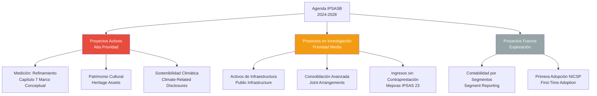

# Modernización del Marco Normativo NICSP

## Resumen

La modernización del marco normativo NICSP es el proceso continuo de actualización, mejora y expansión de las Normas Internacionales de Contabilidad del Sector Público, liderado por el IPSASB mediante proyectos técnicos que abordan temas emergentes (sostenibilidad, patrimonio cultural, activos de infraestructura) y refinan normas existentes para mantener su relevancia frente a cambios en el entorno gubernamental global.

## Definición / Texto Normativo

**Según IPSASB Strategy and Work Plan 2024-2028:**

> "El IPSASB está comprometido con la mejora continua de las IPSAS para asegurar que respondan a las necesidades evolutivas de los preparadores, auditores y usuarios de información financiera del sector público, manteniendo coherencia con el Marco Conceptual y convergencia apropiada con las NIIF donde sea relevante para el contexto del sector público."

**Objetivos estratégicos de modernización (2024-2028):**

1. **Relevancia:** Abordar temas emergentes no cubiertos por normas existentes
2. **Coherencia:** Eliminar inconsistencias entre NICSP y con el Marco Conceptual
3. **Claridad:** Mejorar redacción y aplicabilidad de normas complejas
4. **Convergencia selectiva:** Adoptar cambios de NIIF cuando sean apropiados para el sector público
5. **Sostenibilidad:** Incorporar información sobre cambio climático y sostenibilidad fiscal a largo plazo

**Proceso de modernización (Due Process):**

Según "IPSASB Due Process and Working Procedures" (2023):

1. Identificación de tema → 2. Investigación y análisis → 3. Borrador de consulta (Exposure Draft) → 4. Consulta pública (mínimo 120 días) → 5. Re-deliberación → 6. Emisión de norma final o mejora

## Desarrollo / Interpretación

### Agenda Estratégica del IPSASB (2024-2028)



### Proyectos de Modernización en Curso (2024-2025)

#### **1. Proyecto: Medición (Measurement)**

**Estado:** Borrador de consulta publicado septiembre 2023, norma final esperada 2025

**Problema identificado:**
El Capítulo 7 del Marco Conceptual (2014) identificó múltiples bases de medición, pero no proveyó suficiente guía sobre **cuándo** usar cada una.

**Propuesta del IPSASB:**

- Ampliar orientación sobre selección de base de medición
- Aclarar aplicación de "valor en uso" para activos específicos del sector público
- Guía sobre cambios en estimaciones de medición

**Impacto en NICSP existentes:**
Modificaciones menores a IPSAS 17 (PPE), IPSAS 31 (Intangibles), IPSAS 21 (Deterioro)

**Comentarios recibidos:** 82 cartas de 45 países (consulta cerrada diciembre 2023)

**Controversia principal:**
Gobiernos de países en desarrollo prefieren **costo histórico** (más simple), mientras que desarrollados prefieren **valor razonable** (más relevante). El IPSASB busca equilibrio permitiendo ambas con requisitos de revelación.

#### **2. Proyecto: Patrimonio Cultural (Heritage Assets)**

**Estado:** Investigación avanzada, borrador esperado 2025

**Definición propuesta:**

> "Activos con significado cultural, ambiental, educativo e histórico que se mantienen indefinidamente para beneficio de generaciones presentes y futuras."

**Ejemplos:**

- Sitios arqueológicos (Machu Picchu, Pirámides de Egipto)
- Museos nacionales y colecciones
- Monumentos históricos
- Parques nacionales de conservación

**Dilema contable:**
Muchos gobiernos **no** reconocen estos activos en estados financieros porque:

- Valor es "incalculable" (no tienen precio de mercado)
- Duración indefinida (no se deprecian)
- No generan flujos de efectivo
- Costo de valoración supera beneficio de información

**Enfoques en consulta:**

| Opción                               | Descripción                                                                   | Pros                                            | Contras                             |
| ------------------------------------ | ----------------------------------------------------------------------------- | ----------------------------------------------- | ----------------------------------- |
| **A. Reconocimiento obligatorio**    | Valorar al costo de preservación/restauración                                 | Información completa del patrimonio estatal     | Costo alto de valoración inicial    |
| **B. Reconocimiento opcional**       | Permitir revelar en notas sin monto                                           | Flexibilidad para países con recursos limitados | Pierde comparabilidad internacional |
| **C. Reconocimiento por categorías** | Obligatorio para algunos (museos), opcional para otros (sitios arqueológicos) | Balance entre rigor y pragmatismo               | Complejidad en definir categorías   |

**Posición preliminar IPSASB:** Opción C (reconocimiento por categorías)

**Aplicación a Perú:**

- Machu Picchu: Actualmente **no** reconocido en Estado de Situación Financiera del Perú
- Si se adopta IPSAS sobre patrimonio cultural: Posible valoración al costo acumulado de restauración/mantenimiento (aprox. USD 50-80 millones invertidos en décadas) o revelación narrativa sin monto

#### **3. Proyecto: Divulgaciones sobre Cambio Climático (Climate-Related Disclosures)**

**Estado:** Documento de consulta publicado enero 2024, análisis de comentarios en curso

**Contexto:**

- Presión de organismos internacionales (ONU, OCDE, FMI) para que gobiernos revelen riesgos fiscales climáticos
- Algunos países (UK, Nueva Zelanda, Francia) ya requieren revelaciones climáticas en estados financieros

**Propuesta del IPSASB:**
Modificar IPSAS 1 (Presentación de Estados Financieros) para agregar requisito de revelar:

1. **Riesgos físicos:** Impacto de eventos climáticos en activos públicos
   - Ejemplo: Carreteras vulnerables a inundaciones (costo de reposición/reparación)
2. **Riesgos de transición:** Cambios normativos/tecnológicos hacia economía baja en carbono
   - Ejemplo: Flota vehicular gubernamental a sustituir por eléctrica

3. **Pasivos contingentes:** Compromisos internacionales (Acuerdo de París)
   - Ejemplo: Multas potenciales por incumplimiento de metas de emisiones

4. **Activos ambientales en riesgo:** Bosques, reservas de agua, biodiversidad
   - Ejemplo: Valor económico de bosques amazónicos como sumidero de carbono

**Método propuesto:** Revelación en **Notas a los Estados Financieros** (no en los estados principales)

**Debate actual:**

- **A favor:** Aumenta transparencia sobre sostenibilidad fiscal, presiona a gobiernos a actuar
- **En contra:** Difícil de cuantificar con precisión, puede politizar información financiera

**Ejemplo de revelación (borrador):**

> "Nota 28: Riesgos Relacionados con el Clima
>
> El gobierno ha identificado que aproximadamente 15% de su red vial (3,500 km) está en zonas de alto riesgo de deslizamientos agravados por lluvias intensas asociadas al cambio climático. El costo estimado de adaptación (muros de contención, drenaje reforzado) es de USD 800 millones en los próximos 10 años. Al 31/12/2024, se ha comprometido USD 120 millones en el presupuesto 2025-2027 para este fin.
>
> Adicionalmente, el gobierno se ha comprometido a reducir emisiones de carbono en 30% para 2030 (Acuerdo de París). Esto requiere inversión estimada de USD 2,500 millones en transporte público eléctrico y energías renovables. Al cierre del ejercicio, no existen pasivos reconocidos por incumplimiento potencial de este compromiso."

#### **4. Proyecto: Activos de Infraestructura (Public Infrastructure)**

**Estado:** Investigación preliminar, proyecto posiblemente en agenda 2026-2028

**Problema:**
Infraestructura pública (carreteras, puentes, redes de agua, alcantarillado) tiene características especiales:

- Vida útil muy larga (50-100 años)
- Mantenimiento continuo vs reemplazo
- Dificultad de determinar "deterioro" (no generan ingresos directos)
- Componentes interdependientes (red vial como sistema, no activos individuales)

**Tratamiento actual:**
IPSAS 17 (Propiedad, Planta y Equipo) aplica genéricamente, pero muchos gobiernos solicitan guía específica.

**Propuesta en discusión:**

- IPSAS específica para "Activos de Infraestructura"
- Enfoque de "redes" (network approach): Valorar la red completa, no activos individuales
- Depreciation by component: Separar infraestructura en componentes con distinta vida útil (pavimento vs estructura de puente)
- Alternativa de "costo de mantenimiento" en lugar de depreciación tradicional

**Caso ilustrativo:**
Un puente construido en 1980 por USD 50 millones:

- **Enfoque actual (IPSAS 17):** Depreciar en 50 años → Valor en libros 2024: USD 6 millones
- **Enfoque propuesto:** Valorar por condición actual (inspección ingenieril) → Si está en buenas condiciones por mantenimiento: USD 35-40 millones (refleja potencial de servicio real)

### Mejoras Periódicas a NICSP Existentes

**"Improvements to IPSAS" - Ciclos regulares (cada 2-3 años):**

Proceso similar a las "mejoras anuales" de NIIF:

- Correcciones menores
- Aclaraciones de lenguaje
- Eliminación de inconsistencias
- Actualizaciones por referencias cruzadas

**Últimos ciclos:**

- **Improvements 2021:** 18 modificaciones menores a 12 IPSAS
- **Improvements 2023:** 22 modificaciones menores a 14 IPSAS

**Ejemplo de mejora (Improvements 2023):**

- IPSAS 19 (Provisiones): Aclaración sobre descuento de pasivos a largo plazo
  - **Antes:** Ambiguo si provisiones > 1 año deben descontarse siempre
  - **Después:** Clarificó que descuento es obligatorio si el efecto temporal es material

### Convergencia con NIIF: Adopción Selectiva

**Principio del IPSASB:**
Adoptar cambios de NIIF que sean **relevantes** para el sector público, **rechazar** los que no lo sean.

**Casos de convergencia reciente:**

| NIIF                                             | IPSAS                   | Grado de convergencia                                                                                                                 |
| ------------------------------------------------ | ----------------------- | ------------------------------------------------------------------------------------------------------------------------------------- |
| **NIIF 16 (Arrendamientos)**                     | **IPSAS 43**            | 85% convergente. Diferencia: IPSAS 43 exime arrendamientos de corto plazo en gobierno (ej. alquiler temporal de oficinas por 3 meses) |
| **NIIF 9 (Instrumentos Financieros)**            | **IPSAS 41**            | 70% convergente. Diferencia: IPSAS 41 permite método de costo amortizado para más instrumentos (gobiernos no especulan)               |
| **NIIF 15 (Ingresos de contratos con clientes)** | **IPSAS 47 (proyecto)** | 60% convergente (en desarrollo). Diferencia: IPSAS 47 excluye impuestos (ya cubierto en IPSAS 23)                                     |

**Casos de NO convergencia:**

| NIIF                                                            | Razón de no adopción                                                                                                                        |
| --------------------------------------------------------------- | ------------------------------------------------------------------------------------------------------------------------------------------- |
| **NIIF 17 (Contratos de Seguro)**                               | No aplicable: gobiernos rara vez emiten seguros comerciales. Sí tienen programas sociales, pero se cubren en IPSAS 42 (Beneficios Sociales) |
| **NIIF 10 (Estados Financieros Consolidados) - algunas partes** | IPSAS 35 usa definición de "control" adaptada al sector público (incluye control legislativo, no solo financiero)                           |

### Retos de la Modernización

**1. Velocidad vs Estabilidad:**

- Emisión rápida de normas → Gobiernos no tienen tiempo de implementar
- Proceso lento → Normas obsoletas frente a cambios tecnológicos/económicos
- **Balance actual:** IPSASB emite 2-3 normas nuevas por año, permite transición de 2-3 años

**2. Complejidad vs Aplicabilidad:**

- Normas muy técnicas → Países en desarrollo no pueden aplicarlas (falta capacidad técnica)
- Normas muy simples → Pierden utilidad para países avanzados
- **Solución propuesta:** "IPSAS Simplificadas" para entidades pequeñas (en desarrollo)

**3. Costos de Implementación:**

- Nuevas normas requieren: cambios en sistemas, capacitación, recolección de datos
- Gobiernos argumentan que el costo supera el beneficio
- **Respuesta IPSASB:** Análisis costo-beneficio en "Basis for Conclusions" de cada norma

**4. Soberanía Normativa vs Armonización:**

- Países quieren adaptar NICSP a contexto local
- Adaptaciones excesivas → Pierden comparabilidad internacional
- **Tendencia:** Países adoptan "Full IPSAS" con revelaciones adicionales nacionales, pero sin cambiar requerimientos core

## Conexiones

- [[ipsasb-junta-normas]] - Organismo responsable de la modernización normativa
- [[marco-conceptual-nicsp]] - Base teórica de los proyectos de modernización
- [[antecedentes-historicos-nicsp]] - Evolución histórica del marco normativo
- [[diferencias-nicsp-niif]] - Criterios de convergencia selectiva con NIIF
- [[marco-legal-nacional-nicsp-peru]] - Proceso de adopción nacional de actualizaciones

## Ejemplos Resueltos

### Ejemplo 1: Impacto de una Mejora Técnica (Básico)

**Situación:**
En Improvements to IPSAS 2021, el IPSASB modificó IPSAS 17 para aclarar que "repuestos mayores" (ej. motor de reemplazo de un buque) deben reconocerse como activo separado si su costo es significativo.

Un ministerio de transporte reemplazó el motor de un ferry en 2022 por S/. 2 millones (costo original del ferry: S/. 10 millones, adquirido en 2010).

**Pregunta:** ¿Cómo aplicar la mejora de IPSAS 17?

**Solución:**

**Antes de la mejora (tratamiento incorrecto frecuente):**

```
Gasto de mantenimiento      2,000,000
    Banco                           2,000,000
```

(Registrado como gasto del periodo)

**Después de la mejora (tratamiento correcto):**

```
Paso 1: Dar de baja motor antiguo (estimado: S/. 1.5 millones valor en libros)
Depreciación acumulada        X
Pérdida por retiro       500,000  (si aplica)
    Activo - Motor antiguo      1,500,000

Paso 2: Reconocer motor nuevo
Activo - Motor nuevo     2,000,000
    Banco                       2,000,000

Paso 3: Depreciar motor nuevo independientemente
Vida útil estimada: 15 años
Depreciación anual: S/. 133,333
```

**Impacto:** La mejora asegura que activos significativos se deprecien apropiadamente, reflejando mejor el consumo de recursos.

### Ejemplo 2: Proyecto de Patrimonio Cultural (Avanzado)

**Caso:**
El Museo Nacional de Arqueología de Perú alberga 50,000 piezas arqueológicas (cerámicas, textiles, metales precolombinos). Actualmente **no** están reconocidas en el Estado de Situación Financiera del Ministerio de Cultura.

Si el IPSASB aprueba IPSAS sobre Heritage Assets (esperado 2026) con la opción de "reconocimiento por categorías", ¿cómo debería proceder Perú?

**Análisis de opciones:**

**Opción A: Reconocimiento al costo histórico de adquisición**

- Problema: 90% de las piezas provienen de excavaciones arqueológicas (no tienen "costo de adquisición")
- Solo aplicable a piezas adquiridas recientemente (ej. compras a colecciones privadas: 500 piezas)

**Opción B: Valoración por tasación de mercado**

- Problema: Ilegal (Ley N° 28296 prohíbe comercializar patrimonio cultural)
- Tasaciones solo existen para seguros (valores inflados)
- Costo de tasación profesional: ~USD 50-100 por pieza × 50,000 = USD 2.5-5 millones

**Opción C: Reconocimiento al costo de preservación acumulado**

- El museo invierte S/. 8 millones anuales en conservación, restauración, almacenamiento
- Costo acumulado últimos 20 años: ~S/. 160 millones
- **Ventaja:** Refleja inversión del Estado en preservar el patrimonio
- **Desventaja:** No refleja "valor cultural" inherente

**Opción D: Revelación narrativa sin reconocimiento contable**

```
Nota 15: Patrimonio Cultural

El Ministerio de Cultura custodia aproximadamente 50,000 piezas
arqueológicas de valor histórico nacional en el Museo Nacional de
Arqueología. Estas piezas no se reconocen como activos en el Estado
de Situación Financiera debido a la imposibilidad de obtener medición
confiable de su valor cultural.

El Ministerio invierte anualmente S/. 8 millones en conservación y
preservación de estas colecciones. Las piezas están aseguradas por
un valor agregado de USD 200 millones para fines de protección contra
siniestros.

De acuerdo con la Ley N° 28296 (Ley General del Patrimonio Cultural),
estas piezas son inalienables e imprescriptibles, por lo que no
pueden ser vendidas ni embargadas.
```

**Recomendación para Perú:**

- **Corto plazo (2025-2026):** Opción D (revelación narrativa)
- **Mediano plazo (2027-2029):** Transición a Opción C (costo de preservación) para colecciones museísticas principales
- **Largo plazo (2030+):** Evaluar Opción B para piezas de alto valor con tasaciones actualizadas periódicamente

## Ejercicios Propuestos

### Ejercicio 1: Identificación de Proyectos (Básico)

Visita el sitio del IPSASB (www.ipsasb.org/current-projects) y:

1. Identifica **3 proyectos activos** (en fase de borrador o consulta)
2. Para cada proyecto, indica:
   - Nombre del proyecto
   - Fecha estimada de emisión de norma final
   - Problema que busca resolver
   - IPSAS existente que modificaría (si aplica)

### Ejercicio 2: Análisis de Impacto (Intermedio)

El IPSASB está desarrollando IPSAS sobre "Primera Adopción de NICSP" (First-Time Adoption), similar a NIIF 1.

**Escenario:**
Una municipalidad provincial adoptará NICSP por primera vez en 2025. Históricamente usaba contabilidad de efectivo y:

- Nunca registró edificios municipales como activos
- No tiene depreciación acumulada
- No reconoció pasivos laborales (vacaciones, CTS acumuladas)
- Tiene litigios pendientes no provisionados

**Tarea:**
Elabora un informe de 400 palabras que incluya:

1. **Ajustes de transición obligatorios:** ¿Qué debe reconocer la municipalidad en su Estado de Apertura bajo NICSP?

2. **Exenciones potenciales:** Si IPSAS de Primera Adopción permite "exenciones opcionales" (como NIIF 1), ¿qué exenciones solicitarías? (ej. no restablecer costo histórico de activos adquiridos hace 30 años, usar valor razonable en fecha de transición)

3. **Revelaciones requeridas:** ¿Qué información debería revelar en notas para explicar la transición?

4. **Cronograma:** Plan de 18 meses para preparar el Estado de Apertura

### Ejercicio 3: Debate Normativo (Avanzado)

**Posiciones en Conflicto:**

**Posición A (Gobiernos de países en desarrollo):**
"El IPSASB emite demasiadas normas complejas. No tenemos capacidad técnica ni recursos para implementar IPSAS 41 (Instrumentos Financieros), IPSAS 43 (Arrendamientos) y ahora quieren agregar normas sobre clima y patrimonio cultural. Esto es imposible para países con sistemas contables básicos. El IPSASB debería crear 'IPSAS Simplificadas' para entidades pequeñas."

**Posición B (Organismos internacionales - FMI, Banco Mundial):**
"Las NICSP son esenciales para transparencia fiscal y acceso a financiamiento internacional. Reducir requisitos crea un 'estándar de segunda clase' que impide comparabilidad. Los países deben invertir en capacitación e infraestructura para cumplir con NICSP completas. La solución no es simplificar las normas, sino proveer asistencia técnica."

**Tarea:**
Escribe un ensayo de 800 palabras donde:

1. Analices los argumentos de ambas posiciones (fortalezas y debilidades)
2. Propongas una solución intermedia que equilibre rigor técnico con aplicabilidad práctica
3. Diseñes un "Sistema de Adopción por Niveles" donde:
   - **Nivel 1:** Entidades grandes (ministerios, gobiernos regionales) → IPSAS completas
   - **Nivel 2:** Entidades medianas (municipalidades provinciales) → IPSAS core (lista reducida)
   - **Nivel 3:** Entidades pequeñas (municipalidades distritales rurales) → IPSAS simplificadas
4. Identifiques 5 IPSAS que serían "obligatorias" en todos los niveles (core) y 5 que podrían ser "opcionales" en Nivel 3

## Preguntas Bloom

**Nivel 1 - Recordar:** ¿Cuáles son los tres proyectos de alta prioridad en la agenda del IPSASB 2024-2028 mencionados en esta nota?

**Nivel 2 - Comprender:** Explica por qué el proyecto de "Patrimonio Cultural" (Heritage Assets) es particularmente complejo para el IPSASB. ¿Qué hace difícil definir una norma que todos los países puedan aplicar?

**Nivel 3 - Aplicar:** Si Perú adopta la futura IPSAS sobre divulgaciones climáticas, ¿qué tipo de información debería revelar sobre la Amazonía peruana (como sumidero de carbono y activo ambiental en riesgo)?

**Nivel 4 - Analizar:** Compara el enfoque del IPSASB (modernización continua con múltiples proyectos simultáneos) versus un enfoque de "estabilidad normativa" (emitir pocas normas, revisarlas solo cada 10 años). Analiza ventajas y desventajas de cada enfoque para: (1) usuarios, (2) preparadores, (3) comparabilidad internacional.

**Nivel 5 - Evaluar:** El proyecto de "Activos de Infraestructura" propone valorar carreteras por su "condición actual" en lugar de costo histórico depreciado. Evalúa esta propuesta: ¿Provee información más útil o introduce excesiva subjetividad? Considera: (1) relevancia para decisiones de mantenimiento vs reemplazo, (2) confiabilidad de las inspecciones ingenieriles, (3) comparabilidad entre gobiernos.

**Nivel 6 - Crear:** Diseña una propuesta para un proyecto del IPSASB titulado "Contabilidad de la Economía Digital en el Sector Público" (2026-2028). Incluye: (1) problema a resolver (ej. valoración de activos digitales como bases de datos, software como servicio), (2) temas específicos a abordar, (3) relación con IPSAS existentes (IPSAS 31 Intangibles), (4) diferencias con sector privado, (5) propuesta de tratamiento contable para 3 casos (datos abiertos gubernamentales, plataformas digitales de servicios públicos, ciberseguridad como activo intangible). Extensión: 1,000 palabras.

## Base Normativa

**Documentos Estratégicos del IPSASB:**

1. **IPSASB Strategy and Work Plan 2024-2028 (Marzo 2024).** Disponible en: https://www.ipsasb.org/publications/ipsasb-strategy-and-work-plan-2024-2028

2. **IPSASB Due Process and Working Procedures (Actualizado 2023).** Procedimientos para emisión y actualización de normas.

3. **IPSASB Annual Report 2023.** Reporte de actividades, proyectos completados y en curso.

**Documentos de Proyectos Específicos:**

4. **Exposure Draft 84: Measurement (Septiembre 2023).** Borrador de consulta sobre refinamiento de medición. Disponible en: https://www.ipsasb.org/publications/exposure-draft-84-measurement

5. **Consultation Paper: Heritage Assets (Esperado Q2 2025).** Documento de consulta sobre patrimonio cultural [en desarrollo].

6. **Consultation Paper: Climate-Related Disclosures (Enero 2024).** Propuesta de revelaciones sobre cambio climático. Disponible en: https://www.ipsasb.org/publications/climate-related-disclosures

**Normas Recientes (2019-2024):**

7. **IPSAS 42 - Beneficios Sociales (Social Benefits) (Enero 2019).** Primera norma completamente sin equivalente en NIIF.

8. **IPSAS 43 - Arrendamientos (Leases) (Enero 2022).** Basada en NIIF 16 con adaptaciones sector público.

9. **IPSAS 44 - Transferencias No Contractuales (Non-Exchange Expenses) (Mayo 2023).** Completó el tratamiento de transacciones sin contraprestación.

**Mejoras Periódicas:**

10. **Improvements to IPSAS 2021 (Marzo 2022).** Modificaciones menores a 12 IPSAS.

11. **Improvements to IPSAS 2023 (Junio 2024).** Modificaciones menores a 14 IPSAS.

## Referencias Bibliográficas y Recursos en Línea

**Sitio Oficial IPSASB:**

- **Proyectos Actuales:** https://www.ipsasb.org/current-projects
  - Estado de cada proyecto (Research, Consultation, Finalization)
  - Documentos de trabajo descargables
  - Cronograma actualizado

- **Exposure Drafts y Consultas:** https://www.ipsasb.org/consultations-current
  - Borradores abiertos para comentario público
  - Instrucciones para enviar comentarios

- **Normas Emitidas:** https://www.ipsasb.org/publications-resources
  - IPSASB Handbook (actualizado anualmente)
  - Basis for Conclusions de cada norma

**Literatura sobre Modernización:**

- Brusca, I., & Montesinos, V. (2023). "The IPSASB's Agenda: Priorities and Challenges for the Next Decade". _Public Money & Management_, 43(2), 145-158.

- Cohen, S., & Karatzimas, S. (2024). "Climate-Related Disclosures in Public Sector Financial Reporting: The IPSASB's Proposal". _Financial Accountability & Management_, 40(1), 78-95.

- Christiaens, J., et al. (2022). "IPSAS Adoption and the Modernization of Public Sector Accounting: Evidence from Europe". _International Review of Administrative Sciences_, 88(3), 682-701.

**Análisis Comparativos:**

- PwC (2024). "IPSAS Update Q1 2024: Current Projects and Expected Changes". [Análisis trimestral de proyectos IPSASB]

- Deloitte (2024). "IPSAS Roadmap 2024-2026: What's Changing". [Guía de actualizaciones esperadas]

- Ernst & Young (2023). "Heritage Assets in the Public Sector: Accounting Challenges and Opportunities". Working Paper.

**Recursos Multimedia:**

- IPSASB Webinar Series: "Understanding the Measurement Project" (Octubre 2023). Video de 90 minutos. Disponible en: https://www.ipsasb.org/news-events/webinars

- IFAC (2024). Podcast "The Future of Public Sector Accounting" - Episodio sobre Climate Disclosures (30 min).

## Notas y Alertas

> **⚠️ Adopción Nacional Requiere Aprobación:** Cuando el IPSASB emite una nueva IPSAS o mejora, **NO** entra en vigor automáticamente en Perú. La DGCP debe evaluarla y oficializarla mediante Resolución de Contaduría. Típicamente hay desfase de 6-18 meses entre emisión internacional y adopción nacional.

> **📌 Consulta Pública Abierta:** Cualquier contador, académico, o entidad peruana puede enviar comentarios durante el periodo de consulta de un borrador del IPSASB. Los comentarios influyen en la versión final de la norma. Acceso: https://www.ipsasb.org/how-comment

> **💡 Proyectos Pueden Cancelarse:** No todos los proyectos en investigación resultan en normas. Ejemplo: El proyecto sobre "Government Business Enterprises" (empresas públicas) fue suspendido en 2020 tras consulta que mostró preferencia por mantener uso de NIIF para estas entidades. El IPSASB prioriza según feedback recibido.

> **🌍 Influencia Latinoamericana:** Países latinoamericanos (especialmente Colombia, Costa Rica, Perú) han aumentado su participación en consultas IPSASB desde 2015. Las Contadurías Generales de estos países coordinan respuestas regionales para influir en proyectos. Perú envió comentarios formales sobre IPSAS 42 (Beneficios Sociales) y IPSAS 44 (Transferencias No Contractuales).

> **🔍 Para Profundizar:** Si te interesa el debate académico sobre si el IPSASB está "colonizando" la contabilidad pública global con estándares occidentales, consulta: Hopper, T., et al. (2017). "Contradictions of New Public Management Accounting Reforms in Developing Countries". _Critical Perspectives on Accounting_, 48, 88-108.

> **⚙️ Herramienta Práctica:** El IPSASB mantiene un "Staff Q&A" (Preguntas y Respuestas del Personal Técnico) donde responde consultas sobre interpretación de normas en desarrollo. Útil para anticipar cómo se aplicarán nuevas IPSAS. Acceso: https://www.ipsasb.org/publications/staff-qa

---

<div style="text-align: center;">
<a href="https://notbyai.fyi">

</a>
</div>
