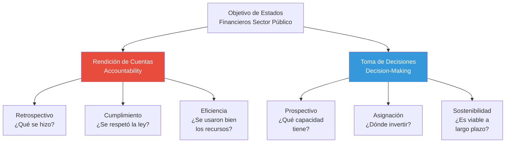
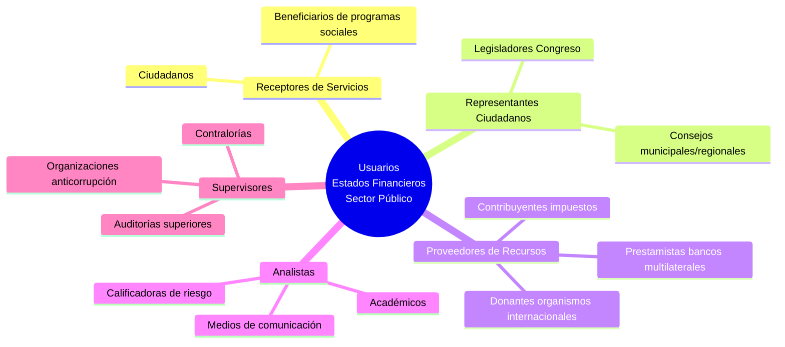

# Objetivos de los Estados Financieros del Sector Público

## Resumen

Los estados financieros del sector público tienen como objetivo primario proporcionar información útil para la rendición de cuentas y toma de decisiones de usuarios diversos (ciudadanos, legisladores, organismos internacionales), diferenciándose fundamentalmente del objetivo de información para inversores del sector privado.

## Definición / Texto Normativo

**Según el Marco Conceptual NICSP (Capítulo 2, párrafo 2.1):**

> "El objetivo de la información financiera con propósito general de las entidades del sector público es proporcionar información sobre la entidad que sea útil a los usuarios de los informes financieros con propósito general (IFPG) para fines de rendición de cuentas y toma de decisiones."

**Desglose del objetivo:**

1. **Rendición de cuentas (accountability):**
   - Demostrar cómo se administraron los recursos públicos
   - Reportar conformidad con el presupuesto y marco legal
   - Revelar la situación financiera y desempeño de la entidad

2. **Toma de decisiones:**
   - Evaluar capacidad de proveer servicios públicos
   - Asignar recursos entre alternativas
   - Determinar sostenibilidad fiscal

**Base normativa adicional:**

- IPSAS 1 "Presentación de Estados Financieros", párrafo 15: "Los estados financieros también muestran los resultados de la administración de los recursos confiados a ella [la administración]."
- Preface to International Public Sector Accounting Standards, párrafo 10: "El IPSASB cree que la adopción de IPSAS mejorará tanto la calidad como la comparabilidad de la información financiera reportada por las entidades del sector público."

## Desarrollo / Interpretación

### Dualidad del Objetivo: Rendición de Cuentas + Toma de Decisiones



### Rendición de Cuentas (Accountability): Dimensión Democrática

**Concepto:**
En democracia, los gobernantes son **administradores temporales** de recursos de la ciudadanía. La rendición de cuentas es la obligación de:

1. Informar cómo se usaron los recursos
2. Justificar las decisiones tomadas
3. Asumir responsabilidad por los resultados

**Manifestaciones en estados financieros:**

| Pregunta ciudadana                     | Información en EEFF                                         | Norma aplicable |
| -------------------------------------- | ----------------------------------------------------------- | --------------- |
| ¿En qué gastó el gobierno mi dinero?   | Estado de Resultados<br/>Estado de Cambios en Activos Netos | IPSAS 1, 2      |
| ¿Qué activos y deudas tiene el Estado? | Estado de Situación Financiera                              | IPSAS 1         |
| ¿Se respetó el presupuesto aprobado?   | Comparación Presupuesto vs Real                             | IPSAS 24        |
| ¿Cómo fluye el efectivo?               | Estado de Flujos de Efectivo                                | IPSAS 2         |

**Ejemplo práctico:**
Un ciudadano consulta los estados financieros del Ministerio de Educación 2023 y descubre:

- **Gasto ejecutado:** S/. 32,000 millones
- **Presupuesto aprobado:** S/. 35,000 millones
- **Sub-ejecución:** 8.6%

Esta información permite al ciudadano cuestionar: ¿Por qué no se usaron S/. 3,000 millones disponibles si faltan escuelas?

### Toma de Decisiones: Dimensión Prospectiva

**Decisiones típicas basadas en estados financieros:**

**A. Decisiones legislativas (Congreso):**

- ¿Aprobar endeudamiento adicional?
  - Análisis: Pasivos totales / PBI
  - Referencia: Estado de Situación Financiera
- ¿Aumentar o reducir presupuesto de sector?
  - Análisis: Eficiencia del gasto histórico
  - Referencia: Comparación presupuestal multianual

**B. Decisiones de organismos internacionales (FMI, Banco Mundial):**

- ¿Otorgar préstamo al país?
  - Análisis: Sostenibilidad fiscal, capacidad de pago
  - Indicadores: Deuda/PBI, Déficit/PBI
  - Fuente: Estados financieros del gobierno general

**C. Decisiones de gestión interna:**

- ¿Renovar flota vehicular o priorizar infraestructura?
  - Análisis: Estado de activos (depreciación acumulada)
  - Referencia: Notas sobre PPE (IPSAS 17)

**D. Decisiones de ciudadanos y organizaciones civiles:**

- ¿A qué candidato apoyar basado en gestión fiscal?
  - Comparación: Resultados financieros entre gobiernos
  - Análisis: Variación de deuda, activos, eficiencia

### Usuarios de la Información Financiera del Sector Público

**Marco Conceptual NICSP (Capítulo 2) identifica usuarios principales:**



**Diferencia clave con sector privado:**

| Aspecto                 | Sector Privado (NIIF)                  | Sector Público (NICSP)                    |
| ----------------------- | -------------------------------------- | ----------------------------------------- |
| Usuario primario        | Inversores y acreedores                | Ciudadanos y legisladores                 |
| Información clave       | Utilidades, flujos de efectivo futuros | Cumplimiento presupuestal, sostenibilidad |
| Relación con la entidad | Voluntaria (compran acciones)          | Obligatoria (ciudadanía, impuestos)       |
| Objetivo del usuario    | Maximizar retorno de inversión         | Fiscalizar y asegurar bienestar colectivo |

### Características Especiales del Objetivo en Sector Público

**1. Información de Rendimiento no solo Financiero:**
Aunque los estados financieros reportan datos monetarios, su análisis debe complementarse con:

- Indicadores de desempeño de servicios (ej. % de cobertura educativa)
- Evaluación de resultados de programas
- Análisis costo-efectividad

**Nota:** IPSASB ha desarrollado Guías de Práctica Recomendada (RPGs) sobre información de desempeño y sostenibilidad a largo plazo.

**2. Horizonte Temporal Dual:**

- **Corto plazo:** Cumplimiento presupuestal anual
- **Largo plazo:** Sostenibilidad fiscal intergeneracional
  - Ejemplo: Pasivos por pensiones a 50 años
  - Análisis de activos de infraestructura (vida útil 50-100 años)

**3. Gobernanza Democrática:**
La información financiera es un mecanismo de **control político** sobre el poder ejecutivo:

- Presupuesto = Autorización legislativa
- Estados financieros = Reporte de cumplimiento
- Auditoría = Verificación independiente

Sin información financiera confiable, el control democrático sobre el gobierno se debilita.

### Objetivos Secundarios Derivados

Aunque el Marco Conceptual define el objetivo primario como "rendición de cuentas + toma de decisiones", en la práctica los estados financieros cumplen objetivos adicionales:

**A. Gestión Interna:**

- Identificar ineficiencias operativas
- Priorizar inversiones en activos
- Gestión de riesgos fiscales (pasivos contingentes)

**B. Comparabilidad Internacional:**

- Benchmarking entre países
- Acceso a mercados de deuda soberana
- Cumplimiento de acuerdos internacionales (ej. Unión Europea exige NICSP)

**C. Transparencia Anticorrupción:**

- Rastreo de uso de recursos
- Identificación de irregularidades (ej. activos no registrados)
- Base para investigaciones de contraloría

## Conexiones

- [[marco-conceptual-nicsp]] - El Capítulo 2 del Marco define estos objetivos
- [[transparencia-rendicion-cuentas]] - Objetivo primario de accountability
- [[base-devengado-sector-publico]] - Base contable que mejor cumple estos objetivos
- [[diferencias-nicsp-niif]] - Objetivos distintos generan normas distintas
- [[ipsasb-junta-normas]] - El IPSASB desarrolló el marco de objetivos

## Ejemplos Resueltos

### Ejemplo 1: Rendición de Cuentas en Acción (Básico)

**Situación:**
El Alcalde de un distrito presentó el Estado de Situación Financiera al 31/12/2023:

```
ACTIVOS:
Efectivo: S/. 5 millones
Cuentas por cobrar (impuesto predial): S/. 3 millones
Infraestructura (neto): S/. 80 millones
TOTAL ACTIVOS: S/. 88 millones

PASIVOS:
Proveedores: S/. 2 millones
Deuda a largo plazo: S/. 30 millones
TOTAL PASIVOS: S/. 32 millones

ACTIVOS NETOS: S/. 56 millones
```

**Pregunta ciudadana:** ¿Es sostenible la deuda del municipio?

**Análisis:**

- Ratio Deuda/Activos = 30 / 88 = 34%
- Ratio Activos Netos/Activos = 56 / 88 = 64%

**Interpretación:**
El municipio tiene patrimonio neto positivo significativo (64% de los activos no están comprometidos). La deuda representa 34% de activos, nivel moderado. Sin embargo, solo S/. 5 millones son efectivo, versus S/. 30 millones de deuda a largo plazo, lo que requiere análisis del flujo de efectivo para evaluar capacidad de pago.

**Conclusión de rendición de cuentas:**
La información permite al ciudadano formarse opinión informada. Debe complementarse con Estado de Flujos de Efectivo y comparación presupuestal.

### Ejemplo 2: Toma de Decisiones de Organismo Internacional (Avanzado)

**Caso:**
El FMI debe decidir si otorga préstamo de USD 500 millones a un país sudamericano. Solicita estados financieros del gobierno central bajo NICSP.

**Información clave analizada:**

| Indicador                        | Año 2022 | Año 2023 | Tendencia    |
| -------------------------------- | -------- | -------- | ------------ |
| Déficit Fiscal / PBI             | -3.5%    | -4.2%    | ⬇️ Empeoró   |
| Deuda Pública / PBI              | 45%      | 52%      | ⬆️ Aumentó   |
| Pasivos contingentes (garantías) | 8% PBI   | 12% PBI  | ⚠️ Riesgo    |
| Activos financieros líquidos     | USD 8 B  | USD 6 B  | ⬇️ Disminuyó |

**Análisis del FMI:**

- Deterioro fiscal evidente
- Pasivos contingentes creciendo (riesgo de materialización)
- Reservas líquidas cayendo (menor capacidad de pago)

**Decisión:** Otorgar préstamo condicionado a:

1. Plan de consolidación fiscal (reducir déficit a -2.5% en 3 años)
2. Revelación trimestral de pasivos contingentes
3. Auditoría independiente de estados financieros

**Rol de los estados financieros NICSP:**
Sin información contable completa en base devengo (que incluye pasivos contingentes, depreciación de infraestructura, etc.), el FMI no podría evaluar riesgo real. Estados financieros en base efectivo (pre-NICSP) **ocultarían** obligaciones futuras.

## Ejercicios Propuestos

### Ejercicio 1: Identificación de Usuarios y Necesidades (Básico)

Conecta cada usuario con su necesidad de información:

| Usuario                               | Necesidad de Información                              |
| ------------------------------------- | ----------------------------------------------------- |
| A. Congresista                        | 1. Evaluar si municipio puede pagar bonos emitidos    |
| B. Ciudadano contribuyente            | 2. Verificar cumplimiento de presupuesto aprobado     |
| C. Inversionista en bonos municipales | 3. Comparar gestión entre candidatos alcalde          |
| D. Contraloría General                | 4. Detectar posibles irregularidades en cuentas       |
| E. Periodista investigativo           | 5. Identificar activos no registrados o sobrevaluados |

### Ejercicio 2: Análisis Comparativo (Intermedio)

Descarga los estados financieros de dos municipalidades provinciales de tu región (ambas deben aplicar NICSP). Compara:

1. **Ratio de liquidez:** Activo corriente / Pasivo corriente
2. **Ratio de endeudamiento:** Pasivo total / Activo total
3. **Ejecución presupuestal:** Gasto ejecutado / Presupuesto aprobado

Elabora un informe de 300 palabras respondiendo:

- ¿Qué municipalidad tiene mejor posición financiera?
- ¿Los estados financieros permiten comparación directa? ¿Qué limitaciones identificas?
- ¿Qué preguntas adicionales harías al alcalde de la municipalidad con peor indicador?

### Ejercicio 3: Caso de Decisión Legislativa (Avanzado)

**Escenario:**
Eres asesor del Congreso. El Poder Ejecutivo solicita autorización para endeudamiento externo de USD 1,000 millones para "infraestructura vial".

Tienes acceso a:

- Estados financieros del gobierno central 2021-2023 (bajo NICSP)
- Proyección macroeconómica 2024-2028

**Tarea:**
Elabora un memorándum técnico de 500 palabras para los congresistas que incluya:

1. **Análisis de sostenibilidad:** ¿El nivel actual de deuda permite endeudamiento adicional? (Considera: Deuda/PBI, Servicio de deuda/Ingresos corrientes)

2. **Evaluación de justificación:** ¿El Estado tiene activos viales existentes deteriorados? (Analiza: Depreciación acumulada de infraestructura en Estado de Situación Financiera)

3. **Análisis de riesgos:** ¿Existen pasivos contingentes no revelados que puedan materializarse? (Revisa: Notas sobre garantías, litigios)

4. **Recomendación final:** Aprobar, rechazar o aprobar condicionadamente el endeudamiento.

**Datos hipotéticos a usar:**

- PBI 2023: USD 200,000 millones
- Deuda pública: USD 90,000 millones
- Infraestructura vial en libros: USD 15,000 millones (costo), USD 8,000 millones (depreciación acumulada)
- Pasivos contingentes por garantías a proyectos: USD 5,000 millones

## Preguntas Bloom

**Nivel 1 - Recordar:** ¿Cuáles son los dos propósitos principales de la información financiera según el Marco Conceptual NICSP (Capítulo 2)?

**Nivel 2 - Comprender:** Explica con un ejemplo concreto cómo un estado financiero cumple simultáneamente el objetivo de "rendición de cuentas" (retrospectivo) y "toma de decisiones" (prospectivo).

**Nivel 3 - Aplicar:** Un gobierno municipal publicó su Estado de Flujos de Efectivo mostrando: Entrada por impuestos S/. 50 millones, Salida por servicios S/. 45 millones, Inversión en activos S/. 20 millones, Préstamo obtenido S/. 15 millones. Aplica el objetivo de "rendición de cuentas" para interpretar: ¿El gobierno gastó más de lo que ingresó operativamente? ¿Es esto sostenible?

**Nivel 4 - Analizar:** Compara los objetivos de los estados financieros en: (a) una empresa privada listada en bolsa, (b) una ONG sin fines de lucro, (c) un ministerio del gobierno central. Analiza similitudes y diferencias en el énfasis entre rendición de cuentas y toma de decisiones.

**Nivel 5 - Evaluar:** Algunos críticos argumentan que los estados financieros del sector público son "demasiado técnicos" para que ciudadanos comunes los comprendan, limitando su utilidad para rendición de cuentas democrática. Evalúa esta crítica: ¿Es responsabilidad del contador preparar información simplificada o del ciudadano educarse? ¿Qué soluciones intermedias propones?

**Nivel 6 - Crear:** Diseña un "Estado Financiero Ciudadano" (versión simplificada de 2 páginas) dirigido a ciudadanos sin formación contable, que cumpla el objetivo de rendición de cuentas. Debe incluir: (1) indicadores visuales clave, (2) comparaciones con año anterior, (3) explicaciones en lenguaje llano, (4) conexión con servicios públicos recibidos. Usa datos hipotéticos de un municipio.

## Base Normativa

**Normas Primarias:**

- **Marco Conceptual para la Información Financiera con Propósito General de las Entidades del Sector Público (2014).** Capítulo 2: "Objectives and Users of General Purpose Financial Reporting". Párrafos 2.1-2.34. IPSASB: New York.
- **IPSAS 1 - Presentación de Estados Financieros (versión 2018).** Párrafos 15-16 (Objetivo de los estados financieros). IPSASB: New York.
- **Preface to International Public Sector Accounting Standards (2023).** Párrafos 8-12 (Objetivos del IPSASB y rol de las normas). IPSASB: New York.

**Documentos de Soporte:**

- IPSASB (2015). "At a Glance: Objectives and Users of Financial Reporting" [Resumen ejecutivo del Capítulo 2]
- IPSASB (2014). "Basis for Conclusions: Conceptual Framework Chapter 2" [Justificación de decisiones técnicas]

**Guías de Práctica Recomendada (RPGs):**

- RPG 1: "Reporting on the Long-Term Sustainability of Public Finances" (2013) - Complementa objetivos con información prospectiva
- RPG 3: "Reporting Service Performance Information" (2015) - Conecta información financiera con desempeño de servicios

## Referencias Bibliográficas y Recursos en Línea

**Documentos Oficiales IPSASB:**

- Marco Conceptual Capítulo 2: https://www.ipsasb.org/publications/chapter-2-objectives-and-users-general-purpose-financial-reporting
- RPG 1 (Sostenibilidad a largo plazo): https://www.ipsasb.org/publications/rpg-1-reporting-long-term-sustainability-public-finances

**Literatura Académica:**

- Mack, J., & Ryan, C. (2006). "Reflections on the theoretical underpinnings of the general-purpose financial reports of Australian government departments". _Accounting, Auditing & Accountability Journal_, 19(4), 592-612.
- Barton, A. (2009). "The Use and Abuse of Accounting in the Public Sector Financial Management Reform Program in Australia". _Abacus_, 45(2), 221-248.
- Steccolini, I. (2019). "Accounting and the post-new public management: Re-considering publicness in accounting research". _Accounting, Auditing & Accountability Journal_, 32(1), 255-279.

**Informes de Organismos Internacionales:**

- FMI (2018). "Fiscal Transparency Handbook". Washington: IMF. [Capítulo sobre información financiera pública]
- OCDE (2017). "Accrual Practices and Reform Experiences in OECD Countries". Paris: OECD Publishing. [Incluye análisis de objetivos de información]
- Banco Mundial (2020). "Public Financial Management and Accountability in the 21st Century". [Rol de información financiera en governance]

**Casos de Estudio:**

- CIPFA (UK) (2019). "Telling the Story: A guide to the Statement of Accounts" [Cómo comunicar objetivos de estados financieros a ciudadanos]
- Auditor General de Nueva Zelanda (2021). "Making Financial Reporting Meaningful" [Mejores prácticas en comunicación de información financiera pública]

**Recursos en Español:**

- Contaduría General de la Nación (Colombia): "Los Objetivos de la Información Financiera Pública bajo NICSP" (2017). www.contaduria.gov.co
- Tribunal de Cuentas Europeo: "Accountability y Transparencia en la UE" (2019) - Disponible en español

## Notas y Alertas

> **⚠️ Limitación Importante:** Los estados financieros **NO** reemplazan el presupuesto ni los informes de desempeño de servicios. Son complementarios. Estados financieros reportan situación económico-financiera; el presupuesto es herramienta de autorización y planificación; los informes de desempeño miden logro de objetivos sociales.

> **📌 Jerarquía de Usuarios:** Aunque el Marco Conceptual habla de "usuarios principales" (plural), el IPSASB reconoce que el **legislador** (congreso, parlamento) es el usuario de mayor relevancia en democracias representativas, pues es el responsable de autorizar y fiscalizar el uso de recursos públicos en nombre de la ciudadanía.

> **💡 Objetivo Implícito:** Aunque no aparece explícitamente en el Marco Conceptual, un objetivo importante de los estados financieros es **prevenir corrupción**. La revelación completa de activos, pasivos y transacciones dificulta ocultar desvío de recursos. Numerosos casos de corrupción han sido detectados mediante análisis de estados financieros (ej. activos personales de funcionarios inconsistentes con salario público).

> **🌍 Debate Actual:** Existe discusión internacional sobre si los objetivos deben **expandirse** para incluir información sobre sostenibilidad ambiental y social (ej. huella de carbono del gobierno, impacto social de programas). El IPSASB tiene un proyecto (2024-2026) sobre "Reporting of Climate-Related Matters in Public Sector Financial Statements".

> **🔍 Para Profundizar:** Si te interesa la filosofía política detrás de la rendición de cuentas en democracia, consulta: Bovens, M. (2007). "Analysing and Assessing Accountability: A Conceptual Framework". _European Law Journal_, 13(4), 447-468. [Distingue accountability vertical (ciudadanos→gobierno) vs horizontal (poderes entre sí)]

---

<div style="text-align: center;">
<a href="https://notbyai.fyi">

</a>
</div>
