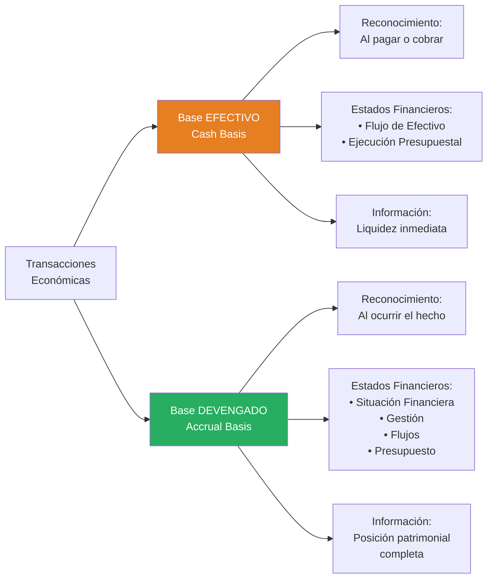
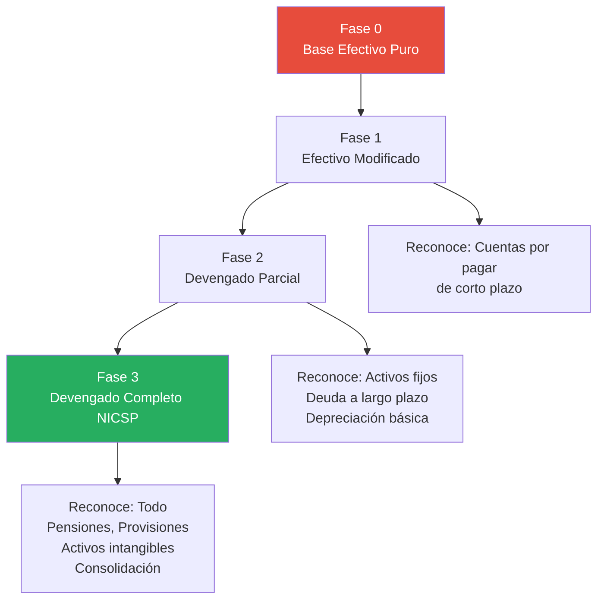

# Base Devengado en el Sector Público

## Resumen

La base contable de devengo (accrual basis) en el sector público implica reconocer transacciones y eventos cuando ocurren, independientemente del momento de pago o cobro, permitiendo revelar la situación financiera completa del gobierno (activos totales, pasivos, patrimonio neto) en contraste con la base de efectivo que solo registra flujos de caja, facilitando mejor rendición de cuentas y sostenibilidad fiscal.

## Definición / Texto Normativo

**Marco Conceptual NICSP (2014) - Párrafo 5.2:**

> "Bajo la base contable de devengo, los elementos de los estados financieros se reconocen cuando satisfacen las definiciones y los criterios de reconocimiento para esos elementos contenidos en el Marco Conceptual."

**IPSAS 1 - Presentación de Estados Financieros, párrafo 27:**

> "Una entidad elaborará sus estados financieros, excepto para la información de flujos de efectivo, utilizando la **base contable de devengo**."

**Definición operativa (Párrafo 28):**

> "Con el principio contable de devengo, las transacciones y otros hechos se reconocen cuando ocurren (y no cuando se recibe o paga dinero en efectivo o su equivalente). Por consiguiente, las transacciones y otros hechos se registran en los libros contables y se presentan en los estados financieros de los periodos con los que se relacionan."

**Contraste con Base de Efectivo (Cash Basis):**

**Handbook IPSASB - Guía de Contabilidad en Base Efectivo (2017):**

> "Bajo la base de efectivo, las transacciones y otros hechos se reconocen únicamente cuando se recibe o paga efectivo o su equivalente."

## Desarrollo / Interpretación

### Comparación: Base Devengado vs Base Efectivo



### Tabla Comparativa Detallada

| Aspecto                        | Base Efectivo                    | Base Devengado                                                                  |
| ------------------------------ | -------------------------------- | ------------------------------------------------------------------------------- |
| **Reconocimiento de ingresos** | Cuando se recibe el dinero       | Cuando se gana el derecho (devengo)                                             |
| **Reconocimiento de gastos**   | Cuando se paga el dinero         | Cuando se incurre en la obligación                                              |
| **Activos reconocidos**        | Solo efectivo y equivalentes     | Todos los activos (efectivo, cuentas por cobrar, inventarios, PPE, intangibles) |
| **Pasivos reconocidos**        | Solo deudas pagadas              | Todos los pasivos (cuentas por pagar, deuda, pensiones, provisiones)            |
| **Patrimonio neto**            | No se calcula                    | Se calcula: Activos - Pasivos                                                   |
| **Depreciación**               | No se reconoce                   | Se reconoce anualmente                                                          |
| **Provisiones**                | No se reconocen                  | Se reconocen (ej. juicios, garantías)                                           |
| **Información revelada**       | ¿Cuánto dinero entró/salió?      | ¿Cuál es la posición financiera total? ¿Cuánto se debe? ¿Qué se posee?          |
| **Enfoque temporal**           | Corto plazo (año fiscal)         | Corto y largo plazo                                                             |
| **Complejidad técnica**        | Baja (similar a cuenta bancaria) | Alta (requiere juicios profesionales)                                           |
| **Utilidad para**              | Control de liquidez inmediata    | Sostenibilidad fiscal, toma de decisiones, rendición de cuentas completa        |

### Ejemplo Ilustrativo Completo: Hospital Público

**Situación:**
Un hospital público enfrenta las siguientes transacciones en diciembre 2024:

1. **Compra de medicamentos:** S/. 100,000 (recibidos el 15/12, factura con vencimiento 30/01/2025)
2. **Salarios de médicos:** S/. 500,000 devengados en diciembre (pagados el 05/01/2025)
3. **Compra de ambulancia:** S/. 300,000 (pagada en diciembre 2024, vida útil 10 años)
4. **Consultas médicas:** Pacientes atendidos en diciembre S/. 80,000 (cobro de seguros en enero 2025)
5. **Vacaciones no tomadas:** Personal tiene derecho acumulado de S/. 120,000 (a pagar en años futuros)

**Registros contables bajo cada base:**

#### **Base Efectivo (Registros en diciembre 2024):**

```
Diciembre 2024:

1. Medicamentos: NO SE REGISTRA (no se pagó aún)
2. Salarios: NO SE REGISTRA (se pagarán en enero)
3. Ambulancia:
   Gasto - Compra Ambulancia     300,000
       Banco                            300,000
4. Consultas: NO SE REGISTRA (no se cobró aún)
5. Vacaciones: NO SE REGISTRA (no se pagaron)

ESTADO DE FLUJOS DE EFECTIVO (diciembre 2024):
Salidas:
  Compra ambulancia                (300,000)
Entradas:                                   0
FLUJO NETO:                         (300,000)
```

**Información revelada bajo base efectivo:**

- El hospital gastó S/. 300,000 en efectivo en diciembre
- **NO se muestra:**
  - Deuda de S/. 100,000 por medicamentos
  - Deuda de S/. 500,000 por salarios
  - Ambulancia como activo (aparece como gasto consumido)
  - Derecho a cobrar S/. 80,000 por consultas
  - Pasivo de S/. 120,000 por vacaciones

#### **Base Devengado (Registros en diciembre 2024):**

```
Diciembre 2024:

1. Compra de medicamentos (recibidos):
   Inventario - Medicamentos      100,000
       Cuentas por Pagar                 100,000

   Consumo de medicamentos (pacientes):
   Gasto - Medicamentos           100,000
       Inventario - Medicamentos         100,000

2. Salarios devengados:
   Gasto - Personal               500,000
       Salarios por Pagar                500,000

3. Ambulancia:
   Activo - Vehículos             300,000
       Banco                             300,000

   Depreciación mes (300,000/10 años/12):
   Gasto - Depreciación             2,500
       Depreciación Acumulada             2,500

4. Consultas devengadas:
   Cuentas por Cobrar              80,000
       Ingreso - Servicios Médicos        80,000

5. Provisión vacaciones:
   Gasto - Beneficios Empleados   120,000
       Provisión Vacaciones              120,000
```

**ESTADO DE SITUACIÓN FINANCIERA (31/12/2024):**

```
ACTIVOS:
  Cuentas por Cobrar               80,000
  Vehículos                       300,000
  Depreciación Acumulada           (2,500)
TOTAL ACTIVOS                     377,500

PASIVOS:
  Cuentas por Pagar               100,000
  Salarios por Pagar              500,000
  Provisión Vacaciones            120,000
TOTAL PASIVOS                     720,000

ACTIVOS NETOS (Déficit)          (342,500)
```

**ESTADO DE GESTIÓN (diciembre 2024):**

```
INGRESOS:
  Servicios Médicos                80,000

GASTOS:
  Medicamentos                    100,000
  Personal                        500,000
  Beneficios Empleados            120,000
  Depreciación                      2,500
TOTAL GASTOS                      722,500

DÉFICIT DEL PERIODO              (642,500)
```

**Información revelada bajo base devengado:**

- El hospital tiene **pasivos de S/. 720,000** que deberá pagar
- Posee **activos por S/. 377,500**
- Patrimonio neto **negativo** (déficit acumulado)
- Gastó **S/. 722,500** en términos económicos (no solo efectivo)
- Generó ingresos devengados de **S/. 80,000**

**Conclusión del ejemplo:**

- **Base efectivo** muestra solo que se gastó S/. 300,000 en efectivo
- **Base devengado** revela la **situación financiera real**: el hospital tiene más deudas que activos y opera con déficit

### Ventajas de la Base Devengado en el Sector Público

#### **1. Visibilidad Completa del Patrimonio Público**

**Problema con base efectivo:**
No revela el valor total de activos que posee el Estado (edificios, carreteras, equipos).

**Solución con base devengado:**
Estado de Situación Financiera muestra:

- Infraestructura: S/. 500,000 millones
- Edificios públicos: S/. 150,000 millones
- Equipamiento: S/. 80,000 millones

**Utilidad:**

- Decisiones sobre mantenimiento vs reemplazo
- Valoración del patrimonio nacional
- Protección contra corrupción (activos no registrados = posible apropiación indebida)

#### **2. Reconocimiento de Pasivos a Largo Plazo**

**Problema con base efectivo:**
Pensiones futuras de funcionarios públicos no aparecen hasta que se pagan.

**Ejemplo:**

```
Base efectivo:
  Año 2024: No registra nada (empleado activo, no cobró pensión)
  Año 2045: Gasto S/. 50,000 (empleado jubilado cobra)

Base devengado:
  Año 2024: Reconoce pasivo actuarial S/. 800,000
            (valor presente de pensión futura)
  Año 2045: Disminuye pasivo al pagar S/. 50,000
```

**Utilidad:**

- Evaluar sostenibilidad fiscal a largo plazo
- Planificar reformas de pensiones
- Transparencia intergeneracional (generación actual no traspasa deuda oculta a futuras)

#### **3. Medición del Costo Real de Servicios Públicos**

**Problema con base efectivo:**
Costo de un servicio = solo efectivo desembolsado ese año

**Ejemplo: Costo de educación en una escuela pública**

```
Base efectivo (año 2024):
  Salarios pagados:           S/. 1,000,000
  Materiales pagados:         S/.   200,000
  TOTAL COSTO:                S/. 1,200,000

Base devengado (año 2024):
  Salarios devengados:        S/. 1,000,000
  Materiales consumidos:      S/.   200,000
  Depreciación edificio:      S/.    50,000
  Depreciación equipos:       S/.    30,000
  Provisión mantenimiento:    S/.    40,000
  TOTAL COSTO REAL:           S/. 1,320,000
```

**Utilidad:**

- Comparar eficiencia entre escuelas
- Calcular costo por estudiante real
- Presupuestar recursos adecuadamente

#### **4. Información para Sostenibilidad Fiscal**

**Indicadores posibles SOLO con base devengado:**

| Indicador                | Fórmula                                                | Interpretación                   |
| ------------------------ | ------------------------------------------------------ | -------------------------------- |
| **Deuda Neta / PBI**     | (Pasivos totales - Activos financieros líquidos) / PBI | Vulnerabilidad fiscal            |
| **Activos Netos / Hab.** | (Activos - Pasivos) / Población                        | Patrimonio per cápita del Estado |
| **Ratio de Liquidez**    | Activo Corriente / Pasivo Corriente                    | Capacidad de pago corto plazo    |
| **Cobertura de Activos** | Activos No Financieros / Deuda Total                   | Respaldo patrimonial de deuda    |

**Ejemplo práctico:**
FMI requiere a países con alta deuda pública presentar estados financieros en base devengo para evaluar **sostenibilidad fiscal**. Base efectivo oculta pasivos contingentes, pensiones, garantías estatales.

### Desafíos de Implementar Base Devengado

#### **1. Complejidad Técnica**

**Requiere:**

- Contadores con capacitación avanzada
- Juicios profesionales (estimaciones de vida útil, provisiones, deterioro)
- Sistemas informáticos sofisticados

**Ejemplo de juicio profesional:**
"¿Cuál es la vida útil de una carretera? ¿20, 30, 50 años? Depende de mantenimiento, tráfico, clima..."

#### **2. Costo de Implementación**

**Inversión inicial (caso típico gobierno nacional):**

- Inventario físico de activos: USD 10-20 millones
- Sistemas informáticos (SIAF adaptado): USD 5-10 millones
- Capacitación de personal: USD 2-5 millones
- Valoración actuarial de pensiones: USD 1-3 millones
- **Total:** USD 18-38 millones

**Contraargumento:** Beneficio de transparencia fiscal supera el costo (según estudios FMI, Banco Mundial)

#### **3. Resistencia Cultural y Política**

**Objeciones frecuentes:**

- "Base efectivo es más simple y ha funcionado por décadas"
- "Los políticos no entienden contabilidad compleja"
- "Revelar pasivos altos (pensiones) genera pánico fiscal"

**Respuesta:**

- Transparencia es obligación democrática
- Información simplificada puede prepararse para ciudadanos
- Ocultar pasivos no los hace desaparecer; solo posterga el problema

#### **4. Riesgo de Manipulación**

**Problema:**
Base devengado requiere estimaciones que pueden manipularse políticamente.

**Ejemplo:**

```
Gobierno optimista:
  Vida útil carreteras: 50 años
  Depreciación anual: S/. 20,000 (bajo)

Gobierno conservador:
  Vida útil carreteras: 20 años
  Depreciación anual: S/. 50,000 (alto)

Impacto: Gobierno optimista muestra mejor resultado fiscal
```

**Mitigación:**

- Auditoría externa (Contraloría)
- Normas técnicas claras (NICSP)
- Revelación de supuestos en notas

### Transición de Efectivo a Devengado: Proceso

**Fases de adopción (modelo IPSASB):**



**Ejemplo: Transición en Perú (2019-2024)**

| Año           | Fase                | Entidades                         | Principales logros                                           |
| ------------- | ------------------- | --------------------------------- | ------------------------------------------------------------ |
| **2008-2018** | Efectivo modificado | Todas                             | Registro de compromisos presupuestales                       |
| **2019-2020** | Devengado NICSP     | Gobierno Nacional (218 entidades) | Reconocimiento de PPE, inventarios, cuentas por cobrar/pagar |
| **2021-2023** | Devengado NICSP     | + Gobiernos Regionales (26)       | Inclusión de pasivos laborales (vacaciones, CTS)             |
| **2023-2024** | Devengado NICSP     | + Gobiernos Locales (1,873)       | Universalización, primera Cuenta General completa en NICSP   |

**Desafíos específicos identificados en Perú:**

- 380,000 millones de soles en activos no registrados (principalmente infraestructura)
- 245,000 millones de soles en pasivos por pensiones no reconocidos previamente
- Necesidad de inventario físico de 2,267 entidades públicas

### Base Devengado vs Base Efectivo: ¿Cuándo Usar Cada Una?

**Recomendaciones IPSASB:**

**Usar Base DEVENGADO (NICSP) para:**

- Estados financieros con propósito general (rendición de cuentas)
- Cuenta General de la República
- Evaluación de sostenibilidad fiscal
- Consolidación a nivel gobierno general

**Usar Base EFECTIVO (o efectivo modificado) para:**

- Gestión de tesorería diaria
- Control de liquidez inmediata
- Presupuesto (autorización de gasto)
- Entidades muy pequeñas (municipalidades rurales < 5,000 habitantes)

**Conclusión:** No son excluyentes; son **complementarias**.

**Sistema dual peruano (desde 2019):**

- **Contabilidad patrimonial:** Base devengado (NICSP) → Estados financieros
- **Contabilidad presupuestal:** Base efectivo modificado → Ejecución presupuestal

Ambos registros coexisten en el SIAF y se presentan en estados financieros distintos.

## Conexiones

- [[marco-conceptual-nicsp]] - Fundamento conceptual de la base devengado
- [[contabilidad-gubernamental-peru]] - Sistema peruano implementa base devengado desde 2019
- [[diferencias-nicsp-niif]] - Ambos marcos usan base devengado pero con adaptaciones
- [[objetivos-estados-financieros-sector-publico]] - Base devengado permite cumplir objetivos de rendición de cuentas
- [[transparencia-rendicion-cuentas]] - Base devengado es esencial para transparencia completa

## Ejemplos Resueltos

### Ejemplo 1: Reconocimiento de Impuesto (Básico)

**Situación:**
En 2024, empresas generaron renta gravable por la cual deben pagar Impuesto a la Renta de S/. 10,000 millones. El vencimiento es febrero-marzo 2025. Al 31/12/2024:

- Recaudado: S/. 1,000 millones (pagos a cuenta)
- Por cobrar: S/. 9,000 millones

**Pregunta:** ¿Cuándo y por cuánto reconocer el ingreso bajo cada base?

**Solución:**

**Base Efectivo:**

```
2024:
  Banco                      1,000,000,000
      Ingreso - Impuestos              1,000,000,000
  [Solo lo cobrado]

2025 (cuando se recauda el resto):
  Banco                      9,000,000,000
      Ingreso - Impuestos              9,000,000,000
```

**Base Devengado:**

```
2024:
  Banco                      1,000,000,000
  Cuentas por Cobrar         9,000,000,000
      Ingreso - Impuestos             10,000,000,000
  [Todo el impuesto devengado, evento imponible ocurrió en 2024]

2025 (cuando se cobra):
  Banco                      9,000,000,000
      Cuentas por Cobrar               9,000,000,000
  [Conversión de activo, no nuevo ingreso]
```

**Resultado:**

- Base efectivo: Ingreso 2024 = S/. 1,000 M, Ingreso 2025 = S/. 9,000 M
- Base devengado: Ingreso 2024 = S/. 10,000 M, Ingreso 2025 = S/. 0 M

**Lección:** Base devengado reconoce ingreso en el periodo en que se generó la renta (año de causación), no cuando se cobra.

### Ejemplo 2: Costo de Infraestructura (Avanzado)

**Caso:**
Un gobierno construyó una carretera en 2000 por USD 100 millones. Vida útil estimada: 25 años. Mantenimiento anual: USD 2 millones.

**Escenario A: Base Efectivo**

```
Año 2000:
  Gasto - Construcción Carretera    100,000,000
      Banco                                 100,000,000

Años 2001-2024 (cada año):
  Gasto - Mantenimiento               2,000,000
      Banco                                   2,000,000

Año 2024:
  Total gastado acumulado: USD 148 M (100 + 2×24)
  Activo reconocido: USD 0
```

**Escenario B: Base Devengado**

```
Año 2000:
  Activo - Infraestructura Vial     100,000,000
      Banco                                 100,000,000

Años 2001-2024 (cada año):
  Depreciación:
  Gasto - Depreciación                4,000,000
      Depreciación Acumulada                  4,000,000
      [100M / 25 años]

  Mantenimiento:
  Gasto - Mantenimiento               2,000,000
      Banco                                   2,000,000

Año 2024 (fin de año 24):
  Costo original:                   100,000,000
  Depreciación acumulada:           (96,000,000)  [24 años × 4M]
  Valor en libros:                    4,000,000

  Total gasto acumulado: USD 144 M (96M deprec. + 48M mant.)
```

**Año 2025 (fin de vida útil):**

**Decisión:** ¿Reconstruir o solo mantenimiento mayor?

**Información disponible:**

| Enfoque            | Información para decisión                                                                                                                                                                              |
| ------------------ | ------------------------------------------------------------------------------------------------------------------------------------------------------------------------------------------------------ |
| **Base efectivo**  | "La carretera costó USD 100M hace 25 años. No tenemos registro de su valor actual."                                                                                                                    |
| **Base devengado** | "Valor en libros: USD 0 (totalmente depreciada). Costo de reconstrucción: USD 180M. Alternativa: Mantenimiento mayor USD 50M extiende vida 10 años. Costo anual: USD 5M vs USD 7.2M si reconstruimos." |

**Conclusión:** Base devengado provee información para **decisión informada** de política pública.

## Ejercicios Propuestos

### Ejercicio 1: Conversión Efectivo → Devengado (Básico)

Una municipalidad usaba base efectivo y migró a base devengado en 2024. Al 31/12/2023 (último año en efectivo), tiene:

**Transacciones pendientes:**

- Salarios de diciembre 2023: S/. 500,000 (pagados 05/01/2024)
- Compra de computadoras: S/. 200,000 (recibidas 28/12/2023, pagadas 15/01/2024)
- Servicios de luz diciembre: S/. 30,000 (pagados 10/01/2024)
- Impuesto predial devengado 2023: S/. 150,000 (cobrado 60% en 2023, resto en 2024)

**Tarea:** Prepara los **asientos de apertura** al 01/01/2024 bajo base devengado, reconociendo activos/pasivos no registrados.

### Ejercicio 2: Análisis de Sostenibilidad Fiscal (Intermedio)

Descarga la Cuenta General de la República de Perú (2023) del sitio del MEF. Busca el Estado de Situación Financiera consolidado del Gobierno General.

Calcula:

1. **Activos Netos del Estado:** Activos Totales - Pasivos Totales
2. **Ratio de Endeudamiento:** Pasivos Totales / Activos Totales
3. **Pasivos por Beneficios a Empleados:** ¿Cuánto debe el Estado en pensiones futuras?
4. **Activos de Infraestructura:** ¿Cuánto valen las carreteras, puentes, edificios públicos?

Elabora un informe de 400 palabras respondiendo:

- ¿El Estado peruano tiene activos netos positivos o negativos?
- ¿Qué pasivos representan mayor riesgo fiscal?
- ¿Esta información estaría disponible bajo base efectivo? ¿Por qué no?

### Ejercicio 3: Caso de Transición (Avanzado)

**Escenario:**
Eres el Director de Contabilidad de un gobierno regional que debe implementar base devengado en 2025. Actualmente usa base efectivo.

**Inventario inicial:**

- 120 edificios (escuelas, postas médicas, oficinas) sin valor registrado
- 350 vehículos (ambulancias, patrulleros, administrativos) sin valor registrado
- Deuda bancaria: S/. 80 millones (registrada)
- Juicios laborales pendientes: S/. 25 millones (no registrados)
- Vacaciones no tomadas: Estimado S/. 12 millones (no registradas)
- Personal activo: 8,000 empleados con derecho a pensión (pasivo no calculado)

**Tarea (1,200 palabras):**

1. **Plan de Implementación (6 fases, 18 meses):**
   - Fase de inventario físico
   - Fase de valoración de activos
   - Fase de cálculo actuarial de pasivos
   - Fase de capacitación del personal
   - Fase de adaptación de sistemas
   - Fase de auditoría y certificación

2. **Problemas esperados y soluciones:**
   - ¿Cómo valorar edificios construidos hace 30 años sin registros?
   - ¿Cómo estimar pasivo de pensiones sin estudios actuariales previos?
   - ¿Qué hacer con activos "perdidos" (no se encuentran físicamente)?

3. **Impacto en Estado de Situación Financiera de apertura:**
   - Estima valor mínimo de activos a reconocer
   - Estima valor mínimo de pasivos a reconocer
   - ¿El gobierno regional tendrá patrimonio neto positivo o negativo?

4. **Justificación al Gobernador Regional:**
   - ¿Por qué es importante revelar estos pasivos "ocultos"?
   - ¿Qué riesgos hay de NO adoptar base devengado?

## Preguntas Bloom

**Nivel 1 - Recordar:** ¿Cuál es la diferencia fundamental entre base devengado y base efectivo en el momento de reconocer una transacción?

**Nivel 2 - Comprender:** Explica con tus propias palabras por qué la base devengado permite evaluar la sostenibilidad fiscal a largo plazo mejor que la base efectivo.

**Nivel 3 - Aplicar:** Un ministerio compra 100 laptops por S/. 500,000 en noviembre 2024, a pagar en enero 2025. Aplica la base devengado para determinar: (a) asientos contables en 2024, (b) asientos en 2025, (c) impacto en Estado de Situación Financiera al 31/12/2024.

**Nivel 4 - Analizar:** Compara los estados financieros de dos municipalidades: una usa base efectivo (sin autorización DGCP, incumpliendo norma) y otra usa base devengado (conforme a NICSP). Analiza qué información crítica falta en la primera que sí tiene la segunda. Da 5 ejemplos concretos.

**Nivel 5 - Evaluar:** Algunos economistas argumentan que la base devengado "infla artificialmente" los pasivos gubernamentales porque reconoce pensiones que se pagarán en 40 años, generando "pánico fiscal" innecesario. Evalúa este argumento: ¿Es válido? ¿La transparencia sobre obligaciones futuras es beneficiosa o perjudicial para la gestión pública?

**Nivel 6 - Crear:** Diseña un "Estado Financiero Híbrido" para un gobierno local que combine lo mejor de base devengado (información patrimonial completa) y base efectivo (simplicidad). Tu propuesta debe: (1) definir qué elementos se reconocen bajo cada base, (2) especificar qué decisiones requieren información devengada vs efectiva, (3) proponer formato de presentación, (4) evaluar costo-beneficio de este sistema híbrido vs adopción completa de NICSP. Extensión: 1,000 palabras.

## Base Normativa

**Normas IPSASB:**

1. **Marco Conceptual para la Información Financiera con Propósito General de las Entidades del Sector Público (2014).** Capítulo 5: Reconocimiento de elementos bajo base devengado.
2. **IPSAS 1 - Presentación de Estados Financieros (revisada 2018).** Párrafos 27-28: Obligatoriedad de base devengado.
3. **Preface to International Public Sector Accounting Standards (2023).** Párrafos 15-18: Base contable de devengado como fundamento de NICSP.

**Documentos IPSASB sobre Base Efectivo:** 4. **Financial Reporting Under the Cash Basis of Accounting (Cash Basis IPSAS, 2017).** Guía para gobiernos que aún no han adoptado base devengado. 5. **Transition to the Accrual Basis of Accounting: Guidance for Governments and Government Entities (Study 14, 2011).** Guía práctica de transición.

**Normativa Peruana:** 6. **Resolución de Contaduría N° 011-2018-EF/30.** Artículo 2°: Obligación de aplicar NICSP (base devengado) desde 2019. 7. **Directiva N° 001-2019-EF/51.01.** "Preparación y Presentación de Información Financiera y Presupuestaria del Sector Público" - Confirma base devengado.

**Literatura de Implementación:** 8. FMI (2014). "Government Finance Statistics Manual 2014". Capítulo 3: Bases contables (efectivo vs devengado). 9. OECD (2017). "Accrual Practices and Reform Experiences in OECD Countries". Paris: OECD Publishing. 10. Van der Hoek, M.P. (2005). "From Cash to Accrual Budgeting and Accounting in the Public Sector: The Dutch Experience". _Public Budgeting & Finance_, 25(1), 32-45.

## Referencias Bibliográficas y Recursos en Línea

**Sitios Oficiales:**

- **IPSASB - Accrual Basis:** https://www.ipsasb.org/focus-areas/accrual-reporting
  - Guías de implementación de base devengado
  - Casos de estudio por país
- **DGCP Perú - Base Devengado:** https://www.mef.gob.pe/es/contabilidad-publica
  - Cronograma de adopción en Perú
  - Manuales de transición

**Literatura Técnica:**

- Christiaens, J., et al. (2010). "Impact of IPSAS on Reforming Governmental Financial Information Systems: A Comparative Study". _International Review of Administrative Sciences_, 76(3), 537-554.
- Brusca, I., & Martínez, J.C. (2016). "Adopting International Public Sector Accounting Standards: A Challenge for Modernizing and Harmonizing Public Sector Accounting". _International Review of Administrative Sciences_, 82(4), 724-744.
- Chan, J.L. (2003). "Government Accounting: An Assessment of Theory, Purposes and Standards". _Public Money & Management_, 23(1), 13-20.

**Estudios de Caso:**

- Banco Mundial (2018). "Accrual Accounting in the Public Sector: Progress and Challenges". Washington: World Bank.
- FMI (2016). "Accrual Budgeting and Fiscal Policy". _IMF Working Papers_, WP/16/168.
- Nueva Zelanda Treasury (2019). "20 Years of Accrual Accounting: Lessons Learned". [País pionero, adoptó devengado en 1991]

**Comparaciones Internacionales:**

- OECD/IFAC (2017). "Accrual Practices and Reform Experiences in OECD Countries: Results of OECD/IFAC Survey on Accrual Accounting". [Encuesta a 35 países]
- PwC (2022). "Collection of Information on Public Sector Accounting Practices". [Análisis comparativo global]

**Recursos en Español:**

- AECA (2015). "Contabilidad de Devengo en el Sector Público: Retos y Oportunidades". Documentos AECA Serie Sector Público N° 3.
- Contaduría General de la Nación (Colombia) (2018). "Guía de Transición a Base Devengado". Disponible en: www.contaduria.gov.co

## Notas y Alertas

> **⚠️ Obligatoriedad Legal en Perú:** Desde 2019, la base devengado es **obligatoria** para todas las entidades públicas peruanas bajo Resolución 011-2018-EF/30. Usar base efectivo incumple normativa vigente (excepto entidades muy pequeñas con autorización específica de DGCP).

> **📌 Coexistencia con Presupuesto:** Base devengado en **contabilidad patrimonial** ≠ Base devengado en **presupuesto**. El presupuesto peruano sigue usando base efectivo modificado (compromiso devengado, pero ejecución en efectivo). Son sistemas complementarios, no contradictorios.

> **💡 Impacto en Deuda Pública:** Cuando Perú adoptó base devengado en 2019, la deuda pública revelada **aumentó significativamente** (245,000 millones en pasivos por pensiones no registrados). Esto no significa que la deuda "creció" ese año; simplemente se hizo **visible** una obligación que siempre existió pero estaba oculta.

> **🌍 Tendencia Global:** Al 2024, 89 países han adoptado o están en proceso de adoptar base devengado para contabilidad gubernamental (según encuesta IPSASB/IFAC). La tendencia es irreversible: organismos como FMI, Banco Mundial, OCDE **exigen** información en base devengado para evaluación fiscal.

> **🔍 Para Profundizar:** Si te interesa el debate académico sobre si la base devengado es "objetiva" o introduce demasiada "subjetividad" (por las estimaciones requeridas), consulta: Christensen, M. (2007). "What We Might Know (But Aren't Sure) About Public-Sector Accrual Accounting". _Australian Accounting Review_, 17(1), 51-65.

> **⚙️ Herramienta Práctica:** El IPSASB ofrece un "Accrual Readiness Assessment Tool" (herramienta de evaluación de preparación para devengo) que permite a gobiernos evaluar su capacidad técnica, legal y operativa para adoptar base devengado. Disponible gratuitamente en: https://www.ipsasb.org/accrual-readiness

---

<div style="text-align: center;">
<a href="https://notbyai.fyi">

</a>
</div>
