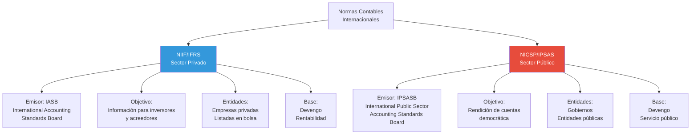
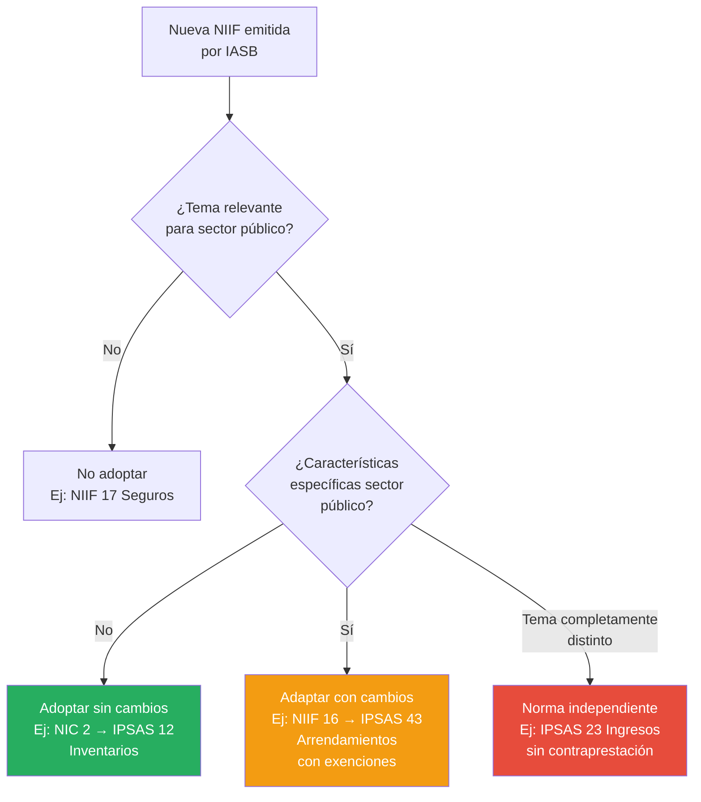

# Diferencias entre NICSP y NIIF

## Resumen

Las Normas Internacionales de Contabilidad del Sector Público (NICSP/IPSAS) y las Normas Internacionales de Información Financiera (NIIF/IFRS) comparten fundamentos conceptuales similares, pero difieren sustancialmente en objetivos, usuarios, y tratamiento de transacciones específicas del sector público (ingresos sin contraprestación, activos de servicio público, rendición de cuentas democrática), justificando la existencia de dos marcos normativos separados pero coordinados.

## Definición / Texto Normativo

**Según el Preface to International Public Sector Accounting Standards (párrafo 9):**

> "El IPSASB reconoce la importancia de desarrollar normas de contabilidad que sean coherentes con las desarrolladas por el IASB para entidades del sector privado, en la medida en que los requerimientos de las NIIF sean apropiados para el sector público. Por consiguiente, las NICSP están basadas, cuando es apropiado, en las NIIF emitidas por el IASB."

**Criterio de divergencia (párrafo 10):**

> "El IPSASB se aparta de las NIIF cuando existe una razón específica del sector público para hacerlo. Las razones para apartarse se explican en las 'Bases para las Conclusiones' que acompañan a cada NICSP."

**Marco Conceptual NICSP (Capítulo 2, párrafo 2.1) - Diferencia fundamental en objetivos:**

> "El objetivo de la información financiera con propósito general de las entidades del sector público es proporcionar información sobre la entidad que sea útil a los usuarios de los informes financieros con propósito general (IFPG) para fines de **rendición de cuentas y toma de decisiones**."

**Marco Conceptual NIIF (párrafo OB2) - Objetivo sector privado:**

> "El objetivo de la información financiera con propósito general es proporcionar información financiera sobre la entidad informante que sea útil a **inversores, prestamistas y otros acreedores** existentes y potenciales para tomar decisiones sobre el suministro de recursos a la entidad."

## Desarrollo / Interpretación

### Matriz Comparativa: NICSP vs NIIF



### Tabla Comparativa Detallada: 10 Diferencias Clave

| Aspecto                          | NIIF (Sector Privado)                    | NICSP (Sector Público)                                                              | Razón de la Diferencia                                                      |
| -------------------------------- | ---------------------------------------- | ----------------------------------------------------------------------------------- | --------------------------------------------------------------------------- |
| **1. Objetivo primario**         | Información para decisiones de inversión | Rendición de cuentas y toma de decisiones                                           | Naturaleza pública: gobierno administra recursos ciudadanos, no busca lucro |
| **2. Usuario principal**         | Inversores y acreedores                  | Ciudadanos, legisladores, organismos internacionales                                | Accountability democrático vs rentabilidad accionaria                       |
| **3. Ingresos principales**      | Transacciones de intercambio (ventas)    | Ingresos sin contraprestación (impuestos, donaciones)                               | Gobierno no "vende" servicios; recauda obligatoriamente                     |
| **4. Activos característicos**   | Inventarios, maquinaria comercial        | Infraestructura pública, patrimonio cultural, activos militares                     | Activos no generan flujos de efectivo, sino servicios públicos              |
| **5. Pasivos típicos**           | Deuda comercial, bonos corporativos      | Pensiones públicas, beneficios sociales, pasivos contingentes (garantías estatales) | Obligaciones intergeneracionales y sociales                                 |
| **6. Medición de activos**       | Énfasis en valor razonable (mercado)     | "Valor en uso" = potencial de servicio + costo de reposición                        | Muchos activos públicos no tienen mercado                                   |
| **7. Presentación presupuestal** | No requerida                             | Obligatoria: comparación Presupuesto vs Ejecutado (IPSAS 24)                        | Control legislativo sobre gasto público                                     |
| **8. Consolidación**             | Control financiero                       | Control amplio (incluye poder legislativo/regulatorio)                              | Gobierno controla entidades sin poseer "acciones"                           |
| **9. Depreciación**              | Basada en vida útil económica            | Puede incluir activos de "vida indefinida" con tratamiento especial                 | Ej: edificios históricos, parques nacionales                                |
| **10. Revelaciones**             | Foco en riesgos financieros              | Incluye sostenibilidad fiscal a largo plazo, riesgos demográficos                   | Visión intergeneracional del patrimonio público                             |

### Diferencias por Tipo de Transacción

#### **A. Ingresos: La Diferencia Más Significativa**

**NIIF 15 - Ingresos de Actividades Ordinarias procedentes de Contratos con Clientes:**

- Aplica a **transacciones de intercambio**: Cliente paga por bien/servicio
- Reconocimiento: Cuando se transfiere control del bien/servicio
- Modelo de 5 pasos: Identificar contrato → Obligaciones de desempeño → Precio → Asignar precio → Reconocer cuando se satisface

**IPSAS 23 - Ingresos de Transacciones sin Contraprestación (Impuestos y Transferencias):**

- Aplica a ingresos **sin contraprestación**: Gobierno no da nada a cambio directo
- Reconocimiento: Cuando ocurre el **evento imponible** y el gobierno tiene derecho exigible
- Ejemplos: Impuestos, multas, donaciones de otros gobiernos

**Ejemplo comparativo:**

| Transacción                        | Tratamiento NIIF                | Tratamiento NICSP                                                             |
| ---------------------------------- | ------------------------------- | ----------------------------------------------------------------------------- |
| **Impuesto a la Renta 2024**       | No aplica NIIF 15 (no es venta) | IPSAS 23: Reconocer cuando se genera la renta gravable (devengo del impuesto) |
| **Multa de tránsito**              | No cubre                        | IPSAS 23: Reconocer cuando se comete la infracción y es probable el cobro     |
| **Donación de país extranjero**    | No cubre                        | IPSAS 23: Reconocer cuando se cumplen condiciones (si las hay) o se recibe    |
| **Tarifa de licencia de conducir** | NIIF 15 (intercambio)           | IPSAS 9 (ingreso por intercambio) - Similar a NIIF                            |

**Impacto:** IPSAS 23 es una de las pocas NICSP **completamente sin equivalente** en NIIF.

#### **B. Activos: Tratamiento de Infraestructura y Patrimonio**

**NIIF (NIC 16 - Propiedad, Planta y Equipo):**

- Foco: Activos usados en producción o administración
- Medición: Costo histórico o revaluación (valor razonable)
- Objetivo: Generar beneficios económicos futuros (flujos de efectivo)

**NICSP (IPSAS 17 - Propiedad, Planta y Equipo):**

- Incluye: Activos de "infraestructura" (carreteras, puentes, redes de agua)
- Medición adicional: **"Valor en uso"** = capacidad de proveer servicios públicos
- Objetivo: Potencial de servicio (no necesariamente flujos de efectivo)

**Ejemplo: Puente público**

| Aspecto            | Tratamiento NIIF (si fuera empresa privada)              | Tratamiento NICSP (gobierno)                                                                         |
| ------------------ | -------------------------------------------------------- | ---------------------------------------------------------------------------------------------------- |
| Reconocimiento     | Sí, si genera ingresos (peaje)                           | Sí, incluso sin peaje (provee servicio de transporte)                                                |
| Medición inicial   | Costo de construcción                                    | Costo de construcción                                                                                |
| Medición posterior | Costo - Depreciación<br/>O Revaluación a valor razonable | Costo - Depreciación<br/>O Costo de reposición depreciado<br/>O Valor en uso (potencial de servicio) |
| Deterioro          | Si flujos futuros < valor en libros                      | Si potencial de servicio < valor en libros                                                           |
| Depreciación       | Sobre vida útil económica (50 años)                      | Sobre vida útil (50 años)<br/>Nota: Puede diferirse si mantenimiento restaura capacidad              |

**Particularidad NICSP:** El concepto de **"potencial de servicio"** permite reconocer activos que no generan ingresos directos pero que son esenciales para la misión gubernamental.

#### **C. Consolidación: Definición de Control**

**NIIF 10 - Estados Financieros Consolidados:**

- **Control** = Poder sobre la entidad + exposición a rendimientos variables + capacidad de usar el poder para afectar los rendimientos
- Típicamente: Poseer > 50% de acciones con derecho a voto

**IPSAS 35 - Estados Financieros Consolidados (adaptada de NIIF 10):**

- **Control** = Poder sobre la entidad + exposición a beneficios variables + capacidad de usar el poder
- Pero **"poder"** incluye:
  - Poder legislativo (aprobar presupuesto, nombrar directorio)
  - Poder regulatorio (establecer tarifas, normas operativas)
  - Poder financiero (dependencia de transferencias)
- No requiere "acciones": Gobierno controla universidades públicas, hospitales, etc., sin ser "accionista"

**Ejemplo:**
Una universidad pública nacional:

- NIIF 10: No se consolidaría si el gobierno no posee "acciones"
- IPSAS 35: **Sí se consolida** porque el gobierno:
  - Nombra al rector (poder)
  - Financia el 80% del presupuesto (exposición a beneficios)
  - Aprueba plan estratégico vía ministerio (usa el poder)

#### **D. Presentación Presupuestal: Requerimiento Único NICSP**

**NIIF:** No existe norma sobre presentación presupuestal. Empresas pueden revelar voluntariamente proyecciones vs reales.

**IPSAS 24 - Presentación de Información del Presupuesto en los Estados Financieros:**

- **Obligatoria** para gobiernos que hacen públicos sus presupuestos aprobados
- Requiere: Estado de Comparación del Presupuesto y Ejecución Real
- Tres columnas: Presupuesto Original | Presupuesto Final (con modificaciones) | Ejecución Real
- Explicar desviaciones materiales en notas

**Ejemplo: Estado de Comparación Presupuestal (formato IPSAS 24)**

```
MINISTERIO DE EDUCACIÓN
Estado de Comparación del Presupuesto y Ejecución
Año 2024 (en millones S/.)

                              Presupuesto    Presupuesto   Ejecución    Diferencia
                              Original       Final         Real         (%)

INGRESOS
Transferencias del Tesoro     30,000         32,000        31,500       -1.6%
Recursos directamente
  recaudados                    2,000          2,500         2,800      +12.0%
Donaciones                        500            600           450      -25.0%
TOTAL INGRESOS                 32,500         35,100        34,750       -1.0%

GASTOS
Personal y obligaciones         18,000         19,000        18,800      -1.1%
Bienes y servicios               8,000          9,500         9,200      -3.2%
Inversión en activos             6,000          6,000         5,900      -1.7%
TOTAL GASTOS                    32,000         34,500        33,900      -1.7%

SUPERÁVIT / (DÉFICIT)              500            600           850     +41.7%
```

**Nota explicativa requerida:**

> "La sub-ejecución en Donaciones (-25%) se debe a que el desembolso de USD 20 millones del Banco Mundial para el Programa de Infraestructura Educativa Rural se retrasó al Q1 2025 por cumplimiento de condiciones previas. La mayor recaudación en Recursos Directamente Recaudados (+12%) proviene de matrículas en programas de postgrado, que superaron proyecciones en 15%."

**Razón de la diferencia:** En democracia, el presupuesto es la **autorización legislativa** para gastar. Los estados financieros deben mostrar si el ejecutivo respetó esa autorización.

#### **E. Beneficios Sociales: Categoría Única del Sector Público**

**NIIF:** No existe categoría de "beneficios sociales". Las empresas privadas no otorgan pensiones universales, subsidios por desempleo, etc.

**IPSAS 42 - Beneficios Sociales (emitida 2019, efectiva desde 2022):**

- Define **beneficio social**: Transferencias en efectivo o en especie a individuos/hogares para mitigar riesgos sociales
- Ejemplos: Pensión 65, Juntos, Qali Warma (Perú), Bolsa Família (Brasil), Seguro de Desempleo
- Reconocimiento: Cuando el individuo cumple los criterios de elegibilidad
- Medición: Monto presente del beneficio futuro estimado

**Diferencia con IPSAS 39 (Beneficios a Empleados):**

- IPSAS 39: Beneficios a **empleados del gobierno** (pensiones de funcionarios, vacaciones)
- IPSAS 42: Beneficios a **ciudadanos en general** (programas sociales universales)

**Ejemplo: Pensión 65 en Perú**

```
IPSAS 42 - Reconocimiento contable:

Cuando una persona de 65 años cumple requisitos (pobreza extrema, sin pensión):

  Pasivo - Beneficios Sociales      X
      Gasto - Pensión 65              X

Medición del pasivo = Valor presente de:
  S/. 250/mes × 12 meses × Esperanza de vida restante (ej. 15 años)
  Descontado a tasa apropiada

Resultado: Pasivo reconocido ≈ S/. 35,000 por beneficiario
```

**Impacto fiscal:** Al reconocer estos pasivos, los estados financieros muestran el **costo fiscal a largo plazo** de programas sociales, información crucial para sostenibilidad fiscal.

### Convergencia vs Divergencia: Estrategia del IPSASB

**Matriz de decisión para adoptar/adaptar NIIF:**



**Estadística de convergencia (2024):**

- **Alto grado de convergencia (>90%):** 18 IPSAS (ej. IPSAS 12 Inventarios, IPSAS 21 Deterioro)
- **Convergencia moderada con adaptaciones (60-90%):** 15 IPSAS (ej. IPSAS 17 PPE, IPSAS 43 Arrendamientos)
- **Baja convergencia o independiente (<60%):** 11 IPSAS (ej. IPSAS 23, IPSAS 42, IPSAS 24)

### Implicaciones Prácticas de las Diferencias

**1. Para Preparadores de Estados Financieros:**

- No pueden aplicar NIIF automáticamente a entidades públicas
- Deben identificar transacciones sin contraprestación (uso IPSAS 23)
- Requieren sistemas que manejen contabilidad + presupuesto (IPSAS 24)

**2. Para Auditores:**

- Marco de referencia diferente (IPSAS, no NIIF)
- Considerar control gubernamental amplio (no solo financiero)
- Evaluar sostenibilidad fiscal a largo plazo

**3. Para Usuarios/Analistas:**

- Estados financieros gubernamentales **no** son comparables directamente con empresas
- Indicadores distintos: Deuda/PBI (gobierno) vs Deuda/EBITDA (empresa)
- Objetivo: Rendición de cuentas, no rentabilidad

**4. Para Países en Adopción:**

- No pueden "copiar y pegar" sistema contable privado
- Requieren capacitación específica en NICSP
- Deben adaptar Plan de Cuentas (ej. PCG Perú incluye cuentas presupuestales)

## Conexiones

- [[marco-conceptual-nicsp]] - Fundamento teórico de las diferencias con NIIF
- [[ipsasb-junta-normas]] - Organismo responsable de mantener coherencia con IASB
- [[objetivos-estados-financieros-sector-publico]] - Objetivo distinto justifica normas distintas
- [[antecedentes-historicos-nicsp]] - Razones históricas de la separación
- [[modernizacion-marco-normativo-nicsp]] - Proyectos de convergencia selectiva

## Ejemplos Resueltos

### Ejemplo 1: Reconocimiento de Ingreso (Básico)

**Situación:**
El 15 de diciembre de 2024, una empresa privada y un gobierno municipal reciben cada uno S/. 100,000:

- **Empresa:** Cliente paga anticipo por servicios de consultoría a prestar en enero-marzo 2025
- **Municipalidad:** Recauda impuesto predial del año 2024 (vencimiento 28 de febrero, pero contribuyente paga anticipado)

**Pregunta:** ¿Cuándo reconocer el ingreso cada uno?

**Solución:**

**Empresa (NIIF 15):**

```
15/12/2024 - Recepción del anticipo:
  Banco                     100,000
      Ingreso Diferido              100,000
  [Pasivo, no ingreso aún]

Enero-Marzo 2025 - Al prestar los servicios:
  Ingreso Diferido           100,000
      Ingreso por Servicios          100,000
  [Reconoce ingreso cuando satisface obligación]
```

**Municipalidad (IPSAS 23):**

```
15/12/2024 - Recaudación anticipada:
  Banco                     100,000
      Ingreso - Impuesto Predial     100,000
  [Ingreso inmediato: evento imponible ocurrió en 2024]

Nota: El evento imponible es "poseer el predio al 1/1/2024".
Aunque se pague en diciembre, el derecho del municipio surgió
desde enero 2024. No hay obligación de desempeño futuro.
```

**Razón de la diferencia:**

- NIIF 15: Modelo de obligaciones de desempeño (presto servicio → reconozco ingreso)
- IPSAS 23: Modelo de evento imponible (ocurre hecho generador → reconozco ingreso)

### Ejemplo 2: Consolidación de Entidad Pública (Avanzado)

**Caso:**
Un gobierno nacional tiene una relación con la "Agencia Nacional de Carreteras" (ANC) con estas características:

- Forma jurídica: Organismo Técnico Especializado (personería jurídica propia)
- Financiamiento: 90% del presupuesto proviene de transferencias del Tesoro Público
- Directorio: 5 miembros nombrados por el Ministro de Transportes
- Tarifas de peaje: Aprobadas por el Ministerio de Economía
- Utilidades: No distribuye utilidades; reinvierte en mantenimiento vial

**Pregunta:** ¿El gobierno debe consolidar los estados financieros de la ANC?

**Análisis bajo NIIF 10:**

- ¿El gobierno posee acciones con derecho a voto? **No** (no hay acciones)
- ¿Control financiero directo? **Dudoso** (la ANC tiene personería propia)
- **Conclusión NIIF 10:** Probablemente **NO** se consolidaría en sector privado

**Análisis bajo IPSAS 35:**

**1. ¿Poder sobre la ANC?** ✅ Sí

- Poder de nombramiento del directorio (control operativo)
- Poder de aprobación presupuestal (control financiero)
- Poder regulatorio sobre tarifas (control normativo)

**2. ¿Exposición a beneficios variables?** ✅ Sí

- Gobierno asume déficits si la ANC no se autofinancia
- Carreteras construidas por ANC benefician al gobierno (mejora infraestructura nacional)

**3. ¿Capacidad de usar el poder para afectar beneficios?** ✅ Sí

- Mediante designación del directorio y aprobación de presupuesto

**Conclusión IPSAS 35:** **SÍ se consolida**

**Asientos de consolidación (simplificados):**

```
Estado Financiero Individual del Gobierno:
  Inversión en ANC         0  [No hay "compra de acciones"]
  Transferencias a ANC     (90,000)  [Gasto]

Estado Financiero de la ANC:
  Activos                  500,000
  Pasivos                 (100,000)
  Patrimonio               400,000

Estado Financiero Consolidado:
  Activos                  500,000  [Se incluyen activos ANC]
  Pasivos                 (100,000)  [Se incluyen pasivos ANC]
  Patrimonio               400,000  [Ajustado]

  Eliminación de transferencias internas (90,000):
    Ingreso ANC           (90,000)  [Eliminar]
    Gasto Gobierno         90,000   [Eliminar]
    [Transacción intra-gubernamental no se cuenta dos veces]
```

**Lección:** IPSAS 35 captura la realidad del control gubernamental, que no depende de "acciones" sino de poder legislativo, financiero y regulatorio.

## Ejercicios Propuestos

### Ejercicio 1: Clasificación de Transacciones (Básico)

Clasifica cada transacción según el marco normativo aplicable:

| Transacción                                                          | ¿NIIF o NICSP? | Norma específica |
| -------------------------------------------------------------------- | -------------- | ---------------- |
| a) Venta de mercadería de una empresa retail                         |                |                  |
| b) Recaudación de IGV por SUNAT                                      |                |                  |
| c) Multa por exceso de velocidad                                     |                |                  |
| d) Tarifa de pasaporte emitido por Migraciones                       |                |                  |
| e) Donación de un país extranjero para reconstrucción post-terremoto |                |                  |
| f) Emisión de bonos soberanos del gobierno                           |                |                  |
| g) Alquiler de local para oficina ministerial                        |                |                  |

### Ejercicio 2: Análisis Comparativo (Intermedio)

Descarga los estados financieros de:

- Una empresa privada peruana listada en bolsa (ej. Alicorp, Buenaventura)
- El Ministerio de Salud del Perú (Cuenta General de la República)

Compara:

1. **Estructura de los estados financieros:**
   - ¿Ambos tienen Estado de Situación Financiera? ¿Qué diferencias ves en las cuentas principales?
   - ¿El ministerio presenta "Estado de Comparación Presupuestal"? ¿La empresa tiene algo similar?

2. **Reconocimiento de ingresos:**
   - Empresa: ¿Ingresos por ventas? ¿Cuándo se reconocen?
   - Ministerio: ¿Transferencias del Tesoro? ¿Ingresos propios? ¿Cuándo se reconocen?

3. **Activos:**
   - Empresa: Principales activos (inventarios, PPE, intangibles)
   - Ministerio: Principales activos (¿infraestructura hospitalaria?, ¿equipos médicos?)

4. **Elabora un cuadro comparativo de 400 palabras** destacando 5 diferencias clave que observaste

### Ejercicio 3: Caso Integrado - Convergencia (Avanzado)

**Escenario:**
El IASB acaba de emitir una nueva **NIIF 20: "Activos Biológicos de Largo Plazo"** (hipotética) que modifica el tratamiento de plantaciones forestales y ganado de reproducción.

Principales requerimientos NIIF 20:

- Medición a **valor razonable** (precio de mercado menos costos de venta)
- Re-medición anual con cambios en resultados
- Revelación de supuestos de valoración y análisis de sensibilidad

**Tarea:**
Como miembro del IPSASB, debes evaluar si adoptar NIIF 20 para el sector público (gobiernos que gestionan bosques nacionales, reservas naturales, programas de reforestación).

Elabora un memorándum de decisión (800 palabras) que incluya:

1. **Relevancia:** ¿Los gobiernos tienen "activos biológicos"? Ejemplos en sector público vs privado

2. **Similitudes/Diferencias contextuales:**
   - Empresas forestales: Objetivo = vender madera (lucro)
   - Bosques nacionales: Objetivo = conservación, sumidero de carbono, biodiversidad (no venta)

3. **Propuesta de tratamiento:**
   - **Opción A:** Adoptar NIIF 20 sin cambios
   - **Opción B:** Adaptar: Permitir costo histórico + costo de mantenimiento para bosques de conservación; valor razonable solo para bosques con plan de tala
   - **Opción C:** No adoptar: Mantener IPSAS 17 (PPE) para todos los activos biológicos públicos

4. **Recomendación final:** ¿Qué opción elegirías? Justifica con 3 argumentos técnicos

5. **Revelaciones adicionales:** Si adaptas, ¿qué revelaciones específicas del sector público agregarías? (ej. hectáreas reforestadas, captura de CO2, especies protegidas)

## Preguntas Bloom

**Nivel 1 - Recordar:** ¿Cuál es la NICSP que no tiene equivalente en NIIF y trata sobre ingresos sin contraprestación?

**Nivel 2 - Comprender:** Explica con tus propias palabras por qué el concepto de "control" en consolidación es más amplio en NICSP (IPSAS 35) que en NIIF (NIIF 10).

**Nivel 3 - Aplicar:** Un gobierno cobra S/. 500 por emitir una licencia de construcción que autoriza edificar por 12 meses. Aplica IPSAS 9 (ingresos de intercambio) para determinar: ¿Es ingreso sin contraprestación o de intercambio? ¿Cuándo se reconoce?

**Nivel 4 - Analizar:** Compara el tratamiento de un hospital en: (a) sistema privado (aplicando NIIF), (b) sistema público (aplicando NICSP). Analiza diferencias en: medición de equipos médicos, reconocimiento de ingresos (ventas vs subsidios estatales), consolidación si pertenece a una red.

**Nivel 5 - Evaluar:** Algunos académicos critican que las NICSP sean "demasiado similares" a NIIF, argumentando que el sector público es fundamentalmente distinto y requiere un marco completamente independiente. Otros argumentan que la convergencia es positiva para comparabilidad internacional. Evalúa ambas posiciones: ¿Hasta qué punto la convergencia es deseable? ¿Dónde trazar la línea?

**Nivel 6 - Crear:** Diseña una nueva NICSP hipotética: **"IPSAS 50 - Activos de Datos Públicos"** para regular contabilización de bases de datos gubernamentales (ej. registro de ciudadanos, catastro, datos meteorológicos). Incluye: (1) definición de activo de datos, (2) criterios de reconocimiento, (3) bases de medición apropiadas (costo de creación vs valor de uso), (4) diferencias con NIIF sobre intangibles (NIC 38), (5) revelaciones específicas sector público. Extensión: 1,000 palabras.

## Base Normativa

**Normas IPSASB:**

1. **Preface to International Public Sector Accounting Standards (2023).** Párrafos 9-14: Relación con NIIF y criterios de divergencia.
2. **Marco Conceptual para la Información Financiera con Propósito General de las Entidades del Sector Público (2014).** Capítulo 2: Objetivos y usuarios (diferencias conceptuales con Marco NIIF).
3. **IPSAS 23 - Ingresos de Transacciones sin Contraprestación (Impuestos y Transferencias) (2008).** Norma sin equivalente en NIIF.
4. **IPSAS 35 - Estados Financieros Consolidados (2015).** Bases para las Conclusiones, párrafos BC10-BC25: Diferencias con NIIF 10.
5. **IPSAS 42 - Beneficios Sociales (2019).** Norma sin equivalente en NIIF.

**Normas IASB (para comparación):** 6. **Marco Conceptual para la Información Financiera (IASB, revisado 2018).** Capítulo 1: Objetivo de la información financiera. 7. **NIIF 15 - Ingresos de Actividades Ordinarias procedentes de Contratos con Clientes (2014).** 8. **NIIF 10 - Estados Financieros Consolidados (2011).** 9. **NIC 16 - Propiedad, Planta y Equipo (revisada 2020).**

**Literatura Comparativa:** 10. IPSASB (2020). "Comparison of IPSASB's and IASB's Standards". Documento técnico comparativo norma por norma. 11. Brusca, I., & Condor, V. (2021). "IPSAS and IFRS: A Comprehensive Comparison". _Public Money & Management_, 41(3), 215-230. 12. Christiaens, J., et al. (2015). "Why Governments Adopt IPSAS: A Comparison with IFRS Adoption". _International Review of Administrative Sciences_, 81(1), 158-177.

## Referencias Bibliográficas y Recursos en Línea

**Documentos Oficiales:**

- **IPSASB - NIIF Comparison:** https://www.ipsasb.org/comparison-ipsas-ifrs
  - Tabla interactiva comparando IPSAS vs NIIF norma por norma
- **IFRS Foundation:** https://www.ifrs.org/
  - Textos completos de NIIF (para comparación)

**Análisis Técnicos:**

- PwC (2023). "IPSAS vs IFRS: Key Differences and Practical Implications". [Guía de 80 páginas]
- Deloitte (2022). "IPSAS Compared to IFRS: A Summary". [Tabla comparativa ejecutiva]
- Ernst & Young (2021). "Public Sector Financial Reporting: IPSAS Adoption and Divergence from IFRS". White Paper.

**Literatura Académica:**

- Benito, B., et al. (2007). "The Role of IPSASB in Harmonizing Government Accounting: An Institutional Perspective". _International Review of Administrative Sciences_, 73(2), 293-317.
- Caperchione, E. (2015). "Standard Setting in the Public Sector: State of the Art". En "The Routledge Companion to Accounting in Emerging Economies", pp. 421-438.
- Van der Hoek, M.P. (2005). "From Cash to Accrual Budgeting: The Dutch Experience". _Public Budgeting & Finance_, 25(1), 32-45.

**Casos de Estudio:**

- CIPFA (UK) (2019). "Applying IPSAS: Lessons from International Experience". [Incluye comparación con transición de NIIF en sector privado]
- Banco Mundial (2018). "IPSAS Adoption: Benefits and Challenges for Developing Countries". [Análisis comparativo con alternativas basadas en NIIF]

**Recursos en Español:**

- AECA (2016). "Marco Conceptual NICSP vs NIIF: Similitudes y Diferencias". Documentos AECA Serie Sector Público N° 5.
- Contaduría General de la Nación (Colombia) (2018). "Guía Comparativa NICSP-NIIF". Disponible en: www.contaduria.gov.co

## Notas y Alertas

> **⚠️ Advertencia Crítica:** Aplicar NIIF a entidades del sector público resulta en información **incompleta y potencialmente engañosa**. Ejemplo: NIIF no reconocerían impuestos devengados (solo efectivo recibido), ocultando cuentas por cobrar tributarias. Usar NIIF en gobierno viola el principio de representación fiel.

> **📌 Convergencia No Es Uniformidad:** Que IPSAS 17 "se base" en NIC 16 no significa que sean idénticas. Las diferencias (valor en uso, activos de infraestructura, patrimonio cultural) son deliberadas y reflejan características específicas del sector público.

> **💡 Error Común:** Algunos contadores creen que pueden aplicar NIIF "por analogía" cuando no existe IPSAS sobre un tema. **Incorrecto**: El Marco Conceptual NICSP (no NIIF) es la referencia cuando no hay norma específica. Si ninguno cubre el tema, se consulta al IPSASB o a la autoridad nacional (ej. DGCP en Perú).

> **🌍 Tendencia Global:** Aunque NICSP y NIIF están separadas, la tendencia es hacia **mayor convergencia** en temas comunes (instrumentos financieros, arrendamientos) y **divergencia clara** en temas específicos (ingresos sin contraprestación, consolidación, presupuesto). El IPSASB y el IASB mantienen diálogo continuo para coordinación.

> **🔍 Para Profundizar:** Si te interesa el debate filosófico sobre si la contabilidad pública y privada son "especies" distintas o solo "variaciones" de un mismo género, consulta: Carnegie, G.D., & West, B.P. (2005). "Making Accounting Accountable in the Public Sector". _Critical Perspectives on Accounting_, 16(7), 905-928.

> **⚙️ Herramienta Práctica:** El IPSASB mantiene un documento "IPSAS-IFRS Alignment Dashboard" actualizado trimestralmente que muestra el grado de convergencia de cada IPSAS con su NIIF correspondiente (cuando existe). Útil para evaluar qué conocimientos de NIIF son transferibles a NICSP. Acceso: https://www.ipsasb.org/alignment-dashboard

---

<div style="text-align: center;">
<a href="https://notbyai.fyi">

</a>
</div>
