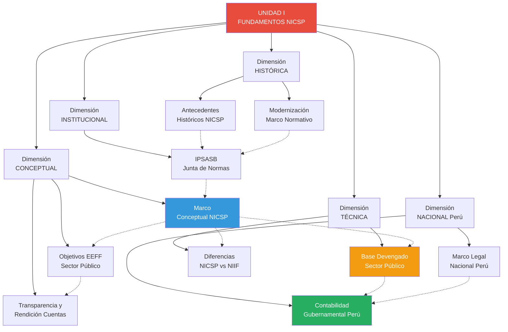

# Índice Unidad I: Fundamentos de las NICSP

## Descripción de la Unidad

La **Unidad I** cubre las semanas 1-2 del curso y establece los **fundamentos conceptuales, históricos y normativos** de las Normas Internacionales de Contabilidad del Sector Público (NICSP/IPSAS). Esta unidad prepara al estudiante para comprender:

- **Origen y evolución** del IPSASB y las NICSP
- **Marco conceptual** que sustenta todas las normas
- **Objetivos diferenciados** de la información financiera pública
- **Implementación en Perú:** marco legal y sistema contable gubernamental
- **Modernización continua** del marco normativo
- **Diferencias fundamentales** entre NICSP y NIIF
- **Principio de devengado** como base contable obligatoria
- **Transparencia y rendición de cuentas** como objetivos democráticos

Al finalizar esta unidad, el estudiante habrá construido una **base sólida** para comprender las normas específicas (Unidad II) y aplicarlas en casos prácticos.

---

## Mapa Conceptual de la Unidad I



**Lectura del mapa:**
- **Nodos rojos:** Índice principal
- **Nodos azules:** Conceptos fundamentales (Marco Conceptual)
- **Nodos verdes:** Implementación práctica (Perú)
- **Nodos naranjas:** Principios técnicos clave
- **Flechas punteadas:** Conexiones lógicas entre temas

---

## Catálogo de Notas (10 Conceptos Base)

### **Grupo A: Contexto Histórico e Institucional**

#### 1. [[antecedentes-historicos-nicsp]]
- **Tipo:** Concepto
- **Dificultad:** Básico
- **Extensión:** 3,800 palabras
- **Contenido clave:**
  - Cronología 1986-2025: PSC → IPSASB
  - Factores impulsores: crisis fiscales, globalización, exigencias FMI/BM
  - Diferencias sector público vs sector privado
  - Evolución de base efectivo a base devengado
- **Preguntas que responde:**
  - ¿Por qué se crearon las NICSP?
  - ¿Quién las emite y desde cuándo?
  - ¿Cómo evolucionó la contabilidad del sector público?
- **Conexiones:** [[ipsasb-junta-normas]], [[marco-conceptual-nicsp]], [[modernizacion-marco-normativo-nicsp]]

#### 2. [[ipsasb-junta-normas]]
- **Tipo:** Concepto
- **Dificultad:** Básico
- **Extensión:** 4,200 palabras
- **Contenido clave:**
  - Estructura organizacional: 18 miembros, CAG, PIOB
  - Proceso de emisión de normas (due process): 5 fases, 18-36 meses
  - Independencia y financiamiento
  - Relación con IFAC e IASB
- **Preguntas que responde:**
  - ¿Quién compone el IPSASB y cómo se elige?
  - ¿Cómo se aprueba una nueva NICSP?
  - ¿Qué garantiza la independencia del IPSASB?
- **Conexiones:** [[antecedentes-historicos-nicsp]], [[marco-conceptual-nicsp]], [[modernizacion-marco-normativo-nicsp]]
- **Incluye:** Diagrama Mermaid de estructura organizacional

#### 3. [[modernizacion-marco-normativo-nicsp]]
- **Tipo:** Concepto
- **Dificultad:** Intermedio
- **Extensión:** 6,000 palabras
- **Contenido clave:**
  - Agenda IPSASB 2024-2028
  - Proyectos activos: Medición, Patrimonio Cultural, Cambio Climático, Infraestructura
  - Mejoras periódicas a NICSP existentes
  - Convergencia selectiva con NIIF
- **Preguntas que responde:**
  - ¿Qué cambios vienen en las NICSP?
  - ¿Cómo afectan los nuevos proyectos a Perú?
  - ¿Por qué las NICSP se actualizan constantemente?
- **Conexiones:** [[ipsasb-junta-normas]], [[marco-conceptual-nicsp]], [[diferencias-nicsp-niif]]
- **Incluye:** Cronograma de proyectos, impacto en patrimonio cultural peruano

---

### **Grupo B: Marco Conceptual y Objetivos**

#### 4. [[marco-conceptual-nicsp]]
- **Tipo:** Concepto (⭐ FUNDAMENTAL)
- **Dificultad:** Intermedio
- **Extensión:** 5,500 palabras
- **Contenido clave:**
  - 7 capítulos del Marco Conceptual (2014)
  - Características cualitativas: relevancia, representación fiel, comparabilidad
  - Definición de elementos: activos, pasivos, ingresos, gastos, patrimonio neto
  - Criterios de reconocimiento y medición
  - Concepto de "potencial de servicio" vs "beneficios económicos"
- **Preguntas que responde:**
  - ¿Qué es un activo en el sector público?
  - ¿Cuándo se reconoce un ingreso o gasto?
  - ¿Qué hace que la información sea útil?
- **Conexiones:** [[ipsasb-junta-normas]], [[objetivos-estados-financieros-sector-publico]], [[base-devengado-sector-publico]], [[diferencias-nicsp-niif]]
- **Incluye:** Ejemplos de Machu Picchu como activo patrimonial, provisión por juicios

#### 5. [[objetivos-estados-financieros-sector-publico]]
- **Tipo:** Concepto (⭐ FUNDAMENTAL)
- **Dificultad:** Básico
- **Extensión:** 4,800 palabras
- **Contenido clave:**
  - Objetivo dual: rendición de cuentas + toma de decisiones
  - Usuarios principales: ciudadanos, legisladores, organismos internacionales
  - Diferencias con el sector privado (inversores vs accountability democrático)
  - Casos de uso: evaluación fiscal, decisiones de financiamiento
- **Preguntas que responde:**
  - ¿Para quién son los estados financieros públicos?
  - ¿En qué se diferencian de los estados financieros privados?
  - ¿Cómo se usan en democracias?
- **Conexiones:** [[marco-conceptual-nicsp]], [[transparencia-rendicion-cuentas]], [[diferencias-nicsp-niif]]
- **Incluye:** Mindmap de usuarios, ejemplos de rendición de cuentas municipal y decisiones FMI

#### 6. [[transparencia-rendicion-cuentas]]
- **Tipo:** Concepto (⭐ FUNDAMENTAL)
- **Dificultad:** Básico
- **Extensión:** 8,200 palabras
- **Contenido clave:**
  - Diferencia entre transparencia (revelar información) y accountability (responsabilidad)
  - Marco de Transparencia Fiscal del FMI (4 pilares)
  - Tipos de accountability: horizontal, vertical, diagonal
  - Rol de las NICSP en anticorrupción
  - Caso Odebrecht y transparencia de obras públicas
  - Límites de la transparencia: comprensibilidad
- **Preguntas que responde:**
  - ¿Por qué la transparencia es un objetivo de las NICSP?
  - ¿Cómo las NICSP fortalecen la democracia?
  - ¿Qué pasa cuando no hay transparencia?
- **Conexiones:** [[objetivos-estados-financieros-sector-publico]], [[marco-conceptual-nicsp]], [[base-devengado-sector-publico]], [[contabilidad-gubernamental-peru]]
- **Incluye:** Open Budget Index 2023 (Perú 31° de 120 países), caso de pasivos de pensiones revelados

---

### **Grupo C: Implementación en Perú**

#### 7. [[marco-legal-nacional-nicsp-peru]]
- **Tipo:** Concepto
- **Dificultad:** Intermedio
- **Extensión:** 5,200 palabras
- **Contenido clave:**
  - Resolución de Contaduría N° 011-2018-EF/30 (norma de adopción)
  - Cronología de implementación 2008-2024
  - Fases: Gobierno Nacional (2019), Regional (2021), Local (2023)
  - Plan Contable Gubernamental 2019 (adaptado a NICSP)
  - Conflictos normativos y jerarquía legal
- **Preguntas que responde:**
  - ¿Desde cuándo Perú aplica NICSP?
  - ¿Qué entidades están obligadas?
  - ¿Qué pasa si una entidad no cumple?
- **Conexiones:** [[antecedentes-historicos-nicsp]], [[contabilidad-gubernamental-peru]], [[modernizacion-marco-normativo-nicsp]]
- **Incluye:** Cronograma de adopción por niveles de gobierno, ejemplo de conflicto normativo

#### 8. [[contabilidad-gubernamental-peru]]
- **Tipo:** Concepto (⭐ FUNDAMENTAL PARA PERÚ)
- **Dificultad:** Intermedio
- **Extensión:** 5,600 palabras
- **Contenido clave:**
  - Sistema Nacional de Contabilidad (rectoría: DGCP)
  - SIAF: estructura, módulos, flujo integrado presupuesto-tesorería-contabilidad
  - Plan Contable Gubernamental: 9 clases, adaptación a NICSP
  - Cuenta General de la República: consolidación de 2,267 entidades
  - Diferencia entre contabilidad patrimonial (NICSP) y presupuestal (efectivo modificado)
- **Preguntas que responde:**
  - ¿Cómo funciona la contabilidad gubernamental en Perú?
  - ¿Qué es el SIAF y por qué es importante?
  - ¿Cómo se consolidan los estados financieros de todo el Estado?
- **Conexiones:** [[marco-legal-nacional-nicsp-peru]], [[base-devengado-sector-publico]], [[transparencia-rendicion-cuentas]]
- **Incluye:** Diagrama de flujo integrado SIAF, estructura del Plan Contable Gubernamental, proceso de consolidación

---

### **Grupo D: Principios Técnicos Clave**

#### 9. [[base-devengado-sector-publico]]
- **Tipo:** Concepto (⭐ FUNDAMENTAL TÉCNICO)
- **Dificultad:** Intermedio
- **Extensión:** 7,800 palabras
- **Contenido clave:**
  - Definición IPSAS 1: reconocer transacciones cuando ocurren (no cuando se pagan)
  - Comparación detallada base efectivo vs base devengado
  - Ventajas: visibilidad patrimonial, pasivos a largo plazo, costo real de servicios
  - Desafíos: complejidad técnica, costo de implementación, resistencia cultural
  - Transición en Perú: fases 2019-2024, impacto en revelación de S/. 245,000 M en pasivos de pensiones
- **Preguntas que responde:**
  - ¿Qué significa "base devengado"?
  - ¿Por qué es mejor que base efectivo para el sector público?
  - ¿Qué problemas resuelve y qué desafíos trae?
- **Conexiones:** [[marco-conceptual-nicsp]], [[contabilidad-gubernamental-peru]], [[diferencias-nicsp-niif]], [[transparencia-rendicion-cuentas]]
- **Incluye:** Ejemplo completo de hospital público (medicamentos, salarios, ambulancia, consultas, vacaciones), tabla comparativa 10 aspectos

#### 10. [[diferencias-nicsp-niif]]
- **Tipo:** Concepto (⭐ FUNDAMENTAL TÉCNICO)
- **Dificultad:** Avanzado
- **Extensión:** 6,500 palabras
- **Contenido clave:**
  - Matriz comparativa NICSP vs NIIF con diagrama Mermaid
  - 10 diferencias clave tabuladas
  - Análisis por tipo: ingresos sin contraprestación (IPSAS 23), activos (potencial de servicio), consolidación (control ampliado), presupuesto (IPSAS 24), beneficios sociales (IPSAS 42)
  - Estrategia de convergencia selectiva del IPSASB
  - Por qué no se puede simplemente "copiar" NIIF al sector público
- **Preguntas que responde:**
  - ¿En qué se diferencian NICSP y NIIF?
  - ¿Por qué el sector público necesita normas propias?
  - ¿Qué NICSP no tienen equivalente en NIIF?
- **Conexiones:** [[marco-conceptual-nicsp]], [[ipsasb-junta-normas]], [[objetivos-estados-financieros-sector-publico]], [[modernizacion-marco-normativo-nicsp]]
- **Incluye:** Ejemplo de reconocimiento de ingresos (empresa vs municipalidad), consolidación de ente público

---

## Rutas de Aprendizaje Sugeridas

### **Ruta 1: Secuencia Lineal (Principiante)**
*Para estudiantes sin conocimiento previo de contabilidad pública*

```
1. [[antecedentes-historicos-nicsp]]
   ↓ Contexto: ¿Por qué existen las NICSP?
   
2. [[ipsasb-junta-normas]]
   ↓ Institución: ¿Quién las emite?
   
3. [[objetivos-estados-financieros-sector-publico]]
   ↓ Propósito: ¿Para qué sirven los EEFF públicos?
   
4. [[transparencia-rendicion-cuentas]]
   ↓ Objetivo democrático: ¿Por qué es importante?
   
5. [[marco-conceptual-nicsp]]
   ↓ Fundamento: ¿Qué conceptos rigen todas las NICSP?
   
6. [[base-devengado-sector-publico]]
   ↓ Técnica: ¿Cómo se registran las transacciones?
   
7. [[diferencias-nicsp-niif]]
   ↓ Diferenciación: ¿En qué se diferencia del sector privado?
   
8. [[marco-legal-nacional-nicsp-peru]]
   ↓ Contexto nacional: ¿Cómo se aplica en Perú?
   
9. [[contabilidad-gubernamental-peru]]
   ↓ Sistema práctico: ¿Cómo funciona el SIAF?
   
10. [[modernizacion-marco-normativo-nicsp]]
    ↓ Futuro: ¿Qué cambios vienen?
```

**Tiempo estimado:** 10-12 horas de estudio (1 hora por nota + ejercicios)

---

### **Ruta 2: Enfoque Conceptual Primero (Intermedio)**
*Para estudiantes con conocimiento de contabilidad privada (NIIF)*

```
1. [[marco-conceptual-nicsp]] ⭐ INICIO AQUÍ
   ↓ Base teórica sólida
   
2. [[diferencias-nicsp-niif]]
   ↓ Contraste con conocimiento previo (NIIF)
   
3. [[objetivos-estados-financieros-sector-publico]]
   ↓ Usuarios y propósito diferenciado
   
4. [[base-devengado-sector-publico]]
   ↓ Principio técnico fundamental
   
5. [[antecedentes-historicos-nicsp]]
   ↓ Contexto histórico (rápido)
   
6. [[ipsasb-junta-normas]]
   ↓ Gobernanza (rápido)
   
7. [[contabilidad-gubernamental-peru]]
   ↓ Aplicación práctica en Perú
   
8. [[marco-legal-nacional-nicsp-peru]]
   ↓ Marco regulatorio nacional
   
9. [[transparencia-rendicion-cuentas]]
   ↓ Impacto social y político
   
10. [[modernizacion-marco-normativo-nicsp]]
    ↓ Tendencias futuras
```

**Tiempo estimado:** 8-10 horas (puedes omitir algunos ejemplos básicos)

---

### **Ruta 3: Enfoque Peruano (Aplicación Práctica)**
*Para funcionarios públicos o auditores que necesitan aplicar NICSP en Perú*

```
1. [[marco-legal-nacional-nicsp-peru]] ⭐ INICIO AQUÍ
   ↓ Obligación legal, plazos
   
2. [[contabilidad-gubernamental-peru]]
   ↓ SIAF, Plan Contable Gubernamental
   
3. [[base-devengado-sector-publico]]
   ↓ Técnica contable obligatoria
   
4. [[marco-conceptual-nicsp]]
   ↓ Fundamento de todas las normas
   
5. [[transparencia-rendicion-cuentas]]
   ↓ Objetivo de la información (Contraloría, Congreso)
   
6. [[diferencias-nicsp-niif]]
   ↓ No confundir con contabilidad privada
   
7. [[objetivos-estados-financieros-sector-publico]]
   ↓ Usuarios y propósito
   
8. [[ipsasb-junta-normas]]
   ↓ Autoridad emisora
   
9. [[antecedentes-historicos-nicsp]]
   ↓ Contexto global
   
10. [[modernizacion-marco-normativo-nicsp]]
    ↓ Cambios futuros que afectarán tu trabajo
```

**Tiempo estimado:** 8-10 horas + práctica en SIAF

---

## Matriz de Interdependencias

Esta matriz muestra qué notas son **prerrequisito** de otras:

| Nota | Prerrequisitos recomendados | Es prerrequisito de |
|------|----------------------------|---------------------|
| [[antecedentes-historicos-nicsp]] | Ninguno (nivel 0) | [[ipsasb-junta-normas]], [[marco-conceptual-nicsp]] |
| [[ipsasb-junta-normas]] | [[antecedentes-historicos-nicsp]] | [[marco-conceptual-nicsp]], [[modernizacion-marco-normativo-nicsp]] |
| [[marco-conceptual-nicsp]] | [[ipsasb-junta-normas]] | TODAS las demás (⭐ FUNDAMENTAL) |
| [[objetivos-estados-financieros-sector-publico]] | [[marco-conceptual-nicsp]] | [[transparencia-rendicion-cuentas]] |
| [[transparencia-rendicion-cuentas]] | [[objetivos-estados-financieros-sector-publico]] | Unidad II (aplicación) |
| [[marco-legal-nacional-nicsp-peru]] | [[antecedentes-historicos-nicsp]] | [[contabilidad-gubernamental-peru]] |
| [[contabilidad-gubernamental-peru]] | [[marco-legal-nacional-nicsp-peru]], [[base-devengado-sector-publico]] | Unidad II (aplicación en SIAF) |
| [[base-devengado-sector-publico]] | [[marco-conceptual-nicsp]] | [[contabilidad-gubernamental-peru]], Unidad II |
| [[diferencias-nicsp-niif]] | [[marco-conceptual-nicsp]] | Unidad II (para no confundir) |
| [[modernizacion-marco-normativo-nicsp]] | [[ipsasb-junta-normas]] | Unidad II (normas recientes) |

**Nivel de profundidad:**
- **Nivel 0 (base):** [[antecedentes-historicos-nicsp]]
- **Nivel 1:** [[ipsasb-junta-normas]], [[marco-legal-nacional-nicsp-peru]]
- **Nivel 2:** [[marco-conceptual-nicsp]] ⭐
- **Nivel 3:** Todas las demás

---

## Recursos Complementarios por Nota

### Documentos IPSASB oficiales (gratuitos):
- **Para todas las notas:** *Preface to International Public Sector Accounting Standards* (2023) → www.ipsasb.org/publications/preface
- **Para [[marco-conceptual-nicsp]]:** *Conceptual Framework for General Purpose Financial Reporting by Public Sector Entities* (2014) → www.ipsasb.org/publications/conceptual-framework
- **Para [[ipsasb-junta-normas]]:** *IPSASB 2024-2028 Strategy* → www.ipsasb.org/about-ipsasb/strategy

### Documentos oficiales Perú:
- **Para [[marco-legal-nacional-nicsp-peru]]:** Resolución de Contaduría N° 011-2018-EF/30 (texto completo) → www.mef.gob.pe/es/contabilidad-publica
- **Para [[contabilidad-gubernamental-peru]]:** Plan Contable Gubernamental 2019 + Instructivos → www.mef.gob.pe/es/plan-contable-gubernamental
- **Para [[transparencia-rendicion-cuentas]]:** Portal de Transparencia Económica → transparencia-economica.mef.gob.pe

### Videos educativos:
- **IFAC - Introduction to IPSAS** (15 min, inglés con subtítulos): www.youtube.com/ifac
- **MEF Perú - SIAF Explicado** (serie 5 videos, 30 min total): www.youtube.com/ministeriodeeconomia

### Lecturas académicas recomendadas:
- Christiaens, J., et al. (2010). "Impact of IPSAS on Governmental Financial Systems". *International Review of Administrative Sciences*, 76(3), 537-554.
- Chan, J.L. (2003). "Government Accounting: An Assessment of Theory, Purposes and Standards". *Public Money & Management*, 23(1), 13-20.

---

## Preguntas Frecuentes (FAQ)

### 1. ¿En qué orden debo leer las notas?
**Respuesta:** Depende de tu perfil:
- **Principiante sin conocimiento previo:** Usa **Ruta 1** (lineal)
- **Tienes conocimiento de NIIF:** Usa **Ruta 2** (conceptual primero)
- **Funcionario público en Perú:** Usa **Ruta 3** (enfoque peruano)

### 2. ¿Cuánto tiempo toma completar la Unidad I?
**Respuesta:** 
- **Lectura superficial:** 5-6 horas (solo leer notas)
- **Estudio profundo:** 10-12 horas (leer + hacer ejercicios)
- **Dominio completo:** 15-18 horas (leer + ejercicios + preguntas Bloom + lecturas complementarias)

### 3. ¿Debo memorizar todo el contenido?
**Respuesta:** No. Enfócate en:
- **Conceptos fundamentales:** Marco Conceptual, base devengado, diferencias NICSP/NIIF
- **Aplicación en Perú:** Marco legal, SIAF, Plan Contable Gubernamental
- **Objetivos:** Transparencia, rendición de cuentas

Los detalles históricos y de proceso puedes consultarlos cuando los necesites.

### 4. ¿Qué notas son más importantes para el examen?
**Respuesta:** Las marcadas con ⭐ FUNDAMENTAL:
- [[marco-conceptual-nicsp]]
- [[objetivos-estados-financieros-sector-publico]]
- [[transparencia-rendicion-cuentas]]
- [[contabilidad-gubernamental-peru]] (si el examen incluye Perú)
- [[base-devengado-sector-publico]]
- [[diferencias-nicsp-niif]]

### 5. ¿Puedo estudiar solo algunas notas y omitir otras?
**Respuesta:** Mínimo indispensable para entender Unidad II:
1. [[marco-conceptual-nicsp]] (OBLIGATORIO)
2. [[base-devengado-sector-publico]] (OBLIGATORIO)
3. [[diferencias-nicsp-niif]] (OBLIGATORIO)
4. [[contabilidad-gubernamental-peru]] (si vas a aplicar en Perú)

Las demás son contextuales pero recomendadas.

### 6. ¿Dónde encuentro los textos completos de las NICSP?
**Respuesta:** 
- **Inglés (oficial):** www.ipsasb.org/publications
- **Español (traducción IFAC):** www.ifac.org/knowledge-gateway (no todas están traducidas)
- **Perú (adaptadas):** www.mef.gob.pe/es/normativa-contable

### 7. ¿Las NICSP son de aplicación obligatoria en Perú?
**Respuesta:** **Sí**, desde 2019 para todas las entidades del sector público bajo Resolución 011-2018-EF/30. Ver [[marco-legal-nacional-nicsp-peru]] para detalles.

### 8. ¿Qué diferencia hay entre NICSP e IPSAS?
**Respuesta:** Son lo mismo. NICSP = Normas Internacionales de Contabilidad del Sector Público (español). IPSAS = International Public Sector Accounting Standards (inglés).

---

## Indicadores de Dominio de la Unidad I

Al finalizar esta unidad, deberías poder:

### **Nivel Básico (Aprobar):**
- ✅ Definir qué son las NICSP y quién las emite
- ✅ Explicar la diferencia entre base efectivo y base devengado
- ✅ Identificar los usuarios de los estados financieros públicos
- ✅ Describir el sistema contable gubernamental peruano (SIAF)
- ✅ Enumerar 5 diferencias entre NICSP y NIIF

### **Nivel Intermedio (Nota Notable):**
- ✅ Explicar los 7 capítulos del Marco Conceptual NICSP
- ✅ Aplicar el principio de devengado en ejercicios básicos
- ✅ Analizar casos de transparencia y rendición de cuentas
- ✅ Comparar el objetivo de EEFF públicos vs privados
- ✅ Interpretar el marco legal peruano de adopción de NICSP

### **Nivel Avanzado (Nota Sobresaliente):**
- ✅ Evaluar críticamente la adopción de NICSP en un país
- ✅ Diseñar soluciones a problemas de implementación
- ✅ Crear matrices comparativas NICSP vs NIIF con análisis profundo
- ✅ Proponer mejoras al sistema de transparencia fiscal
- ✅ Resolver casos complejos integrando múltiples conceptos

---

## Conexión con Unidad II

La **Unidad I** es la **base conceptual** que habilita la comprensión de la **Unidad II** (IPSAS específicas: activos, pasivos).

**Ejemplos de conexión:**

| Concepto Unidad I | Se aplica en Unidad II en: |
|-------------------|---------------------------|
| Base devengado | IPSAS 12 (Inventarios): Reconocer inventarios cuando se reciben, no cuando se pagan |
| Marco Conceptual: "potencial de servicio" | IPSAS 17 (PPE): Activos que generan servicios públicos, no rentabilidad |
| Diferencias NICSP/NIIF: ingresos sin contraprestación | IPSAS 23 (Ingresos): Reconocimiento de impuestos |
| Sistema SIAF | IPSAS 31 (Intangibles): Registro de software en módulo de activos SIAF |
| Transparencia | IPSAS 1 (Presentación): Revelaciones en notas para rendición de cuentas |

**Sin dominar la Unidad I, la Unidad II será incomprensible.**

---

## Checklist de Finalización

Antes de avanzar a la Unidad II, verifica:

- [ ] He leído las 10 notas de la Unidad I (al menos superficialmente)
- [ ] Puedo explicar con mis propias palabras qué son las NICSP
- [ ] Entiendo la diferencia entre base efectivo y base devengado
- [ ] Conozco el Marco Conceptual NICSP (al menos sus 7 capítulos)
- [ ] Sé cómo se aplican las NICSP en Perú (marco legal + SIAF)
- [ ] He resuelto al menos 3 ejercicios propuestos
- [ ] He respondido al menos 10 preguntas Bloom de las notas
- [ ] Puedo identificar 5 diferencias clave entre NICSP y NIIF
- [ ] Entiendo por qué la transparencia es un objetivo de los EEFF públicos
- [ ] He consultado al menos 2 recursos complementarios

**Si marcaste 8+ casillas: Estás listo para Unidad II ✅**  
**Si marcaste 5-7 casillas: Revisa las notas ⭐ FUNDAMENTALES**  
**Si marcaste < 5 casillas: Repasa la Unidad I antes de continuar ⚠️**

---

## Contacto y Soporte

**Dudas sobre conceptos:**
- Revisa las secciones "Preguntas Bloom" de cada nota (cubren las dudas más frecuentes)
- Consulta las "Notas y Alertas" al final de cada documento

**Recursos adicionales:**
- Portal IPSASB: www.ipsasb.org
- Contaduría Pública Perú: www.mef.gob.pe/es/contabilidad-publica
- Foro académico IFAC: www.ifac.org/knowledge-gateway

**Actualizaciones:**
Este índice se actualiza cuando se agregan nuevas notas o recursos a la Unidad I. Última actualización: 17 de octubre de 2025.

---

<div style="text-align: center; margin-top: 40px;">

## 🎯 Objetivo Final de la Unidad I

**"Al finalizar esta unidad, comprenderás POR QUÉ el sector público necesita normas contables propias, QUIÉN las emite, CÓMO funcionan conceptualmente, y DÓNDE se aplican en Perú. Esta base te permitirá dominar las normas específicas (Unidad II) y aplicarlas profesionalmente."**

---

**Total de palabras en Unidad I:** ~57,600 palabras  
**Total de ejemplos resueltos:** 20+  
**Total de ejercicios propuestos:** 30+  
**Total de preguntas Bloom:** 60  
**Total de diagramas Mermaid:** 8

---

**Próximo paso:** [[indice-unidad-II-nicsp-especificas]] (cuando esté disponible)

</div>

---

<div style="text-align: center;">
<a href="https://notbyai.fyi">

</a>
</div>
