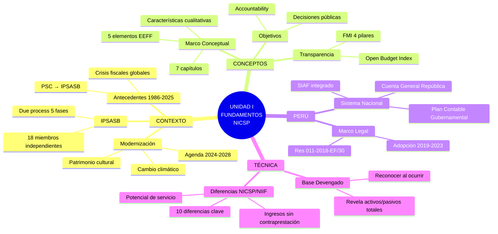

# Resumen Ejecutivo: Unidad I - Fundamentos NICSP

## 🎯 Objetivo de este Resumen

Síntesis de las **10 notas fundamentales** de la Unidad I en formato ejecutivo para:
- ✅ **Repaso rápido** antes de examen (30-40 minutos)
- ✅ **Consulta express** de conceptos clave
- ✅ **Verificación** de dominio de contenidos esenciales

**No reemplaza** la lectura completa de las notas. Úsalo como **complemento**.

---

## 📊 Mapa Mental de la Unidad I



---

## 🔑 10 Conceptos Clave (1 por nota)

### 1. [[antecedentes-historicos-nicsp]] → **Origen y Evolución**

**Idea central:** Las NICSP nacieron en 1986 (PSC) y evolucionaron con el IPSASB (2004) para estandarizar la contabilidad gubernamental globalmente, impulsadas por crisis fiscales, exigencias del FMI/BM y la globalización.

**Dato clave:** 89 países han adoptado o están adoptando NICSP (2024).

**Hito importante:** Transición de base efectivo (mayoritaria hasta 2000s) a base devengado (estándar actual).

---

### 2. [[ipsasb-junta-normas]] → **Gobernanza e Independencia**

**Idea central:** El IPSASB es un organismo independiente de 18 miembros (nominación geográfica diversa) supervisado por el CAG y PIOB, que emite NICSP mediante un proceso transparente de 5 fases (18-36 meses) con consulta pública obligatoria.

**Dato clave:** Mayoría de 2/3 (12 de 18 votos) para aprobar una NICSP.

**Protección clave:** PIOB (Public Interest Oversight Board) garantiza que no hay captura por intereses políticos o comerciales.

---

### 3. [[marco-conceptual-nicsp]] → **Fundamento de Todo** ⭐

**Idea central:** El Marco Conceptual (2014) es la "constitución" de las NICSP. Define 7 capítulos esenciales:

1. **Rol y autoridad:** Base para desarrollar todas las NICSP
2. **Objetivos y usuarios:** Accountability + decisiones
3. **Características cualitativas:** Relevancia, representación fiel, comparabilidad, comprensibilidad
4. **Entidad informante:** ¿Quién prepara EEFF?
5. **Elementos:** Activo, pasivo, ingreso, gasto, patrimonio neto
6. **Reconocimiento:** ¿Cuándo incluir en EEFF?
7. **Medición:** Costo histórico, valor razonable, costo de reposición, etc.

**Concepto único NICSP:** **Potencial de servicio** (activos que proveen servicios públicos sin generar flujos de efectivo). Ejemplo: Parques, carreteras, escuelas.

**Aplicación:** Todas las NICSP específicas derivan de este Marco.

---

### 4. [[objetivos-estados-financieros-sector-publico]] → **Para Quién y Para Qué**

**Idea central:** Los EEFF del sector público tienen **objetivo dual**:
1. **Rendición de cuentas (accountability):** Demostrar que recursos públicos se usaron responsablemente
2. **Toma de decisiones:** Información útil para legisladores, ciudadanos, FMI, inversores en bonos soberanos

**Diferencia clave con sector privado:**

| Sector Privado (NIIF) | Sector Público (NICSP) |
|----------------------|------------------------|
| Usuarios: Inversores y acreedores | Usuarios: Ciudadanos, legisladores, supervisores fiscales |
| Objetivo: ¿Generará retornos financieros? | Objetivo: ¿Usó responsablemente recursos que me obligaron a contribuir? |
| Relación: Voluntaria | Relación: Involuntaria (impuestos obligatorios) |

**Implicación:** Los EEFF públicos son **instrumentos democráticos**, no solo herramientas de gestión.

---

### 5. [[transparencia-rendicion-cuentas]] → **Democracia en Acción**

**Idea central:** **Transparencia** = Revelar información completa y comprensible. **Accountability** = Responsabilidad por resultados + consecuencias por incumplimiento. Son conceptos **relacionados pero distintos**.

**Marco de Transparencia Fiscal (FMI):**
1. **Pilar I:** Reportes fiscales (cobertura, puntualidad, calidad)
2. **Pilar II:** Pronósticos fiscales (proyecciones 10+ años)
3. **Pilar III:** Gestión de riesgos (pasivos contingentes, sostenibilidad)
4. **Pilar IV:** Gestión de recursos (empresas estatales, recursos naturales)

**3 tipos de accountability:**
- **Horizontal:** Entre poderes del Estado (Ejecutivo → Legislativo)
- **Vertical:** Gobierno → Ciudadanos (audiencias públicas, portales)
- **Diagonal:** Órganos de control (Contraloría, auditorías supremas)

**Caso emblemático:** Adopción de base devengado en Perú (2019) reveló **S/. 245,000 millones** en pasivos de pensiones que eran "invisibles" bajo base efectivo.

**Open Budget Index 2023:** Perú 31° de 120 países (68/100 puntos). Fortaleza: Transparencia de datos. Debilidad: Participación ciudadana.

---

### 6. [[base-devengado-sector-publico]] → **Revolución Técnica** ⭐

**Idea central:** **Base devengado** reconoce transacciones **cuando ocurren** (no cuando se pagan). **Base efectivo** reconoce solo cuando hay flujo de caja.

**Comparación rápida:**

| Aspecto | Base Efectivo | Base Devengado |
|---------|---------------|----------------|
| ¿Cuándo reconocer ingreso? | Al cobrar | Al ganar el derecho |
| ¿Cuándo reconocer gasto? | Al pagar | Al incurrir obligación |
| ¿Activos mostrados? | Solo efectivo | Todos (efectivo, cuentas por cobrar, PPE, intangibles) |
| ¿Pasivos mostrados? | Solo deudas pagadas | Todos (deuda, pensiones, provisiones, cuentas por pagar) |
| Información | ¿Cuánto entró/salió? | ¿Cuál es la posición financiera total? |

**Ventajas clave para sector público:**
1. **Visibilidad patrimonial completa:** Revela el valor de carreteras, escuelas, hospitales
2. **Pasivos a largo plazo:** Muestra pensiones futuras, no solo pagos actuales
3. **Costo real de servicios:** Incluye depreciación, no solo efectivo desembolsado
4. **Sostenibilidad fiscal:** Permite calcular deuda neta, patrimonio neto, ratios de solvencia

**Desafíos:**
- Complejidad técnica (requiere juicios profesionales)
- Costo de implementación (inventario de activos, valoración)
- Resistencia política (revela pasivos "ocultos")

**Transición Perú:** 2019 (Nacional) → 2021 (Regional) → 2023 (Local). Total: 2,267 entidades.

---

### 7. [[diferencias-nicsp-niif]] → **No Son Iguales** ⭐

**Idea central:** NICSP y NIIF comparten muchas similitudes (ambas usan base devengado, marco conceptual similar), pero tienen **10 diferencias fundamentales**:

**Top 5 diferencias:**

1. **Objetivos:**
   - NIIF: Información para decisiones de inversión/crédito
   - NICSP: Información para accountability + decisiones públicas

2. **Usuarios:**
   - NIIF: Inversores y acreedores
   - NICSP: Ciudadanos, legisladores, supervisores fiscales

3. **Ingresos sin contraprestación:**
   - NIIF: No existen (todas las transacciones son intercambios comerciales)
   - NICSP: Centrales (impuestos, multas, donaciones) → IPSAS 23 exclusiva

4. **Activos con potencial de servicio:**
   - NIIF: Activos deben generar beneficios económicos futuros
   - NICSP: Activos pueden generar solo potencial de servicio (sin flujos de efectivo)

5. **Presupuesto:**
   - NIIF: No requiere información presupuestaria
   - NICSP: IPSAS 24 obliga a comparar presupuesto vs ejecución en EEFF

**Otras diferencias:** Consolidación (control ampliado en NICSP), beneficios sociales (IPSAS 42), concesiones de servicio público (IPSAS 32 enfoque concedente).

**Estrategia del IPSASB:** **Convergencia selectiva** (adoptar NIIF donde sea apropiado, divergir donde el sector público lo requiera).

**Normas NICSP sin equivalente NIIF:** IPSAS 22 (Revelación sobre partes relacionadas - gobierno), IPSAS 23 (Ingresos sin contraprestación), IPSAS 24 (Presupuesto), IPSAS 42 (Beneficios sociales).

---

### 8. [[marco-legal-nacional-nicsp-peru]] → **Obligación Legal en Perú**

**Idea central:** La **Resolución de Contaduría N° 011-2018-EF/30** (30/10/2018) establece la aplicación **obligatoria** de NICSP para todas las entidades del sector público peruano.

**Cronología de implementación:**

| Fase | Año | Entidades | Cantidad |
|------|-----|-----------|----------|
| **Fase 1** | 2019 | Gobierno Nacional | 218 |
| **Fase 2** | 2021 | Gobiernos Regionales | 26 |
| **Fase 3** | 2023 | Gobiernos Locales | 1,873 |
| **Fase 4** | 2024 | Empresas estatales (seleccionadas) | 150+ |

**Autoridad rectora:** Dirección General de Contabilidad Pública (DGCP) - Ministerio de Economía y Finanzas.

**Herramienta principal:** Plan Contable Gubernamental 2019 (adaptado a NICSP).

**Jerarquía normativa:**
1. Constitución
2. Leyes (Ley General del Sistema Nacional de Contabilidad)
3. Resoluciones de Contaduría (incluye Res. 011-2018)
4. Directivas de la DGCP

**Sanción por incumplimiento:** Responsabilidad administrativa del titular de la entidad (puede llegar a destitución).

---

### 9. [[contabilidad-gubernamental-peru]] → **Sistema Práctico** ⭐

**Idea central:** Perú tiene un **Sistema Nacional de Contabilidad** integrado liderado por la DGCP, operado a través del **SIAF** (Sistema Integrado de Administración Financiera).

**Componentes del sistema:**

1. **SIAF - Módulos:**
   - Módulo Administrativo (presupuesto)
   - Módulo Contable ← **AQUÍ SE APLICAN LAS NICSP**
   - Módulo de Tesorería
   - Módulo de Deuda Pública

2. **Plan Contable Gubernamental (2019):**
   - **9 clases de cuentas:** 1-Activo, 2-Pasivo, 3-Patrimonio, 4-Ingresos, 5-Gastos, 6-Cuentas de Orden, 7-Control Presupuestario, 8-Cuentas Analíticas, 9-Cuentas de Cierre
   - Adaptado a NICSP (incorpora cuentas para activos intangibles, pasivos actuariales, etc.)

3. **Cuenta General de la República:**
   - Consolidación de los estados financieros de **2,267 entidades**
   - Presentada anualmente por la DGCP al Congreso
   - Auditada por la Contraloría General

**Flujo integrado:**
```
Presupuesto aprobado (Congreso)
    ↓
Certificación (SIAF verifica disponibilidad)
    ↓
Compromiso (se reserva presupuesto)
    ↓
Devengado (se reconoce obligación) ← REGISTRO CONTABLE NICSP
    ↓
Giro (se ordena pago a Tesorería)
    ↓
Pago (sale efectivo)
```

**Dualidad del sistema:**
- **Contabilidad patrimonial:** Base devengado (NICSP) → Estados financieros
- **Contabilidad presupuestal:** Base efectivo modificado → Ejecución presupuestal

**Ambas coexisten y se integran en el SIAF.**

---

### 10. [[modernizacion-marco-normativo-nicsp]] → **Futuro de las NICSP**

**Idea central:** Las NICSP son un **marco vivo** que se actualiza constantemente. El IPSASB tiene una **Agenda 2024-2028** con proyectos prioritarios.

**Proyectos activos (2024):**

1. **Measurement** (Medición): Revisar bases de medición (costo histórico, valor razonable, costo de reposición, valor de uso)
2. **Heritage Assets** (Activos del Patrimonio Cultural): Desarrollar guía para valorar Machu Picchu, pirámides, monumentos
3. **Climate-related Disclosures** (Revelaciones sobre Cambio Climático): Obligar a gobiernos a revelar riesgos climáticos fiscales
4. **Infrastructure Assets** (Activos de Infraestructura): Mejorar IPSAS 17 para redes de carreteras, puentes, sistemas de agua

**Mejoras periódicas:** El IPSASB revisa todas las NICSP cada 3-5 años e introduce enmiendas técnicas (similar al IASB con NIIF).

**Convergencia con NIIF:** El IPSASB monitorea cambios en NIIF y adopta selectivamente aquellos que son apropiados para el sector público.

**Impacto en Perú:**
- **Patrimonio cultural:** Perú tiene 13 sitios UNESCO + cientos de sitios arqueológicos sin valoración contable. El proyecto Heritage Assets será relevante.
- **Cambio climático:** Perú es vulnerable (glaciares, El Niño). Revelaciones climáticas serán obligatorias en años futuros.

---

## 📋 Checklist de Conceptos Esenciales

Antes de avanzar a Unidad II, verifica que dominas:

### **Conocimiento Básico (Aprobar):**
- [ ] Defino qué son las NICSP y quién las emite (IPSASB)
- [ ] Explico base devengado vs base efectivo con un ejemplo
- [ ] Identifico los 2 objetivos de los EEFF públicos (accountability + decisiones)
- [ ] Conozco desde cuándo Perú aplica NICSP (2019, Res. 011-2018)
- [ ] Sé qué es el SIAF y para qué sirve
- [ ] Enumero 3 diferencias entre NICSP y NIIF

### **Conocimiento Intermedio (Nota Notable):**
- [ ] Enumero los 7 capítulos del Marco Conceptual NICSP
- [ ] Defino los 5 elementos de los EEFF (activo, pasivo, ingreso, gasto, patrimonio)
- [ ] Explico qué es "potencial de servicio" y doy un ejemplo
- [ ] Identifico las 9 clases del Plan Contable Gubernamental
- [ ] Diferencio transparencia de rendición de cuentas
- [ ] Conozco al menos 3 proyectos activos del IPSASB (2024-2028)

### **Conocimiento Avanzado (Nota Sobresaliente):**
- [ ] Puedo resolver un ejercicio de conversión efectivo → devengado
- [ ] Analizo críticamente un caso de transparencia/corrupción
- [ ] Comparo el Marco Conceptual NICSP con el Marco NIIF
- [ ] Evalúo la implementación de NICSP en un país usando el Marco FMI
- [ ] Propongo mejoras al sistema de contabilidad gubernamental peruano
- [ ] Investigo y explico un proyecto actual del IPSASB en detalle

---

## 🎯 Fórmulas y Definiciones para Memorizar

### **Definiciones Clave:**

**Activo (Marco Conceptual, Capítulo 5):**
> "Recurso controlado actualmente por la entidad como resultado de un evento pasado, que tiene el potencial de generar **beneficios económicos o potencial de servicio**."

**Pasivo (Marco Conceptual, Capítulo 5):**
> "Obligación presente de la entidad, surgida de eventos pasados, cuya liquidación se espera resulte en una salida de recursos."

**Ingreso (Marco Conceptual, Capítulo 5):**
> "Incrementos en los activos netos durante el periodo de información, que no provienen de contribuciones de los propietarios."

**Base Devengado (IPSAS 1, Párrafo 27):**
> "Con el principio contable de devengo, las transacciones y otros hechos se **reconocen cuando ocurren** (y no cuando se recibe o paga dinero en efectivo)."

**Rendición de Cuentas (Marco Conceptual, Párrafo 2.4):**
> "La **obligación de demostrar** que se ha cumplido con las responsabilidades de utilizar los recursos en la forma en que fueron recaudados o acordada."

### **Conceptos Técnicos:**

**Potencial de Servicio:**
Capacidad de un activo para **proveer servicios públicos** sin necesariamente generar flujos de efectivo. Ejemplo: Una carretera pública no genera ingresos directos, pero tiene potencial de servicio para la ciudadanía.

**Convergencia Selectiva:**
Estrategia del IPSASB de adoptar NIIF donde sea apropiado para el sector público, pero **divergir** cuando las características únicas del sector público lo requieran.

**Due Process:**
Proceso de 5 fases (Investigación → Consulta → Análisis → Aprobación → Publicación) que garantiza transparencia y participación en la emisión de NICSP.

---

## 📊 Datos y Cifras Importantes

| Dato | Valor | Fuente |
|------|-------|--------|
| Año de creación del PSC (predecesor del IPSASB) | 1986 | IFAC |
| Año de creación del IPSASB | 2004 | IFAC |
| Número de miembros del IPSASB | 18 | IPSASB Constitution |
| Mayoría requerida para aprobar una NICSP | 2/3 (12 de 18 votos) | IPSASB Constitution |
| Países que han adoptado o están adoptando NICSP (2024) | 89 | IPSASB Survey 2024 |
| Capítulos del Marco Conceptual NICSP | 7 | Marco Conceptual 2014 |
| Clases del Plan Contable Gubernamental (Perú) | 9 | PCG 2019 |
| Entidades públicas peruanas que aplican NICSP | 2,267 | Cuenta General 2023 |
| Año de adopción obligatoria NICSP en Perú | 2019 | Res. 011-2018-EF/30 |
| Pasivos de pensiones revelados con NICSP en Perú (2019) | S/. 245,000 millones | MEF - Cuenta General 2019 |
| Posición de Perú en Open Budget Index 2023 | 31° de 120 países (68/100) | International Budget Partnership |

---

## 🔗 Conexiones con Unidad II

La Unidad I establece los **fundamentos**. La Unidad II aplicará estos conceptos en **normas específicas**:

| Concepto Unidad I | Aplicación en Unidad II |
|-------------------|------------------------|
| **Base devengado** | IPSAS 12 (Inventarios): Reconocer al recibir, no al pagar |
| **Potencial de servicio** | IPSAS 17 (PPE): Activos que no generan ingresos pero proveen servicios |
| **Marco Conceptual: reconocimiento** | IPSAS 31 (Intangibles): ¿Cuándo reconocer un software? |
| **Diferencias NICSP/NIIF: arrendamientos** | IPSAS 43: Adaptación de IFRS 16 al sector público |
| **Sistema SIAF** | Todas las IPSAS: Registro práctico en módulo contable |
| **Transparencia** | IPSAS 1: Revelaciones en notas para accountability |

**Sin dominar la Unidad I, la Unidad II será incomprensible.**

---

## ⏱️ Plan de Repaso Express (30 minutos)

**Para repasar rápidamente antes de un examen:**

**Minutos 1-5:** Lee las 10 ideas centrales (arriba)

**Minutos 6-10:** Repasa el mapa mental (visualiza conexiones)

**Minutos 11-15:** Memoriza las definiciones clave (activo, pasivo, base devengado, accountability)

**Minutos 16-20:** Repasa las tablas comparativas (base efectivo vs devengado, NICSP vs NIIF)

**Minutos 21-25:** Revisa los datos y cifras importantes (especialmente: 2004 creación IPSASB, 2019 adopción Perú, 7 capítulos Marco Conceptual, 9 clases PCG)

**Minutos 26-30:** Haz el checklist de conceptos esenciales (arriba). Marca mentalmente cuáles dominas.

---

## 🎯 Preguntas de Repaso Rápido

### **Test de 5 Minutos (10 preguntas):**

1. ¿Qué significan las siglas IPSASB?
2. ¿Cuántos capítulos tiene el Marco Conceptual NICSP?
3. Define "base devengado" en 1 frase.
4. ¿Cuál es la diferencia principal entre objetivos de NICSP vs NIIF?
5. ¿Desde qué año Perú aplica NICSP obligatoriamente?
6. ¿Qué es el SIAF?
7. Menciona 2 diferencias entre NICSP y NIIF.
8. ¿Qué es el "potencial de servicio"?
9. ¿Cuántas entidades públicas peruanas aplican NICSP?
10. ¿Qué es la Cuenta General de la República?

**Respuestas al final del documento.**

---

## 📚 Recursos para Profundizar

**Si necesitas repasar un tema específico:**

- **Contexto histórico:** [[antecedentes-historicos-nicsp]] + [[ipsasb-junta-normas]]
- **Fundamentos conceptuales:** [[marco-conceptual-nicsp]] ⭐ + [[objetivos-estados-financieros-sector-publico]]
- **Aplicación en Perú:** [[marco-legal-nacional-nicsp-peru]] + [[contabilidad-gubernamental-peru]] ⭐
- **Técnica contable:** [[base-devengado-sector-publico]] ⭐ + [[diferencias-nicsp-niif]] ⭐
- **Contexto democrático:** [[transparencia-rendicion-cuentas]]
- **Futuro:** [[modernizacion-marco-normativo-nicsp]]

**Índice completo:** [[indice-unidad-I-fundamentos-nicsp]]  
**Ruta de aprendizaje:** [[ruta-aprendizaje-unidad-I-nicsp]]

---

## ✅ Verificación de Preparación para Unidad II

**Estás listo para Unidad II si puedes:**

1. [ ] Explicar cada una de las 10 notas en 3 minutos o menos
2. [ ] Resolver un ejercicio básico de registro contable bajo base devengado
3. [ ] Identificar al menos 5 diferencias entre NICSP y NIIF
4. [ ] Conocer el sistema contable gubernamental peruano (SIAF, PCG)
5. [ ] Definir los 5 elementos de los EEFF según el Marco Conceptual
6. [ ] Explicar por qué la transparencia es un objetivo de las NICSP

**Si marcaste 5-6 casillas:** ✅ Adelante a Unidad II  
**Si marcaste 3-4 casillas:** ⚠️ Repasa las notas ⭐ FUNDAMENTALES  
**Si marcaste < 3 casillas:** ⛔ Repasa toda la Unidad I antes de continuar

---

## 📝 Respuestas al Test de 5 Minutos

1. **IPSASB** = International Public Sector Accounting Standards Board (Junta de Normas Internacionales de Contabilidad del Sector Público)
2. **7 capítulos** (Rol y autoridad, Objetivos, Características cualitativas, Entidad informante, Elementos, Reconocimiento, Medición)
3. **Base devengado:** Reconocer transacciones cuando **ocurren**, no cuando se pagan o cobran.
4. **NICSP:** Accountability + decisiones públicas. **NIIF:** Decisiones de inversión/crédito de inversores.
5. **2019** (Resolución 011-2018-EF/30)
6. **SIAF:** Sistema Integrado de Administración Financiera (herramienta informática donde se registran transacciones bajo NICSP en Perú)
7. *Cualquier combinación de:* Ingresos sin contraprestación, potencial de servicio, presupuesto obligatorio, consolidación ampliada, beneficios sociales, etc.
8. **Potencial de servicio:** Capacidad de un activo para proveer servicios públicos sin generar flujos de efectivo (ej. carretera, parque)
9. **2,267 entidades** (218 nacionales + 26 regionales + 1,873 locales + empresas estatales)
10. **Cuenta General:** Consolidación anual de los estados financieros de todas las entidades públicas peruanas, preparada por la DGCP.

---

<div style="text-align: center; margin-top: 40px;">

## 📊 Estadísticas de la Unidad I

**Total de notas:** 10 conceptos fundamentales  
**Total de palabras:** ~57,600 palabras  
**Total de ejemplos resueltos:** 20+  
**Total de ejercicios propuestos:** 30+  
**Total de preguntas Bloom:** 60 (6 por nota × 10 notas)  
**Total de diagramas Mermaid:** 8 (mapas conceptuales, organigramas, flujos)  
**Tiempo de estudio recomendado:** 10-12 horas (completo) | 5-6 horas (lectura rápida)

---

**Próximo paso:** [[indice-unidad-II-nicsp-especificas]] (cuando esté disponible)

</div>

---

<div style="text-align: center;">
<a href="https://notbyai.fyi">

</a>
</div>
