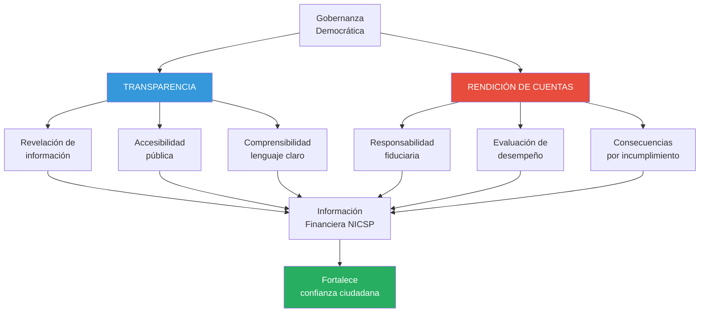
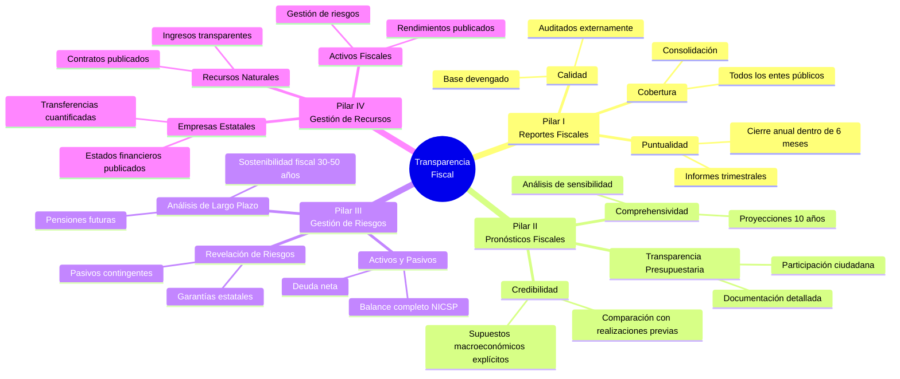

# Transparencia y Rendición de Cuentas

## Resumen

La transparencia y rendición de cuentas (accountability) constituyen el objetivo dual fundamental de la información financiera del sector público bajo las NICSP: **transparencia** revela información completa, comprensible y accesible sobre el desempeño financiero y posición patrimonial del gobierno, mientras que **rendición de cuentas** permite que legisladores, ciudadanos y otros usuarios evalúen si los recursos públicos se gestionaron responsablemente y conforme a las autorizaciones y objetivos legales, fortaleciendo la gobernanza democrática.

## Definición / Texto Normativo

**Marco Conceptual NICSP (2014) - Capítulo 2, Párrafo 2.1:**

> "El objetivo de la información financiera con propósito general de las entidades del sector público es proporcionar información sobre la entidad que sea útil a los usuarios de los informes financieros con propósito general para fines de **rendición de cuentas** y **toma de decisiones**."

**Marco Conceptual NICSP - Capítulo 2, Párrafos 2.4-2.5 (Accountability):**

> **2.4:** "Los gobiernos y otras entidades del sector público recaudan recursos de contribuyentes, donantes y otros proveedores de recursos para prestar servicios a los ciudadanos y otros beneficiarios de servicios. Los gobiernos y otras entidades del sector público son responsables ante quienes proporcionan estos recursos y quienes dependen de ellos para utilizar los recursos en la forma en que estos fueron recaudados o de otra forma acordada. **La rendición de cuentas es la obligación de demostrar que se ha cumplido con estas responsabilidades.**"

> **2.5:** "La información financiera con propósito general desempeña un papel importante en la satisfacción de las necesidades de información de los usuarios externos que no están en condiciones de exigir informes financieros adaptados a sus necesidades de información específicas, contribuyendo de este modo a la **transparencia de la información financiera**."

**IPSAS 1 - Presentación de Estados Financieros, Párrafo 12:**

> "El objetivo de los estados financieros con propósito general es proporcionar información sobre la situación financiera, el rendimiento financiero y los flujos de efectivo de una entidad, que sea útil para un amplio espectro de usuarios al tomar y evaluar decisiones sobre la asignación de recursos. **Los estados financieros también muestran los resultados de la administración por la gerencia de los recursos que le fueron confiados.**"

**Ley N° 27806 - Ley de Transparencia y Acceso a la Información Pública (Perú, 2002), Artículo 3°:**

> "El Estado adopta medidas básicas que garanticen y promuevan la **transparencia** en la actuación de las entidades de la Administración Pública. Las entidades están obligadas a publicar la información sobre sus actividades, presupuestos, adquisiciones, datos financieros y demás información relevante."

## Desarrollo / Interpretación

### Transparencia vs Rendición de Cuentas: Conceptos Diferenciados

Aunque frecuentemente se usan como sinónimos, son conceptos relacionados pero distintos:



**Tabla Comparativa:**

| Aspecto          | Transparencia                                         | Rendición de Cuentas                                                        |
| ---------------- | ----------------------------------------------------- | --------------------------------------------------------------------------- |
| **Definición**   | Hacer visible la información                          | Explicar y justificar las acciones tomadas                                  |
| **Enfoque**      | Acceso a datos                                        | Responsabilidad por resultados                                              |
| **Naturaleza**   | Derecho ciudadano a saber                             | Obligación de funcionario a informar                                        |
| **Momento**      | Continua (tiempo real si es posible)                  | Periódica (generalmente anual)                                              |
| **Mecanismo**    | Publicación proactiva                                 | Informe obligatorio + evaluación                                            |
| **Ejemplo**      | Portal web publica presupuesto ejecutado mensualmente | Ministro explica ante Congreso por qué gastó 90% en 6 meses                 |
| **Consecuencia** | Si no hay transparencia → sospecha, desconfianza      | Si no hay rendición → sanción (censura, destitución, responsabilidad penal) |

**Relación:** La transparencia es **condición necesaria pero no suficiente** para rendición de cuentas. Puedes tener transparencia sin rendición de cuentas (datos disponibles pero nadie los evalúa), pero no puedes tener rendición de cuentas sin transparencia (imposible evaluar sin información).

### ¿Por Qué la Transparencia y Rendición de Cuentas Son Objetivos de las NICSP?

**Diferencia con el Sector Privado:**

**Sector Privado (NIIF):**

- **Objetivo primario:** Información útil para **decisiones de inversión y crédito**
- **Usuarios principales:** Inversores y acreedores (proveedores de capital)
- **Pregunta clave:** "¿Esta empresa generará retornos financieros adecuados?"
- **Relación:** Voluntaria (compro acciones si quiero)

**Sector Público (NICSP):**

- **Objetivo primario:** Información útil para **rendición de cuentas y decisión de asignación de recursos públicos**
- **Usuarios principales:** Ciudadanos, legisladores, supervisores fiscales
- **Pregunta clave:** "¿El gobierno usó responsablemente los recursos que me obligaron a contribuir (impuestos)?"
- **Relación:** Involuntaria (pago impuestos obligatoriamente)

**Conclusión:** En el sector público, la información financiera no es solo una herramienta de gestión; es un **instrumento democrático** que legitima el poder del Estado.

### Dimensiones de la Transparencia Fiscal

**Marco de Transparencia Fiscal del FMI (2014):**



**Prácticas Básicas vs Avanzadas:**

| Dimensión                   | Práctica Básica                | Práctica Avanzada                                      |
| --------------------------- | ------------------------------ | ------------------------------------------------------ |
| **Cobertura de reportes**   | Solo gobierno central          | Gobierno general consolidado + empresas estatales      |
| **Puntualidad**             | Cierre anual en 12 meses       | Cierre en 6 meses + informes trimestrales              |
| **Base contable**           | Efectivo o efectivo modificado | Devengado (NICSP)                                      |
| **Auditoria**               | Auditoría básica de legalidad  | Auditoría financiera + desempeño + cumplimiento        |
| **Revelación de riesgos**   | Deuda pública directa          | Deuda + contingentes + garantías + pensiones + PPPs    |
| **Participación ciudadana** | Ninguna                        | Audiencias públicas + versión ciudadana de presupuesto |

**Perú (2024):**

- ✅ Adopción de base devengado (NICSP desde 2019)
- ✅ Cuenta General publicada en portal MEF
- ✅ Auditoría por Contraloría General
- ⚠️ Puntualidad: Cierre anual toma ~8-10 meses
- ⚠️ Revelación de riesgos: Mejorando (ahora incluye pensiones gracias a NICSP)
- ❌ Participación ciudadana: Limitada (documentos muy técnicos)

### Rendición de Cuentas: Tipos y Mecanismos

**Tipos de Accountability:**

#### **1. Accountability Horizontal (entre poderes del Estado)**

**Ejecutivo → Legislativo:**

- Presentación de estados financieros auditados al Congreso
- Sesiones de control político (interpelaciones)
- Aprobación de Cuenta General

**Ejemplo:** Ministro de Economía presenta Cuenta General 2023 a Comisión de Presupuesto del Congreso. Congresistas cuestionan aumento de deuda pública en S/. 50,000 millones. Ministro debe justificar con estados financieros NICSP.

#### **2. Accountability Vertical (gobierno → ciudadanos)**

**Mecanismos:**

- Audiencias públicas de presupuesto
- Portales de transparencia obligatorios
- Informes de gestión publicados
- Rendiciones a organizaciones de sociedad civil

**Ejemplo:** Municipalidad de Miraflores publica en su web:

- Estado de Situación Financiera trimestral
- Ejecución presupuestal por partida
- Obras ejecutadas con fotos, costos, plazos
- Ciudadanos pueden preguntar en audiencias mensuales

#### **3. Accountability Diagonal (órganos de control)**

**Instituciones:**

- Contraloría General de la República (Perú)
- Tribunal de Cuentas (Europa)
- Auditorías Supremas (GAO en EE.UU., NAO en Reino Unido)

**Función:** Auditar estados financieros y gestión, reportar al Legislativo y público.

**Ejemplo:** Contraloría audita Cuenta General 2023, emite Dictamen identificando observaciones (ejemplo: 120 entidades no aplicaron correctamente NICSP en pasivos laborales). Dictamen es público y base para acciones legales.

### El Rol de las NICSP en Fortalecer Transparencia y Rendición de Cuentas

#### **Beneficio 1: Información Comparable (Entre Países)**

**Problema sin NICSP:**
Cada país usaba normas contables propias. Comparar deuda pública de Argentina, Chile y Perú era como comparar manzanas con naranjas.

**Solución con NICSP:**
Estándares internacionales uniformes permiten comparaciones.

**Ejemplo:**

```
Deuda Pública 2023 (% PBI):

Sin NICSP (base efectivo, solo deuda directa):
  Argentina: 88%
  Chile: 39%
  Perú: 34%

Con NICSP (base devengado, incluye pensiones + contingentes):
  Argentina: 135%
  Chile: 58%
  Perú: 56%
```

**Consecuencia:** Perú parecía tener menor deuda que Chile bajo base efectivo. Con NICSP (revelando pasivos de pensiones), ambos tienen deuda similar. **Transparencia real vs aparente.**

#### **Beneficio 2: Revelación de Pasivos Ocultos**

**Caso: Pasivo por Pensiones del Decreto Ley 20530 (Perú)**

**Situación:**

- Régimen de pensiones especial creado en 1974
- Miles de funcionarios públicos con pensiones generosas (hasta 100% del último sueldo)
- **Bajo base efectivo:** Solo se registraba el pago mensual de pensiones (~S/. 200 millones/mes)
- **Pasivo total (valor presente de pensiones futuras):** NO SE REGISTRABA

**Con NICSP (2019):**

```
Estado de Situación Financiera - Gobierno Nacional (2019):

PASIVOS:
  Deuda pública externa           120,000,000,000
  Deuda pública interna            80,000,000,000
  Beneficios a Empleados:
    → Pensiones DL 20530           85,000,000,000 ← ¡NUEVO!
    → Otras pensiones             160,000,000,000 ← ¡NUEVO!
```

**Impacto:**

- Revelación de **S/. 245,000 millones** en pasivos no registrados
- Deuda pública "real" casi **duplicó** en un día (contablemente, no aumentó la deuda; se hizo visible)
- **Presión política:** Congreso discute reforma de pensiones con información real

**Lección:** Sin transparencia (NICSP), el problema era invisible. Con transparencia, se convierte en debate público y fuerza acción política.

#### **Beneficio 3: Responsabilidad por Activos Públicos**

**Problema sin registro de activos:**
Si no hay inventario de bienes, ¿quién es responsable si desaparecen?

**Ejemplo: Caso de "Maquinarias Fantasma" (Perú, 2018)**

**Escenario:**
Contraloría audita Ministerio de Agricultura. No encuentra registro contable de maquinaria agrícola (tractores, cosechadoras) distribuida a comunidades rurales entre 2010-2015.

**Bajo base efectivo:**

```
2010-2015:
  Gasto - Compra Maquinaria      50,000,000
      Banco                             50,000,000

Asunto cerrado. No hay seguimiento.
```

**Bajo base devengado (NICSP):**

```
2010-2015:
  Activo - Maquinaria Agrícola   50,000,000
      Banco                             50,000,000

Estado de Situación Financiera debe mostrar:
  Maquinaria Agrícola: S/. 50,000,000

¿Dónde están físicamente los tractores?
```

**Resultado de auditoría:**

- Solo se ubicó maquinaria por S/. 18,000,000 (36%)
- S/. 32,000,000 en activos "desaparecidos"
- Responsabilidad penal para 12 funcionarios

**Lección:** **Registro contable de activos = herramienta anticorrupción**. Si no está en el balance, no hay responsable.

### Transparencia en la Práctica: Portales y Herramientas

**Sistema Peruano de Transparencia:**

| Portal                                      | Información                                                                          | URL                                    |
| ------------------------------------------- | ------------------------------------------------------------------------------------ | -------------------------------------- |
| **Portal de Transparencia Económica (MEF)** | • Presupuesto ejecutado (diario)<br/>• Deuda pública<br/>• Transferencias a regiones | transparencia-economica.mef.gob.pe     |
| **Consulta Amigable (MEF)**                 | • Ejecución presupuestal por entidad<br/>• Análisis por función, programa            | apps5.mineco.gob.pe/transparencia      |
| **Portal de Contrataciones del Estado**     | • Todas las compras públicas<br/>• Licitaciones en tiempo real                       | www.gob.pe/osce                        |
| **Cuenta General (DGCP)**                   | • Estados financieros consolidados<br/>• Gobierno general + empresas                 | www.mef.gob.pe/es/contabilidad-publica |

**Evaluación Internacional:**

**Open Budget Index (International Budget Partnership, 2023):**

_Ranking de transparencia presupuestaria (100 países evaluados):_

| País          | Puntaje | Ranking | Nivel          |
| ------------- | ------- | ------- | -------------- |
| Nueva Zelanda | 87      | 1°      | Extensivo      |
| Sudáfrica     | 86      | 2°      | Extensivo      |
| Chile         | 81      | 8°      | Extensivo      |
| **Perú**      | **68**  | **31°** | **Sustancial** |
| México        | 66      | 35°     | Sustancial     |
| Argentina     | 59      | 46°     | Limitado       |

**Fortalezas de Perú:**

- ✅ Propuesta de presupuesto detallada (95/100)
- ✅ Informe de auditoría publicado (100/100)
- ✅ Portales de transparencia funcionales

**Debilidades identificadas:**

- ❌ Participación ciudadana limitada (35/100)
- ❌ Versión ciudadana de presupuesto inexistente
- ❌ Revisión legislativa insuficiente (60/100)

### Límites de la Transparencia: El Desafío de la Comprensibilidad

**Paradoja:** Más información ≠ Mejor rendición de cuentas si nadie la entiende.

**Problema:**

**Cuenta General de la República de Perú (2023):**

- 2,845 páginas
- Estados financieros de 2,267 entidades
- Lenguaje técnico contable
- **¿Cuántos ciudadanos la leen?** Estimado: < 0.01% de la población

**Ejemplo de barrera técnica:**

**Nota 15 - Pasivos Financieros (extracto):**

> "Los pasivos financieros del Gobierno Nacional incluyen bonos soberanos emitidos bajo legislación extranjera (Nueva York y Londres) por USD 27,600 millones, con vencimientos entre 2025-2117, valorizados al costo amortizado bajo IPSAS 41. Se aplicó la tasa efectiva de interés promedio ponderada de 5.8% anual. Los derivados de cobertura de riesgo cambiario se valorizan a valor razonable con cambios en resultados, generando una pérdida por revalorización de S/. 1,230 millones en el ejercicio..."

**¿Comprensible para un ciudadano promedio?** No.

**Solución propuesta: Versión Ciudadana**

**Guía de FMI para "Citizen Budget" (Presupuesto Ciudadano):**

- Máximo 20 páginas
- Lenguaje simple (nivel secundaria)
- Gráficos visuales
- Comparaciones con años anteriores
- Enfoque en impacto: ¿Qué servicios recibo por mis impuestos?

**Ejemplo de conversión:**

**Lenguaje técnico (NICSP):**

> "El Estado de Situación Financiera al 31/12/2023 presenta activos totales por S/. 580,000 millones y pasivos por S/. 540,000 millones, resultando en activos netos de S/. 40,000 millones."

**Lenguaje ciudadano:**

> "¿Cuánto vale el Estado peruano?
>
> - **Tenemos:** S/. 580,000 millones (carreteras, escuelas, hospitales, efectivo)
> - **Debemos:** S/. 540,000 millones (deuda, pensiones por pagar)
> - **Patrimonio neto:** S/. 40,000 millones
>
> Es como si el Perú fuera una familia que tiene una casa de S/. 580,000 pero debe S/. 540,000 de hipoteca. Su patrimonio neto es S/. 40,000."

### Rendición de Cuentas en Acción: Caso de Estudio

**Caso: Odebrecht y Transparencia de Obras Públicas (Perú, 2016-2019)**

**Contexto:**
Escándalo de corrupción reveló que empresa constructora brasileña pagó sobornos por USD 29 millones a funcionarios peruanos para obtener contratos de obras (2005-2014).

**¿Cómo la falta de transparencia facilitó la corrupción?**

**Problema 1: Contratos Secretos**

- Empresas estatales (Petroperú, autoridades portuarias) firmaban contratos confidenciales
- Ciudadanos no sabían cuánto se pagaba por obras

**Problema 2: Sin Registro Contable de Activos en Construcción**

- Obras en ejecución no aparecían en balance
- Sobrecostos no eran visibles

**Ejemplo:**

```
Obra: Refinería de Talara (Petroperú)

Presupuesto inicial (2013):   USD 3,500 millones
Costo real (2022):             USD 6,000 millones
Sobrecosto:                    USD 2,500 millones (71%)

Bajo base efectivo: Solo se veía el desembolso anual
Bajo base devengado (NICSP): Obra en construcción debe
registrarse, y sobrecostos son visibles en notas
```

**Reforma implementada (desde 2017):**

1. **Ley de Transparencia de Obras Públicas:** Todos los contratos de obra pública deben publicarse íntegramente (incluyendo precios).

2. **NICSP obligatorias para empresas estatales:** Petroperú, Sedapal, COFIDE deben aplicar NICSP desde 2019.
   - Activos en construcción registrados en balance
   - Notas explican plazos, costos, sobrecostos
   - Auditados externamente

3. **Portal de Obras Públicas:** www.obraspublicas.gob.pe
   - Mapa interactivo con todas las obras > S/. 1 millón
   - Avance físico vs avance financiero
   - Alertas de sobrecostos > 10%

**Resultado:**

- Ciudadanos pueden ver si obra avanza o está paralizada
- Medios investigan sobrecostos
- Congreso interpela a ministros con datos concretos
- **Rendición de cuentas real, habilitada por transparencia**

## Conexiones

- [[objetivos-estados-financieros-sector-publico]] - Transparencia y rendición de cuentas como objetivo dual de EEFF
- [[marco-conceptual-nicsp]] - Capítulo 2 define accountability como propósito central
- [[base-devengado-sector-publico]] - Base devengado necesaria para transparencia completa
- [[contabilidad-gubernamental-peru]] - Sistema peruano implementa transparencia vía SIAF
- [[ipsasb-junta-normas]] - IPSASB promueve transparencia global vía NICSP

## Ejemplos Resueltos

### Ejemplo 1: Comparación de Transparencia (Básico)

**Situación:**
Dos municipalidades vecinas publican información financiera:

**Municipalidad A (base efectivo, pre-NICSP):**

```
Informe de Ejecución Presupuestal 2023:
  Ingresos recaudados:        S/. 50,000,000
  Gastos ejecutados:          S/. 48,000,000
  Saldo en banco:             S/.  2,000,000
```

**Municipalidad B (base devengado, NICSP):**

```
Estado de Situación Financiera (31/12/2023):
  ACTIVOS:
    Efectivo                  S/.  2,000,000
    Cuentas por cobrar        S/.  8,000,000
    Infraestructura           S/. 80,000,000
  TOTAL ACTIVOS               S/. 90,000,000

  PASIVOS:
    Cuentas por pagar         S/.  5,000,000
    Deuda bancaria            S/. 20,000,000
    Provisión juicios         S/.  3,000,000
  TOTAL PASIVOS               S/. 28,000,000

  ACTIVOS NETOS               S/. 62,000,000
```

**Pregunta:** ¿Cuál municipalidad es más transparente? ¿Qué información crítica falta en Municipalidad A?

**Solución:**

**Municipalidad B es significativamente más transparente.**

**Información que revela Municipalidad B:**

1. **Deudas pendientes de pago:** S/. 5 millones (A no lo muestra)
2. **Deuda bancaria:** S/. 20 millones (A no lo muestra)
3. **Riesgo de juicios:** S/. 3 millones (A no lo muestra)
4. **Valor de infraestructura:** S/. 80 millones (parques, pistas, edificios municipales que A no registra)
5. **Derecho a cobrar impuestos/multas:** S/. 8 millones (A no lo muestra)

**Consecuencias de opacidad de A:**

- Ciudadanos piensan que municipalidad tiene S/. 2M disponibles
- **Realidad oculta:** Debe S/. 5M de cuentas por pagar + S/. 20M de deuda bancaria + S/. 3M de juicios = S/. 28M
- Posición financiera real es **mucho peor** de lo que aparenta

**Lección:** Transparencia real requiere **información completa** (activos y pasivos), no solo flujos de efectivo.

### Ejemplo 2: Rendición de Cuentas ante Congreso (Avanzado)

**Escenario:**
Ministro de Salud debe explicar al Congreso el gasto en pandemia COVID-19 (2020-2021). Total ejecutado: S/. 8,000 millones.

**Pregunta del Congresista:**
"Señor Ministro, ¿por qué gastaron S/. 8,000 millones si el presupuesto inicial era S/. 4,000 millones? ¿Hubo corrupción? ¿Dónde está el dinero?"

**Información disponible bajo NICSP (base devengado):**

**Estado de Gestión (2020-2021):**

```
GASTOS COVID-19:
  Personal médico contratado           S/. 1,200,000,000
  Compra de ventiladores               S/.   800,000,000
  Compra de vacunas                    S/. 3,500,000,000
  Adecuación de hospitales             S/. 1,000,000,000
  Oxígeno medicinal                    S/.   400,000,000
  Material de protección (EPP)         S/.   600,000,000
  Otros gastos médicos                 S/.   500,000,000
TOTAL                                  S/. 8,000,000,000
```

**Estado de Situación Financiera - Incremento en activos:**

```
ACTIVOS ADQUIRIDOS (que permanecen):
  Ventiladores (patrimonio)            S/.   800,000,000
  Adecuación de hospitales (mejoras)   S/. 1,000,000,000
  Equipamiento médico diverso          S/.   300,000,000
TOTAL ACTIVOS                          S/. 2,100,000,000
```

**Notas a los Estados Financieros - Revelación de contratos:**

```
Nota 18 - Contrataciones de Emergencia:
  Se realizaron 1,245 procesos de compra bajo emergencia sanitaria.
  Proveedores principales:
    - Pfizer (vacunas): S/. 2,100 millones
    - Sinopharm (vacunas): S/. 1,200 millones
    - Diversos (ventiladores): S/. 800 millones

  Comisión de fiscalización Contraloría identificó 38 observaciones
  por sobreprecio en EPPs (S/. 120 millones). En investigación.
```

**Respuesta del Ministro (basada en información NICSP):**

"Honorable Congresista:

1. **Presupuesto aumentó legalmente:** Decreto de Urgencia 034-2020 autorizó gasto adicional por emergencia. No hubo ilegalidad presupuestal.

2. **Destino del dinero (transparencia):**
   - S/. 3,500 M en vacunas (protegimos 33 millones de peruanos)
   - S/. 1,200 M en personal (contratamos 15,000 médicos y enfermeros)
   - S/. 1,800 M en equipamiento permanente (ventiladores, mejora de hospitales que **aún tenemos**)
   - Resto en insumos consumidos (oxígeno, EPPs)

3. **Rendición de cuentas:**
   - Contraloría auditó todas las compras
   - Se identificaron 38 casos de sobreprecio (S/. 120 M, 1.5% del total)
   - Responsables están en investigación penal
   - **Publicamos todos los contratos** en portal de transparencia

4. **Activos generados:**
   - El Estado ahora tiene S/. 2,100 millones en activos médicos permanentes
   - 256 camas UCI adicionales (antes: 100, ahora: 356)
   - Red de almacenamiento de vacunas a temperatura controlada en 25 regiones

**Conclusión:** No hubo despilfarro generalizado. El 98.5% del gasto está justificado y auditado. El 1.5% con observaciones está siendo investigado."

**Impacto de NICSP en este caso:**

- **Detalle por naturaleza de gasto:** Evita acusaciones genéricas de "corrupción masiva"
- **Registro de activos:** Muestra que parte del gasto generó patrimonio permanente (no todo se "consumió")
- **Revelación de observaciones:** Transparencia sobre problemas identificados, no ocultarlos
- **Trazabilidad:** Cada sol puede rastrearse hasta su destino

**Sin NICSP (base efectivo):**
Ministro solo podría decir: "Gastamos S/. 8,000 millones, ya no tenemos ese dinero." Sin capacidad de demostrar destino específico ni activos generados.

## Ejercicios Propuestos

### Ejercicio 1: Evaluación de Portal de Transparencia (Básico)

Visita el portal de transparencia de tu municipalidad distrital:

- Busca en Google: "[nombre de tu distrito] transparencia municipal"
- Explora el portal durante 15 minutos

**Tarea:**

Completa esta rúbrica de evaluación (1 = inexistente, 5 = excelente):

| Criterio                                                            | Puntuación (1-5) | Comentario |
| ------------------------------------------------------------------- | ---------------- | ---------- |
| **Accesibilidad:** ¿Es fácil encontrar el portal?                   |                  |            |
| **Actualización:** ¿Información está actualizada (último mes)?      |                  |            |
| **Estados Financieros:** ¿Publican EEFF trimestrales?               |                  |            |
| **Ejecución Presupuestal:** ¿Muestran gastos por partida?           |                  |            |
| **Contrataciones:** ¿Listan compras y licitaciones?                 |                  |            |
| **Obras públicas:** ¿Hay mapa o lista de obras en ejecución?        |                  |            |
| **Comprensibilidad:** ¿Lenguaje entendible para ciudadano promedio? |                  |            |
| **Interactividad:** ¿Puedo descargar datos, filtrar, buscar?        |                  |            |

**Promedio:** \_\_\_ / 5

Redacta 300 palabras:

- ¿Tu municipalidad cumple con estándares de transparencia?
- ¿Qué información crítica falta?
- ¿Un ciudadano promedio podría hacer rendición de cuentas al alcalde con esa información?

### Ejercicio 2: Caso de Corrupción y Transparencia (Intermedio)

**Escenario:**
Lee esta noticia (resumen):

_"Contraloría detecta que Gobierno Regional compró 500 tablets para estudiantes a S/. 4,000 cada una (total S/. 2,000,000). Precio de mercado: S/. 1,800. Sobreprecio: S/. 1,100,000. No hay registro contable de las tablets en inventario. Auditoría no puede verificar si fueron entregadas a escuelas."_

**Preguntas:**

1. **Transparencia fallida:** ¿Qué mecanismos de transparencia NO FUNCIONARON en este caso? (Lista 5)

2. **Rol de NICSP:** Si el Gobierno Regional hubiera aplicado correctamente NICSP:
   - ¿Qué asiento contable debió hacerse al comprar las tablets?
   - ¿Qué cuenta del Estado de Situación Financiera reflejaría los activos?
   - ¿Cómo la auditoría habría detectado el problema más rápido?

3. **Rendición de cuentas:** Diseña un protocolo de 5 pasos que obligue a funcionarios a rendir cuentas por este tipo de compras.

4. **Prevención:** Propón 3 medidas de transparencia que habrían **prevenido** este caso.

### Ejercicio 3: Versión Ciudadana de Estados Financieros (Avanzado)

**Tarea:**
Descarga la Cuenta General de la República de Perú (última disponible) del sitio del MEF: www.mef.gob.pe/es/contabilidad-publica

**Actividad (1,500 palabras):**

1. **Análisis del Estado de Situación Financiera consolidado del Gobierno General:**
   - Identifica los 5 activos más grandes (en soles)
   - Identifica los 5 pasivos más grandes
   - Calcula: Activos Netos (o Déficit Patrimonial)

2. **Traducción a lenguaje ciudadano:**
   - Crea un infográfico de 1 página (usando Canva, PowerPoint o similar) que explique:
     - "¿Cuánto vale el Estado peruano?"
     - "¿Cuánto debe?"
     - "¿Está endeudado o tiene patrimonio positivo?"
   - Usa analogías simples (ejemplo: "Es como una familia que...")
   - Incluye gráficos de torta, barras, íconos

3. **Preguntas críticas para rendición de cuentas:**
   - Basándote en los estados financieros, elabora 5 preguntas que un congresista debería hacerle al Ministro de Economía.
   - Ejemplo: "¿Por qué el pasivo por pensiones aumentó 15% respecto al año anterior?"

4. **Evaluación de transparencia:**
   - ¿Los estados financieros son comprensibles para ti (estudiante universitario)?
   - ¿Un ciudadano sin educación universitaria podría entenderlos?
   - ¿Qué mejoras sugieres para hacerlos más accesibles?

## Preguntas Bloom

**Nivel 1 - Recordar:** Define los conceptos de transparencia y rendición de cuentas según el Marco Conceptual de NICSP. ¿Cuál es la diferencia entre ambos?

**Nivel 2 - Comprender:** Explica por qué el objetivo de los estados financieros del sector público (rendición de cuentas) es diferente al del sector privado (decisiones de inversión). Da 3 razones fundamentales.

**Nivel 3 - Aplicar:** Una municipalidad publica en su portal solo el saldo de banco (S/. 5 millones) al 31/12/2024. Sin embargo, tiene deudas por pagar de S/. 8 millones, una deuda bancaria de S/. 15 millones y edificios municipales por S/. 50 millones. Aplica el concepto de transparencia para evaluar: ¿Esta municipalidad es transparente? ¿Qué información crítica oculta?

**Nivel 4 - Analizar:** Analiza el caso Odebrecht (corrupción en obras públicas de Perú, 2005-2016). Investiga cómo la falta de transparencia en contratos y contabilidad de activos facilitó la corrupción. Identifica 5 fallas específicas de transparencia/rendición de cuentas y cómo NICSP habría ayudado a detectarlas antes.

**Nivel 5 - Evaluar:** Algunos críticos argumentan que "demasiada transparencia" es perjudicial porque: (a) expone estrategias gubernamentales a adversarios, (b) genera pánico innecesario (ej. revelación de pasivos de pensiones), (c) ciudadanos no tienen capacidad técnica para entender información compleja. Evalúa estos argumentos: ¿Cuándo es válido limitar la transparencia? ¿Los beneficios superan los costos? Justifica con ejemplos.

**Nivel 6 - Crear:** Diseña un "Índice de Transparencia Fiscal Municipal" (ITFM) para Perú que evalúe el cumplimiento de transparencia de las 1,873 municipalidades. Tu índice debe:

1. Definir 15 indicadores medibles (ej. "publica EEFF trimestrales", "portal web funcional", etc.)
2. Asignar ponderaciones (suma 100%)
3. Establecer 5 niveles (Deficiente, Básico, Intermedio, Avanzado, Excelente)
4. Proponer consecuencias: municipalidades con puntaje < 40% ¿qué sanción reciben?
5. Pilotear tu índice evaluando 3 municipalidades reales (Lima, Arequipa, Cusco)

Extensión: 1,200 palabras.

## Base Normativa

**Normas IPSASB:**

1. **Marco Conceptual para la Información Financiera con Propósito General de las Entidades del Sector Público (2014).** Capítulo 2 (Objetivos y Usuarios): Define rendición de cuentas como objetivo primario. Párrafos 2.1-2.5 son centrales.
2. **Preface to International Public Sector Accounting Standards (2023).** Párrafo 10: "El IPSASB desarrolla normas para mejorar la calidad y transparencia de la información financiera del sector público en todo el mundo."
3. **IPSAS 1 - Presentación de Estados Financieros (revisada 2018).** Párrafo 12: Objetivo de mostrar "resultados de la administración de los recursos confiados" (accountability).

**Normativa Peruana sobre Transparencia:** 4. **Ley N° 27806 - Ley de Transparencia y Acceso a la Información Pública (2002).** Artículos 3°, 5°, 8°, 25°: Obligaciones de publicación de información financiera. 5. **Decreto Supremo N° 072-2003-PCM - Reglamento de la Ley de Transparencia.** Artículo 10°: Lista de información mínima obligatoria en portales. 6. **Resolución de Contaduría N° 011-2018-EF/30.** Considerandos: Justifica adopción NICSP para mejorar transparencia y rendición de cuentas. 7. **Ley N° 27785 - Ley Orgánica del Sistema Nacional de Control y de la Contraloría General (2002).** Artículo 8°: Contraloría como órgano de rendición de cuentas.

**Marcos Internacionales:** 8. **FMI (2014). Código de Transparencia Fiscal** (Fiscal Transparency Code). Disponible en: www.imf.org/external/np/fad/trans/

- Define 4 pilares de transparencia fiscal
- 36 principios evaluables

9. **OECD (2002). Best Practices for Budget Transparency.** Paris: OECD Publishing.
10. **International Budget Partnership (2023). Open Budget Index.** www.internationalbudget.org
    - Evalúa 120 países en transparencia presupuestaria

**Literatura Académica:** 11. Benito, B., & Bastida, F. (2009). "Budget Transparency, Fiscal Performance, and Political Turnout: An International Approach". _Public Administration Review_, 69(3), 403-417. 12. Heald, D. (2012). "Why is Transparency about Public Expenditure so Elusive?" _International Review of Administrative Sciences_, 78(1), 30-49. 13. Bovens, M. (2007). "Analysing and Assessing Accountability: A Conceptual Framework". _European Law Journal_, 13(4), 447-468.

## Referencias Bibliográficas y Recursos en Línea

**Portales de Transparencia (Perú):**

- **Ministerio de Economía y Finanzas:** www.mef.gob.pe
  - Cuenta General de la República
  - Portal de Transparencia Económica
- **Contraloría General de la República:** www.contraloria.gob.pe
  - Informes de auditoría
  - Dictámenes de Cuenta General
- **Organismo Supervisor de Contrataciones del Estado:** www.gob.pe/osce
  - Registro de contrataciones públicas

**Organizaciones Internacionales:**

- **IPSASB - Accountability:** www.ipsasb.org
  - Página específica sobre rendición de cuentas y transparencia
- **International Budget Partnership:** www.internationalbudget.org
  - Open Budget Survey (cada 2 años)
  - Guías de participación ciudadana
- **Global Initiative for Fiscal Transparency (GIFT):** www.fiscaltransparency.net
  - High-Level Principles of Fiscal Transparency
  - Herramientas de evaluación

**Casos de Estudio:**

- Nueva Zelanda Treasury (2020). "Fiscal Management and Transparency". www.treasury.govt.nz
  - Modelo de referencia mundial (líder en transparencia desde 1994)
- Chile - Dipres (2023). "Informes de Finanzas Públicas". www.dipres.gob.pe
  - Reportes trimestrales, alto estándar de transparencia
- Sudáfrica - National Treasury (2023). "Budget Transparency Portal". www.treasury.gov.za
  - Innovación en visualización de datos fiscales

**Recursos Pedagógicos:**

- World Bank (2019). "Making Public Financial Management Transparent, Participatory and Accountable". [Curso gratuito online]
- Coursera/University of Pennsylvania (2024). "Transparency and Accountability in Government". [MOOC]

**Literatura en Español:**

- CIAT (2019). "Transparencia Fiscal en América Latina". Panamá: Centro Interamericano de Administraciones Tributarias.
- CLAD (2020). "Transparencia y Acceso a la Información Pública en la Era Digital". Caracas: Centro Latinoamericano de Administración para el Desarrollo.

## Notas y Alertas

> **⚖️ Obligación Legal en Perú:** La Ley N° 27806 (Transparencia) obliga a TODAS las entidades públicas a publicar información financiera, presupuestal y de contrataciones en sus portales web. Incumplimiento = responsabilidad administrativa para el titular de la entidad (multa, suspensión, destitución).

> **📊 Dato Impactante:** Estudios de Transparencia Internacional muestran que países con mayor transparencia fiscal tienen **40% menos corrupción** en promedio. La transparencia, medida por adopción de NICSP, es uno de los 3 predictores más fuertes de menor corrupción (junto con prensa libre y auditorías independientes).

> **🌍 Perú en el Contexto Regional:** En el Open Budget Index 2023, Perú (68/100) supera a México, Colombia, Argentina y Brasil en transparencia presupuestaria, pero está por debajo de Chile (81/100). Principal brecha: **participación ciudadana** en el proceso presupuestal.

> **💡 Diferencia Clave:** **Transparencia pasiva** (publicar información cuando alguien la solicita bajo Ley de Acceso) vs **Transparencia activa** (publicar proactivamente sin esperar solicitudes). Las NICSP promueven transparencia **activa**: estados financieros deben publicarse anualmente sin necesidad de pedirlos.

> **⚠️ Riesgo de "Exceso de Información":** Publicar 2,845 páginas de Cuenta General cumple con transparencia formal, pero no con transparencia **efectiva** si nadie la entiende. Tendencia internacional: agregar "Versión Ciudadana" (20 páginas, lenguaje simple) como complemento obligatorio.

> **🔗 Conexión con Auditoría:** La rendición de cuentas NO termina con publicar estados financieros. Requiere **auditoría externa independiente** que valide la información. En Perú, la Contraloría audita la Cuenta General y emite Dictamen público. Sin auditoría, la información publicada puede ser falsa y la rendición de cuentas es solo aparente.

> **📖 Para Profundizar:** Si te interesa el debate filosófico sobre transparencia vs privacidad gubernamental (¿todo debe ser público?), consulta: Birkinshaw, P. (2006). "Freedom of Information and Openness: Fundamental Human Rights?" _Administrative Law Review_, 58(1), 177-218. [Analiza límites legítimos de la transparencia: seguridad nacional, privacidad, estrategia comercial de empresas estatales]

---

<div style="text-align: center;">
<a href="https://notbyai.fyi">

</a>
</div>
