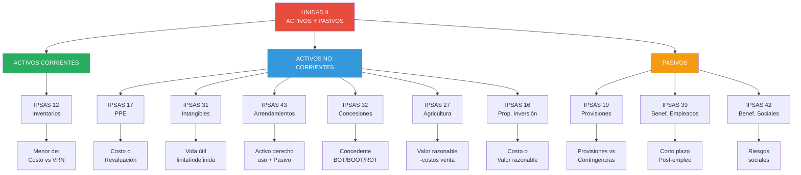
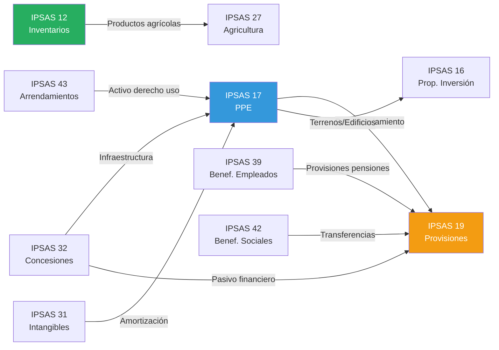

# Unidad II: Índice de Navegación - IPSAS sobre Activos y Pasivos

## Resumen de la Unidad

La Unidad II cubre las Normas Internacionales de Contabilidad del Sector Público (IPSAS/NICSP) para **reconocimiento, medición, presentación y revelación de activos y pasivos**, incluyendo inventarios, propiedades/planta/equipo, intangibles, arrendamientos, concesiones de servicios, agricultura, propiedad de inversión, provisiones, beneficios a empleados y beneficios sociales, aplicadas al contexto del sector público peruano con énfasis en casos prácticos y ejercicios resueltos.

---

## Mapa Conceptual de la Unidad

---

## Normas por Tema (Organización Lógica)

### 📦 Activos Corrientes

| IPSAS                                        | Título      | Concepto Clave        | Semanas | Dificultad |
| -------------------------------------------- | ----------- | --------------------- | ------- | ---------- |
| [[ipsas-12-inventarios\|IPSAS 12]] | Inventarios | Menor de costo vs VRN | 05-06   | Intermedio |

---

### 🏢 Activos No Corrientes - Tangibles

| IPSAS                                                    | Título                     | Concepto Clave          | Semanas | Dificultad |
| -------------------------------------------------------- | -------------------------- | ----------------------- | ------- | ---------- |
| [[ipsas-17-propiedad-planta-equipo\|IPSAS 17]] | Propiedad, Planta y Equipo | Costo vs Revaluación    | 07-08   | Intermedio |
| [[ipsas-27-agricultura\|IPSAS 27]]             | Agricultura                | Activos biológicos a VR | 11-12   | Intermedio |
| [[ipsas-16-propiedad-inversion\|IPSAS 16]]     | Propiedad de Inversión     | Modelo VR vs Costo      | 13-14   | Intermedio |

---

### 💡 Activos No Corrientes - Intangibles y Derechos

| IPSAS                                                 | Título                   | Concepto Clave              | Semanas | Dificultad |
| ----------------------------------------------------- | ------------------------ | --------------------------- | ------- | ---------- |
| [[ipsas-31-activos-intangibles\|IPSAS 31]]  | Activos Intangibles      | Vida útil finita/indefinida | 07-08   | Avanzado   |
| [[ipsas-43-arrendamientos\|IPSAS 43]]       | Arrendamientos           | Activo derecho uso + Pasivo | 09-10   | Avanzado   |
| [[ipsas-32-concesiones-servicio\|IPSAS 32]] | Concesiones de Servicios | Concedente BOT/BOOT         | 09-10   | Avanzado   |

---

### ⚠️ Pasivos y Obligaciones

| IPSAS                                                 | Título                                      | Concepto Clave                           | Semanas | Dificultad |
| ----------------------------------------------------- | ------------------------------------------- | ---------------------------------------- | ------- | ---------- |
| [[ipsas-19-provisiones\|IPSAS 19]]          | Provisiones, Pasivos y Activos Contingentes | Probable vs Posible vs Remota            | 15      | Avanzado   |
| [[ipsas-39-beneficios-empleados\|IPSAS 39]] | Beneficios a Empleados                      | Corto plazo vs Post-empleo               | 16      | Avanzado   |
| [[ipsas-42-beneficios-sociales\|IPSAS 42]]  | Beneficios Sociales                         | Riesgos sociales, criterios elegibilidad | 16      | Avanzado   |

---

## Rutas de Aprendizaje Sugeridas

### 🎯 Ruta 1: Principiante (Conceptos Básicos)

**Objetivo:** Comprender las bases de activos y pasivos en sector público.

**Secuencia recomendada:**

1. [[ipsas-12-inventarios|IPSAS 12 - Inventarios]] ← Más simple, medición directa
2. [[ipsas-17-propiedad-planta-equipo|IPSAS 17 - PPE]] ← Activo más común
3. [[ipsas-19-provisiones|IPSAS 19 - Provisiones]] ← Pasivos básicos

**Tiempo estimado:** 3 semanas (1 semana por norma)

**Recursos adicionales:**

- Ejemplos básicos en cada nota
- Ejercicios nivel "Básico"
- Diagramas Mermaid de flujo

---

### 🚀 Ruta 2: Intermedio (Aplicación Práctica)

**Objetivo:** Aplicar IPSAS a casos reales del sector público peruano.

**Secuencia recomendada:**

1. **Activos corrientes:** [[ipsas-12-inventarios|IPSAS 12]]
2. **Activos fijos:** [[ipsas-17-propiedad-planta-equipo|IPSAS 17]] + [[ipsas-31-activos-intangibles|IPSAS 31]]
3. **Activos especiales:** [[ipsas-27-agricultura|IPSAS 27]] + [[ipsas-16-propiedad-inversion|IPSAS 16]]
4. **Pasivos:** [[ipsas-19-provisiones|IPSAS 19]] + [[ipsas-39-beneficios-empleados|IPSAS 39]]

**Tiempo estimado:** 6 semanas

**Recursos adicionales:**

- Ejemplos intermedios (casos resueltos)
- Ejercicios nivel "Intermedio"
- Integración con SIAF (Perú)

---

### 🎓 Ruta 3: Avanzado (Dominio Completo)

**Objetivo:** Dominar IPSAS complejas y preparar para certificación/práctica profesional.

**Secuencia recomendada:**

1. **Arrendamientos modernos:** [[ipsas-43-arrendamientos|IPSAS 43]] ← Reconocimiento dual
2. **APP/Concesiones:** [[ipsas-32-concesiones-servicio|IPSAS 32]] ← Infraestructura BOT
3. **Beneficios empleados:** [[ipsas-39-beneficios-empleados|IPSAS 39]] ← Valuación actuarial
4. **Beneficios sociales:** [[ipsas-42-beneficios-sociales|IPSAS 42]] ← Programas masivos
5. **Provisiones complejas:** [[ipsas-19-provisiones|IPSAS 19]] ← Valor presente, contingencias

**Tiempo estimado:** 8 semanas

**Recursos adicionales:**

- Ejemplos avanzados (casos integrales)
- Ejercicios nivel "Avanzado" (2,000-2,500 palabras)
- Preguntas Bloom niveles 4-6
- Literatura técnica especializada

---

### 🏛️ Ruta 4: Enfoque Sectorial (Por Entidad)

#### **A. Ministerios / Gobierno Central**

**Normas prioritarias:**

1. [[ipsas-17-propiedad-planta-equipo|IPSAS 17]] - Edificios administrativos, vehículos
2. [[ipsas-31-activos-intangibles|IPSAS 31]] - Software, licencias
3. [[ipsas-32-concesiones-servicio|IPSAS 32]] - APP/Infraestructura
4. [[ipsas-39-beneficios-empleados|IPSAS 39]] - Pensiones ONP, CTS
5. [[ipsas-42-beneficios-sociales|IPSAS 42]] - Programas sociales (Pensión 65, Juntos)

---

#### **B. Gobiernos Regionales / Municipalidades**

**Normas prioritarias:**

1. [[ipsas-17-propiedad-planta-equipo|IPSAS 17]] - Infraestructura (carreteras, puentes, parques)
2. [[ipsas-16-propiedad-inversion|IPSAS 16]] - Locales comerciales, mercados alquilados
3. [[ipsas-32-concesiones-servicio|IPSAS 32]] - Concesiones regionales/municipales
4. [[ipsas-19-provisiones|IPSAS 19]] - Litigios, remediación ambiental

---

#### **C. Universidades Públicas**

**Normas prioritarias:**

1. [[ipsas-17-propiedad-planta-equipo|IPSAS 17]] - Campus, laboratorios, equipos
2. [[ipsas-31-activos-intangibles|IPSAS 31]] - Investigación, patentes
3. [[ipsas-12-inventarios|IPSAS 12]] - Materiales de investigación, librería
4. [[ipsas-27-agricultura|IPSAS 27]] - Granjas experimentales, activos biológicos
5. [[ipsas-39-beneficios-empleados|IPSAS 39]] - Docentes, personal administrativo

---

#### **D. Hospitales / MINSA**

**Normas prioritarias:**

1. [[ipsas-17-propiedad-planta-equipo|IPSAS 17]] - Edificios hospitalarios, equipos médicos
2. [[ipsas-12-inventarios|IPSAS 12]] - Medicamentos, insumos médicos
3. [[ipsas-43-arrendamientos|IPSAS 43]] - Equipamiento médico arrendado
4. [[ipsas-39-beneficios-empleados|IPSAS 39]] - Personal salud
5. [[ipsas-42-beneficios-sociales|IPSAS 42]] - SIS (Seguro Integral de Salud)

---

#### **E. Empresas Públicas (FONAFE)**

**Normas prioritarias:**

1. [[ipsas-17-propiedad-planta-equipo|IPSAS 17]] - Infraestructura productiva
2. [[ipsas-27-agricultura|IPSAS 27]] - Empresas agrícolas (si aplica)
3. [[ipsas-32-concesiones-servicio|IPSAS 32]] - Operador en concesiones
4. [[ipsas-19-provisiones|IPSAS 19]] - Desmantelamiento, remediación ambiental
5. [[ipsas-39-beneficios-empleados|IPSAS 39]] - Planes de pensiones

---

## Conexiones entre Normas (Red Conceptual)

---

## Resumen Ejecutivo por Norma

### IPSAS 12 - Inventarios

**Concepto:** Bienes mantenidos para venta, proceso de producción o consumo.
**Medición:** **Menor de:** (a) Costo, (b) VRN (Valor Realizable Neto).
**Contexto Perú:** Almacenes gubernamentales, medicamentos hospitales, programas sociales (Qali Warma).
**Dificultad:** ⭐⭐ Intermedio

---

### IPSAS 17 - Propiedad, Planta y Equipo

**Concepto:** Activos tangibles para uso operativo, no venta, vida útil >1 año.
**Medición:** **Modelo costo** o **modelo revaluación** (valor razonable).
**Depreciación:** Sistemática durante vida útil.
**Contexto Perú:** Infraestructura (carreteras, puentes, edificios), equipos, vehículos.
**Dificultad:** ⭐⭐ Intermedio

---

### IPSAS 31 - Activos Intangibles

**Concepto:** Activos no monetarios identificables sin sustancia física.
**Vida útil:** **Finita** (amortizar) vs **Indefinida** (NO amortizar, probar deterioro).
**Ejemplos:** Software, licencias, concesiones, patentes (universidades).
**Contexto Perú:** Sistemas informáticos SIAF, investigación universitaria.
**Dificultad:** ⭐⭐⭐ Avanzado

---

### IPSAS 43 - Arrendamientos

**Concepto:** Contrato que transfiere derecho a usar activo por periodo a cambio de pago.
**Reconocimiento arrendatario:** **Activo derecho de uso + Pasivo arrendamiento**.
**Reconocimiento arrendador:** Clasificar (operativo vs financiero), desreconocer si financiero.
**Contexto Perú:** Alquiler edificios administrativos, equipamiento médico/tecnológico.
**Dificultad:** ⭐⭐⭐ Avanzado

---

### IPSAS 32 - Acuerdos de Concesión de Servicios

**Concepto:** APP/PPP desde perspectiva **concedente** (gobierno).
**Modelos:** (a) **Pasivo financiero** (gobierno paga), (b) **Otorgamiento derecho** (operador cobra usuarios), (c) **Bifurcado** (mixto).
**Ejemplos:** Carreteras BOT, hospitales, aeropuertos, puertos.
**Contexto Perú:** ~140 APP vigentes (US$ 50 mil millones).
**Dificultad:** ⭐⭐⭐ Avanzado

---

### IPSAS 27 - Agricultura

**Concepto:** Activos biológicos (animales vivos, plantas) y productos agrícolas al cosechar.
**Medición:** **Valor razonable menos costos de venta** (excepto si no medible confiablemente).
**Reconocimiento cambios VR:** En **resultados** del periodo.
**Contexto Perú:** INIA (ganado mejorado), SERFOR (plantaciones forestales), universidades agrarias.
**Dificultad:** ⭐⭐ Intermedio

---

### IPSAS 16 - Propiedad de Inversión

**Concepto:** Inmuebles para obtener **rentas** o **apreciación capital** (no uso operativo).
**Medición:** Elegir política: **Modelo VR** (revaluar, cambios a resultados) o **Modelo costo** (depreciar).
**Ejemplos:** Locales comerciales alquilados, mercados municipales, terrenos sin uso.
**Contexto Perú:** Municipalidades (inmuebles), fondos de pensiones.
**Dificultad:** ⭐⭐ Intermedio

---

### IPSAS 19 - Provisiones, Pasivos Contingentes y Activos Contingentes

**Concepto:** **Provisión** (pasivo cierto, monto/vencimiento incierto). **Contingencia** (posible, no reconocer, solo revelar).
**Reconocimiento provisión:** (a) Obligación presente, (b) Salida **probable**, (c) Estimación confiable.
**Medición:** Mejor estimado, VP si >12 meses.
**Contexto Perú:** Litigios, garantías, reestructuraciones, remediación ambiental.
**Dificultad:** ⭐⭐⭐ Avanzado

---

### IPSAS 39 - Beneficios a Empleados

**Concepto:** Todas las retribuciones a empleados (sueldos, pensiones, CTS, vacaciones, gratificaciones).
**Clasificación:** (a) Corto plazo, (b) Post-empleo, (c) Largo plazo, (d) Terminación.
**Medición post-empleo:** **Actuarial** (método unidad crédito proyectada) si plan prestación definida.
**Contexto Perú:** ONP (empleados públicos), CTS, gratificaciones legales.
**Dificultad:** ⭐⭐⭐ Avanzado

---

### IPSAS 42 - Beneficios Sociales

**Concepto:** Transferencias a individuos/hogares para mitigar **riesgos sociales** (pobreza, vejez, desempleo, enfermedad).
**Reconocimiento:** Cuando beneficiario cumple **criterios de elegibilidad** (obligación vinculante).
**Periodo por periodo:** Generalmente mes a mes (diferencia con IPSAS 39).
**Contexto Perú:** Pensión 65, Juntos, Qali Warma, SIS.
**Dificultad:** ⭐⭐⭐ Avanzado

---

## Estadísticas de la Unidad

**Total de notas:** 10 IPSAS
**Palabras totales:** ~140,000 palabras
**Ejemplos resueltos:** 20+ (mínimo 2 por norma)
**Ejercicios propuestos:** 30+ (mínimo 3 por norma)
**Preguntas Bloom:** 60 (6 por norma, niveles 1-6)
**Diagramas Mermaid:** 25+
**Casos de estudio:** 15+ casos complejos (>2,000 palabras)

**Distribución por dificultad:**

- ⭐⭐ Intermedio: 5 normas (IPSAS 12, 17, 27, 16)
- ⭐⭐⭐ Avanzado: 5 normas (IPSAS 31, 43, 32, 19, 39, 42)

**Tiempo estimado estudio completo:** 12 semanas (12 horas/semana)

---

## Recursos Adicionales

### Documentos Oficiales IPSASB

- [IPSASB Handbook](https://www.ipsasb.org/publications) - Textos completos IPSAS
- Implementation Guidance (IG) por cada norma
- Bases for Conclusions (BC) - Razonamiento IPSASB

### Normativa Peruana

- **Plan Contable Gubernamental 2019** (MEF)
- **Directivas de Contabilidad Pública** (Contaduría Pública)
- **Manual SIAF** - Integración contable

### Herramientas

- **Excel:** Plantillas de depreciación, valor presente, valuación actuarial
- **SIAF:** Sistema Integrado de Administración Financiera (Perú)

### Comunidades y Foros

- **IFAC Knowledge Gateway** - Recursos IPSAS
- **Contaduría Pública del Perú** - Consultas técnicas

---

## Cómo Usar Este Índice

### 1. **Navegación Rápida**

Haz clic en los enlaces wiki `[[nombre-nota]]` para acceder directamente a cada IPSAS.

### 2. **Búsqueda por Tema**

Usa la sección "Normas por Tema" para encontrar activos corrientes, no corrientes, pasivos.

### 3. **Rutas de Aprendizaje**

Sigue la ruta sugerida según tu nivel (Principiante → Intermedio → Avanzado).

### 4. **Enfoque Sectorial**

Si trabajas en entidad específica (ministerio, municipalidad, hospital), revisa la sección "Ruta por Entidad" para priorizar normas relevantes.

### 5. **Estudio Integrado**

Usa el "Mapa de Conexiones" para entender relaciones entre normas (ej. IPSAS 17 + IPSAS 19 para provisiones desmantelamiento).

---

## Actualización de Contenido

**Fecha creación:** 17 de octubre de 2025
**Última actualización:** 17 de octubre de 2025
**Versión:** 1.0
**Autor:** Facultad Cognitiva KDD

**Próximas actualizaciones:**

- Casos de estudio adicionales (trimestral)
- Actualización normativa IPSASB (anual)
- Integración con Unidades III y IV (en progreso)

---

