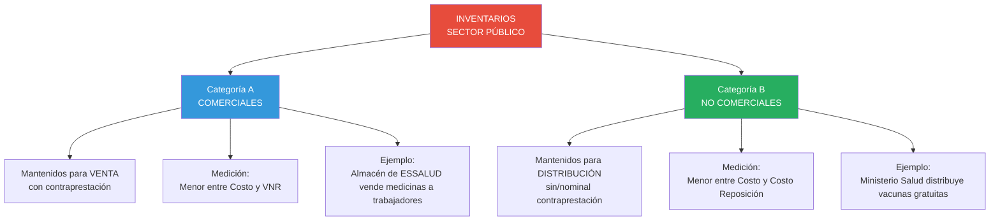
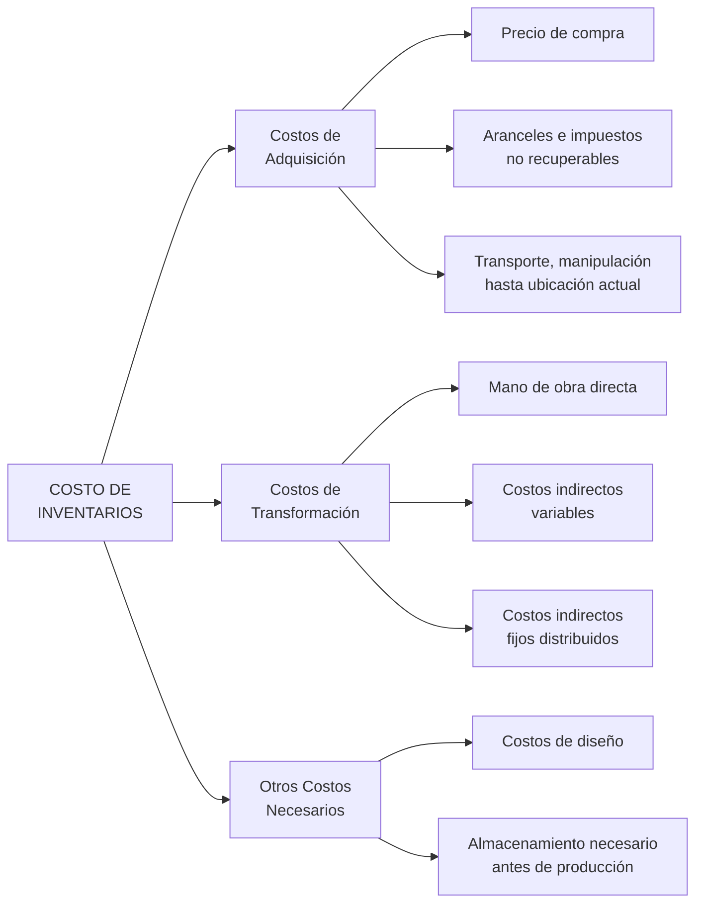

# IPSAS 12: Inventarios

## Resumen

La IPSAS 12 establece el tratamiento contable de los inventarios en el sector público, un concepto que se diferencia de la contabilidad del sector privado (ver [[diferencias-nicsp-niif|diferencias entre NICSP y NIIF]]). Define su reconocimiento, medición inicial al menor entre costo y valor neto realizable (o costo de reposición cuando no hay precio de venta), y revelación en estados financieros. Cubre tanto inventarios adquiridos onerosamente (para venta) como aquellos mantenidos para distribución sin contraprestación o consumo en la prestación de servicios, utilizando fórmulas PEPS o costo promedio ponderado, todo bajo la [[base-devengado-sector-publico|base contable de devengado]].

## Definición / Texto Normativo

**IPSAS 12 - Inventarios, Párrafo 9:**

> "Los **inventarios** son activos:
> (a) En forma de materiales o suministros para ser consumidos en el proceso de producción;
> (b) En forma de materiales o suministros para ser consumidos en la prestación de servicios;
> (c) Mantenidos para la venta o distribución en el curso normal de las operaciones; o
> (d) En proceso de producción para su venta o distribución."

**IPSAS 12, Párrafo 10 - Medición:**

> "Los inventarios se medirán al **menor entre el costo y el valor neto realizable**, excepto cuando lo establecido en los párrafos 15 a 18 [inventarios para distribución sin contraprestación] requiera otra base de medición."

**IPSAS 12, Párrafo 10A - Inventarios para distribución sin contraprestación:**

> "Los inventarios que se mantienen para su **distribución sin contraprestación**, o por una contraprestación nominal, se medirán al **menor entre el costo y el costo de reposición corriente**."

**Definiciones clave (Párrafo 9):**

- **Valor neto realizable:** Precio de venta estimado menos costos estimados de terminación y venta.
- **Costo de reposición corriente:** Costo de adquirir el activo en la fecha de presentación.
- **Costo:** Incluye costos de adquisición, costos de transformación y otros costos incurridos para dar a los inventarios su condición y ubicación actuales.

## Desarrollo / Interpretación

### Alcance de IPSAS 12 en el Sector Público

La IPSAS 12 cubre **dos categorías** de inventarios que reflejan la naturaleza dual del sector público:



**Diferencia clave con IAS 2 (NIIF para sector privado):**

- **IAS 2:** Solo contempla inventarios para venta (comerciales)
- **IPSAS 12:** Añade categoría de inventarios para **distribución sin contraprestación** (única del sector público, ver [[diferencias-nicsp-niif]])

### Reconocimiento de Inventarios

**Criterios de reconocimiento (del [[marco-conceptual-nicsp|Marco Conceptual]] aplicado a inventarios):**

1. **Definición:** ¿Cumple la definición de activo?
   - ✅ Recurso controlado
   - ✅ Evento pasado (adquisición/producción)
   - ✅ Beneficios económicos futuros o potencial de servicio

2. **Probabilidad:** ¿Es probable que fluyan beneficios/potencial de servicio?

3. **Medición confiable:** ¿Se puede medir el costo confiablemente?

**Momento de reconocimiento:**

| Tipo de adquisición                | Momento de reconocimiento                                 |
| ---------------------------------- | --------------------------------------------------------- |
| **Compra onerosa**                 | Cuando se transfiere el control (generalmente al recibir) |
| **Donación**                       | Cuando se recibe y se puede medir su valor razonable      |
| **Producción propia**              | Cuando se completa la producción y el activo está listo   |
| **Transferencia de otro gobierno** | Cuando se recibe y se formaliza la transferencia          |

**Ejemplo de reconocimiento:**

**Caso:** Ministerio de Educación recibe donación de 10,000 laptops de ONG internacional. Valor razonable: USD 500 c/u.

```
Asiento contable (al recibir las laptops):

Inventario - Material Educativo     5,000,000
    Ingreso - Donaciones ([[ipsas-23-ingresos-sin-contraprestacion|IPSAS 23]])          5,000,000

[Reconocimiento simultáneo de activo e ingreso sin contraprestación]
```

### Medición Inicial: Determinación del Costo

**Componentes del costo de inventarios (Párrafo 13):**



**Exclusiones del costo (Párrafo 21 - NO deben incluirse):**

❌ Desperdicios anormales de materiales, mano de obra u otros costos  
❌ Costos de almacenamiento (excepto necesarios para producción)  
❌ Costos administrativos no relacionados con producción  
❌ Costos de venta

**Ejemplo detallado de cálculo de costo:**

**Situación:** Hospital público fabrica soluciones salinas intravenosas.

| Concepto                                          | Monto      | ¿Se incluye en costo inventario?       |
| ------------------------------------------------- | ---------- | -------------------------------------- |
| Materia prima (cloruro de sodio, agua destilada)  | S/. 10,000 | ✅ SÍ (costo de adquisición)           |
| Transporte de materia prima                       | S/. 500    | ✅ SÍ (costo de adquisición)           |
| Salarios del químico que prepara soluciones       | S/. 5,000  | ✅ SÍ (mano de obra directa)           |
| Electricidad del área de producción               | S/. 800    | ✅ SÍ (costo indirecto variable)       |
| Depreciación del equipo de esterilización         | S/. 1,200  | ✅ SÍ (costo indirecto fijo)           |
| Salarios del personal administrativo del hospital | S/. 15,000 | ❌ NO (costo administrativo general)   |
| Almacenamiento de soluciones terminadas           | S/. 600    | ❌ NO (almacenamiento post-producción) |
| Desperdicios anormales (lote contaminado)         | S/. 2,000  | ❌ NO (pérdida anormal)                |

**Costo unitario del inventario:**

```
Total costos incluibles: S/. 17,500 (10,000 + 500 + 5,000 + 800 + 1,200)
Unidades producidas: 10,000 bolsas de 500 ml
Costo unitario: S/. 1.75 por bolsa
```

### Medición Posterior: Menor entre Costo y VNR/Costo de Reposición

**Regla general (inventarios comerciales - para venta):**

**Costo vs Valor Neto Realizable (VNR)**

```
VNR = Precio de venta estimado - Costos estimados de terminación - Costos estimados de venta
```

**Ejemplo 1: Deterioro de inventarios comerciales**

**Caso:** ESSALUD tiene farmacia que vende medicamentos a trabajadores. Inventario de paracetamol:

| Concepto                 | Valor                           |
| ------------------------ | ------------------------------- |
| Costo de adquisición     | S/. 50,000                      |
| Precio de venta estimado | S/. 48,000                      |
| Costos de venta          | S/. 2,000                       |
| **VNR**                  | **S/. 46,000** (48,000 - 2,000) |

**Comparación:**

- Costo: S/. 50,000
- VNR: S/. 46,000
- **Valor en libros:** **S/. 46,000** (el menor)

**Asiento de ajuste por deterioro:**

```
Gasto - Deterioro de Inventarios    4,000
    Provisión por Deterioro - Inventarios    4,000

[Reconocer pérdida por deterioro S/. 50,000 - S/. 46,000]
```

---

**Regla especial (inventarios no comerciales - distribución gratuita):**

**Costo vs Costo de Reposición Corriente**

**Ejemplo 2: Inventarios para distribución sin contraprestación**

**Caso:** Ministerio de Salud tiene vacunas COVID-19 donadas para distribución gratuita:

| Concepto                             | Valor                          |
| ------------------------------------ | ------------------------------ |
| Costo de adquisición (donación)      | S/. 0 (donadas)                |
| Valor razonable al recibir (2023)    | S/. 80 por dosis               |
| Costo de reposición corriente (2024) | S/. 20 por dosis (precio bajó) |
| Unidades en inventario               | 10,000 dosis                   |

**Análisis:**

Cuando se recibieron (donación 2023):

```
Inventario - Vacunas              800,000
    Ingreso - Donaciones (IPSAS 23)        800,000

[10,000 dosis × S/. 80 = S/. 800,000]
```

Al cierre 2024 (precio de mercado bajó):

```
Costo en libros: S/. 800,000
Costo de reposición: S/. 200,000 (10,000 × S/. 20)
Valor en libros: S/. 200,000 (el menor)

Asiento de ajuste:

Gasto - Deterioro de Inventarios    600,000
    Provisión por Deterioro - Inventarios    600,000
```

**Razón del ajuste:** Si el gobierno necesitara reponer estas vacunas hoy, solo costaría S/. 200,000. No tiene sentido mantenerlas a S/. 800,000 en el balance.

**¿Por qué no usar VNR?** Porque estas vacunas **no se venden** (distribución gratuita), no hay "precio de venta estimado". Por eso se usa costo de reposición.

### Fórmulas de Costeo: PEPS y Costo Promedio Ponderado

**IPSAS 12, Párrafo 31:**

> "El costo de los inventarios se asignará utilizando los métodos de **primera entrada, primera salida (PEPS)** o **costo promedio ponderado**."

**❌ PROHIBIDO:** Método UEPS (última entrada, primera salida) - No está permitido en IPSAS 12 (similar a IAS 2).

#### **Método PEPS (First In, First Out)**

**Supuesto:** Los primeros inventarios en entrar son los primeros en salir.

**Ejemplo:**

Hospital público compra antibióticos en 3 lotes:

| Fecha     | Unidades | Costo unitario | Costo total   |
| --------- | -------- | -------------- | ------------- |
| 01/01     | 100      | S/. 10         | S/. 1,000     |
| 01/03     | 150      | S/. 12         | S/. 1,800     |
| 01/05     | 200      | S/. 15         | S/. 3,000     |
| **Total** | **450**  |                | **S/. 5,800** |

El 01/06, el hospital consume 250 unidades en tratamientos.

**Costeo bajo PEPS:**

Secuencia de salida:

1. Primero salen las 100 unidades del 01/01 @ S/. 10 = S/. 1,000
2. Luego salen 150 unidades del 01/03 @ S/. 12 = S/. 1,800
3. **Total costo de consumo:** S/. 2,800

**Inventario final:**

- 0 unidades del lote 01/01 (agotado)
- 0 unidades del lote 01/03 (agotado)
- 200 unidades del lote 01/05 @ S/. 15 = S/. 3,000

**Asiento contable:**

```
Gasto - Medicamentos e Insumos    2,800
    Inventario - Medicamentos              2,800

Inventario final en balance: S/. 3,000
```

#### **Método Costo Promedio Ponderado**

**Supuesto:** Se calcula un costo promedio de todas las unidades disponibles.

**Mismo ejemplo anterior:**

Costo promedio ponderado:

```
Costo total: S/. 5,800
Unidades totales: 450
Costo promedio = S/. 5,800 / 450 = S/. 12.89 por unidad
```

Consumo de 250 unidades:

```
Costo de consumo = 250 × S/. 12.89 = S/. 3,222
```

**Inventario final:**

```
Unidades restantes: 200 (450 - 250)
Valor: 200 × S/. 12.89 = S/. 2,578
```

**Comparación de resultados:**

| Concepto                  | PEPS      | Costo Promedio |
| ------------------------- | --------- | -------------- |
| Costo de consumo (gasto)  | S/. 2,800 | S/. 3,222      |
| Inventario final (activo) | S/. 3,000 | S/. 2,578      |

**Implicación:** PEPS tiende a mostrar **mayor valor de inventario final** en épocas de precios crecientes (como en este ejemplo).

### Revelaciones Requeridas (Párrafos 36-39)

**Información obligatoria a revelar en Notas:**

1. **Políticas contables:**
   - Fórmula de costeo utilizada (PEPS o promedio ponderado)
   - Método de medición (costo, VNR, costo de reposición)

2. **Valor en libros total:**
   - Por categorías apropiadas (medicamentos, alimentos, combustibles, material de oficina, etc.)

3. **Valor de inventarios reconocidos como gasto:**
   - Monto consumido en el periodo

4. **Pérdidas por deterioro:**
   - Monto reconocido como gasto
   - Monto revertido (si hubo recuperación de valor)

5. **Circunstancias que causaron deterioro:**
   - Obsolescencia
   - Caída de precios
   - Daño físico

6. **Inventarios dados en garantía:**
   - Si se han pignorado inventarios como garantía de pasivos

**Ejemplo de revelación (extracto de Nota):**

**Nota 8 - Inventarios**

```
8.1 Composición de inventarios:

                                    31/12/2024    31/12/2023
Medicamentos e insumos médicos      S/. 45,000    S/. 38,000
Alimentos (programas sociales)      S/. 12,000    S/. 15,000
Material de oficina                 S/.  3,500    S/.  3,200
Combustibles                        S/.  8,000    S/.  7,500
Menos: Provisión por deterioro      S/. (2,500)   S/. (1,800)
                                    -----------   -----------
Total inventarios neto              S/. 66,000    S/. 61,900

8.2 Política contable:
Los inventarios se valúan al menor entre el costo y el valor neto realizable
(inventarios para venta) o el costo de reposición corriente (inventarios para
distribución sin contraprestación). Se utiliza el método de costo promedio
ponderado para asignar los costos.

8.3 Deterioro de inventarios:
Durante 2024, se reconoció un gasto por deterioro de S/. 2,800 debido a:
- Medicamentos vencidos: S/. 1,500
- Alimentos deteriorados: S/. 1,000
- Obsolescencia de material de oficina: S/. 300

Se revirtió deterioro previamente reconocido por S/. 1,100 debido a
recuperación de valor de medicamentos cuyo precio de mercado aumentó.

8.4 Inventarios consumidos:
El costo de inventarios reconocido como gasto durante el periodo fue
S/. 125,000 (2023: S/. 110,000).
```

### Casos Especiales en el Sector Público

#### **Caso 1: Inventarios de Reserva Estratégica**

**Situación:** Gobierno mantiene reserva estratégica de alimentos (arroz, aceite) para emergencias (terremotos, inundaciones).

**Pregunta:** ¿Se reconocen como inventarios bajo IPSAS 12?

**Respuesta:** **Sí**, pero con consideraciones especiales:

- **Medición:** Costo de reposición corriente (distribución sin contraprestación)
- **Rotación:** Baja o nula (puede mantenerse años sin usar)
- **Deterioro:** Evaluar anualmente (vencimiento, obsolescencia)
- **Revelación:** Explicar en notas la naturaleza especial (reserva estratégica)

**Ejemplo:**

```
Inventario - Reserva Estratégica (Alimentos)    50,000,000

Nota: El gobierno mantiene una reserva estratégica de alimentos
suficiente para atender a 100,000 personas durante 30 días en caso
de emergencia nacional. Esta reserva se renueva cada 2 años para
evitar vencimiento. Medición: costo de reposición corriente.
```

#### **Caso 2: Inventarios en Tránsito (Donaciones Internacionales)**

**Situación:** ONU envía 500 toneladas de ayuda humanitaria (alimentos, medicinas) a Perú tras terremoto. Los suministros están en barco, llegarán en 15 días.

**Pregunta:** ¿Se reconoce el inventario antes de recibirlo físicamente?

**Respuesta:** **Depende del acuerdo de transferencia.**

**Si el control se transfiere al zarpar (FOB Shipping Point):**

```
Inventario - Ayuda Humanitaria en Tránsito    2,000,000
    Ingreso - Donaciones (IPSAS 23)                   2,000,000

[Reconocer cuando se transfiere el control, no cuando llega físicamente]
```

**Si el control se transfiere al llegar (FOB Destination):**

```
No se reconoce hasta que llegue y se reciba físicamente.
```

#### **Caso 3: Producción Propia de Inventarios (Gobierno como Productor)**

**Situación:** Municipalidad tiene taller que fabrica escritorios y sillas para sus propias escuelas públicas.

**Costo de producción (mes):**

- Madera y materiales: S/. 50,000
- Salarios carpinteros: S/. 30,000
- Depreciación maquinaria: S/. 5,000
- Electricidad taller: S/. 2,000
- Supervisión: S/. 8,000
- **Total:** S/. 95,000

Producción: 100 escritorios y 200 sillas

**Distribución de costos:**

**Opción 1: Costo por unidad equivalente (si son similares)**

```
Costo por escritorio: S/. 95,000 / 300 unidades = S/. 317 c/u
```

**Opción 2: Distribución proporcional (si son distintos)**

```
Costo escritorio (estimado 70% del costo): S/. 66,500 / 100 = S/. 665 c/u
Costo silla (estimado 30% del costo): S/. 28,500 / 200 = S/. 143 c/u
```

**Asiento al terminar producción:**

```
Inventario - Mobiliario (Escritorios)    66,500
Inventario - Mobiliario (Sillas)         28,500
    Producción en Proceso                        95,000

[Transferencia de producción en proceso a inventario terminado]
```

**Cuando se instalan en escuelas:**

```
Activo - Mobiliario (PPE bajo IPSAS 17)    95,000
    Inventario - Mobiliario                         95,000

[Traspaso de inventario a activo fijo cuando se da de alta]
```

## Conexiones

- [[marco-conceptual-nicsp]] - Definición de activo, criterios de reconocimiento y medición
- [[base-devengado-sector-publico]] - Inventarios se reconocen cuando se reciben (control), no cuando se pagan
- [[diferencias-nicsp-niif]] - IPSAS 12 agrega categoría de inventarios para distribución sin contraprestación
- [[contabilidad-gubernamental-peru]] - Registro en SIAF, Plan Contable Gubernamental (Clase 1 - Activos)
- [[ipsas-17-propiedad-planta-equipo|IPSAS 17]] - Inventarios de repuestos mayores pueden ser PPE
- [[unidad-II/ipsas-23-ingresos-sin-contraprestacion|IPSAS 23]] - Reconocimiento de inventarios recibidos por donación

## Ejemplos Resueltos

### Ejemplo 1: Ciclo Completo de Inventarios (Básico)

**Situación:**
Posta médica rural adquiere medicamentos para distribución gratuita a pacientes.

**Transacciones:**

**01/02:** Compra 1,000 unidades de ibuprofeno @ S/. 5 c/u (pago a 30 días)
**15/02:** Distribuye 600 unidades a pacientes en consultas gratuitas
**28/02:** Paga la factura
**31/03:** Al cierre, precio de mercado del ibuprofeno bajó a S/. 3 c/u

**Solución:**

**01/02 - Compra:**

```
Inventario - Medicamentos             5,000
    Cuentas por Pagar                        5,000

[1,000 unidades × S/. 5 = S/. 5,000]
```

**15/02 - Distribución gratuita:**

```
Gasto - Medicamentos Distribuidos    3,000
    Inventario - Medicamentos                 3,000

[600 unidades × S/. 5 = S/. 3,000]
```

**28/02 - Pago:**

```
Cuentas por Pagar                     5,000
    Banco                                     5,000

[No afecta inventario, solo pasivo y efectivo]
```

**31/03 - Cierre (evaluación de deterioro):**

Inventario restante: 400 unidades (1,000 - 600)

- Costo: 400 × S/. 5 = S/. 2,000
- Costo de reposición: 400 × S/. 3 = S/. 1,200
- **Valor en libros:** S/. 1,200 (el menor)

```
Gasto - Deterioro de Inventarios      800
    Provisión por Deterioro - Inventarios     800

[Ajustar a costo de reposición: S/. 2,000 - S/. 1,200 = S/. 800]
```

**Estado de Situación Financiera (31/03):**

```
ACTIVOS CORRIENTES:
  Inventario - Medicamentos           S/. 2,000
  Menos: Provisión por Deterioro      S/.  (800)
  Inventario neto                     S/. 1,200
```

**Estado de Gestión (enero-marzo):**

```
GASTOS:
  Medicamentos distribuidos           S/. 3,000
  Deterioro de inventarios            S/.   800
  Total gastos de medicamentos        S/. 3,800
```

### Ejemplo 2: Comparación PEPS vs Costo Promedio (Avanzado)

**Situación:**
Almacén de ESSALUD vende uniformes médicos (casacas, pantalones) a trabajadores. Movimientos de inventario:

| Fecha | Transacción        | Unidades | Costo unitario |
| ----- | ------------------ | -------- | -------------- |
| 01/01 | Inventario inicial | 50       | S/. 80         |
| 10/01 | Compra             | 100      | S/. 90         |
| 15/01 | Venta              | (70)     | -              |
| 25/01 | Compra             | 80       | S/. 95         |
| 30/01 | Venta              | (90)     | -              |

Precio de venta: S/. 120 por uniforme

**Tarea:** Calcular costo de ventas e inventario final bajo ambos métodos.

---

**Solución A: Método PEPS**

**Venta del 15/01 (70 unidades):**

- 50 unidades del inventario inicial @ S/. 80 = S/. 4,000
- 20 unidades de la compra del 10/01 @ S/. 90 = S/. 1,800
- **Costo de venta:** S/. 5,800

**Inventario después del 15/01:**

- 80 unidades de la compra del 10/01 @ S/. 90 = S/. 7,200

**Compra del 25/01:**

- Se agregan 80 unidades @ S/. 95 = S/. 7,600

**Inventario antes de venta del 30/01:**

- 80 unidades @ S/. 90 = S/. 7,200
- 80 unidades @ S/. 95 = S/. 7,600
- **Total:** 160 unidades, S/. 14,800

**Venta del 30/01 (90 unidades):**

- 80 unidades @ S/. 90 = S/. 7,200
- 10 unidades @ S/. 95 = S/. 950
- **Costo de venta:** S/. 8,150

**Resumen PEPS:**

```
Costo de ventas total: S/. 13,950 (5,800 + 8,150)
Inventario final: 70 unidades @ S/. 95 = S/. 6,650
Unidades vendidas: 160 (70 + 90)
```

---

**Solución B: Método Costo Promedio Ponderado**

**Inventario inicial + Compra 10/01:**

```
50 unidades @ S/. 80 = S/. 4,000
100 unidades @ S/. 90 = S/. 9,000
Total: 150 unidades, S/. 13,000
Costo promedio = S/. 13,000 / 150 = S/. 86.67
```

**Venta del 15/01 (70 unidades):**

```
Costo de venta = 70 × S/. 86.67 = S/. 6,067
Inventario restante: 80 unidades @ S/. 86.67 = S/. 6,933
```

**Compra del 25/01:**

```
Inventario previo: 80 unidades @ S/. 86.67 = S/. 6,933
Nueva compra: 80 unidades @ S/. 95.00 = S/. 7,600
Total: 160 unidades, S/. 14,533
Costo promedio = S/. 14,533 / 160 = S/. 90.83
```

**Venta del 30/01 (90 unidades):**

```
Costo de venta = 90 × S/. 90.83 = S/. 8,175
Inventario final: 70 unidades @ S/. 90.83 = S/. 6,358
```

**Resumen Costo Promedio:**

```
Costo de ventas total: S/. 14,242 (6,067 + 8,175)
Inventario final: S/. 6,358
```

---

**Comparación de resultados:**

| Concepto                  | PEPS        | Costo Promedio | Diferencia |
| ------------------------- | ----------- | -------------- | ---------- |
| Costo de ventas (gasto)   | S/. 13,950  | S/. 14,242     | -S/. 292   |
| Inventario final (activo) | S/. 6,650   | S/. 6,358      | +S/. 292   |
| Utilidad bruta            | S/. 5,250\* | S/. 4,958\*    | +S/. 292   |

\*Ventas: 160 × S/. 120 = S/. 19,200  
Utilidad bruta = Ventas - Costo de ventas

**Conclusión:**

- **PEPS:** Mayor utilidad (S/. 5,250), mayor valor de activo (S/. 6,650)
- **Costo Promedio:** Menor utilidad (S/. 4,958), menor valor de activo (S/. 6,358)

En contexto de **precios crecientes** (como este ejemplo: S/. 80 → S/. 90 → S/. 95), PEPS tiende a:

- Mostrar menor costo de ventas (usa precios antiguos)
- Mayor inventario final (queda a precios recientes)
- Mayor utilidad reportada

**Para ESSALUD (entidad pública):** Ambos métodos son aceptables bajo IPSAS 12. Debe elegir uno y aplicarlo consistentemente.

## Ejercicios Propuestos

### Ejercicio 1: Medición de Inventarios Donados (Básico)

**Escenario:**
MINSA recibe donación de 5,000 kits de higiene personal (jabón, cepillos, pasta dental) para distribuir gratuitamente en comunidades rurales.

**Datos:**

- Valor razonable al recibir: S/. 25 por kit
- Costo de reposición al cierre del ejercicio (6 meses después): S/. 18 por kit
- Al cierre, se han distribuido 3,000 kits

**Tarea:**

1. Registra el asiento contable al recibir la donación
2. Registra el consumo de los 3,000 kits distribuidos
3. Determina el valor del inventario al cierre del ejercicio
4. Registra el ajuste por deterioro (si aplica)

---

### Ejercicio 2: Fórmulas de Costeo - Aplicación Práctica (Intermedio)

**Escenario:**
Hospital público compra medicamento oncológico en 4 lotes:

| Fecha | Unidades | Costo unitario | Costo total |
| ----- | -------- | -------------- | ----------- |
| 05/03 | 20       | S/. 500        | S/. 10,000  |
| 12/03 | 30       | S/. 520        | S/. 15,600  |
| 20/03 | 25       | S/. 550        | S/. 13,750  |
| 28/03 | 35       | S/. 580        | S/. 20,300  |

Durante marzo, se consumieron 75 unidades en tratamientos de pacientes.

**Tarea:**

1. Calcula el costo de consumo bajo método PEPS
2. Calcula el costo de consumo bajo método Costo Promedio Ponderado
3. Determina el inventario final bajo ambos métodos
4. Explica cuál método recomendarías al hospital y por qué
5. Prepara los asientos contables bajo el método que elegiste

---

### Ejercicio 3: Caso Integral - Deterioro y Revelaciones (Avanzado)

**Escenario:**
Gobierno Regional tiene los siguientes inventarios al 31/12/2024:

| Categoría                      | Costo       | Situación                                    |
| ------------------------------ | ----------- | -------------------------------------------- |
| Medicamentos                   | S/. 450,000 | 80% en buen estado; 20% vencidos (sin valor) |
| Alimentos (programas sociales) | S/. 280,000 | Costo reposición: S/. 250,000                |
| Combustible                    | S/. 120,000 | Precio mercado bajó, VNR: S/. 105,000        |
| Material educativo             | S/. 95,000  | En buen estado, VNR: S/. 110,000             |

**Información adicional:**

- Los medicamentos se distribuyen gratuitamente
- Los alimentos se distribuyen gratuitamente
- El combustible se vende a precio de mercado a entidades públicas
- El material educativo se distribuye gratuitamente

**Tarea (extensión 1,000 palabras):**

1. **Análisis de medición:**
   - Determina qué base de medición aplica a cada categoría (VNR o costo de reposición)
   - Justifica tu elección

2. **Cálculo de deterioro:**
   - Calcula el deterioro de cada categoría
   - Prepara los asientos de ajuste necesarios

3. **Revelaciones:**
   - Redacta la Nota 8 (Inventarios) completa siguiendo los requerimientos de IPSAS 12
   - Incluye: composición, política contable, deterioro, inventarios consumidos (asume S/. 1,850,000)

4. **Estado de Situación Financiera:**
   - Presenta la sección de inventarios al 31/12/2024

5. **Análisis crítico:**
   - ¿Qué medidas debería tomar el Gobierno Regional para evitar el deterioro de inventarios en el futuro?
   - ¿Cómo afecta el deterioro de inventarios a la transparencia y rendición de cuentas?

## Preguntas Bloom

**Nivel 1 - Recordar:** Define "inventarios" según IPSAS 12. Enumera los 4 tipos de activos que califican como inventarios.

**Nivel 2 - Comprender:** Explica con tus propias palabras por qué IPSAS 12 tiene una regla diferente de medición para inventarios distribuidos sin contraprestación (costo de reposición) vs inventarios para venta (VNR). ¿Qué problema resuelve esta diferencia?

**Nivel 3 - Aplicar:** Una municipalidad compra 500 uniformes para personal de limpieza @ S/. 60 c/u el 01/03. El 15/03 distribuye 300 uniformes. Al 31/03, el precio de mercado de uniformes similares es S/. 55. Aplica IPSAS 12 para determinar: (a) Asiento al comprar, (b) Asiento al distribuir, (c) Valor del inventario al 31/03, (d) Asiento de ajuste por deterioro si aplica.

**Nivel 4 - Analizar:** Compara los resultados financieros de usar PEPS vs Costo Promedio Ponderado en un contexto de precios crecientes (inflación). Analiza el impacto en: (a) Costo de ventas, (b) Inventario final, (c) Utilidad, (d) Impuesto a la renta (si aplicara). ¿Qué método mostraría mejor "transparencia" en el sector público?

**Nivel 5 - Evaluar:** Un auditor de la Contraloría encuentra que un hospital público mantiene S/. 5 millones en inventario de medicamentos, de los cuales S/. 2 millones están vencidos (caducados) pero no se ha reconocido deterioro. El director del hospital argumenta: "No los hemos dado de baja porque fueron donaciones, no nos costaron nada, entonces no hay pérdida." Evalúa este argumento: ¿Es correcto? ¿Viola IPSAS 12? ¿Qué impacto tiene en la transparencia? ¿Qué debería hacer el auditor?

**Nivel 6 - Crear:** Diseña un "Sistema de Gestión de Inventarios para Entidades Públicas" que integre IPSAS 12 con controles internos para prevenir: (a) Vencimiento de medicamentos/alimentos, (b) Obsolescencia, (c) Pérdidas/robos, (d) Deterioro no detectado. Tu sistema debe incluir: (1) Indicadores clave (KPIs), (2) Frecuencia de evaluación de deterioro, (3) Responsables, (4) Flujo de aprobaciones, (5) Integración con SIAF. Extensión: 800 palabras.

## Base Normativa

**Norma IPSASB:**

1. **IPSAS 12 - Inventories (revisada 2021).** Texto completo define reconocimiento, medición, fórmulas de costeo y revelaciones.
   - Párrafos clave: 9 (definiciones), 10-10A (medición), 13-21 (componentes del costo), 28-33 (fórmulas de costeo), 36-39 (revelaciones)
   - Disponible en: www.ipsasb.org/publications/ipsas-12-inventories

**Normas relacionadas:** 2. **IAS 2 - Inventories (IFRS Foundation).** Base de IPSAS 12 con adaptaciones para sector público. 3. **Marco Conceptual NICSP (2014).** Capítulos 5-7 sobre elementos, reconocimiento y medición aplicables a inventarios.

**Guías de implementación:** 4. **IPSASB Implementation Guidance for IPSAS 12** (2008). Ejemplos prácticos de aplicación. 5. **Public Sector Inventories: Recognition and Measurement Challenges** (IFAC, 2015).

**Normativa Peruana:** 6. **Plan Contable Gubernamental 2019 - Clase 1 (Activos).** Cuentas específicas:

- 151 - Suministros diversos
- 152 - Materias primas y auxiliares
- 153 - Productos en proceso
- 154 - Productos terminados
- 159 - Provisión por deterioro de inventarios

7. **Directiva N° 001-2019-EF/51.01** - "Preparación y Presentación de Información Financiera": Aplicación de IPSAS 12 en entidades públicas peruanas.

**Literatura técnica:** 8. Brusca, I., & Martínez, J.C. (2015). "Adopting International Accounting Standards for Public Sector: Benefits and Challenges". _International Review of Administrative Sciences_, 81(4), 724-744. 9. Christiaens, J., et al. (2010). "Inventories in Government Accounting: A Comparative Study". _Financial Accountability & Management_, 26(3), 297-323.

## Referencias Bibliográficas y Recursos en Línea

**Textos oficiales:**

- **IPSASB:** www.ipsasb.org/publications/ipsas-12-inventories
  - Texto completo de IPSAS 12 (inglés)
  - Bases for Conclusions (BC) - Explica por qué se tomaron decisiones técnicas
  - Implementation Guidance (IG) - Ejemplos detallados

**Recursos en español:**

- **IFAC - Traducción al español:** www.ifac.org/knowledge-gateway
  - IPSAS 12 en español (traducción oficial)
- **Contaduría Perú:** www.mef.gob.pe/es/contabilidad-publica
  - Manuales de aplicación de IPSAS 12 en Perú
  - Casos prácticos para entidades públicas

**Herramientas prácticas:**

- **Plantilla de cálculo PEPS vs Promedio Ponderado:** (Puedes crear una en Excel/Google Sheets)
- **Checklist de deterioro de inventarios:** (Crear basándote en párrafos 28-30)

**Casos de estudio:**

- UK Government - "Inventories Accounting Policy Note" (ejemplo de revelaciones)
- Australian Government - "Inventory Valuation Framework" (guía práctica)
- Nueva Zelanda Treasury - "Inventory Management Guidance" (integra contabilidad con gestión)

## Notas y Alertas

> **⚠️ Error Común:** Confundir inventarios con activos fijos. **Criterio clave:** Si el bien se va a **consumir o distribuir** en el curso normal → Inventario (IPSAS 12). Si el bien se va a **usar durante varios años** en producción/administración → Activo Fijo (IPSAS 17). Ejemplo: Una computadora en almacén para **vender** → inventario. Una computadora en almacén para **usarla en la oficina** → activo fijo.

> **💡 Regla Práctica - Costo de Reposición:** Solo aplica a inventarios que **no se venden** (distribución gratuita). Si el gobierno vende el inventario (aunque sea a precio subsidiado), usa **VNR**, no costo de reposición.

> **📊 Indicador de Alerta:** Si el inventario representa más del **20% de los activos corrientes** de una entidad pública, puede indicar: (a) Sobreinventario (riesgo de deterioro/obsolescencia), (b) Planificación inadecuada de compras, (c) Deficiencias en distribución. Requiere investigación.

> **🌍 Contexto Perú:** El Plan Contable Gubernamental 2019 tiene cuentas específicas para inventarios del sector público. Al aplicar IPSAS 12, asegúrate de usar las cuentas correctas del PCG. La DGCP emite directivas de aplicación práctica.

> **⚙️ Integración SIAF:** En Perú, los movimientos de inventarios (compra, consumo, ajustes por deterioro) se registran en el **Módulo Contable del SIAF**. Debe haber consistencia entre el registro físico (almacén), el registro SIAF y los estados financieros.

> **🔍 Auditoría:** Contraloría General frecuentemente observa: (a) Inventarios vencidos no dados de baja, (b) Falta de inventario físico periódico, (c) Diferencias entre conteo físico y SIAF, (d) No reconocimiento de deterioro. Estas observaciones pueden generar responsabilidad administrativa.

> **📖 Para Profundizar:** Si quieres entender el debate sobre si las reservas estratégicas (militares, alimentos de emergencia) deberían medirse diferente, consulta: Warren, K. (2014). "Accounting for Strategic Inventories in the Public Sector". _Public Money & Management_, 34(2), 141-148.

---

<div style="text-align: center;">
<a href="https://notbyai.fyi">

</a>
</div>
