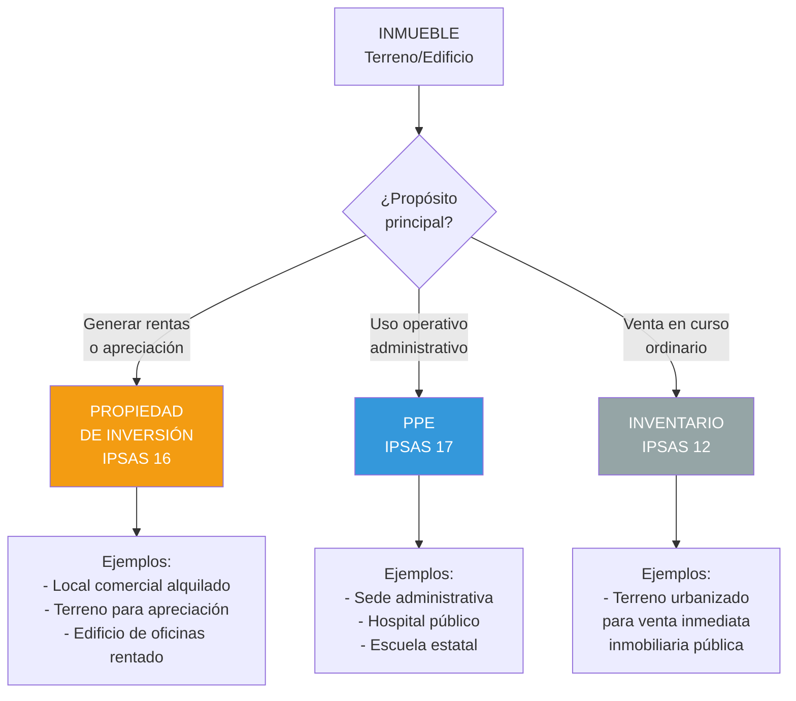

# IPSAS 16: Propiedad de Inversión

## Resumen

La IPSAS 16 prescribe el tratamiento contable de propiedades de inversión (terrenos o edificios mantenidos para obtener rentas, apreciación de capital, o ambos), permitiendo elegir entre modelo del costo (como PPE) o modelo del valor razonable (cambios en resultados), requiriendo revelaciones sobre valores razonables, rentas obtenidas y compromisos, aplicándose a entidades del sector público con portafolios inmobiliarios generadores de ingresos (ministerios con inmuebles alquilados, fondos de pensiones públicos, municipalidades con locales comerciales).

## Definición / Texto Normativo

**IPSAS 16 - Investment Property, Párrafo 7:**

> "**Propiedad de inversión** es una propiedad (terreno o edificio, o parte de un edificio, o ambos) mantenida (por el propietario o por el arrendatario bajo un arrendamiento) para obtener **rentas**, **apreciación del capital**, o ambas, en lugar de para:
>
> (a) su uso en la producción o suministro de bienes o servicios, o para fines administrativos; o
>
> (b) su venta en el curso ordinario de las operaciones."

**IPSAS 16, Párrafo 30 - Medición inicial:**

> "Una propiedad de inversión se medirá inicialmente al **costo**."

**IPSAS 16, Párrafo 33 - Medición posterior (elección de política):**

> "La entidad puede elegir como **política contable** el **modelo del valor razonable** (párrafos 35-55) o el **modelo del costo** (párrafo 56), y aplicará esa política a **todas** sus propiedades de inversión."

**IPSAS 16, Párrafo 35 - Modelo del valor razonable:**

> "Después del reconocimiento inicial, una entidad que elija el modelo del valor razonable medirá todas sus propiedades de inversión a su **valor razonable**, excepto en los casos excepcionales (párrafo 53). Cuando el valor razonable de una propiedad de inversión mantenida por un arrendatario no pueda determinarse con fiabilidad, se contabilizará según IPSAS 13."

**IPSAS 16, Párrafo 38 - Ganancias/pérdidas:**

> "Una ganancia o pérdida surgida de un cambio en el valor razonable de una propiedad de inversión se reconocerá en el **superávit o déficit del periodo** en el que surja."

**IPSAS 16, Párrafo 56 - Modelo del costo:**

> "Después del reconocimiento inicial, una entidad que elija el modelo del costo medirá todas sus propiedades de inversión según IPSAS 17 Propiedad, Planta y Equipo, es decir, al **costo menos depreciación acumulada y pérdidas por deterioro acumuladas**."

## Desarrollo / Interpretación

### Clasificación: ¿PPE o Propiedad de Inversión?



**Ejemplos de clasificación en sector público peruano:**

| Inmueble                                          | Clasificación          | Norma    | Razón                            |
| ------------------------------------------------- | ---------------------- | -------- | -------------------------------- |
| Local alquilado a empresa privada (Municipalidad) | Propiedad de Inversión | IPSAS 16 | Genera rentas                    |
| Terreno en zona de expansión urbana (sin uso)     | Propiedad de Inversión | IPSAS 16 | Apreciación de capital           |
| Edificio administrativo MEF (Lima)                | PPE                    | IPSAS 17 | Uso administrativo               |
| Hospital MINSA                                    | PPE                    | IPSAS 17 | Suministro de servicios públicos |
| Mercado municipal (stands alquilados)             | Propiedad de Inversión | IPSAS 16 | Genera rentas                    |
| Casa habitación (beneficio empleados)             | PPE                    | IPSAS 17 | Uso en compensación personal     |

---

### Modelo del Valor Razonable vs Modelo del Costo

**Elección de política contable (párrafo 33):**

La entidad **ELIGE UNA POLÍTICA** y la aplica a **TODAS** sus propiedades de inversión:

#### **Opción 1: Modelo del Valor Razonable**

```
Medición posterior: Valor razonable
Depreciación: NO se deprecia
Cambios en VR: Reconocer en RESULTADOS (superávit/déficit)
Revelación obligatoria: Describir cómo se determinó VR
```

**Ventajas:**

- ✅ Refleja valor de mercado actual
- ✅ Información más relevante para decisiones
- ✅ Transparencia en portafolio inmobiliario

**Desventajas:**

- ❌ Requiere tasaciones periódicas (costo)
- ❌ Volatilidad en resultados (fluctuaciones mercado)
- ❌ Subjetividad en valoración

**Ejemplo:**

```
Edificio de oficinas alquilado:
  Costo inicial (2020): S/. 8,000,000
  VR al 31/12/2023: S/. 9,200,000
  VR al 31/12/2024: S/. 9,500,000

Asiento 2024:
  Propiedad de Inversión             300,000
      Ganancia por Cambio VR                 300,000
  [S/. 9,500,000 - S/. 9,200,000]
```

---

#### **Opción 2: Modelo del Costo**

```
Medición posterior: Costo - Depreciación acumulada - Deterioro
Depreciación: SÍ (sistemática, vida útil)
Cambios: Solo por deterioro (IPSAS 21/26)
Revelación obligatoria: Revelar VR en notas (aunque se mida al costo)
```

**Ventajas:**

- ✅ Más simple y objetivo
- ✅ No requiere tasaciones anuales
- ✅ Menos volatilidad en resultados

**Desventajas:**

- ❌ Información menos relevante (valor histórico)
- ❌ No refleja apreciación de capital

**Ejemplo:**

```
Mismo edificio, modelo del costo:
  Costo inicial (2020): S/. 8,000,000
  Vida útil: 40 años
  Depreciación anual: S/. 200,000

Asiento 2024:
  Gasto - Depreciación PI            200,000
      Depreciación Acumulada - PI            200,000

Valor en libros 31/12/2024:
  S/. 8,000,000 - (S/. 200,000 × 5 años) = S/. 7,000,000

Revelación: "El VR estimado al 31/12/2024 es S/. 9,500,000"
```

---

### Transferencias (Párrafos 57-62)

**Regla:** Solo cuando hay **cambio de uso** (evidenciado por eventos específicos):

#### **De PPE a Propiedad de Inversión:**

**Evento:** Edificio administrativo se alquila a terceros

```
Si modelo VR:
  - Medir edificio a VR en fecha de transferencia
  - Diferencia con valor en libros PPE → Revaluación (patrimonio)
  - Después: Aplicar IPSAS 16 (cambios VR → resultados)

Si modelo costo:
  - Transferir valor en libros (costo - depreciación)
  - Continuar depreciando
```

**Ejemplo (modelo VR):**

```
Edificio PPE:
  Costo: S/. 5,000,000
  Depreciación acumulada: S/. 1,200,000
  Valor en libros: S/. 3,800,000

Fecha transferencia (se alquila):
  VR: S/. 4,500,000

Asiento:
  Propiedad de Inversión                    4,500,000
  Depreciación Acumulada - PPE              1,200,000
      PPE - Edificio                                5,000,000
      Superávit por Revaluación (patrimonio)          700,000
```

---

#### **De Propiedad de Inversión a PPE:**

**Evento:** Local alquilado se destina a uso administrativo

```
Si estaba en modelo VR:
  - Transferir a PPE al VR en fecha de cambio
  - VR se convierte en "costo atribuido" para PPE
  - Después: Aplicar IPSAS 17 (depreciar)

Si estaba en modelo costo:
  - Transferir valor en libros (costo - depreciación)
```

---

### Revelaciones Clave (Párrafos 74-79)

**Información obligatoria:**

1. **Política contable:** ¿Modelo VR o modelo costo?
2. **Criterios de clasificación:** Cómo distingue PI de PPE
3. **Métodos de valoración:** Si modelo VR, cómo se determina (tasador, mercado, otros)
4. **Montos:**
   - Rentas obtenidas de propiedades de inversión
   - Gastos operativos directos (mantenimiento, impuestos)
   - Ganancias/pérdidas por cambios en VR (si modelo VR)
5. **Restricciones:** Inmuebles pignorados como garantía
6. **Compromisos:** Obligaciones de compra, construcción, mejoras
7. **Si modelo costo:** **Revelar VR** en notas (párrafo 79)

**Ejemplo de revelación:**

**Nota 10 - Propiedades de Inversión**

```
10.1 Política contable:
La entidad aplica el modelo del valor razonable para todas sus propiedades de inversión.
Los cambios en valor razonable se reconocen en resultados del periodo.

10.2 Composición (al 31/12/2024):

                                    Valor Razonable
Edificio comercial - Centro Lima    S/. 12,500,000
Terreno - Zona industrial Callao    S/.  3,200,000
Local comercial - Arequipa          S/.  2,800,000
                                    ---------------
TOTAL                               S/. 18,500,000

10.3 Movimiento del año:
Saldo inicial (01/01/2024)          S/. 17,200,000
Adquisiciones                       S/.    800,000
Mejoras capitalizadas               S/.    350,000
Ganancia por cambio VR              S/.    650,000
Transferencia desde PPE             S/.    500,000
Saldo final (31/12/2024)            S/. 18,500,000

10.4 Determinación del valor razonable:
Los inmuebles fueron tasados por perito independiente (colegiado) en noviembre 2024,
usando método comparativo de mercado (transacciones recientes en zonas similares).

10.5 Ingresos y gastos:
Rentas obtenidas (2024)             S/.  1,480,000
Gastos operativos directos          S/.   (320,000)
Resultado neto propiedades          S/.  1,160,000

10.6 Restricciones:
El Edificio comercial está garantizado como colateral de préstamo bancario
(saldo S/. 4,500,000 al 31/12/2024).
```

## Conexiones

- [[unidad-I/marco-conceptual-nicsp|Marco Conceptual]] - Activos generan beneficios económicos futuros
- [[ipsas-17-propiedad-planta-equipo|IPSAS 17]] - PPE vs Propiedad de Inversión (diferencia por propósito)
- [[unidad-I/valor-razonable-sector-publico|Valor Razonable]] - Técnica de medición modelo VR
- [[ipsas-12-inventarios|IPSAS 12]] - Inmuebles para venta inmediata son inventarios
- [[ipsas-43-arrendamientos|IPSAS 43]] - Propiedad de inversión puede estar arrendada (arrendatario reconoce activo por derecho de uso)
- [[unidad-I/diferencias-nicsp-niif|Diferencias NICSP-NIIF]] - IPSAS 16 basada en IAS 40
- [[unidad-I/base-devengado|Base de Devengado]] - Reconocimiento de rentas e ingresos

## Ejemplos Resueltos

### Ejemplo 1: Mercado Municipal - Modelo Valor Razonable (Intermedio)

**Situación:**
Municipalidad Provincial construyó mercado municipal en 2020 para alquilar stands a comerciantes:

**Datos iniciales (2020):**

- Costo terreno: S/. 1,500,000
- Costo construcción: S/. 4,200,000
- **Costo total:** S/. 5,700,000
- Política contable: **Modelo del valor razonable**

**Durante 2024:**

- Rentas cobradas: S/. 680,000
- Gastos mantenimiento: S/. 95,000
- Mejoras capitalizadas (techado adicional): S/. 280,000

**31/12/2024:**

- Tasación independiente: Valor razonable S/. 7,100,000
- Valor en libros antes de revalorización: S/. 6,850,000 (VR 31/12/2023: S/. 6,570,000 + mejoras S/. 280,000)

**Tarea:** Registrar operaciones 2024 y preparar revelación.

---

**Solución:**

**Asiento 1: Rentas cobradas**

```
Banco                                      680,000
    Ingresos - Rentas Propiedades Inversión        680,000
```

**Asiento 2: Gastos de mantenimiento**

```
Gasto - Mantenimiento PI                    95,000
    Banco                                           95,000
```

**Asiento 3: Mejoras capitalizadas**

```
Propiedad de Inversión - Mercado           280,000
    Banco                                          280,000
[Incrementa valor del activo]
```

**Asiento 4: Revalorización a VR (31/12/2024)**

```
Valor antes revalorización: S/. 6,850,000
VR tasación: S/. 7,100,000
Incremento: S/. 250,000

Propiedad de Inversión - Mercado           250,000
    Ganancia por Cambio VR - PI                    250,000
```

**Estado de Gestión (2024 - extracto):**

```
INGRESOS:
  Rentas Propiedades Inversión            S/. 680,000
  Ganancia por Cambio VR - PI             S/. 250,000
  Total ingresos PI                       S/. 930,000

GASTOS:
  Mantenimiento PI                        S/.  95,000

RESULTADO NETO (propiedades):             S/. 835,000
```

**Estado de Situación Financiera (31/12/2024):**

```
ACTIVOS NO CORRIENTES:
  Propiedad de Inversión - Mercado        S/. 7,100,000
```

**Revelación:**

```
Nota 10 - Propiedades de Inversión:

Política: Modelo del valor razonable.

Mercado Municipal (stands alquilados):
  Saldo inicial (01/01/2024)              S/. 6,570,000
  Mejoras (techado adicional)             S/.   280,000
  Ganancia por cambio VR                  S/.   250,000
  Saldo final (31/12/2024)                S/. 7,100,000

Valoración: Tasación independiente (Perito Colegiado Nº 12345)
usando método comparativo de mercado (nov-2024).

Ingresos/Gastos:
  Rentas stands (45 comerciantes)         S/. 680,000
  Gastos operativos                       S/.  95,000
  Resultado operativo                     S/. 585,000

Restricciones: Ninguna.
```

---

### Ejemplo 2: Transferencia PPE a Propiedad de Inversión (Avanzado)

**Situación:**
Gobierno Regional tiene edificio administrativo que decide alquilar:

**Datos del edificio (PPE):**

- Costo inicial (2018): S/. 6,000,000
- Depreciación acumulada al 31/12/2023: S/. 1,350,000 (vida útil 40 años, S/. 150K/año × 9 años)
- **Valor en libros 31/12/2023:** S/. 4,650,000

**01/07/2024:**

- El gobierno regional decide alquilar TODO el edificio a empresa privada (cambio de uso)
- Contrato de arrendamiento: 10 años, S/. 45,000/mes
- Tasación a la fecha: **Valor razonable S/. 5,400,000**
- Política contable propiedades de inversión: **Modelo del valor razonable**

**30/06/2024 (antes de transferencia):**

- Depreciación semestral PPE: S/. 75,000

**Durante julio-diciembre 2024:**

- Rentas cobradas: S/. 45,000 × 6 = S/. 270,000
- Gastos mantenimiento: S/. 18,000

**31/12/2024:**

- Nueva tasación: Valor razonable S/. 5,550,000

**Tarea:** Registrar depreciación semestre 1, transferencia, operaciones semestre 2, revalorización y preparar revelación.

---

**Solución:**

**Asiento 1: Depreciación PPE (enero-junio 2024)**

```
Gasto - Depreciación Edificio               75,000
    Depreciación Acumulada - Edificio               75,000
[Antes de transferencia, sigue siendo PPE]
```

**Valor en libros 30/06/2024:**

```
Costo: S/. 6,000,000
Depreciación acumulada: S/. 1,425,000
Valor en libros: S/. 4,575,000
```

---

**Asiento 2: Transferencia a PI (01/07/2024)**

```
Propiedad de Inversión - Edificio         5,400,000
Depreciación Acumulada - Edificio         1,425,000
    PPE - Edificio                                 6,000,000
    Superávit por Revaluación (patrimonio)           825,000

[Transferir a VR, diferencia S/. 5,400,000 - S/. 4,575,000 = S/. 825,000 a patrimonio]
```

**Explicación:** IPSAS 16 (párrafo 59) requiere que al transferir de PPE a PI (modelo VR), cualquier diferencia entre valor en libros PPE y VR se trate como **revaluación de PPE** (va a patrimonio, no a resultados).

---

**Asiento 3: Rentas cobradas (jul-dic 2024)**

```
Banco                                      270,000
    Ingresos - Rentas PI                           270,000
```

**Asiento 4: Gastos mantenimiento**

```
Gasto - Mantenimiento PI                    18,000
    Banco                                           18,000
```

**Asiento 5: Revalorización a VR (31/12/2024)**

```
Valor en libros: S/. 5,400,000 (desde transferencia)
VR nuevo: S/. 5,550,000
Incremento: S/. 150,000

Propiedad de Inversión - Edificio          150,000
    Ganancia por Cambio VR - PI                    150,000

[Ahora es PI, cambios VR van a RESULTADOS]
```

---

**Estado de Gestión (2024):**

```
GASTOS:
  Depreciación Edificio (ene-jun)         S/.  75,000
  Mantenimiento PI (jul-dic)              S/.  18,000

INGRESOS:
  Rentas PI (jul-dic)                     S/. 270,000
  Ganancia por Cambio VR - PI             S/. 150,000

RESULTADO NETO (edificio):                S/. 327,000
```

**Estado de Cambios en Patrimonio (2024):**

```
Superávit por Revaluación:
  Saldo inicial                           S/.       0
  Revaluación por transferencia PPE→PI    S/. 825,000
  Saldo final                             S/. 825,000
```

**Revelación:**

```
Nota 10 - Propiedades de Inversión:

Política: Modelo del valor razonable.

Movimiento 2024:
  Transferencia desde PPE (01/07)         S/. 5,400,000
  Ganancia por cambio VR (sem 2)          S/.   150,000
  Saldo final (31/12/2024)                S/. 5,550,000

Nota 15 - Transferencias:
El 01/07/2024 se transfirió edificio administrativo desde PPE a Propiedad de Inversión
debido a cambio de uso (alquilado integralmente a terceros). El edificio se midió a
valor razonable (S/. 5,400,000) en fecha de transferencia. La diferencia con el valor
en libros como PPE (S/. 4,575,000) se reconoció como Superávit por Revaluación
(S/. 825,000) en patrimonio, conforme IPSAS 16 párrafo 59.

Ingresos/Gastos (jul-dic 2024):
  Rentas (empresa XYZ, contrato 10 años)  S/. 270,000
  Gastos operativos                       S/.  18,000
```

## Ejercicios Propuestos

### Ejercicio 1: Clasificación y Medición Básica (Básico)

Universidad Nacional tiene los siguientes inmuebles al 31/12/2024:

1. **Campus principal:** Terreno + edificios (aulas, laboratorios, biblioteca) - Uso educativo
2. **Local comercial:** Alquilado a banco privado, S/. 8,000/mes
3. **Terreno baldío:** Zona de expansión urbana, sin uso actual, se espera apreciación
4. **Casa habitación:** Asignada a rector como beneficio del cargo
5. **Mercado artesanal:** Stands alquilados a 30 artesanos, S/. 500/mes c/u

**Tarea:**

1. Clasifica cada inmueble (PPE, Propiedad Inversión, o Inventario)
2. Indica la norma aplicable (IPSAS 12, 16 o 17)
3. Para las propiedades de inversión: Si universidad adopta modelo VR, ¿se deprecian?
4. Para PPE: ¿Se deprecian?

---

### Ejercicio 2: Modelo del Costo - Comparación con VR (Intermedio)

Gobierno Regional tiene edificio de oficinas que alquila a entidades privadas:

**Datos:**

- Adquirido 01/01/2020: S/. 10,000,000
- Vida útil: 50 años
- Política contable: **Modelo del costo**

**31/12/2024:**

- Valor en libros (costo - depreciación acumulada): ?
- Tasación independiente: Valor razonable S/. 12,500,000

**Durante 2024:**

- Rentas: S/. 850,000
- Gastos operativos: S/. 120,000

**Tarea:**

1. Calcula depreciación anual
2. Calcula valor en libros al 31/12/2024
3. Registra depreciación 2024
4. Presenta revelación (incluir VR aunque se mida al costo - párrafo 79)
5. Compara: Si adoptara modelo VR en 2020, ¿qué valor tendría al 31/12/2024? ¿Qué ganancia reconocería en 2024?

---

### Ejercicio 3: Caso Integral - Portafolio con Transferencia (Avanzado)

Fondo de Pensiones Público administra portafolio de propiedades de inversión (modelo VR):

**Situación al 01/01/2024:**

| Propiedad                      | Valor Razonable    |
| ------------------------------ | ------------------ |
| Edificio A (oficinas, Lima)    | S/. 18,000,000     |
| Local B (comercial, Arequipa)  | S/. 5,200,000      |
| Terreno C (industrial, Callao) | S/. 3,800,000      |
| **TOTAL**                      | **S/. 27,000,000** |

**Operaciones 2024:**

**Marzo:**

- Se vende Local B por S/. 5,500,000 (efectivo)

**Mayo:**

- Se adquiere Edificio D (comercial, Trujillo) por S/. 6,800,000
- Costos de transacción: S/. 85,000

**Julio:**

- Terreno C se destina a construcción de sede administrativa del fondo (cambio de uso → PPE)
- VR a fecha de transferencia: S/. 4,100,000

**Septiembre:**

- Mejoras capitalizadas Edificio A (remodelación): S/. 950,000

**31/12/2024:**

- Nueva tasación:
  - Edificio A: S/. 20,500,000
  - Edificio D: S/. 7,200,000

**Ingresos/Gastos 2024:**

- Rentas totales: S/. 2,350,000
- Gastos operativos: S/. 420,000

**Tarea (2,000 palabras):**

1. **Registra todas las operaciones:**
   - Venta Local B
   - Compra Edificio D (¿costos transacción se capitalizan o son gasto?)
   - Transferencia Terreno C a PPE
   - Mejoras Edificio A
   - Rentas y gastos
   - Revalorización final

2. **Estado de Cambios en Propiedades de Inversión:**
   - Saldo inicial
   - Adiciones/Disposiciones
   - Transferencias
   - Mejoras
   - Ganancia/Pérdida por cambios VR
   - Saldo final

3. **Estado de Gestión (2024):**
   - Ingresos (rentas + ganancia venta + ganancia cambios VR)
   - Gastos (operativos)
   - Resultado neto

4. **Revelación (Nota 10):**
   - Composición al 31/12/2024
   - Movimientos detallados
   - Métodos de valoración
   - Ingresos/gastos

5. **Análisis:**
   - Calcula rentabilidad portafolio: (Ingresos totales / Valor promedio activos) × 100
   - ¿La transferencia de Terreno C afecta resultados? ¿Cómo?
   - Si adoptara modelo del costo en 2020, ¿qué diferencia habría en patrimonio al 31/12/2024?

## Preguntas Bloom

**Nivel 1 - Recordar:** Define "propiedad de inversión" según IPSAS 16. Enumera los dos modelos de medición posterior permitidos.

**Nivel 2 - Comprender:** Explica la diferencia entre Propiedad de Inversión (IPSAS 16) y PPE (IPSAS 17). Proporciona 3 ejemplos de cada uno en sector público.

**Nivel 3 - Aplicar:** Una municipalidad tiene local comercial alquilado (costo S/. 3,000,000, depreciación acumulada S/. 600,000). El 01/01/2024 adopta modelo VR. VR ese día: S/. 3,800,000. Registra la transferencia de modelo costo a modelo VR, aplicando IPSAS 16 párrafo 35.

**Nivel 4 - Analizar:** Compara el impacto en estados financieros (2024-2028) de: (a) Modelo del costo (vida útil 40 años), (b) Modelo VR (apreciación 3% anual). Propiedad costo inicial S/. 10,000,000. Analiza: Valor en libros final, depreciación acumulada, ganancias reconocidas, patrimonio.

**Nivel 5 - Evaluar:** Un gobierno regional argumenta: "No deberíamos adoptar modelo VR porque genera volatilidad artificial en resultados y requiere tasaciones costosas. Modelo del costo es más prudente y simple." Evalúa este argumento considerando: (a) Relevancia de información, (b) Transparencia de portafolio inmobiliario, (c) Costo-beneficio, (d) Comparabilidad. ¿Qué recomendarías?

**Nivel 6 - Crear:** Diseña una "Política Institucional de Gestión de Propiedades de Inversión" para entidades del sector público peruano que incluya: (1) Criterios de clasificación (PI vs PPE), (2) Elección fundamentada de modelo (VR o costo), (3) Proceso de tasación (frecuencia, tasadores, métodos), (4) Procedimientos de transferencias (cambios de uso), (5) Revelaciones estándar (Nota 10), (6) Responsables (áreas de patrimonio, contabilidad, legal), (7) Integración con SIAF. Extensión: 1,500 palabras.

## Base Normativa

**Norma IPSASB:**

1. **IPSAS 16 - Investment Property (emitida 2001, revisada 2008).** Define propiedades de inversión, permite elección entre modelo VR y modelo costo, requiere revelaciones.
   - Párrafos clave: 7 (definición), 30 (medición inicial), 33-55 (modelo VR), 56 (modelo costo), 57-62 (transferencias), 74-79 (revelaciones)
   - Disponible: www.ipsasb.org/publications/ipsas-16-investment-property

**Normas relacionadas:** 2. **IAS 40 - Investment Property (IFRS).** Base de IPSAS 16 (muy similar). 3. **IPSAS 17 - Property, Plant and Equipment.** PPE vs PI, medición si modelo costo. 4. **IPSAS 12 - Inventories.** Inmuebles para venta son inventarios. 5. **IPSAS 41 - Financial Instruments.** Definición de valor razonable.

**Normativa Peruana:** 6. **Plan Contable Gubernamental 2019:**

- 152 - Propiedad de Inversión (si modelo costo)
- 1521 - Edificios
- 1522 - Terrenos

7. **Directiva MEF (próxima):** Guía para entidades con portafolios inmobiliarios.

**Literatura:** 8. Cairns, D. (2006). "The Use of Fair Value in IFRS". _Accounting in Europe_, 3(1), 5-22. (Relevante para debate modelo VR)

## Referencias Bibliográficas y Recursos en Línea

**Textos oficiales:**

- **IPSASB:** www.ipsasb.org/publications/ipsas-16-investment-property

**Recursos en español:**

- **IFAC:** Traducción IPSAS 16

**Herramientas:**

- **Tasación inmobiliaria:** Metodologías de valor razonable (comparativo, renta, costo)

**Casos:**

- **Australia:** Public sector property portfolios - Fair value adoption

## Notas y Alertas

> **⚠️ Error Común:** Clasificar inmueble ocupado parcialmente como 100% PI o 100% PPE. **Regla:** Si porciones son claramente separables (ej. edificio 3 pisos: 2 alquilados, 1 uso administrativo), separar. Si no separable, clasificar según porción que genera rentas (si >50% alquilado → PI, si <50% → PPE).

> **💡 Modelo VR - Tasación:** Si adoptas modelo VR, tasación profesional debe ser periódica (mínimo cada 3-5 años, dependiendo de volatilidad mercado). Años intermedios: Actualizar con índices inmobiliarios si mercado es estable.

> **📊 Revelación Obligatoria Modelo Costo:** Párrafo 79 requiere revelar VR **incluso si mides al costo**. No puedes omitir esta información (transparencia sobre patrimonio).

> **🔍 Transferencias - Patrimonio vs Resultados:** Al transferir de PPE a PI (modelo VR), diferencia va a **patrimonio** (revaluación PPE). Pero después, cambios VR van a **resultados**. Esta asimetría es intencional (IPSAS 16 párrafo 59).

> **⚙️ Integración SIAF (Perú):** Módulo "Patrimonio" permite registrar propiedades de inversión separadamente. Pendiente: Automatizar cálculos VR (actualmente manual, tasaciones externas).

> **📖 Para Profundizar:** Debate sobre modelo VR en sector público (volatilidad vs relevancia): Cairns, D. (2006). "The Use of Fair Value in IFRS". _Accounting in Europe_, 3(1), 5-22.

---

<div style="text-align: center;">
<a href="https://notbyai.fyi">

</a>
</div>
