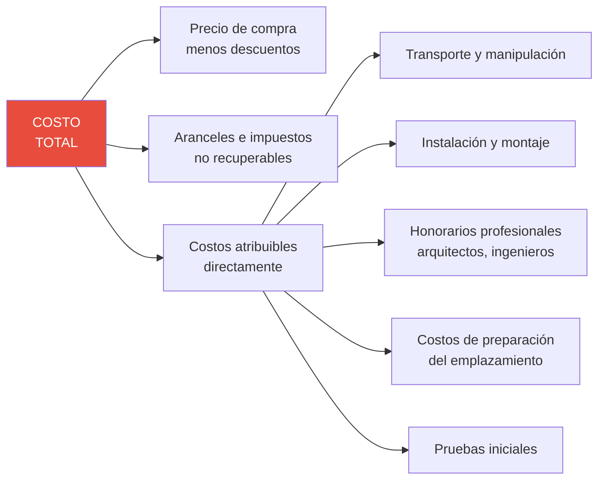
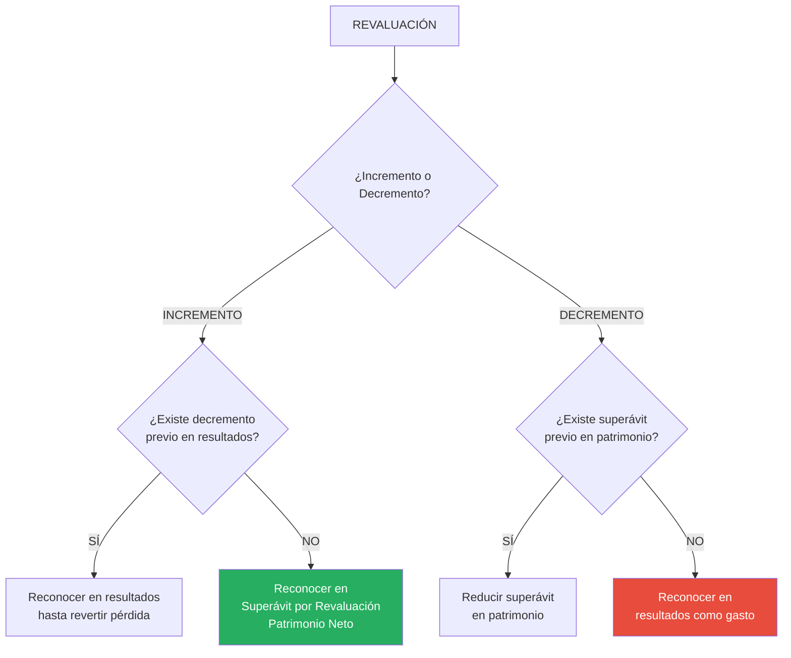

# IPSAS 17: Propiedad, Planta y Equipo (PPE)

## Resumen

La IPSAS 17 establece el tratamiento contable de la Propiedad, Planta y Equipo (PPE) en el sector público, definiendo activos tangibles usados en producción/suministro de bienes o servicios, alquiler a terceros o fines administrativos, que se esperan usar durante más de un periodo. Requiere reconocimiento inicial al costo (o [[ipsas-23-ingresos-sin-contraprestacion|valor razonable si es adquirido sin contraprestación]]), depreciación sistemática durante su vida útil, y aplicación del modelo de costo o revaluación para medición posterior. Incluye revelaciones sobre infraestructura y patrimonio cultural, destacando diferencias clave con el sector privado (ver [[diferencias-nicsp-niif|diferencias NICSP vs NIIF]]).

## Definición / Texto Normativo

**IPSAS 17 - Propiedad, Planta y Equipo, Párrafo 13:**

> "**Propiedad, planta y equipo** son activos tangibles que:
> (a) Son mantenidos por una entidad para su uso en la producción o suministro de bienes o servicios, para arrendarlos a terceros o para propósitos administrativos; y
> (b) Se espera sean usados durante más de un periodo de información."

**IPSAS 17, Párrafo 19 - Reconocimiento:**

> "El costo de un elemento de propiedad, planta y equipo se **reconocerá como activo** si, y solo si:
> (a) Es probable que **fluyan a la entidad beneficios económicos futuros o potencial de servicio** asociados con el elemento (ver [[marco-conceptual-nicsp|Marco Conceptual]]); y
> (b) El **costo** o **valor razonable** del elemento puede ser **medido confiablemente**."

**IPSAS 17, Párrafo 47 - Depreciación:**

> "Se depreciará de forma separada cada parte de un elemento de propiedad, planta y equipo que tenga un costo significativo con relación al costo total del elemento."

**IPSAS 17, Párrafo 27 - Adquisiciones sin contraprestación:**

> "El costo inicial de un elemento de propiedad, planta y equipo adquirido a través de una transacción sin contraprestación será su **valor razonable** a la fecha de adquisición."

**Definiciones clave (Párrafo 13):**

- **Depreciación:** Distribución sistemática del importe depreciable de un activo durante su vida útil.
- **Importe depreciable:** Costo de un activo menos su valor residual.
- **Vida útil:** Periodo durante el cual se espera que un activo esté disponible para su uso por la entidad, o número de unidades de producción/similares que se espera obtener.
- **Valor residual:** Importe estimado que la entidad obtendría actualmente por la disposición del activo, después de deducir los costos estimados de disposición.

## Desarrollo / Interpretación

### Alcance y Características de PPE en el Sector Público

```mermaid
graph TB
    A[ACTIVOS TANGIBLES<br/>SECTOR PÚBLICO] --> B{¿Uso > 1 periodo?}

    B -->|NO| C[INVENTARIOS<br/>[[ipsas-12-inventarios|IPSAS 12]]]
    B -->|SÍ| D{¿Propósito?}

    D --> E[Producción/<br/>Servicios]
    D --> F[Arrendamiento<br/>a terceros]
    D --> G[Administración]

    E & F & G --> H[PPE<br/>IPSAS 17]

    H --> I[Ejemplos<br/>Sector Público]

    I --> I1[EDIFICIOS:<br/>Hospitales, escuelas,<br/>oficinas municipales]
    I --> I2[INFRAESTRUCTURA:<br/>Carreteras, puentes,<br/>redes de agua/alcantarillado]
    I --> I3[VEHÍCULOS:<br/>Ambulancias, patrulleros,<br/>camiones recolectores]
    I --> I4[EQUIPAMIENTO:<br/>Computadoras, maquinaria,<br/>mobiliario]
    I --> I5[TERRENOS:<br/>Parques, plazas,<br/>reservas naturales]

    style H fill:#27AE60,color:#fff
    style I fill:#3498DB,color:#fff
```

**Categorías especiales en sector público:**

#### **1. Activos de Infraestructura**

**Definición (Párrafo 21):**

> "Activos especializados que no tienen usos alternativos y generalmente son **inmóviles**. Ejemplos: carreteras, puentes, túneles, redes de distribución de agua."

**Características:**

- ✅ Uso público generalizado (no uso exclusivo de la entidad)
- ✅ Frecuentemente son **sistemas/redes** (no elementos individuales)
- ✅ No pueden venderse fácilmente o cambiarse de ubicación
- ✅ Pueden tener vidas útiles muy largas (50-100 años)

**Ejemplo:** Una red de alcantarillado de 500 km es **un solo activo** para efectos de IPSAS 17, aunque tenga miles de componentes (tuberías, buzones, plantas de tratamiento).

#### **2. Activos Patrimonio Cultural (Heritage Assets)**

**Definición (Párrafo 10):**

> "Activos con **significado cultural, ambiental o histórico**. Ejemplos: edificios históricos, monumentos, sitios arqueológicos, obras de arte."

**Características únicas:**

- ✅ Valor cultural puede exceder valor económico
- ✅ Frecuentemente existen **restricciones legales** de venta o disposición
- ✅ Vida útil potencialmente **ilimitada** (si hay conservación adecuada)
- ✅ Pueden ser difíciles de valorar (no hay mercado activo)

**Tratamiento bajo IPSAS 17:**

- **Deben reconocerse** si se puede medir confiablemente su costo o valor razonable
- **Opción de no depreciar** si la vida útil es indefinida y el valor no disminuye con el tiempo (mantenimiento adecuado)

**Ejemplo:** Machu Picchu - ¿Cómo valorarlo? ¿Tiene "valor residual"? ¿Se deprecia?

**Solución práctica (párrafo 10):** Si no se puede medir confiablemente, se **revela en notas** pero no se reconoce en el [[nicsp-1-presentacion-estados-financieros|Estado de Situación Financiera]].

---

### Reconocimiento Inicial

#### **Criterio 1: Probabilidad de beneficios económicos / potencial de servicio**

**Sector privado ([[diferencias-nicsp-niif|IAS 16]]):**

- Enfoque: Beneficios **económicos** futuros (flujos de efectivo)

**Sector público (IPSAS 17):**

- Enfoque dual: Beneficios económicos **o potencial de servicio**

**Potencial de servicio:**
Capacidad del activo para proveer servicios públicos, **incluso si no genera flujos de efectivo**.

**Ejemplo:**

| Activo                       | ¿Beneficios económicos? | ¿Potencial de servicio?            | ¿Se reconoce? |
| ---------------------------- | ----------------------- | ---------------------------------- | ------------- |
| Ambulancia                   | ❌ No genera ingresos   | ✅ Transporta pacientes (servicio) | ✅ SÍ         |
| Parque público               | ❌ No genera ingresos   | ✅ Recreación ciudadana            | ✅ SÍ         |
| Edificio municipal arrendado | ✅ Genera rentas        | ✅ También                         | ✅ SÍ         |

**Conclusión:** En sector público, el criterio de "beneficios" es más **amplio** que en sector privado.

#### **Criterio 2: Medición confiable del costo**

**Costo de adquisición (Párrafo 23):**



**Exclusiones del costo (no deben incluirse):**

❌ Costos de apertura de nueva instalación (después de estar listo)  
❌ Costos de introducir nuevo producto/servicio (marketing)  
❌ Costos de traslado/reorganización  
❌ Costos administrativos generales  
❌ Pérdidas iniciales de operación

**Ejemplo de costo completo:**

**Construcción de hospital público:**

| Concepto                                   | Monto          | ¿Incluir?                    |
| ------------------------------------------ | -------------- | ---------------------------- |
| Compra de terreno                          | S/. 5,000,000  | ✅ Terreno (PPE separado)    |
| Demolición de edificio previo              | S/. 200,000    | ✅ Preparación emplazamiento |
| Diseño arquitectónico                      | S/. 1,500,000  | ✅ Honorarios profesionales  |
| Construcción (contratista)                 | S/. 80,000,000 | ✅ Costo principal           |
| Supervisión de obra (ingenieros)           | S/. 3,000,000  | ✅ Directamente atribuible   |
| Equipamiento médico (instalado)            | S/. 15,000,000 | ✅ PPE (componente equipos)  |
| Costos financieros (préstamo construcción) | S/. 2,500,000  | ✅ Costo calificable\*       |
| Capacitación personal médico               | S/. 800,000    | ❌ Gasto operativo           |
| Campaña inauguración                       | S/. 300,000    | ❌ Gasto marketing           |

\*Costos de financiamiento: Pueden incluirse bajo IPSAS 5 si se cumplen condiciones.

**Costo del edificio (PPE):**

```
Terreno: S/. 5,000,000 (no depreciarble)
Edificio: S/. 87,200,000 (200,000 + 1,500,000 + 80,000,000 + 3,000,000 + 2,500,000)
Equipos: S/. 15,000,000 (componente separado)
```

---

### Adquisiciones sin Contraprestación (Donaciones)

**Regla especial (Párrafo 27):**

> "El costo inicial será su **valor razonable a la fecha de adquisición**."

**Proceso:**

1. **Identificar la donación/transferencia**
2. **Medir el valor razonable** del activo recibido
3. **Reconocer simultáneamente:**
   - Activo (PPE) → Débito
   - Ingreso sin contraprestación (IPSAS 23) → Crédito

**Jerarquía de valor razonable (Párrafo 28):**

**Nivel 1:** Precio de mercado en mercado activo (mejor opción)  
**Nivel 2:** Precio de mercado de activos similares  
**Nivel 3:** Valoración por perito (tasación)  
**Nivel 4:** Costo de reposición depreciado

**Ejemplo:**

**Caso:** ONG dona a municipalidad 5 ambulancias nuevas (0 km).

```
Paso 1: Investigar valor razonable
- Precio de mercado de ambulancia equivalente: S/. 250,000 c/u
- Total valor razonable: S/. 1,250,000

Paso 2: Reconocimiento

Vehículos - Ambulancias (PPE)      1,250,000
    Ingreso - Donaciones (IPSAS 23)         1,250,000

[Reconocimiento al recibir, fecha de transferencia de control]
```

---

### Depreciación: Concepto y Cálculo

**Objetivo de la depreciación (Párrafo 53):**

> "Reflejar el consumo del **potencial de servicio** o **beneficios económicos** del activo a lo largo de su vida útil."

**Fórmula básica:**

```
Depreciación anual = (Costo - Valor residual) / Vida útil

Donde:
- Importe depreciable = Costo - Valor residual
- Valor residual = Importe estimado de venta al final de vida útil (neto de costos)
```

**Métodos de depreciación permitidos (Párrafo 65):**

#### **1. Método Lineal (Straight-line)**

Depreciación constante cada año.

```
Depreciación anual = Importe depreciable / Vida útil en años
```

**Ejemplo:**

- Costo edificio: S/. 10,000,000
- Valor residual: S/. 0
- Vida útil: 50 años
- **Depreciación anual:** S/. 200,000 (10,000,000 / 50)

#### **2. Método de Saldos Decrecientes (Declining balance)**

Depreciación mayor en primeros años, disminuye con el tiempo.

```
Depreciación año N = Valor en libros inicio año × Tasa de depreciación
```

**Ejemplo:**

- Costo vehículo: S/. 100,000
- Tasa: 20% anual (saldos decrecientes)

| Año | Valor inicio | Depreciación (20%) | Valor fin  |
| --- | ------------ | ------------------ | ---------- |
| 1   | S/. 100,000  | S/. 20,000         | S/. 80,000 |
| 2   | S/. 80,000   | S/. 16,000         | S/. 64,000 |
| 3   | S/. 64,000   | S/. 12,800         | S/. 51,200 |

#### **3. Método de Unidades de Producción (Units of production)**

Depreciación basada en uso real.

```
Depreciación = (Importe depreciable / Total unidades vida útil) × Unidades usadas en el periodo
```

**Ejemplo:**

- Costo camión recolector: S/. 500,000
- Valor residual: S/. 50,000
- Vida útil estimada: 450,000 km
- Km recorridos año 1: 45,000 km

```
Depreciación por km = (500,000 - 50,000) / 450,000 = S/. 1 por km
Depreciación año 1 = 45,000 × S/. 1 = S/. 45,000
```

**Selección del método:**

**IPSAS 17, Párrafo 66:**

> "El método de depreciación utilizado reflejará el **patrón con arreglo al cual se espera que sean consumidos por la entidad los beneficios económicos futuros o el potencial de servicio** del activo."

**Recomendación por tipo de activo:**

| Tipo de activo               | Método recomendado                | Razón                            |
| ---------------------------- | --------------------------------- | -------------------------------- |
| Edificios                    | Lineal                            | Consumo uniforme en el tiempo    |
| Vehículos                    | Unidades producción (km) o Lineal | Depende del uso                  |
| Computadoras                 | Saldos decrecientes o Lineal      | Obsolescencia tecnológica rápida |
| Infraestructura (carreteras) | Lineal o Unidades (tráfico)       | Depende de datos disponibles     |
| Mobiliario                   | Lineal                            | Desgaste uniforme                |

---

### Componentes Principales (Component Approach)

**IPSAS 17, Párrafo 47:**

> "Se depreciará de forma **separada** cada parte de un elemento de propiedad, planta y equipo que tenga un **costo significativo** con relación al costo total del elemento."

**Razón:** Diferentes componentes tienen vidas útiles distintas.

**Ejemplo: Edificio hospitalario**

| Componente                    | Costo              | %        | Vida útil | Depreciación anual |
| ----------------------------- | ------------------ | -------- | --------- | ------------------ |
| Estructura (cimientos, muros) | S/. 40,000,000     | 50%      | 80 años   | S/. 500,000        |
| Techo                         | S/. 8,000,000      | 10%      | 25 años   | S/. 320,000        |
| Instalaciones eléctricas      | S/. 12,000,000     | 15%      | 20 años   | S/. 600,000        |
| Instalaciones sanitarias      | S/. 10,000,000     | 12.5%    | 30 años   | S/. 333,333        |
| Sistema HVAC (clima)          | S/. 6,000,000      | 7.5%     | 15 años   | S/. 400,000        |
| Acabados interiores           | S/. 4,000,000      | 5%       | 10 años   | S/. 400,000        |
| **TOTAL**                     | **S/. 80,000,000** | **100%** | -         | **S/. 2,553,333**  |

**Asiento contable anual:**

```
Gasto - Depreciación Edificio      2,553,333
    Depreciación Acumulada - Edificio       2,553,333

[Distribuir entre componentes, pero puede consolidarse en presentación]
```

**Ventaja del enfoque por componentes:**

- Refleja consumo real de cada parte
- Permite reemplazo de componentes sin dar de baja todo el activo
- Mejora exactitud de valor en libros

**Desventaja:**

- Complejidad administrativa (seguimiento de múltiples componentes)

---

### Medición Posterior: Modelo de Costo vs Modelo de Revaluación

**IPSAS 17 permite elegir entre 2 modelos (Párrafo 42):**

#### **Modelo de Costo (Cost Model)**

**Regla:**

```
Valor en libros = Costo - Depreciación acumulada - Pérdidas por deterioro acumuladas
```

**Características:**

- ✅ Más simple
- ✅ Menos subjetivo
- ✅ Bajo costo de aplicación
- ❌ Valor en libros puede divergir mucho del valor de mercado con el tiempo

**Ejemplo:**

```
Edificio municipal (comprado 2020):
  Costo inicial: S/. 5,000,000
  Depreciación acumulada (4 años): S/. 400,000
  Pérdidas por deterioro: S/. 0

Valor en libros (2024): S/. 4,600,000

[Este valor permanece histórico, no refleja valor de mercado actual]
```

---

#### **Modelo de Revaluación (Revaluation Model)**

**Regla (Párrafo 43):**

```
Valor en libros = Valor razonable a la fecha de revaluación - Depreciación acumulada posterior - Pérdidas por deterioro posteriores
```

**Frecuencia de revaluación (Párrafo 50):**

> "La frecuencia de las revaluaciones dependerá de los cambios en los valores razonables. Cuando el valor razonable del activo revaluado difiera significativamente de su importe en libros, será necesaria una nueva revaluación."

**Frecuencia típica:** Cada 3-5 años (dependiendo de volatilidad del mercado)

**Tratamiento de incrementos/decrementos por revaluación:**



**Ejemplo completo de revaluación:**

**Año 1 (2020) - Adquisición:**

```
Terreno - Parque Municipal           1,000,000
    Banco                                    1,000,000

[Compra inicial]
```

**Año 4 (2023) - Primera revaluación:**
Tasación profesional: Valor razonable S/. 1,500,000

```
Terreno - Parque Municipal             500,000
    Superávit por Revaluación (Patrimonio)      500,000

[Incremento S/. 500,000 va a patrimonio, no a resultados]
```

**Estado de Situación Financiera (31/12/2023):**

```
ACTIVOS NO CORRIENTES:
  Terreno                             S/. 1,500,000

PATRIMONIO NETO:
  Superávit por Revaluación           S/.   500,000
```

**Año 7 (2026) - Segunda revaluación:**
Tasación: Valor razonable S/. 1,200,000 (cayó por recesión)

Decremento: S/. 300,000 (1,500,000 - 1,200,000)

```
Superávit por Revaluación (Patrimonio)  300,000
    Terreno - Parque Municipal                  300,000

[Decremento reduce superávit previo en patrimonio]
```

**Estado de Situación Financiera (31/12/2026):**

```
ACTIVOS NO CORRIENTES:
  Terreno                             S/. 1,200,000

PATRIMONIO NETO:
  Superávit por Revaluación           S/.   200,000
  [500,000 original - 300,000 decremento]
```

**Año 10 (2029) - Tercera revaluación:**
Tasación: Valor razonable S/. 900,000 (cayó más)

Decremento: S/. 300,000 (1,200,000 - 900,000)

Pero solo quedan S/. 200,000 de superávit en patrimonio.

```
Asiento 1 (eliminar superávit restante):
Superávit por Revaluación              200,000
    Terreno                                     200,000

Asiento 2 (reconocer pérdida adicional en resultados):
Gasto - Pérdida por Deterioro/Revaluación  100,000
    Terreno                                     100,000

[S/. 300,000 total: S/. 200,000 reduce patrimonio, S/. 100,000 va a resultados]
```

**Conclusión:** El modelo de revaluación refleja valores actuales, pero es más complejo y requiere tasaciones periódicas.

---

### Revelaciones Requeridas

**Información obligatoria a revelar (Párrafos 79-88):**

#### **Por cada clase de PPE:**

1. **Bases de medición:**
   - Modelo de costo o revaluación

2. **Métodos de depreciación:**
   - Lineal, saldos decrecientes, unidades de producción

3. **Vidas útiles o tasas de depreciación:**
   - Edificios: 50 años
   - Vehículos: 10 años o 500,000 km
   - Equipos informáticos: 5 años

4. **Valor bruto en libros y depreciación acumulada:**
   - Al inicio y al cierre del periodo

5. **Conciliación de valores en libros:**
   - Saldo inicial
   - Adiciones (compras, construcciones, donaciones)
   - Disposiciones (ventas, bajas)
   - Depreciación
   - Revaluaciones
   - Deterioros
   - Saldo final

#### **Información adicional específica del sector público:**

6. **Activos de infraestructura:**
   - Extensión y alcance (ej. 1,500 km de carreteras)
   - Edad promedio
   - Condición/estado (ej. 60% buen estado, 30% regular, 10% mal)

7. **Activos de patrimonio cultural:**
   - Descripción de activos principales
   - Si no están reconocidos: razón (no se puede medir confiablemente)
   - Políticas de conservación

8. **Compromisos de adquisición:**
   - Contratos firmados para construcción de PPE futuro

**Ejemplo de revelación (extracto de Nota):**

**Nota 10 - Propiedad, Planta y Equipo**

```
10.1 Composición y movimientos:

                        Terrenos  Edificios  Infraestructura  Vehículos  Equipos   Total
Costo:
Saldo inicial 2024      45,000    280,000    1,850,000       35,000     48,000   2,258,000
Adiciones               2,000     15,000     125,000         8,000      6,500    156,500
Bajas                   0         0          0               (3,500)    (2,000)  (5,500)
Revaluaciones           500       0          0               0          0        500
Saldo final 2024        47,500    295,000    1,975,000       39,500     52,500   2,409,500

Depreciación acumulada:
Saldo inicial 2024      0         (56,000)   (370,000)       (14,000)   (28,800) (468,800)
Depreciación año        0         (5,900)    (39,500)        (3,900)    (7,200)  (56,500)
Bajas                   0         0          0               3,000      1,800    4,800
Saldo final 2024        0         (61,900)   (409,500)       (14,900)   (34,200) (520,500)

Valor neto en libros:
31/12/2024              47,500    233,100    1,565,500       24,600     18,300   1,889,000
31/12/2023              45,000    224,000    1,480,000       21,000     19,200   1,789,200

10.2 Políticas contables:
- Modelo de medición: Costo (excepto terrenos bajo modelo de revaluación)
- Método de depreciación: Lineal para todos los activos excepto vehículos (unidades producción)
- Vidas útiles:
  * Edificios: 50 años
  * Infraestructura vial: 50 años
  * Vehículos: 500,000 km o 10 años
  * Equipos de cómputo: 5 años
  * Mobiliario: 10 años

10.3 Revaluación de terrenos:
Los terrenos se revalúan cada 3 años mediante tasación profesional independiente.
Última revaluación: 31/12/2024 (Perito: Asociación de Tasadores del Perú)
Incremento reconocido en Superávit por Revaluación: S/. 500,000

10.4 Infraestructura:
La entidad mantiene:
- 245 km de carreteras pavimentadas
- 18 puentes vehiculares
- 1 red de alcantarillado (150 km)
Estado de conservación: 70% buen estado, 25% regular, 5% requiere reparación mayor.

10.5 Compromisos:
Al 31/12/2024, la entidad tiene contratos firmados para construcción de infraestructura
por S/. 85,000,000, a ejecutarse en 2025-2026.
```

## Conexiones

- [[marco-conceptual-nicsp]] - Definición de activo, potencial de servicio vs beneficios económicos
- [[base-devengado-sector-publico]] - Depreciación como gasto devengado (reconocer consumo anual)
- [[diferencias-nicsp-niif]] - IPSAS 17 incluye infraestructura y patrimonio cultural (especiales)
- [[contabilidad-gubernamental-peru]] - Registro en SIAF, PCG Clase 1 (Activos No Corrientes)
- [[ipsas-12-inventarios|IPSAS 12]] - Diferencia inventarios vs PPE (uso > 1 periodo)
- [[unidad-II/ipsas-21-deterioro-activos-no-generadores|IPSAS 21]] - Evaluación de deterioro de PPE
- [[unidad-II/ipsas-23-ingresos-sin-contraprestacion|IPSAS 23]] - Reconocimiento de PPE recibido por donación

## Ejemplos Resueltos

### Ejemplo 1: Depreciación por Componentes (Intermedio)

**Situación:**
Municipalidad construye comisaría (edificio policial) con los siguientes costos:

| Componente                              | Costo             | Vida útil  |
| --------------------------------------- | ----------------- | ---------- |
| Terreno                                 | S/. 800,000       | Indefinida |
| Estructura (cimientos, muros, losa)     | S/. 3,200,000     | 60 años    |
| Techo                                   | S/. 400,000       | 20 años    |
| Puertas y ventanas                      | S/. 300,000       | 25 años    |
| Instalaciones eléctricas                | S/. 500,000       | 20 años    |
| Instalaciones sanitarias                | S/. 400,000       | 30 años    |
| Sistema de seguridad (cámaras, alarmas) | S/. 600,000       | 10 años    |
| **Total construcción**                  | **S/. 6,200,000** | -          |

Valor residual estimado: S/. 0 para todos los componentes.

**Tarea:** Calcular la depreciación anual total del edificio.

---

**Solución:**

**Paso 1: Separar terreno (no se deprecia)**

```
Terreno: S/. 800,000 → No depreciar
Edificio (componentes): S/. 5,400,000 → Depreciar
```

**Paso 2: Calcular depreciación por componente**

| Componente               | Costo             | Vida útil | Depreciación anual |
| ------------------------ | ----------------- | --------- | ------------------ |
| Estructura               | S/. 3,200,000     | 60 años   | S/. 53,333         |
| Techo                    | S/. 400,000       | 20 años   | S/. 20,000         |
| Puertas/ventanas         | S/. 300,000       | 25 años   | S/. 12,000         |
| Instalaciones eléctricas | S/. 500,000       | 20 años   | S/. 25,000         |
| Instalaciones sanitarias | S/. 400,000       | 30 años   | S/. 13,333         |
| Sistema de seguridad     | S/. 600,000       | 10 años   | S/. 60,000         |
| **TOTAL**                | **S/. 5,400,000** | -         | **S/. 183,666**    |

**Paso 3: Asiento contable anual**

```
Gasto - Depreciación Edificio Comisaría    183,666
    Depreciación Acumulada - Edificio              183,666

[Reconocer consumo anual del potencial de servicio]
```

**Paso 4: Presentación en Estado de Situación Financiera (Año 1)**

```
ACTIVOS NO CORRIENTES - Propiedad, Planta y Equipo:

Terreno                                  S/.   800,000
Edificio - Comisaría         6,200,000
Menos: Depreciación Acumulada (183,666)
Edificio neto                            S/. 6,016,334
                                        -----------
Total PPE                                S/. 6,816,334
```

**Análisis:**

**Vida útil ponderada del edificio:**

```
Vida útil promedio = S/. 5,400,000 / S/. 183,666 = 29.4 años
```

Esto es más exacto que usar una sola vida útil de "50 años" para todo el edificio, porque refleja que algunos componentes (seguridad: 10 años) se consumen mucho más rápido que otros (estructura: 60 años).

---

### Ejemplo 2: Adquisición sin Contraprestación y Depreciación (Avanzado)

**Situación:**
01/01/2024: Hospital público recibe donación de ONG internacional:

- 2 ambulancias equipadas (valor razonable: S/. 280,000 c/u)
- 1 equipo de resonancia magnética (valor razonable: S/. 2,500,000)

Vidas útiles estimadas:

- Ambulancias: 10 años o 500,000 km (lo que ocurra primero)
- Equipo resonancia: 15 años

Valores residuales: S/. 0

Durante 2024:

- Ambulancia A recorre 55,000 km
- Ambulancia B recorre 48,000 km

**Tarea:** Registrar la donación y calcular/registrar la depreciación anual.

---

**Solución:**

**Paso 1: Reconocimiento inicial (01/01/2024)**

```
Vehículos - Ambulancias                   560,000
Equipos Médicos - Resonancia Magnética  2,500,000
    Ingreso - Donaciones (IPSAS 23)              3,060,000

[Reconocer al valor razonable a fecha de recepción]
```

**Paso 2: Depreciación ambulancias (método unidades producción)**

Depreciación por km = Costo / Vida útil en km

```
S/. 280,000 / 500,000 km = S/. 0.56 por km
```

**Ambulancia A:**

```
55,000 km × S/. 0.56 = S/. 30,800
```

**Ambulancia B:**

```
48,000 km × S/. 0.56 = S/. 26,880
```

**Total depreciación ambulancias:** S/. 57,680

**Paso 3: Depreciación equipo resonancia (método lineal)**

```
S/. 2,500,000 / 15 años = S/. 166,667 anual
```

**Paso 4: Asiento consolidado de depreciación (31/12/2024)**

```
Gasto - Depreciación Vehículos              57,680
Gasto - Depreciación Equipos Médicos       166,667
    Depreciación Acumulada - Vehículos              57,680
    Depreciación Acumulada - Equipos                166,667

[Total depreciación del periodo: S/. 224,347]
```

**Paso 5: Presentación al 31/12/2024**

**Estado de Situación Financiera:**

```
ACTIVOS NO CORRIENTES - PPE:

Vehículos - Ambulancias             S/.   560,000
Menos: Depreciación Acumulada       S/.   (57,680)
Valor neto                          S/.   502,320

Equipos Médicos                     S/. 2,500,000
Menos: Depreciación Acumulada       S/.  (166,667)
Valor neto                          S/. 2,333,333

Total PPE neto                      S/. 2,835,653
```

**Estado de Gestión (2024):**

```
INGRESOS:
  Donaciones                        S/. 3,060,000

GASTOS:
  Depreciación - Vehículos          S/.    57,680
  Depreciación - Equipos Médicos    S/.   166,667
  Total depreciación                S/.   224,347
```

**Análisis:**

El hospital reconoció:

- **Ingreso** de S/. 3,060,000 (valor de la donación) en 2024
- **Gasto** de S/. 224,347 (depreciación) en 2024
- **Impacto neto en resultados:** +S/. 2,835,653 en 2024

En años siguientes:

- Solo habrá **gasto** por depreciación (no más ingresos por la donación)
- Esto refleja el consumo del activo a lo largo de su vida útil

## Ejercicios Propuestos

### Ejercicio 1: Reconocimiento y Depreciación Básica (Básico)

**Escenario:**
Municipalidad distrital adquiere los siguientes activos en enero 2024:

1. **Camión compactador de basura:**
   - Precio: S/. 450,000 (incluye IGV S/. 68,475 recuperable)
   - Transporte hasta municipalidad: S/. 5,000
   - Instalación de sistema GPS: S/. 3,500
   - Capacitación del conductor: S/. 1,500
   - Vida útil: 800,000 km o 10 años
   - Valor residual: S/. 30,000
   - Uso año 2024: 65,000 km

2. **Computadoras para área administrativa (10 unidades):**
   - Precio unitario: S/. 3,200 (incluye IGV recuperable)
   - Instalación de software: S/. 5,000 (total para las 10)
   - Vida útil: 5 años
   - Valor residual: S/. 500 por computadora

**Tarea:**

1. Calcula el costo inicial de cada activo (incluye solo costos capitalizables)
2. Determina el método de depreciación apropiado para cada activo
3. Calcula la depreciación del año 2024
4. Prepara los asientos contables de: (a) Adquisición, (b) Depreciación anual

---

### Ejercicio 2: Revaluación y Componentes (Intermedio)

**Escenario:**
Gobierno Regional posee un edificio administrativo:

**Datos iniciales (comprado 2020):**

- Terreno: S/. 2,000,000
- Edificio: S/. 8,000,000 (vida útil 50 años, método lineal)
- Política: Modelo de revaluación (terreno), Modelo de costo (edificio)

**Eventos:**

**31/12/2022:** Primera revaluación de terreno

- Tasación: S/. 2,800,000

**31/12/2024:** Segunda revaluación de terreno

- Tasación: S/. 2,400,000

**31/12/2024:** Decisión de separar componentes del edificio para mejorar exactitud:

- Estructura: S/. 5,000,000 (vida útil 60 años)
- Instalaciones: S/. 2,000,000 (vida útil 20 años)
- Acabados: S/. 1,000,000 (vida útil 10 años)

**Tarea:**

1. Registra las revaluaciones de 2022 y 2024 del terreno
2. Calcula la depreciación del edificio 2020-2024 bajo método original (sin componentes)
3. Recalcula la depreciación 2025 bajo método de componentes
4. Compara: ¿Cuánto cambia la depreciación anual al usar componentes?
5. Presenta el Estado de Situación Financiera al 31/12/2024 (sección PPE)

---

### Ejercicio 3: Caso Integral - Infraestructura y Patrimonio Cultural (Avanzado)

**Escenario:**
Municipalidad provincial tiene los siguientes activos:

**A. Red de alcantarillado:**

- Construida 1995, costo histórico: S/. 85,000,000
- Vida útil estimada: 60 años (quedan 31 años)
- 2024: Mejora mayor (reemplazo de planta tratamiento): S/. 15,000,000 (extiende vida 10 años)

**B. Plaza de Armas histórica (Patrimonio Cultural):**

- Declarada monumento nacional (1980)
- No tiene costo registrado (construcción colonial, siglo XVII)
- 2024: Restauración: S/. 8,000,000
- Vida útil: Indefinida (conservación permanente)

**C. Flota de patrulleros (Serenazgo):**

- 20 motocicletas donadas por empresa privada (01/03/2024)
- Valor razonable: S/. 18,000 c/u
- Vida útil: 100,000 km o 5 años
- Durante 2024: Promedio 8,500 km por moto

**Tarea (1,200 palabras):**

1. **Reconocimiento inicial:**
   - Red de alcantarillado: ¿Ya está reconocida? ¿Cómo registrar la mejora?
   - Plaza de Armas: ¿Se debe reconocer como activo? ¿Cómo registrar la restauración?
   - Motocicletas: Registra la donación

2. **Depreciación 2024:**
   - Calcula depreciación de cada activo (explica si deprecia o no, y por qué)
   - Prepara asientos contables

3. **Revelaciones (Nota 10 - PPE):**
   - Redacta la conciliación de movimientos de PPE para 2024
   - Incluye sección especial de infraestructura
   - Incluye sección especial de patrimonio cultural

4. **Análisis crítico:**
   - ¿Es apropiado no depreciar la Plaza de Armas? Argumenta
   - ¿Qué desafíos enfrenta la municipalidad para valuar patrimonio cultural?
   - Propón 3 mejoras al sistema de gestión de PPE de la municipalidad

## Preguntas Bloom

**Nivel 1 - Recordar:** Define "Propiedad, Planta y Equipo" según IPSAS 17. Enumera los 3 métodos de depreciación permitidos.

**Nivel 2 - Comprender:** Explica con tus propias palabras la diferencia entre "beneficios económicos futuros" y "potencial de servicio" en el contexto de PPE del sector público. Da 2 ejemplos de cada.

**Nivel 3 - Aplicar:** Un hospital compra un equipo de rayos X por S/. 850,000 (vida útil 12 años, valor residual S/. 50,000). Aplica IPSAS 17 para: (a) Registrar la compra, (b) Calcular depreciación anual, (c) Presentar en Estado de Situación Financiera al final del año 1.

**Nivel 4 - Analizar:** Compara el enfoque por componentes vs el enfoque tradicional (edificio como un solo activo) para depreciar un hospital. Analiza: (a) Exactitud de valor en libros, (b) Complejidad administrativa, (c) Impacto en gasto de depreciación anual, (d) Utilidad para decisiones de mantenimiento/reemplazo. ¿Cuándo es apropiado usar componentes?

**Nivel 5 - Evaluar:** Una municipalidad tiene monumentos históricos (patrimonio cultural) sin costo registrado porque fueron construidos hace 400 años. El alcalde argumenta: "No necesitamos registrarlos contablemente porque no tienen valor comercial (no podemos venderlos por ley) y su valor es infinito (son irremplazables), entonces cualquier número que pongamos sería arbitrario y engañoso." Evalúa este argumento desde la perspectiva de: (a) IPSAS 17, (b) Transparencia, (c) Rendición de cuentas, (d) Utilidad de la información. ¿Qué recomiendas?

**Nivel 6 - Crear:** Diseña un "Sistema de Gestión de Activos Fijos" para entidades del sector público peruano que integre: (1) IPSAS 17 (contabilidad), (2) Inventario físico periódico, (3) Mantenimiento preventivo, (4) Decisiones de reemplazo, (5) SIAF. Tu sistema debe incluir: KPIs (indicadores clave), frecuencias de actualización, responsables, flujo de trabajo, y cómo prevenir problemas comunes (activos "fantasma", depreciación no registrada, etc.). Extensión: 1,000 palabras.

## Base Normativa

**Norma IPSASB:**

1. **IPSAS 17 - Property, Plant and Equipment (revisada 2021).** Texto completo define reconocimiento, medición inicial/posterior, depreciación, revaluación y revelaciones.
   - Párrafos clave: 13 (definición), 19 (reconocimiento), 27 (sin contraprestación), 42-62 (modelos costo/revaluación), 47-77 (depreciación), 79-88 (revelaciones)
   - Disponible en: www.ipsasb.org/publications/ipsas-17-property-plant-and-equipment

**Normas relacionadas:** 2. **IAS 16 - Property, Plant and Equipment (IFRS Foundation).** Base de IPSAS 17 con adaptaciones para sector público. 3. **IPSAS 21 - Impairment of Non-Cash-Generating Assets.** Deterioro de activos (complementa IPSAS 17). 4. **IPSAS 23 - Revenue from Non-Exchange Transactions.** Reconocimiento de PPE donado.

**Guías de implementación:** 5. **IPSASB Implementation Guidance for IPSAS 17** (2008). Ejemplos de infraestructura, patrimonio cultural. 6. **Infrastructure Assets: Accounting and Financial Reporting** (IFAC, 2016).

**Normativa Peruana:** 7. **Plan Contable Gubernamental 2019 - Clase 1 (Activos).** Cuentas específicas:

- 131 - Edificios
- 132 - Vehículos, maquinarias y otros
- 133 - Infraestructura
- 139 - Depreciación acumulada

8. **Directiva N° 005-2019-EF/51.01** - "Depreciación de activos en entidades públicas": Vidas útiles estándar, métodos aceptados.

**Literatura técnica:** 9. Christensen, M., & Parker, L. (2010). "Using Ideas to Advance Professions: Public Sector Accrual Accounting". _Financial Accountability & Management_, 26(3), 246-266. 10. Van der Hoek, M.P. (2005). "From Cash to Accrual Accounting: The Dutch Experience". _Public Budgeting & Finance_, 25(1), 32-45.

## Referencias Bibliográficas y Recursos en Línea

**Textos oficiales:**

- **IPSASB:** www.ipsasb.org/publications/ipsas-17-property-plant-and-equipment
  - Texto completo IPSAS 17 (inglés)
  - Bases for Conclusions (BC)
  - Implementation Guidance (IG) - Casos de infraestructura

**Recursos en español:**

- **IFAC:** www.ifac.org/knowledge-gateway
  - IPSAS 17 en español (traducción oficial)
- **Contaduría Perú:** www.mef.gob.pe/es/contabilidad-publica
  - Directiva de depreciación
  - Vidas útiles referenciales por tipo de activo

**Herramientas prácticas:**

- **Calculadora de depreciación:** (Crear en Excel con métodos: lineal, saldos decrecientes, unidades producción)
- **Checklist de componentes principales:** (Identificar si aplica enfoque por componentes)

**Casos de estudio:**

- **UK Treasury:** "Capital Asset Management Framework" - Gestión integral de PPE
- **Australia:** "Asset Management Handbook" - Enfoque de infraestructura
- **Nueva Zelanda:** "Heritage Assets Accounting Policy" - Tratamiento de patrimonio cultural

## Notas y Alertas

> **⚠️ Error Común:** Confundir "mejoras" (capitalizables) con "mantenimiento" (gasto). **Regla:** Si la reparación **extiende la vida útil, aumenta capacidad o mejora calidad del servicio** → Capitalizar (aumentar PPE). Si solo **mantiene condiciones normales de operación** → Gasto del periodo.

> **💡 Vida Útil vs Vida Económica:** Vida útil = Periodo que **la entidad usará** el activo (puede ser menor que vida técnica). Ejemplo: Computadora tiene vida técnica de 10 años, pero entidad la reemplaza cada 5 años → Vida útil: 5 años.

> **📊 Indicador de Alerta - Depreciación Acumulada:** Si la depreciación acumulada de un activo supera el **80% de su costo**, puede indicar: (a) Activo al final de vida útil (considerar reemplazo), (b) Vida útil subestimada (revisar estimación), (c) Activo aún en uso pero totalmente depreciado (riesgo operativo).

> **🌍 Contexto Perú - Infraestructura:** Perú tiene déficit de infraestructura (~38% del PBI según AFIN). Muchas entidades públicas **subestiman vidas útiles** de carreteras/puentes, generando depreciación excesiva. Estándares internacionales sugieren 50-80 años para infraestructura vial con mantenimiento adecuado.

> **⚙️ Integración SIAF:** En Perú, el alta de activos fijos (después de S/. 3,000 valor unitario generalmente) requiere: (1) Registro en SIAF Módulo Contable, (2) Codificación patrimonial física (etiqueta), (3) Asignación a responsable. La Contraloría audita consistencia entre físico y SIAF.

> **🔍 Patrimonio Cultural - Desafío Global:** Solo ~30% de gobiernos reconocen contablemente sus activos de patrimonio cultural (según encuesta IFAC 2020). Principales barreras: (a) Dificultad de valoración, (b) Restricciones legales de venta, (c) Vidas útiles indefinidas, (d) Costo-beneficio de tasaciones. IPSASB considera proyecto para mejorar guía (Agenda 2024-2028).

> **📖 Para Profundizar:** Si te interesa el debate sobre si la depreciación de infraestructura pública refleja "desgaste real" o es solo técnica contable, consulta: Newberry, S., & Pallot, J. (2004). "Freedom or Coercion? NPM Incentives in New Zealand Central Government Departments". _Management Accounting Research_, 15(3), 247-266.

---

<div style="text-align: center;">
<a href="https://notbyai.fyi">

</a>
</div>
