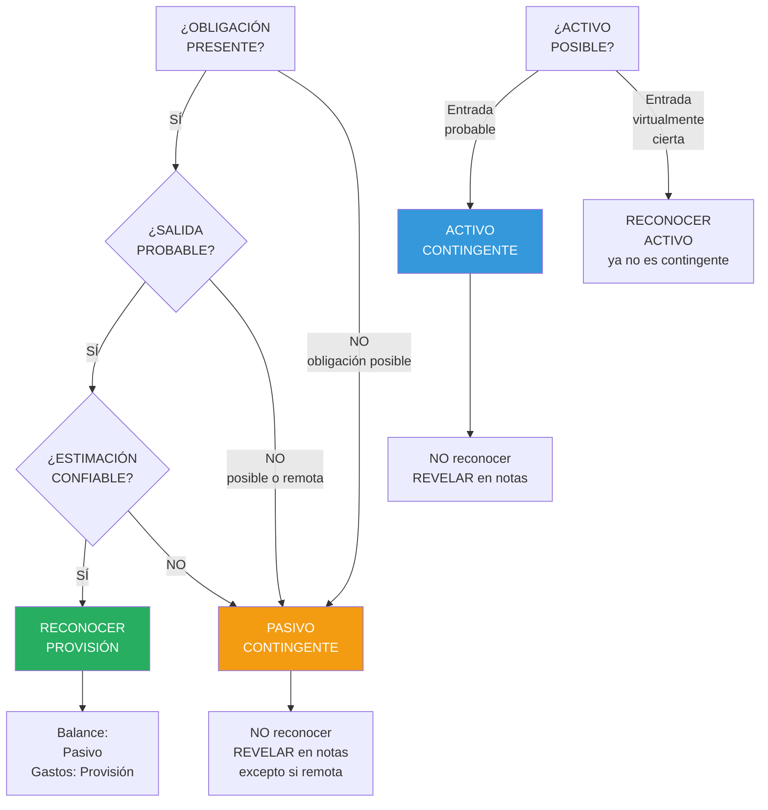

# IPSAS 19: Provisiones, Pasivos Contingentes y Activos Contingentes

## Resumen

La IPSAS 19 establece criterios de reconocimiento y medición para provisiones (pasivos de cuantía o vencimiento incierto), pasivos contingentes (obligaciones posibles o presentes no reconocidas), y activos contingentes (activos posibles), requiriendo reconocer provisión solo cuando existe obligación presente, salida probable de recursos y estimación confiable, prohibiendo reconocer pasivos y activos contingentes (solo revelar), aplicándose a situaciones comunes del sector público como litigios, garantías, reestructuraciones, remediación ambiental y contratos onerosos.

## Definición / Texto Normativo

**IPSAS 19 - Provisions, Contingent Liabilities and Contingent Assets, Párrafo 18:**

> "Las siguientes definiciones se usan en esta Norma:
>
> **Provisión** es un pasivo de cuantía o vencimiento incierto.
>
> **Pasivo contingente** es:
> (a) Una obligación posible, surgida a raíz de sucesos pasados, cuya existencia será confirmada solo por la ocurrencia, o no, de uno o más eventos inciertos en el futuro que no están enteramente bajo el control de la entidad; o
> (b) Una obligación presente, surgida a raíz de sucesos pasados, que no se reconoce porque:
> (i) No es probable que la entidad tenga que desprenderse de recursos que incorporen beneficios económicos o potencial de servicio, para cancelar la obligación; o
> (ii) El importe de la obligación no puede ser medido con la suficiente fiabilidad.
>
> **Activo contingente** es un activo posible, surgido a raíz de sucesos pasados, cuya existencia será confirmada solo por la ocurrencia, o no, de uno o más eventos inciertos en el futuro que no están enteramente bajo el control de la entidad."

**IPSAS 19, Párrafo 22 - Reconocimiento de provisión:**

> "Se debe reconocer una provisión cuando, y solo cuando:
>
> (a) Una entidad tiene una **obligación presente** (legal o implícita) como resultado de un evento pasado;
> (b) Es **probable** que sea necesaria una salida de recursos que incorporen beneficios económicos o potencial de servicio para liquidar la obligación; y
> (c) Puede hacerse una **estimación fiable** del importe de la obligación."

**IPSAS 19, Párrafo 35 - Pasivos contingentes NO se reconocen:**

> "Una entidad **no debe reconocer** un pasivo contingente. Se debe **revelar** un pasivo contingente, según lo establecido en el párrafo 100, a menos que la posibilidad de una salida de recursos que incorporen beneficios económicos o potencial de servicio sea remota."

**IPSAS 19, Párrafo 37 - Activos contingentes NO se reconocen:**

> "Una entidad **no debe reconocer** un activo contingente. Se debe **revelar** un activo contingente, según lo establecido en el párrafo 103, cuando sea **probable** una entrada de beneficios económicos o potencial de servicio."

**IPSAS 19, Párrafo 45 - Medición de provisión:**

> "El importe reconocido como provisión debe ser la **mejor estimación** del desembolso necesario para cancelar la obligación presente al final del periodo sobre el que se informa."

## Desarrollo / Interpretación

### Árbol de Decisión: Provisión vs Pasivo Contingente vs Activo Contingente



---

### Conceptos Clave

#### **1. Obligación Presente vs Obligación Posible**

**Obligación presente:**

- Ya existe al final del periodo
- Surge de evento pasado
- **Ejemplos:** Sentencia judicial desfavorable, contrato firmado, daño ambiental causado

**Obligación posible:**

- Puede o no existir
- Depende de eventos futuros inciertos
- **Ejemplos:** Demanda en proceso (sin sentencia), garantías bancarias no ejecutadas

---

#### **2. Probabilidad de Salida de Recursos**

**Términos clave:**

| Término      | Probabilidad | Tratamiento                        |
| ------------ | ------------ | ---------------------------------- |
| **Probable** | > 50%        | Reconocer provisión (si estimable) |
| **Posible**  | 5-50%        | Pasivo contingente (revelar)       |
| **Remota**   | < 5%         | No revelar                         |

---

#### **3. Estimación Confiable**

**Métodos de estimación:**

**a) Valor único (si rango estrecho):**

```
Provisión = Importe estimado más probable
```

**Ejemplo:** Demanda laboral, abogado estima 80% probabilidad de pagar S/. 150,000

```
Provisión = S/. 150,000
```

---

**b) Valor esperado (si rango amplio):**

```
Provisión = Σ (Importe × Probabilidad)
```

**Ejemplo:** Litigio con 3 escenarios:

```
Escenario A: Pagar S/. 500,000 (prob. 20%)
Escenario B: Pagar S/. 300,000 (prob. 50%)
Escenario C: Pagar S/. 100,000 (prob. 30%)

Provisión = (S/. 500K × 0.20) + (S/. 300K × 0.50) + (S/. 100K × 0.30)
         = S/. 100K + S/. 150K + S/. 30K
         = S/. 280,000
```

---

**c) Valor presente (si vencimiento > 12 meses):**

```
Provisión = VP de flujos de salida esperados
```

**Ejemplo:** Remediación ambiental en 5 años:

```
Costo estimado: S/. 2,000,000
Tasa descuento: 6%

VP = S/. 2,000,000 / (1.06)^5 = S/. 1,494,520

Provisión inicial: S/. 1,494,520
Cada año: Incremento por "desenrolado" (unwinding) = gasto financiero
```

---

### Tipos de Provisiones Comunes en Sector Público

#### **1. Provisiones por Litigios**

**Situación:** Entidad es demandada

**Reconocimiento:**

- ✅ Provisión: Si abogado estima probable perder y monto estimable
- ❌ Pasivo contingente: Si resultado incierto o monto no estimable

**Ejemplo:**

```
Hospital público demandado por mala praxis:
  - Demanda: S/. 800,000
  - Abogado estima: 70% probabilidad de perder, pago probable S/. 500,000

Asiento:
  Gasto - Provisión Litigios        500,000
      Provisión por Litigios                500,000
```

---

#### **2. Provisiones por Garantías**

**Situación:** Gobierno otorga garantía a entidad (ej. aval a empresa pública)

**Reconocimiento:**

- ✅ Provisión: Si probable que garantía sea ejecutada
- ❌ Pasivo contingente: Si ejecución posible (no probable)

**Ejemplo:**

```
Ministerio otorga garantía S/. 50,000,000 a préstamo de empresa pública:
  - Empresa tiene dificultades financieras
  - Probabilidad de default: 60%
  - Si defaultea, gobierno paga 100%

Provisión = S/. 50,000,000 × 60% = S/. 30,000,000

Asiento:
  Gasto - Provisión Garantías       30,000,000
      Provisión por Garantías Ejecutadas     30,000,000
```

---

#### **3. Provisiones por Reestructuración**

**Situación:** Entidad decide cerrar programa/dependencia

**Reconocimiento:**

- ✅ Provisión: Si existe plan formal detallado Y se ha comunicado a afectados

**IPSAS 19 párrafo 83:** Reestructuración incluye solo costos directamente relacionados:

- ✅ Indemnizaciones personal
- ✅ Costos de rescisión contratos
- ❌ NO costos de reentrenamiento o reubicación (son gastos futuros, no obligación presente)

**Ejemplo:**

```
Gobierno regional cierra programa social (decisión formal + comunicado):
  - Indemnizaciones 20 empleados: S/. 450,000
  - Rescisión contrato local: S/. 80,000
  - Reentrenamiento (futuro): S/. 120,000 → NO provisión

Provisión = S/. 450,000 + S/. 80,000 = S/. 530,000

Asiento:
  Gasto - Provisión Reestructuración  530,000
      Provisión por Reestructuración          530,000
```

---

#### **4. Provisiones por Remediación Ambiental**

**Situación:** Daño ambiental causado por entidad (ej. contaminación)

**Reconocimiento:**

- ✅ Provisión: Si existe obligación legal o implícita de remediar

**Ejemplo:**

```
Empresa pública minera causó contaminación río (2024):
  - Ley ambiental: Obligación de remediar
  - Costo estimado limpieza: S/. 8,000,000
  - Remediación en 3 años
  - Tasa descuento: 7%

VP = S/. 8,000,000 / (1.07)^3 = S/. 6,530,579

Asiento inicial (2024):
  Gasto - Provisión Ambiental       6,530,579
      Provisión Remediación Ambiental        6,530,579

Asiento anual (desenrolado):
  Gasto Financiero - Desenrolado     457,141
      Provisión Remediación Ambiental          457,141
  [S/. 6,530,579 × 7%]
```

---

#### **5. Contratos Onerosos**

**Definición (párrafo 18):** Contrato donde costos ineludibles de cumplir > beneficios esperados

**Reconocimiento:**

- ✅ Provisión: Por pérdida inevitable (costo salir del contrato vs costo cumplirlo, el menor)

**Ejemplo:**

```
Municipalidad firmó contrato servicio limpieza 5 años (falta 3):
  - Pago anual obligatorio: S/. 2,500,000
  - Valor presente pagos futuros: S/. 6,800,000
  - Valor presente beneficios esperados: S/. 4,200,000
  - Penalidad rescisión anticipada: S/. 3,500,000

Pérdida inevitable = menor de:
  - Cumplir: S/. 6,800,000 - S/. 4,200,000 = S/. 2,600,000
  - Rescindir: S/. 3,500,000

Provisión = S/. 2,600,000

Asiento:
  Gasto - Contrato Oneroso          2,600,000
      Provisión Contrato Oneroso            2,600,000
```

---

### Pasivos Contingentes - Revelación

**NO se reconocen, pero se revelan (párrafo 100) si probabilidad NO es remota:**

**Información a revelar:**

1. Descripción breve de la naturaleza
2. Estimación del efecto financiero (si posible)
3. Indicación de incertidumbres
4. Posibilidad de reembolso

**Ejemplo de revelación:**

**Nota 18 - Pasivos Contingentes:**

```
18.1 Litigios en proceso (al 31/12/2024):

La entidad enfrenta 15 demandas laborales por S/. 3,200,000. Los asesores legales
estiman que la probabilidad de sentencias desfavorables es POSIBLE (40%), con pagos
estimados entre S/. 800,000 y S/. 1,500,000. No se ha reconocido provisión porque
la probabilidad es < 50%. El resultado final dependerá de las sentencias judiciales
esperadas en 2025-2026.

18.2 Garantías otorgadas:

El Ministerio ha otorgado garantías soberanas a 3 empresas públicas por
S/. 120,000,000. La probabilidad de ejecución se considera REMOTA (< 5%) dado el
sólido desempeño financiero de las empresas garantizadas. No se revela detalle
adicional al ser probabilidad remota.
```

---

### Activos Contingentes - Revelación

**NO se reconocen, pero se revelan (párrafo 103) si entrada de beneficios es PROBABLE:**

**Ejemplo:**

**Nota 19 - Activos Contingentes:**

```
La entidad presentó demanda de reembolso a proveedor por S/. 2,500,000 (equipos
defectuosos). Los asesores legales estiman 65% de probabilidad de fallo favorable
(PROBABLE). Si la sentencia es favorable (esperada Q2-2025), se reconocerá el activo
en ese momento. Al 31/12/2024 no se ha reconocido activo por principio de prudencia
(IPSAS 19 párrafo 37).
```

**Cuando entrada es virtualmente cierta (>95%):** Ya NO es contingente, reconocer activo inmediatamente.

---

### Movimiento de Provisiones

**Cada periodo:**

```
Saldo inicial provisión                     XXX
  + Provisiones adicionales (nuevas)        XXX
  + Incremento por desenrolado (VP)         XXX
  - Utilización (pagos efectivos)          (XXX)
  - Reversiones (ya no probable)           (XXX)
  + Ajustes en estimación                   XXX
Saldo final provisión                       XXX
```

**Ejemplo de movimiento:**

```
Provisión por Litigios:

Saldo 01/01/2024                          S/.  850,000
  Provisiones nuevas (3 casos)            S/.  420,000
  Utilización (sentencia pagada)          S/. (350,000)
  Reversión (caso ganado)                 S/. (180,000)
  Ajuste estimación (caso existente)      S/.  110,000
Saldo 31/12/2024                          S/.  850,000

Revelación: Describir cada componente en notas.
```

## Conexiones

- [[unidad-I/marco-conceptual-nicsp|Marco Conceptual]] - Definición de pasivo (obligación presente)
- [[unidad-I/base-devengado|Base de Devengado]] - Reconocer obligaciones cuando surgen, no al pagar
- [[ipsas-17-propiedad-planta-equipo|IPSAS 17]] - Provisiones por desmantelamiento (costo de PPE)
- [[unidad-I/diferencias-nicsp-niif|Diferencias NICSP-NIIF]] - IPSAS 19 basada en IAS 37
- [[unidad-I/valor-presente-sector-publico|Valor Presente]] - Provisiones a largo plazo se descuentan
- [[unidad-I/contabilidad-gubernamental-peru|Contabilidad Perú]] - Provisiones en sector público peruano

## Ejemplos Resueltos

### Ejemplo 1: Litigio con Rango de Resultados (Intermedio)

**Situación:**
Municipalidad enfrenta demanda contractual al 31/12/2024:

**Datos:**

- Demanda: Incumplimiento contrato obras públicas
- Monto demandado: S/. 1,200,000
- Evaluación asesores legales:
  - 20% probabilidad: Ganar juicio (pagar S/. 0)
  - 50% probabilidad: Acuerdo parcial (pagar S/. 600,000)
  - 30% probabilidad: Perder totalmente (pagar S/. 1,200,000)
- Sentencia esperada: 2026 (2 años)
- Tasa de descuento: 6%

**Tarea:** Determinar si reconocer provisión y calcular monto. Registrar asiento y revelar.

---

**Solución:**

**Paso 1: Evaluar criterios IPSAS 19 párrafo 22**

(a) ¿Obligación presente? **SÍ** (demanda presentada, evento pasado)
(b) ¿Salida probable? Evaluar: 20% (S/. 0) + 50% (S/. 600K) + 30% (S/. 1,200K) → 80% probabilidad de pagar algo → **SÍ, PROBABLE**
(c) ¿Estimación confiable? **SÍ** (valor esperado)

**Conclusión: RECONOCER PROVISIÓN**

---

**Paso 2: Calcular monto (valor esperado)**

```
VE = (S/. 0 × 0.20) + (S/. 600,000 × 0.50) + (S/. 1,200,000 × 0.30)
   = S/. 0 + S/. 300,000 + S/. 360,000
   = S/. 660,000
```

---

**Paso 3: Descontar a valor presente (vencimiento > 12 meses)**

```
VP = S/. 660,000 / (1.06)^2
   = S/. 660,000 / 1.1236
   = S/. 587,387
```

---

**Paso 4: Reconocer provisión (31/12/2024)**

```
Gasto - Provisión Litigio Contractual     587,387
    Provisión por Litigios                        587,387
```

---

**Paso 5: Desenrolado año 2025**

```
Incremento financiero = S/. 587,387 × 6% = S/. 35,243

Gasto Financiero - Desenrolado Provisión   35,243
    Provisión por Litigios                        35,243

[Provisión al 31/12/2025: S/. 622,630]
```

---

**Revelación (Nota 18 - 31/12/2024):**

```
Nota 18 - Provisiones:

Provisión por Litigios Contractuales:

La municipalidad enfrenta demanda por presunto incumplimiento de contrato de obras
públicas (monto demandado S/. 1,200,000). Según evaluación de asesores legales,
existe 80% de probabilidad de desembolso. La provisión se calculó por valor esperado
(S/. 660,000) descontado a valor presente (tasa 6%, vencimiento 2026), resultando
en S/. 587,387 al 31/12/2024.

Movimiento provisión 2024:
  Saldo inicial                           S/.       0
  Provisión constituida                   S/. 587,387
  Saldo final                             S/. 587,387

Incertidumbres: El resultado final depende de la sentencia judicial esperada en 2026.
El rango de desembolso posible es S/. 0 - S/. 1,200,000.
```

---

### Ejemplo 2: Provisión por Remediación Ambiental - Ciclo Completo (Avanzado)

**Situación:**
Empresa pública de electricidad opera central térmica desde 2020. Al cierre de operaciones (futuro), debe desmantelar planta y remediar suelo:

**Datos iniciales (01/01/2020):**

- Costo estimado desmantelamiento (al cierre): S/. 15,000,000
- Vida útil central: 25 años (cierre en 2044)
- Tasa de descuento: 7%

**01/01/2020:**

- VP del desmantelamiento = S/. 15,000,000 / (1.07)^25 = S/. 2,761,386

**Durante 2024:**

- Nueva estimación de costos (inflación, mayor complejidad): S/. 18,000,000
- Años restantes: 20 (2044 - 2024)

**31/12/2024:**

- Provisión acumulada antes de ajuste: ?
- Nuevo VP: S/. 18,000,000 / (1.07)^20 = S/. 4,652,362

**Tarea:**

1. Registrar reconocimiento inicial (2020)
2. Calcular provisión al 31/12/2023 (antes de ajuste)
3. Registrar ajuste por cambio en estimación (2024)
4. Registrar desenrolado 2024
5. Presentar movimiento y revelación

---

**Solución:**

**Paso 1: Reconocimiento inicial (01/01/2020)**

```
PPE - Central Térmica                   2,761,386
    Provisión Desmantelamiento                    2,761,386

[Incrementa costo del activo, se depreciará en 25 años]
[Provisión se incrementa anualmente por desenrolado]
```

---

**Paso 2: Provisión al 31/12/2023 (antes de ajuste)**

**Desenrolado acumulado 2020-2023 (4 años):**

```
Año 2020: S/. 2,761,386 × 7% = S/. 193,297
Año 2021: S/. 2,954,683 × 7% = S/. 206,828
Año 2022: S/. 3,161,511 × 7% = S/. 221,306
Año 2023: S/. 3,382,817 × 7% = S/. 236,797

Provisión al 31/12/2023: S/. 3,619,614
```

**Alternativa (fórmula):**

```
VP al 31/12/2023 = S/. 15,000,000 / (1.07)^21 = S/. 3,619,614 ✓
```

---

**Paso 3: Ajuste por cambio en estimación (31/12/2024)**

**Nuevo VP requerido:** S/. 4,652,362
**Provisión antes de ajuste:** S/. 3,619,614
**Incremento:** S/. 1,032,748

```
PPE - Central Térmica                   1,032,748
    Provisión Desmantelamiento                    1,032,748

[IPSAS 19 párrafo 59: Cambio en estimación ajusta valor del activo]
[Se depreciará en vida útil restante: 20 años]
```

---

**Paso 4: Desenrolado 2024**

```
Base para desenrolado: S/. 4,652,362 (ya incluye ajuste)
Desenrolado 2024 = S/. 4,652,362 × 7% = S/. 325,665

Gasto Financiero - Desenrolado           325,665
    Provisión Desmantelamiento                    325,665
```

---

**Paso 5: Provisión al 31/12/2024**

```
S/. 4,652,362 + S/. 325,665 = S/. 4,978,027
```

---

**Movimiento 2024:**

```
Provisión por Desmantelamiento:

Saldo 01/01/2024                        S/. 3,619,614
  Ajuste por cambio estimación          S/. 1,032,748
  Desenrolado (gasto financiero)        S/.   325,665
Saldo 31/12/2024                        S/. 4,978,027

Años restantes: 20
VP de S/. 18,000,000 al 7%: S/. 4,652,362 (base para futuro desenrolado)
```

---

**Revelación (Nota 18):**

```
Nota 18 - Provisión por Desmantelamiento:

La empresa tiene obligación legal de desmantelar la central térmica al final de su vida
útil (2044) y remediar el sitio. La provisión representa el valor presente de los costos
estimados de desmantelamiento.

Supuestos clave:
  - Costo estimado (2044): S/. 18,000,000
  - Tasa de descuento: 7%
  - Años hasta desmantelamiento: 20

Movimiento 2024:
  Saldo inicial                         S/. 3,619,614
  Cambio en estimación de costos        S/. 1,032,748
  Incremento financiero (desenrolado)   S/.   325,665
  Saldo final                           S/. 4,978,027

Cambio en estimación: Durante 2024, se actualizó el costo estimado de desmantelamiento
de S/. 15,000,000 a S/. 18,000,000 debido a inflación en costos de remediación ambiental
y mayor complejidad técnica identificada en estudios recientes. El ajuste se reconoció
como incremento del valor del activo (conforme IPSAS 19 párrafo 59) y se depreciará
en los 20 años restantes de vida útil.

Sensibilidad: Si la tasa de descuento fuera 8% (no 7%), la provisión sería
S/. 3,863,591 (-22.4%).
```

## Ejercicios Propuestos

### Ejercicio 1: Clasificación Básica (Básico)

Ministerio de Salud tiene las siguientes situaciones al 31/12/2024:

1. **Demanda laboral:** Empleado despedido demanda S/. 80,000. Abogado estima 30% probabilidad de perder.
2. **Garantía otorgada:** Aval a préstamo de hospital público S/. 5,000,000. Hospital solvente, probabilidad de ejecución 2%.
3. **Litigio por daños:** Hospital demandado por negligencia médica S/. 300,000. Abogado estima 75% probabilidad de perder, pago probable S/. 200,000.
4. **Demanda presentada:** Ministerio demanda a proveedor por S/. 150,000 (equipos defectuosos). Abogado estima 80% ganar.
5. **Contrato firmado:** Compromiso de comprar 50 ambulancias en 2025 por S/. 12,000,000 (contrato irrevocable).

**Tarea:** Para cada situación, determina:

- ¿Provisión, pasivo contingente, activo contingente, o ninguno?
- ¿Se reconoce en balance? ¿Se revela en notas?
- Si es provisión: Calcula monto

---

### Ejercicio 2: Reestructuración - Aplicación de Criterios (Intermedio)

Gobierno Regional decide cerrar programa de alfabetización (31/12/2024):

**Decisión formal:** Consejo Regional aprobó cierre (Acuerdo 245-2024, del 15/12/2024)
**Comunicación:** Notificación a empleados y beneficiarios el 20/12/2024
**Costos identificados:**

1. Indemnizaciones 30 empleados: S/. 850,000
2. Rescisión contrato alquiler local (3 años restantes, penalidad): S/. 120,000
3. Traslado equipos a otros programas: S/. 45,000
4. Reentrenamiento empleados para nuevos cargos: S/. 180,000
5. Campaña comunicacional cierre: S/. 35,000

**Tarea:**

1. Determina si existe obligación presente de reestructuración (párrafo 72-83)
2. Identifica qué costos califican para provisión (solo directamente relacionados)
3. Calcula monto de provisión
4. Registra asiento (31/12/2024)
5. Explica por qué ciertos costos NO se provisionan

---

### Ejercicio 3: Caso Integral - Provisiones Múltiples con VP (Avanzado)

**Situación:**
Ministerio de Energía y Minas al 31/12/2024 tiene las siguientes obligaciones:

**A. Provisión por remediación minera:**

- Mina estatal operó 2015-2024 (cerrada)
- Obligación legal: Remediar en 3 años (2027)
- Costo estimado: S/. 25,000,000
- Tasa descuento: 6%

**B. Provisión por litigio ambiental:**

- Demanda por contaminación río
- Evaluación legal:
  - 40% probabilidad: Pagar S/. 8,000,000
  - 40% probabilidad: Pagar S/. 4,000,000
  - 20% probabilidad: Ganar (pagar S/. 0)
- Sentencia esperada: 2026 (2 años)
- Tasa descuento: 6%

**C. Contrato oneroso - Servicio transporte:**

- Contrato 5 años (firmado 2022), faltan 3 años
- Pago anual obligatorio: S/. 3,500,000
- VP beneficios futuros: S/. 5,200,000
- VP pagos futuros: S/. 9,100,000
- Penalidad rescisión: S/. 5,000,000

**D. Pasivo contingente - Garantía:**

- Garantía soberana a proyecto eléctrico: S/. 80,000,000
- Probabilidad ejecución: 15% (posible)

**E. Activo contingente - Reembolso:**

- Demanda a contratista S/. 12,000,000
- Probabilidad ganar: 70% (probable)

**Tarea (2,500 palabras):**

1. **Por cada situación:**
   - Evalúa criterios IPSAS 19 (obligación presente, probabilidad, estimación)
   - Calcula provisión (si aplica) usando valor esperado y valor presente
   - Clasifica: Provisión, pasivo contingente, activo contingente

2. **Registra asientos (31/12/2024):**
   - Provisiones reconocidas

3. **Estado de Situación Financiera (extracto):**
   - Pasivos corrientes/no corrientes (provisiones)

4. **Revelación (Nota 18 - Provisiones y Contingencias):**
   - Movimiento de cada provisión
   - Descripción pasivos contingentes
   - Descripción activos contingentes
   - Supuestos y sensibilidades

5. **Análisis crítico:**
   - ¿Cuál es el riesgo total (provisiones + contingencias)? S/. ?
   - Si todas las contingencias se materializaran en el escenario más adverso, ¿cuánto pagaría el Ministerio?
   - ¿Es prudente la política de provisiones? Justifica

## Preguntas Bloom

**Nivel 1 - Recordar:** Define "provisión", "pasivo contingente" y "activo contingente" según IPSAS 19. Enumera los 3 criterios para reconocer provisión.

**Nivel 2 - Comprender:** Explica la diferencia entre "probable", "posible" y "remota". ¿Cómo afecta cada término al tratamiento contable (reconocer vs revelar)?

**Nivel 3 - Aplicar:** Hospital público enfrenta demanda por S/. 500,000 (mala praxis). Abogado estima: 60% perder y pagar S/. 300,000, 40% ganar. Sentencia en 2 años, tasa 6%. Aplica IPSAS 19: (a) ¿Reconocer provisión? (b) Calcula monto, (c) Registra asiento.

**Nivel 4 - Analizar:** Compara el tratamiento de: (a) Provisión por litigio (pérdida probable), (b) Pasivo contingente (pérdida posible), (c) Activo contingente (ganancia probable). Analiza: Reconocimiento en balance, revelación en notas, momento de reconocimiento, impacto en resultados.

**Nivel 5 - Evaluar:** Una municipalidad tiene 50 demandas laborales (S/. 8,000,000 total). El gerente financiero argumenta: "No debemos reconocer provisión porque es imposible estimar confiablemente cuántas perderemos." El contador responde: "Podemos usar valor esperado basado en histórico de fallos (40% perdidos históricamente)." Evalúa ambos argumentos. ¿Qué requiere IPSAS 19? ¿Qué información necesitas?

**Nivel 6 - Crear:** Diseña un "Sistema de Gestión de Provisiones y Contingencias" para entidades del sector público peruano que incluya: (1) Proceso de identificación (fuentes: legal, operaciones, contratos), (2) Evaluación (probabilidad, montos, criterios IPSAS 19), (3) Cálculo (valor esperado, VP, tasas), (4) Aprobación (comité, niveles de autorización), (5) Registro contable (integración SIAF), (6) Revelaciones automáticas (Nota 18), (7) Monitoreo y actualización (trimestral), (8) Roles (áreas legal, contable, operativa). Extensión: 2,000 palabras.

## Base Normativa

**Norma IPSASB:**

1. **IPSAS 19 - Provisions, Contingent Liabilities and Contingent Assets (emitida 2002, revisada 2010).** Define provisiones, criterios reconocimiento, medición, revelaciones.
   - Párrafos clave: 18 (definiciones), 22 (criterios reconocimiento), 35-37 (contingencias), 45-52 (medición), 72-83 (reestructuración), 84-92 (revelaciones)
   - Disponible: www.ipsasb.org/publications/ipsas-19-provisions-contingent-liabilities-and-contingent-assets

**Normas relacionadas:** 2. **IAS 37 - Provisions, Contingent Liabilities and Contingent Assets (IFRS).** Base de IPSAS 19. 3. **IPSAS 17 - Property, Plant and Equipment.** Provisiones por desmantelamiento como costo del activo. 4. **IPSAS 1 - Presentation of Financial Statements.** Clasificación corriente/no corriente de provisiones.

**Normativa Peruana:** 5. **Plan Contable Gubernamental 2019:**

- 48 - Provisiones
- 481 - Provisión para litigios
- 482 - Provisión para desmantelamiento
- 489 - Otras provisiones

6. **Directiva N° 005-2016-EF/51.01:** Tratamiento de provisiones en entidades gubernamentales.

**Literatura:** 7. Biondi, Y., & Suzuki, T. (2007). "Socio-Economic Impacts of IAS/IFRS in Europe". _Accounting in Europe_, 4(2), 93-99. (Crítica a IAS 37/IPSAS 19)

## Referencias Bibliográficas y Recursos en Línea

**Textos oficiales:**

- **IPSASB:** www.ipsasb.org/publications/ipsas-19-provisions-contingent-liabilities-and-contingent-assets

**Recursos español:**

- **IFAC:** Traducción IPSAS 19

**Herramientas:**

- **Calculadora VP:** Excel para provisiones largo plazo
- **Matriz probabilidades:** Plantilla valor esperado

**Casos:**

- **Reino Unido:** HM Treasury - Provisions in public sector (guidance)

## Notas y Alertas

> **⚠️ Error Común:** Reconocer provisión cuando probabilidad es "posible" (30%). **Regla:** Solo si es "probable" (>50%). Si es posible → Pasivo contingente (revelar, no reconocer).

> **💡 Valor Esperado vs Importe Más Probable:** Si rango amplio de resultados → Usar valor esperado (Σ importe × probabilidad). Si resultado único dominante → Importe más probable. IPSAS 19 párrafo 45.

> **📊 Desenrolado (Unwinding):** Provisiones a VP se incrementan cada año por paso del tiempo → Gasto financiero (NO gasto operativo). Ejemplo: Provisión S/. 1M al 6%, año siguiente +S/. 60K.

> **🔍 Reestructuración - Plan Detallado:** NO basta decisión interna. Se requiere plan formal detallado Y comunicación a afectados ANTES del cierre (IPSAS 19 párrafo 72). Sino → NO provisión.

> **⚙️ Integración SIAF (Perú):** Módulo "Provisiones" permite: (1) Registrar tipos (litigios, garantías, ambientales), (2) Calcular VP (tasas MEF), (3) Desenrolado automático, (4) Revelaciones. Pendiente: Integración con módulo legal (demandas).

> **📖 Para Profundizar:** Debate sobre activos contingentes (crítica: ¿por qué no reconocer si probabilidad >50%?): Biondi & Suzuki (2007). "Socio-Economic Impacts of IAS/IFRS". _Accounting in Europe_, 4(2).

---

<div style="text-align: center;">
<a href="https://notbyai.fyi">

</a>
</div>
