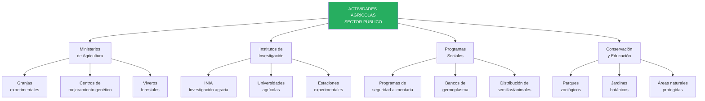
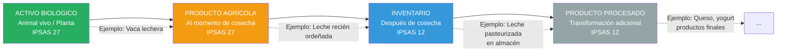
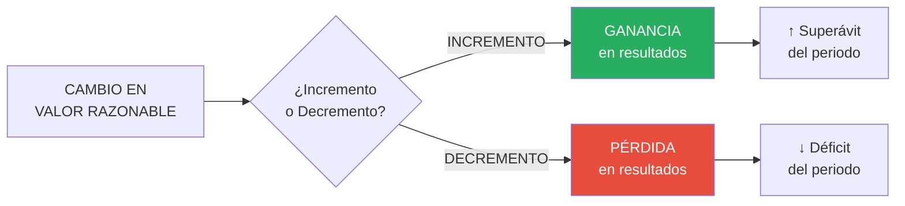

# IPSAS 27: Agricultura

## Resumen

La IPSAS 27 establece el tratamiento contable de la actividad agrícola, definiendo activos biológicos (animales vivos y plantas) y productos agrícolas en el momento de la cosecha, requiriendo medición al valor razonable menos costos de venta en el reconocimiento inicial y en cada fecha de presentación (excepto cuando el valor razonable no puede medirse confiablemente), reconociendo ganancias o pérdidas por cambios en el valor razonable en resultados del periodo, y aplicándose a entidades del sector público con actividades agrícolas significativas (ministerios de agricultura, programas de desarrollo rural, estaciones experimentales, parques zoológicos, jardines botánicos).

## Definición / Texto Normativo

**IPSAS 27 - Agriculture, Párrafo 9:**

> "Las siguientes definiciones se usan en esta Norma:
>
> **Actividad agrícola** es la gestión por parte de una entidad de la **transformación biológica** y cosecha de activos biológicos, para su venta, para convertirlos en productos agrícolas, o para convertirlos en activos biológicos adicionales.
>
> **Producto agrícola** es el producto ya cosechado, procedente de los activos biológicos de la entidad.
>
> **Activo biológico** es un animal vivo o una planta.
>
> **Transformación biológica** comprende los procesos de crecimiento, degradación, producción y procreación que son la causa de los cambios cualitativos o cuantitativos en los activos biológicos."

**IPSAS 27, Párrafo 12 - Medición:**

> "Un activo biológico se medirá, tanto en el momento de su reconocimiento inicial como al final del periodo sobre el que se informa, a su **valor razonable menos los costos de venta**, salvo cuando el valor razonable no pueda medirse con fiabilidad."

**IPSAS 27, Párrafo 13 - Producto agrícola:**

> "El producto agrícola cosechado de los activos biológicos de una entidad se medirá a su **valor razonable menos los costos de venta** en el momento de la cosecha. Tal medición es el **costo** a esa fecha, cuando se aplique IPSAS 12 Inventarios u otra Norma que sea de aplicación."

**IPSAS 27, Párrafo 26 - Ganancia o pérdida:**

> "La ganancia o pérdida surgida en el reconocimiento inicial de un activo biológico a su valor razonable menos los costos de venta y por un cambio en el valor razonable menos los costos de venta de un activo biológico se incluirá en el **superávit o déficit del periodo** en el que surja."

**Definiciones clave (Párrafo 9):**

- **Costos de venta:** Costos incrementales directamente atribuibles a la disposición de un activo (transporte, comisiones, impuestos de transferencia).
- **Valor razonable:** Precio que se recibiría por vender un activo en una transacción ordenada entre participantes del mercado en la fecha de medición (IPSAS 41).
- **Transformación biológica:** Proceso natural (crecimiento, envejecimiento, reproducción, producción) que causa cambios en el activo biológico.
- **Cosecha:** Separación del producto del activo biológico o cesación de los procesos vitales (ej. talar árbol, recolectar fruta, ordeñar vaca).

## Desarrollo / Interpretación

### Alcance de IPSAS 27 en el Sector Público



**Ejemplos de activos biológicos en sector público peruano:**

| Entidad                                         | Activo biológico        | Producto agrícola          | Propósito                      |
| ----------------------------------------------- | ----------------------- | -------------------------- | ------------------------------ |
| INIA (Instituto Nacional de Innovación Agraria) | Ganado vacuno mejorado  | Terneros para distribución | Mejoramiento genético          |
| SERFOR (Servicio Forestal)                      | Plantaciones forestales | Madera rolliza             | Reforestación/comercialización |
| Ministerio de Agricultura                       | Alpacas y llamas        | Fibra, carne               | Programas de desarrollo rural  |
| Parque de las Leyendas (Lima)                   | Animales del zoológico  | N/A (no hay cosecha)       | Educación/conservación         |
| Universidad Agraria La Molina                   | Cultivos experimentales | Semillas mejoradas         | Investigación                  |

---

### Diferencia: Activo Biológico vs Producto Agrícola vs Producto Procesado



**Punto crítico:** La norma se aplica hasta el **momento de la cosecha**. Después, se aplica IPSAS 12 (Inventarios).

**Ejemplo:**

**Plantación de eucalipto (programa de reforestación):**

- **Año 1-10:** Árboles creciendo → **Activo biológico** (IPSAS 27) - Medir al valor razonable menos costos de venta
- **Año 10 - Tala:** Madera rolliza → **Producto agrícola** (IPSAS 27) - Medir al VR menos costos en momento de tala
- **Después de tala:** Madera en almacén → **Inventario** (IPSAS 12) - Medir al menor de costo y VRN
- **Si se transforma:** Madera aserrada, muebles → **Inventario procesado** (IPSAS 12)

---

### Medición al Valor Razonable menos Costos de Venta

**Jerarquía de valor razonable (Párrafo 15-18):**

#### **Nivel 1: Mercado activo (preferible)**

Si existe **mercado activo** para el activo biológico o producto agrícola:

```
Valor razonable = Precio cotizado en ese mercado - Costos de venta
```

**Mercado activo (características):**

- ✅ Los bienes negociados son **homogéneos**
- ✅ Se pueden encontrar compradores y vendedores en **cualquier momento**
- ✅ Los **precios están disponibles públicamente**

**Ejemplo:**

**Ganado vacuno (terneros de 6 meses):**

- Precio promedio en feria ganadera (Huancayo): S/. 2,800 por cabeza
- Costos estimados de transporte y venta: S/. 120
- **Valor razonable menos costos de venta:** S/. 2,680

---

#### **Nivel 2: Precio de mercado de transacción más reciente**

Si NO hay mercado activo pero hubo transacciones recientes:

```
Valor razonable ≈ Precio de transacción reciente (ajustado si es necesario)
```

**Ejemplo:**

**Alpacas reproductoras:**

- No hay mercado activo regular
- Hace 3 meses, el Ministerio vendió 50 alpacas similares a S/. 1,200 c/u
- No han ocurrido cambios significativos desde entonces
- **Valor razonable:** S/. 1,200 (menos costos de venta estimados S/. 80) = S/. 1,120

---

#### **Nivel 3: Precios de mercado de activos similares**

Si NO hay mercado del activo específico, usar precios de activos **similares** (ajustados):

```
Valor razonable = Precio de activo similar × Factores de ajuste
```

**Ejemplo:**

**Trucha arco iris (programa de acuicultura):**

- No hay precio para truchas de 200g (tamaño actual)
- Precio de mercado para truchas de 250g (tamaño comercial): S/. 12/kg
- Ajuste por tamaño: 0.85 (truchas más pequeñas valen menos)
- Peso actual: 0.2 kg
- **Valor razonable:** S/. 12 × 0.85 × 0.2 = S/. 2.04 por trucha

---

#### **Nivel 4: Valor presente de flujos netos esperados**

Si NO existen precios de mercado determinables:

```
Valor razonable = Valor presente de flujos netos de efectivo esperados del activo

Descontados a tasa de mercado apropiada
```

**Ejemplo:**

**Plantación forestal (pinos de 5 años, faltan 10 años para tala):**

- Volumen estimado al año 15: 250 m³/ha
- Precio proyectado madera: S/. 180/m³
- Ingreso bruto esperado: S/. 45,000/ha
- Costos futuros (mantenimiento, tala): S/. 12,000/ha
- Flujo neto esperado: S/. 33,000/ha
- Tasa de descuento: 8%
- Años hasta cosecha: 10

```
VP = S/. 33,000 / (1.08)^10 = S/. 15,283 por hectárea
Menos costos de venta (3%): S/. 458
Valor razonable: S/. 14,825 por hectárea
```

---

### Excepción: Cuando el Valor Razonable NO puede medirse confiablemente

**IPSAS 27, Párrafo 30:**

> "Se presume que el valor razonable de un activo biológico puede determinarse de forma fiable. Sin embargo, esa presunción puede ser refutada solo en el momento del reconocimiento inicial cuando **no estén disponibles precios cotizados de mercado** y las **alternativas de medición del valor razonable sean claramente poco fiables**."

**En este caso (raro):**

```
Medir al COSTO menos depreciación acumulada y pérdidas por deterioro
(similar a PPE bajo IPSAS 17)
```

**Ejemplo excepcional:**

**Especie endémica en peligro de extinción (programa de conservación):**

- Cóndor andino criado en cautiverio
- NO hay mercado (venta ilegal)
- NO hay transacciones comparables (única en su especie)
- Flujos futuros NO determinables (objetivo: liberación, no venta)
- **Conclusión:** Valor razonable NO medible confiablemente

**Tratamiento:**

```
Costo de cría: S/. 35,000 (alimentación, veterinaria, instalaciones)
Depreciación: NO aplica (ser vivo, no se deprecia como PPE)
Deterioro: Evaluar si hay daño/enfermedad que reduzca valor

Valor en libros: S/. 35,000 (al costo)
```

**Revelación obligatoria:** Describir activos biológicos, explicar por qué valor razonable no puede medirse, método usado, vida útil estimada.

---

### Reconocimiento de Ganancias y Pérdidas

**Cambios en el valor razonable se reconocen en RESULTADOS del periodo (no en patrimonio):**



**Fuentes de cambio en valor razonable:**

1. **Cambio físico:** Crecimiento, envejecimiento, procreación, producción, degradación
2. **Cambio de precios:** Variación de precios de mercado

**IPSAS 27 NO requiere separar estos componentes (aunque puede ser útil para gestión).**

**Ejemplo de reconocimiento:**

**Ganado vacuno - programa de mejoramiento genético:**

**01/01/2024:**

- Compra de 100 terneros de 6 meses
- Costo: S/. 250,000
- Valor razonable menos costos de venta: S/. 248,000

**Asiento de reconocimiento inicial:**

```
Activos Biológicos - Ganado Vacuno        248,000
Pérdida por Medición Inicial                2,000
    Banco                                         250,000

[Medir al VR menos costos de venta, reconocer pérdida inicial]
```

**31/12/2024 (fin de año):**

- Terneros ahora tienen 18 meses
- Valor razonable menos costos de venta: S/. 320,000
- Cambio: +S/. 72,000

**Asiento de revalorización:**

```
Activos Biológicos - Ganado Vacuno         72,000
    Ganancia por Cambio en VR - Activos Biológicos  72,000

[Reconocer incremento en valor razonable]
```

**Estado de Gestión (2024):**

```
GASTOS:
  Pérdida por Medición Inicial              S/.  2,000

INGRESOS:
  Ganancia por Cambio en VR                 S/. 72,000

RESULTADO NETO (ganado):                    S/. 70,000
```

---

### Subvenciones del Gobierno (Párrafo 34-37)

**Tratamiento especial para subvenciones relacionadas con activos biológicos:**

#### **Subvención incondicional:**

Si el activo biológico se mide al **valor razonable menos costos de venta** y la subvención es **incondicional**:

```
Reconocer la subvención como INGRESO cuando la subvención sea exigible
```

**Ejemplo:**

**Programa "Alpaca Hembra Productiva":**

- Gobierno transfiere 500 alpacas reproductoras a comunidades campesinas (sin costo)
- Valor razonable: S/. 800 c/u = S/. 400,000
- Subvención incondicional (no requieren devolución)

**Asiento (en libros del gobierno):**

```
Gasto - Transferencia Programa Social      400,000
    Activos Biológicos - Alpacas                  400,000

[Dar de baja activo, reconocer gasto]
```

**Asiento (en libros de la comunidad beneficiaria):**

```
Activos Biológicos - Alpacas               400,000
    Ingreso - Subvención Gubernamental            400,000

[Reconocer activo e ingreso por transferencia]
```

---

#### **Subvención condicional:**

Si la subvención requiere cumplir condiciones (ej. no vender por 3 años):

```
Reconocer la subvención como INGRESO solo cuando se cumplan las condiciones
```

**Ejemplo:**

**Programa de Reforestación:**

- Gobierno entrega plantones (valor S/. 50,000) a municipalidad
- Condición: Plantar en áreas degradadas y mantener 5 años
- Si no cumple: Devolver equivalente en efectivo

**Asiento inicial (municipalidad):**

```
Activos Biológicos - Plantones             50,000
    Pasivo - Subvención Condicional               50,000

[Reconocer activo y obligación condicionada]
```

**Año 5 (cumplimiento completo):**

```
Pasivo - Subvención Condicional            50,000
    Ingreso - Subvención Gubernamental            50,000

[Reconocer ingreso al cumplir condición]
```

---

### Revelaciones Requeridas

**Información obligatoria (Párrafos 40-56):**

1. **Ganancia/pérdida neta por cambios en valor razonable**
2. **Descripción de cada grupo de activos biológicos:**
   - Consumibles vs Portadores
   - Maduros vs Inmaduros
3. **Métodos y supuestos aplicados:**
   - Jerarquía de valor razonable (mercado, VP flujos)
   - Tasas de descuento usadas
   - Precios de mercado usados
4. **Cantidad o valor en libros por grupo**
5. **Existencia de restricciones:**
   - Activos pignorados como garantía
   - Compromisos de desarrollo/adquisición
6. **Si hay activos al costo (no VR):**
   - Descripción
   - Explicación por qué VR no es confiable
   - Rango de estimaciones de VR (si posible)
   - Método de depreciación (si aplica)
   - Vidas útiles

**Ejemplo de revelación:**

**Nota 14 - Activos Biológicos**

```
14.1 Composición (al 31/12/2024):

                           Cantidad  VR-CV unitario  Total S/.
Ganado vacuno (terneros)   100       3,200          320,000
Alpacas reproductoras      250       1,120          280,000
Truchas (programa acuic.)  50,000    2.50           125,000
Plantaciones forestales    150 ha    14,825/ha      2,223,750
                                                     -----------
TOTAL                                               2,948,750

14.2 Movimientos del año 2024:

Saldo inicial (01/01/2024)                          2,650,000
Compras/Adquisiciones                                 350,000
Nacimientos/Crecimiento natural                       180,000
Ganancias por cambio en VR                            245,000
Pérdidas por mortalidad                               (85,000)
Ventas/Transferencias                                (125,000)
Cosechas (madera, truchas)                           (266,250)
Saldo final (31/12/2024)                            2,948,750

14.3 Métodos de medición:

Ganado vacuno: Precio promedio ferias ganaderas región (nivel 1 - mercado activo).

Alpacas: Precio de transacción más reciente (nivel 2), ajustado por edad/calidad.

Truchas: Precio mercado activo trucha comercial (250g), ajustado por peso actual (nivel 3).

Plantaciones forestales: Valor presente flujos netos esperados (nivel 4).
  - Precio madera proyectado: S/. 180/m³ (promedio 5 años)
  - Tasa de descuento: 8% (tasa de endeudamiento del gobierno)
  - Costos futuros: Mantenimiento S/. 800/ha/año, tala S/. 5,000/ha

14.4 Riesgos:

Riesgo climático: Sequía prolongada podría reducir crecimiento de plantaciones en 20-30%.
Riesgo sanitario: Brote de fiebre aftosa (ganado) o enfermedad viral (truchas).
Riesgo de mercado: Volatilidad de precios de madera (-15% a +25% últimos 3 años).

14.5 Restricciones:

No existen activos biológicos pignorados como garantía. Las plantaciones forestales
están en áreas naturales protegidas con restricciones de tala (requieren plan de manejo
aprobado por SERFOR).

14.6 Política de subvenciones:

Durante 2024, la entidad recibió S/. 120,000 en subvenciones incondicionales del
Ministerio de Agricultura para adquisición de ganado mejorado (reconocido como ingreso).
```

## Conexiones

- [[marco-conceptual-nicsp]] - Definición de activo, medición al valor razonable
- [[diferencias-nicsp-niif]] - IPSAS 27 basada en IAS 41, con énfasis en sector público sin fines de lucro
- [[ipsas-12-inventarios|IPSAS 12]] - Producto agrícola después de cosecha se trata como inventario
- [[ipsas-17-propiedad-planta-equipo|IPSAS 17]] - Terrenos agrícolas son PPE, no activos biológicos
- [[unidad-II/ipsas-23-ingresos-sin-contraprestacion|IPSAS 23]] - Subvenciones de activos biológicos
- [[unidad-I/valor-razonable-sector-publico|Valor Razonable]] - Técnica de medición clave en IPSAS 27
- [[unidad-I/potencial-servicio-vs-beneficios-economicos|Potencial de Servicio]] - Activos biológicos sin valor comercial (conservación) generan potencial de servicio

## Ejemplos Resueltos

### Ejemplo 1: Ganado Vacuno - Ciclo Completo (Intermedio)

**Situación:**
Instituto Nacional de Innovación Agraria (INIA) tiene programa de mejoramiento genético bovino:

**01/01/2024:**

- Compra 60 terneras mestizas de 8 meses por S/. 180,000
- Costo transporte: S/. 6,000
- **Total desembolso:** S/. 186,000
- Valor razonable terneras al llegar: S/. 3,100 c/u = S/. 186,000
- Costos estimados de venta: S/. 80 c/u = S/. 4,800
- **VR - CV:** S/. 181,200

**Durante 2024:**

- Costos de alimentación, veterinaria, personal: S/. 45,000 (gasto operativo)
- Nacen 8 terneros (valor razonable al nacer: S/. 1,800 c/u)
- 2 terneras mueren por enfermedad (valor en libros al momento: S/. 3,500 c/u)

**31/12/2024:**

- Las 58 terneras sobrevivientes ahora tienen 20 meses
- Valor razonable: S/. 4,200 c/u
- Costos estimados de venta: S/. 100 c/u
- **VR - CV:** S/. 4,100 c/u
- Los 8 terneros tienen 4 meses
- Valor razonable: S/. 2,400 c/u, costos venta S/. 80 c/u
- **VR - CV:** S/. 2,320 c/u

**Tarea:** Registrar todas las transacciones de 2024 y presentar revelación básica.

---

**Solución:**

**Asiento 1: Compra inicial (01/01/2024)**

```
Activos Biológicos - Ganado Vacuno        181,200
Gasto - Transporte Ganado                   4,800
    Banco                                         186,000

[Reconocer al VR - CV, transporte es gasto]
```

**Asiento 2: Costos operativos (durante 2024)**

```
Gasto - Mantenimiento Ganado               45,000
    Banco                                         45,000

[Alimentación, veterinaria = gasto del periodo]
```

**Asiento 3: Nacimientos (fecha de nacimiento)**

```
Activos Biológicos - Ganado Vacuno         14,400
    Ganancia por Incremento Biológico             14,400

[8 terneros × S/. 1,800 = S/. 14,400]
[Reconocer al VR - CV al nacer, ingreso en resultados]
```

**Asiento 4: Muertes (fecha de muerte)**

```
Pérdida por Mortalidad Ganado               7,000
    Activos Biológicos - Ganado Vacuno            7,000

[2 terneras × S/. 3,500 = S/. 7,000]
[Dar de baja, reconocer pérdida]
```

**Asiento 5: Revalorización al cierre (31/12/2024)**

**Terneras (58):**

- Valor actual: S/. 4,100 × 58 = S/. 237,800
- Valor libro antes de revalorizar: S/. 181,200 - S/. 7,000 = S/. 174,200
- Incremento: S/. 63,600

**Terneros (8):**

- Valor actual: S/. 2,320 × 8 = S/. 18,560
- Valor libro antes: S/. 14,400
- Incremento: S/. 4,160

**Total incremento:** S/. 67,760

```
Activos Biológicos - Ganado Vacuno         67,760
    Ganancia por Cambio VR - Activos Biológicos  67,760

[Ajustar a VR - CV al cierre]
```

**Presentación Estados Financieros (31/12/2024):**

**Estado de Situación Financiera:**

```
ACTIVOS CORRIENTES (o NO CORRIENTES):
  Activos Biológicos - Ganado Vacuno      S/. 256,360
  [S/. 237,800 + S/. 18,560]
```

**Estado de Gestión (2024):**

```
INGRESOS:
  Ganancia por Incremento Biológico       S/.  14,400
  Ganancia por Cambio VR                  S/.  67,760
  Total ingresos activos biológicos       S/.  82,160

GASTOS:
  Transporte Ganado                       S/.   4,800
  Mantenimiento Ganado                    S/.  45,000
  Pérdida por Mortalidad                  S/.   7,000
  Total gastos activos biológicos         S/.  56,800

RESULTADO NETO (programa ganado):         S/.  25,360
```

**Revelación:**

```
Nota 14 - Activos Biológicos - Ganado Vacuno:

Movimiento 2024:
  Saldo inicial (01/01)                   S/.       0
  Compras                                 S/. 181,200
  Nacimientos                             S/.  14,400
  Muertes                                 S/.  (7,000)
  Ganancia por cambio VR                  S/.  67,760
  Saldo final (31/12)                     S/. 256,360

Composición al 31/12/2024:
  Terneras (20 meses): 58 cabezas         S/. 237,800
  Terneros (4 meses): 8 cabezas           S/.  18,560

Método de medición: Precio promedio ferias ganaderas regionales (mercado activo).

Riesgos: Riesgo sanitario (fiebre aftosa). Programa de vacunación al día. Mortalidad 2024: 3.3%
(dentro de rango esperado 2-5%).
```

---

### Ejemplo 2: Plantación Forestal - Valor Presente (Avanzado)

**Situación:**
Servicio Forestal (SERFOR) administra plantación de eucalipto para programa de reforestación:

**Datos al 01/01/2024:**

- Plantación establecida en 2019 (ahora tiene 5 años)
- Área: 200 hectáreas
- Objetivo: Cosecha en 2034 (15 años desde plantación, faltan 10 años)

**Proyecciones de cosecha (año 15):**

- Volumen estimado: 280 m³/ha
- Precio proyectado madera rolliza: S/. 200/m³ (valor presente, no inflado)
- Ingreso bruto: S/. 56,000/ha

**Costos futuros (valor presente):**

- Mantenimiento años 6-14: S/. 600/ha/año × 9 años = S/. 5,400/ha
- Cosecha (tala, transporte): S/. 8,000/ha
- Costos de venta (3% de ingresos): S/. 1,680/ha
- **Total costos futuros:** S/. 15,080/ha

**Flujo neto esperado:** S/. 56,000 - S/. 15,080 = S/. 40,920/ha

**Tasa de descuento:** 7% anual (tasa de bonos gubernamentales + prima riesgo forestal)

**Años hasta cosecha:** 10

**Durante 2024:**

- Costos de mantenimiento: S/. 600/ha × 200 ha = S/. 120,000 (gasto operativo)

**31/12/2024:**

- Faltan 9 años hasta cosecha
- No cambiaron proyecciones de volumen ni precios

**Tarea:**

1. Calcular valor razonable al 01/01/2024
2. Registrar costos de mantenimiento
3. Calcular valor razonable al 31/12/2024
4. Reconocer cambio en valor razonable
5. Explicar la ganancia reconocida

---

**Solución:**

**Paso 1: Calcular VR al 01/01/2024**

```
VP flujo neto = S/. 40,920 / (1.07)^10 = S/. 20,795 por hectárea

Total 200 ha: S/. 20,795 × 200 = S/. 4,159,000
```

**Asiento de medición inicial 2024 (asumiendo S/. 3,950,000 al 31/12/2023):**

```
Activos Biológicos - Plantación Forestal   209,000
    Ganancia por Cambio VR - Activos Biológicos 209,000

[Ajuste de S/. 3,950,000 a S/. 4,159,000]
[Diferencia se debe a paso del tiempo (1 año más cerca de cosecha)]
```

---

**Paso 2: Costos de mantenimiento (durante 2024)**

```
Gasto - Mantenimiento Plantación Forestal  120,000
    Banco                                         120,000

[Costos de mantenimiento son gastos operativos del periodo]
```

---

**Paso 3: Calcular VR al 31/12/2024**

Ahora faltan **9 años** (no 10):

```
VP flujo neto = S/. 40,920 / (1.07)^9 = S/. 22,250 por hectárea

Total 200 ha: S/. 22,250 × 200 = S/. 4,450,000
```

---

**Paso 4: Reconocer cambio en VR (31/12/2024)**

```
Cambio = S/. 4,450,000 - S/. 4,159,000 = S/. 291,000 (incremento)
```

```
Activos Biológicos - Plantación Forestal   291,000
    Ganancia por Cambio VR - Activos Biológicos 291,000

[Reconocer incremento por paso del tiempo]
```

---

**Paso 5: Explicación de la ganancia**

**Ganancia total 2024:** S/. 291,000

**Fuente del incremento:**

```
La ganancia se debe al "paso del tiempo" (time value):
- Al inicio: Faltaban 10 años → Factor descuento 1/(1.07)^10 = 0.5083
- Al cierre: Faltan 9 años → Factor descuento 1/(1.07)^9 = 0.5439
- Incremento en factor: 0.5439 / 0.5083 = 1.07 (7% de crecimiento)

Es el equivalente del "interés" que se acumula al acercarse al momento de cosecha.
```

**Nota importante:** Los S/. 120,000 gastados en mantenimiento **NO aumentan el valor del activo** (ya estaban incluidos en la proyección de costos futuros al calcular el VP). Son gastos del periodo.

---

**Presentación Estados Financieros (2024):**

**Estado de Situación Financiera (31/12/2024):**

```
ACTIVOS NO CORRIENTES:
  Activos Biológicos - Plantación Forestal  S/. 4,450,000
```

**Estado de Gestión (2024):**

```
INGRESOS:
  Ganancia por Cambio VR - Plantación      S/.   291,000

GASTOS:
  Mantenimiento Plantación Forestal        S/.   120,000

RESULTADO NETO (plantación):               S/.   171,000
```

**Revelación:**

```
Nota 14 - Activos Biológicos - Plantación Forestal:

Descripción: 200 hectáreas de eucalipto plantadas en 2019 (edad actual: 6 años).
Ubicación: Región Junín (zonas de reforestación prioritaria).

Medición: Valor presente de flujos netos de efectivo esperados (nivel 4 de jerarquía VR).

Supuestos clave:
  - Volumen estimado cosecha (año 15): 280 m³/ha
  - Precio madera rolliza proyectado: S/. 200/m³ (valor presente)
  - Costos futuros (mantenimiento + cosecha): S/. 15,080/ha
  - Tasa de descuento: 7% anual
  - Años hasta cosecha: 9 (al 31/12/2024)

Movimiento 2024:
  Saldo inicial (01/01)                    S/. 4,159,000
  Ganancia por cambio VR (paso del tiempo) S/.   291,000
  Saldo final (31/12)                      S/. 4,450,000

Análisis de sensibilidad:
  Si tasa de descuento fuera 8% (no 7%):   S/. 4,108,000 (-7.7%)
  Si precio madera fuera S/. 180/m³ (no 200): S/. 3,827,000 (-14.0%)

Restricciones: Plantación ubicada en zona de amortiguamiento de Área Natural Protegida.
Cosecha requiere Plan de Manejo aprobado por autoridad competente (SERFOR).

Compromisos: Al momento de cosecha (2034), 30% de la madera será destinada a programa
de vivienda social (Techo Propio) sin costo para beneficiarios.
```

---

## Ejercicios Propuestos

### Ejercicio 1: Reconocimiento y Medición Básica (Básico)

**Escenario:**
Municipalidad rural tiene programa de seguridad alimentaria con los siguientes activos biológicos:

**01/07/2024:**

- Compra 200 cuyes reproductores por S/. 12,000
- Precio de mercado (feria local): S/. 65 c/u
- Costos estimados de venta: S/. 5 c/u

**Durante julio-diciembre 2024:**

- Costos de alimentación y manejo: S/. 3,500
- Nacen 450 crías (valor razonable al nacer: S/. 15 c/u, costos venta S/. 2 c/u)
- 20 cuyes mueren por enfermedad (valor en libros: S/. 50 c/u al momento de muerte)

**31/12/2024:**

- Los 180 reproductores sobrevivientes valen S/. 70 c/u (costos venta S/. 5 c/u)
- Las 450 crías (ahora 5 meses) valen S/. 35 c/u (costos venta S/. 3 c/u)

**Tarea:**

1. Registra la compra inicial (01/07/2024)
2. Registra costos de mantenimiento
3. Registra nacimientos
4. Registra muertes
5. Calcula y registra revalorización al 31/12/2024
6. Presenta Estado de Situación Financiera (activos biológicos) y Estado de Gestión (2024 - sección cuyes)

---

### Ejercicio 2: Producto Agrícola - Transición a Inventario (Intermedio)

**Escenario:**
Universidad Agraria tiene granja experimental con plantación de paltos (aguacate):

**Al 31/12/2023:**

- Activo biológico: 500 paltos de 8 años (producción estable)
- Valor razonable - costos venta: S/. 1,200 por árbol = S/. 600,000

**Durante 2024:**

- Costos de mantenimiento (riego, fertilización, poda): S/. 95,000
- Cosecha de aguacates (abril y octubre):
  - **Cosecha abril:** 15,000 kg
    - Valor razonable en momento de cosecha: S/. 4.50/kg
    - Costos estimados de venta: S/. 0.30/kg
  - **Cosecha octubre:** 18,000 kg
    - Valor razonable en momento de cosecha: S/. 5.20/kg
    - Costos estimados de venta: S/. 0.30/kg

**Ventas de aguacates:**

- Mayo: 12,000 kg a S/. 5.50/kg
- Noviembre: 15,000 kg a S/. 6.00/kg

**Inventario final (31/12/2024):**

- 6,000 kg en cámara frigorífica
- Precio de venta estimado: S/. 5.80/kg
- Costos estimados para completar venta: S/. 0.40/kg (transporte, empaque)

**31/12/2024:**

- Los árboles (activo biológico) ahora valen S/. 1,280 c/u (costos venta S/. 30 c/u) = S/. 625,000 total

**Tarea:**

1. Registra costos de mantenimiento de los árboles (gasto)
2. Registra ambas cosechas (transferencia de producto agrícola a inventario)
3. Registra las ventas de aguacates (aplicar IPSAS 12)
4. Valúa inventario final al 31/12/2024 (menor de costo y VRN)
5. Registra revalorización de los árboles (activo biológico)
6. Separa claramente: (a) Ganancia/pérdida por activos biológicos (IPSAS 27), (b) Resultado de inventarios vendidos (IPSAS 12)
7. Presenta Estado de Gestión 2024 mostrando ambos componentes

---

### Ejercicio 3: Caso Integral - Programa Acuícola con Subvención (Avanzado)

**Escenario:**
Gobierno Regional tiene programa de acuicultura con truchas arco iris:

**01/01/2024:**

- Inicio de programa con subvención del Ministerio de la Producción
- Reciben 100,000 alevines de trucha (valor razonable S/. 0.50 c/u, costos venta S/. 0.05 c/u)
- Subvención condicional: Si logran cosechar 60,000 kg en 10 meses → Subvención se convierte en definitiva. Si no logran meta → Devolver S/. 30,000 en efectivo

**Durante 2024:**

- Costos de alimentación (balanceado): S/. 185,000
- Costos de operación (personal, oxigenación): S/. 95,000
- Mortalidad: 15,000 truchas mueren (valor promedio en momento de muerte: S/. 1.20 c/u)

**31/10/2024 - Cosecha:**

- Truchas alcanzaron peso comercial (250g promedio)
- Población final: 85,000 truchas
- Peso total: 21,250 kg (pero solo 85,000 × 0.25 = 21,250 kg)
- Se cosechan 65,000 truchas = 16,250 kg (¡SE CUMPLE META!)
- Valor razonable al cosechar: S/. 14/kg
- Costos de venta: S/. 1/kg
- Quedan 20,000 truchas vivas (reproductores, VR S/. 4.50 c/u, costos venta S/. 0.40 c/u)

**Noviembre 2024:**

- Se vende toda la producción cosechada: 16,250 kg a S/. 15.50/kg

**31/12/2024:**

- Los 20,000 reproductores valen S/. 5.20 c/u (costos venta S/. 0.40 c/u)

**Tarea (2,000 palabras):**

1. **Reconocimiento inicial (01/01/2024):**
   - Registra recepción de alevines (activo biológico + pasivo condicional)

2. **Operaciones durante el año:**
   - Registra costos operativos (gasto)
   - Registra mortalidad
   - Calcula valor razonable al 31/10 (antes de cosecha) para las 85,000 truchas sobrevivientes

3. **Cosecha (31/10/2024):**
   - Registra transferencia de 65,000 truchas de activo biológico a inventario (producto agrícola)
   - Registra cumplimiento de condición de subvención (convertir pasivo en ingreso)

4. **Venta (noviembre 2024):**
   - Registra venta de truchas cosechadas (aplicar IPSAS 12)

5. **Cierre (31/12/2024):**
   - Registra revalorización de reproductores (20,000 truchas)

6. **Estados Financieros 2024:**
   - Estado de Situación Financiera (31/12/2024) - Activos biológicos
   - Estado de Gestión (2024) - Separar:
     - Resultado de activos biológicos (cambios VR, mortalidad)
     - Resultado de inventarios (margen en venta)
     - Ingresos por subvención

7. **Revelación (Nota 14):**
   - Descripción del programa
   - Movimiento de activos biológicos (cantidad y valor)
   - Métodos de medición
   - Riesgos (sanitarios, ambientales)
   - Subvención (descripción, cumplimiento de condición)

8. **Análisis crítico:**
   - Calcula el costo promedio por kg de trucha producida (total gastos / kg cosechado)
   - Compara con precio de mercado (S/. 15.50/kg de venta)
   - Evalúa: ¿El programa es sostenible sin subvenciones futuras?
   - Identifica 3 factores de riesgo en acuicultura pública
   - Propón 2 mejoras al modelo de negocio

## Preguntas Bloom

**Nivel 1 - Recordar:** Define "activo biológico" y "producto agrícola" según IPSAS 27. Enumera los 4 niveles de jerarquía para determinar el valor razonable.

**Nivel 2 - Comprender:** Explica por qué IPSAS 27 requiere medir activos biológicos al valor razonable (no al costo histórico como PPE). ¿Qué problema busca resolver esta medición? Proporciona un ejemplo donde medir al costo sería engañoso.

**Nivel 3 - Aplicar:** Un programa gubernamental de reforestación tiene 300 hectáreas de pino (edad 7 años). Proyección de cosecha (año 15): 300 m³/ha a S/. 180/m³. Costos futuros: S/. 12,000/ha. Faltan 8 años. Tasa descuento 7%. Aplica IPSAS 27 para: (a) Calcular valor razonable por hectárea, (b) Calcular valor total, (c) Registrar el activo al 31/12/2024, (d) Si en 2025 faltan 7 años (otros datos iguales), calcular y registrar cambio en VR.

**Nivel 4 - Analizar:** Compara el tratamiento contable de: (a) Plantación forestal (activo biológico - IPSAS 27), (b) Madera rolliza cosechada en almacén (inventario - IPSAS 12), (c) Terreno donde está la plantación (PPE - IPSAS 17). Analiza: Medición inicial, medición posterior, reconocimiento de cambios en valor, depreciación. Proporciona tabla comparativa.

**Nivel 5 - Evaluar:** Un Parque Zoológico Nacional tiene 200 animales de 50 especies (muchas en peligro de extinción). El director argumenta: "No deberíamos reconocer estos animales en el balance porque: (1) No tienen valor de mercado (venta ilegal), (2) No los vamos a vender (objetivo conservación), (3) Cualquier valoración sería arbitraria y engañosa." Evalúa este argumento desde: (a) IPSAS 27 (excepción párrafo 30), (b) Representación fiel (Marco Conceptual), (c) Transparencia/rendición de cuentas. ¿Deberían reconocerse? ¿Cómo?

**Nivel 6 - Crear:** Diseña un "Sistema de Gestión de Activos Biológicos" para entidades del sector público peruano (ministerios, universidades, gobiernos regionales) que integre: (1) Inventario físico (conteo/pesaje periódico), (2) Medición de valor razonable (jerarquía, fuentes de precios), (3) Registro contable (SIAF), (4) Monitoreo de riesgos (sanitarios, climáticos), (5) Trazabilidad (nacimientos, muertes, cosechas), (6) Revelaciones automáticas (Nota 14). Incluye: Roles y responsabilidades, frecuencias de actualización, KPIs, integración con sistemas agropecuarios (SENASA). Extensión: 1,500 palabras.

## Base Normativa

**Norma IPSASB:**

1. **IPSAS 27 - Agriculture (emitida 2009, vigente desde 2010).** Texto completo define activos biológicos, medición al valor razonable, reconocimiento de ganancias/pérdidas, revelaciones.
   - Párrafos clave: 9 (definiciones), 12-13 (medición), 15-24 (jerarquía VR), 26-29 (ganancias/pérdidas), 30-33 (excepción costo), 34-37 (subvenciones), 40-56 (revelaciones)
   - Disponible en: www.ipsasb.org/publications/ipsas-27-agriculture

**Normas relacionadas:** 2. **IAS 41 - Agriculture (IFRS Foundation).** Base de IPSAS 27 (texto prácticamente idéntico). 3. **IPSAS 12 - Inventories.** Producto agrícola después de cosecha se trata como inventario. 4. **IPSAS 17 - Property, Plant and Equipment.** Terrenos agrícolas, activos usados en actividad agrícola (no son activos biológicos). 5. **IPSAS 23 - Revenue from Non-Exchange Transactions.** Subvenciones de activos biológicos. 6. **IPSAS 41 - Financial Instruments.** Definición de valor razonable (aplicada en IPSAS 27).

**Guías de implementación:** 7. **IPSASB Implementation Guidance for IPSAS 27** (2009). Ejemplos de medición VR, jerarquía, transformación biológica.

**Normativa Peruana:** 8. **Plan Contable Gubernamental 2019 - Clases 1 y 6:**

- 151 - Activos biológicos
- 1511 - Ganado y animales vivos
- 1512 - Plantaciones forestales
- 1513 - Cultivos en proceso

9. **Ley N° 29196** - Ley de Promoción de la Producción Orgánica o Ecológica: Relevante para programas agrícolas públicos.
10. **MINAGRI/SENASA:** Regulaciones sanitarias (influyen en valor razonable de activos biológicos).

**Literatura técnica:** 11. Elad, C. (2004). "Fair Value Accounting in the Agricultural Sector: Some Implications for International Accounting Harmonization". _European Accounting Review_, 13(4), 621-641. 12. Herbohn, K., & Herbohn, J. (2006). "International Accounting Standard (IAS) 41: What Are the Implications for Reporting Forest Assets?" _Small-scale Forest Economics, Management and Policy_, 5(2), 175-189.

## Referencias Bibliográficas y Recursos en Línea

**Textos oficiales:**

- **IPSASB:** www.ipsasb.org/publications/ipsas-27-agriculture
  - Texto completo IPSAS 27 (inglés)
  - Bases for Conclusions (BC)
  - Implementation Guidance (IG)

**Recursos en español:**

- **IFAC:** www.ifac.org/knowledge-gateway
  - IPSAS 27 en español (traducción oficial)
- **Contaduría Perú:** www.mef.gob.pe/es/contabilidad-publica
  - Guía de aplicación activos biológicos

**Herramientas prácticas:**

- **Calculadora VP flujos forestales:** (Excel con escenarios tasa/precio/volumen)
- **Tabla precios agrícolas:** (Ministerio de Agricultura - Sistema de Información de Precios)

**Casos de estudio:**

- **Nueva Zelanda:** Ministry for Primary Industries - Accounting for forestry assets
- **Australia:** Agricultural reporting (sector público rural)

## Notas y Alertas

> **⚠️ Error Común:** Confundir "costos de mantenimiento" con "costo del activo biológico". **Regla:** En IPSAS 27, los activos biológicos se miden al **valor razonable** (no costo acumulado). Los costos de alimentación, veterinaria, etc. son **gastos del periodo**, NO aumentan el valor en libros (ya están reflejados en el valor razonable de mercado).

> **💡 Plantaciones Forestales - Largo Plazo:** Plantaciones de 15-20 años de maduración presentan desafío: Valor razonable es VP de flujos muy lejanos (alta incertidumbre). Análisis de sensibilidad es crítico (cambios en tasa de descuento ±1% pueden cambiar valor ±15%). Revelar supuestos claramente.

> **📊 Indicador de Salud - Mortalidad:** Tasa de mortalidad en activos biológicos es indicador clave. Ganado: esperado 2-5%, >10% indica problema sanitario. Acuicultura: esperado 10-15%, >25% alerta. Revelar tasas de mortalidad en notas.

> **🌍 Contexto Perú - Programas Sociales Agrícolas:** Muchas entidades públicas tienen programas de transferencia de activos biológicos (alpacas, cuyes, semillas mejoradas) a comunidades. IPSAS 27 + IPSAS 23 aplican. Reconocer: Dar de baja activo (gobierno) + Reconocer ingreso (comunidad beneficiaria, si llevan contabilidad gubernamental).

> **⚙️ Integración SIAF:** Perú está implementando módulo "Activos Biológicos" en SIAF (2024-2025) que: (1) Registra inventario físico (cantidad), (2) Permite ingresar precios de mercado/VR, (3) Calcula automáticamente cambios en VR, (4) Genera asientos contables, (5) Prepara revelaciones. Entidades piloto: INIA, universidades agrarias, gobiernos regionales con programas significativos.

> **🔍 Activos Biológicos "Portadores" vs "Consumibles":** IPSAS 27 distingue:
>
> - **Portadores:** Se mantienen para producir producto agrícola (ej. vaca lechera, árbol frutal) - Similar a PPE, pero medido a VR
> - **Consumibles:** Se cosechan como producto agrícola (ej. ganado de carne, madera) - Inventarios en proceso
>   Revelar esta clasificación (párrafo 43).

> **📖 Para Profundizar:** Si te interesa el debate sobre medición al valor razonable en agricultura (críticas: volatilidad artificial en resultados, dificultad de medición), consulta: Elad, C. (2004). "Fair Value Accounting in the Agricultural Sector: Some Implications for International Accounting Harmonization". _European Accounting Review_, 13(4), 621-641.

---

<div style="text-align: center;">
<a href="https://notbyai.fyi">

</a>
</div>
