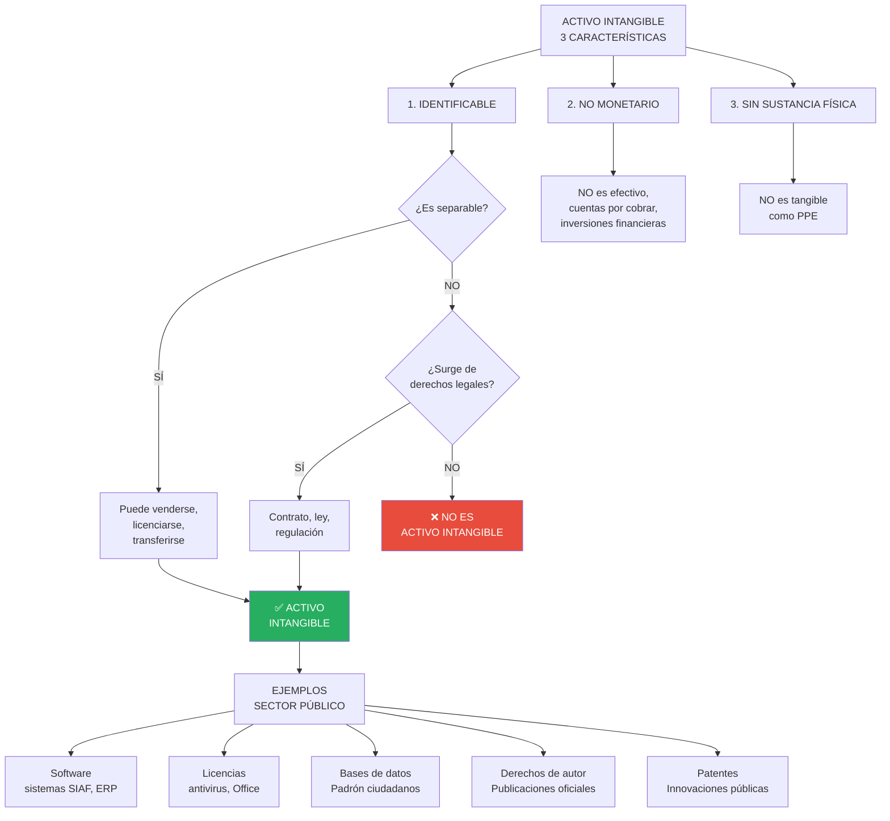
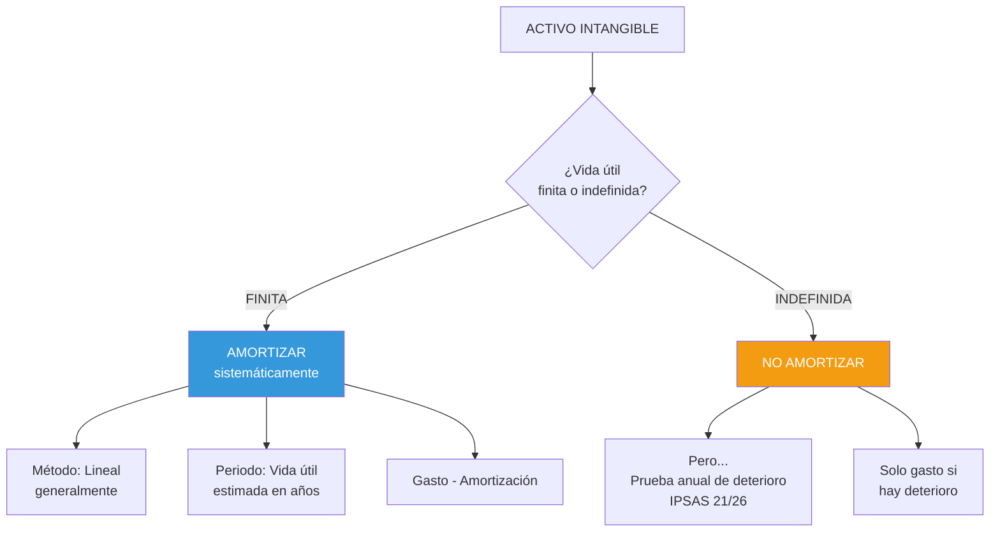

# IPSAS 31: Activos Intangibles

## Resumen

La IPSAS 31 establece el tratamiento contable de activos intangibles en el sector público, un área con importantes [[diferencias-nicsp-niif|diferencias respecto al sector privado]]. Define activos identificables, no monetarios y sin sustancia física (software, licencias, derechos), requiriendo reconocimiento cuando sean controlables, generen beneficios económicos o potencial de servicio futuro (según el [[marco-conceptual-nicsp|Marco Conceptual]]), y su costo sea medible confiablemente. La medición inicial es al costo (o [[ipsas-23-ingresos-sin-contraprestacion|valor razonable si es adquirido sin contraprestación]]), con amortización durante su vida útil (si es finita) o prueba anual de deterioro (si es indefinida). Prohíbe capitalizar desembolsos en fase de investigación y exige revelaciones detalladas.

## Definición / Texto Normativo

**IPSAS 31 - Intangible Assets, Párrafo 16:**

> "Un **activo intangible** es un activo **identificable**, de carácter **no monetario** y **sin apariencia física**."

**IPSAS 31, Párrafo 17 - Criterio de Identificabilidad:**

> "Un activo es identificable si:
> (a) Es **separable**, es decir, es susceptible de ser separado o dividido de la entidad y vendido, transferido, licenciado, arrendado o intercambiado, ya sea individualmente o junto con un contrato, activo identificable o pasivo con los que guarde relación, independientemente de que la entidad tenga la intención de hacerlo; o
> (b) Surge de **derechos contractuales u otros derechos legales**, independientemente de si esos derechos son transferibles o separables de la entidad o de otros derechos y obligaciones."

**IPSAS 31, Párrafo 24 - Reconocimiento:**

> "Una entidad reconocerá un activo intangible si, y solo si:
> (a) Es **probable** que los **beneficios económicos futuros o el potencial de servicio** que se han atribuido al activo fluyan a la entidad (ver [[marco-conceptual-nicsp|Marco Conceptual]]); y
> (b) El **costo** o el **valor razonable** del activo puede ser **medido de forma fiable**."

**IPSAS 31, Párrafo 33 - Activos Intangibles Generados Internamente:**

> "No se reconocerá ningún activo intangible surgido de la fase de **investigación**. El desembolso por investigación se reconocerá como un **gasto** cuando se incurra en él."

**IPSAS 31, Párrafo 52 - Amortización:**

> "El importe depreciable de un activo intangible con una **vida útil finita**, se distribuirá sobre una base sistemática a lo largo de su vida útil."

**Definiciones clave (Párrafo 16):**

- **Amortización:** Distribución sistemática del importe depreciable de un activo intangible durante su vida útil.
- **Vida útil:** Periodo durante el cual se espera que el activo esté disponible para su uso por la entidad, o número de unidades de producción/similares que se espera obtener del activo.
- **Valor residual:** Importe estimado que la entidad obtendría actualmente por la disposición del activo, después de deducir los costos estimados de disposición (frecuentemente S/. 0 para intangibles).
- **Investigación:** Indagación original y planificada emprendida con la finalidad de obtener nuevos conocimientos científicos o técnicos.
- **Desarrollo:** Aplicación de los resultados de la investigación a un plan o diseño para producción de productos/servicios nuevos o mejorados antes del inicio de su producción comercial.

## Desarrollo / Interpretación

### Características de Activos Intangibles en el Sector Público



**Ejemplos de identificabilidad:**

| Activo                    | ¿Separable?                           | ¿Derechos legales?            | ¿Identificable? |
| ------------------------- | ------------------------------------- | ----------------------------- | --------------- |
| Software ERP comprado     | ✅ SÍ (puede revenderse con licencia) | ✅ Contrato de licencia       | ✅ SÍ           |
| Base de datos ciudadanos  | ✅ SÍ (puede transferirse)            | ✅ Ley de protección de datos | ✅ SÍ           |
| Capital humano capacitado | ❌ NO (no controlable)                | ❌ NO                         | ❌ NO           |
| Reputación institucional  | ❌ NO (no transferible)               | ❌ NO                         | ❌ NO           |

---

### Reconocimiento: Criterios y Restricciones

#### **Criterio 1: Probabilidad de beneficios económicos / potencial de servicio**

**Sector público - Ejemplos:**

**Sistema de gestión hospitalaria (software):**

- ✅ **Potencial de servicio:** Mejora eficiencia en atención de pacientes (reduce tiempos de espera 30%)
- ✅ **Beneficio económico:** Reduce costos administrativos (menos personal manual)
- **Conclusión:** Cumple criterio

**Base de datos de historia clínica electrónica:**

- ✅ **Potencial de servicio:** Facilita diagnósticos más rápidos y precisos
- ✅ **Beneficio económico:** Evita duplicación de exámenes (ahorro)
- **Conclusión:** Cumple criterio

#### **Criterio 2: Medición confiable del costo**

**Costo de un activo intangible adquirido separadamente (Párrafo 27):**

```mermaid
graph LR
    A[COSTO TOTAL<br/>ACTIVO INTANGIBLE] --> B[Precio de compra<br/>neto de descuentos]
    A --> C[Aranceles e impuestos<br/>no recuperables]
    A --> D[Costos atribuibles<br/>directamente]

    D --> D1[Preparación del activo<br/>para su uso previsto]
    D --> D2[Honorarios profesionales<br/>implementación]
    D --> D3[Pruebas de funcionamiento<br/>correcto]

    style A fill:#E74C3C,color:#fff

    %% Referencias a otras normas
    subgraph Referencias
        E --> R1>[[ipsas-17-propiedad-planta-equipo|Diferente de PPE]]
        C --> R2>[[ipsas-13-arrendamientos|No es un activo financiero]]
    end
```

**Exclusiones del costo (Párrafo 28):**

❌ Costos de introducir nuevo producto/servicio (marketing)  
❌ Costos de operar en nueva ubicación (traslado)  
❌ Costos administrativos generales  
❌ Capacitación de personal (gasto operativo)  
❌ Pérdidas operativas iniciales

**Ejemplo de cálculo de costo:**

**Hospital adquiere Sistema de Información Hospitalaria (HIS):**

| Concepto                                          | Monto        | ¿Incluir en costo?           |
| ------------------------------------------------- | ------------ | ---------------------------- |
| Licencia software (3 años)                        | S/. 450,000  | ✅ Costo principal           |
| Descuento por pago anticipado                     | (S/. 45,000) | ✅ Reducir costo             |
| Customización del sistema (adaptación a procesos) | S/. 120,000  | ✅ Directamente atribuible   |
| Migración de datos históricos                     | S/. 80,000   | ✅ Preparación para uso      |
| Pruebas de integración con SIGA                   | S/. 30,000   | ✅ Verificar funcionamiento  |
| Capacitación de 50 usuarios                       | S/. 35,000   | ❌ Gasto operativo           |
| Soporte técnico anual (años 4-5)                  | S/. 60,000   | ❌ Gasto futuro (no inicial) |
| Campaña de difusión interna                       | S/. 15,000   | ❌ Gasto marketing           |

**Costo del activo intangible:**

```
S/. 450,000 - S/. 45,000 + S/. 120,000 + S/. 80,000 + S/. 30,000 = S/. 635,000
```

**Asiento contable:**

```
Software - HIS (Activo Intangible)     635,000
Gasto - Capacitación Personal           35,000
    Banco                                       670,000

[Reconocimiento inicial al costo, excluyendo capacitación]
```

---

### Activos Intangibles Generados Internamente

**IPSAS 31 distingue 2 fases (Párrafos 33-44):**

#### **FASE 1: Investigación**

**Definición (Párrafo 16):**

> "Indagación original y planificada emprendida con la finalidad de obtener nuevos conocimientos científicos o técnicos."

**Tratamiento contable:**

```
❌ NO reconocer como activo → Gasto del periodo
```

**Razón:** No se puede demostrar que exista un activo que generará beneficios futuros (incertidumbre alta).

**Ejemplos de investigación:**

- Estudio de viabilidad para nuevo sistema de información
- Investigación sobre tecnologías blockchain para registro de activos públicos
- Análisis de alternativas de software para implementar gobierno electrónico

---

#### **FASE 2: Desarrollo**

**Definición (Párrafo 16):**

> "Aplicación de los resultados de la investigación a un plan o diseño para producción de productos/servicios nuevos o mejorados antes del inicio de su producción comercial."

**Tratamiento contable:**

```
✅ Reconocer como activo SI cumple TODOS estos criterios (Párrafo 44):
```

**6 criterios acumulativos:**

1. **Factibilidad técnica:** Es técnicamente posible completar el activo intangible de forma que esté disponible para su uso o venta
2. **Intención de completar:** La entidad tiene intención de completar el activo y usarlo o venderlo
3. **Capacidad de uso:** La entidad puede usar o vender el activo intangible
4. **Generación de beneficios:** El activo generará beneficios económicos futuros o potencial de servicio
5. **Recursos técnicos/financieros:** Disponibilidad de recursos para completar desarrollo
6. **Capacidad de medir:** Puede medir confiablemente el gasto atribuible

**Si falta UNO SOLO de estos criterios → Gasto del periodo**

**Ejemplo comparativo:**

**Municipalidad desarrolla plataforma digital de trámites en línea:**

| Fase            | Actividad                               | Costo       | ¿Cumple 6 criterios? | Tratamiento |
| --------------- | --------------------------------------- | ----------- | -------------------- | ----------- |
| Investigación   | Estudio de necesidades ciudadanas       | S/. 50,000  | ❌ NO                | Gasto       |
| Investigación   | Evaluación de alternativas tecnológicas | S/. 30,000  | ❌ NO                | Gasto       |
| Desarrollo      | Diseño de arquitectura del sistema      | S/. 120,000 | ✅ SÍ (desde aquí)   | Activo      |
| Desarrollo      | Programación de módulos                 | S/. 350,000 | ✅ SÍ                | Activo      |
| Desarrollo      | Pruebas de integración                  | S/. 80,000  | ✅ SÍ                | Activo      |
| Post-desarrollo | Capacitación de funcionarios            | S/. 40,000  | ❌ NO                | Gasto       |

**Asientos contables:**

**Durante investigación (Año 1):**

```
Gasto - Investigación Plataforma Digital   80,000
    Banco                                          80,000
```

**Durante desarrollo (Año 2):**

```
Software en Desarrollo (Activo Intangible)  550,000
    Banco                                           550,000

[S/. 120,000 + S/. 350,000 + S/. 80,000]
```

**Activación al completarse (Año 2):**

```
Software - Plataforma Trámites Digitales   550,000
    Software en Desarrollo                         550,000

[Transferir de "en desarrollo" a activo en uso]
```

**Post-activación (Año 2):**

```
Gasto - Capacitación                        40,000
    Banco                                          40,000
```

---

### Amortización de Activos Intangibles

#### **Vida Útil: Finita vs Indefinida**

**IPSAS 31, Párrafo 85:**

> "Se considerará que un activo intangible tiene una **vida útil indefinida** cuando no exista un límite previsible al periodo durante el cual se espera que el activo genere entradas de flujos netos de efectivo o preste potencial de servicio para la entidad."

**Aclaración:** "Indefinida" ≠ "Infinita" (significa que no se puede estimar un límite temporal).



**Factores para determinar vida útil (Párrafo 87):**

1. **Uso esperado del activo** por la entidad
2. **Ciclos de vida del producto/servicio** relacionado
3. **Obsolescencia técnica, tecnológica o de otro tipo**
4. **Estabilidad de la industria** donde opera
5. **Actuaciones de los competidores** (sector privado) o cambios regulatorios (sector público)
6. **Nivel de desembolsos de mantenimiento** requeridos
7. **Periodo de control** sobre el activo (contratos, leyes)
8. **Dependencia de otros activos**

**Ejemplos de vida útil en sector público:**

| Activo Intangible                  | Vida útil típica | Razón                               |
| ---------------------------------- | ---------------- | ----------------------------------- |
| Software de gestión administrativa | 5-10 años        | Obsolescencia tecnológica           |
| Licencia de Microsoft Office 365   | 1-3 años         | Duración del contrato               |
| Base de datos ciudadanos           | 10-15 años       | Actualización continua (vida larga) |
| Sistema operativo (Windows Server) | 5 años           | Soporte del fabricante              |
| Patente de innovación pública      | 20 años          | Protección legal                    |
| Desarrollo de app móvil            | 3-5 años         | Cambios tecnológicos rápidos        |

#### **Cálculo de amortización**

**Fórmula (método lineal - más común):**

```
Amortización anual = (Costo - Valor residual) / Vida útil en años

Nota: Valor residual generalmente = S/. 0 para intangibles
```

**Ejemplo:**

**Software ERP:**

- Costo: S/. 850,000
- Valor residual: S/. 0 (no se espera vender al final)
- Vida útil: 10 años

```
Amortización anual = (850,000 - 0) / 10 = S/. 85,000
```

**Asiento contable anual:**

```
Gasto - Amortización Software ERP        85,000
    Amortización Acumulada - Software ERP       85,000
```

**Presentación en Estado de Situación Financiera (Año 1):**

```
ACTIVOS NO CORRIENTES:
  Activos Intangibles:
    Software ERP                  S/.   850,000
    Menos: Amortización Acumulada S/.   (85,000)
    Valor neto                    S/.   765,000
```

---

### Medición Posterior: Modelo de Costo vs Modelo de Revaluación

**IPSAS 31 permite elegir (Párrafo 63):**

#### **Modelo de Costo (más común en sector público)**

**Regla:**

```
Valor en libros = Costo - Amortización acumulada - Pérdidas por deterioro acumuladas
```

**Ventajas:**

- ✅ Simplicidad
- ✅ Objetividad (costo histórico verificable)
- ✅ Bajo costo de aplicación

**Desventaja:**

- ❌ Puede no reflejar valor actual (especialmente si tecnología se vuelve obsoleta)

---

#### **Modelo de Revaluación (poco común para intangibles)**

**Regla (Párrafo 64):**

```
Valor en libros = Valor razonable a fecha de revaluación - Amortización posterior - Deterioro posterior
```

**Condición obligatoria (Párrafo 64):**

> "El valor razonable se determinará por referencia a un **mercado activo**."

**Problema:** Muy pocos activos intangibles tienen "mercado activo" (bolsa donde se negocien regularmente).

**Mercado activo existe si:**

- Las partidas negociadas son homogéneas
- Pueden encontrarse compradores y vendedores en todo momento
- Los precios están disponibles públicamente

**Ejemplos:**

| Activo Intangible                                                 | ¿Mercado activo?                                         | ¿Se puede revaluar? |
| ----------------------------------------------------------------- | -------------------------------------------------------- | ------------------- |
| Licencia de taxi (en ciudad con sistema de licencias negociables) | ✅ SÍ                                                    | ✅ SÍ               |
| Software desarrollado internamente                                | ❌ NO (único)                                            | ❌ NO               |
| Patente de medicamento                                            | ❌ NO (única)                                            | ❌ NO               |
| Licencia de Microsoft Office                                      | ❌ NO (precios minoristas, no mercado secundario activo) | ❌ NO               |

**Conclusión:** En la práctica, casi **todos** los intangibles en sector público usan **modelo de costo**.

---

### Baja en Cuentas (Disposición)

**IPSAS 31, Párrafo 104:**

> "Un activo intangible se dará de baja en cuentas:
> (a) Por su **disposición**; o
> (b) Cuando no se espere obtener **beneficios económicos futuros o potencial de servicio** de su uso o disposición."

**Ejemplo: Obsolescencia tecnológica**

**Municipalidad tiene software de recaudación tributaria:**

- Costo original: S/. 400,000
- Amortización acumulada: S/. 320,000
- Valor en libros: S/. 80,000
- Situación: Software ya no es compatible con nuevo sistema operativo del gobierno central (SIGA), debe reemplazarse

**Asiento de baja:**

```
Amortización Acumulada - Software         320,000
Pérdida por Baja de Activo Intangible      80,000
    Software - Recaudación Tributaria              400,000

[Dar de baja completamente, reconocer pérdida]
```

**Presentación en Estado de Gestión:**

```
GASTOS:
  Pérdida por Baja de Activo Intangible   S/. 80,000
```

---

### Revelaciones Requeridas

**Información obligatoria por clase de activos intangibles (Párrafos 115-123):**

1. **Vidas útiles o tasas de amortización**
2. **Métodos de amortización**
3. **Valor bruto en libros y amortización acumulada** (inicio y cierre)
4. **Conciliación de valores en libros:**
   - Saldo inicial
   - Adiciones (compras, desarrollo interno)
   - Disposiciones (bajas)
   - Amortización
   - Deterioros
   - Saldo final
5. **Activos intangibles con vida útil indefinida:** Descripción y razón de la clasificación
6. **Activos intangibles generados internamente:** Costo total reconocido durante el periodo

**Ejemplo de revelación:**

**Nota 11 - Activos Intangibles**

```
11.1 Composición y movimientos (2024):

                        Software     Licencias    Desarrollo    Total
Costo:
Saldo inicial           1,200,000    180,000      0             1,380,000
Adiciones - Compras     250,000      45,000       0             295,000
Adiciones - Desarrollo  0            0            550,000       550,000
Bajas                   (120,000)    0            0             (120,000)
Saldo final             1,330,000    225,000      550,000       2,105,000

Amortización acumulada:
Saldo inicial           (480,000)    (72,000)     0             (552,000)
Amortización año        (180,000)    (45,000)     0             (225,000)
Bajas                   96,000       0            0             96,000
Saldo final             (564,000)    (117,000)    0             (681,000)

Valor neto en libros:
31/12/2024              766,000      108,000      550,000       1,424,000
31/12/2023              720,000      108,000      0             828,000

11.2 Políticas contables:
- Modelo de medición: Costo
- Método de amortización: Lineal
- Vidas útiles:
  * Software de gestión: 8 años
  * Licencias: 3-5 años (duración del contrato)
  * Desarrollo de plataforma digital: 10 años (pendiente de activación)

11.3 Activos intangibles generados internamente:
Durante 2024, la entidad desarrolló una plataforma de trámites digitales.
Costos de desarrollo reconocidos como activo: S/. 550,000
Costos de investigación reconocidos como gasto: S/. 80,000
El activo se activará y comenzará a amortizarse en 2025 al entrar en operación.

11.4 Prueba de deterioro:
Se realizó evaluación de deterioro al 31/12/2024. No se identificaron indicios
de deterioro en ningún activo intangible.
```

## Conexiones

- [[marco-conceptual-nicsp]] - Definición de activo, beneficios económicos vs potencial de servicio
- [[base-devengado-sector-publico]] - Amortización como gasto devengado (consumo del activo)
- [[diferencias-nicsp-niif]] - IPSAS 31 basada en IAS 38, con énfasis en potencial de servicio público
- [[contabilidad-gubernamental-peru]] - Registro en SIAF, PCG Clase 3 (Activos Intangibles)
- [[ipsas-17-propiedad-planta-equipo|IPSAS 17]] - Diferencia tangible vs intangible (sustancia física)
- [[unidad-II/ipsas-21-deterioro-activos-no-generadores|IPSAS 21]] - Deterioro de intangibles con vida indefinida
- [[unidad-II/ipsas-23-ingresos-sin-contraprestacion|IPSAS 23]] - Intangibles recibidos por donación

## Ejemplos Resueltos

### Ejemplo 1: Adquisición de Software y Amortización (Básico)

**Situación:**
Hospital público adquiere software de historia clínica electrónica el 01/01/2024:

- Precio de lista: S/. 320,000
- Descuento por compra pública: S/. 32,000 (10%)
- IGV: S/. 51,840 (recuperable)
- Customización del software: S/. 85,000
- Instalación en servidores: S/. 15,000
- Capacitación de 20 médicos/enfermeras: S/. 28,000
- Mantenimiento anual años 2-5: S/. 60,000

Vida útil estimada: 8 años  
Valor residual: S/. 0

**Tarea:** Calcular el costo del activo intangible, registrar la adquisición, calcular y registrar la amortización anual.

---

**Solución:**

**Paso 1: Calcular costo del activo**

| Concepto             | Monto        | ¿Incluir?                    |
| -------------------- | ------------ | ---------------------------- |
| Precio lista         | S/. 320,000  | ✅ Base                      |
| Descuento            | (S/. 32,000) | ✅ Reducir costo             |
| IGV                  | S/. 51,840   | ❌ Recuperable (no es costo) |
| Customización        | S/. 85,000   | ✅ Adaptar para uso previsto |
| Instalación          | S/. 15,000   | ✅ Preparación               |
| Capacitación         | S/. 28,000   | ❌ Gasto operativo           |
| Mantenimiento futuro | S/. 60,000   | ❌ Gasto períodos futuros    |

**Costo del activo:**

```
S/. 320,000 - S/. 32,000 + S/. 85,000 + S/. 15,000 = S/. 388,000
```

**Paso 2: Asiento de adquisición (01/01/2024)**

```
Software - Historia Clínica Electrónica   388,000
IGV por Aplicar                             51,840
Gasto - Capacitación Personal               28,000
    Banco                                          467,840

[Costo = S/. 288,000 + S/. 85,000 + S/. 15,000]
```

**Paso 3: Calcular amortización anual**

```
Amortización anual = (S/. 388,000 - S/. 0) / 8 años = S/. 48,500
```

**Paso 4: Asiento de amortización (31/12/2024)**

```
Gasto - Amortización Software              48,500
    Amortización Acumulada - Software             48,500

[Reconocer consumo del primer año]
```

**Paso 5: Presentación al 31/12/2024**

**Estado de Situación Financiera:**

```
ACTIVOS NO CORRIENTES - Activos Intangibles:

Software - Historia Clínica       S/.   388,000
Menos: Amortización Acumulada     S/.   (48,500)
Valor neto                        S/.   339,500
```

**Estado de Gestión (2024):**

```
GASTOS:
  Capacitación Personal           S/.    28,000
  Amortización Software           S/.    48,500
  Total gastos relacionados       S/.    76,500
```

**Análisis:**

**Vida útil restante al 31/12/2024:** 7 años  
**Valor en libros:** S/. 339,500  
**Amortización anual futura:** S/. 48,500 (constante durante 7 años más)

---

### Ejemplo 2: Desarrollo Interno de Plataforma Digital (Avanzado)

**Situación:**
Municipalidad decide crear plataforma de trámites digitales. Cronograma:

**FASE INVESTIGACIÓN (Enero-Marzo 2024):**

- Estudio de necesidades ciudadanas: S/. 35,000
- Benchmarking de plataformas similares: S/. 25,000
- Evaluación de alternativas tecnológicas: S/. 40,000
- **Total investigación:** S/. 100,000

**FASE DESARROLLO (Abril-Diciembre 2024):**

- Diseño de arquitectura del sistema: S/. 120,000
- Programación de 5 módulos principales: S/. 450,000
- Desarrollo de interfaz de usuario: S/. 80,000
- Integración con sistema de pagos: S/. 60,000
- Pruebas de seguridad y penetración: S/. 50,000
- **Total desarrollo:** S/. 760,000

**POST-DESARROLLO (Diciembre 2024):**

- Capacitación de 50 funcionarios: S/. 45,000
- Campaña de difusión ciudadana: S/. 30,000

**Puesta en operación:** 01/01/2025  
**Vida útil:** 12 años  
**Valor residual:** S/. 0

**Tarea:** Registrar todos los desembolsos de 2024 según corresponda (gasto o activo), preparar el asiento de activación, calcular la amortización de 2025.

---

**Solución:**

**Paso 1: Clasificar desembolsos**

**Fase Investigación → GASTO** (no se puede demostrar activo identificable aún)

```
Gasto - Investigación Plataforma Digital   100,000
    Banco                                          100,000

[Reconocer como gasto cuando se incurre]
```

**Fase Desarrollo → ACTIVO** (cumple 6 criterios del párrafo 44)

Verificación de los 6 criterios:

1. ✅ Factibilidad técnica: SÍ (tecnología probada)
2. ✅ Intención de completar: SÍ (presupuesto aprobado)
3. ✅ Capacidad de uso: SÍ (para trámites municipales)
4. ✅ Generación de beneficios: SÍ (potencial de servicio: reducir tiempos de trámite 70%)
5. ✅ Recursos disponibles: SÍ (presupuesto asignado)
6. ✅ Capacidad de medir: SÍ (contratos y facturas)

```
Software en Desarrollo                      760,000
    Banco                                          760,000

[S/. 120,000 + 450,000 + 80,000 + 60,000 + 50,000]
```

**Fase Post-Desarrollo → GASTO** (ya no mejoran el activo)

```
Gasto - Capacitación Personal               45,000
Gasto - Publicidad                          30,000
    Banco                                          75,000
```

**Paso 2: Asiento de activación (01/01/2025)**

```
Software - Plataforma Trámites Digitales   760,000
    Software en Desarrollo                         760,000

[Transferir a activo en uso al estar disponible]
```

**Paso 3: Calcular amortización 2025**

```
Amortización anual = (S/. 760,000 - S/. 0) / 12 años = S/. 63,333
```

**Paso 4: Asiento de amortización (31/12/2025)**

```
Gasto - Amortización Software              63,333
    Amortización Acumulada - Software             63,333
```

**Paso 5: Resumen de impacto en resultados**

**Año 2024:**

```
GASTOS:
  Investigación                   S/.   100,000
  Capacitación                    S/.    45,000
  Publicidad                      S/.    30,000
  Total gastos 2024               S/.   175,000

[No hay amortización en 2024 porque el activo no está en uso]
```

**Año 2025:**

```
GASTOS:
  Amortización Software           S/.    63,333

[Comienza amortización al estar disponible para uso]
```

**Análisis:**

**Capitalización:**

- Total invertido: S/. 935,000
- Capitalizado como activo: S/. 760,000 (81.3%)
- Reconocido como gasto inmediato: S/. 175,000 (18.7%)

**Ventaja del desarrollo interno:**

- Costo estimado si se comprara software similar: S/. 1,500,000
- Ahorro: S/. 740,000 (49.3%)
- Control total sobre funcionalidades y actualizaciones

## Ejercicios Propuestos

### Ejercicio 1: Reconocimiento y Amortización Básica (Básico)

**Escenario:**
Gobierno Regional adquiere los siguientes activos intangibles en enero 2024:

1. **Licencias de software antivirus (500 licencias):**
   - Precio total: S/. 150,000 (incluye IGV recuperable)
   - Duración del contrato: 3 años
   - Instalación y configuración: S/. 8,000
   - Actualización automática incluida

2. **Base de datos geográfica (SIG - Sistema de Información Geográfica):**
   - Licencia perpetua: S/. 420,000 (sin IGV)
   - Customización para región: S/. 85,000
   - Capacitación de 15 técnicos: S/. 22,000
   - Vida útil estimada: 12 años

**Tarea:**

1. Calcula el costo inicial de cada activo intangible
2. Determina la vida útil apropiada
3. Calcula la amortización del año 2024
4. Prepara los asientos contables de: (a) Adquisición, (b) Amortización anual

---

### Ejercicio 2: Desarrollo Interno - Investigación vs Desarrollo (Intermedio)

**Escenario:**
Hospital universitario desarrolla un sistema de inteligencia artificial para diagnóstico de radiografías:

**Cronología de costos:**

**Fase 1 (Enero-Abril 2024) - Investigación inicial:**

- Revisión de literatura médica: S/. 45,000
- Consultoría con radiólogos expertos: S/. 60,000
- Evaluación de viabilidad técnica: S/. 35,000

**Fase 2 (Mayo-Julio 2024) - Prototipo (desarrollo):**

- Diseño de algoritmo: S/. 120,000
- Desarrollo de prototipo: S/. 180,000
- Pruebas con 500 radiografías históricas: S/. 40,000

**Fase 3 (Agosto 2024) - Evaluación de prototipo:**

- Pruebas clínicas (resultado negativo: 60% de precisión, insuficiente)
- Decisión: Suspender proyecto por no alcanzar estándar médico (mínimo 95%)

**Tarea:**

1. Clasifica cada fase como "investigación" o "desarrollo"
2. Determina qué costos deben reconocerse como activo y cuáles como gasto
3. Registra los asientos contables correspondientes a cada fase
4. Ante el fracaso del proyecto, ¿qué tratamiento contable adicional se requiere en agosto?
5. Analiza: ¿Qué hubiera pasado si el proyecto se suspendía en julio (antes de activar el activo)?

---

### Ejercicio 3: Caso Integral - Portfolio de Activos Intangibles (Avanzado)

**Escenario:**
Ministerio de Educación tiene los siguientes activos intangibles al 31/12/2024:

**A. Sistema de Gestión Educativa (SIGE):**

- Adquirido: 2020 por S/. 8,500,000
- Vida útil original: 15 años
- Amortización acumulada: S/. 2,833,333 (al 31/12/2024)
- Situación: Gobierno aprueba cambio de plataforma tecnológica (migración obligatoria a sistema integrado del Estado). SIGE quedará obsoleto en 2026.

**B. Portal Educativo (plataforma e-learning):**

- Desarrollado internamente: 2022 por S/. 3,200,000
- Vida útil: 10 años
- Amortización acumulada: S/. 640,000
- Situación: Funciona correctamente, alta demanda (1.5 millones de usuarios activos)

**C. Base de Datos de Docentes:**

- Costo: S/. 1,800,000 (2019)
- Clasificada como "vida útil indefinida" (actualización continua)
- No se amortiza, pero se hace prueba anual de deterioro
- Situación: Auditoría interna identifica que 30% de los datos están desactualizados (docentes jubilados, fallecidos). Valor recuperable estimado: S/. 1,200,000

**D. Software en Desarrollo - Sistema de Certificaciones:**

- Costo acumulado al 31/12/2024: S/. 950,000
- Inicio: Abril 2024
- Avance: 70% completado
- Situación: Presupuesto 2025 recortado 40%. Probablemente no se completará.

**Tarea (1,500 palabras):**

1. **Revisión de vida útil (SIGE):**
   - Calcula la vida útil revisada (desde 2024) considerando obsolescencia 2026
   - Recalcula la amortización anual a partir de 2024
   - Prepara asiento de ajuste si es necesario

2. **Deterioro (Base de Datos):**
   - Calcula el importe de deterioro
   - Registra el asiento contable
   - Determina si se debe amortizar en adelante o mantener vida indefinida

3. **Software en Desarrollo:**
   - Evalúa si aún cumple los 6 criterios del párrafo 44
   - Si no cumple, prepara asiento de baja/conversión a gasto
   - Calcula el impacto en resultados

4. **Revelaciones (Nota 11):**
   - Prepara la conciliación de movimientos de activos intangibles 2024
   - Incluye política contable sobre vida útil indefinida
   - Describe eventos significativos (obsolescencia, deterioro)

5. **Análisis estratégico:**
   - Evalúa la gestión de activos intangibles del Ministerio
   - Identifica 3 riesgos en la administración de software público
   - Propón 3 mejoras al proceso de evaluación de proyectos de desarrollo interno

## Preguntas Bloom

**Nivel 1 - Recordar:** Define "activo intangible" según IPSAS 31. Enumera los 3 criterios que debe cumplir un activo para ser "identificable".

**Nivel 2 - Comprender:** Explica con tus propias palabras por qué IPSAS 31 prohíbe reconocer como activo los costos de investigación, pero permite reconocer los costos de desarrollo (bajo ciertas condiciones). Proporciona 2 ejemplos de cada fase.

**Nivel 3 - Aplicar:** Una municipalidad compra software de recaudación tributaria por S/. 650,000 (vida útil 8 años, valor residual S/. 0). Adicionalmente gasta S/. 85,000 en customización y S/. 35,000 en capacitación. Aplica IPSAS 31 para: (a) Calcular el costo del activo, (b) Registrar la adquisición, (c) Calcular amortización anual, (d) Presentar en Estado de Situación Financiera al final del año 1.

**Nivel 4 - Analizar:** Compara el tratamiento contable de activos intangibles con vida útil finita vs vida útil indefinida. Analiza: (a) Amortización, (b) Evaluación de deterioro, (c) Revisión de estimaciones, (d) Impacto en resultados. Proporciona ejemplos de cada tipo en el sector público peruano.

**Nivel 5 - Evaluar:** Un gobierno regional desarrolla internamente un sistema de información geográfica (SIG) por S/. 2,500,000 y lo reconoce como activo intangible. Tres años después, una auditoría externa cuestiona: "El SIG tiene errores en 40% de las coordenadas, no se usa en la toma de decisiones, y existe software gratuito (open-source) más preciso. Deberían haber reconocido el gasto cuando se incurrió, no como activo." Evalúa este cuestionamiento desde: (a) Criterios de reconocimiento IPSAS 31, (b) Potencial de servicio actual, (c) Decisiones de gestión. ¿La auditoría tiene razón? ¿Qué acción correctiva recomendarías?

**Nivel 6 - Crear:** Diseña una "Guía de Decisión para Capitalización de Software" dirigida a entidades públicas peruanas que ayude a determinar cuándo reconocer como activo vs gasto. Tu guía debe incluir: (1) Flujograma de decisión con preguntas clave, (2) Ejemplos prácticos de cada escenario, (3) Checklist de documentación requerida, (4) Criterios para estimar vida útil por tipo de software, (5) Integración con SIAF. Extensión: 1,200 palabras.

## Base Normativa

**Norma IPSASB:**

1. **IPSAS 31 - Intangible Assets (revisada 2021).** Texto completo define reconocimiento, medición inicial/posterior, activos generados internamente, amortización y revelaciones.
   - Párrafos clave: 16-17 (definición e identificabilidad), 24 (reconocimiento), 33-44 (investigación vs desarrollo), 52-84 (amortización), 63-76 (modelos costo/revaluación), 115-123 (revelaciones)
   - Disponible en: www.ipsasb.org/publications/ipsas-31-intangible-assets

**Normas relacionadas:** 2. **IAS 38 - Intangible Assets (IFRS Foundation).** Base de IPSAS 31 con adaptaciones para sector público. 3. **IPSAS 21 - Impairment of Non-Cash-Generating Assets.** Deterioro de intangibles (evaluación anual para vida indefinida). 4. **IPSAS 26 - Impairment of Cash-Generating Assets.** Deterioro si el intangible genera flujos de efectivo. 5. **IPSAS 23 - Revenue from Non-Exchange Transactions.** Reconocimiento de intangibles recibidos por donación.

**Guías de implementación:** 6. **IPSASB Implementation Guidance for IPSAS 31** (2010). Ejemplos de investigación vs desarrollo, software.

**Normativa Peruana:** 7. **Plan Contable Gubernamental 2019 - Clase 3 (Activos Intangibles).** Cuentas específicas:

- 341 - Software
- 342 - Concesiones, licencias y otros derechos
- 349 - Amortización acumulada

8. **Directiva N° 002-2016-EF/51.01** - "Registro y control de activos intangibles": Pautas para software, desarrollo interno.

**Literatura técnica:** 9. Barton, A. (2004). "How to Profit from Defence: A Study in the Misapplication of Business Accounting to the Public Sector". _Financial Accountability & Management_, 20(3), 281-304. 10. Lev, B., & Zarowin, P. (1999). "The Boundaries of Financial Reporting and How to Extend Them". _Journal of Accounting Research_, 37(2), 353-385.

## Referencias Bibliográficas y Recursos en Línea

**Textos oficiales:**

- **IPSASB:** www.ipsasb.org/publications/ipsas-31-intangible-assets
  - Texto completo IPSAS 31 (inglés)
  - Bases for Conclusions (BC)
  - Implementation Guidance (IG) - Casos de desarrollo interno

**Recursos en español:**

- **IFAC:** www.ifac.org/knowledge-gateway
  - IPSAS 31 en español (traducción oficial)
- **Contaduría Perú:** www.mef.gob.pe/es/contabilidad-publica
  - Directiva de activos intangibles
  - Vidas útiles referenciales

**Herramientas prácticas:**

- **Checklist de capitalización de software:** (6 criterios párrafo 44)
- **Calculadora de amortización:** (Excel con método lineal)

**Casos de estudio:**

- **UK Treasury:** "Accounting for Software in Central Government"
- **Australia:** "Intangible Assets Recognition Policy"
- **Nueva Zelanda:** "Software Capitalisation Guidelines"

## Notas y Alertas

> **⚠️ Error Común:** Capitalizar TODOS los costos de un proyecto de software. **Regla:** Solo la fase de **desarrollo** (después de demostrar viabilidad técnica) se capitaliza. La fase de **investigación** (estudios, análisis de alternativas) siempre es gasto.

> **💡 Capacitación NO es parte del costo:** La capacitación del personal que usará el software NUNCA forma parte del costo del activo intangible (es gasto operativo del periodo). Solo se capitaliza la preparación técnica del software para estar en condiciones de uso.

> **📊 Indicador de Alerta - Vida Útil:** Si un software lleva >80% amortizado pero sigue siendo crítico para operaciones, puede indicar: (a) Vida útil subestimada (revisar estimación), (b) Riesgo operativo alto (depender de sistema obsoleto), (c) Necesidad de reemplazo/actualización mayor.

> **🌍 Contexto Perú - Software Público:** Muchas entidades usan sistemas heredados (legacy) de 15-20 años con parches continuos. Según Contraloría (Informe 2023), 45% de software crítico en gobierno no tiene licenciamiento formal o está obsoleto (fuera de soporte del fabricante). Esto genera riesgos de seguridad y continuidad operativa.

> **⚙️ Integración SIAF:** En Perú, el alta de activos intangibles (software >S/. 1 UIT generalmente) requiere: (1) Registro en SIAF Módulo de Activos, (2) Clasificación por tipo (3419 - Otros programas, 3411 - Aplicativos específicos), (3) Asignación a responsable funcional. Contraloría audita consistencia entre registro contable y contratos de licenciamiento.

> **🔍 Desarrollo Interno - Riesgo de Sobrecapitalización:** Algunas entidades capitalizan costos que NO cumplen los 6 criterios (ejemplo: "sistema en desarrollo" por 5 años sin evidencia de avance real). IPSAS 31 requiere **revisar anualmente** si aún es probable completar el activo. Si no, debe reconocerse pérdida inmediata.

> **📖 Para Profundizar:** Si te interesa el debate sobre reconocimiento de activos intangibles en sector público (especialmente "capital intelectual" y "know-how"), consulta: Guthrie, J., & Petty, R. (2000). "Intellectual Capital: Australian Annual Reporting Practices". _Journal of Intellectual Capital_, 1(3), 241-251.

---

<div style="text-align: center;">
<a href="https://notbyai.fyi">

</a>
</div>
