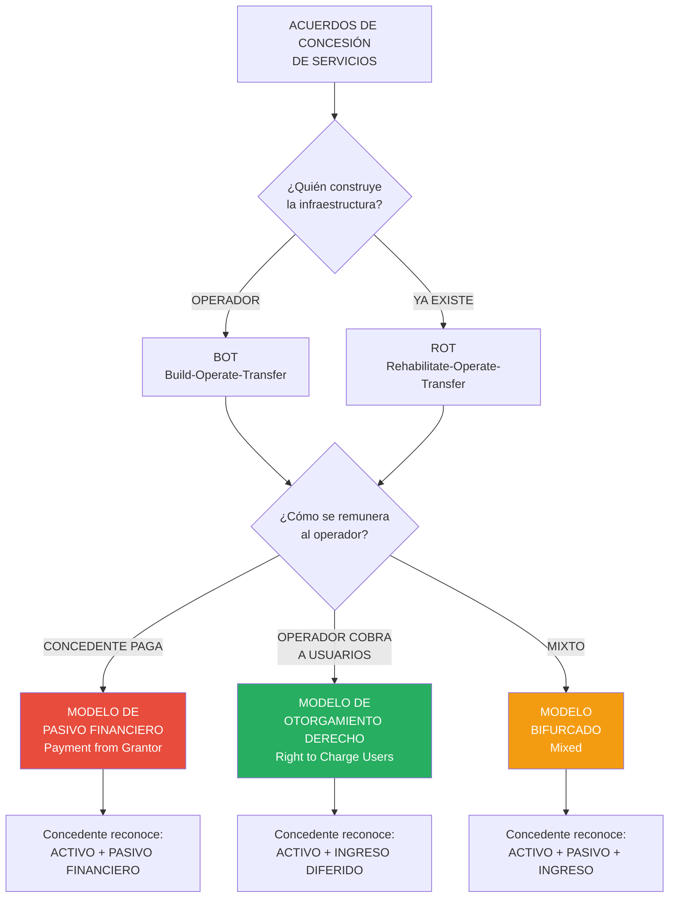
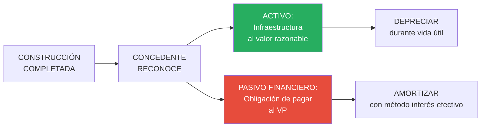
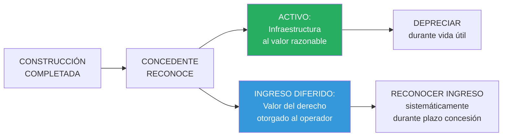

# IPSAS 32: Acuerdos de Concesión de Servicios (Concedente)

## Resumen

La IPSAS 32 establece el tratamiento contable desde la perspectiva del **concedente** (entidad pública) en acuerdos de concesión de servicios donde un operador privado construye, mejora, opera y/o mantiene infraestructura de servicio público (carreteras, puertos, hospitales, prisiones) durante un periodo a cambio del derecho a cobrar a usuarios o recibir pagos del concedente, requiriendo que el concedente reconozca el activo de infraestructura si controla o regula los servicios, los precios y retiene interés residual significativo, reconociendo simultáneamente un pasivo (si paga al operador) o ingreso diferido (si otorga derecho a cobro), y revelando información sobre naturaleza, términos significativos, derechos y obligaciones del acuerdo.

## Definición / Texto Normativo

**IPSAS 32 - Service Concession Arrangements: Grantor, Párrafo 7:**

> "Un **acuerdo de concesión de servicios** es un acuerdo vinculante entre un concedente y un operador en el que:
> (a) El **operador** usa el activo de concesión de servicios para prestar un servicio público en nombre del concedente por un periodo específico de tiempo; y
> (b) El **operador** es remunerado por sus servicios durante el periodo del acuerdo de concesión de servicios."

**IPSAS 32, Párrafo 9 - Alcance:**

> "Esta Norma se aplicará a los acuerdos de concesión de servicios si:
> (a) El **concedente controla o regula** qué servicios debe prestar el operador con el activo, a quién debe prestarlos y a qué precio; y
> (b) El concedente **controla** —a través de la propiedad, del derecho de usufructo u otro medio— cualquier **participación residual significativa** en el activo al final del plazo del acuerdo."

**IPSAS 32, Párrafo 11 - Reconocimiento del activo:**

> "El concedente reconocerá un **activo** proporcionado por el operador o una mejora a un activo existente cuando tenga el **acceso** al activo, es decir, cuando el activo esté **disponible para su uso**."

**IPSAS 32, Párrafo 12 - Reconocimiento de pasivo/ingreso:**

> "Cuando el concedente reconozca un activo, también reconocerá un **pasivo** o un **ingreso**, dependiendo de la naturaleza de la contraprestación transferida al operador."

**Definiciones clave (Párrafo 7):**

- **Concedente (Grantor):** Entidad del sector público que otorga el derecho al operador de prestar servicios públicos por un periodo específico.
- **Operador:** Entidad privada (o consorcio) que construye, opera, mantiene la infraestructura y presta servicios bajo el acuerdo.
- **Activo de concesión de servicios:** Infraestructura usada para prestar servicios públicos en un acuerdo de concesión (carreteras, puentes, hospitales, aeropuertos, prisiones, redes de agua/saneamiento, etc.).
- **Modelo de pasivo financiero:** Acuerdo donde el concedente tiene obligación incondicional de pagar efectivo u otro activo financiero al operador.
- **Modelo de otorgamiento de derecho (a cobrar a usuarios):** Acuerdo donde el operador recibe derecho a cobrar tarifas a usuarios, asumiendo riesgo de demanda.
- **Modelo bifurcado:** Combinación de ambos modelos anteriores.

## Desarrollo / Interpretación

### Tipos de Acuerdos de Concesión (APP/PPP)



**Siglas comunes:**

- **BOT:** Build-Operate-Transfer (Construir-Operar-Transferir)
- **BOOT:** Build-Own-Operate-Transfer
- **ROT:** Rehabilitate-Operate-Transfer
- **PPP:** Public-Private Partnership (Asociación Público-Privada)
- **APP:** Asociación Público-Privada (terminología peruana)

---

### Criterios de Aplicación de IPSAS 32

Para aplicar IPSAS 32, deben cumplirse **AMBOS** criterios del párrafo 9:

#### **Criterio 1: Control de servicios (Párrafo 9a)**

El concedente **controla o regula**:

- ✅ **Qué** servicios prestar (alcance, calidad)
- ✅ **A quién** prestar (beneficiarios: población general o segmento)
- ✅ **A qué precio** (tarifas, aunque pueden tener fórmulas de ajuste)

**Ejemplo que cumple criterio:**

**Concesión de carretera (Perú - Red Vial 5 Sur):**

- **Qué:** Operador debe mantener carretera en condiciones "buenas" según IRI (índice de rugosidad)
- **A quién:** Todos los vehículos que circulen por la vía
- **A qué precio:** Peaje fijado en contrato con ajuste automático por inflación (no discreción del operador)

**Ejemplo que NO cumple criterio:**

**Venta de terreno público a desarrollador privado:**

- Desarrollador construye y opera hotel en terreno
- Desarrollador decide: qué servicios ofrecer, a quién, a qué precio (libertad comercial)
- **Conclusión:** NO es acuerdo de concesión bajo IPSAS 32 (es venta de activo)

---

#### **Criterio 2: Interés residual significativo (Párrafo 9b)**

El concedente **controla** el activo al final del plazo mediante:

- ✅ **Propiedad legal** del activo (activo revierte automáticamente al concedente)
- ✅ **Derecho de usufructo** (concedente puede usar el activo sin compensar al operador)
- ✅ **Restricciones significativas** sobre venta/pignoración por el operador

**Prueba:** ¿El operador puede vender el activo a un tercero sin autorización del concedente? Si **NO** → Control residual del concedente.

**Ejemplo:**

**Concesión de aeropuerto (Lima - Jorge Chávez):**

- Operador invierte US$ 1,500 millones en nueva terminal
- Plazo: 30 años
- Al final: Toda la infraestructura pasa sin costo al Estado peruano
- Durante concesión: Operador NO puede vender terminal a otro inversionista
- **Conclusión:** ✅ Concedente tiene interés residual significativo → Aplica IPSAS 32

---

### Modelo de Pasivo Financiero (Payment from Grantor)

**Características:**

- Concedente tiene **obligación incondicional** de pagar efectivo al operador
- Pagos NO dependen del uso del activo por parte de usuarios (riesgo de demanda asumido por concedente)
- Pagos pueden ser: (a) Pagos fijos por disponibilidad, (b) Pagos por performance (cumplir estándares), (c) Combinación

**Reconocimiento contable:**



**Medición:**

**Activo:**

```
Valor razonable del activo de infraestructura a la fecha de disponibilidad
```

**Pasivo:**

```
Valor presente de las obligaciones de pago al operador
(descontados a tasa apropiada)
```

**Ejemplo numérico:**

**Gobierno Regional concesiona construcción y operación de hospital:**

**Términos del contrato:**

- Operador construye hospital (costo S/. 120 millones)
- Plazo operación: 20 años
- Remuneración: S/. 10 millones anuales por disponibilidad (hospital operativo según estándares)
- Al final: Hospital pasa al gobierno sin costo
- Tasa de descuento: 8%

**Fecha de disponibilidad (hospital completado - 01/01/2024):**

**Paso 1: Calcular valor razonable del activo**

Tasación profesional: **S/. 125 millones** (valor razonable al completarse)

**Paso 2: Calcular valor presente del pasivo**

```
Pagos: S/. 10 millones × 20 años = S/. 200 millones (nominal)
VP al 8%: PMT = 10,000,000, n = 20, i = 8%
VP = S/. 98.18 millones
```

**Paso 3: Asiento de reconocimiento inicial (01/01/2024)**

```
Infraestructura - Hospital (PPE)          125,000,000
    Pasivo Financiero - Concesión                 98,180,000
    Ingreso - Donación de Infraestructura         26,820,000

[Diferencia S/. 26.82 millones = exceso de valor razonable sobre obligación de pago]
```

**Explicación de la diferencia:**

El operador invirtió S/. 120 millones pero el gobierno solo pagará VP de S/. 98.18 millones. La diferencia representa:

- Retorno que el operador obtendrá de operar el hospital (ingresos por servicios médicos durante 20 años)
- Valor que el gobierno "recibe" sin pagar → Ingreso (similar a donación)

**Paso 4: Medición posterior**

**Año 1 (2024):**

**Depreciar activo:**

```
Vida útil: 40 años (vida útil del hospital, no plazo de concesión)
Depreciación anual = S/. 125,000,000 / 40 = S/. 3,125,000
```

**Amortizar pasivo (tabla):**

| Año  | Saldo inicial | Interés 8% | Pago       | Reducción pasivo | Saldo final |
| ---- | ------------- | ---------- | ---------- | ---------------- | ----------- |
| 2024 | 98,180,000    | 7,854,400  | 10,000,000 | 2,145,600        | 96,034,400  |
| 2025 | 96,034,400    | 7,682,752  | 10,000,000 | 2,317,248        | 93,717,152  |

**Asientos 2024:**

```
Gasto - Depreciación Hospital             3,125,000
    Depreciación Acumulada - Hospital            3,125,000

Pasivo Financiero - Concesión            10,000,000
    Banco                                        10,000,000
[Pago anual al operador]

Gasto - Interés sobre Concesión           7,854,400
    Pasivo Financiero - Concesión                7,854,400
[Ajustar para reconocer interés implícito]
```

**Presentación Estado de Gestión (2024):**

```
INGRESOS:
  Donación de Infraestructura            S/. 26,820,000 (solo 2024)

GASTOS:
  Depreciación Hospital                  S/.  3,125,000
  Interés sobre Concesión                S/.  7,854,400
  Total gastos concesión                 S/. 10,979,400
```

---

### Modelo de Otorgamiento de Derecho (Right to Charge Users)

**Características:**

- Operador recibe **derecho a cobrar tarifas a usuarios finales**
- Operador asume **riesgo de demanda** (si hay pocos usuarios, gana menos)
- Concedente NO tiene obligación de pago (salvo garantías de ingresos mínimos en algunos casos)

**Reconocimiento contable:**



**Medición:**

**Activo:**

```
Valor razonable del activo de infraestructura
```

**Ingreso diferido:**

```
= Valor razonable del activo

(El "pago" del operador es construir el activo; recibe a cambio el derecho a operar y cobrar)
```

**Reconocimiento del ingreso diferido:**

Generalmente de forma **lineal** durante el plazo de la concesión.

**Ejemplo numérico:**

**Municipalidad concesiona terminal terrestre:**

**Términos del contrato:**

- Operador construye terminal (valor razonable: S/. 45 millones)
- Plazo: 30 años
- Operador cobra: S/. 2 por boleto (tarifa fija) + arriendo de locales comerciales
- Concedente NO paga nada al operador
- Al final: Terminal revierte a municipalidad

**Fecha de disponibilidad (terminal completado - 01/01/2024):**

**Asiento de reconocimiento inicial:**

```
Infraestructura - Terminal Terrestre      45,000,000
    Ingreso Diferido - Concesión Terminal        45,000,000

[Reconocer activo e ingreso diferido por valor del derecho otorgado]
```

**Medición posterior:**

**Año 1 (2024):**

**Depreciar activo:**

```
Vida útil: 50 años (vida útil del edificio)
Depreciación anual = S/. 45,000,000 / 50 = S/. 900,000
```

**Reconocer ingreso (amortizar ingreso diferido):**

```
Reconocimiento lineal durante plazo concesión (30 años)
Ingreso anual = S/. 45,000,000 / 30 = S/. 1,500,000
```

**Asientos 2024:**

```
Gasto - Depreciación Terminal             900,000
    Depreciación Acumulada - Terminal            900,000

Ingreso Diferido - Concesión            1,500,000
    Ingreso - Concesión Terminal                 1,500,000

[Reconocer ingreso proporcionalmente durante plazo]
```

**Presentación Estado de Gestión (2024):**

```
INGRESOS:
  Ingreso - Concesión Terminal           S/. 1,500,000

GASTOS:
  Depreciación Terminal                  S/.   900,000

RESULTADO NETO (concesión):             S/.   600,000
```

**Análisis:**

Durante el plazo de la concesión, el concedente reconoce **más ingreso que gasto** (S/. 1.5M vs S/. 0.9M anual) porque:

- La vida útil del activo (50 años) es mayor que el plazo de la concesión (30 años)
- Al final de la concesión, el activo aún tiene valor en libros (40% de vida útil restante)

---

### Modelo Bifurcado (Mixed Model)

**Características:**

- **Combinación** de ambos modelos anteriores
- Operador recibe: (a) Derecho a cobrar a usuarios, PERO (b) También recibe pagos del concedente (garantía de ingresos mínimos, pagos por disponibilidad adicionales)

**Ejemplo:**

**Concesión de carretera con garantía de ingresos mínimos:**

- Operador cobra peaje a usuarios (riesgo de demanda)
- PERO: Si los ingresos por peaje < S/. 8 millones/año → Concedente paga la diferencia (garantía)
- Total valor razonable inversión: S/. 100 millones
- Valor presente de posibles pagos del concedente (garantía): S/. 25 millones
- Valor del derecho a cobrar peaje: S/. 75 millones (diferencia)

**Asiento de reconocimiento:**

```
Infraestructura - Carretera              100,000,000
    Pasivo Financiero - Garantía Concesión       25,000,000
    Ingreso Diferido - Derecho Peaje             75,000,000

[Separar componentes del acuerdo]
```

**Medición posterior:**

- **Pasivo financiero:** Amortizar con método de interés efectivo (cuando se paguen garantías)
- **Ingreso diferido:** Reconocer linealmente durante plazo de concesión

---

### Revelaciones Requeridas

**Información obligatoria (Párrafos 20-21):**

1. **Descripción del acuerdo:**
   - Naturaleza del servicio (carretera, hospital, puerto)
   - Términos significativos (plazo, forma de remuneración)
   - Renovaciones, opciones

2. **Términos de renegociación:**
   - Si hubo modificaciones significativas

3. **Derechos para usar activos especificados:**
   - Descripción de activos bajo concesión

4. **Obligaciones de prestar o derechos a recibir servicios:**
   - Servicios que el operador debe prestar
   - Estándares de calidad

5. **Obligaciones de entregar o derechos a recibir activos:**
   - Al final de la concesión

6. **Opciones de renovación y terminación:**
   - Condiciones de extensión o terminación anticipada

7. **Otros derechos y obligaciones:**
   - Garantías de ingresos
   - Penalidades por incumplimiento

8. **Cambios durante el periodo:**
   - Modificaciones al acuerdo

**Ejemplo de revelación:**

**Nota 13 - Acuerdos de Concesión de Servicios**

```
13.1 Descripción general:

La entidad tiene 3 acuerdos de concesión vigentes:

A. CARRETERA INTERREGIONAL (Red Vial 5 Sur)
   - Operador: Consorcio Vial del Sur S.A.
   - Objeto: Rehabilitación, operación y mantenimiento de 650 km de carretera
   - Plazo: 25 años (inicio: 2015, fin: 2040)
   - Modelo: Otorgamiento de derecho (operador cobra peaje a usuarios)
   - Valor del activo reconocido: S/. 2,500 millones
   - Ingreso diferido pendiente: S/. 1,625 millones (al 31/12/2024)

B. HOSPITAL REGIONAL
   - Operador: Salud Privada PPP S.A.C.
   - Objeto: Construcción, equipamiento y operación de hospital de 250 camas
   - Plazo: 20 años (inicio: 2024, fin: 2044)
   - Modelo: Pasivo financiero (gobierno paga S/. 10 millones/año por disponibilidad)
   - Valor del activo reconocido: S/. 125 millones (2024)
   - Pasivo financiero: S/. 96 millones (al 31/12/2024)

C. TERMINAL PORTUARIO
   - Operador: Puertos del Pacífico S.A.
   - Objeto: Ampliación y operación de muelle de contenedores
   - Plazo: 30 años (inicio: 2018, fin: 2048)
   - Modelo: Mixto (operador cobra tarifas + gobierno garantiza ingreso mínimo)
   - Valor del activo reconocido: S/. 450 millones
   - Pasivo financiero (garantía): S/. 35 millones
   - Ingreso diferido: S/. 320 millones (saldo al 31/12/2024)

13.2 Movimientos del año 2024:

Activos de infraestructura (concesiones):
  Saldo inicial                           S/. 2,950 millones
  Adiciones (Hospital - nuevo)            S/.   125 millones
  Depreciación                            S/.   (95) millones
  Saldo final                             S/. 2,980 millones

Pasivos financieros (concesiones):
  Saldo inicial                           S/.    40 millones
  Adiciones (Hospital)                    S/.    98 millones
  Pagos al operador                       S/.   (10) millones
  Interés devengado                       S/.     8 millones
  Saldo final                             S/.   136 millones

Ingresos diferidos (concesiones):
  Saldo inicial                           S/. 2,025 millones
  Reconocimiento como ingreso             S/.   (80) millones
  Saldo final                             S/. 1,945 millones

13.3 Desempeño de concesiones 2024:

Carretera: Tráfico promedio diario: 12,500 vehículos (dentro de proyección).
           IRI (rugosidad): 2.1 (cumple estándar <2.5). Sin penalidades.

Hospital: Disponibilidad: 98.5% (cumple estándar >95%). Pago completo realizado.

Terminal: Movimiento de carga: 850,000 TEUs (por debajo de garantía 900,000 TEUs).
          Gobierno activó garantía de ingreso mínimo: S/. 3.5 millones pagados.

13.4 Compromisos futuros:

Pagos anuales comprometidos (Hospital): S/. 10 millones × 19 años = S/. 190 millones (nominal)
Garantías potenciales (Terminal): hasta S/. 5 millones/año si movimiento <900,000 TEUs.
```

## Conexiones

- [[marco-conceptual-nicsp]] - Definición de activo (control), pasivo (obligación presente)
- [[base-devengado-sector-publico]] - Reconocer activo cuando disponible, no cuando se pague completamente
- [[diferencias-nicsp-niif]] - IPSAS 32 es única del sector público (no tiene equivalente en IFRS para concedente)
- [[contabilidad-gubernamental-peru]] - APP reguladas por Ley 1362, registro en SIAF
- [[ipsas-17-propiedad-planta-equipo|IPSAS 17]] - Infraestructura de concesión se trata como PPE
- [[unidad-II/ipsas-23-ingresos-sin-contraprestacion|IPSAS 23]] - Ingreso diferido en modelo de otorgamiento de derecho
- [[unidad-I/valor-presente-sector-publico|Valor Presente]] - Técnica clave para medir pasivo financiero

## Ejemplos Resueltos

### Ejemplo 1: Modelo de Pasivo Financiero - Construcción de Prisión (Intermedio)

**Situación:**
Ministerio de Justicia concesiona construcción y operación de centro penitenciario:

**Términos:**

- Operador construye prisión (capacidad 2,000 internos)
- Inversión estimada: S/. 180 millones
- Plazo operación: 25 años (inicio: 01/01/2024)
- Remuneración: S/. 15 millones anuales por disponibilidad (prisión operativa con servicios: alimentación, seguridad, salud básica)
- Tasa de descuento: 9%
- Al final: Prisión pasa al Estado sin costo
- Valor razonable al completarse: S/. 185 millones (tasación)

**Tarea:** Reconocer el acuerdo al inicio, calcular depreciación y gastos del primer año, preparar revelación básica.

---

**Solución:**

**Paso 1: Verificar aplicación de IPSAS 32**

✅ **Criterio 1 (Control servicios):**

- Ministerio define: capacidad (2,000), servicios (alimentación, salud), estándares
- **Cumple**

✅ **Criterio 2 (Interés residual):**

- Al final del plazo, prisión pasa al Estado (propiedad)
- **Cumple**

→ **Aplica IPSAS 32**

**Paso 2: Identificar modelo**

- Ministerio tiene **obligación incondicional de pagar** S/. 15 millones/año
- Pagos NO dependen de uso (número de internos)
- **Modelo: Pasivo Financiero**

**Paso 3: Calcular valor presente del pasivo**

```
Pagos: S/. 15 millones × 25 años = S/. 375 millones (nominal)
VP al 9%: PMT = 15,000,000, n = 25, i = 9%
VP = S/. 147.14 millones
```

**Paso 4: Asiento de reconocimiento inicial (01/01/2024)**

```
Infraestructura - Centro Penitenciario    185,000,000
    Pasivo Financiero - Concesión Prisión        147,140,000
    Ingreso - Donación Infraestructura            37,860,000

[Diferencia S/. 37.86 millones = exceso de valor sobre obligación]
```

**Explicación:** El operador invirtió S/. 180M pero el valor razonable es S/. 185M, y el gobierno solo pagará VP de S/. 147.14M. La diferencia representa valor que el gobierno recibe sin pagar (el operador obtiene retorno de operar la prisión, no solo de los pagos del gobierno).

**Paso 5: Calcular depreciación (año 2024)**

```
Vida útil edificio: 50 años
Depreciación anual = S/. 185,000,000 / 50 = S/. 3,700,000
```

**Paso 6: Calcular interés sobre pasivo (año 2024)**

```
Saldo inicial: S/. 147,140,000
Interés 9%: S/. 13,242,600
Pago: S/. 15,000,000
Reducción pasivo: S/. 1,757,400
Saldo final: S/. 145,382,600
```

**Paso 7: Asientos contables 2024**

```
Gasto - Depreciación Infraestructura      3,700,000
    Depreciación Acumulada - Prisión             3,700,000

Pasivo Financiero - Concesión            15,000,000
    Banco                                        15,000,000
[Pago anual al operador]

Gasto - Interés sobre Concesión          13,242,600
    Pasivo Financiero - Concesión                13,242,600
[Reconocer interés implícito]
```

**Paso 8: Presentación Estados Financieros (31/12/2024)**

**Estado de Situación Financiera:**

```
ACTIVOS NO CORRIENTES:
  Infraestructura - Centro Penitenciario  S/. 185,000,000
  Menos: Depreciación Acumulada           S/.  (3,700,000)
  Valor neto                              S/. 181,300,000

PASIVOS NO CORRIENTES:
  Pasivo Financiero - Concesión Prisión   S/. 145,382,600
```

**Estado de Gestión (2024):**

```
INGRESOS:
  Donación Infraestructura                S/. 37,860,000 (solo año 1)

GASTOS:
  Depreciación Infraestructura            S/.  3,700,000
  Interés sobre Concesión                 S/. 13,242,600
  Total gastos concesión                  S/. 16,942,600

RESULTADO NETO (año 1):                   S/. 20,917,400
```

**Paso 9: Revelación básica**

```
Nota 13 - Concesión Centro Penitenciario:

Objeto: Construcción, equipamiento y operación de prisión (2,000 internos).
Operador: Consorcio Seguridad Penitenciaria S.A.
Plazo: 25 años (2024-2049).
Modelo: Pasivo financiero (pago anual S/. 15 millones por disponibilidad).
Activo reconocido: S/. 185 millones (valor razonable al completarse).
Pasivo: S/. 145.4 millones al 31/12/2024 (S/. 147.1M inicial menos pago S/. 1.76M capital).

Desempeño 2024: Disponibilidad 99.2% (cumple estándar >95%). Pago completo efectuado.

Compromisos futuros: Pagos anuales S/. 15 millones × 24 años restantes = S/. 360 millones (nominal).
```

---

### Ejemplo 2: Modelo de Otorgamiento de Derecho - Aeropuerto Regional (Avanzado)

**Situación:**
Gobierno Regional concesiona aeropuerto existente para ampliación y operación:

**Situación inicial:**

- Aeropuerto existente (terminal antigua): Valor en libros S/. 25 millones (depreciación acumulada S/. 15 millones, costo original S/. 40 millones)

**Términos de la concesión:**

- Operador invierte S/. 95 millones en: (a) Nueva terminal (S/. 70M), (b) Mejoras pista (S/. 25M)
- Plazo: 30 años (inicio: 01/01/2024)
- Operador cobra: Tarifa por pasajero (TUUA) + arriendos comerciales
- Gobierno NO paga nada al operador (asume riesgo de demanda)
- Al final: Toda la infraestructura (antigua + nueva) revierte al gobierno
- Valor razonable de la inversión nueva: S/. 100 millones

**Tarea:**

1. Registrar la transferencia del aeropuerto existente al operador
2. Reconocer la inversión nueva del operador
3. Calcular depreciación y reconocimiento de ingreso año 1
4. Preparar revelación

---

**Solución:**

**Paso 1: Verificar aplicación de IPSAS 32**

✅ **Criterio 1:** Gobierno regula servicios aeroportuarios, tarifas (TUUA fijada en contrato)
✅ **Criterio 2:** Al final, infraestructura revierte al gobierno
→ **Aplica IPSAS 32**

**Modelo:** Otorgamiento de derecho (operador cobra a usuarios)

---

**Paso 2: Dar de baja el aeropuerto existente (01/01/2024)**

El aeropuerto existente deja de estar bajo control directo del gobierno durante la concesión.

```
Depreciación Acumulada - Aeropuerto Antiguo   15,000,000
Ingreso Diferido - Concesión Aeropuerto       25,000,000
    Infraestructura - Aeropuerto Antiguo              40,000,000

[Dar de baja activo existente; reconocer ingreso diferido por valor cedido al operador]
```

**Explicación:** El valor en libros del aeropuerto antiguo (S/. 25M) se reconoce como ingreso diferido porque representa el valor que el gobierno "entrega" al operador como parte del acuerdo.

---

**Paso 3: Reconocer inversión nueva del operador (fecha de disponibilidad - 01/07/2024, asumiendo 6 meses construcción)**

```
Infraestructura - Aeropuerto (Nueva Terminal)  70,000,000
Infraestructura - Aeropuerto (Mejoras Pista)   30,000,000
    Ingreso Diferido - Concesión Aeropuerto           100,000,000

[Reconocer activos nuevos al valor razonable e ingreso diferido correspondiente]
```

**Total ingreso diferido al 01/07/2024:**

```
Aeropuerto antiguo:  S/. 25,000,000
Inversión nueva:     S/. 100,000,000
TOTAL:               S/. 125,000,000
```

---

**Paso 4: Calcular depreciación 2024**

**Terminal nueva:**

```
Vida útil: 40 años
Depreciación anual: S/. 70,000,000 / 40 = S/. 1,750,000
Depreciación 2024 (6 meses desde 01/07): S/. 875,000
```

**Mejoras pista:**

```
Vida útil: 25 años
Depreciación anual: S/. 30,000,000 / 25 = S/. 1,200,000
Depreciación 2024 (6 meses): S/. 600,000
```

**Total depreciación 2024:** S/. 1,475,000

**Nota:** Aeropuerto antiguo NO se deprecia durante concesión (no está en balance del concedente).

---

**Paso 5: Reconocer ingreso (amortizar ingreso diferido)**

**Método:** Lineal durante plazo de concesión (30 años)

**Cálculo anual:**

```
S/. 125,000,000 / 30 años = S/. 4,166,667 por año completo
```

**2024 (6 meses desde 01/07):**

```
S/. 4,166,667 × 6/12 = S/. 2,083,333
```

**Asiento 2024:**

```
Ingreso Diferido - Concesión Aeropuerto   2,083,333
    Ingreso - Concesión Aeropuerto                2,083,333

[Reconocer proporción de ingreso correspondiente a 2024]
```

---

**Paso 6: Presentación Estados Financieros (31/12/2024)**

**Estado de Situación Financiera:**

```
ACTIVOS NO CORRIENTES:
  Infraestructura - Aeropuerto (Terminal)  S/. 70,000,000
  Infraestructura - Aeropuerto (Pista)     S/. 30,000,000
  Total costo                              S/. 100,000,000
  Menos: Depreciación Acumulada            S/.  (1,475,000)
  Valor neto                               S/.  98,525,000

PASIVOS NO CORRIENTES:
  Ingreso Diferido - Concesión Aeropuerto  S/. 122,916,667
  [S/. 125M inicial - S/. 2.083M reconocido]
```

**Estado de Gestión (2024):**

```
INGRESOS:
  Concesión Aeropuerto                     S/.  2,083,333

GASTOS:
  Depreciación Infraestructura             S/.  1,475,000

RESULTADO NETO (concesión):                S/.    608,333
```

---

**Paso 7: Revelación**

```
Nota 13 - Concesión Aeropuerto Regional:

Objeto: Ampliación, mejoramiento y operación de aeropuerto regional.
Operador: Aeropuertos del Norte S.A.C.
Plazo: 30 años (2024-2054).
Modelo: Otorgamiento de derecho (operador cobra TUUA y arriendos).

Inversión del operador (2024):
  - Nueva terminal de pasajeros: S/. 70 millones
  - Mejoras pista de aterrizaje: S/. 30 millones
  - Total: S/. 100 millones (valor razonable)

Activo transferido al operador:
  - Terminal antigua (valor en libros): S/. 25 millones

Tratamiento contable:
  - Activo reconocido: S/. 100 millones (nueva inversión)
  - Ingreso diferido: S/. 125 millones (S/. 100M + S/. 25M terminal antigua)
  - Reconocimiento: Lineal en 30 años (S/. 4.17 millones/año)

Movimiento de concesionados 2024:
  - Pasajeros: 850,000 (inicio operaciones julio 2024 - 6 meses)
  - Proyección año completo 2025: 1.8 millones pasajeros

Desempeño 2024:
  - Disponibilidad: 100% (terminal operativa desde 01/07/2024)
  - Cumplimiento estándares OACI: 98.5%
```

---

## Ejercicios Propuestos

### Ejercicio 1: Identificación y Reconocimiento Básico (Básico)

**Escenario:**
Gobierno Regional evalúa 3 contratos para determinar si son acuerdos de concesión bajo IPSAS 32:

**CONTRATO A: Red de fibra óptica**

- Operador instala 500 km de fibra óptica (inversión S/. 80 millones)
- Plazo: 20 años
- Operador vende servicios de internet/telefonía a ciudadanos (precios de mercado, no regulados por gobierno)
- Al final: Fibra óptica pasa al gobierno

**CONTRATO B: Edificio administrativo**

- Operador construye edificio de oficinas (S/. 60 millones)
- Plazo: 25 años
- Gobierno paga S/. 5 millones/año por uso exclusivo del edificio
- Al final: Edificio pasa al gobierno

**CONTRATO C: Estadio municipal**

- Operador rehabilita estadio existente (inversión S/. 35 millones)
- Plazo: 15 años
- Operador organiza eventos deportivos/conciertos y cobra entradas (tarifas reguladas por municipalidad)
- Municipalidad retiene 10% de ingresos por entradas
- Al final: Estadio revierte a municipalidad

**Tarea:**

1. Para cada contrato, evalúa si cumple los 2 criterios de IPSAS 32 (control servicios + interés residual)
2. Determina si aplica IPSAS 32 o no (justifica)
3. Para contratos que SÍ aplican: Identifica el modelo (pasivo financiero, otorgamiento derecho, o mixto)
4. Para el CONTRATO B (asumiendo que aplica): Prepara el asiento de reconocimiento inicial si el VP de los pagos es S/. 48 millones y el valor razonable del edificio es S/. 60 millones

---

### Ejercicio 2: Modelo Bifurcado - Carretera con Garantía (Intermedio)

**Escenario:**
Ministerio de Transportes concesiona carretera:

**Términos:**

- Operador rehabilita 380 km de carretera (inversión S/. 520 millones)
- Valor razonable al completarse: S/. 550 millones
- Plazo: 25 años (inicio: 01/01/2024)
- **Remuneración mixta:**
  - Operador cobra peaje a usuarios (tarifa fija: S/. 8 por vehículo ligero)
  - **PERO:** Gobierno garantiza ingreso mínimo de S/. 18 millones/año
    - Si ingresos por peaje < S/. 18M → Gobierno paga diferencia
    - Si ingresos por peaje ≥ S/. 18M → Gobierno no paga nada
- Tasa de descuento: 8%

**Análisis de riesgos (proyección operador):**

- Años 1-5: Tráfico bajo, ingresos proyectados S/. 12M/año → Requerirá S/. 6M/año del gobierno
- Años 6-25: Tráfico alto, ingresos proyectados S/. 25M/año → No requerirá pagos del gobierno

**VP de posibles pagos del gobierno:**

```
S/. 6M × 5 años, descontado al 8% = S/. 23.96 millones
```

**Tarea:**

1. Identifica el modelo (mixto)
2. Separa los componentes: (a) Pasivo financiero, (b) Otorgamiento de derecho
3. Prepara asiento de reconocimiento inicial (01/01/2024)
4. Calcula depreciación año 1 (vida útil carretera: 25 años - coincidir con plazo concesión)
5. Calcula reconocimiento de ingreso diferido año 1
6. Asume que en 2024 los ingresos por peaje fueron S/. 11 millones. Calcula y registra el pago de garantía del gobierno
7. Presenta Estado de Gestión 2024 (solo sección concesión)

---

### Ejercicio 3: Caso Integral - Portfolio de Concesiones (Avanzado)

**Escenario:**
Gobierno Regional tiene 4 acuerdos de concesión vigentes al 01/01/2024:

**A. HOSPITAL (Modelo: Pasivo Financiero)**

- Reconocido: 2020 por S/. 200 millones (vida útil 50 años)
- Depreciación acumulada: S/. 16 millones (4 años × S/. 4M)
- Pasivo financiero: S/. 175 millones
- Pago anual: S/. 18 millones (próximos 16 años)
- Tasa: 8%
- **Evento 2024:** Renegociación - Gobierno acepta reducir pago anual a S/. 16 millones pero extender plazo 5 años adicionales (21 años total restante)

**B. TERMINAL TERRESTRE (Modelo: Otorgamiento Derecho)**

- Reconocido: 2019 por S/. 60 millones (vida útil 40 años, plazo concesión 30 años)
- Depreciación acumulada: S/. 7.5 millones (5 años × S/. 1.5M)
- Ingreso diferido: S/. 50 millones (saldo al 31/12/2023)

**C. PUERTO (Modelo: Mixto - EN CONSTRUCCIÓN)**

- Operador inicia construcción 01/04/2024
- Completará: 31/12/2024 (9 meses)
- Inversión estimada: S/. 380 millones (valor razonable proyectado: S/. 400 millones)
- Plazo: 30 años (desde 01/01/2025)
- Remuneración: Operador cobra tarifas + Gobierno paga S/. 8 millones/año por servicios logísticos
- VP pagos gobierno (30 años al 9%): S/. 82 millones

**D. CARRETERA (Modelo: Pasivo Financiero - ANTIGUA, FINALIZANDO)**

- Plazo original: 20 años (2005-2025)
- Al 31/12/2024 solo resta 1 año de concesión
- Valor en libros: S/. 15 millones (depreciación acumulada S/. 285M, costo S/. 300M)
- Pasivo financiero: S/. 12 millones (último pago S/. 13M en 2025)

**Tarea (2,500 palabras):**

1. **Modificación contrato Hospital (A):**
   - Calcula el nuevo VP del pasivo (S/. 16M × 21 años al 8%)
   - Determina ajuste necesario (nuevo VP vs S/. 175M actual)
   - Prepara asiento de modificación
   - Recalcula tabla de amortización año 2024

2. **Operaciones normales Terminal (B):**
   - Calcula depreciación 2024
   - Calcula reconocimiento de ingreso diferido 2024
   - Prepara asientos

3. **Reconocimiento Puerto (C):**
   - Fecha de reconocimiento: 31/12/2024 (disponibilidad)
   - Separa componentes: Pasivo financiero (S/. 82M) vs Otorgamiento derecho (S/. 318M)
   - Prepara asiento de reconocimiento inicial
   - NO calcular depreciación 2024 (entra en operación 2025)

4. **Cierre Carretera (D):**
   - Confirma que valor en libros y pasivo se liquidarán en 2025
   - Registra depreciación 2024 (último año completo)
   - Registra pago anual 2024 y ajuste de interés

5. **Estados Financieros Consolidados (31/12/2024):**
   - Prepara conciliación de activos de infraestructura (concesiones)
   - Prepara conciliación de pasivos financieros (concesiones)
   - Prepara conciliación de ingresos diferidos
   - Estado de Situación Financiera (sección concesiones)
   - Estado de Gestión 2024 (ingresos y gastos de concesiones)

6. **Revelación (Nota 13):**
   - Descripción de cada acuerdo
   - Eventos significativos 2024 (modificación Hospital, nuevo Puerto)
   - Compromisos futuros (pagos próximos 5 años)

7. **Análisis crítico:**
   - Evalúa: ¿La renegociación del Hospital fue beneficiosa para el gobierno? (compara valor presente antes/después)
   - Identifica 3 riesgos en la gestión de este portfolio de concesiones
   - Propón 2 mejoras al sistema de monitoreo de APP

## Preguntas Bloom

**Nivel 1 - Recordar:** Define "acuerdo de concesión de servicios" según IPSAS 32. Enumera los 2 criterios que deben cumplirse para aplicar IPSAS 32.

**Nivel 2 - Comprender:** Explica la diferencia entre el "modelo de pasivo financiero" y el "modelo de otorgamiento de derecho" en acuerdos de concesión. ¿Cómo determina el concedente cuál modelo aplicar? Proporciona un ejemplo de cada uno.

**Nivel 3 - Aplicar:** Un gobierno concesiona construcción de puerto (inversión S/. 350 millones, valor razonable S/. 370 millones). El operador cobra tarifas a usuarios. Plazo: 30 años. Aplica IPSAS 32 para: (a) Identificar el modelo, (b) Registrar el reconocimiento inicial, (c) Calcular depreciación año 1 (vida útil 50 años), (d) Calcular reconocimiento de ingreso diferido año 1.

**Nivel 4 - Analizar:** Compara el impacto en los estados financieros del concedente bajo ambos modelos (pasivo financiero vs otorgamiento derecho) para un acuerdo con valor razonable de S/. 100 millones y plazo de 25 años. Analiza: (a) Reconocimiento inicial (activo, pasivo/ingreso diferido), (b) Patrón de gastos e ingresos en años siguientes, (c) Impacto en ratios financieros (apalancamiento, resultados). Proporciona ejemplo numérico.

**Nivel 5 - Evaluar:** Un gobierno regional tiene 8 concesiones de infraestructura (carreteras, hospitales, prisiones) por valor total de S/. 2,500 millones en activos reconocidos, pero solo S/. 800 millones en pasivos financieros. El contralor regional argumenta: "Hemos recibido S/. 2,500M en infraestructura pero solo pagaremos S/. 800M. Esto es muy beneficioso para el gobierno, estamos obteniendo infraestructura 'gratis'." Evalúa este argumento considerando: (a) Naturaleza de APP (transferencia de riesgo/retorno), (b) Ingreso diferido (S/. 1,700M), (c) Costo de oportunidad (¿qué pasaría si gobierno construyera directamente?), (d) Transparencia fiscal. ¿El contralor tiene razón?

**Nivel 6 - Crear:** Diseña una "Guía de Evaluación de APP" para entidades públicas peruanas que ayude a: (1) Determinar si un contrato es acuerdo de concesión bajo IPSAS 32, (2) Identificar el modelo contable apropiado, (3) Calcular reconocimiento inicial (activo, pasivo/ingreso diferido), (4) Establecer controles internos para monitoreo de APP, (5) Integrar con presupuesto y límites de endeudamiento (Ley 30850), (6) Preparar revelaciones completas. Incluye: Flujogramas de decisión, ejemplos numéricos, checklist de documentación, integración SIAF. Extensión: 2,000 palabras.

## Base Normativa

**Norma IPSASB:**

1. **IPSAS 32 - Service Concession Arrangements: Grantor (emitida 2011, vigente desde 2014).** Texto completo define alcance, reconocimiento, medición y revelaciones desde perspectiva del concedente.
   - Párrafos clave: 7-9 (definición y alcance), 11-14 (reconocimiento), 15-19 (medición), 20-21 (revelaciones)
   - Disponible en: www.ipsasb.org/publications/ipsas-32-service-concession-arrangements-grantor

**Normas relacionadas:** 2. **IFRIC 12 - Service Concession Arrangements (IFRS).** Trata la perspectiva del **operador** (no concedente). IPSAS 32 complementa IFRIC 12 cubriendo la contraparte pública. 3. **IPSAS 17 - Property, Plant and Equipment.** Infraestructura de concesión se trata como PPE. 4. **IPSAS 23 - Revenue from Non-Exchange Transactions.** Fundamento del ingreso diferido en modelo de otorgamiento de derecho. 5. **IPSAS 29 - Financial Instruments: Recognition and Measurement.** Medición de pasivos financieros en concesiones.

**Guías de implementación:** 6. **IPSASB Implementation Guidance for IPSAS 32** (2011). Ejemplos de modelos, cálculos de VP, separación de componentes.

**Normativa Peruana:** 7. **Decreto Legislativo N° 1362** - "Ley que regula la Promoción de la Inversión Privada mediante Asociaciones Público Privadas y Proyectos en Activos" 8. **Ley N° 30850** - "Ley de Fortalecimiento de APP": Límites de endeudamiento, transparencia fiscal. 9. **Plan Contable Gubernamental 2019 (actualizado) - Clases 1, 4 y 7:**

- 13X - Infraestructura (concesiones)
- 47X - Pasivos financieros (concesiones)
- 49X - Ingresos diferidos (concesiones)

10. **MEF - ProInversión:** "Guía Contable para APP bajo NICSP" (2020)

**Literatura técnica:** 11. Acerete, B., Stafford, A., & Stapleton, P. (2011). "Spanish Healthcare Public Private Partnerships: The 'Alzira Model'". _Critical Perspectives on Accounting_, 22(6), 533-549. 12. Grimsey, D., & Lewis, M. K. (2005). "Are Public Private Partnerships Value for Money? Evaluating Alternative Approaches". _Accounting Forum_, 29(4), 345-378.

## Referencias Bibliográficas y Recursos en Línea

**Textos oficiales:**

- **IPSASB:** www.ipsasb.org/publications/ipsas-32-service-concession-arrangements-grantor
  - Texto completo IPSAS 32 (inglés)
  - Bases for Conclusions (BC)
  - Implementation Guidance (IG)

**Recursos en español:**

- **IFAC:** www.ifac.org/knowledge-gateway
  - IPSAS 32 en español (traducción oficial)
- **MEF - Contaduría Perú:** www.mef.gob.pe/es/contabilidad-publica
  - Guía contable APP
  - Directiva de aplicación IPSAS 32
- **ProInversión:** www.proinversion.gob.pe
  - Cartera de proyectos APP
  - Contratos modelo

**Herramientas prácticas:**

- **Calculadora VP de concesiones:** (Excel con escenarios pasivo financiero/otorgamiento derecho)
- **Checklist IPSAS 32:** ¿Aplica la norma? (flujograma 2 criterios)

**Casos de estudio:**

- **España:** Casos de APP hospitalarias (Modelo Alzira)
- **Chile:** Concesiones viales (rutas interurbanas)
- **UK PFI:** Escuelas, hospitales, prisiones (Private Finance Initiative)
- **Perú:** Línea 2 Metro de Lima, Aeropuerto Jorge Chávez

## Notas y Alertas

> **⚠️ Error Común:** Confundir acuerdo de concesión con "venta de infraestructura". **Regla:** En IPSAS 32, el concedente **SIEMPRE reconoce el activo** (nunca lo vende), porque retiene control de servicios e interés residual. Si el operador tiene libertad total sobre uso/precio/beneficiarios → NO es concesión, es venta.

> **💡 Diferencia con Arrendamiento (IPSAS 43):** En arrendamiento, el arrendatario reconoce activo por **derecho de uso** (no el activo subyacente completo). En concesión, el **concedente reconoce el activo completo de infraestructura** (propiedad/control). Son perspectivas opuestas.

> **📊 Indicador Fiscal - Deuda Pública:** Bajo Ley 30850, los **pasivos financieros de APP** cuentan para el límite de endeudamiento público. Esto generó resistencia inicial a IPSAS 32 porque "aumenta la deuda contable". Sin embargo, representa mayor transparencia fiscal (las obligaciones siempre existieron, ahora son visibles).

> **🌍 Contexto Perú - APP en Crecimiento:** Perú tiene ~140 APP vigentes (cartera US$ 50 mil millones aprox., según ProInversión 2024). Principales sectores: Transporte (carreteras, metro), salud (hospitales), educación (colegios), saneamiento, prisiones. IPSAS 32 es crítica para transparencia fiscal.

> **⚙️ Integración SIAF:** MEF implementó módulo específico "APP-NICSP" en SIAF que: (1) Registra contratos de APP, (2) Calcula VP de pasivos, (3) Genera tablas de amortización, (4) Crea asientos automáticos, (5) Prepara revelaciones. Requiere ingresar: términos del contrato, cronograma de pagos, tasas de descuento.

> **🔍 Riesgo de Subestimación de Pasivos:** Si la tasa de descuento usada es muy alta (ej. 12% en vez de 8%), el VP del pasivo financiero será artificialmente bajo, subestimando obligaciones. Contraloría recomienda usar tasas conservadoras (bonos soberanos + prima de riesgo APP).

> **📖 Para Profundizar:** Si te interesa el debate sobre si APP realmente generan "valor por dinero" (value for money) vs solo transferir costos futuros, consulta: Grimsey, D., & Lewis, M. K. (2005). "Are Public Private Partnerships Value for Money? Evaluating Alternative Approaches". _Accounting Forum_, 29(4), 345-378.

---

<div style="text-align: center;">
<a href="https://notbyai.fyi">

</a>
</div>
