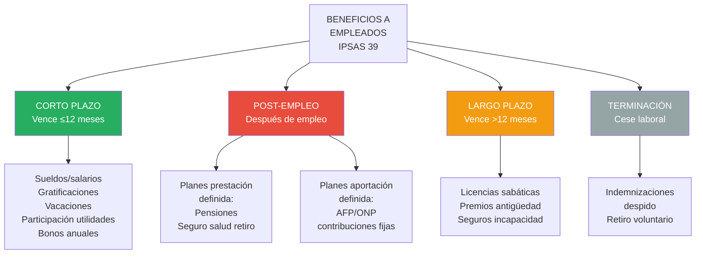

# IPSAS 39: Beneficios a Empleados

## Resumen

La IPSAS 39 prescribe el tratamiento contable de beneficios a empleados (todas las formas de retribución), clasificándolos en corto plazo (vacaciones, gratificaciones), post-empleo (pensiones, seguros de vida), largo plazo (licencias sabáticas) y por terminación (indemnizaciones), requiriendo reconocer pasivo (provisión) cuando el empleado presta servicio, medición actuarial para beneficios post-empleo de prestación definida (método de crédito unitario proyectado), aplicándose a entidades del sector público con sistemas de pensiones, CTS, vacaciones y gratificaciones.

## Definición / Texto Normativo

**IPSAS 39 - Employee Benefits, Párrafo 8:**

> "Los **beneficios a empleados** comprenden todas las formas de retribución pagadas, por pagar o proporcionadas por una entidad, o en nombre de la misma, a cambio de servicios prestados a la entidad por los empleados o por la terminación del empleo."

**IPSAS 39, Párrafo 8 - Clasificación:**

> "Esta Norma clasifica los beneficios a los empleados en cuatro categorías:
>
> (a) **Beneficios a corto plazo a los empleados**, que son los beneficios (diferentes de los beneficios por terminación) cuyo pago será atendido en el término de los doce meses siguientes al cierre del periodo en el cual los empleados han prestado sus servicios;
>
> (b) **Beneficios post-empleo**, que son los beneficios (diferentes de los beneficios por terminación) que se pagan después de completar el periodo de empleo;
>
> (c) **Otros beneficios a largo plazo para los empleados**, que son beneficios a los empleados (diferentes de los beneficios post-empleo y de los beneficios por terminación) cuyo pago no vence dentro de los doce meses siguientes al cierre del periodo en el cual los empleados han prestado los servicios correspondientes; y
>
> (d) **Beneficios por terminación**, que son los beneficios por pagar a los empleados como consecuencia de: (i) la decisión de una entidad de resolver el contrato de un empleado antes de la edad normal de retiro; o (ii) la decisión de un empleado de aceptar voluntariamente la conclusión de la relación de trabajo a cambio de tales beneficios."

**IPSAS 39, Párrafo 11 - Reconocimiento general:**

> "Una entidad debe reconocer el **costo** de los beneficios a corto plazo a los empleados cuando el empleado haya prestado el servicio a la entidad a cambio de tales beneficios."

**IPSAS 39, Párrafo 52 - Beneficios post-empleo (planes de prestación definida):**

> "Para los planes de **prestación definida**, la entidad deberá:
>
> (a) determinar el **déficit o superávit**;
> (b) determinar el importe del **pasivo (activo) por beneficios definidos neto** como el importe del déficit o superávit ajustado por cualquier efecto del límite del activo;
> (c) determinar los importes a reconocer en el **superávit o déficit**; y
> (d) determinar las revaluaciones del **pasivo (activo) por beneficios definidos neto** que se reconocerán en activos/pasivos netos."

**IPSAS 39, Párrafo 67 - Método de medición:**

> "Una entidad deberá usar la **técnica del valor presente actuarial** para medir sus obligaciones por beneficios definidos y el costo correspondiente en el periodo corriente, empleando el **método de la unidad de crédito proyectada**."

## Desarrollo / Interpretación

### Clasificación de Beneficios a Empleados



---

### 1. Beneficios a Corto Plazo

**Características:**

- Vencen ≤ 12 meses después del servicio
- Medición simple: Monto no descontado

**Tratamiento contable (párrafo 11):**

```
Cuando el empleado presta servicio:

Gasto - Beneficio                         XXX
    Pasivo - Beneficio por Pagar              XXX

Cuando se paga:

Pasivo - Beneficio por Pagar              XXX
    Banco                                     XXX
```

---

#### **Ejemplo 1: Vacaciones no tomadas**

**Situación:**
Al 31/12/2024, ministerio tiene 150 empleados con 380 días de vacaciones acumuladas no tomadas.

**Cálculo:**

```
Remuneración diaria promedio: S/. 180
Provisión vacaciones = 380 días × S/. 180 = S/. 68,400
```

**Asiento:**

```
Gasto - Vacaciones                         68,400
    Provisión Vacaciones por Pagar              68,400
```

**Clasificación:** Pasivo corriente (se espera pagar en próximos 12 meses).

---

#### **Ejemplo 2: Gratificaciones legales (Perú)**

**Situación:**
Entidad pública peruana tiene 200 empleados. Planilla mensual: S/. 1,800,000.

**Obligación legal:** 2 gratificaciones anuales (julio y diciembre = 1 sueldo cada una).

**Mensualmente (acumulación):**

```
Provisión mensual = (S/. 1,800,000 × 2 gratificaciones) / 12 meses
                  = S/. 300,000/mes

Gasto - Gratificaciones                   300,000
    Provisión Gratificaciones                   300,000
```

**Julio/Diciembre (pago):**

```
Provisión Gratificaciones               1,800,000
    Banco                                     1,800,000
```

---

### 2. Beneficios Post-Empleo

**Dos tipos de planes:**

#### **A. Planes de Aportación Definida**

**Característica:** Entidad paga contribuciones fijas a fondo separado (AFP, fondo pensiones). NO hay obligación adicional.

**Tratamiento:** Reconocer gasto cuando empleado presta servicio.

**Ejemplo:**

```
Planilla mensual: S/. 2,000,000
Contribución empleador AFP: 0.75% → S/. 15,000

Gasto - Aportes AFP                        15,000
    Banco (pago a AFP)                          15,000

[NO hay pasivo en balance de entidad después de pagar]
```

---

#### **B. Planes de Prestación Definida** ← **MÁS COMPLEJO**

**Característica:** Entidad promete beneficio específico al retiro (ej. pensión = 80% del último sueldo).

**Riesgo:** Entidad asume riesgo actuarial (longevidad, inflación, rendimiento inversiones).

**Método:** **Unidad de crédito proyectada** (Projected Unit Credit Method - PUC).

---

##### **Método de Unidad de Crédito Proyectada (Explicación Simplificada)**

**Pasos:**

1. **Estimar beneficio total al retiro** (ej. pensión vitalicia)
2. **Atribuir proporción a cada año de servicio** (crédito unitario)
3. **Proyectar salarios futuros** (inflación salarial)
4. **Descontar flujos futuros** a valor presente (tasa de descuento: bonos gubernamentales alta calidad)
5. **Reconocer pasivo** = VP de obligación acumulada a la fecha

**Componentes del costo (párrafo 120):**

```
Reconocer en RESULTADOS (superávit/déficit):
  - Costo del servicio corriente
  - Costo del servicio pasado (si hay mejoras al plan)
  - Costo por intereses (desenrolado del pasivo)

Reconocer en PATRIMONIO (activos/pasivos netos):
  - Ganancias/pérdidas actuariales (revaluaciones)
  - Rendimiento de activos del plan (excepto intereses)
```

---

**Ejemplo simplificado:**

**Datos:**

- Empleado A: Edad 40 años, salario actual S/. 8,000/mes
- Edad de retiro: 65 años (faltan 25 años)
- Beneficio prometido: Pensión = 2% × años servicio × salario final
- Años servicio al retiro: 30 (ya trabajó 5)
- Salario final estimado (proyectado): S/. 15,000/mes
- Pensión anual estimada: 2% × 30 años × S/. 15,000 × 12 = S/. 108,000/año
- Expectativa vida al retiro: 20 años
- Tasa descuento: 6%

**Cálculo actuarial (muy simplificado):**

```
1. Beneficio total al retiro:
   VP de pensión S/. 108,000/año × 20 años al 6% = S/. 1,238,647

2. Proporción ganada a la fecha:
   Años trabajados / Total años = 5 / 30 = 16.67%

3. Obligación presente:
   S/. 1,238,647 × 16.67% = S/. 206,485 (aproximado)

4. Descontar a hoy (faltan 25 años al retiro):
   VP = S/. 206,485 / (1.06)^25 = S/. 48,131

Pasivo reconocido al 31/12/2024: S/. 48,131
```

**Asiento:**

```
Gasto - Costo Servicio Pensiones          48,131
    Pasivo Beneficios Definidos - Pensiones    48,131
```

**Nota:** En la práctica, actuarios profesionales realizan estos cálculos con modelos sofisticados.

---

### 3. Otros Beneficios a Largo Plazo

**Ejemplos:** Licencias sabáticas (cada 7 años), premios por antigüedad.

**Tratamiento:** Similar a beneficios definidos post-empleo, pero más simple (reconocer TODAS las revaluaciones actuariales en resultados, no en patrimonio).

**Ejemplo:**

```
Empleados con derecho a licencia sabática remunerada (3 meses cada 7 años):
  - 50 empleados cercanos a cumplir 7 años
  - Costo estimado (actuarial): S/. 420,000

Gasto - Beneficios Largo Plazo            420,000
    Provisión Licencias Sabáticas               420,000
```

---

### 4. Beneficios por Terminación

**Situación:** Entidad decide despedir empleados (restructuración) o empleado acepta retiro voluntario.

**Reconocimiento (párrafo 159):** Cuando entidad **no puede retirar** la oferta de beneficio o **reconoce costos de restructuración** (lo que ocurra primero).

**Ejemplo:**

```
Ministerio ofrece retiro voluntario a 30 empleados (reducción presupuesto):
  - Indemnización promedio: S/. 35,000 c/u
  - Total: S/. 1,050,000
  - Comunicación formal: 15/12/2024
  - Plazo aceptación: 31/01/2025

Asiento (31/12/2024):
  Gasto - Beneficios Terminación        1,050,000
      Provisión Beneficios Terminación        1,050,000

[Reconocer cuando se comunica oferta irrevocable]
```

---

### Revelaciones Clave (Párrafos 141-152)

**Para planes de prestación definida (beneficios post-empleo):**

1. **Descripción del plan:** Tipo, beneficios, riesgos
2. **Movimiento de pasivo/activo neto:**
   - Saldo inicial
   - Costo servicio corriente
   - Intereses
   - Contribuciones pagadas
   - Beneficios pagados
   - Revaluaciones actuariales
   - Saldo final
3. **Supuestos actuariales:**
   - Tasa de descuento
   - Tasa inflación salarial
   - Tasa mortalidad
   - Edad retiro
4. **Análisis de sensibilidad:** Impacto de cambios en supuestos clave
5. **Activos del plan:** Composición, valor razonable
6. **Duración promedio** de la obligación

**Ejemplo de revelación:**

**Nota 20 - Beneficios a Empleados - Pensiones:**

```
20.1 Descripción del plan:
La entidad opera plan de pensiones de prestación definida para empleados públicos
nombrados. El beneficio es 2.5% del salario final por cada año de servicio, pagadero
mensualmente desde la jubilación (65 años) hasta el fallecimiento. El plan no está
fondeado (beneficios pagados directamente por entidad).

20.2 Pasivo en balance (al 31/12/2024):

Valor presente obligación por beneficios      S/. 185,400,000
Menos: Valor razonable activos del plan       S/.           0
Pasivo neto por beneficios definidos          S/. 185,400,000

20.3 Movimiento del pasivo (2024):

Saldo inicial (01/01/2024)                    S/. 172,300,000
  Costo servicio corriente                    S/.  12,800,000
  Costo por intereses (6%)                    S/.  10,338,000
  Beneficios pagados (pensionistas)           S/. (9,450,000)
  Pérdida actuarial (cambio supuestos)        S/.  (588,000)
Saldo final (31/12/2024)                      S/. 185,400,000

20.4 Gastos reconocidos (2024):

En resultados (superávit/déficit):
  Costo servicio corriente                    S/.  12,800,000
  Costo por intereses                         S/.  10,338,000
  Total en resultados                         S/.  23,138,000

En patrimonio (activos/pasivos netos):
  Pérdida actuarial                           S/.    (588,000)

20.5 Supuestos actuariales principales:

Tasa de descuento:                            6.0% anual
Tasa inflación salarial:                      3.5% anual
Tabla mortalidad:                             SPP-2017 (Perú)
Edad retiro:                                  65 años

20.6 Análisis de sensibilidad:

Si tasa descuento fuera 5.5% (no 6.0%):       S/. 197,200,000 (+6.4%)
Si tasa inflación salarial fuera 4.0% (no 3.5%): S/. 191,800,000 (+3.5%)
Si expectativa vida aumentara 1 año:          S/. 189,600,000 (+2.3%)

20.7 Proyección flujos:

Beneficios esperados próximos 10 años:
  2025: S/. 9,800,000
  2026: S/. 10,400,000
  ...
  2034: S/. 15,200,000

Duración promedio obligación: 12.4 años.
```

## Conexiones

- [[unidad-I/marco-conceptual-nicsp|Marco Conceptual]] - Pasivo = obligación presente de transferir recursos
- [[unidad-I/base-devengado|Base de Devengado]] - Reconocer gasto cuando empleado presta servicio, no al pagar
- [[ipsas-19-provisiones|IPSAS 19]] - Beneficios empleados son provisiones (pasivos de cuantía/vencimiento incierto)
- [[unidad-I/valor-presente-sector-publico|Valor Presente]] - Beneficios largo plazo se descuentan
- [[unidad-I/diferencias-nicsp-niif|Diferencias NICSP-NIIF]] - IPSAS 39 basada en IAS 19
- [[unidad-I/contabilidad-gubernamental-peru|Contabilidad Perú]] - CTS, gratificaciones, ONP en sector público peruano

## Ejemplos Resueltos

### Ejemplo 1: Beneficios Corto Plazo - Caso Integral Perú (Intermedio)

**Situación:**
Hospital público (200 empleados) al 31/12/2024:

**Planilla mensual:** S/. 1,500,000

**Beneficios a provisionar:**

1. **Gratificaciones legales:** 2 por año (julio y diciembre)
2. **Vacaciones acumuladas:** 420 días no tomados (remuneración diaria promedio S/. 200)
3. **CTS (Compensación Tiempo Servicios):** Depósito semestral (mayo y noviembre = 1 sueldo/año)
4. **Bonificación extraordinaria:** Aprobada por directorio S/. 300,000 (pagadera marzo 2025)

**Tarea:** Calcular provisiones, registrar asientos (31/12/2024), presentar pasivos corrientes.

---

**Solución:**

**1. Gratificaciones:**

**Julio 2024:** Ya pagada (no hay pasivo)
**Diciembre 2024:** Pagada en diciembre (no hay pasivo al 31/12)
**Provisión para 2025:** Acumular para próximas 2 gratificaciones

```
Provisión mensual = (S/. 1,500,000 × 2) / 12 = S/. 250,000/mes
Al 31/12/2024: 1 mes acumulado = S/. 250,000

Asiento:
  Gasto - Gratificaciones                  250,000
      Provisión Gratificaciones                  250,000
```

---

**2. Vacaciones acumuladas:**

```
420 días × S/. 200 = S/. 84,000

Asiento:
  Gasto - Vacaciones                        84,000
      Provisión Vacaciones                       84,000
```

---

**3. CTS:**

**Mayo 2024:** Pagada (depositada bancos)
**Noviembre 2024:** Pagada
**Provisión para 2025:** Acumular próximos depósitos (mayo y nov 2025 = 1 sueldo total/año)

```
Provisión mensual = S/. 1,500,000 / 12 = S/. 125,000/mes
Al 31/12/2024: 1 mes acumulado = S/. 125,000

Asiento:
  Gasto - CTS                              125,000
      Provisión CTS                              125,000
```

---

**4. Bonificación extraordinaria:**

```
Aprobada formalmente (directorio) → Obligación presente

Asiento:
  Gasto - Bonificación Extraordinaria      300,000
      Provisión Bonificación                     300,000
```

---

**Pasivos Corrientes al 31/12/2024:**

```
Provisión Gratificaciones                 S/.  250,000
Provisión Vacaciones                      S/.   84,000
Provisión CTS                             S/.  125,000
Provisión Bonificación Extraordinaria     S/.  300,000
                                          ------------
TOTAL Pasivos Corrientes - Beneficios     S/.  759,000
```

**Estado de Gestión (2024 - gastos):**

```
Gasto - Gratificaciones                   S/.  250,000
Gasto - Vacaciones                        S/.   84,000
Gasto - CTS                               S/.  125,000
Gasto - Bonificación Extraordinaria       S/.  300,000
TOTAL Gastos Beneficios (provisión)       S/.  759,000

[Más: Sueldos pagados durante el año, gratificaciones jul/dic pagadas, CTS may/nov pagadas]
```

---

### Ejemplo 2: Plan Pensiones Prestación Definida - Movimiento Anual (Avanzado)

**Situación:**
Ministerio tiene plan de pensiones de prestación definida (no fondeado):

**Datos al 01/01/2024:**

- Valor presente obligación (VPO): S/. 450,000,000
- Activos del plan: S/. 0 (plan no fondeado)
- Pasivo neto: S/. 450,000,000

**Durante 2024:**

- Costo servicio corriente (calculado por actuario): S/. 28,500,000
- Tasa de descuento: 6.5%
- Beneficios pagados a pensionistas: S/. 32,000,000

**31/12/2024:**

- Actuario realiza nueva valuación:
  - Nueva VPO (antes de ajustar por lo anterior): S/. 475,250,000
  - Pérdida actuarial (cambio en supuestos mortalidad): S/. 4,200,000

**Tarea:**

1. Calcula costo por intereses
2. Calcula VPO final
3. Registra asientos del año
4. Presenta movimiento de pasivo
5. Presenta revelación

---

**Solución:**

**Paso 1: Costo por intereses (desenrolado)**

```
Intereses = VPO inicial × Tasa descuento
         = S/. 450,000,000 × 6.5%
         = S/. 29,250,000
```

---

**Paso 2: VPO esperada al final (antes de revaluación actuarial)**

```
VPO esperada = VPO inicial + Costo servicio + Intereses - Beneficios pagados
             = S/. 450,000,000 + S/. 28,500,000 + S/. 29,250,000 - S/. 32,000,000
             = S/. 475,750,000
```

---

**Paso 3: Pérdida actuarial (revaluación)**

```
VPO real (actuario): S/. 475,250,000
VPO esperada: S/. 475,750,000
Ganancia actuarial = S/. 475,250,000 - S/. 475,750,000 = -S/. 500,000 (ganancia)

PERO actuario reporta pérdida S/. 4,200,000 por cambio supuestos mortalidad.

Reconciliación:
  Ganancia por experiencia: S/. 500,000
  Pérdida por cambio supuestos: S/. 4,200,000
  Pérdida actuarial neta: S/. 3,700,000

VPO final = S/. 475,750,000 + S/. 3,700,000 = S/. 479,450,000
```

---

**Paso 4: Asientos 2024**

**a) Costo servicio corriente:**

```
Gasto - Costo Servicio Pensiones          28,500,000
    Pasivo Beneficios Definidos - Pensiones   28,500,000
```

**b) Costo por intereses:**

```
Gasto Financiero - Intereses Pensiones    29,250,000
    Pasivo Beneficios Definidos - Pensiones   29,250,000
```

**c) Beneficios pagados:**

```
Pasivo Beneficios Definidos - Pensiones   32,000,000
    Banco                                      32,000,000
```

**d) Pérdida actuarial (reconocer en PATRIMONIO):**

```
Activos/Pasivos Netos - Pérdida Actuarial  3,700,000
    Pasivo Beneficios Definidos - Pensiones    3,700,000
```

---

**Paso 5: Movimiento de Pasivo**

```
Pasivo Beneficios Definidos - Pensiones:

Saldo inicial (01/01/2024)                S/. 450,000,000
  + Costo servicio corriente              S/.  28,500,000
  + Costo por intereses                   S/.  29,250,000
  - Beneficios pagados                    S/. (32,000,000)
  + Pérdida actuarial                     S/.   3,700,000
Saldo final (31/12/2024)                  S/. 479,450,000
```

---

**Paso 6: Revelación**

**Nota 20 - Beneficios a Empleados - Pensiones (31/12/2024):**

```
20.1 Descripción:
Plan de pensiones de prestación definida para empleados públicos. Beneficio: 2.5%
salario final × años servicio. Edad retiro: 65 años. Plan NO fondeado (beneficios
pagados directamente por el Ministerio desde presupuesto).

20.2 Pasivo en balance:

Valor presente obligación                 S/. 479,450,000
Menos: Activos del plan                   S/.           0
Pasivo neto                               S/. 479,450,000

Clasificación: Pasivo no corriente (vencimiento promedio >12 meses).

20.3 Movimiento 2024:

Saldo inicial                             S/. 450,000,000
  Costo servicio corriente                S/.  28,500,000
  Costo por intereses (6.5%)              S/.  29,250,000
  Beneficios pagados                      S/. (32,000,000)
  Pérdida actuarial                       S/.   3,700,000
Saldo final                               S/. 479,450,000

20.4 Gastos reconocidos:

En resultados (déficit del periodo):
  Costo servicio corriente                S/.  28,500,000
  Costo por intereses                     S/.  29,250,000
  Total en resultados                     S/.  57,750,000

En patrimonio (activos/pasivos netos):
  Pérdida actuarial                       S/.   3,700,000

20.5 Supuestos actuariales:

Tasa de descuento:                        6.5% anual
Inflación salarial:                       3.2% anual
Tabla mortalidad:                         SPP-2017
Edad retiro promedio:                     65 años

20.6 Cambios en supuestos 2024:
Durante 2024 se actualizó tabla de mortalidad (mayor expectativa de vida), resultando
en pérdida actuarial de S/. 4,200,000. Este efecto fue parcialmente compensado por
ganancia de experiencia (menor inflación salarial real) de S/. 500,000.

20.7 Análisis de sensibilidad:

Si tasa descuento fuera 6.0% (no 6.5%):   S/. 502,800,000 (+4.9%)
Si inflación salarial fuera 3.7% (no 3.2%): S/. 491,300,000 (+2.5%)
Si expectativa vida aumentara 1 año:      S/. 487,900,000 (+1.8%)

20.8 Flujos proyectados (próximos 5 años):

2025: S/. 33,500,000
2026: S/. 35,200,000
2027: S/. 37,100,000
2028: S/. 39,200,000
2029: S/. 41,400,000

Duración promedio obligación: 11.8 años.

20.9 Riesgo:
El principal riesgo es longevidad (pensionistas viven más de lo estimado) y riesgo
inflacionario (salarios crecen más de lo proyectado). El plan no está fondeado,
por lo que depende totalmente de asignación presupuestal futura.
```

## Ejercicios Propuestos

### Ejercicio 1: Beneficios Corto Plazo - Múltiples Conceptos (Básico)

Universidad Nacional (300 empleados) al 31/12/2024:

**Planilla mensual:** S/. 2,400,000

**Beneficios a calcular:**

1. **Gratificaciones:** 2 por año (¿provisión al 31/12?)
2. **Vacaciones no tomadas:** 550 días acumulados (sueldo diario promedio S/. 250)
3. **Bonificación desempeño:** Aprobada S/. 480,000 (pagadera feb-2025)
4. **CTS:** Depósitos semestrales (¿provisión al 31/12?)

**Tarea:**

1. Calcula provisión para cada concepto
2. Registra asientos (31/12/2024)
3. Presenta pasivos corrientes (beneficios empleados)
4. Si no se hubieran provisionado, ¿qué impacto tendría en resultados 2025?

---

### Ejercicio 2: Beneficios por Terminación - Reestructuración (Intermedio)

Ministerio decide cerrar dirección regional (decisión formal 20/12/2024):

**Empleados afectados:** 45
**Indemnizaciones ofrecidas:**

- 20 empleados (antigüedad 5-10 años): S/. 25,000 c/u
- 15 empleados (antigüedad 11-15 años): S/. 40,000 c/u
- 10 empleados (antigüedad >15 años): S/. 60,000 c/u

**Comunicación:** 22/12/2024 (oferta irrevocable)
**Pago:** Marzo 2025

**Tarea:**

1. Determina si existe obligación presente al 31/12/2024 (IPSAS 39 párrafo 159)
2. Calcula provisión total
3. Registra asiento (31/12/2024)
4. Clasifica pasivo (corriente/no corriente)
5. Prepara revelación (Nota 20 - Beneficios Terminación)

---

### Ejercicio 3: Plan Pensiones - Ciclo Completo con Supuestos (Avanzado)

**Situación:**
Gobierno Regional administra plan pensiones prestación definida:

**Datos al 01/01/2024:**

- Empleados activos: 800
- Pensionistas: 320
- VPO: S/. 280,000,000
- Activos del plan (inversiones): S/. 180,000,000
- Pasivo neto: S/. 100,000,000

**Datos actuariales 2024:**

- Costo servicio corriente: S/. 18,200,000
- Tasa de descuento: 7%
- Rendimiento esperado activos: 8%

**Operaciones 2024:**

- Contribuciones entidad al fondo: S/. 22,000,000
- Beneficios pagados (desde fondo): S/. 24,500,000
- Rendimiento real activos: S/. 15,800,000 (8.8%)

**31/12/2024 (nueva valuación actuarial):**

- Nueva VPO: S/. 312,400,000 (incluye pérdida actuarial S/. 6,300,000 por cambio tasa inflación salarial)
- Activos fondo: S/. 193,300,000

**Tarea (2,500 palabras):**

1. **Calcula componentes del costo 2024:**
   - Costo servicio corriente
   - Intereses sobre VPO
   - Rendimiento esperado activos

2. **Movimiento de VPO:**
   - Saldo inicial
   - - Costo servicio + Intereses
   - - Beneficios pagados
   - - Pérdida actuarial
   - = Saldo final (debe cuadrar con S/. 312,400,000)

3. **Movimiento de Activos del Plan:**
   - Saldo inicial
   - - Contribuciones + Rendimiento real
   - - Beneficios pagados
   - = Saldo final (debe cuadrar con S/. 193,300,000)

4. **Pasivo Neto final:**
   - VPO - Activos del plan

5. **Revaluaciones (reconocer en patrimonio):**
   - Pérdida actuarial VPO
   - Ganancia por rendimiento activos superior a esperado

6. **Asientos 2024:**
   - Costo servicio
   - Intereses netos (interés VPO - rendimiento esperado activos)
   - Contribuciones al fondo
   - Revaluaciones (patrimonio)

7. **Estados Financieros:**
   - Balance: Pasivo neto
   - Resultados: Gastos por pensiones
   - Patrimonio: Revaluaciones

8. **Revelación (Nota 20):**
   - Descripción plan
   - Movimientos VPO y activos
   - Supuestos actuariales
   - Composición activos fondo (si disponible)
   - Análisis sensibilidad (tasa descuento ±0.5%, inflación ±0.3%)
   - Proyección flujos 10 años

9. **Análisis crítico:**
   - ¿El plan está bien fondeado? (ratio activos/VPO)
   - ¿Cuántos años de beneficios cubre el fondo actual?
   - Riesgo principal: ¿Longevidad, inflación, o rendimiento inversiones?

## Preguntas Bloom

**Nivel 1 - Recordar:** Define las 4 categorías de beneficios a empleados según IPSAS 39. Enumera 2 ejemplos de cada categoría en sector público peruano.

**Nivel 2 - Comprender:** Explica la diferencia entre plan de "aportación definida" y plan de "prestación definida". ¿Cuál genera mayor riesgo para el empleador? ¿Por qué?

**Nivel 3 - Aplicar:** Hospital tiene 180 empleados con 450 días vacaciones acumuladas (sueldo diario promedio S/. 220). Aplica IPSAS 39: (a) Calcula provisión, (b) Registra asiento, (c) Clasifica en balance.

**Nivel 4 - Analizar:** Compara el impacto en estados financieros de: (a) Plan aportación definida (AFP 0.75% planilla), (b) Plan prestación definida (pensión 80% salario final, no fondeado). Analiza: Pasivo en balance, gasto anual, riesgo para entidad, revelaciones. Usa ejemplo planilla S/. 10,000,000/mes, 500 empleados.

**Nivel 5 - Evaluar:** Un ministerio con plan pensiones no fondeado (pasivo S/. 850,000,000) argumenta: "No deberíamos reconocer este pasivo porque los pagos futuros dependen de apropiaciones presupuestales futuras (no tenemos recursos hoy)." Evalúa este argumento desde: (a) Definición de pasivo (Marco Conceptual), (b) Representación fiel, (c) Transparencia fiscal. ¿Qué requiere IPSAS 39?

**Nivel 6 - Crear:** Diseña un "Sistema de Gestión de Beneficios a Empleados" para entidades del sector público peruano integrando: (1) Planilla (sueldos, gratificaciones, CTS), (2) Control vacaciones (días acumulados, provisión), (3) Planes pensiones (valuación actuarial, movimientos), (4) Beneficios terminación (reestructuraciones), (5) Registro contable SIAF, (6) Revelaciones automáticas (Nota 20), (7) Proyecciones presupuestales. Incluye: Roles (RRHH, contabilidad, actuarios), procesos, reportes, KPIs (ratio fondeo pensiones, días vacaciones promedio). Extensión: 2,000 palabras.

## Base Normativa

**Norma IPSASB:**

1. **IPSAS 39 - Employee Benefits (emitida 2016, vigente desde 2018).** Reemplazó IPSAS 25. Define beneficios empleados, clasificación, medición, revelaciones.
   - Párrafos clave: 8 (clasificación), 11-22 (corto plazo), 52-147 (post-empleo), 148-157 (largo plazo), 158-170 (terminación), 171-191 (revelaciones)
   - Disponible: www.ipsasb.org/publications/ipsas-39-employee-benefits

**Normas relacionadas:** 2. **IAS 19 - Employee Benefits (IFRS).** Base de IPSAS 39 (muy similar). 3. **IPSAS 19 - Provisions.** Beneficios empleados son provisiones (pasivos inciertos). 4. **IPSAS 1 - Presentation.** Clasificación corriente/no corriente de pasivos por beneficios.

**Normativa Peruana:** 5. **Decreto Legislativo N° 728:** Ley de Productividad y Competitividad Laboral (CTS, gratificaciones). 6. **Decreto Ley N° 19990:** Sistema Nacional de Pensiones (ONP) - Sector público. 7. **Plan Contable Gubernamental 2019:**

- 41 - Remuneraciones por pagar
- 47 - Beneficios a empleados
- 471 - Beneficios post-empleo

**Literatura técnica:** 8. Blake, D. (2006). _Pension Economics_. John Wiley & Sons. (Economía de pensiones, valuación actuarial)

## Referencias Bibliográficas y Recursos en Línea

**Textos oficiales:**

- **IPSASB:** www.ipsasb.org/publications/ipsas-39-employee-benefits

**Recursos español:**

- **IFAC:** Traducción IPSAS 39

**Herramientas:**

- **Calculadora actuarial:** Modelos VP obligaciones pensiones
- **Tablas mortalidad:** SPP-2017 (Perú)

**Casos:**

- **Reino Unido:** National Audit Office - Public sector pensions accounting

## Notas y Alertas

> **⚠️ Error Común:** No provisionar vacaciones acumuladas ("se pagarán cuando las tomen"). **Regla:** IPSAS 39 requiere provisión cuando empleado gana el derecho (base devengado), independiente de cuándo las tome.

> **💡 Planes Prestación Definida - Actuarios:** Valuación actuarial requiere profesionales certificados (Actuarios). No intentar cálculos complejos sin asesoría técnica (supuestos demográficos, financieros, métodos).

> **📊 Pasivo Pensiones - Transparencia Fiscal:** Muchos gobiernos tienen pasivos pensiones no fondeados gigantescos (no visibles en balance pre-IPSAS). IPSAS 39 obliga reconocerlos → Mayor transparencia → Presión reformas.

> **🔍 Gratificaciones Perú - Acumulación:** En Perú (DL 728), gratificaciones se pagan julio y diciembre. Aunque se pagan en esos meses, deben acumularse mensualmente (1/12 por mes) para reflejar devengo del servicio.

> **⚙️ Integración SIAF (Perú):** Módulo "Planilla" integra con contabilidad para provisiones automáticas (vacaciones, gratificaciones, CTS). Pendiente: Módulo actuarial para pensiones (valuación, proyecciones).

> **📖 Para Profundizar:** Debate sobre reconocimiento ganancias/pérdidas actuariales (¿resultados o patrimonio?): Blake, D. (2006). _Pension Economics_. John Wiley & Sons, Cap. 8.

---

<div style="text-align: center;">
<a href="https://notbyai.fyi">

</a>
</div>
