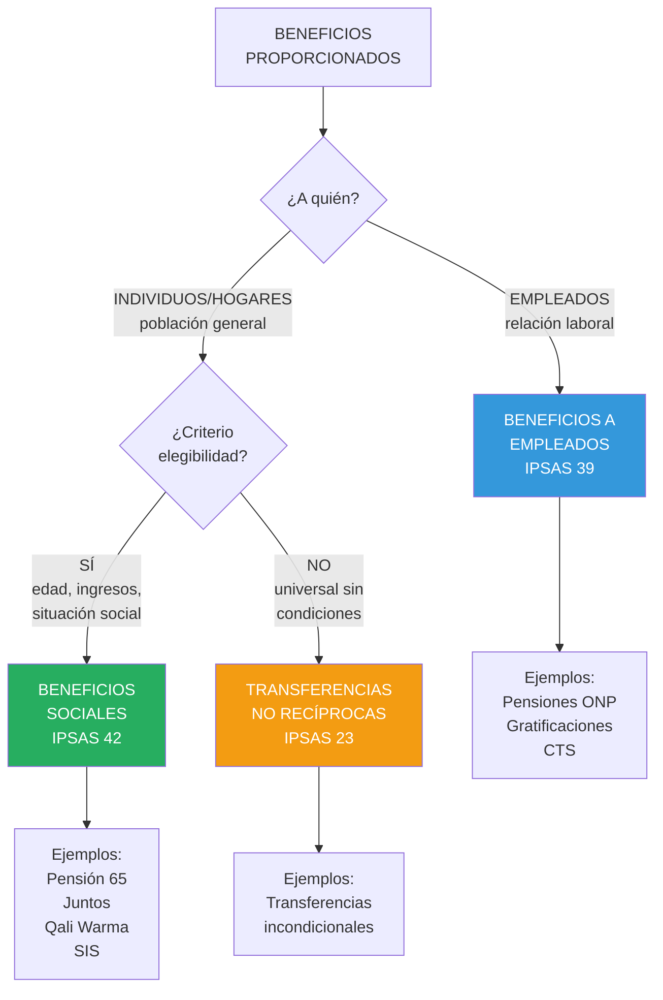
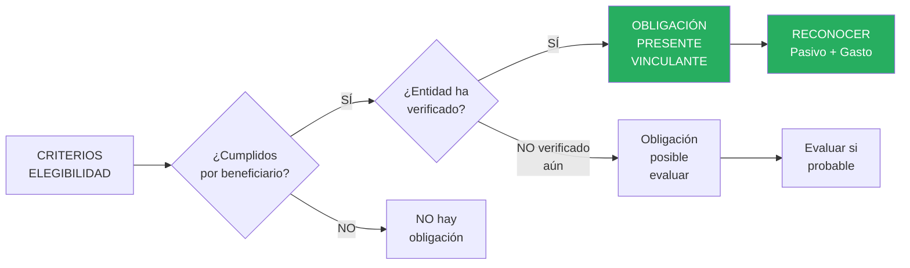

# IPSAS 42: Beneficios Sociales

## Resumen

La IPSAS 42 establece el tratamiento contable de beneficios sociales proporcionados por el gobierno a individuos/hogares que califican bajo criterios de elegibilidad (sin contraprestación directa), distinguiéndolos de beneficios a empleados (IPSAS 39), requiriendo reconocer gasto y pasivo cuando el gobierno tiene obligación presente vinculante de transferir recursos (generalmente al cumplirse criterios de elegibilidad), aplicándose a programas sociales masivos del sector público como pensiones no contributivas, asignaciones familiares, subsidios vivienda, prestaciones desempleo y salud universal.

## Definición / Texto Normativo

**IPSAS 42 - Social Benefits, Párrafo 5:**

> "**Beneficios sociales** son en efectivo transferencias pagaderas a individuos específicos y/o hogares para mitigar el efecto de **riesgos sociales**."

**IPSAS 42, Párrafo 5 - Riesgos sociales:**

> "**Riesgos sociales** son eventos o circunstancias que pueden afectar adversamente el bienestar de los individuos o hogares, ya sea imponiéndoles demandas adicionales sobre sus recursos o reduciendo sus ingresos. Los riesgos sociales incluyen, pero no se limitan a: edad avanzada, discapacidad, muerte de sostén de familia, desempleo, maternidad, costos de crianza de hijos, enfermedad y escasez de vivienda adecuada y asequible."

**IPSAS 42, Párrafo 16 - Reconocimiento:**

> "Una entidad deberá reconocer un **pasivo por beneficios sociales** cuando, como resultado del cumplimiento por parte de individuos y/o hogares de los **criterios de elegibilidad**, la entidad tiene una **obligación presente vinculante** de transferir efectivo u otros recursos económicos."

**IPSAS 42, Párrafo 17 - Momento del reconocimiento:**

> "El momento del reconocimiento del pasivo y el correspondiente gasto depende de la naturaleza de la legislación/esquema que otorga los beneficios sociales y los **criterios de elegibilidad** especificados."

**IPSAS 42, Párrafo 27 - Medición:**

> "Un pasivo por beneficios sociales se medirá al **mejor estimado** del monto requerido para liquidar la obligación presente al final del periodo sobre el que se informa."

**IPSAS 42, Párrafo 29 - Valor presente:**

> "Cuando el efecto del valor temporal del dinero es **material**, el pasivo se medirá al **valor presente** de los montos requeridos para liquidar la obligación."

## Desarrollo / Interpretación

### Alcance: Beneficios Sociales vs Beneficios a Empleados



**Ejemplos en sector público peruano:**

| Programa                         | Riesgo Social         | Criterios Elegibilidad                     | Norma    |
| -------------------------------- | --------------------- | ------------------------------------------ | -------- |
| Pensión 65                       | Pobreza + Vejez       | Edad ≥65 años + Pobreza extrema            | IPSAS 42 |
| Juntos                           | Pobreza + Maternidad  | Madres con niños <5 años + Pobreza         | IPSAS 42 |
| Qali Warma                       | Desnutrición infantil | Niños en escuelas públicas                 | IPSAS 42 |
| SIS (Seguro Integral Salud)      | Enfermedad + Pobreza  | Sin seguro + Pobreza                       | IPSAS 42 |
| Bono Familiar Habitacional       | Vivienda inadecuada   | Familia sin vivienda + Ingresos <S/. 3,000 | IPSAS 42 |
| Pensión ONP (empleados públicos) | Vejez                 | Empleado público, años aportación          | IPSAS 39 |

---

### Criterios de Reconocimiento (Obligación Presente Vinculante)

**IPSAS 42 párrafo 16:** Reconocer pasivo cuando existe **obligación presente vinculante**.

**¿Cuándo existe obligación vinculante?**



---

### Tipos de Beneficios Sociales y Momento de Reconocimiento

#### **1. Beneficios Periódicos (Recurrentes)**

**Ejemplo:** Pensión 65 (transferencia mensual S/. 250)

**Reconocimiento:** **Periodo por periodo** (mes a mes)

**Razón:** Cada mes se genera nueva obligación al cumplirse criterios (beneficiario vivo, elegible).

**Asiento mensual:**

```
Gasto - Beneficio Social Pensión 65       XXX
    Pasivo - Beneficios Sociales por Pagar    XXX
```

---

#### **2. Beneficios de Pago Único (Una sola vez)**

**Ejemplo:** Bono Familia Habitacional (S/. 30,000 por familia)

**Reconocimiento:** Cuando se **aprueba solicitud** (entidad verifica criterios y autoriza pago).

**Antes de aprobación:** NO pasivo (posible, pero no confirmado)
**Después de aprobación:** SÍ pasivo (obligación vinculante)

**Asiento (cuando se aprueba):**

```
Gasto - Beneficio Social Vivienda          30,000
    Pasivo - Beneficios Sociales por Pagar     30,000
```

---

#### **3. Beneficios en Especie (No monetarios)**

**Ejemplo:** Qali Warma (alimentación escolar)

**Reconocimiento:** Cuando se **entrega el servicio/bien** (niño asiste a escuela y recibe alimento).

**Razón:** Obligación se materializa al proveer el servicio.

**Asiento (por lote entregado):**

```
Gasto - Beneficio Social Alimentación      XXX
    Inventario - Alimentos Qali Warma          XXX
```

**Nota:** Si el programa usa contratista (proveedor externo), se reconoce cuando el contratista entrega.

---

### Medición del Pasivo

**IPSAS 42 párrafo 27:** Mejor estimado del monto a transferir.

#### **Beneficios Corto Plazo (≤12 meses):**

```
Pasivo = Monto nominal a pagar
```

**Ejemplo:**

```
Pensión 65 - Diciembre 2024:
  Beneficiarios activos: 580,000
  Monto mensual: S/. 250

Pasivo al 31/12 (si aún no se paga dic):
  580,000 × S/. 250 = S/. 145,000,000
```

---

#### **Beneficios Largo Plazo (>12 meses):**

```
Pasivo = Valor Presente de flujos futuros esperados
```

**Aplica cuando:** El beneficiario califica hoy para serie de pagos futuros.

**Ejemplo (raro en beneficios sociales, más común en IPSAS 39):**

```
Si Pensión 65 se otorgara "de por vida" desde aprobación:
  - Beneficiario 65 años
  - Expectativa vida: 15 años
  - Pago mensual: S/. 250
  - Flujo total: S/. 250 × 12 × 15 = S/. 45,000
  - VP (descontado al 6%): S/. 29,350 (aproximado)

Pasivo inicial = S/. 29,350

PERO: En práctica, Pensión 65 se reconoce mes a mes (párrafo 16-17),
no como obligación vitalicia desde inicio.
```

**Conclusión:** La mayoría de beneficios sociales se reconocen **periodo por periodo**, NO como obligación vitalicia desde inicio (diferencia con pensiones empleados IPSAS 39).

---

### Revelaciones (Párrafos 35-39)

**Información obligatoria:**

1. **Descripción de cada esquema de beneficios sociales:**
   - Naturaleza (efectivo, especie)
   - Riesgo social cubierto
   - Criterios de elegibilidad
   - Beneficiarios (cantidad)

2. **Montos reconocidos:**
   - Gastos del periodo
   - Pasivos al cierre
   - Movimiento de pasivos

3. **Incertidumbres:**
   - Estimación de beneficiarios elegibles
   - Contingencias

4. **Compromisos futuros:**
   - Si aplicable (generalmente no, porque beneficios sociales son año a año según presupuesto)

**Ejemplo de revelación:**

**Nota 21 - Beneficios Sociales:**

```
21.1 Descripción de programas:

El Ministerio administra 3 programas de beneficios sociales:

a) Pensión 65: Transferencia mensual de S/. 250 a adultos mayores de 65 años en
   situación de pobreza extrema. Beneficiarios al 31/12/2024: 580,000.

b) Juntos: Transferencia bimensual de S/. 200 a madres con niños menores de 5 años
   en pobreza extrema (condicionado a controles salud y asistencia escolar).
   Beneficiarios: 720,000 familias.

c) Qali Warma: Provisión de desayunos y almuerzos escolares a niños en escuelas
   públicas. Beneficiarios: 3,200,000 niños.

21.2 Gastos del periodo (2024):

Pensión 65                                S/. 1,740,000,000
Juntos                                    S/. 1,728,000,000
Qali Warma                                S/. 1,920,000,000
                                          ------------------
TOTAL                                     S/. 5,388,000,000

21.3 Pasivos al 31/12/2024:

Pensión 65 (pago diciembre pendiente)     S/.   145,000,000
Juntos (pago noviembre-diciembre pend.)   S/.   288,000,000
Qali Warma (proveedores por pagar)        S/.    96,000,000
                                          ------------------
TOTAL Pasivos Beneficios Sociales         S/.   529,000,000

Clasificación: Pasivos corrientes (pago < 12 meses).

21.4 Movimiento pasivos 2024:

Saldo inicial (01/01/2024)                S/.   485,000,000
  + Gastos devengados 2024                S/. 5,388,000,000
  - Pagos efectuados 2024                 S/.(5,344,000,000)
Saldo final (31/12/2024)                  S/.   529,000,000

21.5 Criterios de elegibilidad:

Pensión 65: Edad ≥65 años + Clasificación en Sistema de Focalización de Hogares (SISFOH)
como pobreza extrema + No percibir otra pensión pública o privada.

Juntos: Madre con niños <5 años + Pobreza extrema (SISFOH) + Cumplimiento de
corresponsabilidades (controles salud, vacunación, asistencia escolar).

Qali Warma: Niño inscrito en institución educativa pública de nivel inicial o primaria.

21.6 Incertidumbres:

La cantidad de beneficiarios elegibles fluctúa mensualmente (altas/bajas por cambio
situación económica, fallecimientos, migración). Las estimaciones se basan en data
SISFOH actualizada trimestralmente.
```

---

### Diferencia Clave: IPSAS 42 vs IPSAS 39

| Aspecto                  | IPSAS 42 (Beneficios Sociales)                 | IPSAS 39 (Beneficios Empleados)                |
| ------------------------ | ---------------------------------------------- | ---------------------------------------------- |
| **Beneficiarios**        | Población general (individuos/hogares)         | Empleados de la entidad                        |
| **Base**                 | Criterios de elegibilidad (edad, pobreza)      | Relación laboral, años servicio                |
| **Reconocimiento**       | Periodo por periodo (cuando cumplen criterios) | Cuando empleado presta servicio                |
| **Medición**             | Generalmente nominal (corto plazo)             | Actuarial (planes prestación definida)         |
| **Obligación vitalicia** | NO (se reconoce mes a mes)                     | SÍ (pensión empleados desde que ganan derecho) |
| **Ejemplo Perú**         | Pensión 65, Juntos, Qali Warma                 | Pensiones ONP, CTS, gratificaciones            |

---

### Casos Especiales

#### **1. Beneficios Sociales con Componente de Seguro**

**Ejemplo:** Seguro Integral de Salud (SIS) - Cobertura gratuita para población en pobreza.

**Tratamiento:**

- **Reconocimiento:** Cuando se presta el servicio de salud (no al inscribirse en SIS)
- **Medición:** Costo del servicio proporcionado

**Asiento (cuando hospital atiende a paciente SIS):**

```
Gasto - Beneficio Social SIS              XXX
    Pasivo - SIS por Pagar (a hospitales)     XXX
```

**Revelación:** Cantidad de atenciones, costo promedio, pasivos pendientes con prestadores.

---

#### **2. Beneficios Sociales Condicionados**

**Ejemplo:** Programa Juntos (transferencia condicionada a controles salud, asistencia escolar).

**Reconocimiento:** Solo cuando se verifica cumplimiento de condiciones.

**Si beneficiaria NO cumple condición (ej. niño no asiste a escuela):** NO se reconoce gasto ese periodo.

---

## Conexiones

- [[unidad-I/marco-conceptual-nicsp|Marco Conceptual]] - Pasivo = obligación presente de transferir recursos
- [[unidad-I/base-devengado|Base de Devengado]] - Reconocer gasto cuando surge obligación
- [[ipsas-39-beneficios-empleados|IPSAS 39]] - Diferencia con beneficios a empleados
- [[unidad-II/ipsas-23-ingresos-sin-contraprestacion|IPSAS 23]] - Transferencias sin contraprestación (perspectiva inversa)
- [[ipsas-19-provisiones|IPSAS 19]] - Beneficios sociales pueden ser provisiones si monto incierto
- [[unidad-I/diferencias-nicsp-niif|Diferencias NICSP-NIIF]] - IPSAS 42 NO tiene equivalente NIIF (única del sector público)
- [[unidad-I/contabilidad-gubernamental-peru|Contabilidad Perú]] - Programas sociales en Perú (Pensión 65, Juntos, Qali Warma, SIS)

## Ejemplos Resueltos

### Ejemplo 1: Pensión 65 - Reconocimiento Mensual (Intermedio)

**Situación:**
Programa Nacional de Asistencia Solidaria "Pensión 65" (Ministerio de Desarrollo e Inclusión Social - MIDIS):

**Datos Diciembre 2024:**

- Beneficiarios activos al 31/12/2024: 580,000 adultos mayores
- Transferencia mensual: S/. 250 por beneficiario
- **Calendario de pago:** Último día del mes
- **31/12/2024:** Pago diciembre AÚN NO efectuado (programado para 31/12 tarde)

**Tarea:** Reconocer gasto y pasivo al 31/12/2024 (antes del pago). Presentar revelación básica.

---

**Solución:**

**Cálculo:**

```
Beneficiarios: 580,000
Monto unitario: S/. 250
Gasto total diciembre = 580,000 × S/. 250 = S/. 145,000,000
```

---

**Asiento (31/12/2024, antes del pago):**

```
Gasto - Beneficio Social Pensión 65     145,000,000
    Pasivo - Pensión 65 por Pagar             145,000,000

[Reconocer obligación de diciembre, aunque pago sea tarde en el día]
```

---

**Asiento (31/12/2024, cuando se paga):**

```
Pasivo - Pensión 65 por Pagar           145,000,000
    Banco                                     145,000,000

[Liquidar pasivo]
```

---

**Estado de Situación Financiera (31/12/2024, antes del pago):**

```
PASIVOS CORRIENTES:
  Beneficios Sociales por Pagar         S/. 145,000,000
```

**Estado de Gestión (Diciembre 2024):**

```
GASTOS:
  Beneficio Social Pensión 65           S/. 145,000,000
```

---

**Revelación (Nota 21 - extracto):**

```
Nota 21 - Beneficios Sociales - Pensión 65:

Descripción: Transferencia mensual de S/. 250 a adultos mayores de 65 años en situación
de pobreza extrema (según clasificación SISFOH).

Beneficiarios al 31/12/2024: 580,000

Criterios elegibilidad:
  - Edad ≥ 65 años
  - Clasificación SISFOH: Pobreza extrema
  - No percibir otra pensión (pública o privada)

Gasto anual 2024:
  Beneficiarios promedio: 575,000
  Meses pagados: 12
  Gasto total: S/. 1,725,000,000

Pasivo al 31/12/2024:
  Pago diciembre 2024 pendiente: S/. 145,000,000 (pagado 31/12 tarde)

Incertidumbres: Cantidad de beneficiarios fluctúa mensualmente (altas por nuevos adultos
cumpliendo edad, bajas por fallecimientos). Variación mensual típica: ±2,000 beneficiarios.
```

---

### Ejemplo 2: Bono Familiar Habitacional - Pago Único (Avanzado)

**Situación:**
Programa Techo Propio (Ministerio de Vivienda) otorga Bono Familiar Habitacional (BFH):

**Datos:**

**Año 2024:**

- **Solicitudes recibidas:** 15,000 familias
- **Solicitudes aprobadas (cumplen criterios):** 8,200 familias
- **BFH unitario:** S/. 30,000 por familia
- **Pagos efectuados en 2024:** 6,500 familias (S/. 195,000,000)
- **Solicitudes aprobadas pendientes de pago:** 1,700 familias

**Criterios de elegibilidad:**

1. Familia sin vivienda propia
2. Ingreso familiar < S/. 3,000/mes
3. Ahorro previo acreditado (15% del costo vivienda)
4. Terreno identificado y saneado
5. Proyecto de construcción aprobado

**31/12/2024:**

- De las 1,700 aprobadas pendientes:
  - 1,200 ya tienen terreno y proyecto aprobado (listas para desembolso)
  - 500 falta completar documentación (terreno no saneado aún)

**Tarea:**

1. Determina cuántas familias generan **obligación presente vinculante** al 31/12/2024
2. Calcula pasivo al 31/12/2024
3. Registra asientos (aprobaciones, pagos, cierre)
4. Presenta revelación

---

**Solución:**

**Paso 1: Obligación presente vinculante**

**IPSAS 42 párrafo 16:** Obligación cuando entidad ha verificado cumplimiento de criterios.

**Análisis:**

- **6,500 familias pagadas:** Ya liquidadas (NO hay pasivo al 31/12)
- **1,200 familias aprobadas listas:** ✅ **Obligación vinculante** (todos criterios cumplidos, solo falta desembolso)
- **500 familias aprobadas incompletas:** ❌ **NO obligación vinculante** (falta completar criterio terreno saneado)

**Obligación al 31/12/2024:** 1,200 familias

---

**Paso 2: Cálculo de pasivo**

```
Pasivo = 1,200 familias × S/. 30,000 = S/. 36,000,000
```

---

**Paso 3: Asientos 2024**

**A. Cuando se aprueban solicitudes (durante el año):**

**Primera aprobación (ejemplo 1,000 familias):**

```
Gasto - Beneficio Social BFH            30,000,000
    Pasivo - BFH por Pagar                     30,000,000

[Reconocer cuando se aprueba, aunque pago sea posterior]
```

**Nota:** Este asiento se repite cada vez que se aprueba un lote de familias (total año: 8,200 familias × S/. 30,000 = S/. 246,000,000).

---

**B. Cuando se paga (durante el año):**

```
Pasivo - BFH por Pagar                 195,000,000
    Banco                                     195,000,000

[Pago a 6,500 familias durante 2024]
```

---

**C. Ajuste al cierre (31/12/2024):**

**Pasivo registrado durante año:** 8,200 × S/. 30,000 = S/. 246,000,000
**Pagado:** S/. 195,000,000
**Pasivo teórico al 31/12:** S/. 51,000,000

**PERO:** De las 1,700 pendientes, solo 1,200 tienen obligación vinculante (500 falta documentación).

**Ajuste necesario:**

```
Pasivo correcto = 1,200 × S/. 30,000 = S/. 36,000,000
Pasivo en libros = S/. 51,000,000
Reversión = S/. 15,000,000

Pasivo - BFH por Pagar                  15,000,000
    Gasto - Beneficio Social BFH (reversión)   15,000,000

[Revertir provisión de 500 familias que no cumplen todos criterios al cierre]
```

**Alternativa:** Si NO se reconoció pasivo al aprobar (solo cuando se verifica todo), no hay reversión. Depende de política contable.

---

**Paso 4: Estado de Situación Financiera (31/12/2024)**

```
PASIVOS CORRIENTES:
  Beneficios Sociales BFH por Pagar     S/. 36,000,000
```

---

**Paso 5: Estado de Gestión (2024)**

```
GASTOS:
  Beneficio Social Bono Familiar Habitacional:
    Aprobaciones netas (8,200 - 500 reversión)  S/. 231,000,000
```

---

**Paso 6: Revelación**

**Nota 21 - Beneficios Sociales - Bono Familiar Habitacional:**

```
21.1 Descripción:
Transferencia única de S/. 30,000 por familia para adquisición o construcción de
vivienda, dirigida a familias de bajos ingresos sin vivienda propia.

21.2 Criterios de elegibilidad:
  - Familia sin vivienda propia
  - Ingreso familiar < S/. 3,000/mes
  - Ahorro previo ≥ 15% costo vivienda
  - Terreno identificado y saneado legalmente
  - Proyecto de construcción aprobado

21.3 Actividad 2024:

Solicitudes recibidas:                    15,000 familias
Solicitudes aprobadas:                     8,200 familias
  - Pagadas en 2024:                       6,500 familias
  - Pendientes de pago (todos criterios):  1,200 familias
  - Pendientes documentación:                500 familias

21.4 Gasto reconocido (2024):

Aprobaciones iniciales:                   S/. 246,000,000
Menos: Reversión (documentación incompleta): S/. (15,000,000)
Gasto neto 2024:                          S/. 231,000,000

21.5 Pasivo al 31/12/2024:

Familias con obligación vinculante:       1,200
Monto unitario:                           S/. 30,000
Pasivo total:                             S/. 36,000,000

Clasificación: Pasivo corriente (pago esperado Q1-2025).

21.6 Incertidumbres:

Las 500 familias aprobadas con documentación incompleta podrían generar obligación
adicional de S/. 15,000,000 si completan requisitos en 2025. Alternativamente, si
no completan en 6 meses, la aprobación expira.

21.7 Presupuesto 2025:

Asignación presupuestal 2025: S/. 180,000,000 (6,000 bonos adicionales).
```

---

## Ejercicios Propuestos

### Ejercicio 1: Programa Juntos - Transferencias Condicionadas (Básico)

**Programa Nacional de Apoyo Directo a los Más Pobres "Juntos":**

**Datos Noviembre-Diciembre 2024:**

- Transferencia bimensual: S/. 200 por familia
- Familias inscritas: 750,000
- **Condiciones:** Controles salud niños + Asistencia escolar 85%

**Verificación Nov-Dic 2024:**

- Familias que cumplen condiciones: 720,000
- Familias NO cumplen (baja asistencia): 30,000

**Pago:** Programado 15/01/2025

**Tarea:**

1. ¿Cuántas familias generan obligación al 31/12/2024?
2. Calcula pasivo al 31/12/2024
3. Registra asiento (31/12/2024)
4. ¿Qué pasa con las 30,000 familias que no cumplen? (no reconocer gasto/pasivo)
5. Presenta revelación (Nota 21)

---

### Ejercicio 2: Qali Warma - Beneficio en Especie (Intermedio)

**Programa Nacional de Alimentación Escolar Qali Warma:**

**Datos 2024:**

- Niños beneficiarios: 3,200,000 (escuelas públicas)
- Días escolares: 180 días/año
- Costo promedio ración: S/. 2.00 (desayuno + almuerzo)

**Ejecución:**

- Raciones servidas 2024: 560,000,000 (efectivo)
- Contratos con proveedores: Por lote entregado

**31/12/2024:**

- Proveedores pendientes de pago (diciembre): 28,000,000 raciones × S/. 2.00 = S/. 56,000,000

**Tarea:**

1. Calcula gasto total 2024
2. Registra asiento tipo (cuando proveedor entrega lote)
3. Calcula pasivo al 31/12/2024
4. Presenta revelación (descripción, criterios, gastos, pasivos)
5. Si el programa tuviera inventario de alimentos no distribuidos (S/. 12,000,000), ¿cómo afecta? (NO es gasto hasta distribuir)

---

### Ejercicio 3: SIS - Seguro Integral de Salud, Caso Integral (Avanzado)

**Seguro Integral de Salud (SIS) - Cobertura gratuita población en pobreza:**

**Datos 2024:**

**Afiliados:**

- Régimen Subsidiado (pobreza): 15,000,000 personas
- Régimen Semisubsidiado (vulnerables): 3,000,000 personas

**Prestaciones (atenciones médicas):**

- Consultas externas: 8,500,000 atenciones (costo promedio S/. 80)
- Hospitalizaciones: 420,000 casos (costo promedio S/. 3,500)
- Medicamentos: 12,000,000 entregas (costo promedio S/. 45)

**Prestadores (hospitales, clínicas que atienden):**

- MINSA (hospitales públicos): 60% de atenciones
- EsSalud (convenio): 25%
- Clínicas privadas (convenio): 15%

**31/12/2024:**

- Atenciones pendientes de liquidación con prestadores:
  - MINSA: S/. 180,000,000
  - EsSalud: S/. 85,000,000
  - Clínicas privadas: S/. 42,000,000

**Tarea (2,500 palabras):**

1. **Calcula gasto total SIS 2024:**
   - Por tipo prestación (consultas, hospitalizaciones, medicamentos)
   - Total

2. **Reconocimiento:**
   - ¿Cuándo se reconoce el gasto? (al afiliar al paciente o al atenderlo?)
   - Explica aplicando IPSAS 42

3. **Asientos tipo:**
   - Cuando hospital MINSA atiende paciente SIS
   - Cuando SIS paga al hospital

4. **Pasivo al 31/12/2024:**
   - Por prestador (MINSA, EsSalud, privadas)
   - Total
   - Clasificación (corriente/no corriente)

5. **Revelación (Nota 21 - SIS):**
   - Descripción programa
   - Criterios elegibilidad
   - Afiliados por régimen
   - Gastos 2024 (por tipo prestación)
   - Pasivos 31/12 (por prestador)
   - Incertidumbres (atenciones en proceso de validación)

6. **Análisis:**
   - Costo promedio por afiliado/año: Gasto total / Total afiliados
   - % de afiliados que usaron el seguro: Atenciones / Afiliados
   - Proyección gasto 2025 (si afiliados aumentan 10%)

7. **Diferencia con seguro privado:**
   - ¿Por qué SIS es beneficio social (IPSAS 42) y no contrato seguro?
   - Criterio: NO hay prima pagada por beneficiario (financiado con impuestos)

## Preguntas Bloom

**Nivel 1 - Recordar:** Define "beneficios sociales" y "riesgos sociales" según IPSAS 42. Enumera 5 riesgos sociales cubiertos por programas peruanos.

**Nivel 2 - Comprender:** Explica la diferencia entre IPSAS 42 (Beneficios Sociales) e IPSAS 39 (Beneficios a Empleados). Proporciona 3 ejemplos de cada uno en Perú.

**Nivel 3 - Aplicar:** Programa "Beca 18" otorga beca S/. 15,000/año a 10,000 estudiantes de bajos ingresos. Criterios: Notas >14/20 + Pobreza. Al 31/12/2024, 9,200 estudiantes cumplen criterios (verificados), pero solo 7,500 han recibido pago. Aplica IPSAS 42: (a) Calcula pasivo 31/12/2024, (b) Registra asientos, (c) Clasifica en balance.

**Nivel 4 - Analizar:** Compara el reconocimiento contable de: (a) Pensión 65 (S/. 250/mes, periodo por periodo), (b) Pensión ONP empleado público (2.5% salario final × años, obligación vitalicia desde que gana derecho). Analiza: Momento de reconocimiento, medición (nominal vs actuarial), pasivo total en balance, norma aplicable (IPSAS 42 vs 39).

**Nivel 5 - Evaluar:** El director de programa social argumenta: "No deberíamos reconocer pasivo por beneficiarios elegibles cuyo pago está pendiente, porque depende de aprobación presupuestal del Congreso (no tenemos recursos asegurados)." Evalúa este argumento desde: (a) Definición de pasivo (obligación presente), (b) IPSAS 42 párrafo 16, (c) Transparencia fiscal. ¿Qué requiere la norma?

**Nivel 6 - Crear:** Diseña un "Sistema de Gestión de Beneficios Sociales" para entidades del sector público peruano integrando: (1) Padrón beneficiarios (SISFOH, RENIEC), (2) Validación criterios elegibilidad (automática), (3) Cálculo de gastos/pasivos (SIAF), (4) Programación de pagos (Banco de la Nación), (5) Monitoreo cumplimiento condicionalidades (salud, educación), (6) Revelaciones automáticas (Nota 21), (7) Proyecciones presupuestales. Incluye: Arquitectura (módulos), flujos de datos, reportes (cantidad beneficiarios, gasto per cápita, cobertura por región), KPIs (tasa cumplimiento condicionalidades, tiempo promedio pago). Extensión: 2,000 palabras.

## Base Normativa

**Norma IPSASB:**

1. **IPSAS 42 - Social Benefits (emitida 2019, vigente desde 2022).** Primera norma específica para beneficios sociales. Define, reconocimiento, medición, revelaciones.
   - Párrafos clave: 5 (definiciones), 16-26 (reconocimiento), 27-34 (medición), 35-39 (revelaciones)
   - Disponible: www.ipsasb.org/publications/ipsas-42-social-benefits

**Normas relacionadas:** 2. **IPSAS 39 - Employee Benefits.** Beneficios a empleados (diferente alcance). 3. **IPSAS 23 - Revenue from Non-Exchange Transactions.** Transferencias (perspectiva receptor). 4. **IPSAS 19 - Provisions.** Beneficios sociales pueden ser provisiones.

**Normativa Peruana:** 5. **Ley N° 29792:** Ley de creación de Pensión 65. 6. **Decreto Supremo N° 012-2012-MIDIS:** Reglamento Programa Juntos. 7. **Ley N° 29951:** Ley de Presupuesto del Sector Público (asignaciones programas sociales). 8. **Plan Contable Gubernamental 2019:**

- 47 - Beneficios sociales (cuenta nueva post-IPSAS 42)

**Literatura:** 9. World Bank (2018). _The State of Social Safety Nets 2018_. (Programas de protección social global)

## Referencias Bibliográficas y Recursos en Línea

**Textos oficiales:**

- **IPSASB:** www.ipsasb.org/publications/ipsas-42-social-benefits

**Recursos español:**

- **IFAC:** Traducción IPSAS 42

**Programas Perú:**

- **MIDIS:** www.gob.pe/midis (Pensión 65, Juntos, Qali Warma)
- **MINSA/SIS:** www.sis.gob.pe

**Herramientas:**

- **SISFOH:** Sistema de Focalización de Hogares (identificación beneficiarios)

**Casos:**

- **Nueva Zelanda:** Social benefits accounting (pionero IPSAS 42)

## Notas y Alertas

> **⚠️ Error Común:** Confundir beneficios sociales (IPSAS 42) con beneficios a empleados (IPSAS 39). **Regla:** Si es por relación laboral → IPSAS 39. Si es por criterios elegibilidad social → IPSAS 42.

> **💡 Reconocimiento Periodo por Periodo:** A diferencia de pensiones empleados (obligación vitalicia desde inicio), beneficios sociales generalmente se reconocen **mes a mes** (cada periodo genera nueva obligación). Excepción: Bonos únicos (reconocer al aprobar).

> **📊 IPSAS 42 - Nueva (2022):** Norma relativamente reciente. Muchos países en proceso de implementación. Antes: Beneficios sociales se trataban como "transferencias" (IPSAS 23) o gastos presupuestales (no contables). IPSAS 42 aumenta visibilidad de programas sociales en estados financieros.

> **🔍 Pasivos Contingentes:** Solicitudes NO aprobadas (en evaluación) son pasivos contingentes (posibles, no probables). Solo revelar si significativas, NO reconocer.

> **⚙️ Integración SIAF (Perú):** Módulo "Programas Sociales" integra: Padrón SISFOH → Validación elegibilidad → Registro contable automático (gasto + pasivo) → Pago Banco Nación. Revelar beneficiarios, gastos, pasivos en Nota 21.

> **📖 Para Profundizar:** Estudio global de programas protección social: World Bank (2018). _The State of Social Safety Nets 2018_. Análisis de 1,200+ programas en 137 países.

---

<div style="text-align: center;">
<a href="https://notbyai.fyi">

</a>
</div>
