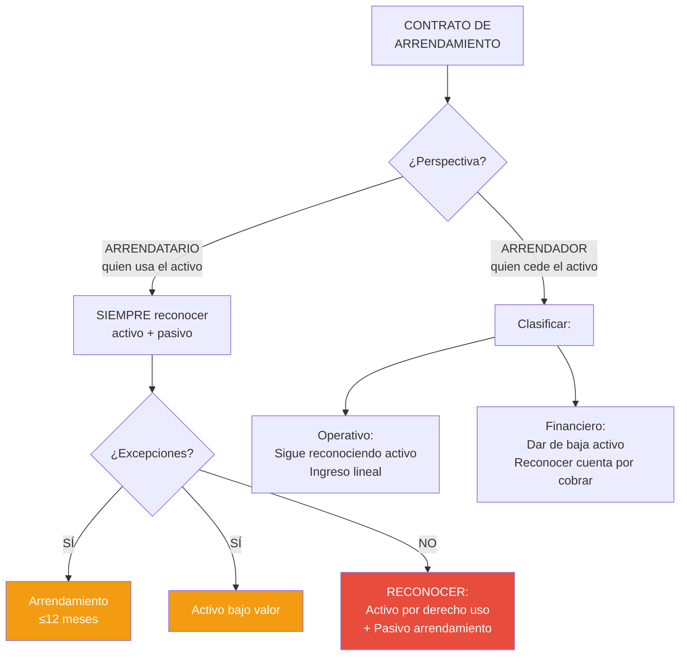
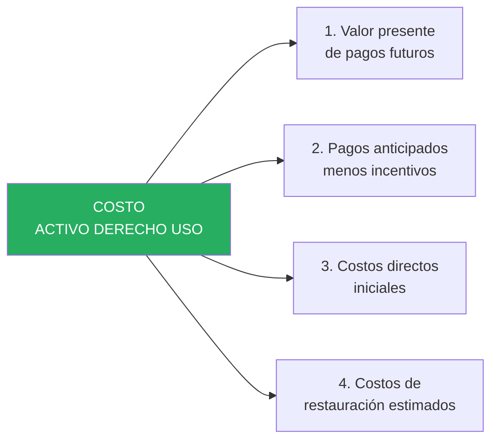
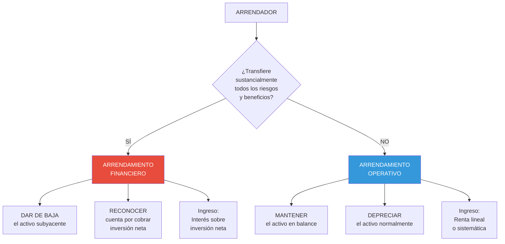

# IPSAS 43: Arrendamientos

## Resumen

La IPSAS 43 establece que un arrendamiento es un contrato que transfiere el derecho de uso de un activo por un periodo determinado a cambio de contraprestación, requiriendo que el arrendatario reconozca un activo por derecho de uso y un pasivo por arrendamiento al inicio (eliminando la clasificación operativo/financiero del arrendatario), midiendo el activo al costo (valor presente de pagos + costos directos iniciales) y el pasivo al valor presente de pagos futuros, amortizando el activo y reconociendo interés sobre el pasivo, con exenciones para arrendamientos de corto plazo (<12 meses) y activos de bajo valor (<US$ 5,000), mientras el arrendador mantiene la clasificación operativo/financiero.

## Definición / Texto Normativo

**IPSAS 43 - Leases, Párrafo 9:**

> "Un **arrendamiento** es un contrato, o parte de un contrato, que transfiere el **derecho de uso** de un activo (el activo subyacente) por un **periodo de tiempo** a cambio de una **contraprestación**."

**IPSAS 43, Párrafo 10 - Identificación de un arrendamiento:**

> "Al inicio de un contrato, una entidad evaluará si el contrato es, o contiene, un arrendamiento. Un contrato es, o contiene, un arrendamiento si transmite el derecho a **controlar el uso de un activo identificado** por un periodo de tiempo a cambio de una contraprestación."

**IPSAS 43, Párrafo 11 - Control del uso:**

> "Para evaluar si un contrato transmite el derecho a controlar el uso de un activo identificado, una entidad evaluará si, a lo largo del periodo de uso, el cliente tiene:
> (a) El derecho a obtener **sustancialmente todos los beneficios económicos o potencial de servicio** del uso del activo identificado; y
> (b) El derecho a **decidir sobre el uso** del activo identificado."

**IPSAS 43, Párrafo 22 - Reconocimiento del arrendatario:**

> "En la fecha de comienzo, un arrendatario reconocerá un **activo por derecho de uso** y un **pasivo por arrendamiento**."

**IPSAS 43, Párrafo 24 - Medición inicial del activo por derecho de uso:**

> "En la fecha de comienzo, un arrendatario medirá el activo por derecho de uso al costo, que comprende:
> (a) El importe de la medición inicial del pasivo por arrendamiento;
> (b) Los pagos por arrendamiento realizados antes o a partir de la fecha de comienzo, menos los incentivos de arrendamiento recibidos;
> (c) Los costos directos iniciales incurridos por el arrendatario; y
> (d) Una estimación de los costos a incurrir por el arrendatario al desmantelar y eliminar el activo subyacente, restaurar el lugar en el que está ubicado o restaurar el activo subyacente (si procede)."

**IPSAS 43, Párrafo 26 - Medición inicial del pasivo por arrendamiento:**

> "En la fecha de comienzo, un arrendatario medirá el pasivo por arrendamiento al **valor presente de los pagos por arrendamiento** que no se hayan pagado en esa fecha."

**Definiciones clave (Párrafo 9):**

- **Activo por derecho de uso:** Activo que representa el derecho del arrendatario a usar un activo subyacente durante el plazo del arrendamiento.
- **Pasivo por arrendamiento:** Obligación del arrendatario de realizar pagos por arrendamiento.
- **Plazo del arrendamiento:** Periodo no cancelable durante el cual el arrendatario tiene derecho a usar un activo, incluyendo periodos cubiertos por opciones de extensión (si es razonablemente cierto que se ejercerán) y periodos de terminación anticipada (si es razonablemente cierto que NO se ejercerá).
- **Fecha de comienzo:** Fecha en la cual el arrendador pone el activo subyacente a disposición del arrendatario.
- **Tasa de interés implícita:** Tasa que iguala el valor presente de los pagos por arrendamiento y el valor residual no garantizado con el valor razonable del activo subyacente.
- **Tasa de endeudamiento incremental:** Tasa que el arrendatario tendría que pagar por pedir prestado fondos necesarios para obtener un activo de valor similar en un plazo similar.

## Desarrollo / Interpretación

### Cambio Fundamental: IPSAS 43 vs Norma Anterior

**Antes (IPSAS 13 - Leases, derogada):**

Arrendatario clasificaba arrendamientos en:

- **Operativo:** Gasto del periodo (no reconocer activo/pasivo)
- **Financiero:** Reconocer activo y pasivo

**Problema:** Muchas entidades estructuraban contratos como "operativos" para mantener deuda fuera del balance (off-balance sheet financing).

**Ahora (IPSAS 43 - vigente desde 2023):**



**Impacto en sector público:**

- Todos los arrendamientos de vehículos, equipos, edificios (>12 meses, >US$ 5,000) ahora aparecen en el balance
- Aumento significativo de activos y pasivos reconocidos
- Mayor transparencia sobre obligaciones de arrendamiento

---

### Identificación de un Arrendamiento: ¿Es o contiene un arrendamiento?

**Criterios de control (Párrafo 11):**

#### **Criterio 1: Activo identificado**

El activo debe estar **identificado explícita o implícitamente** en el contrato.

**Ejemplos:**

| Contrato                                                    | ¿Activo identificado? | Razón                                              |
| ----------------------------------------------------------- | --------------------- | -------------------------------------------------- |
| Arrendar vehículo placa ABC-123                             | ✅ SÍ                 | Explícitamente identificado (placa)                |
| Arrendar "un camión de 5 toneladas" (proveedor decide cuál) | ❌ NO                 | Proveedor tiene derecho de sustitución             |
| Arrendar espacio de 100 m² en piso 3 de edificio            | ✅ SÍ                 | Implícitamente identificado (ubicación específica) |
| Contrato de transporte (proveedor usa sus vehículos)        | ❌ NO                 | Proveedor controla qué vehículo usar               |

**Derecho de sustitución del proveedor (Párrafo 13):**

Si el proveedor tiene derecho **práctico** de sustituir el activo a lo largo del periodo **y** se beneficiaría económicamente de hacerlo → NO hay activo identificado → NO es arrendamiento.

#### **Criterio 2: Control del uso del activo**

**2A. Derecho a obtener sustancialmente todos los beneficios:**

El cliente puede decidir cómo usar el activo para obtener sus beneficios (económicos o potencial de servicio).

**2B. Derecho a decidir sobre el uso:**

El cliente puede decidir:

- **Cómo** se usa el activo (ej. qué ruta toma el vehículo)
- **Para qué propósito** se usa (ej. transporte de personal vs transporte de materiales)

**Ejemplos de evaluación:**

**Caso 1: Hospital arrienda ambulancia por 5 años**

- ¿Activo identificado? ✅ SÍ (ambulancia placa específica)
- ¿Obtiene beneficios? ✅ SÍ (usar para emergencias)
- ¿Decide sobre uso? ✅ SÍ (hospital decide cuándo, dónde y cómo usar)
- **Conclusión:** ✅ ES ARRENDAMIENTO

**Caso 2: Municipalidad contrata servicio de recolección de basura (proveedor usa sus camiones)**

- ¿Activo identificado? ❌ NO (proveedor decide qué camión usar cada día)
- ¿Obtiene beneficios? ❌ NO (municipalidad no controla el camión)
- ¿Decide sobre uso? ❌ NO (proveedor decide rutas, horarios según su eficiencia operativa)
- **Conclusión:** ❌ NO ES ARRENDAMIENTO (es contrato de servicios)

---

### Reconocimiento y Medición Inicial del Arrendatario

#### **Componente 1: Activo por Derecho de Uso**

**Costo inicial (Párrafo 24):**



**Ejemplo de cálculo:**

**Municipalidad arrienda edificio para oficinas por 10 años:**

| Concepto                                              | Monto                                 |
| ----------------------------------------------------- | ------------------------------------- |
| Renta mensual: S/. 20,000 × 120 meses                 | S/. 2,400,000 (total pagos nominales) |
| Tasa de descuento (incremental): 8% anual             | -                                     |
| **Valor presente de rentas futuras**                  | **S/. 1,611,837**                     |
| Pago de garantía (primera renta al firmar)            | S/. 20,000                            |
| Comisión de intermediario                             | S/. 12,000                            |
| Acondicionamiento de espacio (pintura, instalaciones) | S/. 35,000                            |
| Costo estimado de restauración (al final)             | S/. 25,000 (VP = S/. 11,580 al 8%)    |

**Costo del activo por derecho de uso:**

```
S/. 1,611,837 + S/. 20,000 + S/. 12,000 + S/. 35,000 + S/. 11,580 = S/. 1,690,417
```

#### **Componente 2: Pasivo por Arrendamiento**

**Medición inicial (Párrafo 26):**

**Valor presente de:**

- Pagos fijos (menos incentivos por cobrar)
- Pagos variables que dependen de índice/tasa
- Importes que se espera pagar por garantías de valor residual
- Precio de opciones de compra (si es razonablemente cierto que se ejercerán)
- Penalizaciones por terminación anticipada (si el plazo refleja ejercicio de esa opción)

**Continuando el ejemplo anterior:**

**Pasivo inicial:**

```
Valor presente de 120 rentas de S/. 20,000 al 8% anual = S/. 1,611,837
```

**Asiento contable (fecha de comienzo - 01/01/2024):**

```
Activo por Derecho de Uso - Edificio      1,690,417
    Pasivo por Arrendamiento                      1,611,837
    Banco (pago anticipado + comisión + acondiciona)  67,000
    Provisión para Restauración                      11,580

[Reconocer simultáneamente activo y pasivo al inicio]
```

---

### Medición Posterior del Arrendatario

#### **Activo por Derecho de Uso**

**Modelo de costo (Párrafo 29 - predeterminado):**

```
Valor en libros = Costo inicial - Depreciación acumulada - Pérdidas por deterioro
```

**Depreciación:**

- **Plazo:** Desde fecha de comienzo hasta **el menor entre**:
  - (a) Fin del plazo del arrendamiento, o
  - (b) Fin de la vida útil del activo (si es razonablemente cierto que se obtendrá propiedad)

- **Método:** Generalmente lineal (consistente con activos similares)

**Continuando el ejemplo (edificio 10 años):**

```
Depreciación anual = S/. 1,690,417 / 10 años = S/. 169,042
```

**Asiento anual (31/12/2024):**

```
Gasto - Depreciación Derecho de Uso      169,042
    Depreciación Acumulada - Derecho de Uso     169,042
```

---

#### **Pasivo por Arrendamiento**

**Medición posterior (Párrafo 36):**

El arrendatario medirá el pasivo por arrendamiento:

1. **Aumentando** el importe en libros para reflejar el **interés** sobre el pasivo (método del interés efectivo)
2. **Reduciendo** el importe en libros para reflejar los **pagos** realizados

**Tabla de amortización (ejemplo - primeros 3 años):**

| Año | Saldo inicial | Interés 8%  | Pago anual  | Reducción pasivo | Saldo final   |
| --- | ------------- | ----------- | ----------- | ---------------- | ------------- |
| 1   | S/. 1,611,837 | S/. 128,947 | S/. 240,000 | S/. 111,053      | S/. 1,500,784 |
| 2   | S/. 1,500,784 | S/. 120,063 | S/. 240,000 | S/. 119,937      | S/. 1,380,847 |
| 3   | S/. 1,380,847 | S/. 110,468 | S/. 240,000 | S/. 129,532      | S/. 1,251,315 |

**Asientos contables año 1 (12 pagos de S/. 20,000):**

**Cada mes (pago):**

```
Pasivo por Arrendamiento                  20,000
    Banco                                        20,000

[Registrar pago mensual, simplificado]
```

**Fin de año (31/12/2024 - ajuste de interés):**

```
Gasto - Interés sobre Arrendamiento      128,947
    Pasivo por Arrendamiento                    128,947

[Reconocer interés devengado = S/. 240,000 pagado - S/. 111,053 reducción pasivo]
```

**Nota:** En la práctica, el interés se puede reconocer mensualmente para mayor precisión.

---

### Presentación en Estados Financieros

**Estado de Situación Financiera (31/12/2024):**

```
ACTIVOS NO CORRIENTES:
  Activo por Derecho de Uso - Edificio       S/. 1,690,417
  Menos: Depreciación Acumulada              S/.  (169,042)
  Valor neto                                 S/. 1,521,375

PASIVOS:
  Pasivo por Arrendamiento (corriente)*      S/.   119,937
  Pasivo por Arrendamiento (no corriente)*   S/. 1,380,847
  Total pasivo por arrendamiento             S/. 1,500,784

*Corriente = porción que se pagará en próximos 12 meses (reducción del capital en año 2)
*No corriente = saldo restante (años 3-10)
```

**Estado de Gestión (2024):**

```
GASTOS:
  Depreciación - Derecho de Uso             S/.   169,042
  Interés - Arrendamiento                   S/.   128,947
  Total gasto por arrendamiento             S/.   297,989
```

**Comparación con método anterior (IPSAS 13 - operativo):**

| Concepto     | IPSAS 13 (operativo) | IPSAS 43 (actual)               | Diferencia     |
| ------------ | -------------------- | ------------------------------- | -------------- |
| Activos      | S/. 0                | S/. 1,521,375                   | +S/. 1,521,375 |
| Pasivos      | S/. 0                | S/. 1,500,784                   | +S/. 1,500,784 |
| Gasto año 1  | S/. 240,000 (renta)  | S/. 297,989 (deprec + interés)  | +S/. 57,989    |
| Patrón gasto | Lineal (constante)   | Decreciente (interés disminuye) | -              |

**Impacto en ratios financieros:**

- **Apalancamiento (Pasivo/Patrimonio):** Aumenta (más pasivos reconocidos)
- **Rotación de activos:** Disminuye (más activos reconocidos)
- **Gasto inicial:** Mayor en primeros años (interés es mayor), menor al final

---

### Exenciones de Reconocimiento (Párrafo 5)

IPSAS 43 permite **no** reconocer activo/pasivo (en su lugar: gasto lineal) para:

#### **Excepción 1: Arrendamientos de corto plazo (≤12 meses)**

**Definición (Párrafo 9):**

> "Arrendamiento que, en la fecha de comienzo, tiene un plazo de arrendamiento de 12 meses o menos y no contiene opción de compra."

**Tratamiento simplificado:**

```
Reconocer pagos como gasto de forma lineal o según otro método sistemático
```

**Ejemplo:**

**Hospital arrienda 5 camas hospitalarias por 10 meses:**

- Renta mensual: S/. 800 × 5 = S/. 4,000
- Total: S/. 40,000

**Opción elegida:** Aplicar excepción de corto plazo

**Asiento mensual:**

```
Gasto - Arriendo Equipos                  4,000
    Banco                                       4,000

[No reconocer activo ni pasivo]
```

---

#### **Excepción 2: Activos de bajo valor (<US$ 5,000 aprox.)**

**Definición (Párrafo 9):**

> "Arrendamiento de un activo que, cuando es nuevo, tiene un valor menor a US$ 5,000 (o equivalente)."

**Ejemplos:**

- Computadoras de escritorio (< S/. 3,000 c/u)
- Teléfonos móviles
- Muebles de oficina pequeños
- Tablets

**Importante:** La evaluación es por **activo individual**, no por contrato agregado.

**Ejemplo:**

**Municipalidad arrienda 50 tablets (S/. 1,500 c/u) por 3 años:**

- Valor individual: S/. 1,500 (< US$ 5,000) ✅
- Total contrato: S/. 75,000 (> US$ 5,000) → Irrelevante

**Opción elegida:** Aplicar excepción de bajo valor

**Asiento mensual:**

```
Gasto - Arriendo Equipos de Cómputo       [monto mensual]
    Banco                                          [monto mensual]

[No reconocer activo ni pasivo, a pesar de plazo >12 meses]
```

---

### Arrendamientos desde la Perspectiva del Arrendador

**IPSAS 43 mantiene clasificación operativo/financiero para arrendador:**



**Indicadores de arrendamiento financiero (Párrafo 58):**

1. **Transferencia de propiedad** al final del plazo
2. **Opción de compra** a precio significativamente inferior al valor razonable
3. **Plazo cubre mayor parte** de la vida económica del activo (ej. >75%)
4. **Valor presente de pagos** ≥ sustancialmente todo el valor razonable del activo (ej. ≥90%)
5. **Activo tan especializado** que solo el arrendatario puede usarlo sin modificaciones mayores

**Si NO cumple estos indicadores → Operativo**

---

### Revelaciones Requeridas (Arrendatario)

**Información obligatoria (Párrafos 53-60):**

1. **Activos por derecho de uso por clase:**
   - Valor en libros al cierre
   - Adiciones del periodo
   - Depreciación
   - Pérdidas por deterioro

2. **Pasivos por arrendamiento:**
   - Análisis de vencimientos (corriente vs no corriente)
   - Total pagos mínimos futuros
   - Valor presente

3. **Gastos reconocidos:**
   - Depreciación de derechos de uso
   - Interés sobre pasivos
   - Gasto por arrendamientos de corto plazo
   - Gasto por arrendamientos de bajo valor
   - Pagos variables no incluidos en el pasivo

4. **Salidas de efectivo totales** por arrendamientos

5. **Compromisos** por arrendamientos no iniciados

**Ejemplo de revelación:**

**Nota 12 - Arrendamientos**

```
12.1 Activos por derecho de uso:

                        Edificios  Vehículos  Equipos    Total
Saldo inicial           0          0          0          0
Adiciones               1,690,417  350,000    120,000    2,160,417
Depreciación            (169,042)  (70,000)   (40,000)   (279,042)
Saldo final             1,521,375  280,000    80,000     1,881,375

12.2 Pasivos por arrendamiento:

                        2024       Flujos futuros
Menos de 1 año          119,937    S/. 240,000
Entre 1 y 5 años        562,784    S/. 960,000
Más de 5 años           818,063    S/. 1,200,000
Total                   1,500,784  S/. 2,400,000

Diferencia: S/. 899,216 representa interés financiero no devengado.

12.3 Gastos reconocidos en el periodo:

Depreciación de derechos de uso             S/.   279,042
Interés sobre pasivos de arrendamiento      S/.   150,000
Arrendamientos de corto plazo               S/.    48,000
Arrendamientos de activos de bajo valor     S/.    15,000
Total                                       S/.   492,042

12.4 Tasa de descuento:
La entidad usa su tasa de endeudamiento incremental (8% anual) para medir
los pasivos por arrendamiento, dado que la tasa implícita no es fácilmente
determinable en los contratos.
```

## Conexiones

- [[marco-conceptual-nicsp]] - Definición de activo (control) y pasivo (obligación presente)
- [[base-devengado-sector-publico]] - Reconocer activo/pasivo aunque no se posea el bien (derecho de uso)
- [[diferencias-nicsp-niif]] - IPSAS 43 basada en IFRS 16, con énfasis en potencial de servicio
- [[contabilidad-gubernamental-peru]] - Registro en SIAF, PCG Clase 1 (Derechos de uso) y Clase 4 (Pasivos arrendamiento)
- [[ipsas-17-propiedad-planta-equipo|IPSAS 17]] - Activo por derecho de uso se deprecia similar a PPE
- [[ipsas-31-activos-intangibles|IPSAS 31]] - Diferencia tangible (derecho uso) vs intangible (sin sustancia)
- [[unidad-I/valor-presente-sector-publico|Valor Presente]] - Técnica clave para medir pasivo arrendamiento

## Ejemplos Resueltos

### Ejemplo 1: Arrendamiento de Vehículos (Intermedio)

**Situación:**
Gobierno Regional arrienda 10 camionetas 4×4 para programa de salud rural:

- **Fecha inicio:** 01/07/2024
- **Plazo:** 5 años
- **Renta mensual:** S/. 3,500 por vehículo × 10 = S/. 35,000 total
- **Opción de compra:** Al final, S/. 80,000 por las 10 (valor razonable estimado: S/. 150,000)
  - Evaluación: **Es razonablemente cierto** que se ejercerá (precio muy favorable)
- **Tasa de endeudamiento incremental:** 10% anual
- **Vida útil vehículos:** 8 años

**Costos iniciales:**

- Comisión leasing: S/. 15,000
- Seguro anual (pagado por adelantado): S/. 18,000

**Tarea:** Reconocer el arrendamiento, calcular depreciación y gastos del primer año.

---

**Solución:**

**Paso 1: Determinar plazo del arrendamiento**

Incluye opción de compra porque es razonablemente cierto que se ejercerá → **5 años**

**Paso 2: Calcular valor presente de pagos**

```
Pagos mensuales: S/. 35,000 × 60 meses = S/. 2,100,000 (nominal)
Opción de compra: S/. 80,000 (mes 60)

VP de rentas: PMT = S/. 35,000, n = 60, i = 10%/12 = 0.833% mensual
VP rentas = S/. 1,634,842

VP opción de compra: FV = S/. 80,000, n = 60, i = 0.833%
VP opción = S/. 48,545

Total VP = S/. 1,634,842 + S/. 48,545 = S/. 1,683,387
```

**Paso 3: Calcular costo del activo por derecho de uso**

```
VP de pagos:         S/. 1,683,387
Comisión leasing:    S/.    15,000
Total costo:         S/. 1,698,387
```

Nota: Seguro NO se incluye (es gasto operativo, no parte del costo del derecho de uso).

**Paso 4: Asiento inicial (01/07/2024)**

```
Activo por Derecho de Uso - Vehículos    1,698,387
Gasto Anticipado - Seguro                   18,000
    Pasivo por Arrendamiento                      1,683,387
    Banco                                             33,000

[Reconocer activo, pasivo y costos iniciales]
```

**Paso 5: Calcular depreciación (6 meses en 2024)**

Como se ejercerá la opción de compra, depreciar sobre **vida útil del activo (8 años)**, no plazo del arrendamiento.

```
Depreciación anual = S/. 1,698,387 / 8 años = S/. 212,298
Depreciación 2024 (6 meses) = S/. 212,298 × 6/12 = S/. 106,149
```

**Paso 6: Calcular interés 2024 (6 meses)**

| Mes | Saldo inicial | Pago   | Interés 10%/12 | Reducción | Saldo final |
| --- | ------------- | ------ | -------------- | --------- | ----------- |
| Jul | 1,683,387     | 35,000 | 14,028         | 20,972    | 1,662,415   |
| Ago | 1,662,415     | 35,000 | 13,853         | 21,147    | 1,641,268   |
| Sep | 1,641,268     | 35,000 | 13,677         | 21,323    | 1,619,945   |
| Oct | 1,619,945     | 35,000 | 13,500         | 21,500    | 1,598,445   |
| Nov | 1,598,445     | 35,000 | 13,320         | 21,680    | 1,576,765   |
| Dic | 1,576,765     | 35,000 | 13,140         | 21,860    | 1,554,905   |

**Total interés 2024:** S/. 81,518

**Paso 7: Asientos contables 2024**

**Pagos mensuales (consolidado 6 meses):**

```
Pasivo por Arrendamiento                 210,000
    Banco                                       210,000

[S/. 35,000 × 6 meses]
```

**Ajuste de interés (31/12/2024):**

```
Gasto - Interés sobre Arrendamiento       81,518
    Pasivo por Arrendamiento                    81,518

[Reconocer interés devengado no pagado]
```

**Depreciación (31/12/2024):**

```
Gasto - Depreciación Derecho de Uso      106,149
    Depreciación Acumulada - Derecho Uso        106,149
```

**Paso 8: Presentación al 31/12/2024**

**Estado de Situación Financiera:**

```
ACTIVOS NO CORRIENTES:
  Derecho de Uso - Vehículos        S/. 1,698,387
  Menos: Depreciación Acumulada     S/.  (106,149)
  Valor neto                        S/. 1,592,238

PASIVOS:
  Pasivo por Arrendamiento:
    Corriente                       S/.   262,463*
    No Corriente                    S/. 1,292,442*
  Total                             S/. 1,554,905

*Separar según vencimiento en próximos 12 meses
```

**Estado de Gestión (2024):**

```
GASTOS:
  Depreciación - Derecho de Uso     S/.   106,149
  Interés - Arrendamiento           S/.    81,518
  Seguro Vehículos                  S/.     9,000 (6/12 de S/. 18,000)
  Total                             S/.   196,667
```

---

### Ejemplo 2: Evaluación de Contrato - ¿Es Arrendamiento? (Avanzado)

**Situación:**
Ministerio de Educación firma 3 contratos diferentes. Evalúa si cada uno es o contiene un arrendamiento:

**CONTRATO A: Servicio de transporte escolar**

- Proveedor privado transporta 500 estudiantes diariamente durante 2 años
- Proveedor usa su flota de 10 buses (el Ministerio no especifica cuáles)
- Proveedor decide rutas, horarios (dentro de horario escolar) y conductores
- Pago mensual fijo: S/. 80,000

**CONTRATO B: Uso de instalaciones deportivas**

- Ministerio reserva estadio municipal específico
- 3 días por semana (lunes, miércoles, viernes) de 8am-5pm
- Plazo: 3 años
- Ministerio decide qué actividades realizar (clases de educación física, eventos)
- Pago mensual: S/. 15,000

**CONTRATO C: Data center (centro de datos)**

- Proveedor provee espacio de servidor (100 TB de almacenamiento)
- Equipos del proveedor (servidor físico no identificado; proveedor puede mover datos entre servidores según necesidad operativa)
- Ministerio solo accede virtualmente (no controla hardware físico)
- Plazo: 5 años
- Pago mensual: S/. 25,000

**Tarea:** Para cada contrato:

1. Identifica si hay activo identificado
2. Evalúa control del uso (beneficios + decisión uso)
3. Concluye: ¿Es arrendamiento?
4. Describe el tratamiento contable apropiado

---

**Solución:**

### **CONTRATO A: Servicio de transporte**

**1. ¿Activo identificado?**

- ❌ NO: Proveedor tiene derecho de sustitución (puede usar cualquiera de sus 10 buses)
- El Ministerio no tiene derecho sobre buses específicos

**2. ¿Control del uso?**

- ❌ NO: Proveedor decide qué buses usar, rutas específicas (dentro de parámetros)
- Ministerio solo especifica origen/destino y horario general

**3. Conclusión:**

- ❌ **NO es arrendamiento** → Es contrato de servicios

**4. Tratamiento contable:**

```
Gasto - Transporte Escolar (mensual)      80,000
    Banco                                        80,000

[No reconocer activo ni pasivo por arrendamiento]
```

---

### **CONTRATO B: Instalaciones deportivas**

**1. ¿Activo identificado?**

- ✅ SÍ: Estadio municipal **específico** (identificado explícitamente)
- No hay derecho de sustitución (el proveedor no puede cambiar por otro estadio)

**2. ¿Control del uso?**

- **2A. Beneficios:** ✅ SÍ - Ministerio obtiene sustancialmente todos los beneficios durante los periodos reservados (3 días/semana, 9 horas/día)
- **2B. Decisión sobre uso:** ✅ SÍ - Ministerio decide qué actividades realizar (educación física, eventos, competencias)

**3. Conclusión:**

- ✅ **SÍ es arrendamiento** (derecho de uso de instalación por periodo determinado)

**4. Tratamiento contable:**

**Paso A: Calcular valor presente de pagos**

```
Pagos mensuales: S/. 15,000 × 36 meses = S/. 540,000 (nominal)
Tasa descuento (asumiendo 8% anual):

VP = S/. 472,384
```

**Paso B: Asiento inicial**

```
Activo por Derecho de Uso - Instalaciones 472,384
    Pasivo por Arrendamiento                     472,384
```

**Paso C: Medición posterior**

- Depreciar el activo por derecho de uso: S/. 472,384 / 3 años = S/. 157,461 anual
- Reconocer interés sobre pasivo según tabla de amortización

---

### **CONTRATO C: Data center (almacenamiento)**

**1. ¿Activo identificado?**

- ❌ NO: No hay servidor **físico** identificado
- Proveedor tiene derecho **práctico** de sustitución (puede mover datos entre múltiples servidores según eficiencia operativa)
- Ministerio solo controla datos (información), no hardware

**2. ¿Control del uso?**

- ❌ NO: Ministerio no controla el activo físico (servidor)
- Solo tiene derecho a **capacidad** de almacenamiento (100 TB), no a equipo específico

**3. Conclusión:**

- ❌ **NO es arrendamiento** → Es contrato de servicios (servicio de hosting/almacenamiento)

**4. Tratamiento contable:**

```
Gasto - Servicios de Almacenamiento (mensual)  25,000
    Banco                                             25,000

[No reconocer activo ni pasivo por arrendamiento]
```

**Análisis comparativo:**

| Contrato        | Activo identificado                | Control uso | ¿Arrendamiento? | Tratamiento        |
| --------------- | ---------------------------------- | ----------- | --------------- | ------------------ |
| A - Transporte  | ❌ NO (flota genérica)             | ❌ NO       | ❌ NO           | Gasto de servicios |
| B - Estadio     | ✅ SÍ (instalación específica)     | ✅ SÍ       | ✅ SÍ           | Activo + Pasivo    |
| C - Data center | ❌ NO (servidores intercambiables) | ❌ NO       | ❌ NO           | Gasto de servicios |

## Ejercicios Propuestos

### Ejercicio 1: Arrendamiento Básico con Exenciones (Básico)

**Escenario:**
Hospital público firma los siguientes contratos en enero 2025:

1. **Equipos de diagnóstico:**
   - 3 ecógrafos portátiles (valor nuevo: S/. 8,000 c/u)
   - Plazo: 4 años
   - Renta mensual: S/. 600 × 3 = S/. 1,800
   - Tasa incremental: 9% anual

2. **Computadoras:**
   - 20 laptops (valor nuevo: S/. 2,500 c/u)
   - Plazo: 3 años
   - Renta mensual: S/. 80 × 20 = S/. 1,600

3. **Generador eléctrico de emergencia:**
   - 1 generador (valor nuevo: S/. 95,000)
   - Plazo: 8 meses
   - Renta mensual: S/. 4,500

**Tarea:**

1. Para cada contrato, determina si aplica alguna excepción (corto plazo o bajo valor)
2. Para contratos que NO aplican excepción: Calcula VP de pagos y prepara asiento inicial
3. Para contratos que SÍ aplican excepción: Explica el tratamiento contable simplificado
4. Presenta el Estado de Situación Financiera al 31/01/2025 (solo sección arrendamientos)

---

### Ejercicio 2: Medición Posterior y Tabla de Amortización (Intermedio)

**Escenario:**
Municipalidad arrienda edificio para biblioteca municipal:

- **Fecha inicio:** 01/01/2024
- **Plazo:** 6 años
- **Renta:** S/. 18,000 mensuales
- **Tasa incremental:** 7% anual
- **Costos iniciales:** Comisión S/. 10,000 + Acondicionamiento S/. 45,000
- **Costo estimado restauración al final:** S/. 30,000 (valor presente S/. 20,000)

**Tarea:**

1. Calcula el costo del activo por derecho de uso
2. Calcula el pasivo inicial por arrendamiento
3. Prepara asiento de reconocimiento inicial (01/01/2024)
4. Elabora tabla de amortización del pasivo (primeros 3 años)
5. Calcula depreciación anual
6. Prepara todos los asientos del año 2024
7. Presenta Estado de Situación Financiera al 31/12/2024 (sección arrendamientos)
8. Presenta Estado de Gestión 2024 (gastos relacionados)

---

### Ejercicio 3: Caso Integral - Portfolio de Arrendamientos (Avanzado)

**Escenario:**
Gobierno Regional tiene los siguientes arrendamientos al 01/01/2024:

**A. Flota de ambulancias (reconocido 2020):**

- Valor en libros del derecho de uso: S/. 850,000
- Depreciación acumulada: S/. 340,000 (4 años)
- Pasivo por arrendamiento: S/. 480,000
- Plazo restante: 6 años
- Renta anual: S/. 120,000
- Tasa: 8%
- **Evento 2024:** Gobierno renegocia contrato, extiende plazo 3 años adicionales (9 años total restante) con renta anual de S/. 110,000

**B. Oficinas administrativas (nuevo contrato 2024):**

- Plazo: 10 años (inicio 01/01/2024)
- Renta mensual: S/. 25,000 (años 1-5), S/. 30,000 (años 6-10) ajustado por inflación
- Pago adelantado: Primera y última renta (S/. 55,000)
- Comisión: S/. 18,000
- Tasa: 9%
- Opción de compra al año 10: S/. 200,000 (valor razonable estimado S/. 500,000) → Razonablemente cierto ejercer

**C. Equipos de cómputo:**

- 100 computadoras (valor unitario nuevo S/. 3,200)
- Plazo: 4 años (inicio 01/01/2024)
- Renta mensual total: S/. 8,000
- **Decisión:** Aplicar excepción de bajo valor

**Tarea (2,000 palabras):**

1. **Modificación de arrendamiento (A):**
   - Calcula el nuevo valor del activo por derecho de uso (ajuste)
   - Calcula el nuevo pasivo (remedir)
   - Prepara asiento de modificación
   - Recalcula depreciación anual desde 2024

2. **Reconocimiento inicial (B):**
   - Determina pagos incluidos en el pasivo (cuidado con renta variable indexada)
   - Calcula VP del pasivo (considera opción de compra)
   - Calcula costo del derecho de uso
   - Prepara asiento inicial
   - Vida útil para depreciación (edificio 40 años, pero ¿cuál usar?)

3. **Excepción de bajo valor (C):**
   - Justifica aplicación de excepción (evaluación individual)
   - Tratamiento contable mensual

4. **Revelaciones (Nota 12):**
   - Prepara conciliación de activos por derecho de uso 2024 (inicio, adiciones, modificaciones, depreciación, cierre)
   - Prepara conciliación de pasivos por arrendamiento 2024
   - Análisis de vencimientos (corriente vs no corriente)
   - Tabla resumen de gastos reconocidos 2024

5. **Análisis crítico:**
   - Impacto de IPSAS 43 en ratios financieros del Gobierno Regional
   - Compare gasto 2024 bajo IPSAS 43 vs lo que hubiera sido bajo IPSAS 13 (método operativo) para el arrendamiento B
   - Evalúa: ¿La renegociación del arrendamiento A fue beneficiosa financieramente?

## Preguntas Bloom

**Nivel 1 - Recordar:** Define "arrendamiento" según IPSAS 43. Enumera los 2 componentes que el arrendatario debe reconocer en todos los arrendamientos (excepto excepciones).

**Nivel 2 - Comprender:** Explica la diferencia fundamental entre IPSAS 13 (derogada) e IPSAS 43 respecto al tratamiento de arrendamientos operativos por el arrendatario. ¿Por qué se realizó este cambio (objetivo de la nueva norma)?

**Nivel 3 - Aplicar:** Una municipalidad arrienda 5 camiones recolectores de basura por 7 años. Renta mensual: S/. 12,000. Tasa incremental: 8%. Costos iniciales: S/. 25,000. Aplica IPSAS 43 para: (a) Calcular el activo por derecho de uso, (b) Calcular el pasivo inicial, (c) Registrar el reconocimiento inicial, (d) Calcular depreciación del primer año, (e) Calcular interés del primer año (usa cálculo simplificado).

**Nivel 4 - Analizar:** Compara el patrón de gastos a lo largo del plazo del arrendamiento bajo: (a) Método anterior (IPSAS 13 - operativo: gasto lineal), (b) Método actual (IPSAS 43: depreciación + interés). Analiza: ¿En qué años el gasto es mayor/menor? ¿Cuál es el gasto total acumulado al final del plazo (comparación)? Proporciona ejemplo numérico.

**Nivel 5 - Evaluar:** Un gobierno regional tiene 50 arrendamientos de diversos activos (edificios, vehículos, equipos). Al implementar IPSAS 43, sus activos aumentaron 35% y sus pasivos 42%, lo que deterioró significativamente su ratio de apalancamiento (pasivo/patrimonio). El gobernador argumenta: "Esta norma es puramente cosmética; no cambia nuestra situación económica real, solo hace que parezcamos más endeudados sin serlo. Deberíamos seguir usando el método anterior para no afectar nuestra calificación crediticia." Evalúa este argumento desde: (a) Transparencia financiera, (b) Representación fiel (Marco Conceptual), (c) Comparabilidad con otras entidades. ¿El gobernador tiene razón? ¿Qué recomendarías?

**Nivel 6 - Crear:** Diseña una "Política de Arrendamientos" para entidades del sector público peruano que incluya: (1) Criterios de decisión: ¿Cuándo arrendar vs comprar un activo?, (2) Proceso de evaluación de contratos (identificar si contiene arrendamiento), (3) Procedimiento de reconocimiento contable (con flujogramas), (4) Criterios para aplicar excepciones (corto plazo, bajo valor), (5) Integración con presupuesto y SIAF, (6) Controles internos para evitar arrendamientos "ocultos". Extensión: 1,500 palabras.

## Base Normativa

**Norma IPSASB:**

1. **IPSAS 43 - Leases (vigente desde enero 2025).** Texto completo define identificación, reconocimiento, medición inicial/posterior para arrendatario y arrendador.
   - Párrafos clave: 9-21 (definición e identificación), 22-49 (arrendatario), 50-84 (arrendador), 53-60 (revelaciones arrendatario)
   - Disponible en: www.ipsasb.org/publications/ipsas-43-leases

**Normas relacionadas:** 2. **IFRS 16 - Leases (IFRS Foundation).** Base de IPSAS 43 (texto prácticamente idéntico, adaptado para sector público). 3. **IPSAS 13 - Leases (derogada desde 2025).** Norma anterior con clasificación operativo/financiero para arrendatario. 4. **IPSAS 17 - Property, Plant and Equipment.** Activo por derecho de uso se trata similarmente a PPE.

**Guías de implementación:** 5. **IPSASB Implementation Guidance for IPSAS 43** (2022). Ejemplos de identificación, separación de componentes, modificaciones. 6. **IFRS 16 - Illustrative Examples** (IASB, 2016). Casos detallados aplicables también a IPSAS 43.

**Normativa Peruana:** 7. **Plan Contable Gubernamental 2019 (actualizado 2024) - Clases 1 y 4:**

- 141 - Derecho de uso - Edificios
- 142 - Derecho de uso - Vehículos, maquinaria
- 143 - Derecho de uso - Equipos
- 149 - Depreciación acumulada - Derecho de uso
- 451 - Pasivos por arrendamiento - Corriente
- 452 - Pasivos por arrendamiento - No corriente

8. **Directiva de Transición IPSAS 43** (MEF, 2024). Guía para implementación en entidades públicas peruanas.

**Literatura técnica:** 9. Morales-Díaz, J., & Zamora-Ramírez, C. (2018). "The Impact of IFRS 16 on Key Financial Ratios: A New Methodological Approach". _Accounting in Europe_, 15(1), 105-133. 10. Giner, B., & Pardo, F. (2018). "How Capitalisation of Operating Leases Affects Analysts' Forecasts". _Australian Accounting Review_, 28(2), 186-198.

## Referencias Bibliográficas y Recursos en Línea

**Textos oficiales:**

- **IPSASB:** www.ipsasb.org/publications/ipsas-43-leases
  - Texto completo IPSAS 43 (inglés)
  - Bases for Conclusions (BC)
  - Implementation Guidance (IG)

**Recursos en español:**

- **IFAC:** www.ifac.org/knowledge-gateway
  - IPSAS 43 en español (traducción oficial, 2024)
- **Contaduría Perú:** www.mef.gob.pe/es/contabilidad-publica
  - Directiva de transición IPSAS 43
  - PCG actualizado con cuentas de arrendamiento

**Herramientas prácticas:**

- **Calculadora de VP de arrendamientos:** (Excel con PMT, PV functions)
- **Checklist de identificación:** ¿Es arrendamiento? (flujograma decisión)
- **Tabla de amortización automática:** (Excel con interés efectivo)

**Casos de estudio:**

- **UK Treasury:** "IFRS 16 Leases - Application Guidance for Central Government"
- **Australia:** "Transition to AASB 16 Leases - Public Sector Impact Study"
- **Nueva Zelanda:** "PBE IFRS 16 - Leases Implementation Guide"

## Notas y Alertas

> **⚠️ Error Común:** Confundir "plazo no cancelable" con "plazo total del contrato". **Regla:** El plazo del arrendamiento incluye periodos cubiertos por **opciones de extensión si es razonablemente cierto que se ejercerán** (considerar incentivos económicos, planes de la entidad, costos de terminación).

> **💡 Tasa de Descuento - Desafío:** La norma prefiere usar la "tasa implícita del arrendamiento", pero raramente está disponible en contratos del sector público. En la práctica, se usa la **tasa de endeudamiento incremental** (tasa a la que la entidad podría pedir prestado por plazo similar). Consultar área financiera o MEF para tasas referenciales.

> **📊 Indicador de Impacto - Aumento de Pasivos:** Estudios internacionales muestran que IFRS 16/IPSAS 43 incrementa pasivos reconocidos entre 20-50% en entidades con arrendamientos significativos (especialmente edificios, flota vehicular). Esto afecta ratios de apalancamiento y puede requerir explicaciones a autoridades fiscales y congreso.

> **🌍 Contexto Perú - Resistencia Inicial:** Según encuesta MEF (2024), 65% de entidades públicas expresaron preocupación por: (a) Complejidad técnica (valor presente, tasas), (b) Impacto en presupuesto (percepción de "más deuda"), (c) Capacitación requerida. MEF emitió guías simplificadas y calculadoras para facilitar transición.

> **⚙️ Integración SIAF:** Perú implementó módulo específico "Arrendamientos IPSAS 43" en SIAF (2024) que: (1) Calcula automáticamente VP, (2) Genera tablas de amortización, (3) Crea asientos contables, (4) Prepara revelaciones. Requiere ingresar: datos del contrato, tasa, costos iniciales.

> **🔍 Modificación de Arrendamientos - Tratamiento Complejo:** Si el plazo o los pagos cambian (renegociación), IPSAS 43 requiere **remedir el pasivo** con nueva tasa y **ajustar el activo** (párrafos 45-46). Esto puede generar ganancia o pérdida. Consultar guía de implementación para casos específicos.

> **📖 Para Profundizar:** Si te interesa el debate sobre si IFRS 16/IPSAS 43 realmente mejora la información financiera o solo agrega complejidad, consulta: Morales-Díaz, J., & Zamora-Ramírez, C. (2018). "The Impact of IFRS 16 on Key Financial Ratios: A New Methodological Approach". _Accounting in Europe_, 15(1), 105-133.

---

<div style="text-align: center;">
<a href="https://notbyai.fyi">

</a>
</div>
