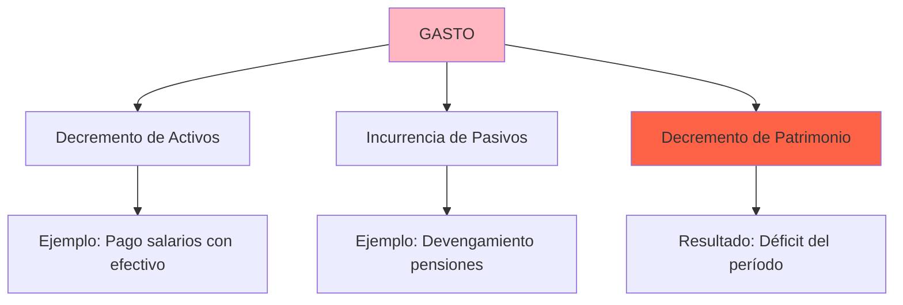
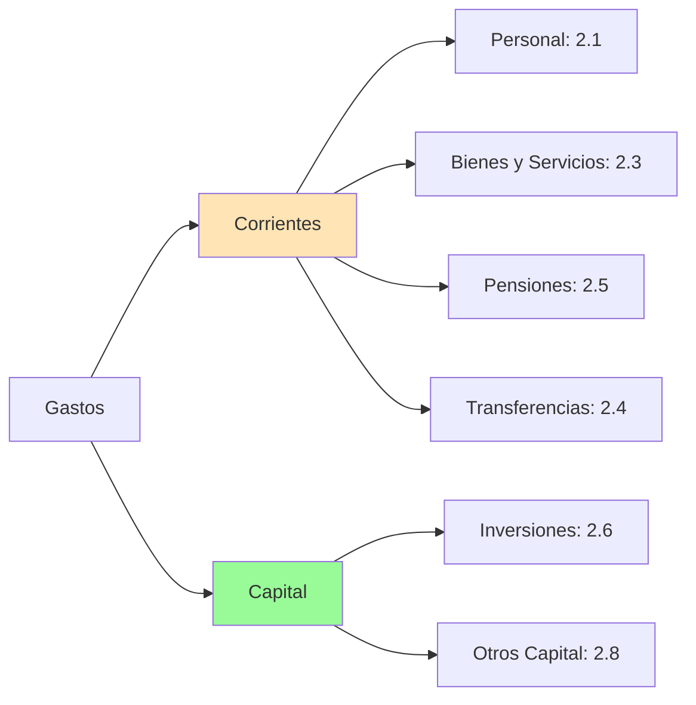
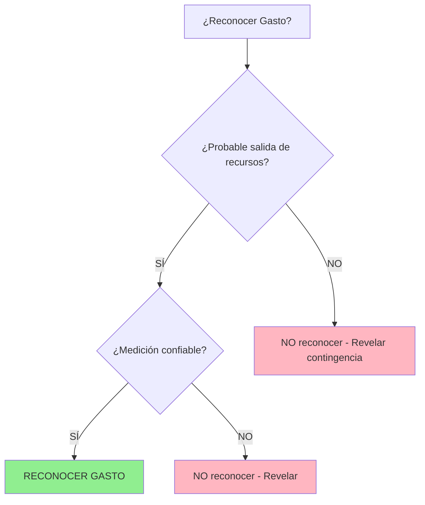

# Introducción al Reconocimiento de Gastos en el Sector Público

## Marco Conceptual de Gastos

### Definición (Marco Conceptual NICSP)

> **Gasto:** "Decrementos en los beneficios económicos o potencial de servicio durante el período contable en forma de **salidas** o **consumos de activos**, o **incurrencia de pasivos**, que resultan en decrementos del patrimonio **distintos** a distribuciones a los propietarios."
>
> **Fuente:** Marco Conceptual NICSP, párrafo 7.10

---

### Elementos Constitutivos del Gasto



**Exclusión:** Distribuciones a propietarios (no aplicable en mayoría de entidades públicas).

---

## Base de Acumulación (Devengado)

### Principio Fundamental (NICSP 1.27)

> "Las entidades del sector público prepararán sus estados financieros bajo **base de acumulación** (devengado), excepto para información de flujos de efectivo."

**Implicancia para gastos:**  
Los gastos se reconocen cuando **se incurren** (criterio económico), **no cuando se pagan** (criterio financiero).

---

### Comparación: Devengado vs Percibido

| Concepto              | Base Devengado (NICSP)              | Base Percibido (Presupuesto)      |
| --------------------- | ----------------------------------- | --------------------------------- |
| **Reconocimiento**    | Al incurrir obligación              | Al pagar efectivo                 |
| **Ejemplo salarios**  | Reconoce al final del mes trabajado | Reconoce cuando deposita planilla |
| **Estado Financiero** | Estado de Resultado Financiero      | Estado de Ejecución Presupuestal  |
| **Enfoque**           | Económico (recursos consumidos)     | Financiero (caja)                 |

**Coexistencia en Perú:** Entidades públicas mantienen **dos sistemas paralelos** (contable NICSP + presupuestal).

---

## Clasificación de Gastos en Sector Público

### 1. Por Naturaleza (Clasificador de Gastos - MEF)



**Referencia:** MEF (2023). _Clasificador de Gastos_ (Resolución Directoral).

---

### 2. Por Función (COFOG - ONU)

| Código | Función                      | Ejemplo Entidad Peruana              |
| ------ | ---------------------------- | ------------------------------------ |
| **01** | Servicios Públicos Generales | Presidencia del Consejo de Ministros |
| **02** | Defensa                      | Ministerio de Defensa                |
| **03** | Orden Público y Seguridad    | Ministerio del Interior              |
| **04** | Asuntos Económicos           | Ministerio de Economía               |
| **05** | Protección Ambiental         | MINAM                                |
| **06** | Vivienda                     | Ministerio de Vivienda               |
| **07** | Salud                        | MINSA, EsSalud                       |
| **08** | Recreación y Cultura         | Ministerio de Cultura                |
| **09** | Educación                    | MINEDU                               |
| **10** | Protección Social            | MIDIS (Pensión 65, Juntos)           |

**Fuente:** ONU (2014). _Classification of the Functions of Government_ (COFOG).

---

## Normas NICSP Aplicables a Gastos

### Resumen de Normas

| NICSP        | Título                                      | Alcance                                         | Semana |
| ------------ | ------------------------------------------- | ----------------------------------------------- | ------ |
| **NICSP 39** | Beneficios a los Empleados                  | Salarios, CTS, pensiones, vacaciones            | 11     |
| **NICSP 42** | Beneficios Sociales                         | Programas no contributivos (Pensión 65, Juntos) | 11     |
| **NICSP 48** | Gastos por Transferencias (nueva)           | Donaciones, subvenciones otorgadas              | 12     |
| NICSP 17     | Propiedades, Planta y Equipo                | Depreciación (gasto no monetario)               | -      |
| NICSP 31     | Activos Intangibles                         | Amortización                                    | -      |
| NICSP 19     | Provisiones, Pasivos y Activos Contingentes | Provisiones (litigios, desmantelamiento)        | -      |

**Enfoque de la unidad:** NICSP 39, 42, 48 (específicas de gastos).

---

## Criterios de Reconocimiento de Gastos (Marco Conceptual)

### Condiciones para Reconocer un Gasto:



**Referencia:** Marco Conceptual NICSP, párrafos 7.11-7.12

---

### Ejemplo: Litigio Laboral

**Escenario:** Hospital público enfrenta demanda de ex-empleado por despido arbitrario. Reclamo: S/ 80,000. Abogado estima 70% probabilidad de perder.

**Análisis:**

| Criterio                      | Evaluación                           |
| ----------------------------- | ------------------------------------ |
| ¿Probable salida de recursos? | **SÍ** (70% > 50%)                   |
| ¿Medición confiable?          | **SÍ** (S/ 80,000 estimado)          |
| **Conclusión**                | **Reconocer provisión de S/ 80,000** |

**Asiento:**

```
DEBE: Gasto - Provisión Litigio       80,000
HABER: Provisión Litigio (Pasivo)      80,000
```

**Si probabilidad fuera 40%:** NO reconocer gasto, solo **revelar** pasivo contingente en notas.

---

## Tipos Especiales de Gastos en Sector Público

### 1. Gastos de Personal (NICSP 39)

**Componentes:**

| Tipo                  | Descripción                  | Ejemplo Perú                          |
| --------------------- | ---------------------------- | ------------------------------------- |
| **Corto plazo**       | Pagaderos dentro de 12 meses | Salarios, gratificaciones, aguinaldos |
| **Post-empleo**       | Después de cese              | Pensiones ONP/AFP, CTS                |
| **Otros largo plazo** | Durante empleo, > 12 meses   | Licencias sabáticas acumuladas        |
| **Terminación**       | Por fin de relación          | Indemnizaciones por despido           |

**Detalle:** Ver [[ipsas-39-beneficios-empleados]]

---

### 2. Beneficios Sociales (NICSP 42)

**Definición:**

> "Transferencias en efectivo o en especie a individuos/hogares **sin contraprestación** directa, para proteger contra **riesgos sociales** (vejez, discapacidad, pobreza)."
>
> **Fuente:** NICSP 42, párrafo 8

**Ejemplos Perú:**

- **Pensión 65:** S/ 250/mes a adultos mayores en pobreza extrema
- **Juntos:** Transferencia condicionada a familias pobres
- **Qali Warma:** Alimentación escolar

**Detalle:** Ver [[ipsas-42-beneficios-sociales]]

---

### 3. Gastos por Transferencias (NICSP 48 - nueva)

**Definición:**

> "Transacción donde una entidad proporciona bienes/servicios/efectivo a otra sin recibir **contraprestación equivalente** directamente a cambio."
>
> **Fuente:** NICSP 48, párrafo 9

**Ejemplos:**

- **Donaciones internacionales:** Perú dona ayuda humanitaria a Ecuador
- **Transferencias intergubernamentales:** MEF transfiere recursos a gobiernos regionales
- **Subvenciones:** Ministerio de Agricultura subsidia a pequeños agricultores

**Novedad:** NICSP 48 (vigente 2026) reconoce gasto cuando surge **obligación vinculante**, no cuando se paga.

**Detalle:** Ver [[ipsas-48-gastos-transferencias]]

---

## Medición de Gastos

### Principios Generales

| Base de Medición    | Aplicación                | Ejemplo                                     |
| ------------------- | ------------------------- | ------------------------------------------- |
| **Costo histórico** | Mayoría de transacciones  | Salarios pagados al monto acordado          |
| **Valor presente**  | Pasivos largo plazo       | Pensiones futuras descontadas               |
| **Valor razonable** | Transferencias en especie | Donación de medicamentos a valor de mercado |

**Referencia:** Marco Conceptual NICSP, Capítulo 7

---

### Ejemplo: Gasto por Depreciación

**Contexto:** Ambulancia comprada en S/ 150,000, vida útil 10 años, valor residual S/ 10,000.

**Cálculo (método lineal):**

$$
\text{Depreciación Anual} = \frac{150,000 - 10,000}{10} = S/ 14,000
$$

**Asiento anual:**

```
DEBE: Gasto - Depreciación Vehículos       14,000
HABER: Depreciación Acumulada Vehículos     14,000
```

**Naturaleza:** Gasto **no monetario** (no hay salida de efectivo, solo asignación del costo).

---

## Diferencia con Presupuesto: Caso Práctico

### Municipalidad de Miraflores - Diciembre 2024

**Transacciones:**

| Evento                        | Fecha       | Monto      |
| ----------------------------- | ----------- | ---------- |
| Salarios diciembre devengados | 31-dic      | S/ 500,000 |
| Pago de planilla              | 05-ene-2025 | S/ 500,000 |

---

**Registro Contable (NICSP - Devengado):**

```
31-dic-2024:
DEBE: Gasto - Salarios                   500,000
HABER: Cuentas por Pagar - Planillas      500,000
```

**Presupuesto (Percibido):**

```
05-ene-2025:
DEBE: Gasto Presupuestal - Personal      500,000
HABER: Caja                                500,000
```

---

**Comparación Estados Financieros 2024:**

| Estado                                     | Salarios 2024 | Base                       |
| ------------------------------------------ | ------------- | -------------------------- |
| **Estado de Resultado Financiero (NICSP)** | S/ 500,000    | Devengado (diciembre)      |
| **Estado de Ejecución Presupuestal**       | S/ 0          | Percibido (pagado en 2025) |

**Conclusión:** Diferencia temporal que se revierte en 2025.

---

## Revelaciones de Gastos (NICSP 1)

### Información Mínima Requerida

**Estado de Resultado Financiero debe incluir (NICSP 1.102):**

1. **Gastos de personal**
2. Depreciación y amortización
3. **Deterioro de activos**
4. Gastos financieros
5. **Transferencias** (grants)
6. Otros gastos por naturaleza o función

**Notas adicionales:**

- Naturaleza y monto de partidas inusuales
- Políticas contables para gastos complejos (pensiones, beneficios sociales)
- Desagregación de componentes de gastos (NICSP 1.107)

---

## Conexiones con Otras Normas y Temas

- [[ipsas-39-beneficios-empleados]] → Detalle de gastos de personal
- [[ipsas-42-beneficios-sociales]] → Programas sociales no contributivos
- [[ipsas-48-gastos-transferencias]] → Donaciones y transferencias otorgadas
- [[introduccion-ingresos]] → Enfoque complementario (ingresos vs gastos)
- [[marco-conceptual-nicsp]] → Definición y criterios de reconocimiento

---

## Resumen Ejecutivo

**Concepto Central:**  
Los **gastos** en el sector público son decrementos del patrimonio por consumo de recursos, reconocidos bajo **base de acumulación** (devengado) cuando es **probable** la salida de recursos y hay **medición confiable**, independientemente del momento de pago (diferenciándose del presupuesto).

**Clasificación:**  
Por naturaleza (corrientes/capital), por función (COFOG), por destino.

**Normas Específicas:**

- **NICSP 39:** Beneficios empleados (salarios, pensiones)
- **NICSP 42:** Beneficios sociales (Pensión 65, Juntos)
- **NICSP 48:** Gastos por transferencias (nueva, vigente 2026)

**Criterios de Reconocimiento:**

1. Probable salida de recursos (> 50%)
2. Medición confiable

**Siguiente Paso:** Profundizar en [[ipsas-39-beneficios-empleados]] para gastos de personal.

---

**Referencias Normativas:**

- IPSASB (2023). _Marco Conceptual para Información Financiera con Propósito General de las Entidades del Sector Público_. IPSASB.
- IPSASB (2023). _NICSP 1 - Presentación de Estados Financieros_. IPSASB.
- MEF (2023). _Clasificador de Gastos Públicos_. Ministerio de Economía y Finanzas del Perú.
- ONU (2014). _Classification of the Functions of Government (COFOG)_. Naciones Unidas.
