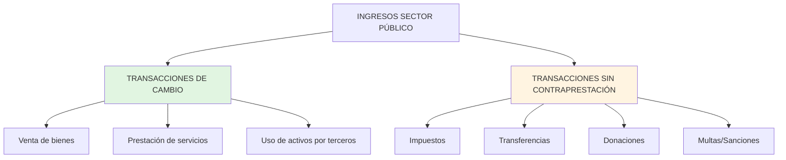

# Introducción al Reconocimiento de Ingresos en el Sector Público

## Concepto Central

El **reconocimiento de ingresos** en el sector público bajo IPSAS (NICSP en español) se basa en el **principio de base devengado** (accrual basis), registrando los ingresos cuando:

1. **Se devengan** (se cumplen los criterios de reconocimiento)
2. **NO cuando se cobran** (enfoque de caja)

**Diferencia clave con el sector privado:** El sector público recibe la mayoría de sus ingresos de **transacciones sin contraprestación** (impuestos, transferencias, donaciones), no de ventas de bienes/servicios.

---

## Marco Normativo IPSASB

| Norma        | Alcance                                                            | Vigencia                                       |
| ------------ | ------------------------------------------------------------------ | ---------------------------------------------- |
| **IPSAS 9**  | Ingresos por transacciones de **cambio** (exchange)                | Vigente (será reemplazada por IPSAS 47)        |
| **IPSAS 23** | Ingresos por transacciones **sin contraprestación** (non-exchange) | Vigente (será reemplazada por IPSAS 47)        |
| **IPSAS 47** | **Nueva norma unificada de ingresos** (modelo de 5 pasos)          | Efectiva 2026+ (adopción anticipada permitida) |

**Referencia normativa:** IPSASB Handbook 2023, disponible en [www.ipsasb.org](https://www.ipsasb.org)

---

## Clasificación de Transacciones de Ingresos

---

## Definiciones Clave (IPSAS 9 y 23)

### 1. Transacción de Cambio (Exchange Transaction)

> "Transacción en la cual una entidad recibe activos o servicios, o cancela pasivos, y **entrega directamente** a cambio un valor aproximadamente igual (principalmente en forma de bienes, servicios u otros activos)."
>
> **Fuente:** IPSAS 9, párrafo 7

**Ejemplo:** Ministerio de Salud vende servicios de análisis de laboratorio a una empresa privada por S/ 5,000. Hay contraprestación directa.

### 2. Transacción Sin Contraprestación (Non-Exchange Transaction)

> "Transacción en la cual una entidad recibe activos o servicios, o cancela pasivos, **sin entregar** directamente a cambio un valor aproximadamente igual."
>
> **Fuente:** IPSAS 23, párrafo 7

**Ejemplo:** Gobierno recibe S/ 10 millones en impuesto a la renta. Los contribuyentes NO reciben un bien/servicio equivalente directo.

---

## Criterios de Reconocimiento (IPSAS 9 y 23)

### Criterios Generales para Reconocer Ingreso:

| Criterio               | Descripción                                                       | Referencia        |
| ---------------------- | ----------------------------------------------------------------- | ----------------- |
| **Probabilidad**       | Es probable que beneficios económicos futuros fluyan a la entidad | IPSAS 9.18, 23.31 |
| **Medición confiable** | El importe del ingreso puede medirse con fiabilidad               | IPSAS 9.18, 23.31 |
| **Control del activo** | La entidad obtiene control del activo (solo IPSAS 23)             | IPSAS 23.31(a)    |

**Importante:** En transacciones SIN contraprestación, el **control del activo** es el disparador inicial del reconocimiento (ej. cuando el efectivo de impuestos ingresa a cuentas del Tesoro Público).

---

## Momento del Reconocimiento: Ejemplo Comparativo

| Evento                        | Transacción de Cambio (IPSAS 9)                                  | Sin Contraprestación (IPSAS 23)                          |
| ----------------------------- | ---------------------------------------------------------------- | -------------------------------------------------------- |
| **Tipo**                      | Universidad pública cobra matrícula S/ 500                       | Gobierno recibe donación S/ 1M                           |
| **Momento de reconocimiento** | Cuando se transfiere el servicio educativo (durante el semestre) | Cuando obtiene control del efectivo (fecha de recepción) |
| **Condiciones**               | Obligación de prestar servicio educativo                         | Si hay condiciones, puede ser pasivo inicialmente        |
| **Base normativa**            | IPSAS 9.19-25                                                    | IPSAS 23.31-43                                           |

---

## Condiciones vs Restricciones (IPSAS 23)

**Distinción crítica** que afecta el reconocimiento:

### Condiciones (Conditions)

- **Definición:** Estipulaciones que especifican el **uso del activo** y requieren su **devolución** si no se cumplen.
- **Efecto contable:** Generan un **pasivo** (obligación presente).
- **Ejemplo:** Donación de S/ 500,000 para construir hospital. Si no se construye en 2 años, debe devolverse → **Pasivo: "Ingresos Diferidos"** hasta cumplir condición.

### Restricciones (Restrictions)

- **Definición:** Estipulaciones que limitan el uso del activo pero **NO requieren devolución**.
- **Efecto contable:** **NO generan pasivo**. Se reconoce ingreso inmediatamente.
- **Ejemplo:** Transferencia de S/ 200,000 "para educación". No hay devolución si se usa en otro sector → **Ingreso inmediato** + revelación en notas.

**Referencia:** IPSAS 23, párrafos 44-50

---

## Impuestos: Caso Especial (IPSAS 23)

### Reconocimiento de Ingresos Tributarios

**Principio:** Se reconoce ingreso cuando:

1. **Evento imponible** ha ocurrido (ej. generación de renta gravable)
2. Gobierno tiene **derecho exigible** (liquidación o autoliquidación)
3. Es **probable** el cobro

**Ejemplo: Impuesto a la Renta en Perú**

| Fecha      | Evento                                                 | Reconocimiento Contable                        |
| ---------- | ------------------------------------------------------ | ---------------------------------------------- |
| 31/12/2024 | Cierre de ejercicio fiscal (evento imponible)          | **No hay reconocimiento aún**                  |
| Marzo 2025 | Contribuyente declara renta anual S/ 50,000 (DJ SUNAT) | **Reconocer ingreso devengado S/ 50,000**      |
| Abril 2025 | Pago efectivo del impuesto                             | Baja de cuenta por cobrar, ingreso de efectivo |

**Referencia:** IPSAS 23, párrafos 57-62 (Taxation Revenue)

---

## Medición Inicial de Ingresos

### IPSAS 9 (Cambio)

- **Valor razonable** de la contraprestación recibida o por recibir
- Neto de descuentos, devoluciones y rebajas

### IPSAS 23 (Sin Contraprestación)

- **Valor razonable** del activo recibido en fecha de adquisición
- Valuación técnica si no hay valor de mercado (ej. donación de terreno → tasación)

---

## Transición a IPSAS 47 (Nueva Norma)

### Cambios Principales:

| Aspecto        | IPSAS 9/23 (Actual)                       | IPSAS 47 (Nueva)                                      |
| -------------- | ----------------------------------------- | ----------------------------------------------------- |
| **Modelo**     | Separado (cambio vs sin contraprestación) | **Unificado:** modelo de 5 pasos (similar IFRS 15)    |
| **Enfoque**    | Basado en tipo de transacción             | Basado en **obligación de desempeño**                 |
| **Aplicación** | 2 normas diferentes                       | **1 norma** para todos los ingresos                   |
| **Vigencia**   | Actual                                    | Efectiva 1 enero 2026 (adopción anticipada permitida) |

**Nota pedagógica:** Los estudiantes deben conocer IPSAS 9/23 (aún vigentes) y prepararse para IPSAS 47 (futuro cercano).

---

## Revelaciones Clave (IPSAS 9 y 23)

Las entidades deben revelar en notas a los estados financieros:

1. **Políticas contables** de reconocimiento de ingresos por tipo
2. **Importes de ingresos** por categoría principal
3. **Ingresos diferidos** (pasivos por condiciones incumplidas)
4. **Activos sujetos a restricciones** (sin afectar reconocimiento)
5. **Ingresos tributarios pendientes de cobro** y estimación de incobrabilidad

---

## Ejemplo Integrado: Ministerio de Educación

### Escenario:

El Ministerio de Educación (MINEDU) tiene las siguientes transacciones en enero 2025:

1. **Venta de libros** a colegios privados: S/ 80,000 (cambio)
2. **Recaudación IGV educación:** S/ 15,000,000 (impuesto, sin contraprestación)
3. **Donación de BID** para programa de alfabetización: USD 500,000 con condición de ejecutar en 12 meses
4. **Transferencia MEF** para gasto corriente: S/ 50,000,000 (sin restricción)

### Reconocimiento Contable:

| Transacción       | Clasificación                          | Reconocimiento                                          | Norma       |
| ----------------- | -------------------------------------- | ------------------------------------------------------- | ----------- |
| Venta libros      | Cambio                                 | Ingreso S/ 80,000 al transferir libros                  | IPSAS 9     |
| IGV recaudado     | Impuesto (sin contraprestación)        | Ingreso S/ 15M al recibir efectivo                      | IPSAS 23    |
| Donación BID      | Sin contraprestación con **condición** | **Pasivo** "Ingresos Diferidos" hasta ejecutar programa | IPSAS 23.44 |
| Transferencia MEF | Sin contraprestación sin condición     | Ingreso S/ 50M inmediato                                | IPSAS 23    |

---

## Conexiones con Otras Unidades

- [[marco-conceptual-nicsp]] → Define activo, pasivo, ingreso
- [[base-devengado-sector-publico]] → Base de reconocimiento
- [[ipsas-9-ingresos-cambio]] → Profundización transacciones de cambio
- [[ipsas-23-ingresos-sin-contraprestacion]] → Profundización sin contraprestación
- [[ipsas-47-ingresos]] → Nueva norma unificada
- [[objetivos-estados-financieros-sector-publico]] → Información útil para usuarios

---

## Resumen Ejecutivo

**Tesis Central:**  
El reconocimiento de ingresos en el sector público requiere distinguir entre **transacciones de cambio** (IPSAS 9: venta de bienes/servicios) y **sin contraprestación** (IPSAS 23: impuestos, donaciones), aplicando el principio de **base devengado** y evaluando **condiciones** vs **restricciones** que afectan el momento del reconocimiento.

**Cadena Lógica:**  
Transacción → Clasificar (cambio/sin contraprestación) → Evaluar criterios de reconocimiento → Identificar condiciones → Reconocer ingreso o pasivo → Medir a valor razonable → Revelar en notas.

**Siguiente Paso:** Profundizar en [[ipsas-9-ingresos-cambio]] y [[ipsas-23-ingresos-sin-contraprestacion]].

---

**Referencias Normativas:**

- IPSASB (2023). _IPSAS 9 - Revenue from Exchange Transactions_. International Public Sector Accounting Standards Board.
- IPSASB (2023). _IPSAS 23 - Revenue from Non-Exchange Transactions (Taxes and Transfers)_. IPSASB.
- IPSASB (2023). _IPSAS 47 - Revenue_ (efectiva 2026). IPSASB.
- MEF Perú (2024). Directiva de Contabilidad Gubernamental. www.mef.gob.pe
