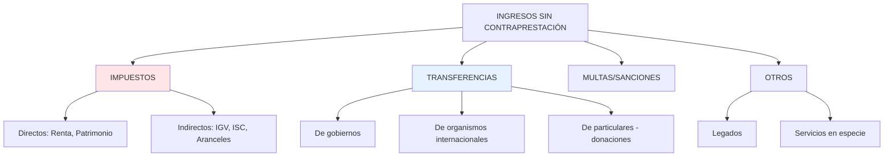
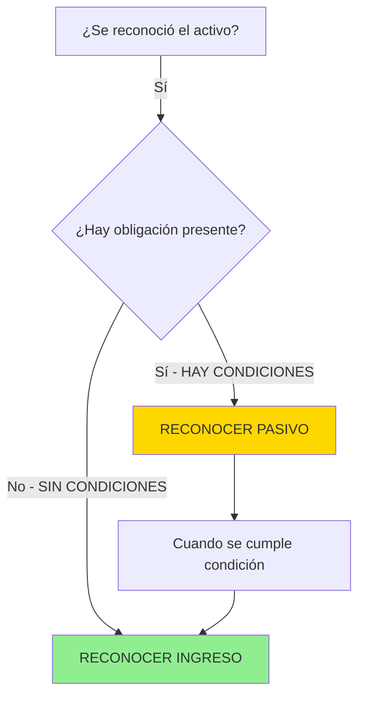
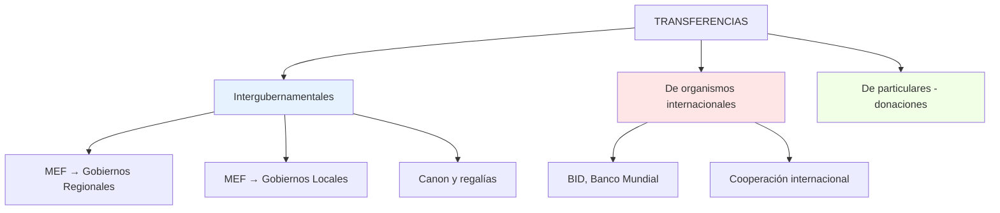

# IPSAS 23 - Ingresos por Transacciones Sin Contraprestación

## Marco Normativo

**Norma:** IPSAS 23 - _Revenue from Non-Exchange Transactions (Taxes and Transfers)_  
**Emitida por:** IPSASB (International Public Sector Accounting Standards Board)  
**Fecha emisión original:** Diciembre 2006 (revisada 2023)  
**Vigencia:** Actualmente vigente (será parcialmente reemplazada por IPSAS 47 a partir de 2026)  
**Base:** Norma original del IPSASB (no basada en IFRS, ya que sector privado no tiene equivalente)

**Referencia:** IPSASB Handbook 2023, IPSAS 23, disponible en www.ipsasb.org

---

## Objetivo de la Norma

> "Prescribir los requisitos para el reconocimiento y medición de ingresos provenientes de **transacciones sin contraprestación** (non-exchange transactions), incluyendo la identificación de contribuciones de los propietarios."
>
> **Fuente:** IPSAS 23, Objetivo

**Alcance:** Aplica principalmente a:

1. **Impuestos** (income tax, VAT, property tax, etc.)
2. **Transferencias** (subvenciones, donaciones, condonaciones de deuda)
3. **Multas y sanciones**
4. **Legados y herencias** al Estado
5. **Servicios en especie** (bienes recibidos gratis)

**Exclusiones:**

- Transacciones de cambio (IPSAS 9)
- Contribuciones de propietarios (aportaciones de capital)

---

## Definición Fundamental: Transacción Sin Contraprestación


> **Transacción Sin Contraprestación:** "Transacción en la cual una entidad recibe activos o servicios, o cancela pasivos, **sin entregar** directamente a cambio un valor aproximadamente igual."
>
> **Fuente:** IPSAS 23, párrafo 7

**Característica esencial:** **NO hay contraprestación directa y proporcional**.

---

## Tipos de Ingresos Sin Contraprestación

### Clasificación Principal:



---

## Reconocimiento de Ingresos: Criterios Generales

### Enfoque de Dos Etapas (IPSAS 23.31)

El reconocimiento sigue un proceso en **dos pasos**:

#### **PASO 1: Reconocer el Activo**

Un activo se reconoce cuando la entidad:

1. **Obtiene control** del recurso (definición de activo del Marco Conceptual)
2. Es **probable** que fluyan beneficios económicos futuros
3. El **valor razonable** puede medirse fiablemente

#### **PASO 2: Reconocer el Ingreso (o Pasivo)**



**Regla de Oro (IPSAS 23.31):**

> El ingreso se reconoce cuando:
>
> 1. La entidad cumple con una **obligación presente** (reconocida como pasivo), O
> 2. **Directamente** al obtener control del activo (si NO hay obligación presente)

---

## Concepto Crítico: Condiciones vs Restricciones

Esta distinción **determina el momento del reconocimiento**.

### CONDICIONES (Conditions)

**Definición (IPSAS 23.44):**

> "Estipulaciones que especifican que los recursos se consumirán en una forma particular o se **devolverán** si no se cumplen las especificaciones."

**Características:**

- Especifican **uso obligatorio** del recurso
- Requieren **devolución** si no se cumplen
- **Generan pasivo** (obligación presente)

**Efecto contable:**

```
Al recibir recurso:
DEBE: Efectivo/Activo                    XXX
HABER: Pasivo - Ingresos Diferidos        XXX

Al cumplir condición:
DEBE: Pasivo - Ingresos Diferidos        XXX
HABER: Ingresos                           XXX
```

**Ejemplos:**

| Condición                                                                         | Pasivo Inicial | Ingreso                        |
| --------------------------------------------------------------------------------- | -------------- | ------------------------------ |
| Donación S/ 2M para construir hospital en 3 años (devolución si no se construye)  | S/ 2M          | Cuando se construye hospital   |
| Transferencia S/ 500K para capacitar 1,000 docentes (reembolso si no se capacita) | S/ 500K        | Conforme se capacitan docentes |
| Subvención S/ 1M para comprar ambulancias (retornar si no se compran)             | S/ 1M          | Cuando se compran ambulancias  |

---

### RESTRICCIONES (Restrictions)

**Definición (IPSAS 23.45):**

> "Estipulaciones que limitan o dirigen el uso del activo pero **NO requieren devolución** del recurso si no se cumplen."

**Características:**

- Limitan uso del recurso
- **NO requieren devolución**
- **NO generan pasivo**
- Se revelan en notas

**Efecto contable:**

```
Al recibir recurso:
DEBE: Efectivo/Activo                    XXX
HABER: Ingresos                           XXX
(+ Revelación en notas del uso restringido)
```

**Ejemplos:**

| Restricción                                           | Reconocimiento            | Revelación                           |
| ----------------------------------------------------- | ------------------------- | ------------------------------------ |
| Donación S/ 300K "para sector salud" (sin devolución) | Ingreso inmediato S/ 300K | Nota: "Donación restringida a salud" |
| Transferencia S/ 100K "para programas educativos"     | Ingreso inmediato S/ 100K | Nota: "Uso destinado a educación"    |

---

### Tabla Comparativa: Condiciones vs Restricciones

**PEDAGOGÍA CRÍTICA: Esta es LA distinción más importante de IPSAS 23**

La confusión entre condiciones y restricciones es la **fuente #1 de errores** en aplicación de IPSAS 23.

**Pregunta socrática clave:**  
Si NO cumples la estipulación, ¿qué pasa?

- **Condición:** Debes **DEVOLVER** el dinero → Pasivo
- **Restricción:** Solo debes **REPORTAR/JUSTIFICAR** → Ingreso (sin pasivo)

**Analogía del mundo real:**

- **Condición:** Préstamo hipotecario (si no pagas, banco se queda con casa = **reversible**)
- **Restricción:** Beca universitaria "para libros" (si compras café en vez de libros, solo te regañan, no devuelves = **irreversible**)

**Test práctico (3 preguntas):**

1. **¿Hay cláusula de reversión?**
   - SÍ → Condición
   - NO → Restricción

2. **¿El transferente puede exigir devolución legalmente?**
   - SÍ → Condición
   - NO (solo pide reporte) → Restricción

3. **¿El contrato dice "reembolsable" o "devolución"?**
   - SÍ → Condición
   - Dice solo "destinado a" → Restricción

| Aspecto                       | Condiciones                     | Restricciones                    |
| ----------------------------- | ------------------------------- | -------------------------------- |
| **Devolución obligatoria**    | **SÍ** (si no se cumple)        | **NO**                           |
| **Genera pasivo**             | **SÍ**                          | **NO**                           |
| **Reconocimiento de ingreso** | **Diferido** (cuando se cumple) | **Inmediato**                    |
| **Revelación**                | Sí (pasivo + naturaleza)        | Sí (naturaleza de restricción)   |
| **Ejemplo**                   | "Construir hospital o devolver" | "Usar en salud" (sin devolución) |

**Referencia:** IPSAS 23, párrafos 44-50

---

## Ingresos Tributarios: Tratamiento Específico

### Definición de Impuesto (IPSAS 23.7)

> "Beneficios económicos obligados por ley a pagar a entidades gubernamentales, de acuerdo con leyes y regulaciones establecidas, **sin recibir servicios específicos directamente equivalentes** a cambio."

### Reconocimiento de Impuestos (IPSAS 23.57)

**Principio:** Se reconoce ingreso cuando:

1. **Evento imponible** ha ocurrido (taxable event)
2. Gobierno tiene **derecho exigible** de cobro
3. Es **probable** que el recurso fluya
4. El importe puede **medirse fiablemente**

---

### Tipos de Impuestos y Momento de Reconocimiento

#### A. Impuestos Directos

**Ejemplo 1: Impuesto a la Renta (Perú)**

| Etapa                   | Fecha      | Evento                            | Reconocimiento             |
| ----------------------- | ---------- | --------------------------------- | -------------------------- |
| **1. Evento imponible** | 31/12/2024 | Cierre de ejercicio fiscal        | **NO** reconocer aún       |
| **2. Autodeclaración**  | Marzo 2025 | Contribuyente declara renta anual | **SÍ - Reconocer ingreso** |
| **3. Pago**             | Abril 2025 | Contribuyente paga                | Baja cuenta por cobrar     |

**Asiento (Marzo 2025):**

```
DEBE: Cuentas por Cobrar - Impuesto Renta    5,000,000
HABER: Ingresos Tributarios - Renta           5,000,000
```

**Ejemplo 2: Impuesto Predial (Municipal)**

| Etapa                | Fecha        | Evento                                  | Reconocimiento                   |
| -------------------- | ------------ | --------------------------------------- | -------------------------------- |
| **Determinación**    | 1 enero 2025 | Inicio de año fiscal (evento imponible) | **SÍ - Reconocer ingreso anual** |
| **Pago fraccionado** | Trimestral   | Contribuyente paga cuotas               | Baja parcial cuenta por cobrar   |

**Asiento (1 enero 2025):**

```
DEBE: Cuentas por Cobrar - Predial         12,000,000
HABER: Ingresos Tributarios - Predial        12,000,000
```

---

#### B. Impuestos Indirectos

**Ejemplo: IGV (Impuesto General a las Ventas - Perú)**

**Características:**

- Recaudado **continuamente** (con cada transacción)
- Evento imponible: venta de bien/servicio
- Reconocimiento: cuando se recauda o devenga según declaraciones

**Flujo mensual:**


**Asiento (declaración mensual agregada):**

```
DEBE: Cuentas por Cobrar - IGV             850,000,000
HABER: Ingresos Tributarios - IGV            850,000,000
```

---

### Estimación de Incobrabilidad (IPSAS 23.64)

**Principio:** Reconocer ingreso por el **importe bruto** y **estimación separada** de incobrabilidad (similar a IPSAS 41 - Instrumentos Financieros).

**Ejemplo:**

```
Impuesto determinado:           S/ 100,000,000
Estimación de incobrabilidad:   S/   5,000,000 (5%)

Asiento:
DEBE: Cuentas por Cobrar - Impuestos      100,000,000
HABER: Ingresos Tributarios                100,000,000

DEBE: Gasto - Deterioro Cuentas Cobrar      5,000,000
HABER: Provisión Deterioro                   5,000,000
```

**Ingreso neto presentado:** S/ 95,000,000 (en Estado de Rendimiento Financiero)

---

## Transferencias: Tratamiento Contable

### Tipos de Transferencias en el Sector Público Peruano



---

### Reconocimiento de Transferencias

**Análisis de 4 Pasos:**

```
PASO 1: ¿Se obtuvo control del activo?
   ↓ SÍ
PASO 2: ¿Hay estipulaciones?
   ↓ SÍ
PASO 3: ¿Son CONDICIONES (requieren devolución)?
   ↓ SÍ → PASIVO | NO → RESTRICCIÓN
PASO 4: Reconocer INGRESO al cumplir condición (si había pasivo)
        o INMEDIATAMENTE (si solo hay restricción)
```

---

### Caso 1: Transferencia Sin Condiciones (Reconocimiento Inmediato)

**Escenario:** MEF transfiere S/ 10,000,000 a Gobierno Regional Cusco para "gasto corriente general".

**Análisis:**

- ¿Hay condición de devolución? **NO**
- ¿Hay restricción específica? **NO** (gasto corriente general)

**Reconocimiento (Gobierno Regional Cusco):**

```
DEBE: Efectivo                              10,000,000
HABER: Ingresos - Transferencias MEF         10,000,000
```

---

### Caso 2: Transferencia Con Condición (Reconocimiento Diferido)

**Escenario:** BID dona USD 2,000,000 (S/ 7,600,000) a Ministerio de Educación para implementar plataforma digital educativa en 18 meses. Si no se implementa, debe devolverse.

**Análisis:**

- ¿Hay condición? **SÍ** (implementar plataforma o devolver)
- ¿Genera pasivo? **SÍ**

**Reconocimiento Inicial:**

```
DEBE: Efectivo                               7,600,000
HABER: Pasivo - Ingresos Diferidos            7,600,000
```

**Reconocimiento Progresivo (ejemplo: 40% completado a los 8 meses):**

```
DEBE: Pasivo - Ingresos Diferidos            3,040,000
HABER: Ingresos - Donaciones                  3,040,000
```

**Al completar proyecto (100%):**

```
DEBE: Pasivo - Ingresos Diferidos            4,560,000
HABER: Ingresos - Donaciones                  4,560,000
```

---

### Caso 3: Transferencia Con Restricción (Reconocimiento Inmediato)

**Escenario:** ONG dona S/ 500,000 a hospital público "para compra de equipos médicos" (sin requerimiento de devolución).

**Análisis:**

- ¿Hay condición de devolución? **NO**
- ¿Hay restricción de uso? **SÍ** (solo equipos médicos)
- ¿Genera pasivo? **NO** (IPSAS 23.45)

**Reconocimiento:**

```
DEBE: Efectivo                                 500,000
HABER: Ingresos - Donaciones                   500,000
```

**Revelación en Notas:**

> "Se recibió donación de S/ 500,000 restringida para adquisición de equipos médicos."

---

## Servicios en Especie (IPSAS 23.94-101)

### Definición

> "Servicios **no financieros** prestados gratuitamente a la entidad por individuos u otras entidades."

**Ejemplos:**

- Voluntarios en hospitales públicos
- Asesoría legal pro bono a municipalidades
- Docentes ad honorem en universidades públicas

---

### Reconocimiento (Opcional)

**IPSAS 23.98:** La entidad **puede elegir** reconocer servicios en especie como:

- **Ingreso** (valor razonable del servicio)
- **Gasto** (simultáneamente, por consumo del servicio)

**Condición:** Solo si el **valor razonable** puede medirse fiablemente.

**Ejemplo: Voluntariado Médico**

Un médico especialista dona 100 horas de consultas (valor mercado: S/ 200/hora).

**Si la entidad elige reconocer:**

```
DEBE: Gasto - Servicios Profesionales        20,000
HABER: Ingresos - Servicios en Especie         20,000
```

**Si NO reconoce:** Solo **revelación en notas**.

---

## Activos Recibidos en Donación

### Reconocimiento y Medición

**Principio (IPSAS 23.42):**

- Reconocer activo al **valor razonable** en fecha de adquisición
- Si hay condición → Pasivo (ingresos diferidos)
- Si NO hay condición → Ingreso inmediato

---

### Ejemplo: Donación de Terreno

**Escenario:** Empresa privada dona terreno a Municipalidad de Lima (tasación: S/ 5,000,000) para construir parque público. Si no se construye parque en 5 años, terreno revierte a donante.

**Análisis:**

- Activo: Terreno S/ 5,000,000 (valor razonable)
- Condición: Construir parque o devolver → **Pasivo**

**Reconocimiento:**

```
DEBE: Activo - Terrenos                      5,000,000
HABER: Pasivo - Ingresos Diferidos            5,000,000
```

**Al construir parque:**

```
DEBE: Pasivo - Ingresos Diferidos            5,000,000
HABER: Ingresos - Donaciones de Capital       5,000,000
```

**Nota:** El parque construido es un activo separado (IPSAS 17 - Propiedad, Planta y Equipo).

---

## Multas y Sanciones

### Reconocimiento

**Características:**

- Transacción **sin contraprestación** (IPSAS 23.7)
- Evento imponible: **infracción cometida**
- Reconocimiento: cuando se **determina** la multa (resolución administrativa firme)

**Ejemplo: Multa OSINERGMIN**

| Fecha      | Evento                                        | Reconocimiento              |
| ---------- | --------------------------------------------- | --------------------------- |
| 15/05/2024 | Empresa incumple norma ambiental              | **NO** (aún no determinada) |
| 20/07/2024 | OSINERGMIN emite resolución: multa S/ 200,000 | **SÍ - Reconocer ingreso**  |
| 15/08/2024 | Empresa paga multa                            | Baja cuenta por cobrar      |

**Asiento (20/07/2024):**

```
DEBE: Cuentas por Cobrar - Multas             200,000
HABER: Ingresos - Multas y Sanciones           200,000
```

---

## Revelaciones (IPSAS 23.102-106)

### Obligatorias en Notas:

1. **Políticas contables** para reconocimiento de ingresos sin contraprestación
2. **Importe de ingresos** por tipo:
   - Impuestos (por categoría)
   - Transferencias
   - Donaciones
   - Multas
   - Otros
3. **Pasivos reconocidos** por condiciones no cumplidas
4. **Activos sujetos a restricciones** (naturaleza y cuantía)
5. **Servicios en especie** recibidos (si no se reconocen)

---

### Ejemplo de Revelación (extracto):

> **Nota 18: Ingresos por Transacciones Sin Contraprestación**
>
> La entidad reconoce ingresos tributarios cuando ocurre el evento imponible y se tiene derecho exigible de cobro. Las transferencias con condiciones de devolución se reconocen como pasivo hasta cumplir la condición.
>
> | Categoría              | 2024             | 2023             |
> | ---------------------- | ---------------- | ---------------- |
> | **Impuestos:**         |                  |                  |
> | - Impuesto a la Renta  | S/ 45,000 M      | S/ 42,000 M      |
> | - IGV                  | S/ 52,000 M      | S/ 48,500 M      |
> | - Aranceles            | S/ 3,200 M       | S/ 2,950 M       |
> | **Transferencias:**    |                  |                  |
> | - Del gobierno central | S/ 8,500 M       | S/ 7,800 M       |
> | - Donaciones           | S/ 450 M         | S/ 380 M         |
> | **Multas y sanciones** | S/ 1,200 M       | S/ 1,100 M       |
> | **Total**              | **S/ 110,350 M** | **S/ 102,730 M** |
>
> Al 31/12/2024, existen pasivos por ingresos diferidos de S/ 2,300 M correspondientes a donaciones con condición de ejecución de proyectos específicos.

---

## Diferencias con IPSAS 9 (Comparación Directa)

| Aspecto              | IPSAS 23 (Sin Contraprestación)            | IPSAS 9 (Cambio)                                 |
| -------------------- | ------------------------------------------ | ------------------------------------------------ |
| **Contraprestación** | **NO** hay intercambio directo equivalente | **SÍ** hay valor aproximadamente igual           |
| **Disparador**       | **Control del activo**                     | Transferencia de riesgos/beneficios              |
| **Condiciones**      | **Generan pasivo** (ingresos diferidos)    | Raramente (obligación de entregar bien/servicio) |
| **Restricciones**    | NO generan pasivo, solo revelación         | No aplica típicamente                            |
| **Ejemplos**         | Impuestos, donaciones, transferencias      | Venta de bienes/servicios                        |
| **Medición**         | Valor razonable del **activo recibido**    | Valor razonable de la **contraprestación**       |
| **Sector**           | **Predominante** en sector público         | Minoritario en sector público                    |

---

## Transición a IPSAS 47 (2026)

### Impacto en IPSAS 23:

| Aspecto                            | IPSAS 23 (Actual)                            | IPSAS 47 (Nueva)                                                                         |
| ---------------------------------- | -------------------------------------------- | ---------------------------------------------------------------------------------------- |
| **Alcance**                        | Todas las transacciones sin contraprestación | **Algunos ingresos sin contraprestación** se reclasifican si hay obligación de desempeño |
| **Impuestos**                      | IPSAS 23                                     | **Se mantiene en IPSAS 23** (fuera de IPSAS 47)                                          |
| **Transferencias con condiciones** | IPSAS 23 (modelo condición/restricción)      | **IPSAS 47** si hay obligación de desempeño (modelo de 5 pasos)                          |
| **Donaciones simples**             | IPSAS 23                                     | **Se mantiene en IPSAS 23**                                                              |

**Resumen:** IPSAS 23 se mantiene para **impuestos y transferencias simples**, pero algunas transferencias complejas migran a IPSAS 47.

---

## Ejemplo Integrado: Gobierno Regional de Arequipa

### Transacciones del mes (enero 2025):

1. **Recaudación canon minero** del MEF: S/ 15,000,000 (sin restricción)
2. **Transferencia MEF** para programa de nutrición infantil: S/ 3,000,000 (condición: atender 5,000 niños o devolver)
3. **Donación de ONG** para reforestación: S/ 800,000 (restricción: solo reforestación, sin devolución)
4. **Multas ambientales** determinadas: S/ 250,000
5. **Servicios de consultoría técnica** vendidos a municipalidades: S/ 120,000 (transacción de cambio)

### Clasificación y Reconocimiento:

| #   | Transacción             | Norma       | Tipo                        | Reconocimiento                                     |
| --- | ----------------------- | ----------- | --------------------------- | -------------------------------------------------- |
| 1   | Canon minero            | IPSAS 23    | Transferencia sin condición | **Ingreso S/ 15,000,000**                          |
| 2   | Transferencia nutrición | IPSAS 23    | Transferencia con condición | **Pasivo S/ 3,000,000** (ingreso al atender niños) |
| 3   | Donación reforestación  | IPSAS 23    | Donación con restricción    | **Ingreso S/ 800,000** + revelación                |
| 4   | Multas ambientales      | IPSAS 23    | Multas                      | **Ingreso S/ 250,000**                             |
| 5   | Consultoría             | **IPSAS 9** | Cambio                      | Ingreso S/ 120,000 (según % terminación)           |

### Asientos Contables:

```
1) Canon minero:
   DEBE: Efectivo                          15,000,000
   HABER: Ingresos - Transferencias MEF      15,000,000

2) Transferencia con condición:
   DEBE: Efectivo                           3,000,000
   HABER: Pasivo - Ingresos Diferidos        3,000,000

3) Donación reforestación:
   DEBE: Efectivo                             800,000
   HABER: Ingresos - Donaciones                800,000
   (Nota: Uso restringido a reforestación)

4) Multas:
   DEBE: Cuentas por Cobrar - Multas          250,000
   HABER: Ingresos - Multas                    250,000

5) Consultoría (IPSAS 9):
   DEBE: Cuentas por Cobrar                   120,000
   HABER: Ingresos - Servicios                 120,000
```

---

## Conexiones con Otras Normas

- [[introduccion-ingresos]] → Marco general de reconocimiento
- [[ipsas-9-ingresos-cambio]] → Complemento para transacciones con contraprestación
- [[ipsas-47-ingresos]] → Nueva norma que afectará algunas transferencias
- [[ipsas-48-gastos-transferencias]] → Enfoque espejo (quien transfiere vs quien recibe)
- [[marco-conceptual-nicsp]] → Definiciones de activo, pasivo, ingreso
- [[ipsas-17-propiedad-planta-equipo]] → Activos donados

---

## Resumen Ejecutivo

**Tesis Central:**  
IPSAS 23 regula ingresos por **transacciones sin contraprestación** (impuestos, transferencias, donaciones), reconociéndolos al **obtener control del activo**, evaluando si existen **condiciones** (que generan pasivo por ingresos diferidos) o solo **restricciones** (que NO afectan el reconocimiento inmediato).

**Distinción Crítica:**  
**Condiciones** (devolución obligatoria) → Pasivo → Ingreso diferido  
**Restricciones** (sin devolución) → Ingreso inmediato → Solo revelación

**Impuestos:**  
Reconocer cuando: Evento imponible + Derecho exigible + Probabilidad + Medición fiable

**Cadena Lógica:**  
Control del activo → Evaluar estipulaciones → Clasificar (condición/restricción) → Reconocer ingreso o pasivo → Medir a valor razonable → Revelar

**Siguiente Paso:** Profundizar en [[ipsas-47-ingresos]] (nueva norma unificada).

---

**Referencias Normativas:**

- IPSASB (2023). _IPSAS 23 - Revenue from Non-Exchange Transactions (Taxes and Transfers)_. IPSASB Handbook 2023.
- IPSASB (2023). _IPSAS 47 - Revenue_ (efectiva 2026). IPSASB.
- IPSASB (2023). _Marco Conceptual para la Información Financiera con Propósito General de las Entidades del Sector Público_. IPSASB.
- MEF Perú (2024). _Plan Contable Gubernamental_. www.mef.gob.pe
