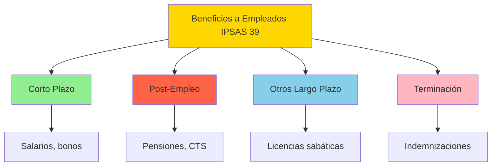
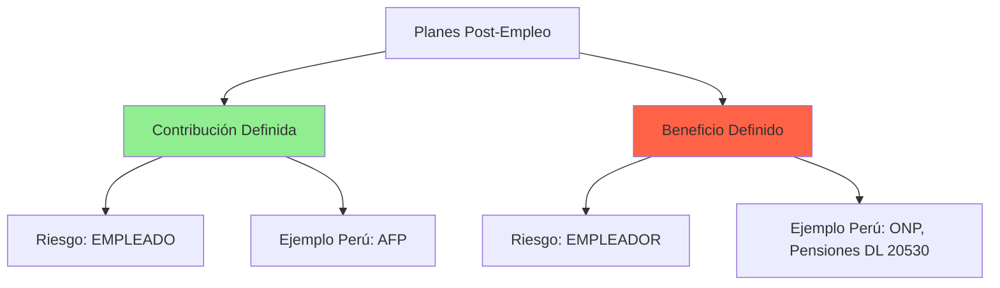
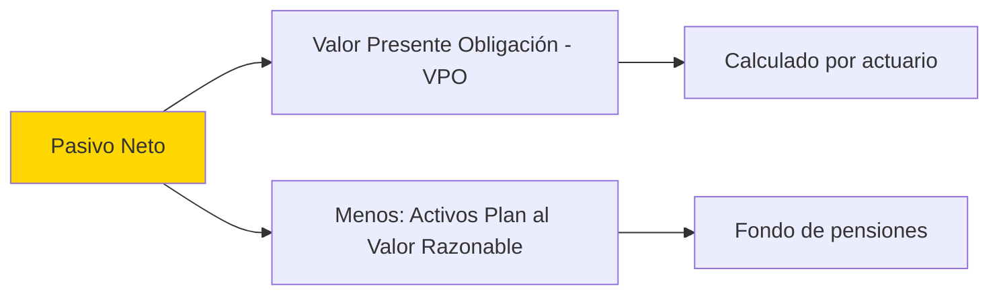
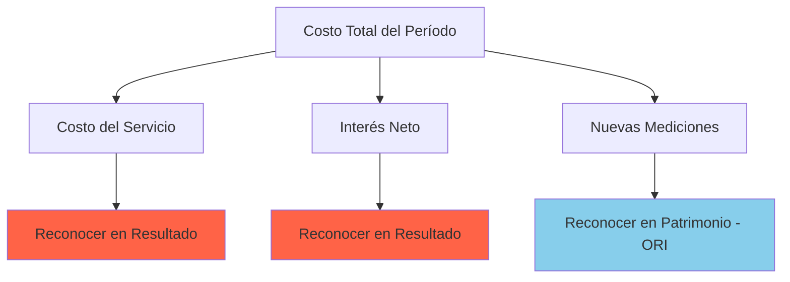

# IPSAS 39 - Beneficios a los Empleados

## Marco Normativo

**Norma:** IPSAS 39 - _Employee Benefits_  
**Emitida por:** IPSASB  
**Fecha emisión:** Julio 2018  
**Vigencia:** Períodos anuales iniciando 1 enero 2019 o después  
**Base:** IAS 19 - _Employee Benefits_ (sector privado)  
**Actualización:** Enmiendas 2021 (Plan Amendment, Curtailment or Settlement)

**Referencia:** IPSASB (2023). _IPSAS 39 - Employee Benefits_. IPSASB Handbook.

---

## Objetivo y Alcance

### Objetivo

> "Prescribir el tratamiento contable y revelación de **beneficios a los empleados**, requiriendo reconocer un **pasivo** cuando el empleado ha prestado servicios a cambio de beneficios futuros, y un **gasto** cuando la entidad consume el beneficio económico/potencial de servicio."
>
> **Fuente:** IPSAS 39, Objetivo

### Alcance - Beneficios Cubiertos (IPSAS 39.7)



**Exclusión:** Beneficios sociales a población general (ver [[ipsas-42-beneficios-sociales]]).

---

## 1. Beneficios de Corto Plazo (IPSAS 39.11-26)

### Definición

> "Beneficios (distintos de terminación) pagaderos **dentro de 12 meses** después del fin del período en que el empleado prestó servicio."
>
> **Fuente:** IPSAS 39.11

---

### Tipos Comunes en Sector Público Peruano

| Beneficio           | Descripción                   | Frecuencia Pago | Base Legal          |
| ------------------- | ----------------------------- | --------------- | ------------------- |
| **Remuneración**    | Salario mensual               | Mensual         | D.L. 276, 728, 1057 |
| **Gratificaciones** | Julio y diciembre             | Semestral       | Ley 27735           |
| **Aguinaldo**       | Fiestas Patrias/Navidad       | Anual           | D.S. 061-89-PCM     |
| **Bonificaciones**  | Por desempeño, antigüedad     | Variable        | Diversos            |
| **Vacaciones**      | 30 días/año                   | Anual           | D.L. 713            |
| **CTS**             | Compensación tiempo servicios | Semestral       | D.S. 001-97-TR      |

**Referencia Perú:** SERVIR (2023). _Régimen del Servicio Civil_.

---

### Reconocimiento y Medición (IPSAS 39.12-14)

**Principio:**

$$
\text{Gasto (o Activo)} = \text{Monto NO descontado esperado a pagar}
$$

**Sin descuento** porque se paga dentro de 12 meses.

---

### Ejemplo 1: Gratificaciones - Hospital Nacional Cayetano Heredia

**Contexto:** Hospital tiene 500 empleados, remuneración promedio S/ 4,000/mes. Gratificación = 1 remuneración en julio y diciembre.

**Cálculo:**

$$
\text{Gasto Anual Gratificaciones} = 500 \times 4,000 \times 2 = S/ 4,000,000
$$

**Devengo mensual:**

$$
\text{Devengo Mensual} = \frac{4,000,000}{12} = S/ 333,333
$$

**Asiento mensual (enero-junio):**

```
DEBE: Gasto - Beneficios Corto Plazo       333,333
HABER: Provisión Gratificaciones             333,333
```

**Pago julio:**

```
DEBE: Provisión Gratificaciones           2,000,000
HABER: Caja/Bancos                         2,000,000
```

---

### Ejemplo 2: Vacaciones Acumuladas - Municipalidad de Cusco

**Contexto:** Funcionario tiene derecho a 30 días vacaciones/año (D.L. 713). Salario diario S/ 200. Al 31-dic-2024, tiene 15 días acumulados no tomados.

**Pasivo por Vacaciones:**

$$
\text{Provisión} = 15 \text{ días} \times S/ 200 = S/ 3,000
$$

**Asiento 31-dic-2024:**

```
DEBE: Gasto - Vacaciones                    3,000
HABER: Provisión Vacaciones                  3,000
```

**Cuando toma vacaciones (febrero 2025):**

```
DEBE: Provisión Vacaciones                   3,000
HABER: Gasto - Salarios                       3,000
```

---

## 2. Beneficios Post-Empleo (IPSAS 39.27-178)

### Definición

> "Beneficios pagaderos **después de completar el empleo** (excepto indemnizaciones por terminación)."
>
> **Fuente:** IPSAS 39.27

---

### Clasificación de Planes (IPSAS 39.32-40)



**Diferencia clave:**

- **Contribución Definida:** Entidad paga cuota fija, sin obligación adicional (AFP).
- **Beneficio Definido:** Entidad garantiza monto futuro, asume riesgo actuarial (ONP, D.L. 20530).

**Pregunta pedagógica fundamental:**  
¿Por qué esta distinción es TAN importante?

**Respuesta:** Determina **quién asume el riesgo**:

| Riesgo                          | Contribución Definida (AFP)                      | Beneficio Definido (ONP/D.L. 20530)             |
| ------------------------------- | ------------------------------------------------ | ----------------------------------------------- |
| **Longevidad** (vivir más años) | **Empleado** (si vive mucho, puede agotar fondo) | **Empleador** (debe pagar pensión hasta muerte) |
| **Rendimiento inversiones**     | **Empleado** (si bolsa cae, pensión baja)        | **Empleador** (debe garantizar monto prometido) |
| **Inflación**                   | **Empleado** (poder adquisitivo puede caer)      | **Empleador** (pensión indexada a salario)      |

**Consecuencia contable:**

- **AFP (Contribución Definida):** Gasto = Cuota mensual. **FIN**. Sin pasivo futuro.
- **ONP (Beneficio Definido):** Gasto = Costo servicio + Interés + Nuevas mediciones. **Pasivo actuarial gigantesco** (S/ 500M ejemplo UNMSM).

**Analogía del mundo real:**

- **AFP:** Como comprar un seguro de auto (pagas prima fija, aseguradora asume riesgo)
- **ONP:** Como ser tu propio asegurador (si hay accidente, TÚ pagas todos los daños)

**Por qué el Estado peruano prefería D.L. 20530 (antes 1992):**

- Política: Atraer talento (garantía de pensión vitalicia = 100% último salario)
- Problema: No fondeado → Pasivo contingente explosivo
- Solución 1992: Cerrar D.L. 20530, crear AFP (trasladar riesgo a empleados)

---

### 2.A. Planes de Contribución Definida (IPSAS 39.70-74)

**Contabilización: SIMPLE**

$$
\text{Gasto del Período} = \text{Contribución requerida}
$$

---

#### Ejemplo: AFP - Ministerio de Educación

**Contexto:** 5,000 docentes afiliados a AFP. Salario promedio S/ 3,000/mes. Aporte empleador 10% (ejemplo simplificado).

**Gasto Mensual:**

$$
\text{Contribución} = 5,000 \times 3,000 \times 10\% = S/ 1,500,000
$$

**Asiento:**

```
DEBE: Gasto - Contribuciones AFP          1,500,000
HABER: Cuentas por Pagar - AFP             1,500,000
```

**Pago:**

```
DEBE: Cuentas por Pagar - AFP             1,500,000
HABER: Bancos                               1,500,000
```

**Sin pasivo de largo plazo** (entidad solo paga contribución mensual).

---

### 2.B. Planes de Beneficio Definido (IPSAS 39.75-178)

**Contabilización: COMPLEJA (requiere valuación actuarial)**

---

#### Componentes del Pasivo (IPSAS 39.75)



**Fórmula:**

$$
\text{Pasivo Neto (o Activo)} = \text{VPO} - \text{Activos del Plan}
$$

---

#### Paso 1: Valor Presente de la Obligación (VPO)

**Método:** Método de Unidad de Crédito Proyectada (IPSAS 39.83)

**¿Qué significa "Unidad de Crédito Proyectada"? (Pedagogía)**

Imagina que la pensión es como un edificio que se construye ladrillo a ladrillo:

- Cada **año de servicio** = 1 ladrillo
- Al jubilar, el edificio está completo
- **"Proyectada"** = Estimamos cuánto costará el edificio completo (proyectando salarios futuros)
- **"Unidad de Crédito"** = Cada año "acredita" una fracción del costo total

**Fórmula simplificada:**

$$
\text{VPO Año X} = \frac{\text{Pensión Total Estimada} \times \text{Años Servicio a la Fecha}}{\text{Años Servicio Totales}} \times \text{Factor Descuento}
$$

**Ejemplo numérico simple:**

- Empleado con 10 años de servicio, trabajará 30 años total
- Pensión estimada al jubilar: S/ 100,000/año
- Acumulado hasta hoy: (10/30) × 100,000 = S/ 33,333/año de pensión "ganada"
- VPO = Valor presente de pagar S/ 33,333/año vitalicio después de jubilación

**Supuestos Actuariales (IPSAS 39.88-109):**

| Supuesto                   | Descripción                                      | Ejemplo Valor       |
| -------------------------- | ------------------------------------------------ | ------------------- |
| **Tasa de descuento**      | Basada en bonos corporativos AA o bonos gobierno | 6% anual            |
| **Mortalidad**             | Tabla de mortalidad país                         | Tabla CSO 2001 Perú |
| **Rotación**               | % empleados que renuncian                        | 2% anual            |
| **Incrementos salariales** | Crecimiento esperado salarios                    | 3% anual            |

---

#### Ejemplo Simplificado: Pensión D.L. 20530 - Docente Universitario

**Datos:**

- Docente universitario público, 55 años, 25 años servicio
- Salario actual: S/ 8,000/mes
- Edad jubilación: 65 años
- Pensión vitalicia: 100% último salario
- Esperanza de vida: 80 años
- Tasa descuento: 6%

---

**Cálculo (simplificado):**

1. **Salario proyectado a jubilación (65 años):**

$$
\text{Salario}_{\text{65}} = 8,000 \times (1.03)^{10} = S/ 10,754
$$

2. **Pensión anual:**

$$
\text{Pensión Anual} = 10,754 \times 12 = S/ 129,048
$$

3. **Años de pago pensión:**

$$
\text{Años} = 80 - 65 = 15 \text{ años}
$$

4. **Valor Presente de pagos futuros (anualidad):**

$$
\text{VPO} = 129,048 \times \frac{1 - (1.06)^{-15}}{0.06} \times (1.06)^{-10} = S/ 678,432
$$

**Interpretación:** El pasivo actuarial hoy es S/ 678,432 (obligación por este docente).

---

#### Componentes del Costo del Período (IPSAS 39.124-127)

**Desglose:**



**Referencia:** IPSAS 39.124

---

**1. Costo del Servicio (IPSAS 39.125):**

- **Corriente:** Incremento VPO por 1 año adicional de servicio
- **Pasado:** Modificaciones plan (ej: aumento retroactivo pensión)

**2. Interés Neto (IPSAS 39.126):**

$$
\text{Interés Neto} = (\text{VPO} - \text{Activos Plan}) \times \text{Tasa Descuento}
$$

**3. Nuevas Mediciones (IPSAS 39.127):**

- Ganancias/pérdidas actuariales (cambios en supuestos)
- **Reconocer en ORI (Otro Resultado Integral)**, no en resultado

---

#### Ejemplo Contabilización: Universidad Nacional Mayor de San Marcos (UNMSM)

**Valuación Actuarial 2024:**

- VPO al 01-ene-2024: S/ 500,000,000
- Activos del Plan: S/ 300,000,000
- **Pasivo Neto inicial:** S/ 200,000,000

**Durante 2024:**

- Costo servicio corriente: S/ 15,000,000
- Interés neto: S/ 12,000,000 (6% × 200M)
- Contribuciones pagadas al fondo: S/ 20,000,000
- Pérdida actuarial (cambio mortalidad): S/ 8,000,000

---

**Asientos 2024:**

**1. Costo del servicio + Interés:**

```
DEBE: Gasto - Costo Servicio Pensiones      15,000,000
DEBE: Gasto - Interés Neto Pensiones         12,000,000
HABER: Pasivo Pensiones                       27,000,000
```

**2. Contribuciones al fondo:**

```
DEBE: Pasivo Pensiones                       20,000,000
HABER: Bancos                                 20,000,000
```

**3. Pérdida actuarial (ORI):**

```
DEBE: ORI - Pérdidas Actuariales             8,000,000
HABER: Pasivo Pensiones                        8,000,000
```

---

**Pasivo Neto al 31-dic-2024:**

$$
\text{Pasivo} = 200M + 27M - 20M + 8M = S/ 215,000,000
$$

---

## 3. Otros Beneficios de Largo Plazo (IPSAS 39.179-184)

### Definición

> "Beneficios a empleados (distintos post-empleo y terminación) **no pagaderos** dentro de 12 meses después del servicio."
>
> **Fuente:** IPSAS 39.179

### Ejemplos:

- **Licencias sabáticas** con goce de haber (después de 10 años servicio)
- **Jubilación anticipada** (bonificación por retiro voluntario)
- **Beneficios por antigüedad** (pago único cada 5 años)

**Contabilización:** Similar a beneficio definido, pero **sin ORI** (todo impacta resultado).

---

## 4. Beneficios por Terminación (IPSAS 39.185-194)

### Definición

> "Beneficios por **cese de relación laboral** antes de edad normal de retiro, o decisión del empleado de aceptar oferta de beneficios por terminación voluntaria."
>
> **Fuente:** IPSAS 39.185

---

### Reconocimiento (IPSAS 39.187)

**Fecha más temprana entre:**

a) Cuando entidad **no puede retirar** la oferta, o  
b) Cuando entidad **reconoce costos de reestructuración** (IPSAS 19)

---

### Ejemplo: Programa de Retiro Voluntario - SUNAT

**Contexto:** SUNAT ofrece plan de retiro voluntario (incentivo). 200 funcionarios elegibles. Beneficio: 3 remuneraciones por año de servicio. Promedio años: 15. Salario promedio: S/ 5,000.

**Estimación:**

- Funcionarios esperados a aceptar: 150 (75%)
- Beneficio promedio: 3 × 15 × 5,000 = S/ 225,000
- **Pasivo total:**

$$
\text{Provisión} = 150 \times 225,000 = S/ 33,750,000
$$

**Asiento (cuando se comunica oferta irrevocable):**

```
DEBE: Gasto - Indemnización Retiro Voluntario    33,750,000
HABER: Provisión Retiro Voluntario                 33,750,000
```

**Pago (cuando funcionarios aceptan):**

```
DEBE: Provisión Retiro Voluntario                 33,750,000
HABER: Bancos                                       33,750,000
```

---

## Revelaciones (IPSAS 39.195-227)

### Información Requerida

**Para Beneficio Definido (más exigente):**

| Revelación                    | Descripción                                                                   |
| ----------------------------- | ----------------------------------------------------------------------------- |
| **Características del plan**  | Riesgos, tipo, beneficiarios                                                  |
| **Movimiento del pasivo**     | Saldo inicial, costo servicio, interés, pagos, nuevas mediciones, saldo final |
| **Supuestos actuariales**     | Tasa descuento, mortalidad, incrementos salariales                            |
| **Análisis de sensibilidad**  | Impacto de cambios en supuestos clave                                         |
| **Estrategia gestión riesgo** | Cómo mitiga riesgos actuariales                                               |

**Ejemplo Revelación:** Nota 15 Estados Financieros Gobierno Central Perú (MEF).

---

## Diferencias con Presupuesto Público Peruano

| Concepto              | IPSAS 39 (Contable)                     | Presupuesto Público                          |
| --------------------- | --------------------------------------- | -------------------------------------------- |
| **Pensiones**         | Pasivo actuarial (VPO)                  | Solo lo pagado en el año                     |
| **Base**              | Devengado                               | Percibido                                    |
| **Valuación**         | Requiere actuario                       | No requiere                                  |
| **Estado Financiero** | Estado de Situación Financiera (pasivo) | Estado Ejecución Presupuestal (gasto pagado) |

**Reconciliación obligatoria** (NICSP 24 - Presentación Información Presupuestaria).

---

## Caso Integrado: Gobierno Regional de Arequipa - 2024

**Datos:**

| Tipo Beneficio            | Detalle                                     | Monto        |
| ------------------------- | ------------------------------------------- | ------------ |
| **Salarios diciembre**    | 2,000 empleados × S/ 4,000                  | S/ 8,000,000 |
| **Gratificación dic**     | Devenga 1/12 mensual (pendiente pago)       | S/ 667,000   |
| **Vacaciones acumuladas** | 150 empleados, 20 días promedio, S/ 200/día | S/ 600,000   |
| **AFP (contribución)**    | 10% de planilla mensual                     | S/ 800,000   |
| **Pensiones ONP**         | VPO incremento anual                        | S/ 5,000,000 |
| **Indemnización despido** | Litigio en curso, probable pago             | S/ 120,000   |

---

**Asientos Consolidados:**

**1. Beneficios corto plazo:**

```
DEBE: Gasto - Salarios                        8,000,000
DEBE: Gasto - Gratificaciones                   667,000
DEBE: Gasto - Vacaciones                        600,000
HABER: Provisión Salarios                       8,000,000
HABER: Provisión Gratificaciones                  667,000
HABER: Provisión Vacaciones                       600,000
```

**2. AFP (contribución definida):**

```
DEBE: Gasto - Contribuciones AFP                800,000
HABER: Cuentas por Pagar AFP                      800,000
```

**3. Pensiones ONP (beneficio definido):**

```
DEBE: Gasto - Costo Servicio Pensiones        5,000,000
HABER: Pasivo Pensiones ONP                     5,000,000
```

**4. Indemnización terminación:**

```
DEBE: Gasto - Indemnización Despido             120,000
HABER: Provisión Litigios Laborales              120,000
```

---

**Total Gasto de Personal 2024:**

$$
\text{Total} = 8M + 0.667M + 0.6M + 0.8M + 5M + 0.12M = S/ 15,187,000
$$

---

## Conexiones con Otras Normas

- [[introduccion-gastos]] → Marco conceptual de gastos
- [[ipsas-42-beneficios-sociales]] → Diferencia: IPSAS 39 = relación laboral, IPSAS 42 = población general
- [[ipsas-19-provisiones]] → Provisiones contingentes laborales
- [[marco-conceptual-nicsp]] → Definición de pasivo y gasto
- [[nicsp-24-presupuesto]] → Reconciliación contable vs presupuesto

---

## Resumen Ejecutivo

**Tesis Central:**  
IPSAS 39 requiere reconocer **pasivos** por beneficios a empleados cuando se prestan servicios (no cuando se pagan), clasificando beneficios en 4 categorías con tratamientos diferenciados: corto plazo (sin descuento), post-empleo (actuarial si beneficio definido), otros largo plazo, y terminación (cuando oferta irrevocable).

**Tipos de Beneficios:**

1. **Corto plazo** (< 12 meses): Salarios, gratificaciones, vacaciones → Monto NO descontado
2. **Post-empleo:** AFP (contribución definida, simple) vs ONP/D.L. 20530 (beneficio definido, actuarial)
3. **Otros largo plazo:** Licencias sabáticas
4. **Terminación:** Indemnizaciones

**Beneficio Definido (complejo):**  
Pasivo = VPO (valor presente obligación actuarial) - Activos del Plan  
Costo = Servicio + Interés Neto + Nuevas Mediciones (ORI)

**Siguiente Paso:** Ver [[ipsas-42-beneficios-sociales]] para programas sociales.

---

**Referencias Normativas:**

- IPSASB (2023). _IPSAS 39 - Employee Benefits_. IPSASB Handbook.
- IASB (2023). _IAS 19 - Employee Benefits_. IASB (base de IPSAS 39).
- MEF (2023). _Cuenta General de la República - Nota 15: Beneficios a Empleados_. MEF Perú.
- SERVIR (2023). _Ley del Servicio Civil - Ley 30057_. Autoridad Nacional del Servicio Civil.
