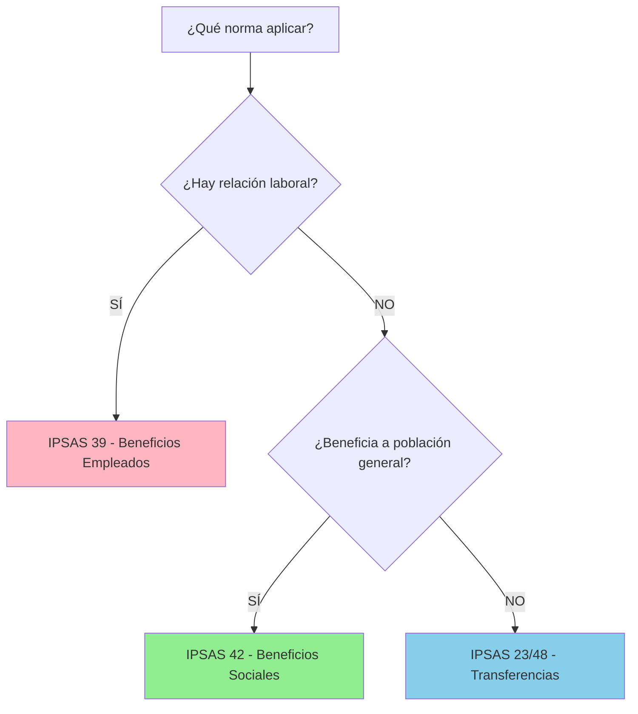
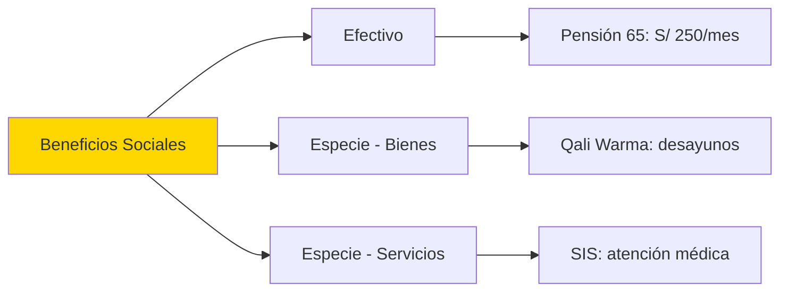
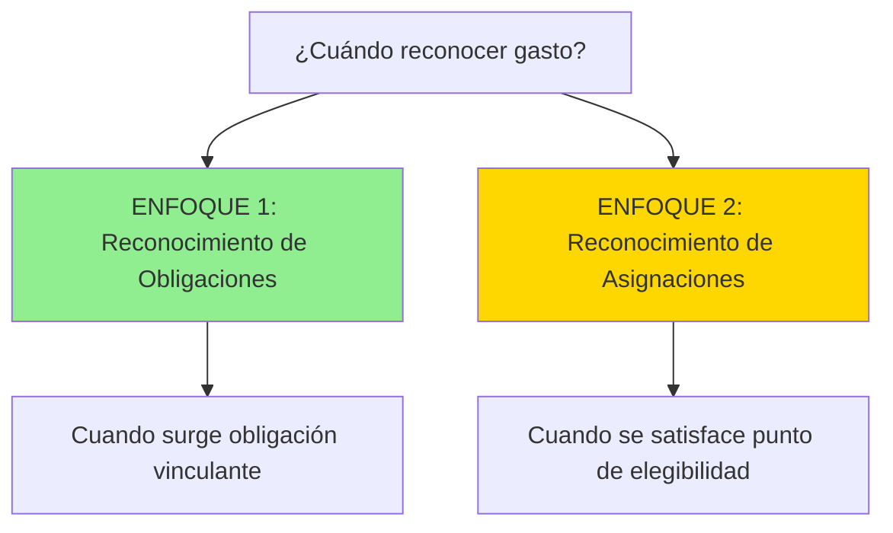
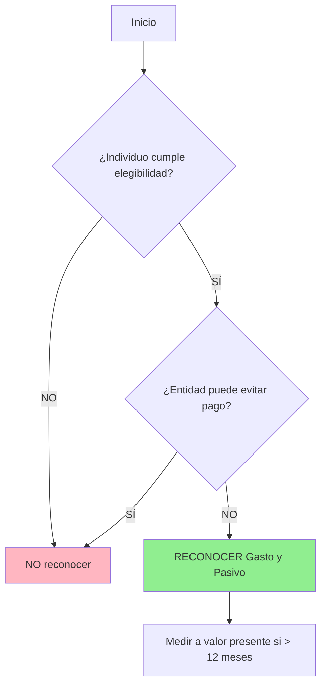

# IPSAS 42 - Beneficios Sociales

## Marco Normativo

**Norma:** IPSAS 42 - _Social Benefits_  
**Emitida por:** IPSASB  
**Fecha emisión:** Enero 2019  
**Vigencia:** Períodos anuales iniciando 1 enero 2023 o después (adopción anticipada permitida)  
**Característica:** **Primera norma específica** para programas sociales del sector público (sin equivalente en sector privado)

**Referencia:** IPSASB (2023). _IPSAS 42 - Social Benefits_. IPSASB Handbook.

---

## Objetivo y Alcance

### Objetivo

> "Prescribir el tratamiento contable de los **beneficios sociales** que las entidades del sector público proporcionan a individuos y hogares para cubrir **riesgos sociales** y necesidades."
>
> **Fuente:** IPSAS 42, Objetivo

### Definición de Beneficio Social (IPSAS 42.8)

> **Beneficio Social:** "Transferencias en efectivo o en especie a individuos y hogares **sin contraprestación directa**, para proteger contra **riesgos sociales** (vejez, discapacidad, desempleo, pobreza) y necesidades (educación, vivienda)."

---

### Alcance (IPSAS 42.2-6)

**Incluye:**

- Pensiones **no contributivas** (Pensión 65 Perú)
- Subsidios familiares
- Programas de alimentación escolar (Qali Warma)
- Beneficios por desempleo
- Subsidios vivienda social
- Transferencias condicionadas (Juntos)

**Excluye:**

- **Beneficios a empleados** → IPSAS 39 (relación laboral)
- **Transferencias entre gobiernos** → IPSAS 23/48
- Seguros sociales **contributivos** → IPSAS 39 o normas de seguros



---

## Características de los Beneficios Sociales

### Atributos Clave (IPSAS 42.9-18)

| Característica                   | Descripción                             | Ejemplo Perú                                    |
| -------------------------------- | --------------------------------------- | ----------------------------------------------- |
| **Sin contraprestación**         | Receptor no da nada a cambio (o mínimo) | Pensión 65: adultos mayores reciben sin aportar |
| **Riesgos/Necesidades sociales** | Protege contra eventos adversos         | Juntos: protege contra pobreza extrema          |
| **Beneficiarios individuales**   | Personas/hogares (no entidades)         | Qali Warma: niños escolares                     |
| **Base legal/política**          | Establecido por ley o política pública  | Ley 29792 (Pensión 65)                          |
| **Verificación de elegibilidad** | Cumplir criterios objetivos             | SISFOH: focalización de hogares                 |

**Referencia Perú:** MIDIS (2023). _Sistema de Focalización de Hogares_ (SISFOH).

---

### Clasificación de Beneficios Sociales (IPSAS 42.AG3-AG18)



---

## Enfoque de Reconocimiento: Dos Opciones (IPSAS 42.14-16)

### IPSAS 42 ofrece **elección de política contable:**



**Decisión:** La entidad **elige UNO** y aplica **consistentemente** a todos beneficios sociales similares.

---

### Enfoque 1: Reconocimiento de Obligaciones (IPSAS 42.19-38)

**Principio:** Reconocer gasto y pasivo cuando surge **obligación vinculante** de proporcionar beneficio.

**Obligación vinculante surge cuando (IPSAS 42.22):**

a) **Individuo cumple criterios de elegibilidad** según ley/política, **Y**  
b) Entidad **no tiene alternativa realista** de evitar el desembolso.

---

#### Diagrama de Flujo - Reconocimiento de Obligaciones



---

#### Ejemplo: Pensión 65 (Enfoque Obligaciones)

**Datos Programa Pensión 65:**

- Beneficio: S/ 250 bimestrales a adultos mayores ≥ 65 años en pobreza extrema
- Base legal: Ley 29792, D.S. 081-2011-PCM
- Beneficiarios activos dic-2024: 580,000 personas
- Esperanza de vida promedio beneficiarios: 5 años (estimación)

**Paso 1: ¿Hay obligación vinculante?**

- ✅ Beneficiarios cumplen elegibilidad (edad + pobreza, verificado SISFOH)
- ✅ Ley obliga a MIDIS a pagar (no hay discrecionalidad)
- **Conclusión:** SÍ hay obligación vinculante

**Paso 2: Medición del Pasivo**

**Obligación corto plazo (próximo bimestre):**

$$
\text{Pasivo Corto Plazo} = 580,000 \times S/ 250 = S/ 145,000,000
$$

**Obligación largo plazo (pagos futuros):**

Valor presente de pagos estimados durante 5 años (6 bimestres/año, tasa descuento 6%):

$$
\text{VP} = 145M \times \frac{1 - (1.06)^{-2.5}}{0.06/6} \approx S/ 3,915,000,000
$$

_(Simplificación: asume beneficiarios constantes)_

---

**Asiento 31-dic-2024:**

```
DEBE: Gasto - Pensión 65 (Beneficio Social)    4,060,000,000
HABER: Pasivo Pensión 65 - Corto Plazo            145,000,000
HABER: Pasivo Pensión 65 - Largo Plazo          3,915,000,000
```

**Pagos bimestrales:**

```
DEBE: Pasivo Pensión 65 - Corto Plazo           145,000,000
HABER: Bancos                                    145,000,000
```

---

### Enfoque 2: Reconocimiento de Asignaciones (IPSAS 42.39-50)

**Principio:** Reconocer gasto cuando beneficiario **satisface punto de elegibilidad** para recibir próximo pago (enfoque más cercano a flujo de efectivo).

**Punto de Elegibilidad:** Momento en que individuo cumple criterios para **próxima transferencia**.

---

#### Ejemplo: Juntos (Enfoque Asignaciones)

**Programa Juntos (MIDIS):**

- Transferencia condicionada: S/ 200/bimestre a familias en extrema pobreza
- **Condiciones:** Asistencia escolar niños + controles de salud
- Beneficiarios: 750,000 hogares

**Reconocimiento:**  
Solo se reconoce gasto y pasivo cuando **familia cumple condiciones del bimestre** (verifica asistencia escolar y salud).

**Diciembre 2024:**

- Hogares que **cumplieron** condiciones nov-dic: 720,000 (96%)
- Pago programado: enero 2025

**Asiento 31-dic-2024:**

```
DEBE: Gasto - Programa Juntos                  144,000,000
HABER: Pasivo Juntos - Corto Plazo              144,000,000
(720,000 hogares × S/ 200)
```

**NO se reconoce pasivo** por pagos futuros (solo próximo bimestre).

---

### Comparación de Enfoques

| Aspecto                    | Enfoque Obligaciones                             | Enfoque Asignaciones                               |
| -------------------------- | ------------------------------------------------ | -------------------------------------------------- |
| **Momento reconocimiento** | Al cumplir elegibilidad (toda obligación futura) | Al satisfacer punto de elegibilidad (próximo pago) |
| **Pasivo**                 | **Largo plazo** significativo                    | **Solo corto plazo**                               |
| **Valuación**              | Requiere **actuario** (valor presente)           | **Simple** (próximo desembolso)                    |
| **Conservadurismo**        | **Alto** (reconoce toda obligación futura)       | **Bajo** (solo reconoce próximo)                   |
| **Ejemplo Perú**           | Pensión 65 (vitalicio)                           | Juntos (condicionado bimestral)                    |

**IPSAS 42 permite elegir**, pero debe ser **consistente** (IPSAS 42.16).

---

#### Análisis Pedagógico: ¿Por qué dos enfoques?

**Problema que IPSASB quiso resolver:**  
Los beneficios sociales varían ENORMEMENTE en naturaleza:

- **Vitalicios sin condiciones** (Pensión 65) → Obligación futura clara
- **Condicionados bimestralmente** (Juntos) → Obligación futura incierta

**Dilema conceptual:**  
Si Pensión 65 usa enfoque obligaciones (pasivo S/ 3,915M), el **Estado de Situación Financiera** mostraría pasivos gigantescos que:

- ✅ Son conceptualmente correctos (es una obligación real)
- ❌ Pueden alarmar usuarios no sofisticados ("¿El Estado está quebrado?")

**Razón pedagógica de la elección:**

1. **Enfoque Obligaciones** → Refleja SUSTANCIA ECONÓMICA (matched con IPSAS 39 - pensiones empleados)
   - Ventaja: Comparabilidad con planes pensiones privados
   - Desventaja: Requiere actuario (costo técnico)

2. **Enfoque Asignaciones** → Refleja FLUJO DE CAJA (matched con presupuesto)
   - Ventaja: Simplicidad operativa
   - Desventaja: Subestima obligaciones de largo plazo

**Pregunta socrática:**  
¿Cuál enfoque preferirías si fueras:

- **Contador público** → Obligaciones (rigor técnico)
- **Analista de deuda soberana** → Obligaciones (quiero ver pasivos reales)
- **Ministro de Economía** → Asignaciones (menos pasivo reportado)

**Conclusión IPSASB:**  
Permitir elección, pero requerir **revelación** de política contable para que usuarios sepan qué enfoque se usó.

---

**Ejemplo comparativo numérico - MIDIS 2024:**

Supongamos MIDIS gestiona ambos programas (Pensión 65 + Juntos):

| Enfoque          | Pensión 65 (vitalicio)          | Juntos (condicionado)              | Total Pasivo   |
| ---------------- | ------------------------------- | ---------------------------------- | -------------- |
| **Obligaciones** | S/ 4,060M (CP + LP)             | S/ 144M (solo CP, futuro incierto) | **S/ 4,204M**  |
| **Asignaciones** | S/ 145M (solo próximo bimestre) | S/ 144M (próximo bimestre)         | **S/ 289M**    |
| **Diferencia**   | **-S/ 3,915M**                  | S/ 0                               | **-S/ 3,915M** |

**Impacto en Ratio Deuda/PIB:**  
Si PIB Perú = S/ 1,000,000M, la diferencia entre enfoques es **0.39% del PIB** (solo MIDIS).

---

## Medición (IPSAS 42.51-58)

### Principios Generales

| Plazo          | Medición                                 | Base        |
| -------------- | ---------------------------------------- | ----------- |
| **≤ 12 meses** | Monto **NO descontado** esperado a pagar | IPSAS 42.51 |
| **> 12 meses** | **Valor presente** de pagos futuros      | IPSAS 42.53 |

**Tasa de descuento (IPSAS 42.55):**

- Basada en bonos de gobierno o bonos corporativos AA al cierre del período
- Moneda y plazo consistentes con pagos

---

### Ejemplo: Subsidio Vivienda Social - Fondo MiVivienda

**Programa Techo Propio:**

- Bono habitacional: S/ 37,900 (una sola vez)
- Beneficiarios calificados dic-2024: 15,000 familias
- Desembolso esperado: 50% en 2025, 50% en 2026

**Medición (Enfoque Obligaciones):**

**Pagos 2025 (< 12 meses, NO descontar):**

$$
\text{Corto Plazo} = 7,500 \times 37,900 = S/ 284,250,000
$$

**Pagos 2026 (> 12 meses, descontar al 6%):**

$$
\text{Largo Plazo} = \frac{7,500 \times 37,900}{1.06} = S/ 268,160,377
$$

**Pasivo Total:**

$$
\text{Total} = 284,250,000 + 268,160,377 = S/ 552,410,377
$$

**Asiento 31-dic-2024:**

```
DEBE: Gasto - Techo Propio                    552,410,377
HABER: Pasivo Techo Propio - Corto Plazo       284,250,000
HABER: Pasivo Techo Propio - Largo Plazo       268,160,377
```

---

## Beneficios en Especie (IPSAS 42.59-66)

### Tipos:

**1. Bienes (IPSAS 42.59-62):**

- Alimentos (Qali Warma)
- Medicamentos (SIS)
- Materiales educativos

**Medición:**

- **Entrega directa:** Costo de adquisición
- **Cupones/Vouchers:** Valor de redención esperado

**2. Servicios (IPSAS 42.63-66):**

- Atención médica gratuita (SIS)
- Educación pública
- Transporte subsidiado

**Medición:**

- **Costo de provisión** (salarios personal + infraestructura + suministros)
- **No** valor de mercado (no hay transacción de cambio)

---

### Ejemplo: Qali Warma - Programa Alimentación Escolar

**Datos 2024:**

- Beneficiarios: 4,200,000 escolares
- Días escolares: 180/año
- Costo ración: S/ 1.50/día
- Provisión: Compra directa de alimentos

**Cálculo Gasto Anual:**

$$
\text{Gasto} = 4,200,000 \times 180 \times 1.50 = S/ 1,134,000,000
$$

**Contabilización:**

**Compra de alimentos (mensual):**

```
DEBE: Inventario - Alimentos Qali Warma        94,500,000
HABER: Cuentas por Pagar Proveedores            94,500,000
(S/ 1,134M / 12 meses)
```

**Entrega a escolares (mensual):**

```
DEBE: Gasto - Programa Qali Warma              94,500,000
HABER: Inventario - Alimentos                   94,500,000
```

**Nota:** Gasto se reconoce al **entregar** alimentos, no al comprarlos.

---

## Revelaciones (IPSAS 42.67-81)

### Información Obligatoria

| Revelación                | Detalle                                         |
| ------------------------- | ----------------------------------------------- |
| **Política contable**     | Enfoque usado (obligaciones vs asignaciones)    |
| **Descripción programas** | Naturaleza, beneficiarios, riesgos cubiertos    |
| **Gasto del período**     | Por tipo de beneficio (efectivo/especie)        |
| **Pasivos**               | Corriente y no corriente                        |
| **Supuestos clave**       | Tasa descuento, expectativa vida (si actuarial) |
| **Análisis sensibilidad** | Impacto cambios en supuestos                    |
| **Gestión riesgos**       | Cómo se controla elegibilidad, fraude           |

**Referencia:** IPSAS 42.67-81

---

### Ejemplo Revelación: Nota Estados Financieros MIDIS

**Nota 18: Beneficios Sociales**

_Política Contable:_  
El Ministerio de Desarrollo e Inclusión Social reconoce gastos y pasivos por beneficios sociales siguiendo el **Enfoque de Obligaciones** (IPSAS 42.19-38). Los pasivos de largo plazo se miden al **valor presente** usando tasa de descuento de bonos soberanos (6% anual).

_Programas Principales 2024:_

| Programa   | Beneficiarios | Gasto 2024 (S/ millones) | Pasivo Largo Plazo (S/ millones) |
| ---------- | ------------- | ------------------------ | -------------------------------- |
| Pensión 65 | 580,000       | 348                      | 3,915                            |
| Juntos     | 750,000       | 1,800                    | 0 (enfoque asignaciones)         |
| Qali Warma | 4,200,000     | 1,134                    | 0 (anual)                        |
| **Total**  | **5,530,000** | **3,282**                | **3,915**                        |

_Supuestos Actuariales Pensión 65:_

- Esperanza de vida: 5 años
- Tasa descuento: 6%
- Inflación esperada: 2%

_Análisis de Sensibilidad:_  
Un incremento de 1% en la tasa de descuento reduciría el pasivo de Pensión 65 en S/ 180 millones.

---

## Diferencias con IPSAS 39 (Beneficios a Empleados)

| Aspecto              | IPSAS 39                                  | IPSAS 42                                     |
| -------------------- | ----------------------------------------- | -------------------------------------------- |
| **Relación**         | **Laboral** (empleador-empleado)          | **Social** (Estado-ciudadano)                |
| **Contraprestación** | Servicios laborales                       | **Sin contraprestación** (o mínima)          |
| **Base legal**       | Contrato laboral                          | **Ley/política social**                      |
| **Beneficiarios**    | Empleados de la entidad                   | **Población general** (elegible)             |
| **Ejemplo Perú**     | Pensiones D.L. 20530 (empleados públicos) | Pensión 65 (adultos mayores pobres)          |
| **Reconocimiento**   | Siempre enfoque obligaciones              | **2 enfoques** (obligaciones o asignaciones) |

---

## Caso Integrado: MIDIS - Diciembre 2024

**Datos:**

| Programa     | Tipo                  | Beneficiarios | Monto Unitario | Frecuencia     | Plazo             |
| ------------ | --------------------- | ------------- | -------------- | -------------- | ----------------- |
| Pensión 65   | Efectivo              | 580,000       | S/ 250         | Bimestral      | Vitalicio         |
| Juntos       | Efectivo condicionado | 720,000       | S/ 200         | Bimestral      | Anual (renovable) |
| Qali Warma   | Especie (alimentos)   | 4,200,000     | S/ 1.50/día    | Diario escolar | Anual             |
| Techo Propio | Efectivo (bono)       | 15,000        | S/ 37,900      | Una vez        | 2025-2026         |

**Política:** Enfoque Obligaciones para todos (consistencia).

---

**Cálculos:**

**1. Pensión 65:**

- Corto plazo: S/ 145,000,000 (próximo bimestre)
- Largo plazo: S/ 3,915,000,000 (5 años VP)

**2. Juntos:**

- Corto plazo: S/ 144,000,000 (bimestre condicional)
- Largo plazo: S/ 0 (renovación anual, no obligación vinculante > 1 año)

**3. Qali Warma:**

- Gasto mes: S/ 94,500,000
- Pasivo: S/ 0 (entrega diaria, sin pasivo acumulado)

**4. Techo Propio:**

- Corto plazo: S/ 284,250,000
- Largo plazo: S/ 268,160,377

---

**Asientos Consolidados 31-dic-2024:**

```
DEBE: Gasto - Pensión 65                      4,060,000,000
DEBE: Gasto - Juntos                            144,000,000
DEBE: Gasto - Qali Warma                         94,500,000
DEBE: Gasto - Techo Propio                      552,410,377
HABER: Pasivo Beneficios Sociales - Corriente    573,250,000
HABER: Pasivo Beneficios Sociales - No Corriente 4,183,160,377
HABER: Inventario Alimentos (Qali Warma)          94,500,000
```

**Total Gasto Beneficios Sociales 2024:**

$$
\text{Total} = 4,060M + 144M + 94.5M + 552.4M = S/ 4,850,910,377
$$

---

## Retos de Implementación en Perú

### Desafíos:

| Desafío                     | Descripción                                                 | Impacto                        |
| --------------------------- | ----------------------------------------------------------- | ------------------------------ |
| **Datos beneficiarios**     | SISFOH debe actualizar constantemente elegibilidad          | Afecta medición pasivos        |
| **Valuación actuarial**     | Requiere actuarios para programas vitalicios                | Costo técnico                  |
| **Elección de enfoque**     | Definir política contable (obligaciones vs asignaciones)    | Inconsistencia entre entidades |
| **Integración presupuesto** | Reconciliar devengado (IPSAS 42) vs percibido (presupuesto) | Complejidad administrativa     |

---

## Conexiones con Otras Normas

- [[ipsas-39-beneficios-empleados]] → Diferencia: IPSAS 39 = laboral, IPSAS 42 = social
- [[ipsas-23-ingresos-sin-contraprestacion]] → Ingresos para financiar beneficios sociales (impuestos)
- [[ipsas-48-gastos-transferencias]] → Transferencias a otras entidades (no individuos)
- [[introduccion-gastos]] → Marco conceptual de gastos
- [[ipsas-19-provisiones]] → Provisiones si beneficio es contingente

---

## Resumen Ejecutivo

**Tesis Central:**  
IPSAS 42 regula beneficios sociales (transferencias sin contraprestación a individuos para cubrir riesgos sociales), ofreciendo **dos enfoques** de reconocimiento: **Obligaciones** (reconocer toda obligación futura al surgir) o **Asignaciones** (reconocer solo próximo pago al cumplir elegibilidad), con medición a valor presente si plazo > 12 meses.

**Alcance:**  
Pensiones no contributivas, subsidios, alimentación escolar, transferencias condicionadas → Población general (no empleados).

**Enfoques:**

1. **Obligaciones:** Reconoce pasivo largo plazo (actuarial), conservador
2. **Asignaciones:** Reconoce solo corto plazo, más cercano a caja

**Ejemplos Perú:**

- Pensión 65 (efectivo vitalicio)
- Juntos (condicionado)
- Qali Warma (especie - alimentos)
- Techo Propio (bono habitacional)

**Siguiente Paso:** Ver [[ipsas-48-gastos-transferencias]] para transferencias entre entidades.

---

**Referencias Normativas:**

- IPSASB (2023). _IPSAS 42 - Social Benefits_. IPSASB Handbook.
- MIDIS (2023). _Programas Sociales - Lineamientos de Operación_. Ministerio de Desarrollo e Inclusión Social, Perú.
- MIDIS (2023). _Sistema de Focalización de Hogares_ (SISFOH). MIDIS Perú.
- IPSASB (2019). _Basis for Conclusions - IPSAS 42_. IPSASB.
