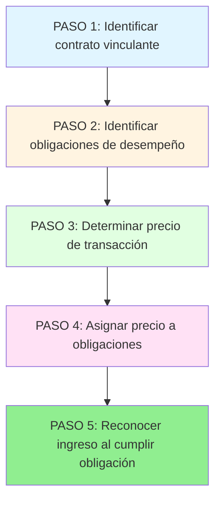
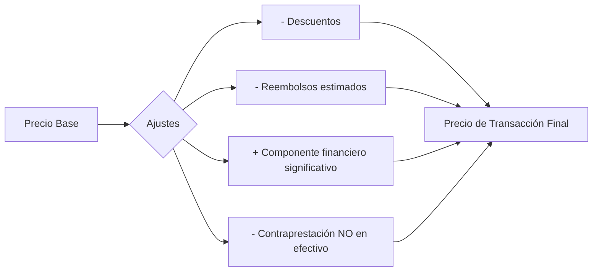
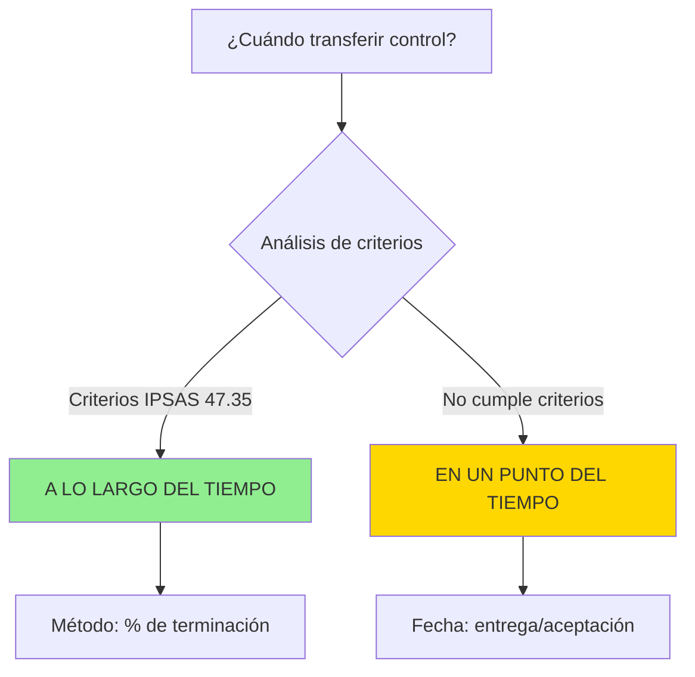
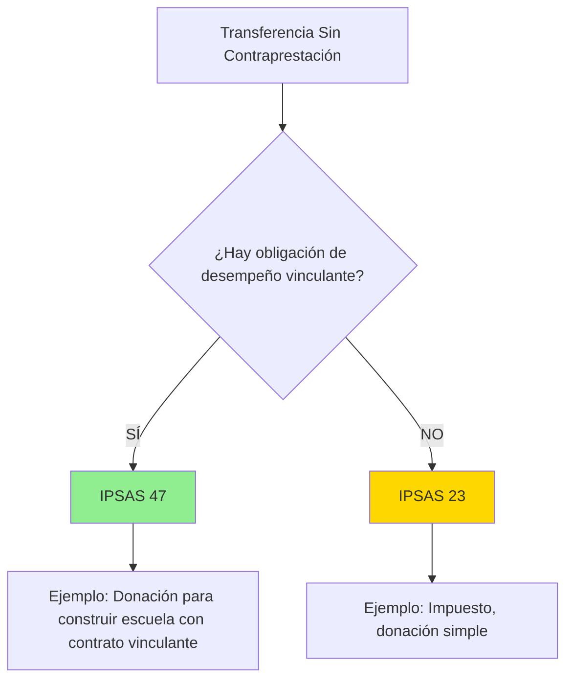

# IPSAS 47 - Ingresos (Nueva Norma Unificada)

## Marco Normativo

**Norma:** IPSAS 47 - _Revenue_  
**Emitida por:** IPSASB  
**Fecha emisión:** Enero 2023  
**Vigencia:** Períodos anuales iniciando 1 enero 2026 o después (adopción anticipada permitida)  
**Base:** IFRS 15 - _Revenue from Contracts with Customers_ (sector privado)  
**Reemplaza:** IPSAS 9 (total) + parte de IPSAS 23 (transacciones con obligaciones de desempeño)

**Referencia:** IPSASB (2023). _IPSAS 47 - Revenue_. www.ipsasb.org

---

### ¿Por qué IPSASB creó IPSAS 47? (Contexto histórico)

**Problema 1: Fragmentación**  
Antes de IPSAS 47, había 2 normas separadas:

- **IPSAS 9** (transacciones de cambio) → Basada en IAS 18 (anticuada)
- **IPSAS 23** (sin contraprestación) → Única del sector público

**Problema 2: Inconsistencia con sector privado**  
IASB emitió IFRS 15 (2014) con modelo de 5 pasos, reemplazando IAS 18.  
**IPSAS 9 quedó desactualizada** (basada en IAS 18 obsoleta).

**Problema 3: Zona gris**  
Muchas transacciones públicas tienen **elementos mixtos**:

- Ejemplo: Universidad cobra matrícula (cambio) + recibe donación (sin contraprestación)
- ¿Qué norma aplicar?

**Solución IPSAS 47:**

1. **Unificar** reconocimiento bajo modelo de 5 pasos
2. **Convergir** con IFRS 15 (facilita comparabilidad público-privado)
3. **Extender** a transacciones sin contraprestación CON obligaciones de desempeño
4. **Mantener** IPSAS 23 para impuestos/transferencias simples (sin obligación de hacer algo)

**Analogía pedagógica:**  
IPSAS 47 es como **iOS 17** (sistema operativo moderno unificado).  
IPSAS 9 + IPSAS 23 eran como **iOS 8 + Android 5** (fragmentado, incompatible).

---

## Objetivo y Alcance

### Objetivo

> "Establecer principios para que una entidad **reconozca y revele información** útil sobre la naturaleza, monto, oportunidad e incertidumbre de los ingresos y flujos de efectivo provenientes de contratos vinculantes."
>
> **Fuente:** IPSAS 47, Objetivo

### Alcance (IPSAS 47.4-10)

**Aplica a:**

1. **Contratos vinculantes** con obligaciones de desempeño (performance obligations)
2. Transacciones de **cambio** (antes IPSAS 9)
3. **Algunas transacciones sin contraprestación** si involucran obligaciones de desempeño

**Fuera de alcance:**

- **Impuestos** (quedan en IPSAS 23)
- **Transferencias simples sin obligación** (quedan en IPSAS 23)
- Arrendamientos (IPSAS 43)
- Instrumentos financieros (IPSAS 41)

---

## Innovación Principal: Modelo de 5 Pasos



**Fuente:** IPSAS 47, párrafos 11-119

---

## Paso 1: Identificar Contrato Vinculante (IPSAS 47.11-22)

### Definición

> **Contrato Vinculante:** "Acuerdo entre dos o más partes que crea derechos y obligaciones **exigibles**."
>
> **Fuente:** IPSAS 47, Apéndice A

### Criterios para Reconocer Contrato:

| Criterio                       | Descripción                           | Ejemplo Sector Público                             |
| ------------------------------ | ------------------------------------- | -------------------------------------------------- |
| **1. Aprobación y compromiso** | Partes están comprometidas            | Municipalidad firma contrato de servicio limpieza  |
| **2. Derechos identificables** | Se identifican derechos de cada parte | Hospital define alcance de servicio de catering    |
| **3. Términos de pago**        | Términos de pago identificables       | Universidad establece arancel S/ 500/semestre      |
| **4. Sustancia comercial**     | La transacción tiene sustancia        | Venta de agua potable tiene flujo de efectivo real |
| **5. Probabilidad de cobro**   | Es probable cobrar contraprestación   | 80% de usuarios pagan tarifas                      |

**Si NO cumple criterios:** No aplicar IPSAS 47 hasta que se cumplan (o aplicar IPSAS 23).

---

## Paso 2: Identificar Obligaciones de Desempeño (IPSAS 47.23-33)

### Definición

> **Obligación de Desempeño:** "Promesa de transferir al cliente:
> a) Un bien o servicio **distinto**, o  
> b) Una serie de bienes/servicios **sustancialmente similares** con mismo patrón de transferencia."
>
> **Fuente:** IPSAS 47.23

### Bien/Servicio es "Distinto" si (IPSAS 47.25):

1. **Cliente puede beneficiarse** del bien/servicio por sí solo o con recursos disponibles, **Y**
2. Promesa de transferir es **identificable separadamente** de otras promesas en el contrato

---

### Ejemplo: Universidad Pública - Programa de Maestría

**Contrato:** Estudiante paga S/ 15,000 por maestría (incluye matrícula, acceso biblioteca digital, tutoría personalizada).

**Análisis de obligaciones:**

| Componente            | ¿Distinto?                             | Obligación de Desempeño                       |
| --------------------- | -------------------------------------- | --------------------------------------------- |
| Clases de maestría    | **NO** (integradas en programa)        | **1 obligación:** Servicio educativo integral |
| Biblioteca digital    | **SÍ** (puede usar independientemente) | **2da obligación:** Acceso a biblioteca       |
| Tutoría personalizada | **NO** (parte del servicio educativo)  | Incluida en obligación 1                      |

**Resultado:** **2 obligaciones de desempeño**

---

## Paso 3: Determinar Precio de Transacción (IPSAS 47.46-71)

### Definición

> "Monto de **contraprestación** a la cual la entidad espera tener derecho a cambio de transferir bienes/servicios al cliente."
>
> **Fuente:** IPSAS 47.46

### Componentes del Precio de Transacción:



**Referencia:** IPSAS 47.48-71

---

### Ejemplo: Contraprestación Variable

**Escenario:** Gobierno Regional contrata consultoría para diseñar sistema de gestión por S/ 200,000 base + bono S/ 50,000 si se implementa en 6 meses (probabilidad 70%).

**Cálculo del Precio de Transacción (método valor esperado):**

$$
\text{Precio} = S/ 200,000 + (S/ 50,000 \times 0.70) = S/ 235,000
$$

**Restricción:** Solo incluir monto por el cual es **altamente probable** que NO haya reversión significativa (IPSAS 47.53).

---

## Paso 4: Asignar Precio a Obligaciones de Desempeño (IPSAS 47.72-86)

### Método de Asignación

**Principio:** Asignar precio de transacción a cada obligación **en proporción a sus precios de venta independientes** (standalone selling prices).

**Fórmula:**

$$
\text{Precio Asignado} = \text{Precio Total} \times \frac{\text{Precio Venta Independiente Obligación}}{\text{Suma Precios Independientes}}
$$

---

### Ejemplo: Universidad - Maestría + Biblioteca

**Datos:**

- Precio total contrato: S/ 15,000
- Precio independiente maestría: S/ 13,000
- Precio independiente biblioteca: S/ 3,000

**Asignación:**

$$
\text{Maestría} = 15,000 \times \frac{13,000}{16,000} = S/ 12,188
$$

$$
\text{Biblioteca} = 15,000 \times \frac{3,000}{16,000} = S/ 2,812
$$

**Referencia:** IPSAS 47.74

---

## Paso 5: Reconocer Ingreso al Cumplir Obligación (IPSAS 47.29-41)

### Momento del Reconocimiento

El ingreso se reconoce cuando (o conforme) la entidad **satisface** la obligación de desempeño al **transferir control** del bien/servicio al cliente.

**¿Qué significa "transferir control"? (Concepto clave pedagógico)**

**Control** = Capacidad de **dirigir el uso** y **obtener beneficios** del activo.

**Analogía del mundo real:**  
Compras un libro físico en librería:

- **Antes de pagar:** Librería tiene control (puede leerlo, venderlo a otro, decidir qué hacer)
- **Después de pagar y entregar:** TÚ tienes control (puedes leerlo, prestarlo, revenderlo, quemarlo)
- **Momento de transferencia de control:** Cuando te lo entregan (no cuando lo pagas, ni cuando lo ves en estante)

**Diferencia con IPSAS 9 (norma antigua):**

- **IPSAS 9:** "Transferencia de riesgos y beneficios" (concepto vago, difícil de aplicar)
- **IPSAS 47:** "Transferencia de control" (concepto más operativo, basado en capacidad de dirigir uso)

**Pregunta socrática:**  
SEDAPAL vende agua a hospital. ¿Cuándo transfiere control?

- ¿Al conectar medidor? ❌ (solo instalación)
- ¿Al consumir agua? ✅ (hospital CONTROLA agua = puede usarla como quiera)
- ¿Al pagar factura? ❌ (pago es posterior al control)

**Respuesta:** Reconocer ingreso conforme hospital **consume agua** (a lo largo del tiempo).

---

### Dos Patrones de Transferencia de Control:



---

### A. Reconocimiento a lo Largo del Tiempo (IPSAS 47.35)

**Se reconoce a lo largo del tiempo si cumple UNO de estos criterios:**

| Criterio                           | Descripción                                                    | Ejemplo Sector Público                   |
| ---------------------------------- | -------------------------------------------------------------- | ---------------------------------------- |
| **(a) Cliente recibe y consume**   | Simultáneamente mientras entidad desempeña                     | Servicio de limpieza diario en hospital  |
| **(b) Entidad crea/mejora activo** | Cliente controla activo conforme se crea                       | Construcción de carretera (obra pública) |
| **(c) Activo sin uso alternativo** | Entidad tiene derecho exigible a pago por desempeño a la fecha | Consultoría personalizada para municipio |

**Método de medición:** % de terminación (input method o output method)

---

### B. Reconocimiento en un Punto del Tiempo (IPSAS 47.38)

**Si NO cumple criterios de "a lo largo del tiempo" → Reconocer cuando cliente obtiene control.**

**Indicadores de transferencia de control (IPSAS 47.38):**

- Entidad tiene derecho presente a pago
- Cliente tiene **posesión física**
- Cliente tiene \*\*títu

lo legal\*\*

- **Riesgos y beneficios** transferidos
- Cliente **aceptó** el activo

**Ejemplo:** Venta de vehículos oficiales a otra entidad → Ingreso al entregar vehículos.

---

## Métodos de Medición del Avance (IPSAS 47.42-45)

### 1. Métodos de Entrada (Input Methods)

Basados en **esfuerzos** de la entidad.

| Método                | Base                               | Ejemplo               |
| --------------------- | ---------------------------------- | --------------------- |
| **Costos incurridos** | Costos a la fecha / Costos totales | S/ 600K / S/ 1M = 60% |
| **Horas trabajadas**  | Horas consumidas / Horas totales   | 120 h / 200 h = 60%   |

### 2. Métodos de Salida (Output Methods)

Basados en **resultados**.

| Método                  | Base                        | Ejemplo                        |
| ----------------------- | --------------------------- | ------------------------------ |
| **Unidades producidas** | Unidades entregadas / Total | 70 km / 100 km carretera = 70% |
| **Hitos alcanzados**    | Hitos completados / Total   | 3 / 5 hitos = 60%              |

---

## Transacciones Sin Contraprestación bajo IPSAS 47

### Análisis de Aplicabilidad

**Pregunta clave:** ¿Hay **obligación de desempeño vinculante**?



**Caso:** ONG dona S/ 2M a Ministerio de Educación para construir escuela con especificaciones técnicas detalladas y supervisión (contrato vinculante).

- **IPSAS 47:** Reconocer ingreso conforme se construye escuela (obligación de desempeño)
- **No IPSAS 23:** Porque hay obligación vinculante de hacer algo específico

---

## Revelaciones (IPSAS 47.AG173-AG204)

### Obligatorias:

1. **Contratos con clientes:**
   - Desglose de ingresos por categoría
   - Saldos de contratos (cuentas por cobrar, pasivos por contrato)
   - Obligaciones de desempeño (naturaleza, plazos)

2. **Juicios significativos:**
   - Determinación de momento de satisfacción
   - Estimaciones de contraprestación variable

3. **Activos/Pasivos de Contrato:**
   - Reconciliación de saldos
   - Explicación de cambios significativos

---

## Diferencias con IPSAS 9 y 23

| Aspecto                 | IPSAS 9/23 (Antes)                                             | IPSAS 47 (Ahora)                               |
| ----------------------- | -------------------------------------------------------------- | ---------------------------------------------- |
| **Modelo**              | Separado (cambio vs sin contraprestación)                      | **Unificado:** modelo de 5 pasos               |
| **Enfoque**             | Tipo de transacción (cambio/sin contraprestación)              | **Obligación de desempeño**                    |
| **Reconocimiento**      | Transferencia de riesgos (IPSAS 9) / Control activo (IPSAS 23) | **Transferencia de control** (unificado)       |
| **Contratos múltiples** | Contabilizar separadamente                                     | **Combinar** si cumplen criterios              |
| **Modificaciones**      | No reguladas específicamente                                   | **Guía detallada** (IPSAS 47.18-21)            |
| **Revelaciones**        | Básicas                                                        | **Extensas** (desglose por categoría, juicios) |

---

## Ejemplo Integrado: Municipalidad de San Isidro

### Contrato: Servicio de Parquímetros (3 años)

**Términos:**

- Municipalidad cobrará S/ 3 por hora de estacionamiento
- Concesionario instala y opera parquímetros
- Municipalidad recibe 60% de recaudación (estimada S/ 1,200,000/año)
- Concesionario proporciona: (1) Instalación parquímetros, (2) Operación 3 años, (3) Mantenimiento

**Aplicación de 5 Pasos:**

#### Paso 1: Contrato Vinculante

✅ Cumple criterios (contrato firmado, derechos claros, probabilidad de cobro)

#### Paso 2: Obligaciones de Desempeño

1. **Instalación parquímetros** (distinta, satisfecha en punto del tiempo)
2. **Operación y mantenimiento 3 años** (serie de servicios sustancialmente iguales, a lo largo del tiempo)

#### Paso 3: Precio de Transacción

S/ 3,600,000 (S/ 1,200,000 × 3 años)

#### Paso 4: Asignación

- Precio independiente instalación: S/ 200,000
- Precio independiente operación 3 años: S/ 3,400,000
- Total: S/ 3,600,000

**No hay asignación proporcional porque precio total = suma independientes.**

#### Paso 5: Reconocimiento

**Año 1:**

```
Instalación (punto del tiempo, al completar):
DEBE: Cuentas por Cobrar                   200,000
HABER: Ingresos - Instalación               200,000

Operación (a lo largo del tiempo, mensual):
DEBE: Cuentas por Cobrar                    94,444
HABER: Ingresos - Operación Parquímetros     94,444
(S/ 1,133,333 / 12 meses)
```

---

## Transición desde IPSAS 9/23 (IPSAS 47.AG205-AG220)

### Métodos de Transición:

**1. Retroactivo Completo (preferido):**

- Aplicar IPSAS 47 como si siempre hubiera estado vigente
- Ajustar períodos comparativos

**2. Retroactivo Modificado:**

- Aplicar IPSAS 47 solo a contratos NO completados al 1 enero 2026
- **NO** ajustar períodos comparativos

**Expedientes prácticos permitidos (IPSAS 47.AG214):**

- No revelar precio de transacción de obligaciones no satisfechas (si contrato < 1 año)
- Usar precio de venta en fecha cercana para estimar precio independiente

---

## Conexiones con Otras Normas

- [[introduccion-ingresos]] → Marco general que IPSAS 47 complementa
- [[ipsas-9-ingresos-cambio]] → Reemplazada por IPSAS 47
- [[ipsas-23-ingresos-sin-contraprestacion]] → Complementaria (impuestos/transferencias simples quedan en IPSAS 23)
- [[ipsas-48-gastos-transferencias]] → Enfoque espejo para quien transfiere
- [[marco-conceptual-nicsp]] → Definición de ingreso

---

## Resumen Ejecutivo

**Tesis Central:**  
IPSAS 47 **unifica** el reconocimiento de ingresos mediante un **modelo de 5 pasos** basado en **obligaciones de desempeño** y **transferencia de control**, convergiendo con IFRS 15 del sector privado, aplicable a transacciones de cambio y algunas sin contraprestación con contratos vinculantes.

**Modelo de 5 Pasos:**

1. Identificar contrato → 2. Identificar obligaciones → 3. Determinar precio → 4. Asignar precio → 5. Reconocer ingreso al cumplir

**Reconocimiento:**  
A lo largo del tiempo (si cumple criterios) o en punto del tiempo (si no)

**Transición:**  
Efectiva 2026 (adopción anticipada permitida) - Reemplaza IPSAS 9, parcialmente IPSAS 23

**Siguiente Paso:** Ver [[ipsas-48-gastos-transferencias]] para enfoque espejo.

---

**Referencias Normativas:**

- IPSASB (2023). _IPSAS 47 - Revenue_. IPSASB.
- IASB (2023). _IFRS 15 - Revenue from Contracts with Customers_ (base de IPSAS 47). IASB.
- IPSASB (2023). _Basis for Conclusions - IPSAS 47_. IPSASB.
- IPSASB (2023). _Implementation Guidance - IPSAS 47_. IPSASB.
